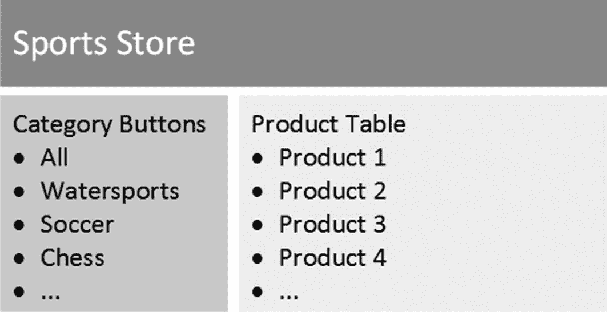
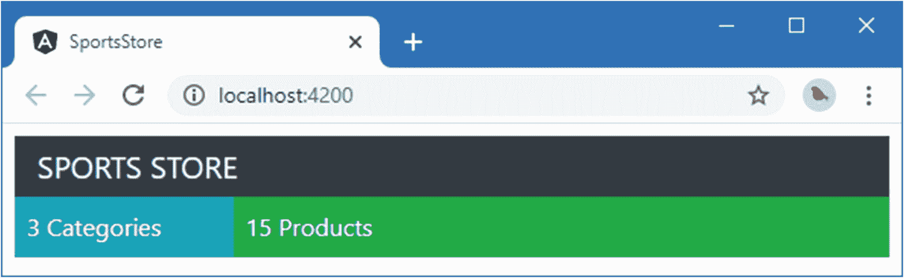
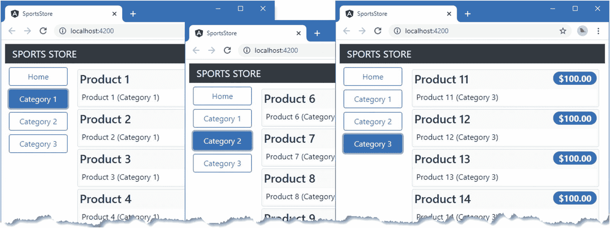

# 七、SportsStore：一个真正的应用

在第 [2](02.html) 章，我构建了一个快速简单的 Angular 应用。小而集中的例子允许我展示特定的 Angular 特征，但它们可能缺乏上下文。为了帮助克服这个问题，我将创建一个简单但现实的电子商务应用。

我的应用名为 SportsStore，将遵循各地在线商店采用的经典方法。我将创建一个客户可以按类别和页面浏览的在线产品目录，一个用户可以添加和删除产品的购物车，以及一个客户可以输入送货细节和下订单的收银台。我还将创建一个管理区域，其中包括用于管理目录的创建、读取、更新和删除(CRUD)工具——我将保护它，以便只有登录的管理员才能进行更改。最后，我将向您展示如何准备和部署 Angular 应用。

我在这一章和接下来的章节中的目标是通过创建尽可能真实的例子来给你一个真实的 Angular 发展的感觉。当然，我想把重点放在 Angular 上，所以我简化了与外部系统的集成，比如数据存储，并完全省略了其他部分，比如支付处理。

SportsStore 是我在几本书中使用的一个例子，尤其是因为它展示了使用不同的框架、语言和开发风格来实现相同结果的方法。你不需要阅读我的任何其他书籍来理解这一章，但是如果你已经拥有我的*Pro ASP.NET Core 3*书，你会发现这种对比很有趣。

我在 SportsStore 应用中使用的 Angular 特征将在后面的章节中详细介绍。我不会在这里重复所有的内容，我告诉您的内容足以让您理解示例应用，并让您参考其他章节以获得更深入的信息。你可以从头到尾阅读 SportsStore 章节，了解 Angular 的工作原理，也可以从细节章节跳转到深度章节。无论哪种方式，都不要指望马上理解所有的东西——Angular 有许多活动的部分，SportsStore 应用旨在向您展示它们是如何组合在一起的，而不是深入到我在本书剩余部分描述的细节中。

## 准备项目

要创建 SportsStore 项目，请打开命令提示符，导航到一个方便的位置，然后运行以下命令:

```ts
ng new SportsStore --routing false --style css --skip-git --skip-tests

```

`angular-cli`包将为 Angular 开发创建一个新项目，包含配置文件、占位符内容和开发工具。项目设置过程可能需要一些时间，因为有许多 NPM 软件包需要下载和安装。

Tip

你可以从 [`https://github.com/Apress/pro-angular-9`](https://github.com/Apress/pro-angular-9) 下载本章以及本书其他章节的示例项目。如果在运行示例时遇到问题，请参见第 [1](01.html) 章获取帮助。

### 安装附加的 NPM 软件包

除了核心 Angular 包和由`ng new`命令设置的构建工具之外，SportsStore 项目还需要额外的包。运行以下命令导航到`SportsStore`文件夹并添加所需的包:

```ts
cd SportsStore
npm install bootstrap@4.4.1
npm install @fortawesome/fontawesome-free@5.12.1
npm install --save-dev json-server@0.16.0
npm install --save-dev jsonwebtoken@8.5.1

```

使用清单中显示的版本号很重要。在添加包时，您可能会看到关于未满足对等依赖关系的警告，但是您可以忽略它们。有些包是使用`--save-dev`参数安装的，这表明它们是在开发过程中使用的，不会成为 SportsStore 应用的一部分。

#### 向应用添加 CSS 样式表

一旦安装了这些包，将清单 [7-1](#PC3) 中所示的语句添加到`angular.json`文件中，将来自引导 CSS 框架和字体 Awesome 包的 CSS 文件合并到应用中。我将对 SportsStore 应用中的所有 HTML 内容使用 Bootstrap CSS 样式，并且我将使用字体 Awesome 包中的图标向用户呈现购物车的摘要。

```ts
...
"architect": {
  "build": {
    "builder": "@angular-devkit/build-angular:browser",
    "options": {
      "outputPath": "dist/SportsStore",
      "index": "src/index.html",
      "main": "src/main.ts",
      "polyfills": "src/polyfills.ts",
      "tsConfig": "src/tsconfig.app.json",
      "assets": [
        "src/favicon.ico",
        "src/assets"
      ],
      "styles": [
        "src/styles.css",
        "node_modules/bootstrap/dist/css/bootstrap.min.css",
        "node_modules/@fortawesome/fontawesome-free/css/all.min.css"
      ],
      "scripts": []
    },
...

Listing 7-1.Adding CSS to the angular.json File in the SportsStore Folder

```

### 准备 RESTful Web 服务

SportsStore 应用将使用异步 HTTP 请求来获取由 RESTful web 服务提供的模型数据。正如我在第 [24](24.html) 章中所描述的，REST 是一种设计 web 服务的方法，它使用 HTTP 方法或动词来指定操作和 URL 来选择操作所应用的数据对象。

在前一节中，我将`json-server`包添加到项目中。这是一个从 JSON 数据或 JavaScript 代码创建 web 服务的优秀包。将清单 [7-2](#PC4) 中所示的语句添加到`package.json`文件的`scripts`部分，这样`json-server`包就可以从命令行启动。

```ts
...
"scripts": {
  "ng": "ng",
  "start": "ng serve",
  "build": "ng build",
  "test": "ng test",
  "lint": "ng lint",
  "e2e": "ng e2e",
  "json": "json-server data.js -p 3500 -m authMiddleware.js"
},
...

Listing 7-2.Adding a Script in the package.json File in the SportsStore Folder

```

为了给`json-server`包提供要处理的数据，我在`SportsStore`文件夹中添加了一个名为`data.js`的文件，并添加了如清单 [7-3](#PC5) 所示的代码，这将确保无论何时启动`json-server`包都可以获得相同的数据，这样我在开发过程中就有了一个固定的参考点。

Tip

创建配置文件时，注意文件名很重要。有些具有`.json`扩展名，这意味着它们包含 JSON 格式的静态数据。其他文件的扩展名为`.js`，这意味着它们包含 JavaScript 代码。Angular 开发所需的每个工具都有关于其配置文件的预期。

```ts
module.exports = function () {
    return {
        products: [
            { id: 1, name: "Kayak", category: "Watersports",
                description: "A boat for one person", price: 275 },
            { id: 2, name: "Lifejacket", category: "Watersports",
                description: "Protective and fashionable", price: 48.95 },
            { id: 3, name: "Soccer Ball", category: "Soccer",
                description: "FIFA-approved size and weight", price: 19.50 },
            { id: 4, name: "Corner Flags", category: "Soccer",
                description: "Give your playing field a professional touch",
                price: 34.95 },
            { id: 5, name: "Stadium", category: "Soccer",
                description: "Flat-packed 35,000-seat stadium", price: 79500 },
            { id: 6, name: "Thinking Cap", category: "Chess",
                description: "Improve brain efficiency by 75%", price: 16 },
            { id: 7, name: "Unsteady Chair", category: "Chess",
                description: "Secretly give your opponent a disadvantage",
                price: 29.95 },
            { id: 8, name: "Human Chess Board", category: "Chess",
                description: "A fun game for the family", price: 75 },
            { id: 9, name: "Bling King", category: "Chess",
                description: "Gold-plated, diamond-studded King", price: 1200 }
        ],
        orders: []
    }
}

Listing 7-3.The Contents of the data.js File in the SportsStore Folder

```

这段代码定义了将由 RESTful web 服务呈现的两个数据集合。`products`集合包含销售给客户的产品，而`orders`集合将包含客户已经下的订单(但是目前是空的)。

RESTful web 服务存储的数据需要受到保护，这样普通用户就不能修改产品或更改订单的状态。`json-server`包不包含任何内置的认证特性，所以我在`SportsStore`文件夹中创建了一个名为`authMiddleware.js`的文件，并添加了清单 [7-4](#PC6) 中所示的代码。

```ts
const jwt = require("jsonwebtoken");

const APP_SECRET = "myappsecret";
const USERNAME = "admin";
const PASSWORD = "secret";

const mappings = {
    get: ["/api/orders", "/orders"],
    post: ["/api/products", "/products", "/api/categories", "/categories"]
}

function requiresAuth(method, url) {
    return (mappings[method.toLowerCase()] || [])
        .find(p => url.startsWith(p)) !== undefined;
}

module.exports = function (req, res, next) {
    if (req.url.endsWith("/login") && req.method == "POST") {
        if (req.body && req.body.name == USERNAME && req.body.password == PASSWORD) {
            let token = jwt.sign({ data: USERNAME, expiresIn: "1h" }, APP_SECRET);
            res.json({ success: true, token: token });
        } else {
            res.json({ success: false });
        }
        res.end();
        return;
    } else if (requiresAuth(req.method, req.url)) {
        let token = req.headers["authorization"] || "";
        if (token.startsWith("Bearer<")) {
            token = token.substring(7, token.length - 1);
            try {
                jwt.verify(token, APP_SECRET);
                next();
                return;
            } catch (err) { }
        }
        res.statusCode = 401;
        res.end();
        return;
    }
    next();
}

Listing 7-4.The Contents of the authMiddleware.js File in the SportsStore Folder

```

这段代码检查发送到 RESTful web 服务的 HTTP 请求，并实现一些基本的安全特性。这是与 Angular 开发没有直接关系的服务器端代码，所以如果它的目的不是很明显，也不用担心。我在第 [9](09.html) 章解释认证授权过程，包括如何用 Angular 认证用户。

Caution

除了 SportsStore 应用之外，不要使用清单 [7-4](#PC6) 中的代码。它包含硬连线到代码中的弱密码。这对于 SportsStore 项目来说很好，因为重点是用 Angular 进行客户端开发，但是这并不适合真实的项目。

### 准备 HTML 文件

每个 Angular web 应用都依赖于浏览器加载的 HTML 文件，该文件用于加载和启动应用。编辑`SportsStore/src`文件夹中的`index.html`文件，删除占位符内容，并添加清单 [7-5](#PC7) 中所示的元素。

```ts
<!doctype html>
<html lang="en">
<head>
  <meta charset="utf-8">
  <title>SportsStore</title>
  <base href="/">
  <meta name="viewport" content="width=device-width, initial-scale=1">
  <link rel="icon" type="image/x-icon" href="favicon.ico">
</head>
<body class="m-2">
  <app>SportsStore Will Go Here</app>
</body>
</html>

Listing 7-5.Preparing the index.html File in the src Folder

```

HTML 文档包含一个`app`元素，它是 SportsStore 功能的占位符。还有一个`base`元素，这是 Angular URL 路由特性所需要的，我在第 [8](08.html) 章将它添加到了 SportsStore 项目中。

### 创建文件夹结构

设置 Angular 应用的一个重要部分是创建文件夹结构。`ng new`命令建立一个项目，将应用的所有文件放在`src`文件夹中，Angular 文件放在`src/app`文件夹中。为了给项目添加一些结构，创建如表 [7-1](#Tab1) 所示的附加文件夹。

表 7-1。

SportsStore 项目所需的附加文件夹

<colgroup><col class="tcol1 align-left"> <col class="tcol2 align-left"></colgroup> 
| 

文件夹

 | 

描述

 |
| --- | --- |
| `SportsStore/src/app/model` | 该文件夹将包含数据模型的代码。 |
| `SportsStore/src/app/store` | 该文件夹将包含基本购物功能。 |
| `SportsStore/src/app/admin` | 该文件夹将包含管理功能。 |

### 运行示例应用

确保所有更改都已保存，并在 SportsStore 文件夹中运行以下命令:

```ts
ng serve --open

```

该命令将启动由`ng new`命令设置的开发工具，每当检测到变更时，该工具将自动编译并打包`src`文件夹中的代码和内容文件。一个新的浏览器窗口将会打开并显示如图 [7-1](#Fig1) 所示的内容。


图 7-1。

运行示例应用

开发 web 服务器将在端口 4200 上启动，因此应用的 URL 将是`http://localhost:4200`。您不必包含 HTML 文档的名称，因为`index.html`是服务器响应的默认文件。(您将在浏览器的 JavaScript 控制台中看到错误，暂时可以忽略。)

### 启动 RESTful Web 服务

要启动 RESTful web 服务，打开一个新的命令提示符，导航到`SportsStore`文件夹，并运行以下命令:

```ts
npm run json

```

RESTful web 服务被配置为在端口 3500 上运行。为了测试 web 服务请求，使用浏览器请求 URL `http://localhost:3500/products/1`。浏览器将显示清单 [7-3](#PC5) 中定义的产品之一的 JSON 表示，如下所示:

```ts
{
  "id": 1,
  "name": "Kayak",
  "category": "Watersports",
  "description": "A boat for one person",
  "price": 275
}

```

## 准备 Angular 投影特征

每个 Angular 的项目都需要一些基本的准备。在接下来的小节中，我将替换占位符内容来构建 SportsStore 应用的基础。

### 更新根组件

根组件是 Angular 构建块，它将管理清单 [7-5](#PC7) 中 HTML 文档中`app`元素的内容。一个应用可以包含许多组件，但是总有一个根组件负责呈现给用户的顶层内容。我在`SportsStore/src/app`文件夹中编辑了名为`app.component.ts`的文件，并用清单 [7-6](#PC11) 中的语句替换了现有代码。

```ts
import { Component } from "@angular/core";

@Component({
  selector: "app",
  template: `<div class="bg-success p-2 text-center text-white">
                    This is SportsStore
               </div>`
})
export class AppComponent { }

Listing 7-6.The Contents of the app.component.ts File in the src/app Folder

```

`@Component`装饰器告诉 Angular,`AppComponent`类是一个组件，它的属性配置如何应用组件。所有组件属性都在第 [17 章](17.html)中描述，但是列表中显示的属性是最基本和最常用的。`selector`属性告诉 Angular 如何在 HTML 文档中应用组件，而`template`属性定义了组件将显示的 HTML 内容。组件可以定义内联模板，就像这样，或者它们使用外部 HTML 文件，这样可以更容易地管理复杂的内容。

在`AppComponent`类中没有代码，因为 Angular 项目中的根组件只是用来管理显示给用户的内容。最初，我将手动管理根组件显示的内容，但是在第 [8](08.html) 章中，我使用了一个名为 *URL 路由*的特性来根据用户动作自动调整内容。

### 更新根模块

有两种 Angular 模块:特征模块和根模块。功能模块用于对相关的应用功能进行分组，以使应用更易于管理。我为应用的每个主要功能区域创建功能模块，包括数据模型、呈现给用户的商店界面和管理界面。

根模块用于描述对 Angular 的应用。描述包括运行应用需要哪些特性模块，应该加载哪些定制特性，以及根组件的名称。根组件文件的常规名称是`app.module.ts`，它创建在`SportsStore/src/app`文件夹中。目前不需要对此文件进行任何更改；清单 [7-7](#PC12) 显示了它的初始内容。

```ts
import { BrowserModule } from '@angular/platform-browser';
import { NgModule } from '@angular/core';
import { AppComponent } from './app.component';

@NgModule({
  declarations: [AppComponent],
  imports: [BrowserModule],
  providers: [],
  bootstrap: [AppComponent]
})
export class AppModule { }

Listing 7-7.The Contents of the app.module.ts File in the src/app Folder

```

与根组件类似，根模块的类中没有代码。这是因为根模块的真正存在只是为了通过`@NgModule`装饰器提供信息。属性`imports`告诉 Angular 它应该加载`BrowserModule`特性模块，该模块包含 web 应用所需的核心 Angular 特性。

`declarations`属性告诉 Angular 它应该加载根组件，`providers`属性告诉 Angular 应用使用的共享对象，`bootstrap`属性告诉 Angular 根组件是`AppComponent`类。当我向 SportsStore 应用添加特性时，我将向这个装饰器的属性添加信息，但是这个基本配置足以启动应用。

### 检查引导文件

下一步是启动应用的引导文件。这本书的重点是使用 Angular 来创建在 web 浏览器中工作的应用，但是 Angular 平台可以移植到不同的环境中。引导文件使用 Angular 浏览器平台加载根模块并启动应用。不需要对`SportsStore/src`文件夹中的`main.ts`文件的内容进行修改，如清单 [7-8](#PC13) 所示。

```ts
import { enableProdMode } from '@angular/core';
import { platformBrowserDynamic } from '@angular/platform-browser-dynamic';

import { AppModule } from './app/app.module';
import { environment } from './environments/environment';

if (environment.production) {
  enableProdMode();
}

platformBrowserDynamic().bootstrapModule(AppModule)
  .catch(err => console.log(err));

Listing 7-8.The Contents of the main.ts File in the src Folder

```

开发工具检测项目文件的变化，编译代码文件，并自动重新加载浏览器，产生如图 [7-2](#Fig2) 所示的内容。


图 7-2。

启动 SportsStore 应用

## 启动数据模型

开始任何新项目的最佳地方是数据模型。我想让您看到一些工作中的 Angular 特性，因此，我将使用虚拟数据来实现一些基本功能，而不是从头到尾定义数据模型。在第 [8](08.html) 章中，我将使用这些数据创建面向用户的特性，然后返回到数据模型，将其连接到 RESTful web 服务。

### 创建模型类

每个数据模型都需要描述数据模型中包含的数据类型的类。对于 SportsStore 应用，这意味着描述商店中销售的产品和从客户那里收到的订单的类。

能够描述产品就足以开始使用 SportsStore 应用，我将创建其他模型类来支持我实现的特性。我在`SportsStore/src/app/model`文件夹中创建了一个名为`product.model.ts`的文件，并添加了清单 [7-9](#PC14) 中所示的代码。

```ts
export class Product {

    constructor(
        public id?: number,
        public name?: string,
        public category?: string,
        public description?: string,
        public price?: number) { }
}

Listing 7-9.The Contents of the product.model.ts File in the src/app/model Folder

```

`Product`类定义了一个接受`id`、`name`、`category`、`description`和`price`属性的构造函数，这些属性对应于用来填充清单 [7-3](#PC5) 中 RESTful web 服务的数据结构。参数名称后面的问号(`?`字符)表示这些是可选参数，在使用`Product`类创建新对象时可以省略，这在编写使用 HTML 表单填充模型对象属性的应用时很有用。

### 创建虚拟数据源

为了准备从虚拟数据到真实数据的转换，我将使用数据源提供应用数据。应用的其余部分不知道数据来自哪里，这将无缝地切换到使用 HTTP 请求获取数据。

我在`SportsStore/src/app/model`文件夹中添加了一个名为`static.datasource.ts`的文件，并定义了清单 [7-10](#PC15) 中所示的类。

```ts
import { Injectable } from "@angular/core";
import { Product } from "./product.model";
import { Observable, from } from "rxjs";

@Injectable()
export class StaticDataSource {
    private products: Product[] = [
        new Product(1, "Product 1", "Category 1", "Product 1 (Category 1)", 100),
        new Product(2, "Product 2", "Category 1", "Product 2 (Category 1)", 100),
        new Product(3, "Product 3", "Category 1", "Product 3 (Category 1)", 100),
        new Product(4, "Product 4", "Category 1", "Product 4 (Category 1)", 100),
        new Product(5, "Product 5", "Category 1", "Product 5 (Category 1)", 100),
        new Product(6, "Product 6", "Category 2", "Product 6 (Category 2)", 100),
        new Product(7, "Product 7", "Category 2", "Product 7 (Category 2)", 100),
        new Product(8, "Product 8", "Category 2", "Product 8 (Category 2)", 100),
        new Product(9, "Product 9", "Category 2", "Product 9 (Category 2)", 100),
        new Product(10, "Product 10", "Category 2", "Product 10 (Category 2)", 100),
        new Product(11, "Product 11", "Category 3", "Product 11 (Category 3)", 100),
        new Product(12, "Product 12", "Category 3", "Product 12 (Category 3)", 100),
        new Product(13, "Product 13", "Category 3", "Product 13 (Category 3)", 100),
        new Product(14, "Product 14", "Category 3", "Product 14 (Category 3)", 100),
        new Product(15, "Product 15", "Category 3", "Product 15 (Category 3)", 100),
    ];

    getProducts(): Observable<Product[]> {
        return from([this.products]);
    }
}

Listing 7-10.The Contents of the static.datasource.ts File in the src/app/model Folder

```

`StaticDataSource`类定义了一个名为`getProducts`的方法，它返回虚拟数据。调用`getProducts`方法的结果是一个`Observable<Product[]>`，它是一个产生`Product`对象数组的`Observable`。

`Observable`类由 Reactive Extensions 包提供，Angular 使用它来处理应用中的状态变化。我在第 [23](23.html) 章中描述了`Observable`类，但是对于这一章来说，知道一个`Observable`对象代表一个将在未来某个时刻产生结果的异步任务就足够了。Angular 公开了它对某些特性的`Observable`对象的使用，包括发出 HTTP 请求，这就是为什么`getProducts`方法返回一个`Observable<Product[]>`而不是简单地同步返回数据。

`@Injectable`装饰器已经应用于`StaticDataSource`类。这个装饰器用来告诉 Angular 这个类将被用作一个服务，它允许其他类通过一个叫做*依赖注入*的特性来访问它的功能，这个特性在第 [19](19.html) 和 [20](20.html) 章中有描述。随着应用的形成，您将看到服务是如何工作的。

Tip

注意，我必须从`@angular/core` JavaScript 模块导入`Injectable`，这样我就可以应用`@Injectable`装饰器。我不会强调我为 SportsStore 示例导入的所有不同的 Angular 类，但是您可以在描述它们相关特性的章节中获得完整的细节。

### 创建模型库

数据源负责向应用提供它所需要的数据，但是对这些数据的访问通常是通过一个*库*来完成的，这个库负责将这些数据分发到各个应用构建模块，这样就可以隐藏如何获得数据的细节。我在`SportsStore/src/app/model`文件夹中添加了一个名为`product.repository.ts`的文件，并定义了清单 [7-11](#PC16) 中所示的类。

```ts
import { Injectable } from "@angular/core";
import { Product } from "./product.model";
import { StaticDataSource } from "./static.datasource";

@Injectable()
export class ProductRepository {
    private products: Product[] = [];
    private categories: string[] = [];

    constructor(private dataSource: StaticDataSource) {
        dataSource.getProducts().subscribe(data => {
            this.products = data;
            this.categories = data.map(p => p.category)
                .filter((c, index, array) => array.indexOf(c) == index).sort();
        });
    }

    getProducts(category: string = null): Product[] {
        return this.products
            .filter(p => category == null || category == p.category);
    }

    getProduct(id: number): Product {
        return this.products.find(p => p.id == id);
    }

    getCategories(): string[] {
        return this.categories;
    }
}

Listing 7-11.The Contents of the product.repository.ts File in the src/app/model Folder

```

当 Angular 需要创建一个新的存储库实例时，它将检查这个类，并发现它需要一个`StaticDataSource`对象来调用`ProductRepository`构造函数并创建一个新对象。

存储库构造器调用数据源的`getProducts`方法，然后对返回的`Observable`对象使用`subscribe`方法来接收产品数据。关于`Observable`物体如何工作的细节，参见第 [23](23.html) 章。

### 创建特征模块

我将定义一个 Angular 特征模型，它将允许数据模型功能在应用中的其他地方轻松使用。我在`SportsStore/src/app/model`文件夹中添加了一个名为`model.module.ts`的文件，并定义了清单 [7-12](#PC17) 中所示的类。

Tip

不要担心所有的文件名似乎相似和混乱。在阅读本书的其他章节时，您将会习惯 Angular 应用的结构方式，并且很快就能看到 Angular 项目中的文件，知道它们的用途。

```ts
import { NgModule } from "@angular/core";
import { ProductRepository } from "./product.repository";
import { StaticDataSource } from "./static.datasource";

@NgModule({
    providers: [ProductRepository, StaticDataSource]
})
export class ModelModule { }

Listing 7-12.The Contents of the model.module.ts File in the src/app/model Folder

```

`@NgModule`装饰器用于创建特性模块，它的属性告诉 Angular 应该如何使用模块。这个模块中只有一个属性`providers`，它告诉 Angular 哪些类应该被用作依赖注入特性的服务，这在第 [19](19.html) 和 [20](20.html) 章中有描述。特征模块和`@NgModule`装饰器在第 [21](21.html) 章中描述。

## 开店

既然数据模型已经就绪，我可以开始构建商店功能，这将让用户看到待售的产品并为它们下订单。商店的基本结构将是一个两列布局，带有允许过滤产品列表的类别按钮和一个包含产品列表的表格，如图 [7-3](#Fig3) 所示。



图 7-3。

商店的基本结构

在接下来的部分中，我将使用 Angular 特征和模型中的数据来创建图中所示的布局。

### 创建商店组件和模板

随着您对 Angular 的熟悉，您将会了解到，可以将各种功能组合起来，以不同的方式解决同一问题。我试图在 SportsStore 项目中引入一些变化，以展示一些重要的 Angular 特征，但为了能够快速启动项目，我暂时将事情保持简单。

考虑到这一点，store 功能的起点将是一个新的组件，它是一个向 HTML 模板提供数据和逻辑的类，该模板包含动态生成内容的数据绑定。我在`SportsStore/src/app/store`文件夹中创建了一个名为`store.component.ts`的文件，并定义了清单 [7-13](#PC18) 中所示的类。

```ts
import { Component } from "@angular/core";
import { Product } from "../model/product.model";
import { ProductRepository } from "../model/product.repository";

@Component({
    selector: "store",
    templateUrl: "store.component.html"
})
export class StoreComponent {

    constructor(private repository: ProductRepository) { }

    get products(): Product[] {
        return this.repository.getProducts();
    }

    get categories(): string[] {
        return this.repository.getCategories();
    }
}

Listing 7-13.The Contents of the store.component.ts File in the src/app/store Folder

```

`@Component`装饰器已经应用于`StoreComponent`类，它告诉 Angular 它是一个组件。装饰器的属性告诉 Angular 如何将组件应用于 HTML 内容(使用一个叫做`store`的元素)以及如何找到组件的模板(在一个叫做`store.component.html`的文件中)。

`StoreComponent`类提供了支持模板内容的逻辑。构造函数接收一个`ProductRepository`对象作为参数，它是通过第 [20](20.html) 和 [21](21.html) 章中描述的依赖注入特性提供的。该组件定义了`products`和`categories`属性，这些属性将用于使用从存储库中获得的数据在模板中生成 HTML 内容。为了给组件提供模板，我在`SportsStore/src/app/store`文件夹中创建了一个名为`store.component.html`的文件，并添加了清单 [7-14](#PC19) 中所示的 HTML 内容。

```ts
<div class="container-fluid">
  <div class="row">
    <div class="col bg-dark text-white">
      <a class="navbar-brand">SPORTS STORE</a>
    </div>
  </div>
  <div class="row text-white">
    <div class="col-3 bg-info p-2">
      {{categories.length}} Categories
    </div>
    <div class="col-9 bg-success p-2">
      {{products.length}} Products
    </div>
  </div>
</div>

Listing 7-14.The Contents of the store.component.html File in the src/app/store Folder

```

模板很简单，只是入门。大多数元素为商店布局提供了结构，并应用了一些引导 CSS 类。目前只有两个 Angular 数据绑定，分别用`{{`和`}}`字符表示。这些是*字符串插值*绑定，它们告诉 Angular 计算绑定表达式并将结果插入到元素中。这些绑定中的表达式显示了商店组件提供的产品和类别的数量。

### 创建商店功能模块

目前还没有太多的商店功能，但即使如此，还需要做一些额外的工作来将其连接到应用的其余部分。为了创建商店功能的 Angular 特征模块，我在`SportsStore/src/app/store`文件夹中创建了一个名为`store.module.ts`的文件，并添加了清单 [7-15](#PC20) 中所示的代码。

```ts
import { NgModule } from "@angular/core";
import { BrowserModule } from "@angular/platform-browser";
import { FormsModule } from "@angular/forms";
import { ModelModule } from "../model/model.module";
import { StoreComponent } from "./store.component";

@NgModule({
    imports: [ModelModule, BrowserModule, FormsModule],
    declarations: [StoreComponent],
    exports: [StoreComponent]
})
export class StoreModule { }

Listing 7-15.The Contents of the store.module.ts File in the src/app/store Folder

```

`@NgModule`装饰器配置模块，使用`imports`属性告诉 Angular 存储模块依赖于模型模块以及`BrowserModule`和`FormsModule`，它们包含 web 应用和 HTML 表单元素的标准 Angular 特性。装饰器使用`declarations`属性告诉 Angular 关于`StoreComponent`类的信息，而`exports`属性告诉 Angular 该类也可以用于应用的其他部分，这很重要，因为它将被根模块使用。

### 更新根组件和根模块

应用基本模型和商店功能需要更新应用的根模块以导入两个特征模块，还需要更新根模块的模板以添加商店模块中的组件将应用到的 HTML 元素。清单 [7-16](#PC21) 显示了对根组件模板的更改。

```ts
import { Component } from "@angular/core";

@Component({
    selector: "app",
    template: "<store></store>"
})
export class AppComponent { }

Listing 7-16.Adding an Element in the app.component.ts File in the src/app Folder

```

`store`元素替换了根组件模板中先前的内容，并对应于清单 [7-13](#PC18) 中`@Component`装饰器的`selector`属性值。清单 [7-17](#PC22) 显示了根模块所需的更改，以便对包含商店功能的特征模块进行 Angular 加载。

```ts
import { NgModule } from "@angular/core";
import { BrowserModule } from "@angular/platform-browser";
import { AppComponent } from "./app.component";
import { StoreModule } from "./store/store.module";

@NgModule({
    imports: [BrowserModule, StoreModule],
    declarations: [AppComponent],
    bootstrap: [AppComponent]
})
export class AppModule { }

Listing 7-17.Importing Feature Modules in the app.module.ts File in the src/app Folder

```

当您将更改保存到根模块时，Angular 将拥有加载应用和显示来自 store 模块的内容所需的所有细节，如图 [7-4](#Fig4) 所示。

如果您没有看到预期的结果，那么停止 Angular 开发工具，并使用`ng serve`命令再次启动它们。这将重复项目的构建过程，并且应该反映您所做的更改。

上一节中创建的所有构件一起工作来显示内容——诚然很简单——显示有多少产品以及它们属于多少类别。



图 7-4。

SportsStore 应用的基本功能

## 添加商店特色产品详情

Angular 开发的本质是从一个缓慢的开始开始，因为项目的基础已经就位，基本的构建块已经创建。但是一旦这样做了，就可以相对容易地创建新的功能。在接下来的部分中，我将向商店添加一些功能，以便用户可以看到提供的产品。

### 显示产品详情

显而易见的起点是展示产品的细节，这样顾客就可以看到有什么优惠。清单 [7-18](#PC23) 通过数据绑定将 HTML 元素添加到商店组件的模板中，为组件提供的每个产品生成内容。

```ts
<div class="container-fluid">
  <div class="row">
    <div class="col bg-dark text-white">
      <a class="navbar-brand">SPORTS STORE</a>
    </div>
  </div>
  <div class="row">
    <div class="col-3 bg-info p-2 text-white">
      {{categories.length}} Categories
    </div>
    <div class="col-9 p-2">
      <div *ngFor="let product of products" class="card m-1 p-1 bg-light">
        <h4>
          {{product.name}}
          <span class="badge badge-pill badge-primary float-right">
            {{ product.price | currency:"USD":"symbol":"2.2-2" }}
          </span>
        </h4>
        <div class="card-text bg-white p-1">{{product.description}}</div>
      </div>
    </div>
</div>

Listing 7-18.Adding Elements in the store.component.html File in the src/app/store Folder

```

大多数元素控制内容的布局和外观。最重要的变化是添加了 Angular 数据绑定表达式。

```ts
...
<div *ngFor="let product of products" class="card m-1 p-1 bg-light">
...

```

这是一个指令的例子，它转换应用它的 HTML 元素。这个特定的指令叫做`ngFor`，它通过为组件的`products`属性返回的每个对象复制`div`元素来转换它。Angular 包括一系列内置指令，执行最常见的所需任务，如第 [13](13.html) 章所述。

因为它复制了`div`元素，所以当前对象被赋给一个名为`product`的变量，这允许它在其他数据绑定中被引用，比如这个，它将当前产品的`name`描述属性的值作为`div`元素的内容插入:

```ts
...
<div class="card-text p-1 bg-white">{{product.description}}</div>
...

```

并非应用数据模型中的所有数据都可以直接显示给用户。Angular 包含一个名为 *pipes* 的特性，这些类用于转换或准备数据值，以便在数据绑定中使用。Angular 包含了几个内置管道，包括`currency`管道，它将数字值格式化为货币，如下所示:

```ts
...
{{ product.price | currency:"USD":"symbol":"2.2-2" }}
...

```

应用管道的语法可能有点笨拙，但是这个绑定中的表达式告诉 Angular 使用`currency`管道格式化当前产品的`price`属性，使用美国的货币惯例。保存对模板的修改，您将看到数据模型中的产品列表显示为一个长列表，如图 [7-5](#Fig5) 所示。


图 7-5。

显示产品信息

### 添加类别选择

添加对按类别过滤产品列表的支持需要准备 store 组件，以便它跟踪用户想要显示的类别，并需要更改检索数据的方式以使用该类别，如清单 [7-19](#PC27) 所示。

```ts
import { Component } from "@angular/core";
import { Product } from "../model/product.model";
import { ProductRepository } from "../model/product.repository";

@Component({
    selector: "store",
    templateUrl: "store.component.html"
})
export class StoreComponent {
    public selectedCategory = null;

    constructor(private repository: ProductRepository) {}

    get products(): Product[] {
        return this.repository.getProducts(this.selectedCategory);
    }

    get categories(): string[] {
        return this.repository.getCategories();
    }

    changeCategory(newCategory?: string) {
        this.selectedCategory = newCategory;
    }
}

Listing 7-19.Adding Category Filtering in the store.component.ts File in the src/app/store Folder

```

这些变化很简单，因为它们建立在本章开始时花了很长时间创建的基础上。`selectedCategory`属性被分配给用户选择的类别(其中`null`表示所有类别)，并在`updateData`方法中用作`getProducts`方法的参数，将过滤委托给数据源。`changeCategory`方法将这两个成员放在一个方法中，当用户选择类别时可以调用这个方法。

清单 [7-20](#PC28) 显示了对组件模板的相应更改，为用户提供了一组按钮，用于更改所选的类别，并显示选择了哪个类别。

```ts
<div class="container-fluid">
  <div class="row">
    <div class="col bg-dark text-white">
      <a class="navbar-brand">SPORTS STORE</a>
    </div>
  </div>
  <div class="row">
    <div class="col-3 p-2">
      <button class="btn btn-block btn-outline-primary" (click)="changeCategory()">
        Home
      </button>
      <button *ngFor="let cat of categories"
              class="btn btn-outline-primary btn-block"
              [class.active]="cat == selectedCategory" (click)="changeCategory(cat)">
        {{cat}}
      </button>
    </div>
    <div class="col-9 p-2">
      <div *ngFor="let product of products" class="card m-1 p-1 bg-light">
        <h4>
          {{product.name}}
          <span class="badge badge-pill badge-primary float-right">
            {{ product.price | currency:"USD":"symbol":"2.2-2" }}
          </span>
        </h4>
        <div class="card-text bg-white p-1">{{product.description}}</div>
      </div>
    </div>
  </div>
</div>

Listing 7-20.Adding Category Buttons in the store.component.html File in the src/app/store Folder

```

模板中有两个新的`button`元素。第一个是 Home 按钮，它有一个事件绑定，当按钮被单击时调用组件的`changeCategory`方法。该方法没有提供任何参数，其效果是将类别设置为`null`，并选择所有产品。

`ngFor`绑定已经应用于另一个`button`元素，其中一个表达式将为组件的`categories`属性返回的数组中的每个值重复该元素。`button`有一个`click`事件绑定，其表达式调用`changeCategory`方法选择当前类别，该类别将过滤显示给用户的产品。还有一个`class`绑定，当与按钮关联的类别是选中的类别时，它将`button`元素添加到`active`类中。当类别被过滤时，这为用户提供了视觉反馈，如图 [7-6](#Fig6) 所示。



图 7-6。

选择产品类别

### 添加产品分页

按类别过滤产品有助于使产品列表更易于管理，但更典型的方法是将列表分成更小的部分，并将每个部分显示为一个页面，并带有在页面之间移动的导航按钮。清单 [7-21](#PC29) 增强了商店组件，这样它就可以跟踪当前页面和页面上的商品数量。

```ts
import { Component } from "@angular/core";
import { Product } from "../model/product.model";
import { ProductRepository } from "../model/product.repository";

@Component({
    selector: "store",
    templateUrl: "store.component.html"
})
export class StoreComponent {
    public selectedCategory = null;
    public productsPerPage = 4;
    public selectedPage = 1;

    constructor(private repository: ProductRepository) {}

    get products(): Product[] {
        let pageIndex = (this.selectedPage - 1) * this.productsPerPage
        return this.repository.getProducts(this.selectedCategory)
            .slice(pageIndex, pageIndex + this.productsPerPage);
    }

    get categories(): string[] {
        return this.repository.getCategories();
    }

    changeCategory(newCategory?: string) {
        this.selectedCategory = newCategory;
    }

    changePage(newPage: number) {
        this.selectedPage = newPage;
    }

    changePageSize(newSize: number) {
        this.productsPerPage = Number(newSize);
        this.changePage(1);
    }

    get pageNumbers(): number[] {
        return Array(Math.ceil(this.repository
            .getProducts(this.selectedCategory).length / this.productsPerPage))
                .fill(0).map((x, i) => i + 1);
    }
}

Listing 7-21.Adding Pagination Support in the store.component.ts File in the src/app/store Folder

```

这个清单中有两个新特性。第一个是获取产品页面的能力，第二个是改变页面的大小，允许改变每个页面包含的产品数量。

奇怪的是，该组件必须解决这个问题。Angular 提供的内置`ngFor`指令有一个限制，它只能为数组或集合中的对象生成内容，而不能使用计数器。由于我需要生成带编号的页面导航按钮，这意味着我需要创建一个包含我需要的数字的数组，如下所示:

```ts
...
return Array(Math.ceil(this.repository.getProducts(this.selectedCategory).length
    / this.productsPerPage)).fill(0).map((x, i) => i + 1);
...

```

该语句创建一个新数组，用值`0`填充它，然后使用`map`方法生成一个带有数字序列的新数组。这足以很好地实现分页特性，但感觉有些笨拙，我将在下一节演示一种更好的方法。清单 [7-22](#PC31) 展示了对商店组件模板的更改，以实现分页特性。

```ts
<div class="container-fluid">
  <div class="row">
    <div class="col bg-dark text-white">
      <a class="navbar-brand">SPORTS STORE</a>
    </div>
  </div>
  <div class="row">
    <div class="col-3 p-2">
      <button class="btn btn-block btn-outline-primary" (click)="changeCategory()">
        Home
      </button>
      <button *ngFor="let cat of categories"
              class="btn btn-outline-primary btn-block"
              [class.active]="cat == selectedCategory" (click)="changeCategory(cat)">
        {{cat}}
      </button>
    </div>
    <div class="col-9 p-2">
      <div *ngFor="let product of products" class="card m-1 p-1 bg-light">
        <h4>
          {{product.name}}
          <span class="badge badge-pill badge-primary float-right">
            {{ product.price | currency:"USD":"symbol":"2.2-2" }}
          </span>
        </h4>
        <div class="card-text bg-white p-1">{{product.description}}</div>
      </div>

      <div class="form-inline float-left mr-1">
        <select class="form-control" [value]="productsPerPage"
                (change)="changePageSize($event.target.value)">
          <option value="3">3 per Page</option>
          <option value="4">4 per Page</option>
          <option value="6">6 per Page</option>
          <option value="8">8 per Page</option>
        </select>
      </div>

      <div class="btn-group float-right">
        <button *ngFor="let page of pageNumbers" (click)="changePage(page)"
                class="btn btn-outline-primary"
                [class.active]="page == selectedPage">
          {{page}}
        </button>
      </div>
    </div>
  </div>
</div>

Listing 7-22.Adding Pagination in the store.component.html File in the src/app/store Folder

```

新元素添加了一个`select`元素，允许改变页面的大小，以及一组在产品页面中导航的按钮。新元素具有数据绑定，将它们绑定到组件提供的属性和方法。结果是一组更易于管理的产品，如图 [7-7](#Fig7) 所示。

Tip

清单 [7-22](#PC31) 中的`select`元素由静态定义的`option`元素填充，而不是使用来自组件的数据创建的。这样做的一个影响是，当选择的值被传递给`changePageSize`方法时，它将是一个`string`值，这就是为什么在用于设置清单 [7-21](#PC29) 中的页面大小之前，参数被解析为一个`number`。从 HTML 元素接收数据值时必须小心，以确保它们是预期的类型。在这种情况下，TypeScript 类型批注没有帮助，因为数据绑定表达式是在运行时计算的，而此时 TypeScript 编译器已经生成了不包含额外类型信息的 JavaScript 代码。


图 7-7。

产品分页

### 创建自定义指令

在本节中，我将创建一个自定义指令，这样我就不必生成一个充满数字的数组来创建页面导航按钮。Angular 提供了大量的内置指令，但是创建您自己的指令来解决特定于您的应用的问题或者支持内置指令没有的特性是一个简单的过程。我在`src/app/store`文件夹中添加了一个名为`counter.directive.ts`的文件，并用它来定义清单 [7-23](#PC32) 中所示的类。

```ts
import {
    Directive, ViewContainerRef, TemplateRef, Input, Attribute, SimpleChanges
} from "@angular/core";

@Directive({
    selector: "[counterOf]"
})
export class CounterDirective {

    constructor(private container: ViewContainerRef,
        private template: TemplateRef<Object>) {
    }

    @Input("counterOf")
    counter: number;

    ngOnChanges(changes: SimpleChanges) {
        this.container.clear();
        for (let i = 0; i < this.counter; i++) {
            this.container.createEmbeddedView(this.template,
                new CounterDirectiveContext(i + 1));
        }
    }
}

class CounterDirectiveContext {
    constructor(public $implicit: any) { }
}

Listing 7-23.The Contents of the counter.directive.ts File in the src/app/store Folder

```

这是一个结构指令的例子，在第 [16](16.html) 章中有详细描述。这个指令通过一个`counter`属性应用于元素，并依赖 Angular 提供的特殊特性来重复创建内容，就像内置的`ngFor`指令一样。在这种情况下，自定义指令不会生成集合中的每个对象，而是生成一系列可用于创建页面导航按钮的数字。

Tip

该指令删除它创建的所有内容，并在页数改变时重新开始。在更复杂的指令中，这可能是一个昂贵的过程，我会在第 [16](16.html) 章解释如何提高性能。

要使用该指令，必须将其添加到其特性模块的`declarations`属性中，如清单 [7-24](#PC33) 所示。

```ts
import { NgModule } from "@angular/core";
import { BrowserModule } from "@angular/platform-browser";
import { FormsModule } from "@angular/forms";
import { ModelModule } from "../model/model.module";
import { StoreComponent } from "./store.component";
import { CounterDirective } from "./counter.directive";

@NgModule({
    imports: [ModelModule, BrowserModule, FormsModule],
    declarations: [StoreComponent, CounterDirective],
    exports: [StoreComponent]
})
export class StoreModule { }

Listing 7-24.Registering the Custom Directive in the store.module.ts File in the src/app/store Folder

```

现在该指令已经注册，可以在商店组件的模板中使用它来替换`ngFor`指令，如清单 [7-25](#PC34) 所示。

```ts
<div class="container-fluid">
  <div class="row">
    <div class="col bg-dark text-white">
      <a class="navbar-brand">SPORTS STORE</a>
    </div>
  </div>
  <div class="row">

    <div class="col-3 p-2">
      <button class="btn btn-block btn-outline-primary" (click)="changeCategory()">
        Home
      </button>
      <button *ngFor="let cat of categories"
           class="btn btn-outline-primary btn-block"
           [class.active]="cat == selectedCategory" (click)="changeCategory(cat)">
        {{cat}}
      </button>
    </div>

    <div class="col-9 p-2">
      <div *ngFor="let product of products" class="card m-1 p-1 bg-light">
        <h4>
          {{product.name}}
          <span class="badge badge-pill badge-primary float-right">
            {{ product.price | currency:"USD":"symbol":"2.2-2" }}
          </span>
        </h4>
        <div class="card-text bg-white p-1">{{product.description}}</div>
      </div>

      <div class="form-inline float-left mr-1">
        <select class="form-control" [value]="productsPerPage"
                (change)="changePageSize($event.target.value)">
          <option value="3">3 per Page</option>
          <option value="4">4 per Page</option>
          <option value="6">6 per Page</option>
          <option value="8">8 per Page</option>
        </select>
      </div>

      <div class="btn-group float-right">
        <button *counter="let page of pageCount" (click)="changePage(page)"
            class="btn btn-outline-primary" [class.active]="page == selectedPage">
          {{page}}
        </button>
      </div>

    </div>
  </div>
</div>

Listing 7-25.Replacing the Built-in Directive in the store.component.html File in the src/app/store Folder

```

新的数据绑定依赖于一个名为`pageCount`的属性来配置自定义指令。在清单 [7-26](#PC35) 中，我用一个提供表达式值的简单的`number`代替了数字数组。

```ts
import { Component } from "@angular/core";
import { Product } from "../model/product.model";
import { ProductRepository } from "../model/product.repository";

@Component({
    selector: "store",
    templateUrl: "store.component.html"
})
export class StoreComponent {
    public selectedCategory = null;
    public productsPerPage = 4;
    public selectedPage = 1;

    constructor(private repository: ProductRepository) {}

    get products(): Product[] {
        let pageIndex = (this.selectedPage - 1) * this.productsPerPage
        return this.repository.getProducts(this.selectedCategory)
            .slice(pageIndex, pageIndex + this.productsPerPage);
    }

    get categories(): string[] {
        return this.repository.getCategories();
    }

    changeCategory(newCategory?: string) {
        this.selectedCategory = newCategory;
    }

    changePage(newPage: number) {
        this.selectedPage = newPage;
    }

    changePageSize(newSize: number) {
        this.productsPerPage = Number(newSize);
        this.changePage(1);
    }

    get pageCount(): number {
        return Math.ceil(this.repository
            .getProducts(this.selectedCategory).length / this.productsPerPage)
    }

    //get pageNumbers(): number[] {
    //    return Array(Math.ceil(this.repository
    //        .getProducts(this.selectedCategory).length / this.productsPerPage))
    //            .fill(0).map((x, i) => i + 1);
    //}
}

Listing 7-26.Supporting the Custom Directive in the store.component.ts File in the src/app/store Folder

```

SportsStore 应用在视觉上没有变化，但本节已经演示了可以使用定制代码来补充内置的 Angular 功能，这些代码是根据特定项目的需求定制的。

## 摘要

在这一章中，我启动了 SportsStore 项目。本章的前一部分花在创建项目的基础上，包括创建应用的根构建块和开始特性模块的工作。一旦有了基础，我就能够快速地添加向用户显示虚拟模型数据的特性，添加分页，并按类别过滤产品。在本章的最后，我创建了一个自定义指令来演示如何通过自定义代码来补充 Angular 提供的内置特性。在下一章，我将继续构建 SportsStore 应用。