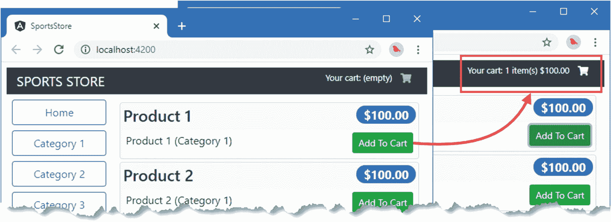
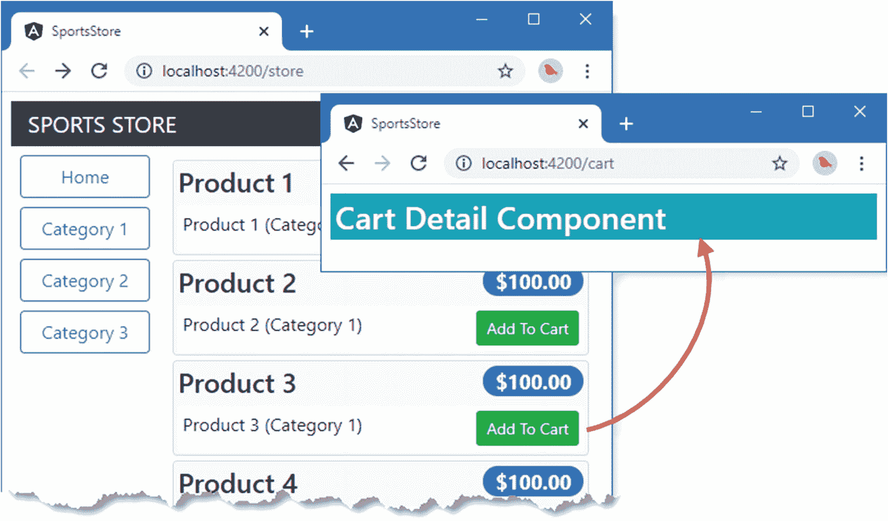
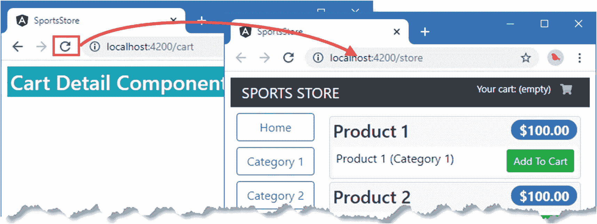
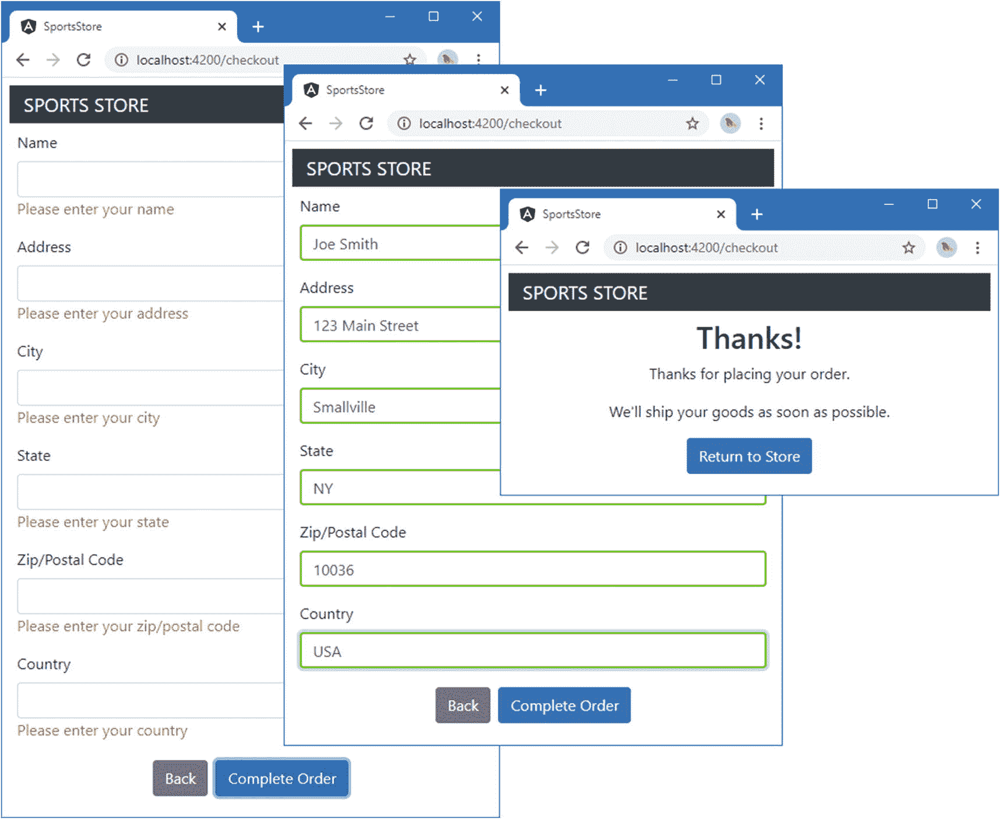
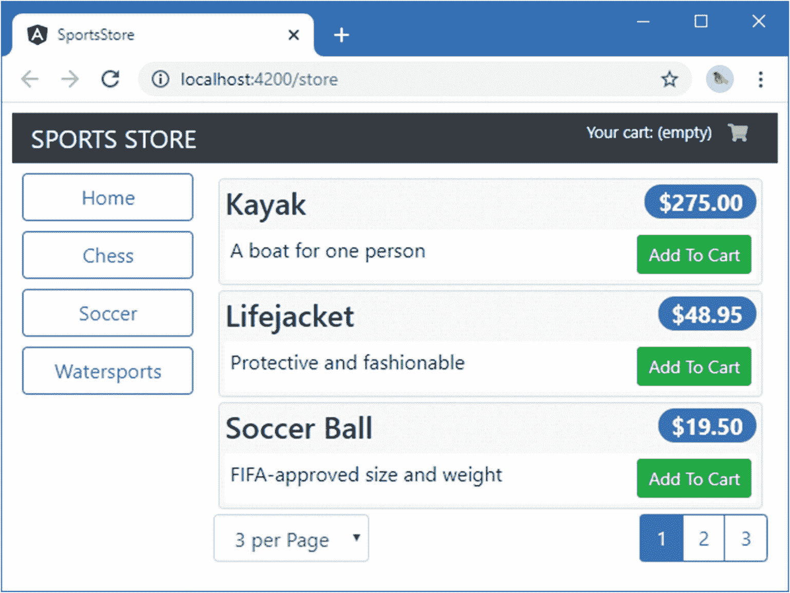

# 八、SportsStore：订单和结账

在本章中，我继续向我在第 [7](07.html) 章中创建的 SportsStore 应用添加特性。我添加了对购物车和结账流程的支持，并用来自 RESTful web 服务的数据替换了虚拟数据。

## 准备示例应用

本章不需要准备，继续使用第 [7 章](07.html)中的 SportsStore 项目。要启动 RESTful web 服务，请打开命令提示符并在`SportsStore`文件夹中运行以下命令:

```ts
npm run json

```

打开第二个命令提示符，在`SportsStore`文件夹中运行以下命令，启动开发工具和 HTTP 服务器:

```ts
ng serve --open

```

Tip

你可以从 [`https://github.com/Apress/pro-angular-9`](https://github.com/Apress/pro-angular-9) 下载本章以及本书其他章节的示例项目。如果在运行示例时遇到问题，请参见第 [1](01.html) 章获取帮助。

## 创建购物车

用户需要一个购物车，产品可以放入其中，并用于开始结帐过程。在接下来的小节中，我将向应用添加一个购物车，并将其集成到商店中，以便用户可以选择他们想要的产品。

### 创建购物车模型

购物车功能的起点是一个新的模型类，它将用于收集用户选择的产品。我在`src/app/model`文件夹中添加了一个名为`cart.model.ts`的文件，并用它来定义清单 [8-1](#PC3) 中所示的类。

```ts
import { Injectable } from "@angular/core";
import { Product } from "./product.model";

@Injectable()
export class Cart {
    public lines: CartLine[] = [];
    public itemCount: number = 0;
    public cartPrice: number = 0;

    addLine(product: Product, quantity: number = 1) {
        let line = this.lines.find(line => line.product.id == product.id);
        if (line != undefined) {
            line.quantity += quantity;
        } else {
            this.lines.push(new CartLine(product, quantity));
        }
        this.recalculate();
    }

    updateQuantity(product: Product, quantity: number) {
        let line = this.lines.find(line => line.product.id == product.id);
        if (line != undefined) {
            line.quantity = Number(quantity);
        }
        this.recalculate();
    }

    removeLine(id: number) {
        let index = this.lines.findIndex(line => line.product.id == id);
        this.lines.splice(index, 1);
        this.recalculate();
    }

    clear() {
        this.lines = [];
        this.itemCount = 0;
        this.cartPrice = 0;
    }

    private recalculate() {
        this.itemCount = 0;
        this.cartPrice = 0;
        this.lines.forEach(l => {
            this.itemCount += l.quantity;
            this.cartPrice += (l.quantity * l.product.price);
        })
    }
}

export class CartLine {

    constructor(public product: Product,
        public quantity: number) {}

    get lineTotal() {
        return this.quantity * this.product.price;
    }
}

Listing 8-1.The Contents of the cart.model.ts File in the src/app/model Folder

```

单个产品选择被表示为一组`CartLine`对象，每个对象包含一个`Product`对象和一个数量。`Cart`类跟踪已经被选中的商品的总数和它们的总价格。

在整个应用中应该使用一个单独的`Cart`对象，确保应用的任何部分都可以访问用户的产品选择。为了实现这一点，我将使`Cart`成为一个服务，这意味着 Angular 将负责创建一个`Cart`类的实例，并在需要创建一个具有`Cart`构造函数参数的组件时使用它。这是 Angular 依赖注入特性的另一个用途，可用于在整个应用中共享对象，这将在第 [19](19.html) 和 [20](20.html) 章中详细描述。已经应用于清单中的`Cart`类的`@Injectable`装饰器表明这个类将被用作服务。

Note

严格地说，只有当一个类有自己的构造函数参数需要解析时，才需要使用`@Injectable`装饰器，但是无论如何应用它都是一个好主意，因为它提供了一个信号，表明这个类打算用作服务。

清单 [8-2](#PC4) 将`Cart`类注册为模型特征模块类的`providers`属性中的服务。

```ts
import { NgModule } from "@angular/core";
import { ProductRepository } from "./product.repository";
import { StaticDataSource } from "./static.datasource";
import { Cart } from "./cart.model";

@NgModule({
    providers: [ProductRepository, StaticDataSource, Cart]
})
export class ModelModule { }

Listing 8-2.Registering the Cart as a Service in the model.module.ts File in the src/app/model Folder

```

### 创建购物车摘要组件

组件是 angle 应用的基本构建块，因为它们允许轻松创建代码和内容的离散单元。SportsStore 应用将在页面的标题区域向用户显示他们的产品选择摘要，我将通过创建一个组件来实现这一点。我在`src/app/store`文件夹中添加了一个名为`cartSummary.component.ts`的文件，并用它来定义清单 [8-3](#PC5) 中所示的组件。

```ts
import { Component } from "@angular/core";
import { Cart } from "../model/cart.model";

@Component({
    selector: "cart-summary",
    templateUrl: "cartSummary.component.html"
})
export class CartSummaryComponent {

    constructor(public cart: Cart) { }
}

Listing 8-3.The Contents of the cartSummary.component.ts File in the src/app/store Folder

```

当 Angular 需要创建这个组件的实例时，它必须提供一个`Cart`对象作为构造函数参数，使用我在上一节中配置的服务，将`Cart`类添加到特性模块的`providers`属性中。服务的默认行为意味着一个单独的`Cart`对象将被创建并在整个应用中共享，尽管有不同的服务行为可用(如第 [20 章](20.html)所述)。

为了给组件提供模板，我在组件类文件所在的文件夹中创建了一个名为`cartSummary.component.html`的 HTML 文件，并添加了清单 [8-4](#PC6) 中所示的标记。

```ts
<div class="float-right">
  <small>
    Your cart:
    <span *ngIf="cart.itemCount > 0">
      {{ cart.itemCount }} item(s)
      {{ cart.cartPrice | currency:"USD":"symbol":"2.2-2" }}
    </span>
    <span *ngIf="cart.itemCount == 0">
      (empty)
    </span>
  </small>
  <button class="btn btn-sm bg-dark text-white"
      [disabled]="cart.itemCount == 0">
    <i class="fa fa-shopping-cart"></i>
  </button>
</div>

Listing 8-4.The Contents of the cartSummary.component.html File in the src/app/store Folder

```

该模板使用其组件提供的`Cart`对象来显示购物车中的商品数量和总费用。还有一个按钮，当我在本章后面将它添加到应用时，它将启动结帐过程。

Tip

清单 [8-4](#PC6) 中的按钮元素是使用字体 Awesome 定义的类来设计的，字体 Awesome 是第 [7 章](07.html)的`package.json`文件中的一个包。这个开源包为 web 应用中的图标提供了出色的支持，包括我在 SportsStore 应用中需要的购物车。详见 [`http://fontawesome.io`](http://fontawesome.io) 。

清单 [8-5](#PC7) 向 store 特性模块注册新组件，为下一节使用它做准备。

```ts
import { NgModule } from "@angular/core";
import { BrowserModule } from "@angular/platform-browser";
import { FormsModule } from "@angular/forms";
import { ModelModule } from "../model/model.module";
import { StoreComponent } from "./store.component";
import { CounterDirective } from "./counter.directive";
import { CartSummaryComponent } from "./cartSummary.component";

@NgModule({
    imports: [ModelModule, BrowserModule, FormsModule],
    declarations: [StoreComponent, CounterDirective, CartSummaryComponent],
    exports: [StoreComponent]
})
export class StoreModule { }

Listing 8-5.Registering the Component in the store.module.ts File in the src/app/store Folder

```

### 将购物车整合到商店中

商店组件是将购物车和购物车小部件集成到应用中的关键。清单 [8-6](#PC8) 更新了商店组件，这样它的构造函数就有了一个`Cart`参数，并定义了一个将产品添加到购物车的方法。

```ts
import { Component } from "@angular/core";
import { Product } from "../model/product.model";
import { ProductRepository } from "../model/product.repository";
import { Cart } from "../model/cart.model";

@Component({
    selector: "store",
    templateUrl: "store.component.html"
})
export class StoreComponent {
    public selectedCategory = null;
    public productsPerPage = 4;
    public selectedPage = 1;

    constructor(private repository: ProductRepository,
                private cart: Cart) { }

    get products(): Product[] {
        let pageIndex = (this.selectedPage - 1) * this.productsPerPage
        return this.repository.getProducts(this.selectedCategory)
            .slice(pageIndex, pageIndex + this.productsPerPage);
    }

    get categories(): string[] {
        return this.repository.getCategories();
    }

    changeCategory(newCategory?: string) {
        this.selectedCategory = newCategory;
    }

    changePage(newPage: number) {
        this.selectedPage = newPage;
    }

    changePageSize(newSize: number) {
        this.productsPerPage = Number(newSize);
        this.changePage(1);
    }

    get pageCount(): number {
        return Math.ceil(this.repository
            .getProducts(this.selectedCategory).length / this.productsPerPage)
    }

    addProductToCart(product: Product) {
        this.cart.addLine(product);
    }
}

Listing 8-6.Adding Cart Support in the store.component.ts File in the src/app/store Folder

```

为了完成购物车到商店组件的集成，清单 [8-7](#PC9) 添加了将购物车汇总组件应用到商店组件的模板的元素，并为每个产品描述添加了一个按钮，该按钮带有调用`addProductToCart`方法的事件绑定。

```ts
<div class="container-fluid">
  <div class="row">
    <div class="col bg-dark text-white">
      <a class="navbar-brand">SPORTS STORE</a>
      <cart-summary></cart-summary>
    </div>
  </div>
  <div class="row">

    <div class="col-3 p-2">
      <button class="btn btn-block btn-outline-primary" (click)="changeCategory()">
        Home
      </button>
      <button *ngFor="let cat of categories"
          class="btn btn-outline-primary btn-block"
          [class.active]="cat == selectedCategory" (click)="changeCategory(cat)">
        {{cat}}
      </button>
    </div>

    <div class="col-9 p-2">
      <div *ngFor="let product of products" class="card m-1 p-1 bg-light">
        <h4>
          {{product.name}}
          <span class="badge badge-pill badge-primary float-right">
            {{ product.price | currency:"USD":"symbol":"2.2-2" }}
          </span>
        </h4>
        <div class="card-text bg-white p-1">
          {{product.description}}
          <button class="btn btn-success btn-sm float-right"
                  (click)="addProductToCart(product)">
            Add To Cart
          </button>
        </div>
      </div>

      <div class="form-inline float-left mr-1">
        <select class="form-control" [value]="productsPerPage"
                (change)="changePageSize($event.target.value)">
          <option value="3">3 per Page</option>
          <option value="4">4 per Page</option>
          <option value="6">6 per Page</option>
          <option value="8">8 per Page</option>
        </select>
      </div>

      <div class="btn-group float-right">
        <button *counter="let page of pageCount" (click)="changePage(page)"
            class="btn btn-outline-primary" [class.active]="page == selectedPage">
          {{page}}
        </button>
      </div>

    </div>
  </div>
</div>

Listing 8-7.Applying the Component in the store.component.html File in the src/app/store Folder

```

结果是为每个产品添加一个按钮，如图 [8-1](#Fig1) 所示。整个购物车过程尚未完成，但是您可以在页面顶部的购物车摘要中看到每次添加的效果。



图 8-1。

向 SportsStore 应用添加购物车支持

请注意，单击添加到购物车按钮之一会自动更新摘要组件的内容。发生这种情况是因为两个组件共享一个`Cart`对象，并且当 Angular 评估另一个组件中的数据绑定表达式时，一个组件所做的更改会被反映出来。

## 添加 URL 路由

大多数应用需要在不同的时间向用户显示不同的内容。在 SportsStore 应用中，当用户单击 Add To Cart 按钮时，他们应该看到所选产品的详细视图，并有机会开始结帐过程。

Angular 支持一个名为 *URL 路由*的特性，它使用浏览器显示的当前 URL 来选择显示给用户的组件。这种方法使得创建组件松散耦合的应用变得容易，并且不需要在应用的其他地方进行相应的修改就可以容易地进行更改。URL 路由也使得改变用户通过应用的路径变得容易。

对于 SportsStore 应用，我将添加对三个不同 URL 的支持，如表 [8-1](#Tab1) 中所述。这是一个简单的配置，但是路由系统有很多特性，在章节 [25](25.html) 到 [27](27.html) 中有详细描述。

表 8-1。

SportsStore 应用支持的 URL

<colgroup><col class="tcol1 align-left"> <col class="tcol2 align-left"></colgroup> 
| 

统一资源定位器

 | 

描述

 |
| --- | --- |
| `/store` | 该 URL 将显示产品列表。 |
| `/cart` | 这个 URL 将详细显示用户的购物车。 |
| `/checkout` | 此 URL 将显示结帐过程。 |

在接下来的小节中，我将为 SportsStore 购物车和订单结帐阶段创建占位符组件，然后使用 URL 路由将它们集成到应用中。一旦实现了 URL，我将返回组件并添加更多有用的特性。

### 创建购物车详细信息和结帐组件

在将 URL 路由添加到应用之前，我需要创建将由`/cart`和`/checkout`URL 显示的组件。我只需要一些基本的占位符内容就可以开始了，只是为了清楚地显示哪个组件。我首先在`src/app/store`文件夹中添加一个名为`cartDetail.component.ts`的文件，并定义清单 [8-8](#PC10) 中所示的组件。

```ts
import { Component } from "@angular/core";

@Component({
    template: `<div><h3 class="bg-info p-1 text-white">Cart Detail Component</h3></div>`
})
export class CartDetailComponent {}

Listing 8-8.The Contents of the cartDetail.component.ts File in the src/app/store Folder

```

接下来，我在`src/app/store`文件夹中添加了一个名为`checkout.component.ts`的文件，并定义了清单 [8-9](#PC11) 中所示的组件。

```ts
import { Component } from "@angular/core";

@Component({
    template: `<div><h3 class="bg-info p-1 text-white">Checkout Component</h3></div>`
})
export class CheckoutComponent { }

Listing 8-9.The Contents of the checkout.component.ts File in the src/app/store Folder

```

该组件遵循与购物车组件相同的模式，并显示一条占位符消息。清单 [8-10](#PC12) 在商店功能模块中注册组件，并将它们添加到`exports`属性中，这意味着它们可以在应用的其他地方使用。

```ts
import { NgModule } from "@angular/core";
import { BrowserModule } from "@angular/platform-browser";
import { FormsModule } from "@angular/forms";
import { ModelModule } from "../model/model.module";
import { StoreComponent } from "./store.component";
import { CounterDirective } from "./counter.directive";
import { CartSummaryComponent } from "./cartSummary.component";
import { CartDetailComponent } from "./cartDetail.component";
import { CheckoutComponent } from "./checkout.component";

@NgModule({
    imports: [ModelModule, BrowserModule, FormsModule],
    declarations: [StoreComponent, CounterDirective, CartSummaryComponent,
        CartDetailComponent, CheckoutComponent],
    exports: [StoreComponent, CartDetailComponent, CheckoutComponent]
})
export class StoreModule { }

Listing 8-10.Registering Components in the store.module.ts File in the src/app/store Folder

```

### 创建和应用路由配置

现在我有了一系列要显示的组件，下一步是创建路由配置，告诉 Angular 如何将 URL 映射到组件中。一个 URL 到一个组件的每个映射被称为一个 *URL 路由*或者仅仅是一个*路由*。在第 3 部分中，我创建了更复杂的路由配置，我在一个单独的文件中定义路由，但是对于这个项目，我将遵循一个更简单的方法，在应用根模块的`@NgModule`装饰器中定义路由，如清单 [8-11](#PC13) 所示。

Tip

Angular 路由特性要求 HTML 文档中有一个`base`元素，它提供了应用路由所依据的基本 URL。当我在第 [7 章](07.html)中创建 SportsStore 项目时，这个元素被`ng new`命令添加到了`index.html`文件中。如果忽略该元素，Angular 将报告错误，并且无法应用管线。

```ts
import { NgModule } from "@angular/core";
import { BrowserModule } from "@angular/platform-browser";
import { AppComponent } from "./app.component";
import { StoreModule } from "./store/store.module";
import { StoreComponent } from "./store/store.component";
import { CheckoutComponent } from "./store/checkout.component";
import { CartDetailComponent } from "./store/cartDetail.component";
import { RouterModule } from "@angular/router";

@NgModule({
    imports: [BrowserModule, StoreModule,
        RouterModule.forRoot([
            { path: "store", component: StoreComponent },
            { path: "cart", component: CartDetailComponent },
            { path: "checkout", component: CheckoutComponent },
            { path: "**", redirectTo: "/store" }
        ])],
    declarations: [AppComponent],
    bootstrap: [AppComponent]
})
export class AppModule { }

Listing 8-11.Creating the Routing Configuration in the app.module.ts File in the src/app Folder

```

向`RouterModule.forRoot`方法传递一组路由，每个路由将一个 URL 映射到一个组件。列表中的前三个路由匹配表 [8-1](#Tab1) 中的 URL。最后一个路由是一个通配符，它将任何其他 URL 重定向到`/store`，这将显示`StoreComponent`。

当使用路由特性时，Angular 查找`router-outlet`元素，该元素定义了对应于当前 URL 的组件应该显示的位置。清单 [8-12](#PC14) 用`router-outlet`元素替换根组件模板中的`store`元素。

```ts
import { Component } from "@angular/core";

@Component({
    selector: "app",
    template: "<router-outlet></router-outlet>"
})
export class AppComponent { }

Listing 8-12.Defining the Routing Target in the app.component.ts File in the src/app Folder

```

当您保存更改并且浏览器重新加载 HTML 文档时，Angular 将应用路由配置。浏览器窗口中显示的内容没有改变，但是如果您检查浏览器的 URL 栏，您将能够看到路由配置已经被应用，如图 [8-2](#Fig2) 所示。


图 8-2。

URL 路由的影响

### 在应用中导航

路由配置就绪后，就可以通过更改浏览器的 URL 来添加对组件间导航的支持了。URL 路由功能依赖于浏览器提供的 JavaScript API，这意味着用户不能简单地在浏览器的 URL 栏中键入目标 URL。相反，导航必须由应用来执行，要么在组件或其他构建块中使用 JavaScript 代码，要么在模板中向 HTML 元素添加属性。

当用户单击添加到购物车按钮之一时，应该显示购物车细节组件，这意味着应用应该导航到`/cart` URL。清单 [8-13](#PC15) 向组件方法添加导航，当用户点击按钮时，组件方法被调用。

```ts
import { Component } from "@angular/core";
import { Product } from "../model/product.model";
import { ProductRepository } from "../model/product.repository";
import { Cart } from "../model/cart.model";
import { Router } from "@angular/router";

@Component({
    selector: "store",
    templateUrl: "store.component.html"
})
export class StoreComponent {
    public selectedCategory = null;
    public productsPerPage = 4;
    public selectedPage = 1;

    constructor(private repository: ProductRepository,
        private cart: Cart,
        private router: Router) { }

    get products(): Product[] {
        let pageIndex = (this.selectedPage - 1) * this.productsPerPage
        return this.repository.getProducts(this.selectedCategory)
            .slice(pageIndex, pageIndex + this.productsPerPage);
    }

    get categories(): string[] {
        return this.repository.getCategories();
    }

    changeCategory(newCategory?: string) {
        this.selectedCategory = newCategory;
    }

    changePage(newPage: number) {
        this.selectedPage = newPage;
    }

    changePageSize(newSize: number) {
        this.productsPerPage = Number(newSize);
        this.changePage(1);
    }

    get pageCount(): number {
        return Math.ceil(this.repository
            .getProducts(this.selectedCategory).length / this.productsPerPage)
    }

    addProductToCart(product: Product) {
        this.cart.addLine(product);
        this.router.navigateByUrl("/cart");
    }
}

Listing 8-13.Navigating Using JavaScript in the store.component.ts File in the app/src/store Folder

```

构造函数有一个`Router`参数，它是 Angular 在创建组件的新实例时通过依赖注入特性提供的。在`addProductToCart`方法中，`Router.navigateByUrl`方法用于导航到`/cart` URL。

还可以通过向模板中的元素添加`routerLink`属性来完成导航。在清单 [8-14](#PC16) 中，`routerLink`属性已经应用于购物车汇总组件模板中的购物车按钮。

```ts
<div class="float-right">
  <small>
    Your cart:
    <span *ngIf="cart.itemCount > 0">
      {{ cart.itemCount }} item(s)
      {{ cart.cartPrice | currency:"USD":"symbol":"2.2-2" }}
    </span>
    <span *ngIf="cart.itemCount == 0">
      (empty)
    </span>
  </small>
  <button class="btn btn-sm bg-dark text-white"
      [disabled]="cart.itemCount == 0" routerLink="/cart">
    <i class="fa fa-shopping-cart"></i>
  </button>
</div>

Listing 8-14.Adding Navigation in the cartSummary.component.html File in the src/app/store Folder

```

由`routerLink`属性指定的值是单击`button`时应用将导航到的 URL。当购物车为空时，这个特殊的按钮被禁用，因此只有当用户将产品添加到购物车时，它才会执行导航。

为了增加对`routerLink`属性的支持，必须将`RouterModule`模块导入到特征模块中，如清单 [8-15](#PC17) 所示。

```ts
import { NgModule } from "@angular/core";
import { BrowserModule } from "@angular/platform-browser";
import { FormsModule } from "@angular/forms";
import { ModelModule } from "../model/model.module";
import { StoreComponent } from "./store.component";
import { CounterDirective } from "./counter.directive";
import { CartSummaryComponent } from "./cartSummary.component";
import { CartDetailComponent } from "./cartDetail.component";
import { CheckoutComponent } from "./checkout.component";
import { RouterModule } from "@angular/router";

@NgModule({
    imports: [ModelModule, BrowserModule, FormsModule, RouterModule],
    declarations: [StoreComponent, CounterDirective, CartSummaryComponent,
        CartDetailComponent, CheckoutComponent],
    exports: [StoreComponent, CartDetailComponent, CheckoutComponent]
})
export class StoreModule { }

Listing 8-15.Importing the Router Module in the store.module.ts File in the src/app/store Folder

```

要查看导航的效果，请保存文件的更改，一旦浏览器重新加载了 HTML 文档，请单击“添加到购物车”按钮之一。浏览器将导航到`/cart`网址，如图 [8-3](#Fig3) 所示。



图 8-3。

使用 URL 路由

### 守卫路由

请记住，导航只能由应用来执行。如果您直接在浏览器的 URL 栏中更改 URL，浏览器将从 web 服务器请求您输入的 URL。响应 HTTP 请求的 Angular development 服务器将通过返回`index.html`的内容来响应任何与文件不对应的 URL。这通常是一个有用的行为，因为这意味着当单击浏览器的重新加载按钮时，您不会收到 HTTP 错误。但是，如果应用希望用户按照特定的路径在应用中导航，这可能会导致问题。

例如，如果您单击添加到购物车按钮之一，然后单击浏览器的重新加载按钮，HTTP 服务器将返回`index.html`文件的内容，Angular 将立即跳转到购物车详细信息组件，跳过应用中允许用户选择产品的部分。

对于一些应用，能够开始使用不同的 URL 是有意义的，但如果不是这样，那么 Angular 支持*路由守卫*，用于管理路由系统。

为了防止应用以`/cart`或`/order` URL 开始，我在`SportsStore/src/app`文件夹中添加了一个名为`storeFirst.guard.ts`的文件，并定义了清单 [8-16](#PC18) 中所示的类。

```ts
import { Injectable } from "@angular/core";
import {
    ActivatedRouteSnapshot, RouterStateSnapshot,
    Router
} from "@angular/router";
import { StoreComponent } from "./store/store.component";

@Injectable()
export class StoreFirstGuard {
    private firstNavigation = true;

    constructor(private router: Router) { }

    canActivate(route: ActivatedRouteSnapshot,
        state: RouterStateSnapshot): boolean {
        if (this.firstNavigation) {
            this.firstNavigation = false;
            if (route.component != StoreComponent) {
                this.router.navigateByUrl("/");
                return false;
            }
        }
        return true;
    }
}

Listing 8-16.The Contents of the storeFirst.guard.ts File in the src/app Folder

```

有不同的方法来保护路由，如第 [27 章](27.html)所述，这是一个防止路由被激活的保护的例子，它被实现为一个定义了`canActivate`方法的类。这个方法的实现使用 Angular 提供的描述将要导航到的路由的上下文对象，并检查目标组件是否是一个`StoreComponent`。如果这是第一次调用`canActivate`方法，并且将要使用一个不同的组件，那么`Router.navigateByUrl`方法用于导航到根 URL。

清单中应用了`@Injectable`装饰符，因为路由守卫是服务。清单 [8-17](#PC19) 使用根模块的`providers`属性将守卫注册为服务，并使用`canActivate`属性守卫每条路由。

```ts
import { NgModule } from "@angular/core";
import { BrowserModule } from "@angular/platform-browser";
import { AppComponent } from "./app.component";
import { StoreModule } from "./store/store.module";
import { StoreComponent } from "./store/store.component";
import { CheckoutComponent } from "./store/checkout.component";
import { CartDetailComponent } from "./store/cartDetail.component";
import { RouterModule } from "@angular/router";
import { StoreFirstGuard } from "./storeFirst.guard";

@NgModule({
    imports: [BrowserModule, StoreModule,
        RouterModule.forRoot([
            {
                path: "store", component: StoreComponent,
                canActivate: [StoreFirstGuard]
            },
            {
                path: "cart", component: CartDetailComponent,
                canActivate: [StoreFirstGuard]
            },
            {
                path: "checkout", component: CheckoutComponent,
                canActivate: [StoreFirstGuard]
            },
            { path: "**", redirectTo: "/store" }
        ])],
    providers: [StoreFirstGuard],
    declarations: [AppComponent],
    bootstrap: [AppComponent]
})
export class AppModule { }

Listing 8-17.Guarding Routes in the app.module.ts File in the src/app Folder

```

如果您现在点击“添加到购物车”按钮后重新加载浏览器，您将会看到浏览器自动返回到安全位置，如图 [8-4](#Fig4) 所示。



图 8-4。

守卫路由

## 完成购物车详细信息功能

既然应用有了导航支持，是时候完成详细描述用户购物车内容的视图了。清单 [8-18](#PC20) 从 cart detail 组件中移除内联模板，在同一目录中指定一个外部模板，并向构造函数添加一个`Cart`参数，该参数可在模板中通过一个名为`cart`的属性进行访问。

```ts
import { Component } from "@angular/core";
import { Cart } from "../model/cart.model";

@Component({
    templateUrl: "cartDetail.component.html"
})
export class CartDetailComponent {

    constructor(public cart: Cart) { }
}

Listing 8-18.Changing the Template in the cartDetail.component.ts File in the src/app/store Folder

```

为了完成购物车细节特性，我在`src/app/store`文件夹中创建了一个名为`cartDetail.component.html`的 HTML 文件，并添加了清单 [8-19](#PC21) 中所示的内容。

```ts
<div class="container-fluid">
  <div class="row">
    <div class="col bg-dark text-white">
      <a class="navbar-brand">SPORTS STORE</a>
    </div>
  </div>
  <div class="row">
    <div class="col mt-2">
      <h2 class="text-center">Your Cart</h2>
      <table class="table table-bordered table-striped p-2">
        <thead>
          <tr>
            <th>Quantity</th>
            <th>Product</th>
            <th class="text-right">Price</th>
            <th class="text-right">Subtotal</th>
          </tr>
        </thead>
        <tbody>
          <tr *ngIf="cart.lines.length == 0">
            <td colspan="4" class="text-center">
              Your cart is empty
            </td>
          </tr>
          <tr *ngFor="let line of cart.lines">
            <td>
              <input type="number" class="form-control-sm"
                     style="width:5em"
                     [value]="line.quantity"
                     (change)="cart.updateQuantity(line.product,
                                $event.target.value)" />
            </td>
            <td>{{line.product.name}}</td>
            <td class="text-right">
                {{line.product.price | currency:"USD":"symbol":"2.2-2"}}
            </td>
            <td class="text-right">
                {{(line.lineTotal) | currency:"USD":"symbol":"2.2-2" }}
            </td>
            <td class="text-center">
              <button class="btn btn-sm btn-danger"
                      (click)="cart.removeLine(line.product.id)">
                Remove
              </button>
            </td>
          </tr>
        </tbody>
        <tfoot>
          <tr>
            <td colspan="3" class="text-right">Total:</td>
            <td class="text-right">
              {{cart.cartPrice | currency:"USD":"symbol":"2.2-2"}}
            </td>
          </tr>
        </tfoot>
      </table>
    </div>
  </div>
  <div class="row">
    <div class="col">
    <div class="text-center">
      <button class="btn btn-primary m-1" routerLink="/store">
          Continue Shopping
      </button>
      <button class="btn btn-secondary m-1" routerLink="/checkout"
              [disabled]="cart.lines.length == 0">
        Checkout
      </button>
    </div>
  </div>
</div>

Listing 8-19.The Contents of the cartDetail.component.html File in the src/app/store Folder

```

该模板显示一个表格，其中显示了用户的产品选择。对于每个产品，都有一个`input`元素可用于更改数量，还有一个 Remove 按钮可将其从购物车中删除。还有两个导航按钮，允许用户返回产品列表或继续结账过程，如图 [8-5](#Fig5) 所示。Angular 数据绑定和共享的`Cart`对象的结合意味着对购物车的任何更改都会立即生效，重新计算价格；如果您单击 Continue Shopping 按钮，这些更改将反映在产品列表上方显示的购物车摘要组件中。


图 8-5。

完成购物车详细信息功能

## 处理订单

能够收到顾客的订单是网上商店最重要的方面。在接下来的几节中，我将在应用的基础上添加对从用户处接收最终细节并检查它们的支持。为了保持过程简单，我将避免处理支付和履行平台，它们通常是后端服务，并不特定于 Angular 应用。

### 扩展模型

为了描述用户下的订单，我在`src/app/model`文件夹中添加了一个名为`order.model.ts`的文件，并定义了清单 [8-20](#PC22) 中所示的代码。

```ts
import { Injectable } from "@angular/core";
import { Cart } from "./cart.model";

@Injectable()
export class Order {
    public id: number;
    public name: string;
    public address: string;
    public city: string;
    public state: string;
    public zip: string;
    public country: string;
    public shipped: boolean = false;

    constructor(public cart: Cart) { }

    clear() {
        this.id = null;
        this.name = this.address = this.city = null;
        this.state = this.zip = this.country = null;
        this.shipped = false;
        this.cart.clear();
    }
}

Listing 8-20.The Contents of the order.model.ts File in the src/app/model Folder

```

`Order`类将是另一个服务，这意味着整个应用将共享一个实例。当 Angular 创建`Order`对象时，它将检测`Cart`构造函数参数，并提供应用中其他地方使用的同一个`Cart`对象。

#### 更新存储库和数据源

为了处理应用中的订单，我需要扩展存储库和数据源，以便它们可以接收`Order`对象。清单 [8-21](#PC23) 向接收订单的数据源添加一个方法。因为这仍然是虚拟数据源，所以该方法只是从订单中产生一个 JSON 字符串，并将其写入 JavaScript 控制台。在下一节中，当我创建一个使用 HTTP 请求与 RESTful web 服务通信的数据源时，我将对这些对象做一些更有用的事情。

```ts
import { Injectable } from "@angular/core";
import { Product } from "./product.model";
import { Observable, from } from "rxjs";
import { Order } from "./order.model";

@Injectable()
export class StaticDataSource {
    private products: Product[] = [
        new Product(1, "Product 1", "Category 1", "Product 1 (Category 1)", 100),
        new Product(2, "Product 2", "Category 1", "Product 2 (Category 1)", 100),
        new Product(3, "Product 3", "Category 1", "Product 3 (Category 1)", 100),
        new Product(4, "Product 4", "Category 1", "Product 4 (Category 1)", 100),
        new Product(5, "Product 5", "Category 1", "Product 5 (Category 1)", 100),
        new Product(6, "Product 6", "Category 2", "Product 6 (Category 2)", 100),
        new Product(7, "Product 7", "Category 2", "Product 7 (Category 2)", 100),
        new Product(8, "Product 8", "Category 2", "Product 8 (Category 2)", 100),
        new Product(9, "Product 9", "Category 2", "Product 9 (Category 2)", 100),
        new Product(10, "Product 10", "Category 2", "Product 10 (Category 2)", 100),
        new Product(11, "Product 11", "Category 3", "Product 11 (Category 3)", 100),
        new Product(12, "Product 12", "Category 3", "Product 12 (Category 3)", 100),
        new Product(13, "Product 13", "Category 3", "Product 13 (Category 3)", 100),
        new Product(14, "Product 14", "Category 3", "Product 14 (Category 3)", 100),
        new Product(15, "Product 15", "Category 3", "Product 15 (Category 3)", 100),
    ];

    getProducts(): Observable<Product[]> {
        return from([this.products]);
    }

    saveOrder(order: Order): Observable<Order> {
        console.log(JSON.stringify(order));
        return from([order]);
    }
}

Listing 8-21.Handling Orders in the static.datasource.ts File in the src/app/model Folder

```

为了管理订单，我在`src/app/model`文件夹中添加了一个名为`order.repository.ts`的文件，并用它来定义清单 [8-22](#PC24) 中所示的类。目前订单库中只有一个方法，但是当我创建管理特性时，我会在第 [9](09.html) 章中添加更多的功能。

Tip

您不必为应用中的每个模型类型使用不同的存储库，但我经常这样做，因为负责多个模型类型的单个类可能会变得复杂且难以维护。

```ts
import { Injectable } from "@angular/core";
import { Observable } from "rxjs";
import { Order } from "./order.model";
import { StaticDataSource } from "./static.datasource";

@Injectable()
export class OrderRepository {
    private orders: Order[] = [];

    constructor(private dataSource: StaticDataSource) {}

    getOrders(): Order[] {
        return this.orders;
    }

    saveOrder(order: Order): Observable<Order> {
        return this.dataSource.saveOrder(order);
    }
}

Listing 8-22.The Contents of the order.repository.ts File in the src/app/model Folder

```

#### 更新功能模块

清单 [8-23](#PC25) 使用模型特征模块的`providers`属性将`Order`类和新的存储库注册为服务。

```ts
import { NgModule } from "@angular/core";
import { ProductRepository } from "./product.repository";
import { StaticDataSource } from "./static.datasource";
import { Cart } from "./cart.model";
import { Order } from "./order.model";
import { OrderRepository } from "./order.repository";

@NgModule({
    providers: [ProductRepository, StaticDataSource, Cart,
                Order, OrderRepository]
})
export class ModelModule { }

Listing 8-23.Registering Services in the model.module.ts File in the src/app/model Folder

```

### 收集订单详细信息

下一步是从用户那里收集完成订单所需的详细信息。Angular 包含了处理 HTML 表单和验证其内容的内置指令。清单 [8-24](#PC26) 准备 checkout 组件，切换到外部模板，接收`Order`对象作为构造函数参数，并提供一些额外的支持来帮助模板。

```ts
import { Component } from "@angular/core";
import { NgForm } from "@angular/forms";
import { OrderRepository } from "../model/order.repository";
import { Order } from "../model/order.model";

@Component({
    templateUrl: "checkout.component.html",
    styleUrls: ["checkout.component.css"]
})
export class CheckoutComponent {
    orderSent: boolean = false;
    submitted: boolean = false;

    constructor(public repository: OrderRepository,
                public order: Order) {}

    submitOrder(form: NgForm) {
        this.submitted = true;
        if (form.valid) {
            this.repository.saveOrder(this.order).subscribe(order => {
                this.order.clear();
                this.orderSent = true;
                this.submitted = false;
            });
        }
    }
}

Listing 8-24.Preparing for a Form in the checkout.component.ts File in the src/app/store Folder

```

当用户提交表单时，`submitOrder`方法将被调用，表单由一个`NgForm`对象表示。如果表单包含的数据有效，那么`Order`对象将被传递给存储库的`saveOrder`方法，购物车和订单中的数据将被重置。

`@Component` decorator 的`styleUrls`属性用于指定一个或多个 CSS 样式表，这些样式表应该应用于组件模板中的内容。为了给用户输入 HTML 表单元素的值提供验证反馈，我在`src/app/store`文件夹中创建了一个名为`checkout.component.css`的文件，并定义了清单 [8-25](#PC27) 中所示的样式。

```ts
input.ng-dirty.ng-invalid { border: 2px solid #ff0000 }
input.ng-dirty.ng-valid { border: 2px solid #6bc502 }

Listing 8-25.The Contents of the checkout.component.css File in the src/app/store Folder

```

Angular 将元素添加到`ng-dirty`、`ng-valid`和`ng-valid`类中，以指示它们的验证状态。在第 [14 章](14.html)中描述了全套的验证类，但是清单 [8-25](#PC27) 中样式的效果是在有效的`input`元素周围添加一个绿色边框，在无效的元素周围添加一个红色边框。

拼图的最后一块是组件的模板，它为用户提供填充一个`Order`对象的属性所需的表单域，如清单 [8-26](#PC28) 所示。

```ts
<div class="container-fluid">
  <div class="row">
    <div class="col bg-dark text-white">
      <a class="navbar-brand">SPORTS STORE</a>
    </div>
  </div>
</div>

<div *ngIf="orderSent" class="m-2 text-center">
  <h2>Thanks!</h2>
  <p>Thanks for placing your order.</p>
  <p>We'll ship your goods as soon as possible.</p>
  <button class="btn btn-primary" routerLink="/store">Return to Store</button>
</div>
<form *ngIf="!orderSent" #form="ngForm" novalidate
      (ngSubmit)="submitOrder(form)" class="m-2">
  <div class="form-group">
    <label>Name</label>
    <input class="form-control" #name="ngModel" name="name"
            [(ngModel)]="order.name" required />
    <span *ngIf="submitted && name.invalid" class="text-danger">
      Please enter your name
    </span>
  </div>
  <div class="form-group">
    <label>Address</label>
    <input class="form-control" #address="ngModel" name="address"
            [(ngModel)]="order.address" required />
    <span *ngIf="submitted && address.invalid" class="text-danger">
      Please enter your address
    </span>
  </div>
  <div class="form-group">
    <label>City</label>
    <input class="form-control" #city="ngModel" name="city"
            [(ngModel)]="order.city" required />
    <span *ngIf="submitted && city.invalid" class="text-danger">
      Please enter your city
    </span>
  </div>
  <div class="form-group">
    <label>State</label>
    <input class="form-control" #state="ngModel" name="state"
            [(ngModel)]="order.state" required />
    <span *ngIf="submitted && state.invalid" class="text-danger">
      Please enter your state
    </span>
  </div>
  <div class="form-group">
    <label>Zip/Postal Code</label>
    <input class="form-control" #zip="ngModel" name="zip"
            [(ngModel)]="order.zip" required />
    <span *ngIf="submitted && zip.invalid" class="text-danger">
      Please enter your zip/postal code
    </span>
  </div>
  <div class="form-group">
    <label>Country</label>
    <input class="form-control" #country="ngModel" name="country"
            [(ngModel)]="order.country" required />
    <span *ngIf="submitted && country.invalid" class="text-danger">
      Please enter your country
    </span>
  </div>
  <div class="text-center">
    <button class="btn btn-secondary m-1" routerLink="/cart">Back</button>
    <button class="btn btn-primary m-1" type="submit">Complete Order</button>
  </div>
</form>

Listing 8-26.The Contents of the checkout.component.html File in the src/app/store Folder

```

该模板中的`form`和`input`元素使用 Angular 特性来确保用户为每个字段提供值，如果用户在没有完成表单的情况下单击 Complete Order 按钮，它们会提供视觉反馈。这种反馈一部分来自应用清单 [8-25](#PC27) 中定义的样式，一部分来自在用户试图提交无效表单之前保持隐藏的`span`元素。

Tip

要求值只是 Angular 验证表单域的方式之一，正如我在第 [14](14.html) 章中解释的，你也可以很容易地添加你自己的自定义验证。

要查看该过程，从产品列表开始，单击其中一个添加到购物车按钮，将产品添加到购物车。点击 Checkout 按钮，你会看到如图 [8-6](#Fig6) 所示的 HTML 表单。单击 Complete Order 按钮，无需在任何`input`元素中输入文本，您将看到验证反馈消息。填写表格并单击“完成订单”按钮；您将看到如图所示的确认消息。



图 8-6。

完成订单

如果您查看浏览器的 JavaScript 控制台，您会看到订单的 JSON 表示，如下所示:

```ts
{"cart":
    {"lines":[
        {"product":{"id":1,"name":"Product 1","category":"Category 1",
         "description":"Product 1 (Category 1)","price":100},"quantity":1}],
         "itemCount":1,"cartPrice":100},
    "shipped":false,
    "name":"Joe Smith","address":"123 Main Street",
    "city":"Smallville","state":"NY","zip":"10036","country":"USA"
}

```

## 使用 RESTful Web 服务

既然基本的 SportsStore 功能已经就绪，是时候用一个从 RESTful web 服务获取数据的数据源来替换这个虚拟数据源了，这个 RESTful web 服务是在第 [7](07.html) 章的项目设置期间创建的。

为了创建数据源，我在`src/app/model`文件夹中添加了一个名为`rest.datasource.ts`的文件，并添加了清单 [8-27](#PC30) 中所示的代码。

```ts
import { Injectable } from "@angular/core";
import { HttpClient } from "@angular/common/http";
import { Observable } from "rxjs";
import { Product } from "./product.model";
import { Cart } from "./cart.model";
import { Order } from "./order.model";

const PROTOCOL = "http";
const PORT = 3500;

@Injectable()
export class RestDataSource {
  baseUrl: string;

  constructor(private http: HttpClient) {
    this.baseUrl = `${PROTOCOL}://${location.hostname}:${PORT}/`;
  }

  getProducts(): Observable<Product[]> {
    return this.http.get<Product[]>(this.baseUrl + "products");
  }

  saveOrder(order: Order): Observable<Order> {
    return this.http.post<Order>(this.baseUrl + "orders", order);
  }
}

Listing 8-27.The Contents of the rest.datasource.ts File in the src/app/model Folder

```

Angular 提供了一个名为`HttpClient`的内置服务，用于发出 HTTP 请求。`RestDataSource`构造函数接收`HttpClient`服务，并使用浏览器提供的全局`location`对象来确定请求将被发送到的 URL，即加载应用的主机上的端口 3500。

由`RestDataSource`类定义的方法对应于由静态数据源定义的方法，但是使用第 [24 章](24.html)中描述的`HttpClient`服务来实现。

Tip

当通过 HTTP 获取数据时，网络拥塞或服务器负载可能会延迟请求，使用户只能看到没有数据的应用。在第 27 章中，我解释了如何配置路由系统来防止这个问题。

### 应用数据源

为了完成本章，我将通过重新配置应用来应用 RESTful 数据源，这样从虚拟数据到 REST 数据的切换是通过对单个文件的更改来完成的。清单 [8-28](#PC31) 改变了模型特征模块中数据源服务的行为。

```ts
import { NgModule } from "@angular/core";
import { ProductRepository } from "./product.repository";
import { StaticDataSource } from "./static.datasource";
import { Cart } from "./cart.model";
import { Order } from "./order.model";
import { OrderRepository } from "./order.repository";
import { RestDataSource } from "./rest.datasource";
import { HttpClientModule } from "@angular/common/http";

@NgModule({
  imports: [HttpClientModule],
  providers: [ProductRepository, Cart, Order, OrderRepository,
    { provide: StaticDataSource, useClass: RestDataSource }]
})
export class ModelModule { }

Listing 8-28.Changing the Service Configuration in the model.module.ts File in the src/app/model Folder

```

`imports`属性用于声明对`HttpClientModule`特性模块的依赖，该模块提供了在清单 [8-27](#PC30) 中使用的`HttpClient`服务。对`providers`属性的更改告诉 Angular，当它需要用`StaticDataSource`构造函数参数创建一个类的实例时，它应该使用`RestDataSource`来代替。由于两个对象定义了相同的方法，动态 JavaScript 类型系统意味着替换是无缝的。当所有更改都已保存，浏览器重新加载应用时，您将看到虚拟数据已被通过 HTTP 获得的数据所替换，如图 [8-7](#Fig7) 所示。



图 8-7。

使用 RESTful web 服务

如果您经历选择产品和结帐的过程，您可以看到数据源已经通过导航到以下 URL 将订单写入 web 服务:

```ts
http://localhost:3500/db

```

这将显示数据库的全部内容，包括订单的集合。您将不能请求`/orders` URL，因为它需要认证，我将在下一章中设置认证。

Tip

请记住，当您停止服务器并使用`npm run json`命令再次启动它时，RESTful web 服务提供的数据会被重置。

## 摘要

在本章中，我继续向 SportsStore 应用添加特性，添加对用户可以放入产品的购物车和完成购物过程的结帐过程的支持。为了完成这一章，我用一个向 RESTful web 服务发送 HTTP 请求的数据源替换了伪数据源。在下一章中，我将创建允许管理 SportsStore 数据的管理特性。