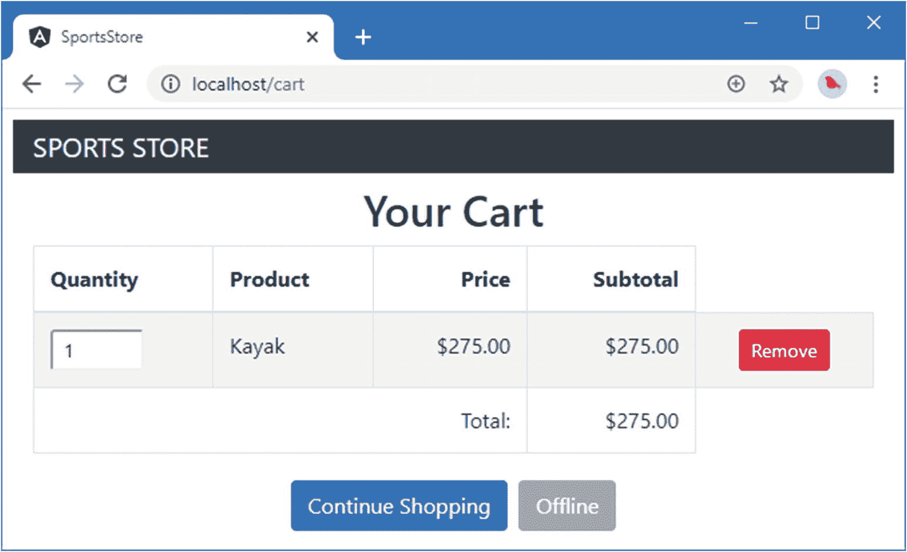
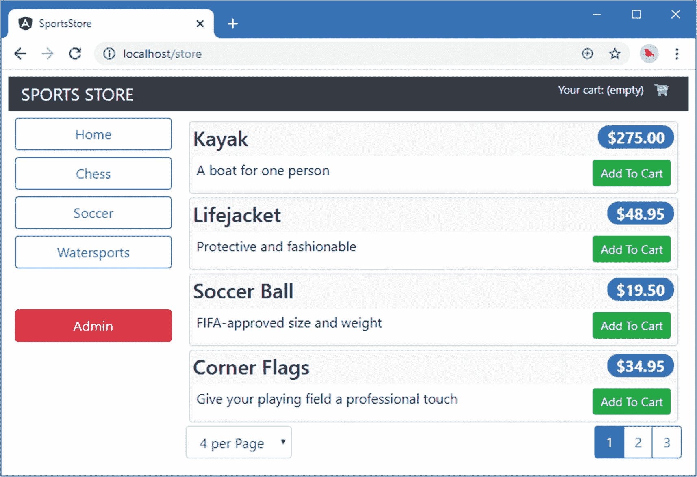

# 十、SportsStore：先进的功能和部署

在这一章中，我通过添加允许 SportsStore 应用离线工作的渐进式功能来准备部署该应用，并向您展示如何准备和部署该应用到 Docker 容器中，该容器可以在大多数托管平台上使用。

## 准备示例应用

本章不需要准备，继续使用第 [9](09.html) 章中的 SportsStore 项目。

Tip

你可以从 [`https://github.com/Apress/pro-angular-9`](https://github.com/Apress/pro-angular-9) 下载本章以及本书其他章节的示例项目。如果在运行示例时遇到问题，请参见第 [1](01.html) 章获取帮助。

## 添加渐进式功能

*渐进式 web 应用* (PWA)的行为更像本机应用，这意味着它可以在没有网络连接的情况下继续工作，其代码和内容被缓存，因此可以立即启动，并且可以使用通知等功能。渐进式 web 应用特性并不是 Angular 特有的，但是在接下来的章节中，我将渐进式特性添加到 SportsStore 应用中，向您展示这是如何实现的。

Tip

开发和测试 PWA 的过程可能很费力，因为只有在为生产而构建应用时才能完成，这意味着不能使用自动构建工具。

### 安装 PWA 包

Angular 团队提供了一个 NPM 包，可用于将 PWA 特性引入 Angular 项目。运行`SportsStore`文件夹中清单 [10-1](#PC1) 所示的命令，下载并安装 PWA 包。

Tip

注意这个命令是`ng add`，而不是我在其他地方用来添加包的`npm install`命令。`ng add`命令专门用于安装软件包，如`@angular/pwa`，这些软件包被设计用于增强或重新配置 Angular 项目。

```ts
ng add @angular/pwa

Listing 10-1.Installing a Package

```

### 缓存数据 URL

`@angular/pwa`包配置应用，以便缓存 HTML、JavaScript 和 CSS 文件，这将允许应用在没有网络可用时启动。我还希望缓存产品目录，以便应用有数据呈现给用户。在清单 [10-2](#PC2) 中，我在`ngsw-config.json`文件中添加了一个新的部分，用于为 Angular 应用配置 PWA 特性，并由`@angular/pwa`包添加到项目中。

```ts
{
  "index": "/index.html",
  "assetGroups": [{
    "name": "app",
    "installMode": "prefetch",
    "resources": {
      "files": [
        "/favicon.ico",
        "/index.html",
        "/*.css",
        "/*.js"
      ]
    }
  }, {
    "name": "assets",
    "installMode": "lazy",
    "updateMode": "prefetch",
    "resources": {
      "files": [
        "/assets/**",
        "/font/*"
      ]
    }
  }],
  "dataGroups": [
    {
        "name": "api-product",
        "urls": ["/api/products"],
        "cacheConfig" : {
            "maxSize": 100,
            "maxAge": "5d"
        }
    }],
    "navigationUrls": [
      "/**"
    ]
}

Listing 10-2.Caching the Data URLs in the ngsw-config.json File in the SportsStore Folder

```

当新版本可用时，运行应用所需的 PWA 代码和内容将被缓存和更新，确保使用配置文件的`assetGroups`部分中的配置，在更新可用时应用一致的更新。

使用配置文件的`dataGroups`部分缓存应用的数据，这允许使用自己的缓存设置管理数据。在这个清单中，我配置了缓存，使其包含来自 100 个请求的数据，并且这些数据在五天内有效。最后的配置部分是`navigationUrls`，它指定了将被定向到`index.html`文件的 URL 的范围。在这个例子中，我使用了通配符来匹配所有的 URL。

Note

我只是触及了您可以在 PWA 中使用的缓存功能的表面。有很多选择，包括尝试连接到网络，然后在没有连接的情况下返回到缓存数据。详见 [`https://angular.io/guide/service-worker-intro`](https://angular.io/guide/service-worker-intro) 。

### 响应连接变化

SportsStore 应用不是渐进式功能的理想候选，因为下单需要连接。当应用在没有连接的情况下运行时，为了避免用户混淆，我将禁用结帐过程。用于添加渐进式功能的 API 提供有关连接状态的信息，并在应用脱机和联机时发送事件。为了向应用提供其连接性的细节，我在`src/app/model`文件夹中添加了一个名为`connection.service.ts`的文件，并使用它来定义清单 [10-3](#PC3) 中所示的服务。

```ts
import { Injectable } from "@angular/core";
import { Observable, Subject } from "rxjs";

@Injectable()
export class ConnectionService {
    private connEvents: Subject<boolean>;

    constructor() {
        this.connEvents = new Subject<boolean>();
        window.addEventListener("online",
            (e) => this.handleConnectionChange(e));
        window.addEventListener("offline",
            (e) => this.handleConnectionChange(e));
    }

    private handleConnectionChange(event) {
        this.connEvents.next(this.connected);
    }

    get connected() : boolean {
        return window.navigator.onLine;
    }

    get Changes(): Observable<boolean> {
        return this.connEvents;
    }
}

Listing 10-3.The Contents of the connection.service.ts File in the src/app/model Folder

```

该服务为应用的其余部分预设连接状态，通过浏览器的`navigator.onLine`属性获取状态，并响应`online`和`offline`事件，这些事件在连接状态改变时触发，并通过浏览器提供的`addEventListener`方法访问。在清单 [10-4](#PC4) 中，我将新服务添加到数据模型的模块中。

```ts
import { NgModule } from "@angular/core";
import { ProductRepository } from "./product.repository";
import { StaticDataSource } from "./static.datasource";
import { Cart } from "./cart.model";
import { Order } from "./order.model";
import { OrderRepository } from "./order.repository";
import { RestDataSource } from "./rest.datasource";
import { HttpClientModule } from "@angular/common/http";
import { AuthService } from "./auth.service";
import { ConnectionService } from "./connection.service";

@NgModule({
  imports: [HttpClientModule],
  providers: [ProductRepository, Cart, Order, OrderRepository,
    { provide: StaticDataSource, useClass: RestDataSource },
    RestDataSource, AuthService, ConnectionService]
})
export class ModelModule { }

Listing 10-4.Adding a Service in the model.module.ts File in the src/app/model Folder

```

为了防止用户在没有连接的情况下结账，我更新了 cart detail 组件，以便它在其构造函数中接收连接服务，如清单 [10-5](#PC5) 所示。

```ts
import { Component } from "@angular/core";
import { Cart } from "../model/cart.model";
import { ConnectionService } from "../model/connection.service";

@Component({
    templateUrl: "cartDetail.component.html"
})
export class CartDetailComponent {
    public connected: boolean = true;

    constructor(public cart: Cart, private connection: ConnectionService) {
        this.connected = this.connection.connected;
        connection.Changes.subscribe((state) => this.connected = state);
    }
}

Listing 10-5.Receiving a Service in the cartDetail.component.ts File in the src/app/store Folder

```

该组件定义了一个`connected`属性，该属性由服务设置，然后在收到更改时更新。为了完成这个特性，我修改了 checkout 按钮，使其在没有连接时被禁用，如清单 [10-6](#PC6) 所示。

```ts
...
<div class="row">
  <div class="col">
  <div class="text-center">
    <button class="btn btn-primary m-1" routerLink="/store">
        Continue Shopping
    </button>
    <button class="btn btn-secondary m-1" routerLink="/checkout"
            [disabled]="cart.lines.length == 0 || !connected">
      {{  connected ?  'Checkout' : 'Offline' }}
    </button>
  </div>
</div>
...

Listing 10-6.Reflecting Connectivity in the cartDetail.component.html File in the src/app/store Folder

```

## 为部署准备应用

在接下来的小节中，我准备了 SportsStore 应用，以便可以对其进行部署。

### 创建数据文件

当我在第 8 章[中创建 RESTful web 服务时，我为`json-server`包提供了一个 JavaScript 文件，它在服务器每次启动时执行，并确保总是使用相同的数据。这对生产没有帮助，所以我在`SportsStore`文件夹中添加了一个名为`serverdata.json`的文件，其内容如清单](08.html) [10-7](#PC7) 所示。当`json-server`包被配置为使用 JSON 文件时，应用所做的任何更改都将被持久化。

```ts
{
    "products": [
        { "id": 1, "name": "Kayak", "category": "Watersports",
            "description": "A boat for one person", "price": 275 },
        { "id": 2, "name": "Lifejacket", "category": "Watersports",
            "description": "Protective and fashionable", "price": 48.95 },
        { "id": 3, "name": "Soccer Ball", "category": "Soccer",
            "description": "FIFA-approved size and weight", "price": 19.50 },
        { "id": 4, "name": "Corner Flags", "category": "Soccer",
            "description": "Give your playing field a professional touch",
            "price": 34.95 },
        { "id": 5, "name": "Stadium", "category": "Soccer",
            "description": "Flat-packed 35,000-seat stadium", "price": 79500 },
        { "id": 6, "name": "Thinking Cap", "category": "Chess",
            "description": "Improve brain efficiency by 75%", "price": 16 },
        { "id": 7, "name": "Unsteady Chair", "category": "Chess",
            "description": "Secretly give your opponent a disadvantage",
            "price": 29.95 },
        { "id": 8, "name": "Human Chess Board", "category": "Chess",
            "description": "A fun game for the family", "price": 75 },
        { "id": 9, "name": "Bling Bling King", "category": "Chess",
            "description": "Gold-plated, diamond-studded King", "price": 1200 }
    ],
    "orders": []
}

Listing 10-7.The Contents of the serverdata.json File in the SportsStore Folder

```

### 创建服务器

部署应用时，我将使用单个 HTTP 端口来处理对应用及其数据的请求，而不是我在开发中使用的两个端口。使用单独的端口在开发中更简单，因为这意味着我可以使用 Angular development HTTP 服务器，而不必集成 RESTful web 服务。Angular 没有为部署提供 HTTP 服务器，因为我必须提供一个，所以我将对它进行配置，使它能够处理两种类型的请求，并包括对 HTTP 和 HTTPS 连接的支持，如侧栏中所述。

Using Secure Connections for Progressive Web Applications

当您向应用添加渐进式功能时，您必须部署它，以便可以通过安全的 HTTP 连接访问它。如果你不这样做，渐进的功能将无法工作，因为底层技术——称为*服务工作器*——将不会被浏览器允许通过常规的 HTTP 连接。

您可以使用 localhost 测试渐进的特性，正如我稍后演示的那样，但是在部署应用时需要 SSL/TLS 证书。如果您没有证书，那么一个好的起点是 [`https://letsencrypt.org`](https://letsencrypt.org) ，您可以在那里免费获得一个证书，尽管您应该注意，您还需要拥有您打算部署以生成证书的域或主机名。出于本书的目的，我将 SportsStore 应用及其渐进式功能部署到了 [`sportsstore.adam-freeman.com`](http://sportsstore.adam-freeman.com) ，这是一个我用于开发测试和接收电子邮件的域。这不是一个提供公共 HTTP 服务的域，您将无法通过该域访问 SportsStore 应用。

运行`SportsStore`文件夹中清单 [10-8](#PC8) 中所示的命令，安装创建 HTTP/HTTPS 服务器所需的包。

```ts
npm install --save-dev express@4.17.1
npm install --save-dev connect-history-api-fallback@1.6.0
npm install --save-dev https@1.0.0

Listing 10-8.Installing Additional Packages

```

我向 SportsStore 添加了一个名为`server.js`的文件，其内容如清单 [10-9](#PC9) 所示，它使用新添加的包来创建一个 HTTP 和 HTTPS 服务器，该服务器包含将提供 RESTful web 服务的`json-server`功能。(`json-server`软件包是专门为集成到其他应用中而设计的。)

```ts
const express = require("express");
const https = require("https");
const fs = require("fs");
const history = require("connect-history-api-fallback");
const jsonServer = require("json-server");
const bodyParser = require('body-parser');
const auth = require("./authMiddleware");
const router = jsonServer.router("serverdata.json");

const enableHttps = false;

const ssloptions = {}

if (enableHttps) {
    ssloptions.cert =  fs.readFileSync("./ssl/sportsstore.crt");
    ssloptions.key = fs.readFileSync("./ssl/sportsstore.pem");
}

const app = express();

app.use(bodyParser.json());
app.use(auth);
app.use("/api", router);
app.use(history());
app.use("/", express.static("./dist/SportsStore"));

app.listen(80,
    () => console.log("HTTP Server running on port 80"));

if (enableHttps) {
    https.createServer(ssloptions, app).listen(443,
        () => console.log("HTTPS Server running on port 443"));
} else {
    console.log("HTTPS disabled")
}

Listing 10-9.The Contents of the server.js File in the SportsStore Folder

```

服务器可以从`ssl`文件夹中的文件读取 SSL/TLS 证书的详细信息，这是您应该放置证书文件的位置。如果您没有证书，那么您可以通过将`enableHttps`的值设置为`false`来禁用 HTTPS。您仍然可以使用本地服务器测试应用，但是您将无法在部署中使用渐进式功能。

### 更改 Repository 类中的 Web 服务 URL

既然 RESTful 数据和应用的 JavaScript 和 HTML 内容将由同一个服务器交付，我需要更改应用用来获取数据的 URL，如清单 [10-10](#PC10) 所示。

```ts
import { Injectable } from "@angular/core";
import { HttpClient } from "@angular/common/http";
import { Observable } from "rxjs";
import { Product } from "./product.model";
import { Cart } from "./cart.model";
import { Order } from "./order.model";
import { map } from "rxjs/operators";
import { HttpHeaders } from '@angular/common/http';

const PROTOCOL = "http";
const PORT = 3500;

@Injectable()
export class RestDataSource {
    baseUrl: string;
    auth_token: string;

    constructor(private http: HttpClient) {
        //this.baseUrl = `${PROTOCOL}://${location.hostname}:${PORT}/`;
        this.baseUrl = "/api/"
    }

    // ...methods omitted for brevity...
}

Listing 10-10.Changing the URL in the rest.datasource.ts File in the src/app/model Folder

```

## 构建和测试应用

要构建用于生产的应用，运行清单`SportsStore`文件夹中的 [10-11](#PC11) 所示的命令。

```ts
ng build --prod

Listing 10-11.Building the Application for Production

```

该命令构建了应用的优化版本，而没有支持开发工具的附加功能。构建过程的输出放在`dist/SportsStore`文件夹中。除了 JavaScript 文件之外，还有一个从`SportsStore/src`文件夹中复制的`index.html`文件，修改后可以使用新构建的文件。

Note

Angular 提供了对服务器端渲染的支持，其中应用运行在服务器中，而不是浏览器中。这种技术可以改善应用启动时间的感知，并可以改善搜索引擎的索引。这是一个应该谨慎使用的功能，因为它有严重的局限性，会破坏用户体验。由于这些原因，我没有在本书中讨论服务器端渲染。您可以在 [`https://angular.io/guide/universal`](https://angular.io/guide/universal) 了解更多关于此功能的信息。

构建过程可能需要几分钟才能完成。一旦构建就绪，运行清单 [10-12](#PC12) 中的命令来启动 HTTP 服务器。如果您没有将服务器配置为使用有效的 SSL/TLS 证书，那么您应该在`server.js`文件中更改`enableHttps`常量的值，然后运行清单 [10-12](#PC12) 中的命令。

```ts
node server.js

Listing 10-12.Starting the Production HTTP Server

```

一旦服务器启动，打开一个新的浏览器窗口并导航到`http://localhost`，您将看到如图 [10-1](#Fig1) 所示的熟悉内容。


图 10-1。

测试应用

### 测试渐进式功能

打开 F12 开发工具，导航到网络选项卡，点击在线右侧的箭头，选择离线，如图 [10-2](#Fig2) 所示。这模拟了一个没有连接的设备，但由于 SportsStore 是一个渐进式 web 应用，它已经被浏览器缓存了，连同它的数据。


图 10-2。

离线

一旦应用离线，单击浏览器的重新加载按钮，应用将从浏览器的缓存中加载。如果您单击“添加到购物车”按钮，您将看到“结帐”按钮被禁用，如图 [10-3](#Fig3) 所示。取消选中离线复选框，按钮的文本会改变，这样用户就可以下订单了。



图 10-3。

反映应用中的连接状态

## 容器化 SportsStore 应用

为了完成本章，我将为 SportsStore 应用创建一个容器，以便将其部署到生产中。在撰写本文时，Docker 是创建容器最流行的方式，它是 Linux 的精简版，功能仅够运行应用。大多数云平台或托管引擎都支持 Docker，其工具运行在最流行的操作系统上。

### 安装 Docker

第一步是在你的开发机器上下载并安装 Docker 工具，可以从 [`www.docker.com/products`](http://www.docker.com/products) 获得。有适用于 macOS、Windows 和 Linux 的版本，也有一些适用于 Amazon 和 Microsoft 云平台的专门版本。Docker 桌面的免费社区版对于本章来说已经足够了。

### 准备应用

第一步是为 NPM 创建一个配置文件，该文件将用于下载应用在容器中使用所需的附加包。我在`SportsStore`文件夹中创建了一个名为`deploy-package.json`的文件，内容如清单 [10-13](#PC13) 所示。

```ts
{
  "dependencies": {
      "@fortawesome/fontawesome-free": "5.12.1",
      "bootstrap": "4.4.1"
  },

  "devDependencies": {
    "json-server": "0.16.0",
    "jsonwebtoken": "8.5.1",
    "express": "4.17.1",
    "https": "1.0.0",
    "connect-history-api-fallback": "1.6.0"
  },

  "scripts": {
    "start":  "node server.js"
  }
}

Listing 10-13.The Contents of the deploy-package.json File in the SportsStore Folder

```

`dependencies`部分省略了 Angular 和所有其他运行时包，这些包是在项目创建时添加到`package.json`文件中的，因为构建过程将应用所需的所有 JavaScript 代码合并到了`dist/SportsStore`文件夹中的文件中。`devDependencies`部分包括生产 HTTP/HTTPS 服务器所需的工具。

设置了`deploy-package.json`文件的`scripts`部分，这样`npm start`命令将启动生产服务器，该服务器将提供对应用及其数据的访问。

### 创建 Docker 容器

为了定义容器，我在`SportsStore`文件夹中添加了一个名为`Dockerfile`(没有扩展名)的文件，并添加了清单 [10-14](#PC14) 中所示的内容。

```ts
FROM node:12.15.0

RUN mkdir -p /usr/src/sportsstore

COPY dist/SportsStore /usr/src/sportsstore/dist/SportsStore
COPY ssl /usr/src/sportsstore/ssl

COPY authMiddleware.js /usr/src/sportsstore/
COPY serverdata.json /usr/src/sportsstore/
COPY server.js /usr/src/sportsstore/server.js
COPY deploy-package.json /usr/src/sportsstore/package.json

WORKDIR /usr/src/sportsstore

RUN npm install

EXPOSE 80

CMD ["node", "server.js"]

Listing 10-14.The Contents of the Dockerfile File in the SportsStore Folder

```

`Dockerfile`的内容使用用`Node.js`配置的基本映像，并复制运行应用所需的文件，包括包含应用的包文件和将用于安装在部署中运行应用所需的包的`package.json`文件。

为了加快容器化过程，我在`SportsStore`文件夹中创建了一个名为`.dockerignore`的文件，其内容如清单 [10-15](#PC15) 所示。这告诉 Docker 忽略`node_modules`文件夹，这在容器中是不需要的，并且需要很长的处理时间。

```ts
node_modules

Listing 10-15.The Contents of the .dockerignore File in the SportsStore Folder

```

在`SportsStore`文件夹中运行清单 [10-16](#PC16) 中所示的命令，创建一个包含 SportsStore 应用以及它所需的所有工具和软件包的映像。

Tip

SportsStore 项目必须包含一个`ssl`目录，即使您尚未安装证书。这是因为当在`Dockerfile`中使用`COPY`命令时，无法检查文件是否存在。

```ts
docker build . -t sportsstore  -f  Dockerfile

Listing 10-16.Building the Docker Image

```

图像是容器的模板。当 Docker 处理 Docker 文件中的指令时，将下载并安装 NPM 包，并将配置和代码文件复制到映像中。

### 运行应用

一旦创建了映像，使用清单 [10-17](#PC17) 中所示的命令创建并启动一个新的容器。

Tip

确保在启动 Docker 容器之前停止清单 [10-12](#PC12) 中启动的测试服务器，因为两者都使用相同的端口来监听请求。

```ts
docker run -p 80:80 -p 443:443 sportsstore

Listing 10-17.Starting the Docker Container

```

您可以通过在浏览器中打开`http://localhost`来测试应用，这将显示运行在容器中的 web 服务器提供的响应，如图 [10-4](#Fig4) 所示。



图 10-4。

运行容器化 SportsStore 应用

要停止容器，运行清单 [10-18](#PC18) 中所示的命令。

```ts
docker ps

Listing 10-18.Listing the Containers

```

您将看到一个正在运行的容器列表，如下所示(为简洁起见，我省略了一些字段):

```ts
CONTAINER ID        IMAGE               COMMAND                 CREATED
ecc84f7245d6        sportsstore         "docker-entrypoint.s…"  33 seconds ago

```

使用容器 ID 列中的值，运行清单 [10-19](#PC20) 中所示的命令。

```ts
docker stop ecc84f7245d6

Listing 10-19.Stopping the Container

```

该应用已准备好部署到任何支持 Docker 的平台上，尽管只有在为应用部署到的域配置了 SSL/TLS 证书的情况下，渐进式功能才会起作用。

## 摘要

本章完成了 SportsStore 应用，展示了如何为部署准备 Angular 应用，以及将 Angular 应用放入 Docker 之类的容器有多容易。这部分书到此结束。在第 2 部分中，我开始深入研究细节，并向您展示我用来创建 SportsStore 应用的特性是如何深入工作的。