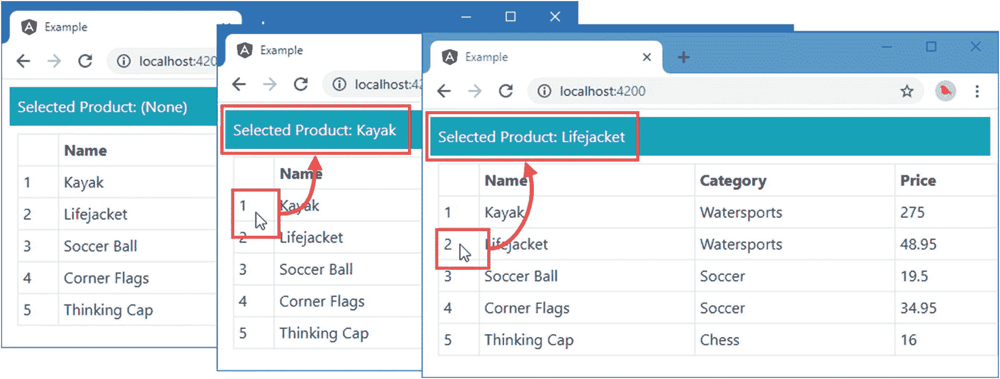
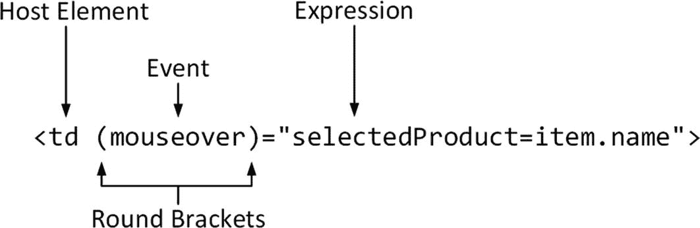
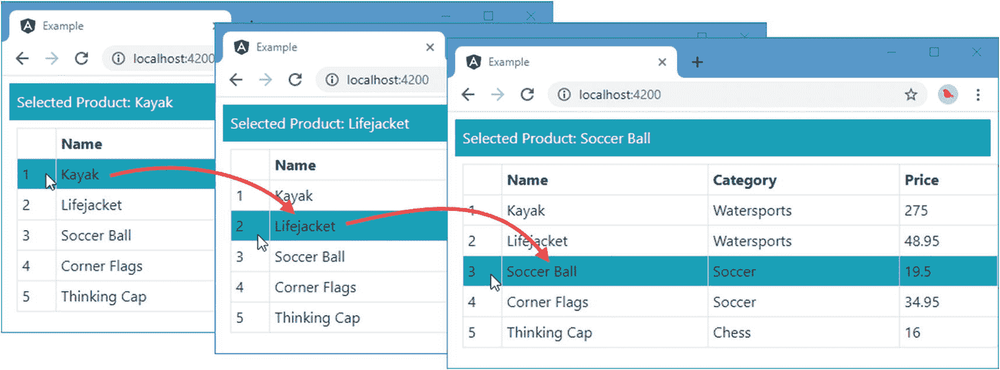
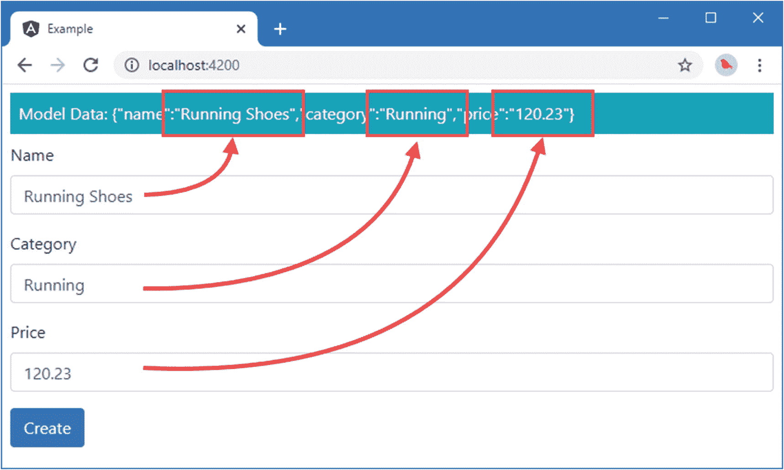
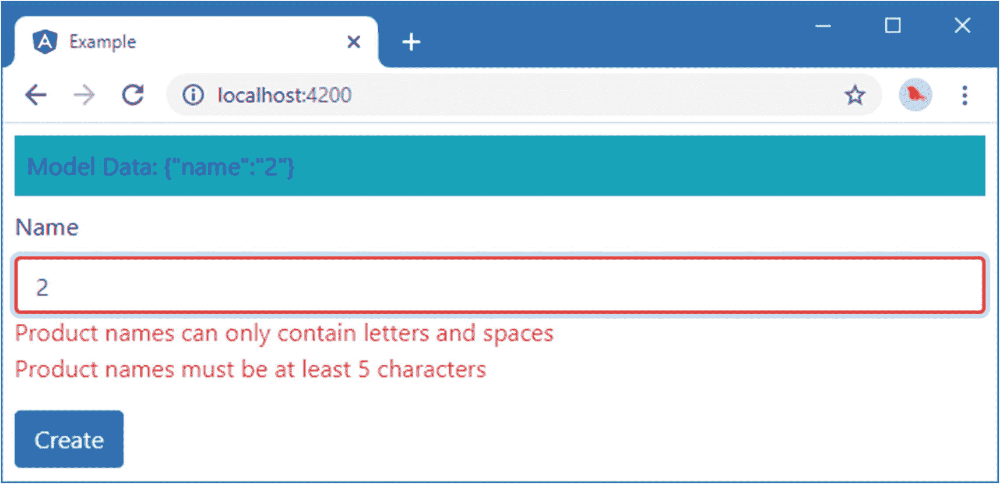
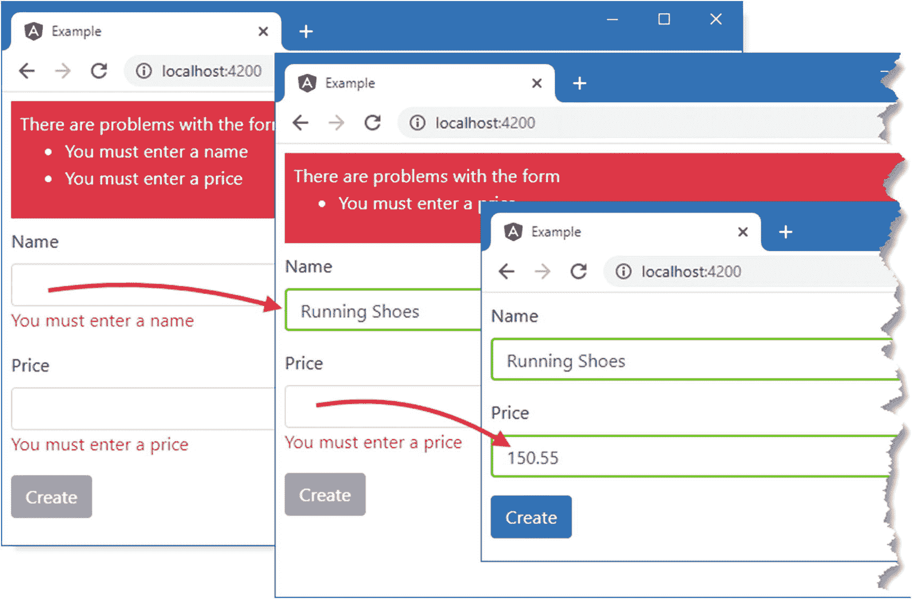

# 十四、使用事件和表单

在这一章中，我继续描述基本的 Angular 功能，重点是响应用户交互的特性。我将解释如何创建事件绑定，以及如何使用双向绑定来管理模型和模板之间的数据流。web 应用中用户交互的主要形式之一是使用 HTML 表单，我将解释如何使用事件绑定和双向数据绑定来支持它们并验证用户提供的内容。表 [14-1](#Tab1) 将事件和表单放在上下文中。

表 14-1。

将事件绑定和表单放在上下文中

<colgroup><col class="tcol1 align-left"> <col class="tcol2 align-left"></colgroup> 
| 

问题

 | 

回答

 |
| --- | --- |
| 它们是什么？ | 事件绑定在事件被触发时计算表达式，例如用户按键、移动鼠标或提交表单。更广泛的与表单相关的功能在此基础上构建，以创建自动验证的表单，从而确保用户提供有用的数据。 |
| 它们为什么有用？ | 这些特性允许用户更改应用的状态，更改或添加模型中的数据。 |
| 它们是如何使用的？ | 每种功能都有不同的使用方式。有关详细信息，请参见示例。 |
| 有什么陷阱或限制吗？ | 与所有 Angular 绑定一样，主要缺陷是使用错误的括号来表示绑定。请密切注意本章中的例子，并在没有得到预期结果时检查您应用绑定的方式。 |
| 还有其他选择吗？ | 不。这些功能是 Angular 的核心部分。 |

表 [14-2](#Tab2) 总结了本章内容。

表 14-2。

章节总结

<colgroup><col class="tcol1 align-left"> <col class="tcol2 align-left"> <col class="tcol3 align-left"></colgroup> 
| 

问题

 | 

解决办法

 | 

列表

 |
| --- | --- | --- |
| 启用表单支持 | 将`@angular/forms`模块添加到应用 | 1–3 |
| 对事件做出反应 | 使用事件绑定 | 4–6 |
| 获取事件的详细信息 | 使用`$event`对象 | seven |
| 引用模板中的元素 | 定义模板变量 | eight |
| 允许数据在元素和组件之间双向流动 | 使用双向数据绑定 | 9, 10 |
| 捕捉用户输入 | 使用 HTML 表单 | 11, 12 |
| 验证用户提供的数据 | 执行表单验证 | 13–22 |
| 使用 JavaScript 代码定义验证信息 | 使用基于模型的表单 | 23–28 |
| 扩展内置的表单验证功能 | 定义自定义表单验证类 | 29–30 |

## 准备示例项目

对于这一章，我将继续使用我在第 [11](11.html) 章中创建的示例项目，并在此后的章节中进行修改。

Tip

你可以从 [`https://github.com/Apress/pro-angular-9`](https://github.com/Apress/pro-angular-9) 下载本章以及本书其他章节的示例项目。如果在运行示例时遇到问题，请参见第 [1](01.html) 章获取帮助。

### 导入表单模块

本章中演示的特性依赖于 Angular forms 模块，该模块必须导入 Angular 模块，如清单 [14-1](#PC1) 所示。

```ts
import { BrowserModule } from '@angular/platform-browser';
import { NgModule } from '@angular/core';
import { ProductComponent } from "./component";
import { FormsModule } from "@angular/forms";

@NgModule({
  declarations: [ProductComponent],
  imports: [BrowserModule, FormsModule],
  providers: [],
  bootstrap: [ProductComponent]
})
export class AppModule { }

Listing 14-1.Declaring a Dependency in the app.module.ts File in the src/app Folder

```

`NgModule`装饰器的`imports`属性指定了应用的依赖关系。将`FormsModule`添加到依赖项列表中可以启用表单功能，并使它们可以在整个应用中使用。

### 准备组件和模板

清单 [14-2](#PC2) 从组件类中移除了构造函数和一些方法，以保持代码尽可能简单，并添加了一个名为`selectedProduct`的新属性。

```ts
import { ApplicationRef, Component } from "@angular/core";
import { Model } from "./repository.model";
import { Product } from "./product.model";

@Component({
    selector: "app",
    templateUrl: "template.html"
})
export class ProductComponent {
    model: Model = new Model();

    getProduct(key: number): Product {
        return this.model.getProduct(key);
    }

    getProducts(): Product[] {
        return this.model.getProducts();
    }

    selectedProduct: Product;
}

Listing 14-2.Simplifying the Component in the component.ts File in the src/app Folder

```

清单 [14-3](#PC3) 简化了组件的模板，只留下一个使用`ngFor`指令填充的表格。

```ts
<div class="m-2">
  <table class="table table-sm table-bordered">
    <tr><th></th><th>Name</th><th>Category</th><th>Price</th></tr>
    <tr *ngFor="let item of getProducts(); let i = index">
      <td>{{i + 1}}</td>
      <td>{{item.name}}</td>
      <td>{{item.category}}</td>
      <td>{{item.price}}</td>
    </tr>
  </table>
</div>

Listing 14-3.Simplifying the Template in the template.html File in the src/app Folder

```

要启动开发服务器，请打开命令提示符，导航到`example`文件夹，然后运行以下命令:

```ts
ng serve

```

打开一个新的浏览器窗口并导航至`http://localhost:4200`以查看如图 [14-1](#Fig1) 所示的表格。


图 14-1。

运行示例应用

## 使用事件绑定

*事件绑定*用于响应主机元素发送的事件。清单 [14-4](#PC5) 展示了事件绑定，它允许用户与 Angular 应用交互。

```ts
<div class="m-2">
  <div class="bg-info text-white p-2">
    Selected Product: {{selectedProduct || '(None)'}}
  </div>
  <table class="table table-sm table-bordered m-2">
    <tr><th></th><th>Name</th><th>Category</th><th>Price</th></tr>
    <tr *ngFor="let item of getProducts(); let i = index">
      <td (mouseover)="selectedProduct=item.name">{{i + 1}}</td>
      <td>{{item.name}}</td>
      <td>{{item.category}}</td>
      <td>{{item.price}}</td>
    </tr>
  </table>
</div>

Listing 14-4.Using the Event Binding in the template.html File in the src/app Folder

```

当您保存对模板的更改时，您可以通过将鼠标指针移动到 HTML 表格的第一列上来测试绑定，该表格显示一系列数字。当鼠标从一行移动到另一行时，该行显示的产品名称显示在页面顶部，如图 [14-2](#Fig2) 所示。



图 14-2。

使用事件绑定

这是一个简单的例子，但它显示了事件绑定的结构，如图 [14-3](#Fig3) 所示。



图 14-3。

事件绑定的剖析

事件绑定包含以下四个部分:

*   *主机元素*是绑定的事件源。

*   *圆括号*告诉 Angular 这是一个事件绑定，这是一种单向绑定的形式，数据从元素流向应用的其余部分。

*   *事件*指定绑定用于哪个事件。

*   当事件被触发时，*表达式*被求值。

查看清单 [14-4](#PC5) 中的绑定，您可以看到主机元素是一个`td`元素，这意味着这是将成为事件源的元素。绑定指定了`mouseover`事件，当鼠标指针移动到主机元素占据的屏幕部分时，该事件被触发。

与单向绑定不同，事件绑定中的表达式可以改变应用的状态，并且可以包含赋值操作符，比如`=`。绑定的表达式将值`item.name`赋给一个名为`selectedProduct`的变量。`selectedProduct`变量用于模板顶部的字符串插值绑定，如下所示:

```ts
...
<div class="bg-info text-white p-2">
    Selected Product: {{selectedProduct || '(None)'}}
</div>
...

```

当`selectedProduct`变量的值被事件绑定改变时，字符串插值绑定显示的值被更新。不再需要使用`ApplicationRef.tick`方法手动启动变更检测过程，因为本章中的绑定和指令会自动处理该过程。

Working with DOM Events

如果您不熟悉 HTML 元素可以发送的事件，那么在`developer.mozilla.org/en-US/docs/Web/Events`有一个很好的总结。然而，有许多事件，并不是所有浏览器都广泛或一致地支持它们。一个很好的起点是`mozilla.org`页面的“DOM Events”和“HTML DOM Events”部分，它们定义了用户与元素的基本交互(点击、移动指针、提交表单等等),并且可以在大多数浏览器中使用。

如果您使用不太常见的事件，那么您应该确保它们在您的目标浏览器中可用并按预期工作。优秀的 [`http://caniuse.com`](http://caniuse.com) 提供了不同浏览器实现哪些特性的细节，但是你也应该进行彻底的测试。

显示所选产品的表达式使用 null 合并运算符来确保用户始终看到一条消息，即使没有选择产品也是如此。一个更简洁的方法是定义一个执行这个检查的方法，如清单 [14-5](#PC7) 所示。

```ts
import { ApplicationRef, Component } from "@angular/core";
import { Model } from "./repository.model";
import { Product } from "./product.model";

@Component({
    selector: "app",
    templateUrl: "template.html"
})
export class ProductComponent {
    model: Model = new Model();

    getProduct(key: number): Product {
        return this.model.getProduct(key);
    }

    getProducts(): Product[] {
        return this.model.getProducts();
    }

    selectedProduct: string;

    getSelected(product: Product): boolean {
        return product.name == this.selectedProduct;
    }
}

Listing 14-5.Enhancing the Component in the component.ts File in the src/app Folder

```

我定义了一个名为`getSelected`的方法，它接受一个`Product`对象，并将其名称与`selectedProduct`属性进行比较。在清单 [14-6](#PC8) 中，`getSelected`方法被一个类绑定用来控制`bg-info`类的成员资格，这个类是一个引导类，为一个元素分配背景颜色。

```ts
<div class="m-2">
  <div class="bg-info text-white p-2">
    Selected Product: {{selectedProduct || '(None)'}}
  </div>
  <table class="table table-sm table-bordered m-2">
    <tr><th></th><th>Name</th><th>Category</th><th>Price</th></tr>
    <tr *ngFor="let item of getProducts(); let i = index"
        [class.bg-info]="getSelected(item)">
      <td (mouseover)="selectedProduct=item.name">{{i + 1}}</td>
      <td>{{item.name}}</td>
      <td>{{item.category}}</td>
      <td>{{item.price}}</td>
    </tr>
  </table>
</div>

Listing 14-6.Setting Class Membership in the template.html File in the src/app Folder

```

结果是当`selectedProduct`属性值与用于创建它们的`Product`对象的`name`属性相匹配时，`tr`元素被添加到`bg-info`类中，当`mouseover`事件被触发时，事件绑定会改变这些属性，如图 [14-4](#Fig4) 所示。



图 14-4。

通过事件绑定突出显示表行

这个例子展示了用户交互如何将新数据驱动到应用中，并启动变化检测过程，导致 Angular 重新评估字符串插值和类绑定所使用的表达式。这种数据流是 Angular 应用的生命所在:第 [12](12.html) 和 [13](13.html) 章中描述的绑定和指令动态响应应用状态的变化，创建完全在浏览器中生成和管理的内容。

What Happened to Dynamically Created Properties?

早期版本的 Angular 允许模板使用在运行时创建的、没有在组件中定义的属性。这种技术利用了 JavaScript 的动态特性，尽管在应用被编译用于生产时它被标记为错误。Angular 9 引入了新的构建工具来防止这种把戏，确保模板使用的工具必须由组件定义。

### 使用事件数据

前面的例子使用事件绑定来连接组件提供的两段数据:当`mouseevent`被触发时，绑定的表达式使用由组件的`getProducts`方法提供给`ngfor`指令的数据值来设置`selectedProduct`属性。

事件绑定也可用于使用浏览器提供的详细信息，将新数据从事件本身引入应用。清单 [14-7](#PC9) 向模板中添加了一个`input`元素，并使用事件绑定来监听`input`事件，当`input`元素的内容发生变化时就会触发该事件。

```ts
<div class="m-2">
  <div class="bg-info text-white p-2">
    Selected Product: {{selectedProduct || '(None)'}}
  </div>
  <table class="table table-sm table-bordered m-2">
    <tr><th></th><th>Name</th><th>Category</th><th>Price</th></tr>
    <tr *ngFor="let item of getProducts(); let i = index"
        [class.bg-info]="getSelected(item)">
      <td (mouseover)="selectedProduct=item.name">{{i + 1}}</td>
      <td>{{item.name}}</td>
      <td>{{item.category}}</td>
      <td>{{item.price}}</td>
    </tr>
  </table>
  <div class="form-group">
    <label>Product Name</label>
    <input class="form-control" (input)="selectedProduct=$event.target.value" />
  </div>
</div>

Listing 14-7.Using an Event Object in the template.html File in the src/app Folder

```

当浏览器触发一个事件时，它会提供一个描述它的对象。不同类别的事件(鼠标事件、键盘事件、表单事件等)有不同类型的事件对象，但所有事件都共享表 [14-3](#Tab3) 中描述的三个属性。

表 14-3。

所有 DOM 事件对象共有的属性

<colgroup><col class="tcol1 align-left"> <col class="tcol2 align-left"></colgroup> 
| 

名字

 | 

描述

 |
| --- | --- |
| `type` | 该属性返回一个`string`,它标识已经触发的事件的类型。 |
| `target` | 该属性返回触发事件的`object`，它通常是表示 DOM 中 HTML 元素的对象。 |
| `timeStamp` | 该属性返回一个包含事件触发时间的`number`，以 1970 年 1 月 1 日以来的毫秒数表示。 |

事件对象被分配给一个名为`$event`的模板变量，清单 [14-7](#PC9) 中的绑定表达式使用这个变量来访问事件对象的`target`属性。

在 DOM 中，`input`元素由一个`HTMLInputElement`对象表示，该对象定义了一个`value`属性，可以用来获取和设置`input`元素的内容。绑定表达式通过将组件的`selectedProduct`属性的值设置为`input`元素的 value 属性的值来响应`input`事件，如下所示:

```ts
...
<input class="form-control" (input)="selectedProduct=$event.target.value" />
...

```

当用户编辑`input`元素的内容时会触发`input`事件，因此组件的`selectedProduct`属性会在每次击键后用`input`元素的内容更新。当用户键入`input`元素时，使用字符串插值绑定，输入的文本显示在浏览器窗口的顶部。

当`selectedProduct`属性与它们代表的产品名称匹配时，应用于`tr`元素的`ngClass`绑定设置表格行的背景颜色。而且，现在`selectedProduct`属性的值是由`input`元素的内容驱动的，键入一个产品的名称将导致相应的行被高亮显示，如图 [14-5](#Fig5) 所示。


图 14-5。

使用事件数据

使用不同的绑定协同工作是有效的 Angular 开发的核心，它使得创建能够立即响应用户交互和数据模型变化的应用成为可能。

### 使用模板引用变量

在第 13 章中，我解释了如何使用模板变量在模板内传递数据，比如使用`ngFor`指令时为当前对象定义一个变量。*模板引用变量*是模板变量的一种形式，可以用来引用模板中的元素*，如清单 [14-8](#PC11) 所示。*

```ts
<div class="m-2">
  <div class="bg-info text-white p-2">
    Selected Product: {{product.value || '(None)'}}
  </div>
  <table class="table table-sm table-bordered m-2">
    <tr><th></th><th>Name</th><th>Category</th><th>Price</th></tr>
    <tr *ngFor="let item of getProducts(); let i = index"
        (mouseover)="product.value=item.name"
        [class.bg-info]="product.value==item.name">
      <td (mouseover)="selectedProduct=item.name">{{i + 1}}</td>
      <td>{{item.name}}</td>
      <td>{{item.category}}</td>
      <td>{{item.price}}</td>
    </tr>
  </table>
  <div class="form-group">
    <label>Product Name</label>
    <input #product class="form-control" (input)="false" />
  </div>
</div>

Listing 14-8.Using a Template Variable in the template.html File in the src/app Folder

```

参考变量使用`#`字符定义，后跟变量名。在清单中，我像这样定义了一个名为`product`的变量:

```ts
...
<input #product class="form-control" (input)="false" />
...

```

当 Angular 遇到模板中的引用变量时，它会将其值设置为它所应用到的元素。在这个例子中，`product`引用变量被赋予了代表 DOM 中的`input`元素的对象，即`HTMLInputElement`对象。同一模板中的其他绑定可以使用引用变量。字符串插值绑定演示了这一点，它也使用了`product`变量，如下所示:

```ts
...
Selected Product: {{product.value || '(None)'}}
...

```

如果`value`属性返回`null`，则该绑定显示由已经分配给产品变量或字符串`(None)`的`HTMLInputElement`定义的`value`属性。模板变量也可用于更改元素的状态，如以下绑定所示:

```ts
...
<tr *ngFor="let item of getProducts(); let i = index"
    (mouseover)="product.value=item.name"
    [class.bg-info]="product.value==item.name">
...

```

事件绑定通过在已经分配给`product`变量的`HTMLInputElement`上设置`value`属性来响应`mouseover`事件。结果是将鼠标移动到其中一个`tr`元素上将会更新`input`元素的内容。

这个例子有一个尴尬的地方，那就是在`input`元素上绑定`input`事件。

```ts
...
<input #product class="form-control" (input)="false" />
...

```

当用户编辑`input`元素的内容时，Angular 不会更新模板中的数据绑定，除非该元素上有事件绑定。将绑定设置为`false`给 Angular 一些东西来评估，这样更新过程就会开始，并在整个模板中分发`input`元素的当前内容。这是将模板引用变量的角色扩展得太远的一种怪癖，在大多数实际项目中您不需要这样做。正如您将在后面的例子和章节中看到的，大多数数据绑定依赖于模板组件定义的变量。

Filtering Key Events

每当`input`元素中的内容发生变化时，就会触发`input`事件。这提供了一组即时响应的更改，但这并不是每个应用都需要的，尤其是当更新应用状态涉及到昂贵的操作时。

事件绑定具有内置支持，在绑定到键盘事件时更具选择性，这意味着只有在按下特定键时才会执行更新。下面是一个响应每次击键的绑定:

```ts
...
<input #product class="form-control" (keyup)="selectedProduct=product.value" />
...

```

`keyup`事件是一个标准的 DOM 事件，其结果是当用户在输入`input`元素时释放每个键，应用就会更新。我可以通过将名称指定为事件绑定的一部分来更具体地确定我感兴趣的键，如下所示:

```ts
...
<input #product class="form-control"
    (keyup.enter)="selectedProduct=product.value" />
...

```

绑定将响应的键是通过在 DOM 事件名称后附加一个句点，后跟键名来指定的。这个绑定是针对回车键的，结果是在按下该键之前，`input`元素中的更改不会被推送到应用的其余部分。

## 使用双向数据绑定

可以组合绑定来为单个元素创建双向数据流，允许 HTML 文档在应用模型改变时做出响应，也允许应用在元素发出事件时做出响应，如清单 [14-9](#PC18) 所示。

```ts
<div class="m-2">
  <div class="bg-info text-white p-2">
    Selected Product: {{selectedProduct || '(None)'}}
  </div>
  <table class="table table-sm table-bordered m-2">
    <tr><th></th><th>Name</th><th>Category</th><th>Price</th></tr>
    <tr *ngFor="let item of getProducts(); let i = index"
        [class.bg-info]="getSelected(item)">
      <td (mouseover)="selectedProduct=item.name">{{i + 1}}</td>
      <td>{{item.name}}</td>
      <td>{{item.category}}</td>
      <td>{{item.price}}</td>
    </tr>
  </table>
  <div class="form-group">
    <label>Product Name</label>
    <input class="form-control" (input)="selectedProduct=$event.target.value"
           [value]="selectedProduct || ''" />
  </div>
  <div class="form-group">
    <label>Product Name</label>
    <input class="form-control" (input)="selectedProduct=$event.target.value"
           [value]="selectedProduct || ''" />
  </div>
</div>

Listing 14-9.Creating a Two-Way Binding in the template.html File in the src/app Folder

```

每个`input`元素都有一个事件绑定和一个属性绑定。事件绑定通过更新组件的`selectedProduct`属性来响应`input`事件。属性绑定将`selectedProduct`属性的值绑定到元素的`value`属性。

结果是两个`input`元素的内容被同步，编辑其中一个会导致另一个也被更新。而且，由于模板中还有其他依赖于`selectedProduct`属性的绑定，编辑`input`元素的内容也会改变字符串插值绑定显示的数据，并改变高亮显示的表格行，如图 [14-6](#Fig6) 所示。


图 14-6。

创建双向数据绑定

当您在浏览器中试验它时，这是一个最有意义的例子。在其中一个`input`元素中输入一些文本，您会看到同样的文本显示在另一个`input`元素和`div`元素中，它们的内容由字符串插值绑定管理。如果您在其中一个输入元素中输入一个产品的名称，比如 Kayak 或 Lifejacket，那么您还会看到表中相应的行被突出显示。

`mouseover`事件的事件绑定仍然生效，这意味着当您将鼠标指针移动到表中的第一行时，`selectedProduct`值的变化将导致`input`元素显示产品名称。

### 使用 ngModel 指令

`ngModel`指令用于简化双向绑定，这样您就不必对同一个元素同时应用事件和属性绑定。清单 [14-10](#PC19) 展示了如何用`ngModel`指令替换单独的绑定。

```ts
<div class="m-2">
  <div class="bg-info text-white p-2">
    Selected Product: {{selectedProduct || '(None)'}}
  </div>
  <table class="table table-sm table-bordered m-2">
    <tr><th></th><th>Name</th><th>Category</th><th>Price</th></tr>
    <tr *ngFor="let item of getProducts(); let i = index"
        [class.bg-info]="getSelected(item)">
      <td (mouseover)="selectedProduct=item.name">{{i + 1}}</td>
      <td>{{item.name}}</td>
      <td>{{item.category}}</td>
      <td>{{item.price}}</td>
    </tr>
  </table>
  <div class="form-group">
    <label>Product Name</label>
    <input class="form-control" [(ngModel)]="selectedProduct" />
  </div>
  <div class="form-group">
    <label>Product Name</label>
    <input class="form-control" [(ngModel)]="selectedProduct" />
  </div>
</div>

Listing 14-10.Using the ngModel Directive in the template.html File in the src/app Folder

```

使用`ngModel`指令需要结合属性和事件绑定的语法，如图 [14-7](#Fig7) 所示。


图 14-7。

双向数据绑定的剖析

方括号和圆括号的组合用于表示双向数据绑定，圆括号放在方括号内:`[(`和`)]`。Angular 开发团队称之为*盒中香蕉*绑定，因为这就是括号和圆括号像这样放置时的样子`[()]`。嗯，算是吧。

绑定的目标是`ngModel`指令，它包含在 Angular 中是为了简化在表单元素上创建双向数据绑定，比如本例中使用的`input`元素。

双向数据绑定的表达式是属性的名称，用于在后台设置各个绑定。当`input`元素的内容改变时，新的内容将用于更新`selectedProduct`属性的值。同样，当`selectedProduct`的值改变时，它将被用来更新元素的内容。

指令知道标准 HTML 元素定义的事件和属性的组合。在幕后，一个事件绑定被应用到`input`事件，一个属性绑定被应用到`value`属性。

Tip

记住在`ngModel`绑定中使用括号和圆括号是很重要的。如果您只使用括号—`(ngModel)`—那么您正在为一个不存在的名为`ngModel`的事件设置一个事件绑定。结果是一个元素不会被更新或者不会更新应用的其余部分。您可以使用带有方括号的`ngModel`指令—`[ngModel]`—Angular 将设置元素的初始值，但不会监听事件，这意味着用户所做的更改不会自动反映在应用模型中。

## 使用表单

大多数 web 应用依赖表单从用户那里接收数据，上一节描述的双向`ngModel`绑定为在 angle 应用中使用表单提供了基础。在本节中，我将创建一个表单，允许创建新产品并将其添加到应用的数据模型中，然后描述 Angular 提供的一些更高级的表单特性。

### 向示例应用添加表单

清单 [14-11](#PC20) 显示了创建表单时将使用的组件的一些增强，并删除了一些不再需要的特性。

```ts
import { ApplicationRef, Component } from "@angular/core";
import { Model } from "./repository.model";
import { Product } from "./product.model";

@Component({
    selector: "app",
    templateUrl: "template.html"
})
export class ProductComponent {
    model: Model = new Model();

    getProduct(key: number): Product {
        return this.model.getProduct(key);
    }

    getProducts(): Product[] {
        return this.model.getProducts();
    }

    newProduct: Product = new Product();

    get jsonProduct() {
        return JSON.stringify(this.newProduct);
    }

    addProduct(p: Product) {
        console.log("New Product: " + this.jsonProduct);
    }
}

Listing 14-11.Enhancing the Component in the component.ts File in the src/app Folder

```

清单添加了一个名为`newProduct`的新属性，用于存储用户输入表单的数据。还有一个带有 getter 的`jsonProduct`属性，它返回`newProduct`属性的 JSON 表示，并将在模板中用于显示双向绑定的效果。(我不能直接在模板中创建对象的 JSON 表示，因为 JSON 对象是在全局名称空间中定义的，正如我在第 [13](13.html) 章中解释的，不能直接从模板表达式中访问。)

最后添加的是一个`addProduct`方法，它将`jsonProduct`方法的值写出到控制台；这将让我演示一些基本的与表单相关的特性，然后在本章的后面添加对更新数据模型的支持。

在清单 [14-12](#PC21) 中，模板内容已经被一系列由`Product`类定义的属性的`input`元素所取代。

```ts
<div class="m-2">
  <div class="bg-info text-white mb-2 p-2">Model Data: {{jsonProduct}}</div>

  <div class="form-group">
    <label>Name</label>
    <input class="form-control" [(ngModel)]="newProduct.name" />
  </div>
  <div class="form-group">
    <label>Category</label>
    <input class="form-control" [(ngModel)]="newProduct.category" />
  </div>
  <div class="form-group">
    <label>Price</label>
    <input class="form-control" [(ngModel)]="newProduct.price" />
  </div>
  <button class="btn btn-primary" (click)="addProduct(newProduct)">Create</button>
</div>

Listing 14-12.Adding Input Elements in the template.html File in the src/app Folder

```

每个`input`元素用一个`label`分组在一起，并包含在一个`div`元素中，该元素使用 Bootstrap `form-group`类进行样式化。单个的`input`元素被分配给 Bootstrap `form-control`类来管理布局和风格。

`ngModel`绑定已经应用于每个`input`元素，以创建一个与组件的`newProduct`对象上的相应属性的双向绑定，如下所示:

```ts
...
<input class="form-control" [(ngModel)]="newProduct.name" />
...

```

还有一个`button`元素，它有一个调用组件的`addProduct`方法的`click`事件的绑定，将`newProduct`值作为参数传入。

```ts
...
<button class="btn btn-primary" (click)="addProduct(newProduct)">Create</button>
...

```

最后，字符串插值绑定用于在模板顶部显示组件的`newProduct`属性的 JSON 表示，如下所示:

```ts
...
<div class="bg-info text-white mb-2 p-2">Model Data: {{jsonProduct}}</div>
...

```

如图 [14-8](#Fig8) 所示，总体结果是一组`input`元素，它们更新由组件管理的`Product`对象的属性，这些属性立即反映在 JSON 数据中。



图 14-8。

使用表单元素在数据模型中创建新对象

当单击 Create 按钮时，组件的`newProduct`属性的 JSON 表示被写入浏览器的 JavaScript 控制台，产生如下结果:

```ts
New Product: {"name":"Running Shoes","category":"Running","price":"120.23"}

```

### 添加表单数据验证

此时，任何数据都可以输入到表单的`input`元素中。数据验证在 web 应用中是必不可少的，因为用户会输入范围惊人的数据值，这可能是错误的，也可能是因为他们希望尽可能快地结束该过程，并输入垃圾值以继续。

Angular 基于 HTML5 标准使用的方法，提供了一个可扩展的系统来验证表单元素的内容。您可以向`input`元素添加四个属性，每个属性定义一个验证规则，如表 [14-4](#Tab4) 中所述。

表 14-4。

内置的 Angular 验证属性

<colgroup><col class="tcol1 align-left"> <col class="tcol2 align-left"></colgroup> 
| 

属性

 | 

描述

 |
| --- | --- |
| `required` | 此属性用于指定必须提供的值。 |
| `minlength` | 此属性用于指定最小字符数。 |
| `maxlength` | 此属性用于指定最大字符数。这种类型的验证不能直接应用于表单元素，因为它与同名的 HTML5 属性冲突。它可以与基于模型的表单一起使用，这将在本章的后面介绍。 |
| `pattern` | 此属性用于指定用户提供的值必须匹配的正则表达式。 |

您可能对这些属性很熟悉，因为它们是 HTML 规范的一部分，但是 Angular 在这些属性的基础上构建了一些额外的特性。清单 [14-13](#PC26) 删除了除了一个`input`元素之外的所有元素，以尽可能简单地演示向表单添加验证的过程。(我将在本章的后面部分恢复缺失的元素。)

```ts
<div class="m-2">
  <div class="bg-info p-2 mb-2">Model Data: {{jsonProduct}}</div>

  <form novalidate (ngSubmit)="addProduct(newProduct)">
    <div class="form-group">
      <label>Name</label>
      <input class="form-control"
             name="name"
             [(ngModel)]="newProduct.name"
             required
             minlength="5"
             pattern="^[A-Za-z ]+$" />
    </div>
    <button class="btn btn-primary" type="submit">
      Create
    </button>
  </form>
</div>

Listing 14-13.Adding Form Validation in the template.html File in the src/app Folder

```

Angular 要求被验证的元素定义`name`属性，该属性用于在验证系统中标识元素。因为这个`input`元素被用来捕获`Product.name`属性的值，所以元素上的`name`属性被设置为`name`。

这个清单向`input`元素添加了四个验证属性中的三个。`required`属性指定用户必须提供一个值，`minlength`属性指定应该至少有三个字符，`pattern`属性指定只允许字母字符和空格。

Angular 使用的验证属性与 HTML 5 规范使用的属性相同，所以我在`form`元素中添加了`novalidate`属性，它告诉浏览器不要使用它的原生验证特性，这些特性在不同的浏览器中实现不一致，通常会造成障碍。因为 Angular 将提供验证，所以不需要浏览器自己实现这些特性。

最后，注意一个`form`元素已经被添加到模板中。虽然您可以单独使用`input`元素，但是只有当存在`form`元素时，Angular 验证特性才起作用，如果您将`ngControl`指令添加到不包含在`form`中的元素，Angular 将报告一个错误。

当使用一个`form`元素时，惯例是为一个叫做`ngSubmit`的特殊事件使用一个事件绑定，如下所示:

```ts
...
<form novalidate (ngSubmit)="addProduct(newProduct)">
...

```

绑定处理`form`元素的`submit`事件。如果您愿意，您可以在`form`中的单个`button`元素上绑定到`click`事件来实现相同的效果。

#### 使用验证类设计元素的样式

一旦您保存了清单 [14-13](#PC26) 中的模板更改，并且浏览器重新加载了 HTML，在浏览器窗口中右键单击`input`元素并从弹出窗口中选择检查或检查元素。浏览器将在开发者工具窗口中显示元素的 HTML 表示，您将看到`input`元素已经被添加到三个类中，如下所示:

```ts
...
<input class="form-control ng-pristine ng-invalid ng-touched" minlength="5"
    name="name" pattern="^[A-Za-z ]+$" required="" ng-reflect-name="name">
...

```

一个`input`元素被分配到的类提供了它的验证状态的细节。有三对验证类，如表 [14-5](#Tab5) 所述。元素总是每对中的一个类的成员，总共三个类。相同的类被应用于`form`元素，以显示它包含的所有元素的整体验证状态。随着`input`元素状态的改变，`ngControl`指令会自动切换单个元素和表单元素的类。

表 14-5。

Angular 形式验证类

<colgroup><col class="tcol1 align-left"> <col class="tcol2 align-left"></colgroup> 
| 

名字

 | 

描述

 |
| --- | --- |
| `ng-untouchedng-touched` | 如果用户没有访问过一个元素，那么这个元素就被分配给`ng-untouched`类，这通常是通过在表单域中跳转来完成的。一旦用户访问了一个元素，它就会被添加到`ng-touched`类中。 |
| `ng-pristineng-dirty` | 如果一个元素的内容没有被用户改变，则该元素被分配给`ng-pristine`类，否则被分配给`ng-dirty`类。一旦内容被编辑，一个元素会保留在`ng-dirty`类中，即使用户返回到之前的内容。 |
| `ng-validng-invalid` | 如果一个元素的内容满足应用于它的验证规则所定义的标准，则该元素被分配给`ng-valid`类，否则被分配给`ng-invalid`类。 |

这些类可以用来设计表单元素的样式，为用户提供验证反馈。清单 [14-14](#PC29) 向模板添加了一个`style`元素，并定义了指示用户何时输入了无效或有效数据的样式。

Tip

在实际应用中，样式应该在单独的样式表中定义，并通过`index.html`文件或使用组件的装饰器设置(我在第 [17 章](17.html)中描述)包含在应用中。为了简单起见，我将样式直接包含在模板中，但是这使得实际的应用更难维护，因为当使用多个模板时，很难弄清楚样式来自哪里。

```ts
<style>
    input.ng-dirty.ng-invalid { border: 2px solid #ff0000 }
    input.ng-dirty.ng-valid { border: 2px solid #6bc502 }
</style>

<div class="m-2">
  <div class="bg-info p-2 mb-2">Model Data: {{jsonProduct}}</div>

  <form novalidate (ngSubmit)="addProduct(newProduct)">
    <div class="form-group">
      <label>Name</label>
      <input class="form-control"
             name="name"
             [(ngModel)]="newProduct.name"
             required
             minlength="5"
             pattern="^[A-Za-z ]+$" />
    </div>
    <button class="btn btn-primary" type="submit">
      Create
    </button>
  </form>
</div>

Listing 14-14.Providing Validation Feedback in the template.html File in the src/app Folder

```

这些样式为内容已被编辑且有效(因此属于`ng-dirty`和`ng-valid`类)和内容无效(因此属于`ng-dirty`和`ng-invalid`类)的`input`元素设置绿色和红色边框。使用`ng-dirty`类意味着元素的外观不会改变，直到用户输入一些内容。

Angular 在每次击键或焦点改变后验证内容并改变`input`元素的类成员。浏览器检测到元素的变化并动态应用样式，这在用户向表单输入数据时为用户提供验证反馈，如图 [14-9](#Fig9) 所示。


图 14-9。

提供验证反馈

当我开始输入时，`input`元素显示为无效，因为没有足够的字符来满足`minlength`属性。一旦有五个字符，边框为绿色，表示数据有效。当我键入字符`2`时，边框再次变成红色，因为`pattern`属性被设置为只允许字母和空格。

Tip

如果您查看图 [14-9](#Fig9) 中页面顶部的 JSON 数据，您会看到数据绑定仍然在更新，即使数据值无效。验证与数据绑定一起运行，在没有检查整个表单是否有效的情况下，您不应该处理表单数据，如“验证整个表单”一节中所述。

#### 显示字段级验证消息

使用颜色来提供验证反馈告诉用户有问题，但是并没有提供用户应该做什么的任何指示。`ngModel`指令提供了对它所应用的元素的验证状态的访问，这可以用来向用户显示指导。清单 [14-15](#PC30) 使用`ngModel`指令提供的支持，为应用于`input`元素的每个属性添加验证消息。

```ts
<style>
    input.ng-dirty.ng-invalid { border: 2px solid #ff0000 }
    input.ng-dirty.ng-valid { border: 2px solid #6bc502 }
</style>

<div class="m-2">
  <div class="bg-info p-2 mb-2">Model Data: {{jsonProduct}}</div>

  <form novalidate (ngSubmit)="addProduct(newProduct)">
    <div class="form-group">
      <label>Name</label>
      <input class="form-control"
             name="name"
             [(ngModel)]="newProduct.name"
             #name="ngModel"
             required
             minlength="5"
             pattern="^[A-Za-z ]+$" />
      <ul class="text-danger list-unstyled" *ngIf="name.dirty && name.invalid">
        <li *ngIf="name.errors.required">
          You must enter a product name
        </li>
        <li *ngIf="name.errors.pattern">
          Product names can only contain letters and spaces
        </li>
        <li *ngIf="name.errors.minlength">
          Product names must be at least
          {{name.errors.minlength.requiredLength}} characters
        </li>
      </ul>
    </div>
    <button class="btn btn-primary" type="submit">
      Create
    </button>
  </form>
</div>

Listing 14-15.Adding Validation Messages in the template.html File in the src/app Folder

```

为了让验证工作，我必须创建一个模板引用变量来访问表达式中的验证状态，我是这样做的:

```ts
...
<input class="form-control" name="name" [(ngModel)]="newProduct.name"
    #name="ngModel" required minlength="5" pattern="^[A-Za-z ]+$"/>
...

```

我创建了一个名为`name`的模板引用变量，并将其值设置为`ngModel`。使用`ngModel`值有点令人困惑:这是由`ngModel`指令提供的一个特性，用于访问验证状态。一旦你阅读了第 [15](15.html) 和第 [16](16.html) 章，这将更有意义，在这两章中，我解释了如何创建自定义指令，你将看到它们如何提供对其特性的访问。对于本章来说，知道为了显示验证消息，您需要创建一个模板引用变量并将其分配给`ngModel`来访问`input`元素的验证数据就足够了。分配给模板参考变量的对象定义了表 [14-6](#Tab6) 中描述的属性。

表 14-6。

验证对象属性

<colgroup><col class="tcol1 align-left"> <col class="tcol2 align-left"></colgroup> 
| 

名字

 | 

描述

 |
| --- | --- |
| `path` | 此属性返回元素的名称。 |
| `valid` | 如果元素的内容有效，该属性返回`true`，否则返回`false`。 |
| `invalid` | 如果元素的内容无效，该属性返回`true`，否则返回`false`。 |
| `pristine` | 如果元素的内容没有改变，这个属性返回`true`。 |
| `dirty` | 如果元素的内容已经改变，这个属性返回`true`。 |
| `touched` | 如果用户已经访问了元素，这个属性返回`true`。 |
| `untouched` | 如果用户没有访问过元素，这个属性返回`true`。 |
| `errors` | 此属性返回一个对象，该对象的属性对应于存在验证错误的每个属性。 |
| `value` | 该属性返回元素的`value`，它在定义自定义验证规则时使用，如“创建自定义表单验证器”一节所述。 |

清单 [14-15](#PC30) 以列表形式显示验证信息。只有当至少有一个验证错误时，才应该显示该列表，所以我对`ul`元素应用了`ngIf`指令，并使用了一个使用`dirty`和`invalid`属性的表达式，如下所示:

```ts
...
<ul class="text-danger list-unstyled" *ngIf="name.dirty && name.invalid">
...

```

在`ul`元素中，有一个`li`元素对应于每个可能发生的验证错误。每个`li`元素都有一个使用表 [14-6](#Tab6) 中描述的`errors`属性的`ngIf`指令，如下所示:

```ts
...
<li *ngIf="name.errors.required">You must enter a product name</li>
...

```

只有当元素的内容没有通过`required`验证检查时，才会定义`errors.required`属性，这将`li`元素的可见性与验证检查的结果联系起来。

Using the Safe Navigation Property With Forms

只有当存在验证错误时，才会创建`errors`属性，这就是为什么我要在`ul`元素的表达式中检查`invalid`属性的值。另一种方法是使用安全导航属性，该属性在模板中用于导航一系列属性，如果其中一个属性返回`null`，则不会产生错误。下面是定义清单 [14-15](#PC30) 中模板的另一种方法，它不检查`valid`属性，而是依赖于安全导航属性:

```ts
...
<ul class="text-danger list-unstyled" *ngIf="name.dirty">
    <li *ngIf="name.errors?.required">
        You must enter a product name
    </li>
    <li *ngIf="name.errors?.pattern">
        Product names can only contain letters and spaces
    </li>
    <li *ngIf="name.errors?.minlength">
        Product names must be at least
        {{name.errors.minlength.requiredLength}} characters
    </li>
</ul>
...

```

如果属性是`null`或`undefined`，在属性名后添加一个`?`字符告诉 Angular 不要试图访问任何后续的属性或方法。在这个例子中，我在`errors`属性后应用了`?`字符，这意味着如果`error`属性没有被定义，Angular 不会尝试读取`required`、`pattern`或`minlength`属性。

由`errors`对象定义的每个属性返回一个对象，该对象的属性提供了为什么内容没有通过属性验证检查的细节，这可以用来使验证消息对用户更有帮助。表 [14-7](#Tab7) 描述了为每个属性提供的`error`属性。

表 14-7。

Angular 形式验证错误描述属性

<colgroup><col class="tcol1 align-left"> <col class="tcol2 align-left"></colgroup> 
| 

名字

 | 

描述

 |
| --- | --- |
| `required` | 如果`required`属性已经应用于 input 元素，则该属性返回`true`。这不是特别有用，因为这可以从`required`属性存在的事实中推断出来。 |
| `minlength.requiredLength` | 该属性返回满足`minlength`属性所需的字符数。 |
| `minlength.actualLength` | 该属性返回用户输入的字符数。 |
| `pattern.requiredPattern` | 该属性返回使用`pattern`属性指定的正则表达式。 |
| `pattern.actualValue` | 此属性返回元素的内容。 |

这些属性不会直接显示给用户，用户不太可能理解包含正则表达式的错误消息，尽管它们在开发过程中对解决验证问题很有用。例外情况是`minlength.requiredLength`属性，它有助于避免重复分配给元素上的`minlength`属性的值，如下所示:

```ts
...
<li *ngIf="name.errors.minlength">
  Product names must be at least {{name.errors.minlength.requiredLength}} characters
</li>
...

```

总的结果是一组验证消息，一旦用户开始编辑`input`元素，这些消息就会显示出来，并且会改变以反映每个新的击键，如图 [14-10](#Fig10) 所示。



图 14-10。

显示验证消息

#### 使用组件显示验证消息

在复杂的表单中，为所有可能的验证错误包含单独的元素很快就会变得冗长。一个更好的方法是向组件添加一些逻辑来准备方法中的验证消息，然后可以通过模板中的`ngFor`指令向用户显示这些消息。清单 [14-16](#PC36) 显示了一个组件方法的添加，该方法接受一个`input`元素的验证状态并产生一个验证消息数组。

```ts
import { ApplicationRef, Component } from "@angular/core";
import { Model } from "./repository.model";
import { Product } from "./product.model";

@Component({
    selector: "app",
    templateUrl: "template.html"
})
export class ProductComponent {
    model: Model = new Model();

    getProduct(key: number): Product {
        return this.model.getProduct(key);
    }

    getProducts(): Product[] {
        return this.model.getProducts();
    }

    newProduct: Product = new Product();

    get jsonProduct() {
        return JSON.stringify(this.newProduct);
    }

    addProduct(p: Product) {
        console.log("New Product: " + this.jsonProduct);
    }

    getValidationMessages(state: any, thingName?: string) {
        let thing: string = state.path || thingName;
        let messages: string[] = [];
        if (state.errors) {
            for (let errorName in state.errors) {
                switch (errorName) {
                    case "required":
                        messages.push(`You must enter a ${thing}`);
                        break;
                    case "minlength":
                        messages.push(`A ${thing} must be at least
                            ${state.errors['minlength'].requiredLength}
                            characters`);
                        break;
                    case "pattern":
                        messages.push(`The ${thing} contains
                             illegal characters`);
                        break;
                }
            }
        }
        return messages;
    }
}

Listing 14-16.Generating Validation Messages in the component.ts File in the src/app Folder

```

`getValidationMessages`方法使用表 [14-6](#Tab6) 中描述的属性为每个错误生成验证消息，并以字符串数组的形式返回。为了使这段代码尽可能广泛地适用，该方法接受一个值，该值描述了一个`input`元素打算从用户那里收集的数据项，然后该数据项用于生成错误消息，如下所示:

```ts
...
messages.push(`You must enter a ${thing}`);
...

```

这是 JavaScript 字符串插值特性的一个例子，它允许像模板一样定义字符串，而不必使用`+`操作符来包含数据值。注意，模板字符串是用反斜杠字符表示的(字符```ts，而不是普通的 JavaScript 字符`'`)。如果调用方法时没有收到参数，`getValidationMessages`方法默认使用`path`属性作为描述性字符串，如下所示:

```
...
let thing: string = state.path || thingName;
...

```ts

清单 [14-17](#PC39) 展示了如何在模板中使用`getValidationMessages`为用户生成验证错误消息，而不需要为每个消息定义单独的元素和绑定。

```
<style>
    input.ng-dirty.ng-invalid { border: 2px solid #ff0000 }
    input.ng-dirty.ng-valid { border: 2px solid #6bc502 }
</style>

<div class="m-2">
  <div class="bg-info p-2 mb-2">Model Data: {{jsonProduct}}</div>

  <form novalidate (ngSubmit)="addProduct(newProduct)">
    <div class="form-group">
      <label>Name</label>
      <input class="form-control"
             name="name"
             [(ngModel)]="newProduct.name"
             #name="ngModel"
             required
             minlength="5"
             pattern="^[A-Za-z ]+$" />
      <ul class="text-danger list-unstyled" *ngIf="name.dirty && name.invalid">
        <li *ngFor="let error of getValidationMessages(name)">
          {{error}}
        </li>
      </ul>
    </div>
    <button class="btn btn-primary" type="submit">
      Create
    </button>
  </form>
</div>

Listing 14-17.Getting Validation Messages in the template.html File in the src/app Folder

```ts

没有视觉上的变化，但是可以使用相同的方法为多个元素生成验证消息，这导致了一个更简单的模板，更易于阅读和维护。

### 验证整个表单

显示单个字段的验证错误消息非常有用，因为它有助于强调需要修复的问题。但是验证整个表单也很有用。在用户尝试提交表单之前，一定要注意不要让错误消息淹没用户，此时任何问题的摘要都是有用的。在准备阶段，清单 [14-18](#PC40) 向组件添加了两个新成员。

```
import { ApplicationRef, Component } from "@angular/core";
import { NgForm } from "@angular/forms";
import { Model } from "./repository.model";
import { Product } from "./product.model";

@Component({
    selector: "app",
    templateUrl: "template.html"
})
export class ProductComponent {
    model: Model = new Model();

    // ...other methods omitted for brevity...

    formSubmitted: boolean = false;

    submitForm(form: NgForm) {
        this.formSubmitted = true;
        if (form.valid) {
            this.addProduct(this.newProduct);
            this.newProduct = new Product();
            form.reset();
            this.formSubmitted = false;
        }
    }
}

Listing 14-18.Enhancing the Component in the component.ts File in the src/app Folder

```ts

`formSubmitted`属性将用于指示表单是否已经提交，并将用于防止整个表单的验证，直到用户尝试提交。

当用户提交表单并接收一个`NgForm`对象作为参数时，将调用`submitForm`方法。此对象表示表单并定义一组验证属性；这些属性用于描述表单的整体验证状态，例如，如果表单包含的任何元素存在验证错误，那么`invalid`属性将为`true`。除了 validation 属性，`NgForm`还提供了`reset`方法，该方法重置表单的验证状态，并将其返回到原始状态。

其效果是，当用户执行提交时，整个表单将被验证，如果没有验证错误，在表单被重置之前，一个新的对象将被添加到数据模型中，以便可以再次使用它。清单 [14-19](#PC41) 显示了利用这些新特性和实现表单范围验证所需的模板更改。

```
<style>
    input.ng-dirty.ng-invalid { border: 2px solid #ff0000 }
    input.ng-dirty.ng-valid { border: 2px solid #6bc502 }
</style>

<div class="m-2">

  <form novalidate #form="ngForm" (ngSubmit)="submitForm(form)">

    <div class="bg-danger text-white p-2 mb-2"
         *ngIf="formSubmitted && form.invalid">
      There are problems with the form
    </div>

    <div class="form-group">
      <label>Name</label>
      <input class="form-control"
             name="name"
             [(ngModel)]="newProduct.name"
             #name="ngModel"
             required
             minlength="5"
             pattern="^[A-Za-z ]+$" />
      <ul class="text-danger list-unstyled"
          *ngIf="(formSubmitted || name.dirty) && name.invalid">
        <li *ngFor="let error of getValidationMessages(name)">
          {{error}}
        </li>
      </ul>
    </div>
    <button class="btn btn-primary" type="submit">
      Create
    </button>
  </form>
</div>

Listing 14-19.Performing Form-Wide Validation in the template.html File in the src/app Folder

```ts

`form`元素现在定义了一个名为`form`的引用变量，它已经被赋值给`ngForm`。这就是`ngForm`指令如何通过我在第 [15 章](15.html)中描述的过程提供对其功能的访问。然而，现在重要的是要知道整个表单的验证信息可以通过`form`引用变量来访问。

清单还更改了`ngSubmit`绑定的表达式，以便它调用控制器定义的`submitForm`方法，传入模板变量，如下所示:

```
...
<form novalidate ngForm="productForm" #form="ngForm" (ngSubmit)="submitForm(form)">
...

```ts

这个对象作为`submitForm`方法的参数接收，用于检查表单的验证状态，并重置表单，以便可以再次使用。

清单 [14-19](#PC41) 还添加了一个`div`元素，该元素使用组件的`formSubmitted`属性和`valid`属性(由`form`模板变量提供),以便在表单包含无效数据时显示一条警告消息，但仅在表单提交之后。

此外,`ngIf`绑定已经更新，可以显示字段级验证消息，这样当表单提交后，即使元素本身没有被编辑，它们也会显示出来。结果是一个验证摘要，只有当用户提交包含无效数据的表单时才会显示，如图 [14-11](#Fig11) 所示。


图 14-11。

显示验证摘要消息

#### 显示摘要验证消息

在复杂的表单中，向用户提供必须解决的所有验证错误的摘要会很有帮助。分配给`form`模板引用变量的`NgForm`对象通过名为`controls`的属性提供对单个元素的访问。此属性返回一个对象，该对象具有表单中每个单独元素的属性。例如，示例中有一个代表`input`元素的`name`属性，该属性被分配了一个代表该元素的对象，并定义了可用于单个元素的相同验证属性。在清单 [14-20](#PC43) 中，我为组件添加了一个方法，该方法接收分配给表单元素的模板引用变量的对象，并使用其`controls`属性为整个表单生成一个错误消息列表。

```
import { ApplicationRef, Component } from "@angular/core";
import { NgForm } from "@angular/forms";
import { Model } from "./repository.model";
import { Product } from "./product.model";

@Component({
    selector: "app",
    templateUrl: "template.html"
})
export class ProductComponent {
    model: Model = new Model();

    // ...other methods omitted for brevity...

    getFormValidationMessages(form: NgForm): string[] {
        let messages: string[] = [];
        Object.keys(form.controls).forEach(k => {
            this.getValidationMessages(form.controls[k], k)
                .forEach(m => messages.push(m));
        });
        return messages;
    }
}

Listing 14-20.Generating Form-Wide Validation Messages in the component.ts File in the src/app Folder

```ts

对于表单中的每个控件，`getFormValidationMessages`方法通过调用清单 [14-16](#PC36) 中定义的`getValidationMessages`方法来构建它的消息列表。`Object.keys`方法从由`controls`属性返回的对象定义的属性中创建一个数组，该属性使用`forEach`方法枚举。

在清单 [14-21](#PC44) 中，我使用了这种方法在表单的顶部包含单独的消息，一旦用户单击 Create 按钮，就可以看到这些消息。

```
<style>
    input.ng-dirty.ng-invalid { border: 2px solid #ff0000 }
    input.ng-dirty.ng-valid { border: 2px solid #6bc502 }
</style>

<div class="m-2">

  <form novalidate #form="ngForm" (ngSubmit)="submitForm(form)">

    <div class="bg-danger text-white p-2 mb-2"
         *ngIf="formSubmitted && form.invalid">
      There are problems with the form
      <ul>
        <li *ngFor="let error of getFormValidationMessages(form)">
          {{error}}
        </li>
      </ul>
    </div>

    <div class="form-group">
      <label>Name</label>
      <input class="form-control"
             name="name"
             [(ngModel)]="newProduct.name"
             #name="ngModel"
             required
             minlength="5"
             pattern="^[A-Za-z ]+$" />
      <ul class="text-danger list-unstyled"
          *ngIf="(formSubmitted || name.dirty) && name.invalid">
          <li *ngFor="let error of getValidationMessages(name)">
            {{error}}
          </li>
        </ul>
    </div>
    <button class="btn btn-primary" type="submit">
      Create
    </button>
  </form>
</div>

Listing 14-21.Displaying Form-Wide Validation Messages in the template.html File in the src/app Folder

```ts

结果是验证消息显示在`input`元素旁边，并在提交后收集在表单顶部，如图 [14-12](#Fig12) 所示。


图 14-12。

显示整体验证摘要

#### 禁用提交按钮

这一部分的最后一个调整是在用户提交表单后禁用按钮，防止用户再次单击它，直到所有的验证错误都得到解决。这是一种常用的技术，尽管它对应用没有什么影响，应用不会接受来自包含无效值的表单的数据，但它向用户提供了有用的提示，即在验证问题解决之前，他们不能继续操作。

在清单 [14-22](#PC45) 中，我在`button`元素上使用了属性绑定，并为`price`属性添加了一个`input`元素，以展示这种方法如何扩展表单中的多个元素。

```
<style>
    input.ng-dirty.ng-invalid { border: 2px solid #ff0000 }
    input.ng-dirty.ng-valid { border: 2px solid #6bc502 }
</style>

<div class="m-2">
    <form novalidate #form="ngForm" (ngSubmit)="submitForm(form)">

        <div class="bg-danger text-white p-2 mb-2"
                 *ngIf="formSubmitted && form.invalid">
            There are problems with the form
            <ul>
                <li *ngFor="let error of getFormValidationMessages(form)">
                    {{error}}
                </li>
            </ul>
        </div>

        <div class="form-group">
            <label>Name</label>
            <input class="form-control"
                   name="name"
                   [(ngModel)]="newProduct.name"
                   #name="ngModel"
                   required
                   minlength="5"
                   pattern="^[A-Za-z ]+$" />
            <ul class="text-danger list-unstyled"
                *ngIf="(formSubmitted || name.dirty) && name.invalid">
                <li *ngFor="let error of getValidationMessages(name)">
                    {{error}}
                </li>
            </ul>
        </div>

        <div class="form-group">
            <label>Price</label>
            <input class="form-control" name="price" [(ngModel)]="newProduct.price"
                   #price="ngModel" required pattern="^[0-9\.]+$" />
            <ul class="text-danger list-unstyled"
                *ngIf="(formSubmitted || price.dirty) && price.invalid">
                <li *ngFor="let error of getValidationMessages(price)">
                    {{error}}
                </li>
            </ul>
        </div>

        <button class="btn btn-primary" type="submit"
                [disabled]="formSubmitted && form.invalid"
                [class.btn-secondary]="formSubmitted && form.invalid">
            Create
        </button>
    </form>
</div>

Listing 14-22.Disabling the Button and Adding an Input Element in the template.html File in the src/app Folder

```ts

为了特别强调，当表单已经提交并且包含无效数据时，我使用类绑定将`button`元素添加到`btn-secondary`类中。该类应用了一个引导 CSS 样式，如图 [14-13](#Fig13) 所示。



图 14-13。

禁用提交按钮

## 使用基于模型的表单

上一节中的表单依赖 HTML 元素和属性来定义组成表单的字段，并应用验证约束。这种方法的优点是熟悉和简单。缺点是大型表单变得复杂且难以维护，每个字段都需要自己的内容块来管理其布局和验证要求，并显示任何验证消息。

Angular 提供了另一种方法，称为*基于模型的表单*，其中表单的细节及其验证是在代码中定义的，而不是在模板中。这种方法可以更好地扩展，但是它需要一些前期工作，并且结果不如在模板中定义一切那样自然。在接下来的小节中，我将建立并应用一个模型来描述表单及其所需的验证。

### 启用基于模型的表单功能

对基于模型的表单的支持需要在应用的 Angular 模块中声明一个新的依赖项，如清单 [14-23](#PC46) 所示。

```
import { NgModule } from "@angular/core";
import { BrowserModule } from "@angular/platform-browser";
import { ProductComponent } from "./component";
import { FormsModule, ReactiveFormsModule } from "@angular/forms";

@NgModule({
    imports: [BrowserModule, FormsModule, ReactiveFormsModule],
    declarations: [ProductComponent],
    bootstrap: [ProductComponent]
})
export class AppModule {}

Listing 14-23.Enabling Model-Based Forms in the app.module.ts File in the src/app Folder

```ts

基于模型的表单特性是在名为`ReactiveFormsModule`的模块中定义的，该模块是在本章开始时添加到项目中的`@angular/forms` JavaScript 模块中定义的。

### 定义表单模型类

我将从定义描述表单的类开始，这样我就可以让模板尽可能简单。您不必完全遵循这种方法，但是如果您打算采用基于模型的表单，在模型中处理尽可能多的表单并最小化模板的复杂性是有意义的。我在`src/app`文件夹中添加了一个名为`form.model.ts`的文件，并添加了清单 [14-24](#PC47) 中所示的代码。

```
import { FormControl, FormGroup, Validators } from "@angular/forms";

export class ProductFormControl extends FormControl {
    label: string;
    modelProperty: string;

    constructor(label:string, property:string, value: any, validator: any) {
        super(value, validator);
        this.label = label;
        this.modelProperty = property;
    }
}

export class ProductFormGroup extends FormGroup {

    constructor() {
        super({
            name: new ProductFormControl("Name", "name", "", Validators.required),

            category: new ProductFormControl("Category", "category", "",
                Validators.compose([Validators.required,
                    Validators.pattern("^[A-Za-z ]+$"),
                    Validators.minLength(3),
                    Validators.maxLength(10)])),

            price: new ProductFormControl("Price", "price", "",
                Validators.compose([Validators.required,
                    Validators.pattern("^[0-9\.]+$")]))
        });
    }
}

Listing 14-24.The Contents of the form.model.ts File in the src/app Folder

```ts

清单中定义的两个类扩展了 Angular 用来在后台管理表单及其内容的类。`FormControl`类用于表示表单中的单个元素，比如`input`元素，`FormGroup`类用于管理`form`元素及其内容。

新的子类增加了一些特性，使得以编程方式生成 HTML 表单变得更加容易。`ProductFormControl`类用属性扩展了`FormControl`类，这些属性指定了与`input`元素相关联的`label`元素的文本，以及`input`元素将表示的`Product`类属性的名称。

`ProductFormGroup`类扩展了`FormGroup`。这个类的重要部分是`ProductFormGroup`类的构造函数，它负责建立用于创建和验证表单的模型。`FormGroup`类的构造函数是`ProductFormGroup`的超类，它接受一个对象，该对象的属性名对应于模板中`input`元素的名称，每个元素被分配一个`ProductFormControl`对象来表示它，并指定所需的验证检查。传递给超级构造函数的对象中的第一个属性是最简单的。

```
...
name: new ProductFormControl("Name", "name", "", Validators.required),
...

```ts

这个属性叫做`name`，它告诉 Angular 它对应于模板中一个叫做`name`的`input`元素。`ProductFormControl`构造函数的参数指定了将与`input`元素(`Name`)关联的`label`元素的内容、`input`元素将绑定到的`Product`类属性的名称(`name`)、数据绑定的初始值(空字符串)以及所需的验证检查。Angular 在`@angular/forms`模块中定义了一个名为`Validators`的类，该类具有每个内置验证检查的属性，如表 [14-8](#Tab8) 所述。

表 14-8。

验证程序属性

<colgroup><col class="tcol1 align-left"> <col class="tcol2 align-left"></colgroup> 
| 

名字

 | 

描述

 |
| --- | --- |
| `Validators.required` | 该属性对应于`required`属性，并确保输入一个值。 |
| `Validators.minLength` | 该属性对应于`minlength`属性，并确保最少的字符数。 |
| `Validators.maxLength` | 该属性对应于`maxlength`属性，并确保最大字符数。 |
| `Validators.pattern` | 该属性对应于`pattern`属性，并匹配一个正则表达式。 |

可以使用`Validators.compose`方法组合验证器，以便对单个元素执行多次检查，如下所示:

```
...
category: new ProductFormControl("Category", "category", "",
    Validators.compose([Validators.required,
        Validators.pattern("^[A-Za-z ]+$"),
        Validators.minLength(3),
        Validators.maxLength(10)])),
...

```ts

`Validators.compose`方法接受一组验证器。由`pattern`、`minLength`和`maxLength`验证器定义的构造函数参数对应于属性值。这个元素的总体效果是值是必需的，必须只包含字母字符和空格，并且必须在 3 到 10 个字符之间。

下一步是将生成验证错误消息的方法从组件移到新的表单模型类中，如清单 [14-25](#PC50) 所示。这将所有与表单相关的代码放在一起，有助于保持组件尽可能简单。(我还在`ProductFormControl`类的`getValidationMessages`方法中添加了对`maxLength`验证器的验证消息支持。)

```
import { FormControl, FormGroup, Validators } from "@angular/forms";

export class ProductFormControl extends FormControl {
    label: string;
    modelProperty: string;

    constructor(label:string, property:string, value: any, validator: any) {
        super(value, validator);
        this.label = label;
        this.modelProperty = property;
    }

    getValidationMessages() {
        let messages: string[] = [];
        if (this.errors) {
            for (let errorName in this.errors) {
                switch (errorName) {
                    case "required":
                        messages.push(`You must enter a ${this.label}`);
                        break;
                    case "minlength":
                        messages.push(`A ${this.label} must be at least
                            ${this.errors['minlength'].requiredLength}
                            characters`);
                        break;
                    case "maxlength":
                        messages.push(`A ${this.label} must be no more than
                            ${this.errors['maxlength'].requiredLength}
                            characters`);
                        break;
                    case "pattern":
                        messages.push(`The ${this.label} contains
                             illegal characters`);
                        break;
                }
            }
        }
        return messages;
    }
}

export class ProductFormGroup extends FormGroup {

    constructor() {
        super({
            name: new ProductFormControl("Name", "name", "", Validators.required),

            category: new ProductFormControl("Category", "category", "",
                Validators.compose([Validators.required,
                    Validators.pattern("^[A-Za-z ]+$"),
                    Validators.minLength(3),
                    Validators.maxLength(10)])),

            price: new ProductFormControl("Price", "price", "",
                Validators.compose([Validators.required,
                    Validators.pattern("^[0-9\.]+$")]))
        });
    }

    get productControls(): ProductFormControl[] {
        return Object.keys(this.controls)
            .map(k => this.controls[k] as ProductFormControl);
    }

    getValidationMessages(name: string): string[] {
        return (this.controls['name'] as ProductFormControl).getValidationMessages();
    }

    getFormValidationMessages() : string[] {
        let messages: string[] = [];
        Object.values(this.controls).forEach(c =>
            messages.push(...(c as ProductFormControl).getValidationMessages()));
        return messages;
    }
}

Listing 14-25.Moving the Validation Message Methods in the form.model.ts File in the src/app Folder

```ts

验证消息的生成方式与以前相同，只是做了一些小的调整，以反映代码现在是表单模型而不是组件的一部分这一事实。

### 使用模型进行验证

现在我有了一个表单模型，我可以用它来验证表单。清单 [14-26](#PC51) 显示了组件类是如何更新的，以支持基于模型的表单，并使表单模型类可用于模板。它还删除了生成验证错误消息的方法，这些方法被移到了清单 [14-25](#PC50) 中的表单模型类中。

```
import { ApplicationRef, Component } from "@angular/core";
import { NgForm, FormGroup } from "@angular/forms";
import { Model } from "./repository.model";
import { Product } from "./product.model";
import { ProductFormGroup, ProductFormControl } from "./form.model";

@Component({
    selector: "app",
    templateUrl: "template.html"
})
export class ProductComponent {
    model: Model = new Model();
    formGroup: ProductFormGroup = new ProductFormGroup();

    getProduct(key: number): Product {
        return this.model.getProduct(key);
    }

    getProducts(): Product[] {
        return this.model.getProducts();
    }

    newProduct: Product = new Product();

    get jsonProduct() {
        return JSON.stringify(this.newProduct);
    }

    addProduct(p: Product) {
        console.log("New Product: " + this.jsonProduct);
    }

    formSubmitted: boolean = false;

    submitForm() {
        Object.keys(this.formGroup.controls)
            .forEach(c => this.newProduct[c] = this.formGroup.controls[c].value);
        this.formSubmitted = true;
        if (this.formGroup.valid) {
            this.addProduct(this.newProduct);
            this.newProduct = new Product();
            this.formGroup.reset();
            this.formSubmitted = false;
        }
    }
}

Listing 14-26.Using a Form Model in the component.ts File in the src/app Folder

```ts

清单从`form.model`模块导入了`ProductFormGroup`类，并使用它来定义一个名为`form`的属性，这使得定制表单模型类可以在模板中使用。

清单 [14-27](#PC52) 更新模板以使用基于模型的特性来处理验证，替换模板中定义的基于属性的验证配置。

```
<style>
    input.ng-dirty.ng-invalid { border: 2px solid #ff0000 }
    input.ng-dirty.ng-valid { border: 2px solid #6bc502 }
</style>

<form class="m-2" novalidate [formGroup]="formGroup" (ngSubmit)="submitForm()">

    <div class="bg-danger text-white p-2 mb-2"
            *ngIf="formSubmitted && formGroup.invalid">
        There are problems with the form
        <ul>
            <li *ngFor="let error of formGroup.getFormValidationMessages()">
                {{error}}
            </li>
        </ul>
    </div>

    <div class="form-group">
        <label>Name</label>
        <input class="form-control" name="name" formControlName="name" />
        <ul class="text-danger list-unstyled"
                *ngIf="(formSubmitted || formGroup.controls['name'].dirty) &&
                    formGroup.controls['name'].invalid">
            <li *ngFor="let error of formGroup.getValidationMessages('name')">
                {{error}}
            </li>
        </ul>
    </div>

    <div class="form-group">
        <label>Category</label>
        <input class="form-control" name="name" formControlName="category" />
        <ul class="text-danger list-unstyled"
                *ngIf="(formSubmitted || formGroup.controls['category'].dirty) &&
                    formGroup.controls['category'].invalid">
            <li *ngFor="let error of formGroup.getValidationMessages('category')">
                {{error}}
            </li>
        </ul>
    </div>

    <div class="form-group">
        <label>Price</label>
        <input class="form-control" name="price" formControlName="price" />
        <ul class="text-danger list-unstyled"
                *ngIf="(formSubmitted || formGroup.controls['price'].dirty) &&
                formGroup.controls['price'].invalid">
            <li *ngFor="let error of formGroup.getValidationMessages('price')">
                {{error}}
            </li>
        </ul>
    </div>

    <button class="btn btn-primary" type="submit"
        [disabled]="formSubmitted && formGroup.invalid"
        [class.btn-secondary]="formSubmitted && formGroup.invalid">
            Create
    </button>
</form>

Listing 14-27.Using a Form Model in the template.html File in the src/app Folder

```ts

第一个变化是对`form`元素的。使用基于模型的验证需要使用`formGroup`指令，如下所示:

```
...
<form class="m-2" novalidate [formGroup]="formGroup" (ngSubmit)="submitForm()">
...

```ts

分配给`formGroup`指令的值是组件的`form`属性，它返回`ProductFormGroup`对象，这是表单验证信息的来源。

接下来的变化是对`input`元素的。单个验证属性和被赋予特殊值`ngForm`的模板变量已经被删除。添加了一个新的`forControlName`属性，使用清单 [14-24](#PC47) 中的`ProductFormGroup`中使用的名称，将`input`元素标识到基于模型的表单系统中。

```
...
<input class="form-control" name="name" formControlName="name" />
...

```ts

这个属性允许 Angular 添加和删除`input`元素的验证类。在这种情况下，`formControlName`属性已经被设置为`name`，这告诉 Angular 应该使用特定的验证器来验证这个元素。

```
...
name: new ProductFormControl("Name", "name", "", Validators.required),
...

```ts

`FormGroup`类提供了一个`controls`属性，该属性返回它所管理的`FormControl`对象的集合，按名称进行索引。可以从集合中检索单个的`FormControl`对象，或者检查这些对象以获得验证状态，或者用来生成验证消息。

作为清单 [14-27](#PC52) 中更改的一部分，我添加了获取数据所需的所有三个`input`元素来创建新的`Product`对象，每个元素都使用验证模型进行检查，如图 [14-14](#Fig14) 所示。


图 14-14。

使用基于模型的表单验证

### 从模型中生成元素

清单 [14-27](#PC52) 中有很多重复。验证属性已经被移到代码中，但是每个`input`元素仍然需要一个内容支持框架来处理它的布局并向用户显示它的验证消息。

下一步是通过使用表单模型生成表单中的元素来简化模板，而不仅仅是验证它们。清单 [14-28](#PC56) 展示了如何将标准 Angular 指令与表单模型相结合，以编程方式生成表单。

```
<style>
    input.ng-dirty.ng-invalid { border: 2px solid #ff0000 }
    input.ng-dirty.ng-valid { border: 2px solid #6bc502 }
</style>

<form class="m-2" novalidate [formGroup]="formGroup" (ngSubmit)="submitForm()">

    <div class="bg-danger text-white p-2 mb-2"
            *ngIf="formSubmitted && formGroup.invalid">
        There are problems with the form
        <ul>
            <li *ngFor="let error of formGroup.getFormValidationMessages()">
                {{error}}
            </li>
        </ul>
    </div>

    <div class="form-group" *ngFor="let control of formGroup.productControls">
        <label>{{control.label}}</label>
        <input class="form-control"
            name="{{control.modelProperty}}"
            formControlName="{{control.modelProperty}}" />
        <ul class="text-danger list-unstyled"
                *ngIf="(formSubmitted || control.dirty) && control.invalid">
            <li *ngFor="let error of control.getValidationMessages()">
                {{error}}
            </li>
        </ul>
    </div>

    <button class="btn btn-primary" type="submit"
        [disabled]="formSubmitted && formGroup.invalid"
        [class.btn-secondary]="formSubmitted && formGroup.invalid">
            Create
    </button>
</form>

Listing 14-28.Using the Model to Generate the Form in the template.html File in the src/app Folder

```ts

这个清单使用了`ngFor`指令来创建表单元素，表单元素使用了由`ProductFormControl`和`ProductFormGroup`模型类提供的描述。每个元素都配置了与清单 [14-27](#PC52) 中相同的属性，但是它们的值取自模型描述，这允许模板被简化并且依赖于模型来定义表单元素和它们的验证。

一旦有了一个基本的表单模型，就可以对它进行扩展，以反映应用的需求。例如，您可以添加新元素，扩展`FormControl`子类以包含附加信息(例如`input`元素的`type`属性的值)，为字段生成`select`元素，并提供占位符值来帮助指导用户。

## 创建自定义表单验证器

Angular 支持定制表单验证器，它可以用来执行特定于应用的验证策略，而不是内置验证器提供的通用验证。为了演示，我在`src/app`文件夹中添加了一个名为`limit.formvalidator.ts`的文件，并用它来定义清单 [14-29](#PC57) 中所示的类。

```
import { FormControl } from "@angular/forms";

export class LimitValidator {

    static Limit(limit:number) {
        return (control:FormControl) : {[key: string]: any} => {
            let val = Number(control.value);
            if (val != NaN && val > limit) {
                return {"limit": {"limit": limit, "actualValue": val}};
            } else {
                return null;
            }
        }
    }
}

Listing 14-29.The Contents of the limit.formvalidator.ts File in the src/app Folder

```ts

自定义验证器是创建用于执行验证的函数的工厂。在这种情况下，`LimitValidator`类定义了`Limit`方法，它是`static`，是返回验证函数的工厂。`Limit`方法的参数是应该允许通过验证的最大值。

当 Angular 调用由`Limit`方法返回的验证函数时，它提供一个`FormControl`方法作为参数。清单中的定制验证函数使用`value`属性获取用户输入的值，将其转换为`number`，并与允许的限制进行比较。

验证函数为有效值返回`null`,并为无效值返回一个包含错误详细信息的对象。为了描述验证错误，该对象定义了一个属性，指定哪个验证规则失败了，在本例中是`limit`，并为该属性分配了另一个提供详细信息的对象。`limit`属性返回一个对象，该对象的`limit`属性设置为验证限制，而`actualValue`属性设置为用户输入的值。

### 应用自定义验证程序

清单 [14-30](#PC58) 展示了表单模型如何被扩展以支持新的定制验证器类，并将其应用于产品的`price`属性的`input`元素。

```
import { FormControl, FormGroup, Validators } from "@angular/forms";
import { LimitValidator } from "./limit.formvalidator";

export class ProductFormControl extends FormControl {
    label: string;
    modelProperty: string;

    constructor(label:string, property:string, value: any, validator: any) {
        super(value, validator);
        this.label = label;
        this.modelProperty = property;
    }

    getValidationMessages() {
        let messages: string[] = [];
        if (this.errors) {
            for (let errorName in this.errors) {
                switch (errorName) {
                    case "required":
                        messages.push(`You must enter a ${this.label}`);
                        break;
                    case "minlength":
                        messages.push(`A ${this.label} must be at least
                            ${this.errors['minlength'].requiredLength}
                            characters`);
                        break;
                    case "maxlength":
                        messages.push(`A ${this.label} must be no more than
                            ${this.errors['maxlength'].requiredLength}
                            characters`);
                        break;
                    case "pattern":
                        messages.push(`The ${this.label} contains
                             illegal characters`);
                        break;
                    case "limit":
                        messages.push(`A ${this.label} cannot be more
                            than ${this.errors['limit'].limit}`);
                        break;
                }
            }
        }
        return messages;
    }
}

export class ProductFormGroup extends FormGroup {

    constructor() {
        super({
            name: new ProductFormControl("Name", "name", "", Validators.required),

            category: new ProductFormControl("Category", "category", "",
                Validators.compose([Validators.required,
                    Validators.pattern("^[A-Za-z ]+$"),
                    Validators.minLength(3),
                    Validators.maxLength(10)])),

            price: new ProductFormControl("Price", "price", "",
                Validators.compose([Validators.required,
                    LimitValidator.Limit(100),
                    Validators.pattern("^[0-9\.]+$")]))
        });
    }

    get productControls(): ProductFormControl[] {
        return Object.keys(this.controls)
            .map(k => this.controls[k] as ProductFormControl);
    }

    getValidationMessages(name: string): string[] {
        return (this.controls['name'] as ProductFormControl).getValidationMessages();
    }

    getFormValidationMessages() : string[] {
        let messages: string[] = [];
        Object.values(this.controls).forEach(c =>
            messages.push(...(c as ProductFormControl).getValidationMessages()));
        return messages;
    }
}

Listing 14-30.Applying a Custom Validator in the form.model.ts File in the src/app Folder

```

结果是输入到`Price`域的值有一个限制`100`，更大的值显示验证错误信息，如图 [14-15](#Fig15) 所示。


图 14-15。

自定义验证消息

## 摘要

在这一章中，我介绍了 Angular 使用事件和表单支持用户交互的方式。我解释了如何创建事件绑定，如何创建双向绑定，以及如何使用`ngModel`指令简化它们。我还描述了 Angular 为管理和验证 HTML 表单提供的支持。在下一章，我将解释如何创建自定义指令。