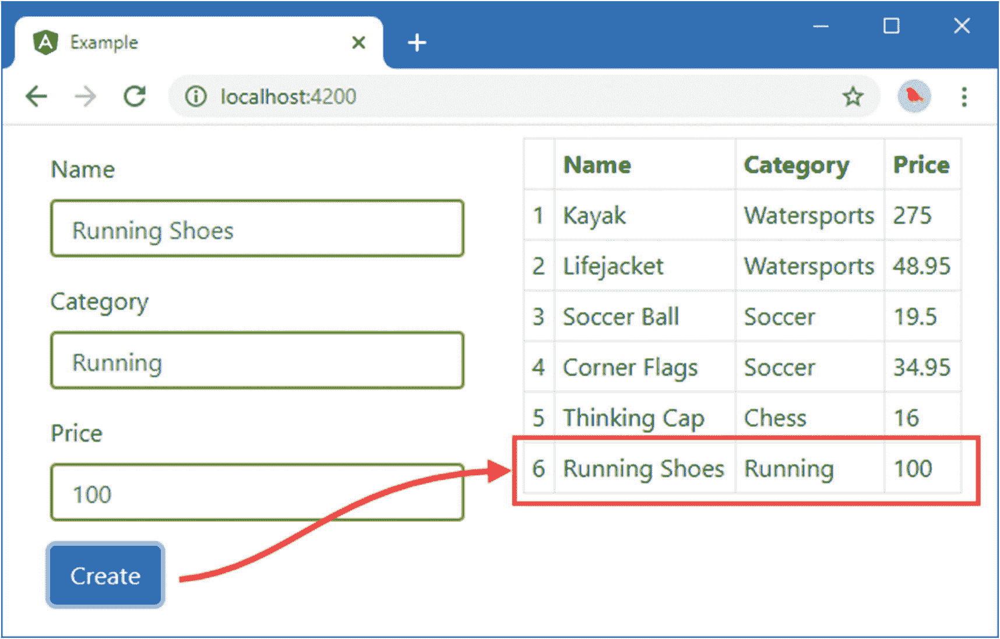
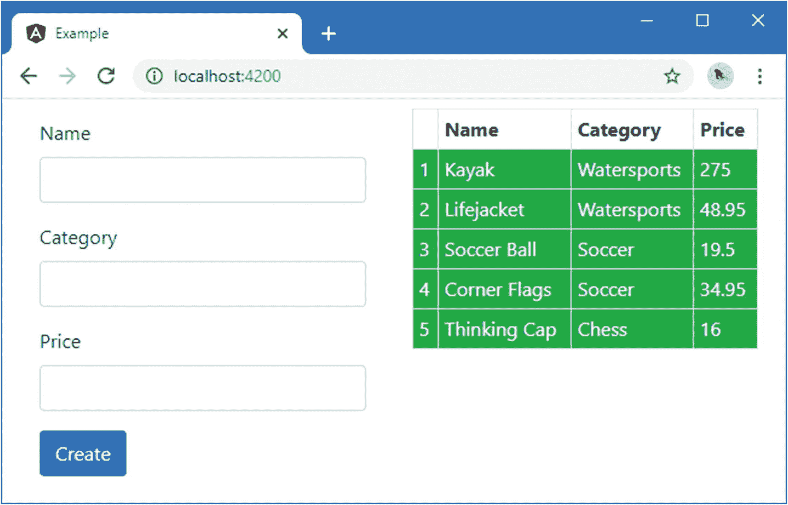
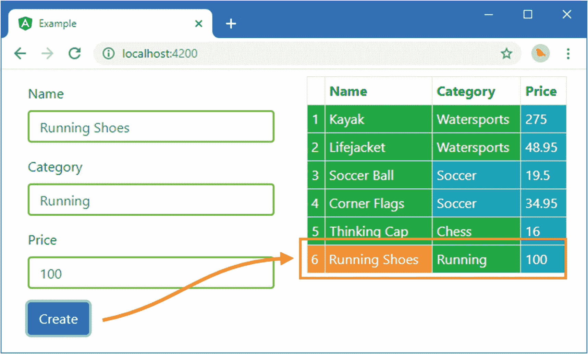

# 十五、创建属性指令

在这一章中，我将描述如何使用自定义指令来补充 Angular 的内置指令所提供的功能。本章的重点是*属性指令*，这是可以创建的最简单的类型，可以改变单个元素的外观或行为。在第 16 章[中，我解释了如何创建*结构指令*，用来改变 HTML 文档的布局。组件也是一种指令，我会在第 17 章解释它们是如何工作的。](16.html)

在这些章节中，我通过重新创建一些内置指令提供的特性来描述定制指令是如何工作的。这不是你在真实项目中通常会做的事情，但是它提供了一个有用的基线，可以用来解释这个过程。表 [15-1](#Tab1) 将属性指令放入上下文中。

表 15-1。

将属性指令放在上下文中

<colgroup><col class="tcol1 align-left"> <col class="tcol2 align-left"></colgroup> 
| 

问题

 | 

回答

 |
| --- | --- |
| 它们是什么？ | 属性指令是能够修改它们所应用到的元素的行为或外观的类。第 12 章中描述的样式和类绑定就是属性指令的例子。 |
| 它们为什么有用？ | 内置指令涵盖了 web 应用开发中最常见的任务，但并不能处理所有情况。自定义指令允许定义特定于应用的功能。 |
| 它们是如何使用的？ | 属性指令是已经应用了`@Directive`装饰器的类。它们在负责模板的组件的`directives`属性中启用，并使用 CSS 选择器应用。 |
| 有什么陷阱或限制吗？ | 创建自定义指令时的主要陷阱是编写代码来执行任务，这些任务可以使用指令功能(如输入和输出属性以及宿主元素绑定)来更好地处理。 |
| 有其他选择吗？ | Angular 支持另外两种类型的指令——结构指令和组件指令——它们可能更适合给定的任务。如果您希望避免编写自定义代码，有时可以组合内置指令来创建特定的效果，尽管结果可能很脆弱，并导致难以阅读和维护的复杂 HTML。 |

表 [15-2](#Tab2) 总结了本章内容。

表 15-2。

章节总结

<colgroup><col class="tcol1 align-left"> <col class="tcol2 align-left"> <col class="tcol3 align-left"></colgroup> 
| 

问题

 | 

解决办法

 | 

列表

 |
| --- | --- | --- |
| 创建属性指令 | 将`@Directive`应用于一个类 | 1–5 |
| 访问主体元素属性值 | 将`@Attribute`装饰器应用于构造函数参数 | 6–9 |
| 创建数据绑定输入属性 | 将`@Input`装饰器应用于一个类属性 | 10–11 |
| 当数据绑定输入属性值更改时接收通知 | 实现`ngOnChanges`方法 | Twelve |
| 定义事件 | 应用`@Output`装饰器 | 13, 14 |
| 在宿主元素上创建属性绑定或事件绑定 | 应用`@HostBinding`或`@HostListener`装饰器 | 15–19 |
| 导出指令的功能以便在模板中使用 | 使用`@Directive`装饰器的`exportAs`属性 | 20, 21 |

## 准备示例项目

正如我在本书的这一部分所做的那样，我将继续使用上一章的示例项目。为了准备这一章，我已经重新定义了表单，以便它更新组件的`newProduct`属性，而不是第 [14 章](14.html)中使用的基于模型的表单，如清单 [15-1](#PC1) 所示。

Tip

你可以从 [`https://github.com/Apress/pro-angular-9`](https://github.com/Apress/pro-angular-9) 下载本章以及本书其他章节的示例项目。如果在运行示例时遇到问题，请参见第 [1](01.html) 章获取帮助。

```ts
<style>
  input.ng-dirty.ng-invalid { border: 2px solid #ff0000 }
  input.ng-dirty.ng-valid { border: 2px solid #6bc502 }
</style>

<div class="row m-2">
  <div class="col-6">
    <form class="m-2" novalidate (ngSubmit)="submitForm()">
      <div class="form-group">
          <label>Name</label>
          <input class="form-control" name="name" [(ngModel)]="newProduct.name" />
      </div>
      <div class="form-group">
        <label>Category</label>
        <input class="form-control" name="category"
            [(ngModel)]="newProduct.category" />
      </div>
      <div class="form-group">
        <label>Price</label>
        <input class="form-control" name="price" [(ngModel)]="newProduct.price" />
      </div>
      <button class="btn btn-primary" type="submit">Create</button>
    </form>
  </div>

  <div class="col-6">
    <table class="table table-sm table-bordered table-striped">
      <tr><th></th><th>Name</th><th>Category</th><th>Price</th></tr>
      <tr *ngFor="let item of getProducts(); let i = index">
        <td>{{i + 1}}</td>
        <td>{{item.name}}</td>
        <td>{{item.category}}</td>
        <td>{{item.price}}</td>
      </tr>
    </table>
  </div>
</div>

Listing 15-1.Preparing the Template in the template.html File in the src/app Folder

```

这个清单使用 Bootstrap 网格布局并排放置表单和表格。清单 [15-2](#PC2) 移除了 JSON 输出`jsonProduct`属性，更新了组件的`addProduct`方法，以便向数据模型添加一个新对象，并简化了`submitForm`方法。

```ts
import { ApplicationRef, Component } from "@angular/core";
import { NgForm, FormGroup } from "@angular/forms";
import { Model } from "./repository.model";
import { Product } from "./product.model";
import { ProductFormGroup, ProductFormControl } from "./form.model";

@Component({
    selector: "app",
    templateUrl: "template.html"
})
export class ProductComponent {
    model: Model = new Model();
    formGroup: ProductFormGroup = new ProductFormGroup();

    getProduct(key: number): Product {
        return this.model.getProduct(key);
    }

    getProducts(): Product[] {
        return this.model.getProducts();
    }

    newProduct: Product = new Product();

    addProduct(p: Product) {
        this.model.saveProduct(p);
    }

    formSubmitted: boolean = false;

    submitForm() {
        this.addProduct(this.newProduct);
    }
}

Listing 15-2.Modifying the Data Model in the component.ts File in the src/app Folder

```

要启动应用，导航到`example`项目文件夹并运行以下命令:

```ts
ng serve

```

打开一个新的浏览器窗口并导航至`http://localhost:4200`以查看图 [15-1](#Fig1) 中的表格。当您提交表单时，数据将被验证，或者显示错误消息，或者将一个新项目添加到数据模型并显示在表中。



图 15-1。

运行示例应用

## 创建简单的属性指令

最好的起点是开始创建一个指令，看看它们是如何工作的。我用清单 [15-3](#PC4) 中所示的代码在`src/app`文件夹中添加了一个名为`attr.directive.ts`的文件。该文件的名称表明它包含指令。我将文件名的第一部分设置为`attr`,以表明这是一个属性指令的例子。

```ts
import { Directive, ElementRef } from "@angular/core";

@Directive({
    selector: "[pa-attr]",
})
export class PaAttrDirective {

    constructor(element: ElementRef) {
        element.nativeElement.classList.add("bg-success", "text-white");
    }
}

Listing 15-3.The Contents of the attr.directive.ts File in the src/app Folder

```

指令是已经应用了`@Directive`装饰器的类。装饰器需要`selector`属性，该属性用于指定如何将指令应用于元素，使用标准 CSS 样式选择器来表达。我使用的选择器是`[pa-attr]`，它将匹配任何具有名为`pa-attr`的属性的元素，而不管元素类型或分配给该属性的值。

自定义指令被赋予一个独特的前缀，以便于识别。前缀可以是对您的应用有意义的任何内容。我为我的指令选择了前缀`Pa`，反映了这本书的标题，这个前缀用于由`selector` decorator 属性和属性类的名称指定的属性中。前缀的大小写进行了更改，以反映其用途，因此选择器属性名称使用了首字母小写字符(`pa-attr`)，指令类名称使用了首字母大写字符(`PaAttrDirective`)。

Note

前缀`Ng` / `ng`保留用于内置 Angular 特征，不应使用。

指令构造函数定义了一个单独的`ElementRef`参数，Angular 在创建指令的新实例时提供这个参数，这个参数代表主机元素。`ElementRef`类定义了一个属性`nativeElement`，它返回浏览器使用的对象来表示域对象模型中的元素。该对象提供对操作元素及其内容的方法和属性的访问，包括`classList`属性，它可用于管理元素的类成员，如下所示:

```ts
...
element.nativeElement.classList.add("bg-success", "text-white");
...

```

总之，`PaAttrDirective`类是一个指令，它应用于具有`pa-attr`属性的元素，并将这些元素添加到`bg-success`和`text-white`类，引导 CSS 库使用它们为元素分配背景和文本颜色。

### 应用自定义指令

应用自定义指令有两个步骤。首先是更新模板，以便有一个或多个元素与指令使用的`selector`匹配。在示例指令的情况下，这意味着将`pa-attr`属性添加到元素中，如清单 [15-4](#PC6) 所示。

```ts
...
<table class="table table-sm table-bordered table-striped">
    <tr><th></th><th>Name</th><th>Category</th><th>Price</th></tr>
    <tr *ngFor="let item of getProducts(); let i = index" pa-attr>
        <td>{{i + 1}}</td>
        <td>{{item.name}}</td>
        <td>{{item.category}}</td>
        <td>{{item.price}}</td>
    </tr>
</table>
...

Listing 15-4.Adding a Directive Attribute in the template.html File in the src/app Folder

```

指令的选择器匹配任何具有属性的元素，不管是否为其分配了值或者该值是什么。应用指令的第二步是改变 Angular 模块的配置，如清单 [15-5](#PC7) 所示。

```ts
import { NgModule } from "@angular/core";
import { BrowserModule } from "@angular/platform-browser";
import { ProductComponent } from "./component";
import { FormsModule, ReactiveFormsModule  } from "@angular/forms";
import { PaAttrDirective } from "./attr.directive";

@NgModule({
    imports: [BrowserModule, FormsModule, ReactiveFormsModule],
    declarations: [ProductComponent, PaAttrDirective],
    bootstrap: [ProductComponent]
})
export class AppModule { }

Listing 15-5.Configuring the Component in the app.module.ts File in the src/app Folder

```

`NgModule`装饰器的`declarations`属性声明了应用将使用的指令和组件。如果指令和组件之间的关系和区别目前看起来很混乱，不要担心；这将在第 17 章[中变得清晰。](17.html)

一旦这两个步骤都完成了，那么应用于模板中的`tr`元素的`pa-attr`属性将触发自定义指令，该指令使用 DOM API 将元素添加到`bg-success`和`text-white`类中。由于`tr`元素是`ngFor`指令使用的微模板的一部分，表中的所有行都会受到影响，如图 [15-2](#Fig2) 所示。(您可能需要重新启动 Angular 开发工具才能看到变化。)



图 15-2。

应用自定义指令

## 在指令中访问应用数据

上一节中的例子展示了一个指令的基本结构，但是它没有做任何仅仅通过使用绑定在`tr`元素上的`class`属性不能执行的事情。当指令可以与宿主元素和应用的其余部分交互时，它们就变得很有用。

### 读取主体元素属性

使指令更有用的最简单方法是使用应用于主机元素的属性来配置它，这允许为指令的每个实例提供自己的配置信息，并相应地调整其行为。

举例来说，清单 [15-6](#PC8) 将该指令应用于模板表中的一些`td`元素，并添加了一个属性，该属性指定了主机元素应该添加到的类。该指令的选择器意味着它将匹配任何具有`pa-attr`属性的元素，不管标签类型如何，并且将像在`tr`元素上一样在`td`元素上工作。

```ts
...
<table class="table table-sm table-bordered table-striped">
    <tr><th></th><th>Name</th><th>Category</th><th>Price</th></tr>
    <tr *ngFor="let item of getProducts(); let i = index" pa-attr>
        <td>{{i + 1}}</td>
        <td>{{item.name}}</td>
        <td pa-attr pa-attr-class="bg-warning">{{item.category}}</td>
        <td pa-attr pa-attr-class="bg-info">{{item.price}}</td>
    </tr>
</table>
...

Listing 15-6.Adding Attributes in the template.html File in the src/app Folder

```

属性`pa-attr`已经应用于两个`td`元素，还有一个名为`pa-attr-class`的新属性，用于指定指令应该将主机元素添加到的类。清单 [15-7](#PC9) 显示了获取`pa-attr-class`属性的值并使用它来改变元素的指令所需的改变。

```ts
import { Directive, ElementRef, Attribute } from "@angular/core";

@Directive({
  selector: "[pa-attr]",
})
export class PaAttrDirective {

  constructor(element: ElementRef, @Attribute("pa-attr-class") bgClass: string) {
    element.nativeElement.classList.add(bgClass || "bg-success", "text-white");
  }
}

Listing 15-7.Reading an Attribute in the attr.directive.ts File in the src/app Folder

```

为了接收`pa-attr-class`属性的值，我添加了一个名为`bgClass`的新构造函数参数，其中已经应用了`@Attribute`装饰器。这个装饰器是在`@angular/core`模块中定义的，它指定了属性的名称，当创建一个新的 directive 类实例时，应该使用这个属性为构造函数参数提供一个值。Angular 为每个匹配选择器的元素创建一个新的装饰器实例，并使用该元素的属性为已经用`@Attribute`装饰过的指令构造函数参数提供值。

在构造函数中，属性的值被传递给`classList.add`方法，默认值允许将指令应用于具有`pa-attr`属性但没有`pa-attr-class`属性的元素。

结果是添加元素的类现在可以使用属性来指定，产生如图 [15-3](#Fig3) 所示的结果。


图 15-3。

使用主机元素属性配置指令

#### 使用单个主体元素属性

使用一个属性来应用一个指令，而使用另一个属性来配置它是多余的，让一个属性完成双重任务更有意义，如清单 [15-8](#PC10) 所示。

```ts
import { Directive, ElementRef, Attribute } from "@angular/core";

@Directive({
    selector: "[pa-attr]",
})
export class PaAttrDirective {

    constructor(element: ElementRef, @Attribute("pa-attr") bgClass: string) {
        element.nativeElement.classList.add(bgClass || "bg-success", "text-white");
    }
}

Listing 15-8.Reusing an Attribute in the attr.directive.ts File in the src/app Folder

```

`@Attribute`装饰器现在将`pa-attr`属性指定为`bgClass`参数值的来源。在清单 [15-9](#PC11) 中，我已经更新了模板以反映两用属性。

```ts
...
<table class="table table-sm table-bordered table-striped">
    <tr><th></th><th>Name</th><th>Category</th><th>Price</th></tr>
    <tr *ngFor="let item of getProducts(); let i = index" pa-attr>
        <td>{{i + 1}}</td>
        <td>{{item.name}}</td>
        <td pa-attr="bg-warning">{{item.category}}</td>
        <td pa-attr="bg-info">{{item.price}}</td>
    </tr>
</table>
...

Listing 15-9.Applying a Directive in the template.html File in the src/app Folder

```

这个示例产生的结果没有明显的变化，但是它简化了在 HTML 模板中应用指令的方式。

### 创建数据绑定输入属性

用`@Attribute`读取属性的主要限制是值是静态的。Angular 指令的真正威力来自于对表达式的支持，这些表达式可以更新以反映应用状态的变化，并可以通过更改宿主元素来做出响应。

指令使用*数据绑定输入属性*接收表达式，也称为*输入属性*，或者简称为*输入*。清单 [15-10](#PC12) 改变了应用的模板，使得应用于`tr`和`td`元素的`pa-attr`属性包含表达式，而不仅仅是静态类名。

```ts
...
<table class="table table-sm table-bordered table-striped">
    <tr><th></th><th>Name</th><th>Category</th><th>Price</th></tr>
    <tr *ngFor="let item of getProducts(); let i = index"
            [pa-attr]="getProducts().length < 6 ? 'bg-success' : 'bg-warning'">
        <td>{{i + 1}}</td>
        <td>{{item.name}}</td>
        <td [pa-attr]="item.category == 'Soccer' ? 'bg-info' : null">
            {{item.category}}
        </td>
        <td [pa-attr]="'bg-info'">{{item.price}}</td>
    </tr>
</table>
...

Listing 15-10.Using Expressions in the template.html File in the src/app Folder

```

清单中有三个表达式。第一个应用于`tr`元素，使用组件的`getProducts`方法返回的对象数量来选择一个类。

```ts
...
<tr *ngFor="let item of getProducts(); let i = index"
    [pa-attr]="getProducts().length < 6 ? 'bg-success' : 'bg-warning'">
...

```

第二个表达式应用于`Category`列的`td`元素，它为`Product`对象指定了`bg-info`类，这些对象的`Category`属性为所有其他值返回`Soccer`和`null`。

```ts
...
<td [pa-attr]="item.category == 'Soccer' ? 'bg-info' : null">
...

```

第三个也是最后一个表达式返回一个固定的字符串值，我用单引号将它括起来，因为这是一个表达式而不是静态属性值。

```ts
...
<td [pa-attr]="'bg-info'">{{item.price}}</td>
...

```

请注意，属性名是用方括号括起来的。这是因为在指令中接收表达式的方法是创建一个数据绑定，就像第 [13](13.html) 和 [14](14.html) 章中描述的内置指令一样。

Tip

忘记使用方括号是一个常见的错误。没有它们，Angular 只会将表达式的原始文本传递给指令，而不会对其进行计算。如果在应用自定义指令时遇到错误，这是首先要检查的。

实现数据绑定的另一面意味着在 directive 类中创建一个输入属性，并告诉 Angular 如何管理它的值，如清单 [15-11](#PC16) 所示。

```ts
import { Directive, ElementRef, Attribute, Input } from "@angular/core";

@Directive({
    selector: "[pa-attr]"
})
export class PaAttrDirective {

    constructor(private element: ElementRef) {}

    @Input("pa-attr")
    bgClass: string;

    ngOnInit() {
        this.element.nativeElement.classList.add(this.bgClass || "bg-success",
            "text-white");
    }
}

Listing 15-11.Defining an Input Property in the attr.directive.ts File in the src/app Folder

```

输入属性是通过将`@Input` decorator 应用于属性并使用它来指定包含表达式的属性的名称来定义的。这个清单定义了一个输入属性，它告诉 Angular 将指令的`bgClass`属性的值设置为包含在`pa-attr`属性中的表达式的值。

Tip

如果属性的名称对应于主机元素上属性的名称，您不需要向`@Input` decorator 提供参数。因此，如果您将`@Input()`应用到一个名为`myVal`的属性，那么 Angular 将在主机元素上寻找一个`myVal`属性。

在本例中，构造函数的角色发生了变化。当 Angular 创建一个指令类的新实例时，构造函数被调用来创建一个新的指令对象，然后才是输入属性集的值。这意味着构造函数无法访问输入属性值，因为 Angular 不会设置它的值，直到构造函数完成并生成新的指令对象。为了解决这个问题，指令可以实现*生命周期钩子方法*，Angular 使用这些方法在指令被创建后和应用运行时为指令提供有用的信息，如表 [15-3](#Tab3) 所述。

表 15-3。

指令生命周期挂钩方法

<colgroup><col class="tcol1 align-left"> <col class="tcol2 align-left"></colgroup> 
| 

名字

 | 

描述

 |
| --- | --- |
| `ngOnInit` | 在 Angular 为指令声明的所有输入属性设置了初始值之后，将调用此方法。 |
| `ngOnChanges` | 当输入属性的值已经改变时，并且就在调用`ngOnInit`方法之前，调用该方法。 |
| `ngDoCheck` | 当 Angular 运行它的变化检测过程时调用这个方法，以便指令有机会更新任何与输入属性没有直接关联的状态。 |
| `ngAfterContentInit` | 当指令的内容已经初始化时，调用此方法。有关使用该方法的示例，请参见第 [16](16.html) 章中的“接收查询更改通知”一节。 |
| `ngAfterContentChecked` | 在作为更改检测过程的一部分检查了指令的内容之后，将调用此方法。 |
| `ngOnDestroy` | 在 Angular 销毁指令之前立即调用此方法。 |

为了在主机元素上设置类，清单 [15-11](#PC16) 中的指令实现了`ngOnInit`方法，该方法在 Angular 设置了`bgClass`属性的值之后被调用。仍然需要构造函数来接收提供对主机元素访问的`ElementRef`对象，该对象被分配给一个名为`element`的属性。

结果是 Angular 将为每个`tr`元素创建一个指令对象，评估在`pa-attr`属性中指定的表达式，使用结果来设置输入属性的值，然后调用`ngOnInit`方法，这允许指令响应新的输入属性值。

要查看效果，请使用该表单向示例应用添加一个新产品。由于模型中最初有五个项目，`tr`元素的表达式将选择`bg-success`类。添加新项时，Angular 会创建 directive 类的另一个实例，并对表达式求值以设置 input 属性的值；由于现在模型中有六个项目，表达式将选择`bg-warning`类，该类为新行提供不同的背景颜色，如图 [15-4](#Fig4) 所示。



图 15-4。

在自定义指令中使用输入属性

### 响应输入属性更改

在前一个例子中发生了一些奇怪的事情:添加一个新项目影响了新元素的外观，但没有影响现有的元素。在幕后，Angular 已经为它创建的每个指令更新了`bgClass`属性的值——表列中的每个`td`元素一个——但是指令没有注意到，因为更改属性值不会自动导致指令响应。

为了处理变更，指令必须实现`ngOnChanges`方法，以便在输入属性的值发生变更时接收通知，如清单 [15-12](#PC17) 所示。

```ts
import { Directive, ElementRef, Attribute, Input,
         SimpleChange } from "@angular/core";

@Directive({
    selector: "[pa-attr]"
})
export class PaAttrDirective {

    constructor(private element: ElementRef) {}

    @Input("pa-attr")
    bgClass: string;

    ngOnChanges(changes: {[property: string]: SimpleChange }) {
        let change = changes["bgClass"];
        let classList = this.element.nativeElement.classList;
        if (!change.isFirstChange() && classList.contains(change.previousValue)) {
            classList.remove(change.previousValue);
        }
        if (!classList.contains(change.currentValue)) {
            classList.add(change.currentValue);
        }
    }
}

Listing 15-12.Receiving Change Notifications in the attr.directive.ts File in the src/app Folder

```

在调用`ngOnInit`方法之前，调用一次`ngOnChanges`方法，然后每当指令的输入属性发生变化时，再次调用该方法。`ngOnChanges`参数是一个对象，其属性名引用每个改变的输入属性，其值是在`@angular/core`模块中定义的`SimpleChange`对象。TypeScript 将这种数据结构表示如下:

```ts
...
ngOnChanges(changes: {[property: string]: SimpleChange }) {
...

```

`SimpleChange`类定义了表 [15-4](#Tab4) 中所示的成员。

表 15-4。

SimpleChange 类的属性和方法

<colgroup><col class="tcol1 align-left"> <col class="tcol2 align-left"></colgroup> 
| 

名字

 | 

描述

 |
| --- | --- |
| `previousValue` | 此属性返回输入属性的上一个值。 |
| `currentValue` | 此属性返回输入属性的当前值。 |
| `isFirstChange()` | 如果这是对发生在`ngOnInit`方法之前的`ngOnChanges`方法的调用，则该方法返回`true`。 |

理解向`ngOnChanges`方法呈现更改的最简单的方法是将对象序列化为 JSON，然后查看它。

```ts
...
{
    "target": {
        "previousValue":"bg-success",
        "currentValue":"bg-warning"
    }
}
...

```

这去掉了`isFirstChange`方法，但是它确实有助于展示 argument 对象中的每个属性被用来指示输入属性的变化的方式。

当响应输入属性值的更改时，指令必须确保撤销先前更新的效果。在示例指令的情况下，这意味着从`previousValue`类中移除元素并将其添加到`currentValue`类中。

使用`isFirstChange`方法很重要，这样你就不会撤销一个实际上还没有应用的值，因为第一次给输入属性赋值时调用了`ngOnChanges`方法。

处理这些更改通知的结果是，当 Angular 重新计算表达式并更新输入属性时，指令会做出响应。现在，当你向应用中添加一个新产品时，所有`tr`元素的背景颜色都会更新，如图 [15-5](#Fig5) 所示。


图 15-5。

响应输入属性更改

## 创建自定义事件

*输出属性*是一个 Angular 特性，它允许指令将自定义事件添加到它们的主机元素中，通过它可以将重要变化的细节发送到应用的其余部分。使用`@Output`装饰器定义输出属性，该装饰器在`@angular/core`模块中定义，如清单 [15-13](#PC20) 所示。

```ts
import { Directive, ElementRef, Attribute, Input,
         SimpleChange, Output, EventEmitter } from "@angular/core";
import { Product } from "./product.model";

@Directive({
    selector: "[pa-attr]"
})
export class PaAttrDirective {

    constructor(private element: ElementRef) {
        this.element.nativeElement.addEventListener("click", e => {
            if (this.product != null) {
                this.click.emit(this.product.category);
            }
        });
    }

    @Input("pa-attr")
    bgClass: string;

    @Input("pa-product")
    product: Product;

    @Output("pa-category")
    click = new EventEmitter<string>();

    ngOnChanges(changes: {[property: string]: SimpleChange }) {
        let change = changes["bgClass"];
        let classList = this.element.nativeElement.classList;
        if (!change.isFirstChange() && classList.contains(change.previousValue)) {
            classList.remove(change.previousValue);
        }
        if (!classList.contains(change.currentValue)) {
            classList.add(change.currentValue);
        }
    }
}

Listing 15-13.Defining an Output Property in the attr.directive.ts File in the src/app Folder

```

`EventEmitter`类为 Angular 指令提供了事件机制。清单创建了一个`EventEmitter`对象，并将其赋给一个名为`click`的变量，如下所示:

```ts
...
@Output("pa-category")
click = new EventEmitter<string>();
...

```

类型参数表明当事件被触发时，事件的监听器将接收一个字符串。指令可以向它们的事件监听器提供任何类型的对象，但是常见的选择是`string`和`number`值、数据模型对象和 JavaScript `Event`对象。

当鼠标按钮在主机元素上单击时，清单中的定制事件被触发，该事件向其侦听器提供使用`ngFor`指令创建表格行的`Product`对象的`category`。其效果是，该指令响应宿主元素上的 DOM 事件，并生成自己的自定义事件作为响应。DOM 事件的侦听器是使用浏览器的标准`addEventListener`方法在指令类构造函数中设置的，如下所示:

```ts
...
constructor(private element: ElementRef) {
    this.element.nativeElement.addEventListener("click", e => {
        if (this.product != null) {
            this.click.emit(this.product.category);
        }
    });
}
...

```

该指令定义了一个输入属性来接收`Product`对象，该对象的类别将在事件中发送。(该指令能够在构造函数中引用输入属性值的值，因为 Angular 将在调用分配用于处理 DOM 事件的函数之前设置属性值。)

清单中最重要的语句是使用`EventEmitter`对象发送事件的语句，这是使用`EventEmitter.emit`方法完成的，在表 [15-5](#Tab5) 中有描述，以供快速参考。`emit`方法的参数是您希望事件侦听器接收的值，在本例中是`category`属性的值。

表 15-5。

EventEmitter 方法

<colgroup><col class="tcol1 align-left"> <col class="tcol2 align-left"></colgroup> 
| 

名字

 | 

描述

 |
| --- | --- |
| `emit(value)` | 该方法触发与`EventEmitter`相关联的定制事件，向侦听器提供作为方法参数接收的对象或值。 |

将一切联系在一起的是`@Output`装饰器，它在指令类`EventEmitter`属性和将用于绑定到模板中事件的名称之间创建一个映射，如下所示:

```ts
...
@Output("pa-category")
click = new EventEmitter<string>();
...

```

装饰器的参数指定了将在应用于主机元素的事件绑定中使用的属性名。如果 TypeScript 属性名称也是自定义事件的名称，则可以省略该参数。我在清单中指定了`pa-category`,这允许我在指令类中将事件称为`click`,但是需要一个更有意义的外部名称。

### 绑定到自定义事件

Angular 通过使用与内置事件相同的绑定语法，很容易绑定到模板中的自定义事件，这在第 [14 章](14.html)中有描述。清单 [15-14](#PC24) 将`pa-product`属性添加到模板中的`tr`元素，为指令提供其`Product`对象，并为`pa-category`事件添加一个绑定。

```ts
...
<table class="table table-sm table-bordered table-striped">
    <tr><th></th><th>Name</th><th>Category</th><th>Price</th></tr>
    <tr *ngFor="let item of getProducts(); let i = index"
            [pa-attr]="getProducts().length < 6 ? 'bg-success' : 'bg-warning'"
            [pa-product]="item" (pa-category)="newProduct.category = $event">
        <td>{{i + 1}}</td>
        <td>{{item.name}}</td>
        <td [pa-attr]="item.category == 'Soccer' ? 'bg-info' : null">
            {{item.category}}
        </td>
        <td [pa-attr]="'bg-info'">{{item.price}}</td>
    </tr>
</table>
...

Listing 15-14.Binding to a Custom Event in the template.html File in the src/app Folder

```

术语`$event`用于访问指令传递给`EventEmitter.emit`方法的值。这意味着在本例中，`$event`将是一个包含产品类别的`string`值。从事件中接收的值用于设置类别`input`元素的值，这意味着单击表格中的一行将在表单中显示产品的类别，如图 [15-6](#Fig6) 所示。


图 15-6。

使用输出属性定义和接收自定义事件

## 创建宿主元素绑定

示例指令依赖浏览器的 DOM API 来操作其主机元素，既添加和删除类成员，又接收`click`事件。在 Angular 应用中使用 DOM API 是一项有用的技术，但这意味着您的指令只能在 web 浏览器中运行的应用中使用。Angular 旨在在一系列不同的执行环境中运行，并不是所有的执行环境都能提供 DOM API。

即使您确定某个指令可以访问 DOM，也可以使用标准的 angle 指令特性(属性和事件绑定)以更优雅的方式获得相同的结果。可以在 host 元素上使用类绑定，而不是使用 DOM 来添加和删除类。可以使用事件绑定来处理鼠标点击，而不是使用`addEventListener`方法。

在幕后，当在 web 浏览器中使用该指令时，Angular 使用 DOM API 实现这些特性——或者当该指令在不同的环境中使用时，使用一些等效的机制。

主机元素上的绑定是使用两个装饰器定义的，`@HostBinding`和`@HostListener`，它们都是在`@angular/core`模块中定义的，如清单 [15-15](#PC25) 所示。

```ts
import { Directive, ElementRef, Attribute, Input,
         SimpleChange, Output, EventEmitter, HostListener, HostBinding }
            from "@angular/core";
 import { Product } from "./product.model";

@Directive({
    selector: "[pa-attr]"
})
export class PaAttrDirective {

    @Input("pa-attr")
    @HostBinding("class")
    bgClass: string;

    @Input("pa-product")
    product: Product;

    @Output("pa-category")
    click = new EventEmitter<string>();

    @HostListener("click")
    triggerCustomEvent() {
        if (this.product != null) {
            this.click.emit(this.product.category);
        }
    }
}

Listing 15-15.Creating Host Bindings in the attr.directive.ts File in the src/app Folder

```

`@HostBinding` decorator 用于在主机元素上设置一个属性绑定，并应用于一个指令属性。清单在主机元素的`class`属性和装饰者的`bgClass`属性之间建立了一个绑定。

Tip

如果想要管理元素的内容，可以使用`@HostBinding`装饰器绑定到`textContent`属性。例子见第 [19](19.html) 章。

`@HostListener`装饰器用于在主机元素上设置事件绑定，并应用于一个方法。该清单为`click`事件创建了一个事件绑定，当鼠标按钮被按下并释放时，该事件将调用`triggerCustomEvent`方法。顾名思义，`triggerCustomEvent`方法使用`EventEmitter.emit`方法通过输出属性调度定制事件。

使用主机元素绑定意味着可以删除指令构造函数，因为不再需要通过`ElementRef`对象访问 HTML 元素。相反，Angular 负责设置事件侦听器，并通过属性绑定设置元素的类成员。

虽然指令代码要简单得多，但是指令的效果是一样的:单击一个表格行设置一个`input`元素的值，使用表单添加一个新项目会触发不属于`Soccer`类别的产品的表格单元格的背景颜色的变化。

## 在宿主元素上创建双向绑定

Angular 为创建支持双向绑定的指令提供了特殊的支持，因此它们可以与`ngModel`使用的香蕉盒样式一起使用，并且可以双向绑定到模型属性。

双向绑定功能依赖于命名约定。为了演示它是如何工作的，清单 [15-16](#PC26) 向`template.html`文件添加了一些新元素和绑定。

```ts
...
<div class="col-6">

  <div class="form-group bg-info text-white p-2">
    <label>Name:</label>
    <input class="bg-primary text-white" [paModel]="newProduct.name"
        (paModelChange)="newProduct.name = $event" />
  </div>

  <table class="table table-sm table-bordered table-striped">
    <tr><th></th><th>Name</th><th>Category</th><th>Price</th></tr>
    <tr *ngFor="let item of getProducts(); let i = index"
            [pa-attr]="getProducts().length < 6 ? 'bg-success' : 'bg-warning'"
            [pa-product]="item" (pa-category)="newProduct.category = $event">
        <td>{{i + 1}}</td>
        <td>{{item.name}}</td>
        <td [pa-attr]="item.category == 'Soccer' ? 'bg-info' : null">
            {{item.category}}
        </td>
        <td [pa-attr]="'bg-info'">{{item.price}}</td>
    </tr>
  </table>
</div>
...

Listing 15-16.Applying a Directive in the template.html File in the src/app Folder

```

我将创建一个支持两个单向绑定的指令。当`newProduct.name`属性的值改变时，目标为`paModel`的绑定将被更新，这提供了从应用到指令的数据流，并将用于更新`input`元素的内容。定制事件`paModelChange`将在用户更改 name input 元素的内容时被触发，并将从指令向应用的其余部分提供数据流。

为了实现这个指令，我在`src/app`文件夹中添加了一个名为`twoway.directive.ts`的文件，并用它来定义清单 [15-17](#PC27) 中所示的指令。

```ts
import { Input, Output, EventEmitter, Directive,
         HostBinding, HostListener, SimpleChange } from "@angular/core";

@Directive({
    selector: "input[paModel]"
})
export class PaModel {

    @Input("paModel")
    modelProperty: string;

    @HostBinding("value")
    fieldValue: string = "";

    ngOnChanges(changes: { [property: string]: SimpleChange }) {
        let change = changes["modelProperty"];
        if (change.currentValue != this.fieldValue) {
            this.fieldValue = changes["modelProperty"].currentValue || "";
        }
    }

    @Output("paModelChange")
    update = new EventEmitter<string>();

    @HostListener("input", ["$event.target.value"])
    updateValue(newValue: string) {
        this.fieldValue = newValue;
        this.update.emit(newValue);
    }
}

Listing 15-17.The Contents of the twoway.directive.ts File in the src/app Folder

```

该指令使用了之前描述过的功能。该指令的`selector`属性指定它将匹配具有`paModel`属性的`input`元素。内置的`ngModel`双向指令支持一系列的表单元素，并且知道每个元素使用哪些事件和属性，但是我想保持这个例子简单，所以我将只支持`input`元素，它定义了一个`value`属性来获取和设置元素内容。

使用输入属性和`ngOnChanges`方法实现了`paModel`绑定，该方法通过在`input`元素的`value`属性上绑定主机来更新输入元素的内容，从而响应表达式值的变化。

使用一个主机监听器在`input`事件上实现`paModelChange`事件，然后通过输出属性发送一个更新。注意，事件调用的方法能够通过给`@HostListener`装饰器指定一个额外的参数来接收事件对象，如下所示:

```ts
...
@HostListener("input", ["$event.target.value"])
updateValue(newValue: string) {
...

```

`@HostListener`装饰器的第一个参数指定了将由监听器处理的事件的名称。第二个参数是一个数组，用于为修饰方法提供参数。在这个例子中，`input`事件将由监听器处理，当`updateValue`方法被调用时，它的`newValue`参数将被设置为`Event`对象的`target.value`属性，使用`$event`引用该属性。

为了启用该指令，我将它添加到 Angular 模块中，如清单 [15-18](#PC29) 所示。

```ts
import { NgModule } from "@angular/core";
import { BrowserModule } from "@angular/platform-browser";
import { ProductComponent } from "./component";
import { FormsModule, ReactiveFormsModule  } from "@angular/forms";
import { PaAttrDirective } from "./attr.directive";
import { PaModel } from "./twoway.directive";

@NgModule({
    imports: [BrowserModule, FormsModule, ReactiveFormsModule],
    declarations: [ProductComponent, PaAttrDirective, PaModel],
    bootstrap: [ProductComponent]
})
export class AppModule { }

Listing 15-18.Registering the Directive in the app.module.ts File in the src/app Folder

```

当您保存更改并重新加载浏览器时，您将看到一个新的`input`元素，它响应对模型属性的更改，并在其宿主元素的内容发生更改时更新模型属性。绑定中的表达式指定了 HTML 文档左侧表单中`Name`字段使用的相同模型属性，这为测试它们之间的关系提供了一种便捷的方式，如图 [15-7](#Fig7) 所示。


图 15-7。

测试双向数据流

Tip

对于此示例，您可能需要停止 Angular 开发工具，重新启动它们，并重新加载浏览器。Angular 开发工具并不总是正确地处理变更。

最后一步是简化绑定并应用香蕉盒样式的括号，如清单 [15-19](#PC30) 所示。

```ts
...
<div class="col-6">

    <div class="form-group bg-info text-white p-2">
      <label>Name:</label>
      <input class="bg-primary text-white" [(paModel)]="newProduct.name" />
    </div>

    <table class="table table-sm table-bordered table-striped">
        <tr><th></th><th>Name</th><th>Category</th><th>Price</th></tr>
        <tr *ngFor="let item of getProducts(); let i = index"
                [pa-attr]="getProducts().length < 6 ? 'bg-success' : 'bg-warning'"
                [pa-product]="item" (pa-category)="newProduct.category=$event">
            <td>{{i + 1}}</td>
            <td>{{item.name}}</td>
            <td [pa-attr]="item.category == 'Soccer' ? 'bg-info' : null">
                {{item.category}}
            </td>
            <td [pa-attr]="'bg-info'">{{item.price}}</td>
        </tr>
    </table>
</div>
...

Listing 15-19.Simplifying the Bindings in the template.html File in the src/app Folder

```

当 Angular 遇到`[()]`括号时，它扩展绑定以匹配清单 [15-16](#PC26) 中使用的格式，目标是`paModel`输入属性并设置`paModelChange`事件。只要一个指令将这些暴露给 Angular，就可以使用香蕉盒括号将其作为目标，从而产生一个更简单的模板语法。

## 导出在模板变量中使用的指令

在前面的章节中，我使用模板变量来访问内置指令提供的功能，比如`ngForm`。作为一个例子，下面是第 14 章中的一个元素:

```ts
...
<form novalidate #form="ngForm" (ngSubmit)="submitForm(form)">
...

```

给`form`模板变量赋值`ngForm`，然后用它来访问 HTML 表单的验证信息。这是一个说明指令如何提供对其属性和方法的访问的示例，以便在数据绑定和表达式中使用它们。

清单 [15-20](#PC32) 修改了上一节中的指令，以便它提供是否扩展了其主机元素中的文本的细节。

```ts
import { Input, Output, EventEmitter, Directive,
    HostBinding, HostListener, SimpleChange } from "@angular/core";

@Directive({
    selector: "input[paModel]",
    exportAs: "paModel"
})
export class PaModel {

    direction: string = "None";

    @Input("paModel")
    modelProperty: string;

    @HostBinding("value")
    fieldValue: string = "";

    ngOnChanges(changes: { [property: string]: SimpleChange }) {
        let change = changes["modelProperty"];
        if (change.currentValue != this.fieldValue) {
            this.fieldValue = changes["modelProperty"].currentValue || "";
            this.direction = "Model";
        }
    }

    @Output("paModelChange")
    update = new EventEmitter<string>();

    @HostListener("input", ["$event.target.value"])
    updateValue(newValue: string) {
        this.fieldValue = newValue;
        this.update.emit(newValue);
        this.direction = "Element";
    }
}

Listing 15-20.Exporting a Directive in the twoway.directive.ts File in the src/app Folder

```

`@Directive`装饰器的`exportAs`属性指定了一个名称，该名称将用于引用模板变量中的指令。这个例子使用`paModel`作为`exportAs`属性的值，并且您应该尝试使用能够清楚地表明哪个指令提供了该功能的名称。

清单向指令添加了一个名为`direction`的属性，用于指示数据何时从模型流向元素，或者从元素流向模型。

当您使用`exportAs` decorator 时，您提供了对该指令定义的所有方法和属性的访问，这些方法和属性将在模板表达式和数据绑定中使用。一些开发人员给不在指令之外使用的方法和属性的名字加上下划线(`_`字符)或者使用`private`关键字。这是对其他开发人员的一个提示，有些方法和属性不应该使用，但 Angular 并没有强制执行。清单 [15-21](#PC33) 为指令的导出功能创建一个模板变量，并在样式绑定中使用它。

```ts
...
<div class="col-6">

    <div class="form-group bg-info text-white p-2">
        <label>Name:</label>
        <input class="bg-primary text-white" [(paModel)]="newProduct.name"
            #paModel="paModel" />
        <div class="bg-primary text-white">Direction: {{paModel.direction}}</div>
    </div>

    <table class="table table-sm table-bordered table-striped">
        <tr><th></th><th>Name</th><th>Category</th><th>Price</th></tr>
        <tr *ngFor="let item of getProducts(); let i = index"
                [pa-attr]="getProducts().length < 6 ? 'bg-success' : 'bg-warning'"
                [pa-product]="item" (pa-category)="newProduct.category = $event">
            <td>{{i + 1}}</td>
            <td>{{item.name}}</td>
            <td [pa-attr]="item.category == 'Soccer' ? 'bg-info' : null">
                {{item.category}}
            </td>
            <td [pa-attr]="'bg-info'">{{item.price}}</td>
        </tr>
    </table>
</div>
...

Listing 15-21.Using Exported Directive Functionality in the template.html File in the src/app Folder

```

模板变量称为`paModel`，它的值是指令的`exportAs`属性中使用的名称。

```ts
...
#paModel="paModel"
...

```

Tip

您不必为变量和指令使用相同的名称，但这有助于明确功能的来源。

一旦定义了模板变量，就可以在插值绑定中使用它，或者将其作为绑定表达式的一部分。我选择了一个字符串插值绑定，它的表达式使用指令的`direction`属性的值。

```ts
...
<div class="bg-primary text-white">Direction: {{paModel.direction}}</div>
...

```

结果是您可以看到在绑定到`newProduct.name`模型属性的两个`input`元素中键入文本的效果。当你输入一个使用`ngModel`指令的，那么字符串插值绑定会显示`Model`。当你键入使用`paModel`指令的元素时，字符串插值绑定会显示`Element`，如图 [15-8](#Fig8) 所示。


图 15-8。

从指令中导出功能

## 摘要

在本章中，我描述了如何定义和使用属性指令，包括输入和输出属性以及主机绑定的使用。在下一章中，我将解释结构化指令是如何工作的，以及如何用它们来改变 HTML 文档的布局或结构。