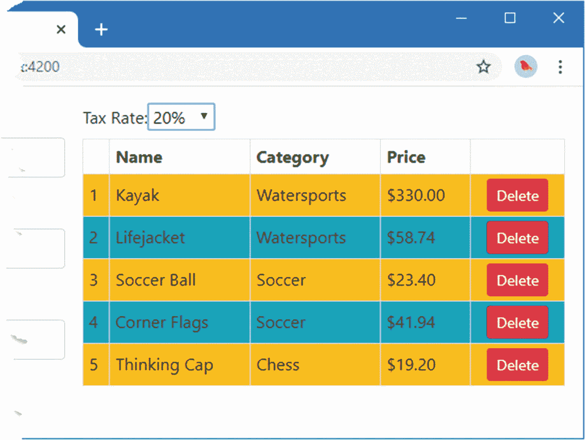
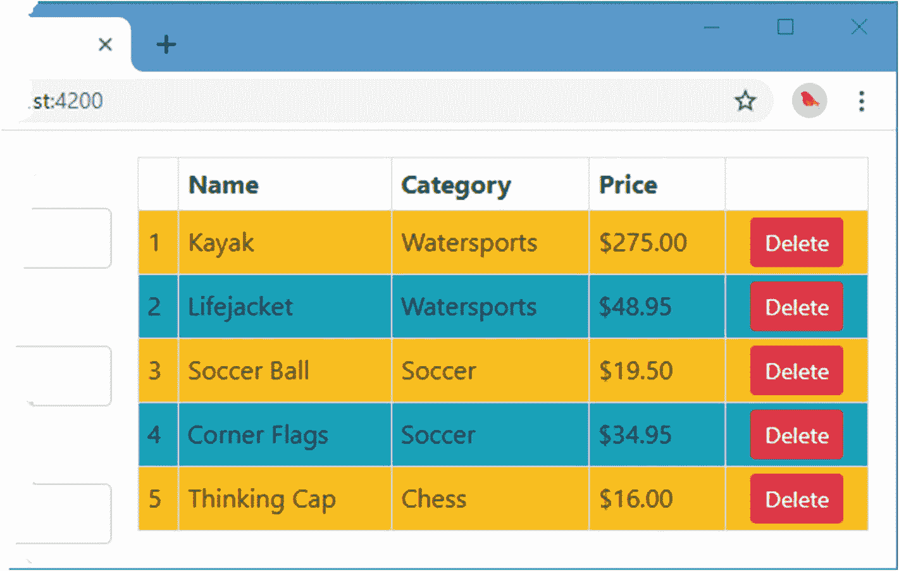
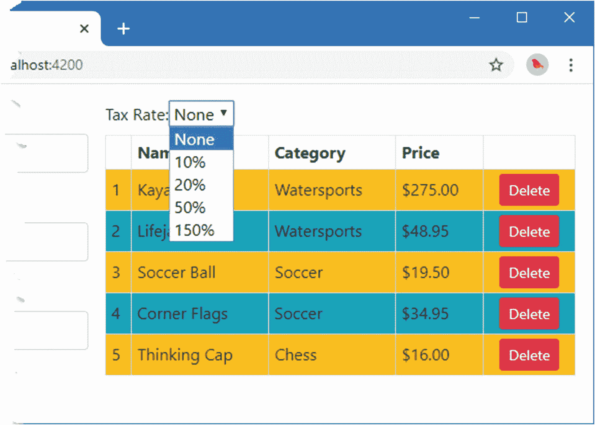
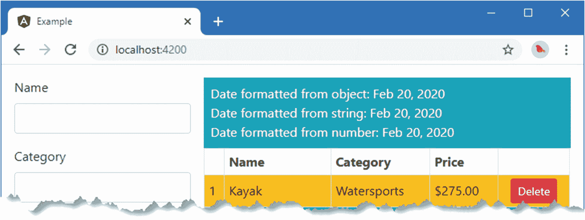
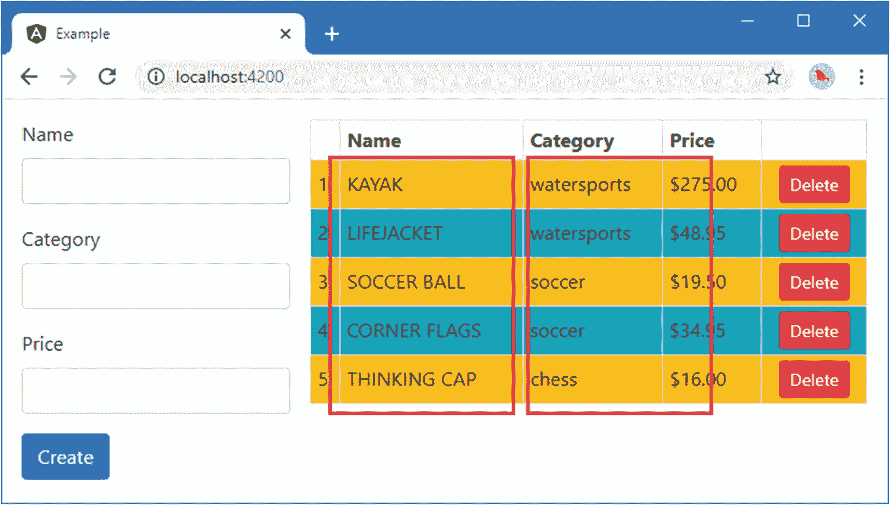
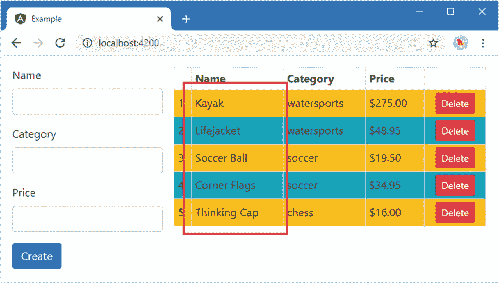
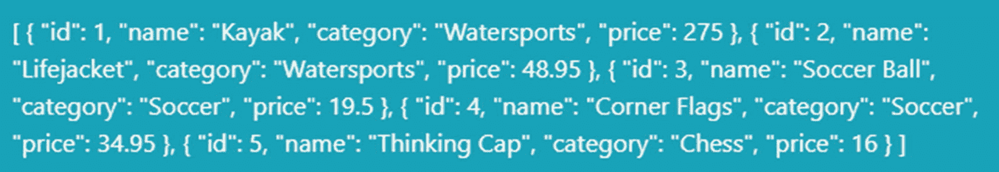
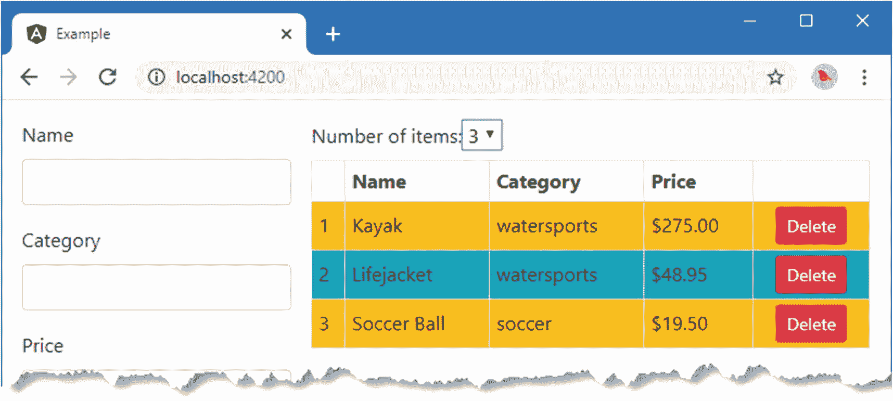
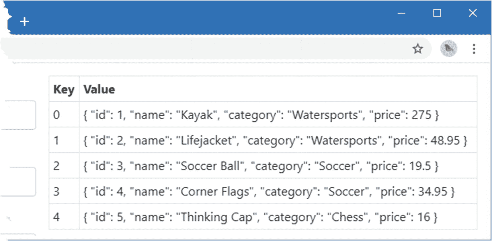
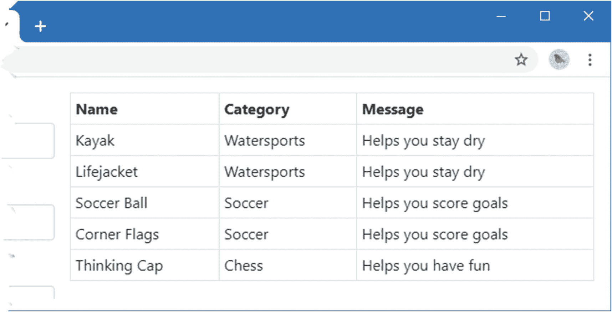

# 十八、使用和创建管道

管道是转换数据值的小段代码，因此它们可以在模板中显示给用户。管道允许在自包含的类中定义转换逻辑，这样就可以在整个应用中一致地应用它。表 [18-1](#Tab1) 将管道放在上下文中。

表 18-1。

将管道放在上下文中

<colgroup><col class="tcol1 align-left"> <col class="tcol2 align-left"></colgroup> 
| 

问题

 | 

回答

 |
| --- | --- |
| 它们是什么？ | 管道是用于准备向用户显示的数据的类。 |
| 它们为什么有用？ | 管道允许在单个类中定义准备逻辑，该类可以在整个应用中使用，从而确保数据以一致的方式呈现。 |
| 它们是如何使用的？ | `@Pipe` decorator 应用于一个类，用于指定一个名称，通过这个名称管道可以在模板中使用。 |
| 有什么陷阱或限制吗？ | 管道应该简单，并专注于准备数据。让功能渗透到由其他构建块负责的领域，比如指令或组件，是很诱人的。 |
| 还有其他选择吗？ | 您可以在组件或指令中实现数据准备代码，但是这使得在应用的其他部分重用变得更加困难。 |

表 [18-2](#Tab2) 总结了本章内容。

表 18-2。

章节总结

<colgroup><col class="tcol1 align-left"> <col class="tcol2 align-left"> <col class="tcol3 align-left"></colgroup> 
| 

问题

 | 

解决办法

 | 

列表

 |
| --- | --- | --- |
| 格式化包含在模板中的数据值 | 在数据绑定表达式中使用管道 | 1–6 |
| 创建自定义管道 | 将`@Pipe`装饰器应用于一个类 | 7–9 |
| 使用多个管道格式化数据值 | 使用竖线字符将管道名称连接在一起 | Ten |
| 指定 Angular 应何时重新评估管道的输出 | 使用`@Pipe`装饰器的`pure`属性 | 11–14 |
| 格式化数值 | 使用`number`管道 | 15, 16 |
| 格式化货币值 | 使用`currency`管道 | 17, 18 |
| 格式化百分比值 | 使用`percent`管道 | 19–22 |
| 更改字符串的大小写 | 使用`uppercase`或`lowercase`管 | 23, 24 |
| 将对象序列化为 JSON 格式 | 使用`json`管道 | Twenty-five |
| 从数组中选择元素 | 使用`slice`管道 | Twenty-six |
| 将对象或映射格式化为键/值对 | 使用`keyvalue`管道 | Twenty-seven |
| 选择要为字符串或数字值显示的值 | 使用`i18nSelect`或`i18nPlural`管 | 28–30 |

## 准备示例项目

我将继续使用在第 [11](11.html) 章中首次创建的示例项目，该项目已经在以后的章节中进行了扩展和修改。在前一章的最后几个例子中，组件样式和视图子查询让应用看起来非常花哨，我将在本章中淡化这一点。在清单 [18-1](#PC1) 中，我禁用了应用于表单元素的内嵌组件样式。

Tip

你可以从 [`https://github.com/Apress/pro-angular-9`](https://github.com/Apress/pro-angular-9) 下载本章以及本书其他章节的示例项目。如果在运行示例时遇到问题，请参见第 [1](01.html) 章获取帮助。

```ts
import { Component, Output, EventEmitter, ViewEncapsulation } from "@angular/core";
import { Product } from "./product.model";

@Component({
    selector: "paProductForm",
    templateUrl: "productForm.component.html",
    // styleUrls: ["productForm.component.css"],
    // encapsulation: ViewEncapsulation.Emulated
})
export class ProductFormComponent {
    newProduct: Product = new Product();

    @Output("paNewProduct")
    newProductEvent = new EventEmitter<Product>();

    submitForm(form: any) {
        this.newProductEvent.emit(this.newProduct);
        this.newProduct = new Product();
        form.reset();
    }
}

Listing 18-1.Disabling CSS Styles in the productForm.component.ts File in the src/app Folder

```

为了禁用表格单元格的棋盘颜色，我更改了`PaCellColor`指令的选择器，使其匹配一个当前没有应用于 HTML 元素的属性，如清单 [18-2](#PC2) 所示。

```ts
import { Directive, HostBinding } from "@angular/core";

@Directive({
    selector: "td[paApplyColor]"
})
export class PaCellColor {

    @HostBinding("class")
    bgClass: string = "";

    setColor(dark: Boolean) {
        this.bgClass = dark ? "bg-dark" : "";
    }
}

Listing 18-2.Changing the Selector in the cellColor.directive.ts File in the src/app Folder

```

清单 [18-3](#PC3) 禁用了根组件定义的深度样式。

```ts
import { ApplicationRef, Component } from "@angular/core";
import { Model } from "./repository.model";
import { Product } from "./product.model";
import { ProductFormGroup } from "./form.model";

@Component({
    selector: "app",
    templateUrl: "template.html",
    //styles: ["/deep/ div { border: 2px black solid;  font-style:italic }"]
})
export class ProductComponent {
    model: Model = new Model();

    addProduct(p: Product) {
        this.model.saveProduct(p);
    }
}

Listing 18-3.Disabling CSS Styles in the component.ts File in the src/app Folder

```

下一个变化是简化`ProductTableComponent`类，删除不再需要的方法和属性，并添加将在后面的示例中使用的新属性，如清单 [18-4](#PC4) 所示。

```ts
import { Component, Input, ViewChildren, QueryList } from "@angular/core";
import { Model } from "./repository.model";
import { Product } from "./product.model";

@Component({
    selector: "paProductTable",
    templateUrl: "productTable.component.html"
})
export class ProductTableComponent {

    @Input("model")
    dataModel: Model;

    getProduct(key: number): Product {
        return this.dataModel.getProduct(key);
    }

    getProducts(): Product[] {
        return this.dataModel.getProducts();
    }

    deleteProduct(key: number) {
        this.dataModel.deleteProduct(key);
    }

    taxRate: number = 0;
    categoryFilter: string;
    itemCount: number = 3;
}

Listing 18-4.Simplifying the Code in the productTable.component.ts File in the src/app Folder

```

最后，我从根组件的模板中移除了一个组件元素，以禁用显示和隐藏表格的复选框，如清单 [18-5](#PC5) 所示。

```ts
<div class="row m-2">
  <div class="col-4 p-2">
    <paProductForm (paNewProduct)="addProduct($event)"></paProductForm>
  </div>
  <div class="col-8 p-2">
    <paProductTable [model]="model"></paProductTable>
  </div>
</div>

Listing 18-5.Simplifying the Elements in the template.html File in the src/app Folder

```

在`example`文件夹中运行以下命令，启动 Angular 开发工具:

```ts
ng serve

```

打开一个新的浏览器选项卡并导航至`http://localhost:4200`以查看如图 [18-1](#Fig1) 所示的内容。


图 18-1。

运行示例应用

## 了解管道

管道是在指令或组件接收数据之前转换数据的类。这听起来可能不像是一项重要的工作，但是管道可以用来轻松、一致地执行一些最常见的开发任务。

作为一个演示如何使用管道的简单例子，清单 [18-6](#PC7) 应用了一个内置管道来转换应用显示的表的`Price`列中的值。

```ts
<table class="table table-sm table-bordered table-striped">
    <tr><th></th><th>Name</th><th>Category</th><th>Price</th><th></th></tr>
    <tr *paFor="let item of getProducts(); let i = index; let odd = odd;
            let even = even" [class.bg-info]="odd" [class.bg-warning]="even">
        <td style="vertical-align:middle">{{i + 1}}</td>
        <td style="vertical-align:middle">{{item.name}}</td>
        <td style="vertical-align:middle">{{item.category}}</td>
        <td style="vertical-align:middle">
            {{item.price | currency:"USD":"symbol" }}
        </td>
        <td class="text-center">
            <button class="btn btn-danger btn-sm" (click)="deleteProduct(item.id)">
                Delete
            </button>
        </td>
    </tr>
</table>

Listing 18-6.Using a Pipe in the productTable.component.html File in the src/app Folder

```

应用管道的语法类似于命令提示符使用的样式，其中使用竖线符号(`|`字符)将值“管道化”以进行转换。图 [18-2](#Fig2) 显示了包含管道的数据绑定的结构。


图 18-2。

用管道进行数据绑定的剖析

清单 [18-6](#PC7) 中使用的管道名称是`currency`，它将数字格式化为货币值。管道的参数由冒号(`:`字符)分隔。第一个管道参数指定应该使用的货币代码，在本例中是`USD`，代表美元。第二个管道参数是`symbol`，它指定是否应该显示货币符号，而不是它的代码。

当 Angular 处理表达式时，它获取数据值并将其传递给管道进行转换。管道产生的结果然后被用作数据绑定的表达式结果。在本例中，绑定是字符串插值，图 [18-3](#Fig3) 显示了结果。


图 18-3。

使用货币管道的效果

## 创建自定义管道

我将在本章的后面回到 Angular 提供的内置管道，但是理解管道如何工作以及它们能够做什么的最好方法是创建一个自定义管道。我在`src/app`文件夹中添加了一个名为`addTax.pipe.ts`的文件，并定义了清单 [18-7](#PC8) 中所示的类。

```ts
import { Pipe } from "@angular/core";

@Pipe({
    name: "addTax"
})
export class PaAddTaxPipe {

    defaultRate: number = 10;

    transform(value: any, rate?: any): number {
        let valueNumber = Number.parseFloat(value);
        let rateNumber = rate == undefined ?
            this.defaultRate : Number.parseInt(rate);
        return valueNumber + (valueNumber * (rateNumber / 100));
    }
}

Listing 18-7.The Contents of the addTax.pipe.ts File in the src/app Folder

```

管道是应用了`@Pipe`装饰器的类，它实现了一个叫做`transform`的方法。`@Pipe`装饰器定义了两个属性，用于配置管道，如表 [18-3](#Tab3) 所述。

表 18-3。

@Pipe 装饰器属性

<colgroup><col class="tcol1 align-left"> <col class="tcol2 align-left"></colgroup> 
| 

名字

 | 

描述

 |
| --- | --- |
| `name` | 此属性指定在模板中应用管道的名称。 |
| `pure` | 当`true`时，仅当其输入值或参数改变时，该管道才被重新评估。这是默认值。请参见“创建不纯管道”部分了解详细信息。 |

示例管道在一个名为`PaAddTaxPipe`的类中定义，其装饰器`name`属性指定管道将使用模板中的`addTax`来应用。`transform`方法必须接受至少一个参数，Angular 用它来提供管道格式化的数据值。管道在`transform`方法中工作，其结果由 Angular 在绑定表达式中使用。在本例中，`transform`方法接受一个数字值，其结果是收到的值加上销售税。

转换方法还可以定义用于配置管道的附加参数。在示例中，可选的`rate`参数可用于指定销售税率，默认为 10%。

Caution

在处理由`transform`方法接收的参数时要小心，并确保将它们解析或转换成您需要的类型。运行时不强制执行 TypeScript 类型注释，Angular 将传递给你它正在处理的任何数据值。

### 注册自定义管道

管道使用 Angular 模块的`declarations`属性注册，如清单 [18-8](#PC9) 所示。

```ts
import { NgModule } from "@angular/core";
import { BrowserModule } from "@angular/platform-browser";
import { ProductComponent } from "./component";
import { FormsModule, ReactiveFormsModule  } from "@angular/forms";
import { PaAttrDirective } from "./attr.directive";
import { PaModel } from "./twoway.directive";
import { PaStructureDirective } from "./structure.directive";
import { PaIteratorDirective } from "./iterator.directive";
import { PaCellColor } from "./cellColor.directive";
import { PaCellColorSwitcher } from "./cellColorSwitcher.directive";
import { ProductTableComponent } from "./productTable.component";
import { ProductFormComponent } from "./productForm.component";
import { PaToggleView } from "./toggleView.component";
import { PaAddTaxPipe } from "./addTax.pipe";

@NgModule({
    imports: [BrowserModule, FormsModule, ReactiveFormsModule],
    declarations: [ProductComponent, PaAttrDirective, PaModel,
        PaStructureDirective, PaIteratorDirective,
        PaCellColor, PaCellColorSwitcher, ProductTableComponent,
        ProductFormComponent, PaToggleView, PaAddTaxPipe],
    bootstrap: [ProductComponent]
})
export class AppModule { }

Listing 18-8.Registering a Custom Pipe in the app.module.ts File in the src/app Folder

```

### 应用自定义管道

一旦注册了自定义管道，就可以在数据绑定表达式中使用它。在清单 [18-9](#PC10) 中，我将管道应用于表格中的`price`值，并添加了一个`select`元素，允许指定税率。

```ts
<div>
    <label>Tax Rate:</label>
    <select [value]="taxRate || 0" (change)="taxRate=$event.target.value">
        <option value="0">None</option>
        <option value="10">10%</option>
        <option value="20">20%</option>
        <option value="50">50%</option>
    </select>
</div>

<table class="table table-sm table-bordered table-striped">
    <tr><th></th><th>Name</th><th>Category</th><th>Price</th><th></th></tr>
    <tr *paFor="let item of getProducts(); let i = index; let odd = odd;
            let even = even" [class.bg-info]="odd" [class.bg-warning]="even">
        <td style="vertical-align:middle">{{i + 1}}</td>
        <td style="vertical-align:middle">{{item.name}}</td>
        <td style="vertical-align:middle">{{item.category}}</td>
        <td style="vertical-align:middle">
            {{item.price | addTax:(taxRate || 0) }}
        </td>
        <td class="text-center">
            <button class="btn btn-danger btn-sm" (click)="deleteProduct(item.id)">
                Delete
            </button>
        </td>
    </tr>
</table>

Listing 18-9.Applying the Custom Pipe in the productTable.component.html File in the src/app Folder

```

为了方便起见，我完全在模板中定义了税率。`select`元素有一个绑定，将它的`value`属性设置为一个名为`taxRate`的组件变量，或者如果属性没有被定义，则默认为`0`。`event`绑定处理`change`事件并设置`taxRate`属性的值。当使用`ngModel`指令时，您不能指定一个回退值，这就是我拆分绑定的原因。

在应用定制管道时，我使用了竖线字符，后跟管道装饰器中的`name`属性指定的值。管道的名称后面跟一个冒号，冒号后面跟一个表达式，表达式的计算结果是为管道提供它的参数。在这种情况下，如果已经定义了`taxRate`属性，将使用该属性，回退值为零。

管道是 Angular 数据绑定的动态特性的一部分，如果底层数据值发生变化或者用于参数的表达式发生变化，将调用管道的`transform`方法来获取更新的值。通过改变 select 元素显示的值可以看出管道的动态性质，这将定义或改变`taxRate`属性，这将依次更新自定义管道添加到`price`属性的数量，如图 [18-4](#Fig4) 所示。


图 18-4。

使用自定义管道

### 组合管道

`addTax`管道应用税率，但是由计算产生的小数金额是难看的——并且没有帮助，因为很少有税务当局坚持精确到 15 个小数位数。

我可以通过添加对自定义管道的支持来将数字值格式化为货币来解决这个问题，但是这需要复制我在本章前面使用的内置`currency`管道的功能。一个更好的方法是将两个管道的功能结合起来，这样来自定制`addTax`管道的输出就被输入到内置的`currency`管道中，然后用于产生显示给用户的值。

管道以这种方式使用竖线字符链接在一起，管道的名称按照数据流动的顺序指定，如清单 [18-10](#PC11) 所示。

```ts
...
<td style="vertical-align:middle">
    {{item.price | addTax:(taxRate || 0) | currency:"USD":"symbol"  }}
</td>
...

Listing 18-10.Combining Pipes in the productTable.component.html File in the src/app Folder

```

`item.price`属性的值被传递给`addTax`管道，它添加销售税，然后传递给`currency`管道，它将数字值格式化为货币金额，如图 [18-5](#Fig5) 所示。



图 18-5。

结合管道的功能

### 制造不纯的管道

`pure` decorator 属性用于告诉 Angular 何时调用管道的`transform`方法。`pure`属性的缺省值是`true`，它告诉 Angular，只有当输入数据值(模板中竖线字符之前的数据值)改变或者当它的一个或多个参数被修改时，管道的转换方法才会生成一个新值。这被称为*纯*管道，因为它没有独立的内部状态，并且它的所有依赖关系都可以使用 Angular 变化检测过程来管理。

将`pure`装饰器属性设置为`false`会创建一个*不纯管道*，并告知 Angular 该管道有其自己的状态数据，或者当有新值时，该管道依赖于在变化检测过程中可能不会被拾取的数据。

当 Angular 执行其变化检测过程时，它将不纯管道视为数据值的来源，并调用`transform`方法，即使没有数据值或参数变化。

不纯管道最常见的需求是当它们处理数组的内容并且数组中的元素发生变化时。正如您在第 [16](16.html) 章中看到的，Angular 不会自动检测数组中发生的变化，也不会在添加、编辑或删除数组元素时调用 pure pipe 的 transform 方法，因为它只看到相同的数组对象被用作输入数据值。

Caution

不纯管道应该谨慎使用，因为 Angular 必须在应用中有任何数据更改或用户交互时调用`transform`方法，以防它可能导致与`pipe`不同的结果。如果你创建了一个不纯的管道，那么尽可能保持简单。执行复杂的操作，比如对数组进行排序，会严重影响 Angular 应用的性能。

作为演示，我在`src/app`文件夹中添加了一个名为`categoryFilter.pipe.ts`的文件，并用它来定义清单 [18-11](#PC12) 中所示的管道。

```ts
import { Pipe } from "@angular/core";
import { Product } from "./product.model";

@Pipe({
    name: "filter",
    pure: true
})
export class PaCategoryFilterPipe {

    transform(products: Product[], category: string): Product[] {
        return category == undefined ?
            products : products.filter(p => p.category == category);
    }
}

Listing 18-11.The Contents of the categoryFilter.pipe.ts File in the src/app Folder

```

这是一个纯粹的过滤器，接收一组`Product`对象，只返回那些`category`属性与`category`参数匹配的对象。清单 [18-12](#PC13) 显示了在 Angular 模块中注册的新管道。

```ts
import { NgModule } from "@angular/core";
import { BrowserModule } from "@angular/platform-browser";
import { ProductComponent } from "./component";
import { FormsModule, ReactiveFormsModule  } from "@angular/forms";
import { PaAttrDirective } from "./attr.directive";
import { PaModel } from "./twoway.directive";
import { PaStructureDirective } from "./structure.directive";
import { PaIteratorDirective } from "./iterator.directive";
import { PaCellColor } from "./cellColor.directive";
import { PaCellColorSwitcher } from "./cellColorSwitcher.directive";
import { ProductTableComponent } from "./productTable.component";
import { ProductFormComponent } from "./productForm.component";
import { PaToggleView } from "./toggleView.component";
import { PaAddTaxPipe } from "./addTax.pipe";
import { PaCategoryFilterPipe } from "./categoryFilter.pipe";

@NgModule({
    imports: [BrowserModule, FormsModule, ReactiveFormsModule],
    declarations: [ProductComponent, PaAttrDirective, PaModel,
        PaStructureDirective, PaIteratorDirective,
        PaCellColor, PaCellColorSwitcher, ProductTableComponent,
        ProductFormComponent, PaToggleView, PaAddTaxPipe,
        PaCategoryFilterPipe],
    bootstrap: [ProductComponent]
})
export class AppModule { }

Listing 18-12.Registering a Pipe in the app.module.ts File in the src/app Folder

```

清单 [18-13](#PC14) 显示了新管道在绑定表达式中的应用，该绑定表达式以`ngFor`指令以及允许选择过滤器类别的新`select`元素为目标。

```ts
<div>
    <label>Tax Rate:</label>
    <select [value]="taxRate || 0" (change)="taxRate=$event.target.value">
        <option value="0">None</option>
        <option value="10">10%</option>
        <option value="20">20%</option>
        <option value="50">50%</option>
    </select>
</div>

<div>
    <label>Category Filter:</label>
    <select [(ngModel)]="categoryFilter">
        <option>Watersports</option>
        <option>Soccer</option>
        <option>Chess</option>
    </select>
</div>

<table class="table table-sm table-bordered table-striped">
    <tr><th></th><th>Name</th><th>Category</th><th>Price</th><th></th></tr>
    <tr *paFor="let item of getProducts() | filter:categoryFilter;
            let i = index; let odd = odd; let even = even"
            [class.bg-info]="odd" [class.bg-warning]="even">
        <td style="vertical-align:middle">{{i + 1}}</td>
        <td style="vertical-align:middle">{{item.name}}</td>
        <td style="vertical-align:middle">{{item.category}}</td>
        <td style="vertical-align:middle">
            {{item.price | addTax:(taxRate || 0) | currency:"USD":"symbol"  }}
        </td>
        <td class="text-center">
            <button class="btn btn-danger btn-sm" (click)="deleteProduct(item.id)">
                Delete
            </button>
        </td>
    </tr>
</table>

Listing 18-13.Applying a Pipe in the productTable.component.html File in the src/app Folder

```

要查看问题，使用`select`元素过滤表中的产品，以便只显示那些在`Soccer`类别中的产品。然后使用表单元素在该类别中创建一个新产品。点击创建按钮会将产品添加到数据模型中，但是新产品不会显示在表格中，如图 [18-6](#Fig6) 所示。


图 18-6。

纯管道引起的问题

该表没有更新，因为就 Angular 而言，`filter`管道的任何输入都没有改变。组件的`getProducts`方法返回相同的数组对象，并且`categoryFilter`属性仍然设置为`Soccer`。Angular 没有意识到在由`getProducts`方法返回的数组中有一个新的对象。

解决方法是将管道的`pure`属性设置为`false`，如清单 [18-14](#PC15) 所示。

```ts
import { Pipe } from "@angular/core";
import { Product } from "./product.model";

@Pipe({
    name: "filter",
    pure: false
})
export class PaCategoryFilterPipe {

    transform(products: Product[], category: string): Product[] {
        return category == undefined ?
            products : products.filter(p => p.category == category);
    }
}

Listing 18-14.Marking a Pipe as Impure in the categoryFilter.pipe.ts File in the src/app Folder

```

如果重复测试，您将看到新产品现在正确显示在表格中，如图 [18-7](#Fig7) 所示。


图 18-7。

使用不纯的管子

## 使用内置管道

Angular 包括一组内置管道，用于执行通常需要的任务。这些管道在表 [18-4](#Tab4) 中描述，并在以下章节中演示。

表 18-4。

内置管道

<colgroup><col class="tcol1 align-left"> <col class="tcol2 align-left"></colgroup> 
| 

名字

 | 

描述

 |
| --- | --- |
| `number` | 这个管道执行数字值的区分位置的格式化。有关详细信息，请参见“格式化数字”一节。 |
| `currency` | 这个管道对货币金额执行区分位置的格式化。有关详细信息，请参见“格式化货币值”一节。 |
| `percent` | 这个管道执行百分比值的区分位置的格式化。有关详细信息，请参见“格式化百分比”一节。 |
| `date` | 这个管道执行日期的区分位置的格式化。有关详细信息，请参见“格式化日期”一节。 |
| `uppercase` | 这个管道将字符串中的所有字符转换为大写。有关详细信息，请参见“更改字符串大小写”一节。 |
| `Lowercase` | 这个管道将字符串中的所有字符转换成小写。有关详细信息，请参见“更改字符串大小写”一节。 |
| `titlecase` | 这个管道将字符串中的所有字符转换成大小写。有关详细信息，请参见“更改字符串大小写”一节。 |
| `json` | 这个管道将一个对象转换成一个 JSON 字符串。有关详细信息，请参见“将数据序列化为 JSON”一节。 |
| `slice` | 这个管道从数组中选择项或从字符串中选择字符，如“数据数组切片”一节所述。 |
| `keyvalue` | 这个管道将一个对象或映射转换成一系列的键/值对，如“格式化键/值对”一节所述。 |
| `i18nSelect` | 这个管道为一组值选择要显示的文本值，如“选择值”一节中所述。 |
| `i18nPlural` | 这个管道为一个值选择一个多元字符串，如“多元值”一节所述。 |
| `async` | 这个管道订阅一个可观察值或一个承诺，并显示它产生的最新值。该管道在第 [23 章](23.html)中演示。 |

### 格式化数字

`number`管道使用区域敏感规则格式化`number`值。清单 [18-15](#PC16) 展示了`number`管道的使用，以及指定将要使用的格式的参数。我已经从模板中移除了定制管道和相关的`select`元素。

```ts
<table class="table table-sm table-bordered table-striped">
    <tr><th></th><th>Name</th><th>Category</th><th>Price</th><th></th></tr>
    <tr *paFor="let item of getProducts(); let i = index; let odd = odd;
            let even = even" [class.bg-info]="odd" [class.bg-warning]="even">
        <td style="vertical-align:middle">{{i + 1}}</td>
        <td style="vertical-align:middle">{{item.name}}</td>
        <td style="vertical-align:middle">{{item.category}}</td>
        <td style="vertical-align:middle">{{item.price | number:"3.2-2" }}</td>
        <td class="text-center">
            <button class="btn btn-danger btn-sm" (click)="deleteProduct(item.id)">
                Delete
            </button>
        </td>
    </tr>
</table>

Listing 18-15.Using the number Pipe in the productTable.component.html File in the src/app Folder

```

`number`管道接受一个参数，该参数指定格式化结果中包含的位数。该参数采用以下格式(请注意分隔这些值的句点和连字符，并且整个参数以字符串形式引用):

```ts
"<minIntegerDigits>.<minFactionDigits>-<maxFractionDigits>"

```

表 [18-5](#Tab5) 描述了格式参数的每个元素。

表 18-5。

数字管道参数的元素

<colgroup><col class="tcol1 align-left"> <col class="tcol2 align-left"></colgroup> 
| 

名字

 | 

描述

 |
| --- | --- |
| `minIntegerDigits` | 该值指定最小位数。默认值为 1。 |
| `minFractionDigits` | 该值指定小数位数的最小值。默认值为 0。 |
| `maxFractionDigits` | 该值指定小数位数的最大值。默认值为 3。 |

清单中使用的参数是`"3.2-2"`，它指定至少应该使用三位数字来显示数字的整数部分，并且应该始终使用两位小数。这产生了如图 [18-8](#Fig8) 所示的结果。


图 18-8。

格式化数字值

`number`管道是位置敏感的，这意味着相同的格式参数将根据用户的区域设置产生不同格式的结果。Angular 应用默认使用`en-US`语言环境，并要求显式加载其他语言环境，如清单 [18-16](#PC18) 所示。

```ts
import { NgModule } from "@angular/core";
import { BrowserModule } from "@angular/platform-browser";
import { ProductComponent } from "./component";
import { FormsModule, ReactiveFormsModule } from "@angular/forms";
import { PaAttrDirective } from "./attr.directive";
import { PaModel } from "./twoway.directive";
import { PaStructureDirective } from "./structure.directive";
import { PaIteratorDirective } from "./iterator.directive";
import { PaCellColor } from "./cellColor.directive";
import { PaCellColorSwitcher } from "./cellColorSwitcher.directive";
import { ProductTableComponent } from "./productTable.component";
import { ProductFormComponent } from "./productForm.component";
import { PaToggleView } from "./toggleView.component";
import { PaAddTaxPipe } from "./addTax.pipe";
import { PaCategoryFilterPipe } from "./categoryFilter.pipe";
import { LOCALE_ID } from "@angular/core";
import localeFr from '@angular/common/locales/fr';
import { registerLocaleData } from '@angular/common';

registerLocaleData(localeFr);

@NgModule({
    imports: [BrowserModule, FormsModule, ReactiveFormsModule],
    declarations: [ProductComponent, PaAttrDirective, PaModel,
        PaStructureDirective, PaIteratorDirective,
        PaCellColor, PaCellColorSwitcher, ProductTableComponent,
        ProductFormComponent, PaToggleView, PaAddTaxPipe,
        PaCategoryFilterPipe],
    providers: [{ provide: LOCALE_ID, useValue: "fr-FR" }],
    bootstrap: [ProductComponent]
})
export class AppModule { }

Listing 18-16.Setting the Locale in the app.module.ts File in the src/app Folder

```

设置语言环境需要从包含每个地区数据的模块中导入所需的语言环境，并通过调用从`@angular/common`模块中导入的`registerLocaleData`函数来注册它。在清单中，我已经导入了`fr-FR`地区，这是针对法语的，因为在法国人们说法语。最后一步是配置`providers`属性，我在第 [20 章](20.html)中描述过，但是清单 [18-16](#PC18) 中配置的效果是启用`fr-FR`区域设置，这改变了数值的格式，如图 [18-9](#Fig9) 所示。


图 18-9。

区分区域设置的格式

### 格式化货币值

`currency`管道格式化代表货币数量的`number`值。清单 [18-6](#PC7) 使用这个管道引入主题，清单 [18-17](#PC19) 显示了相同管道的另一个应用，但是增加了数字格式说明符。

```ts
<table class="table table-sm table-bordered table-striped">
    <tr><th></th><th>Name</th><th>Category</th><th>Price</th><th></th></tr>
    <tr *paFor="let item of getProducts(); let i = index; let odd = odd;
            let even = even" [class.bg-info]="odd" [class.bg-warning]="even">
        <td style="vertical-align:middle">{{i + 1}}</td>
        <td style="vertical-align:middle">{{item.name}}</td>
        <td style="vertical-align:middle">{{item.category}}</td>
        <td style="vertical-align:middle">
            {{item.price | currency:"USD":"symbol":"2.2-2" }}
        </td>
        <td class="text-center">
            <button class="btn btn-danger btn-sm" (click)="deleteProduct(item.id)">
                Delete
            </button>
        </td>
    </tr>
</table>

Listing 18-17.Using the currency Pipe in the productTable.component.html File in the src/app Folder

```

可以使用四个参数配置货币管道，如表 [18-6](#Tab6) 所述。

表 18-6。

Web 窗体代码块的类型

<colgroup><col class="tcol1 align-left"> <col class="tcol2 align-left"></colgroup> 
| 

名字

 | 

描述

 |
| --- | --- |
| `currencyCode` | 此字符串参数使用 ISO 4217 代码指定货币。如果省略该参数，默认值为`USD`。在 [`http://en.wikipedia.org/wiki/ISO_4217`](http://en.wikipedia.org/wiki/ISO_4217) 可以看到货币代码列表。 |
| `display` | 该字符串指示是否应显示货币符号或代码。支持的值有`code`(使用货币代码)`symbol`(使用货币符号)`symbol-narrow`(显示货币有窄宽符号时的简洁形式)。默认值为`symbol`。 |
| `digitInfo` | 该字符串参数指定了数字的格式，使用了与`number`管道支持的相同的格式指令，如“格式化数字”一节所述。 |
| `locale` | 此字符串参数指定货币的区域设置。这默认为`LOCALE_ID`值，其配置如清单 [18-16](#PC18) 所示。 |

清单 [18-17](#PC19) 中指定的参数告诉管道使用美元作为货币(它有 ISO 代码`USD`)，在输出中显示符号而不是代码，并格式化数字，使其至少有两位整数和两位小数。

这个管道依赖国际化 API 来获取货币的详细信息——尤其是它的符号——但是不会自动选择货币来反映用户的区域设置。

这意味着数字的格式和货币符号的位置受应用的区域设置影响，而不管管道指定的货币是什么。示例应用仍然被配置为使用`fr-FR`语言环境，它产生如图 [18-10](#Fig10) 所示的结果。


图 18-10。

区分位置的货币格式

为了恢复到默认的语言环境，清单 [18-18](#PC20) 从应用的根模块中删除了`fr-FR`设置。

```ts
import { NgModule } from "@angular/core";
import { BrowserModule } from "@angular/platform-browser";
import { ProductComponent } from "./component";
import { FormsModule, ReactiveFormsModule } from "@angular/forms";
import { PaAttrDirective } from "./attr.directive";
import { PaModel } from "./twoway.directive";
import { PaStructureDirective } from "./structure.directive";
import { PaIteratorDirective } from "./iterator.directive";
import { PaCellColor } from "./cellColor.directive";
import { PaCellColorSwitcher } from "./cellColorSwitcher.directive";
import { ProductTableComponent } from "./productTable.component";
import { ProductFormComponent } from "./productForm.component";
import { PaToggleView } from "./toggleView.component";
import { PaAddTaxPipe } from "./addTax.pipe";
import { PaCategoryFilterPipe } from "./categoryFilter.pipe";
import { LOCALE_ID } from "@angular/core";
import localeFr from '@angular/common/locales/fr';
import { registerLocaleData } from '@angular/common';

registerLocaleData(localeFr);

@NgModule({
  imports: [BrowserModule, FormsModule, ReactiveFormsModule],
  declarations: [ProductComponent, PaAttrDirective, PaModel,
    PaStructureDirective, PaIteratorDirective,
    PaCellColor, PaCellColorSwitcher, ProductTableComponent,
    ProductFormComponent, PaToggleView, PaAddTaxPipe,
    PaCategoryFilterPipe],
  //providers: [{ provide: LOCALE_ID, useValue: "fr-FR" }],
  bootstrap: [ProductComponent]
})
export class AppModule { }

Listing 18-18.Removing the locale Setting in the app.module.ts File in the src/app Folder

```

图 [18-11](#Fig11) 显示了结果。



图 18-11。

格式化货币值

### 格式化百分比

`percent`管道将`number`值格式化为百分比，其中 0 到 1 之间的值格式化为 0 到 100%。这个管道有可选参数，用于指定数字格式选项，使用与`number`管道相同的格式，并覆盖默认的区域设置。清单 [18-19](#PC21) 重新引入了定制销售税过滤器，并用内容被百分比过滤器格式化的`option`元素填充关联的`select`元素。

```ts
<div>
    <label>Tax Rate:</label>
    <select [value]="taxRate || 0" (change)="taxRate=$event.target.value">
        <option value="0">None</option>
        <option value="10">{{ 0.1 | percent }}</option>
        <option value="20">{{ 0.2 | percent }}</option>
        <option value="50">{{ 0.5 | percent }}</option>
        <option value="150">{{ 1.5 | percent }}</option>
    </select>
</div>

<table class="table table-sm table-bordered table-striped">
    <tr><th></th><th>Name</th><th>Category</th><th>Price</th><th></th></tr>
    <tr *paFor="let item of getProducts(); let i = index; let odd = odd;
            let even = even" [class.bg-info]="odd" [class.bg-warning]="even">
        <td style="vertical-align:middle">{{i + 1}}</td>
        <td style="vertical-align:middle">{{item.name}}</td>
        <td style="vertical-align:middle">{{item.category}}</td>
        <td style="vertical-align:middle">
            {{item.price | addTax:(taxRate || 0) | currency:"USD":"symbol":"2.2-2" }}
        </td>
        <td class="text-center">
            <button class="btn btn-danger btn-sm" (click)="deleteProduct(item.id)">
                Delete
            </button>
        </td>
    </tr>
</table>

Listing 18-19.Formatting Percentages in the productTable.component.html File in the src/app Folder

```

大于 1 的值被格式化为大于 100%的百分比。你可以在图 [18-12](#Fig12) 所示的最后一项中看到这一点，其中值 1.5 产生 150%的格式化值。



图 18-12。

格式化百分比值

百分比值的格式是区分位置的，尽管不同地区之间的差异可能很细微。例如，虽然`en-US`语言环境会产生 10%这样的结果，数字和百分号相邻，但包括`fr-FR`在内的许多语言环境会产生`10 %`这样的结果，数字和百分号之间有一个空格。

### 格式化日期

`date`管道执行日期的位置敏感格式化。日期可以用 JavaScript `Date`对象来表示，比如一个代表自 1970 年以来的毫秒数的`number`值，或者一个格式良好的字符串。清单 [18-20](#PC22) 向`ProductTableComponent`类添加了三个属性，每个属性都以`date`管道支持的格式之一对日期进行编码。

```ts
import { Component, Input, ViewChildren, QueryList } from "@angular/core";
import { Model } from "./repository.model";
import { Product } from "./product.model";

@Component({
    selector: "paProductTable",
    templateUrl: "productTable.component.html"
})
export class ProductTableComponent {

    @Input("model")
    dataModel: Model;

    getProduct(key: number): Product {
        return this.dataModel.getProduct(key);
    }

    getProducts(): Product[] {
        return this.dataModel.getProducts();
    }

    deleteProduct(key: number) {
        this.dataModel.deleteProduct(key);
    }

    taxRate: number = 0;
    categoryFilter: string;
    itemCount: number = 3;

    dateObject: Date = new Date(2020, 1, 20);
    dateString: string = "2020-02-20T00:00:00.000Z";
    dateNumber: number = 1582156800000;
}

Listing 18-20.Defining Dates in the productTable.component.ts File in the src/app Folder

```

这三个属性描述了同一个日期，即 2020 年 2 月 20 日，但没有指定时间。在清单 [18-21](#PC23) 中，我使用了`date`管道来格式化所有三个属性。

```ts
<div class="bg-info p-2 text-white">
    <div>Date formatted from object: {{ dateObject | date }}</div>
    <div>Date formatted from string: {{ dateString | date }}</div>
    <div>Date formatted from number: {{ dateNumber | date }}</div>
</div>

<table class="table table-sm table-bordered table-striped">
    <tr><th></th><th>Name</th><th>Category</th><th>Price</th><th></th></tr>
    <tr *paFor="let item of getProducts(); let i = index; let odd = odd;
            let even = even" [class.bg-info]="odd" [class.bg-warning]="even">
        <td style="vertical-align:middle">{{i + 1}}</td>
        <td style="vertical-align:middle">{{item.name}}</td>
        <td style="vertical-align:middle">{{item.category}}</td>
        <td style="vertical-align:middle">
            {{item.price | addTax:(taxRate || 0) | currency:"USD":"symbol":"2.2-2" }}
        </td>
        <td class="text-center">
            <button class="btn btn-danger btn-sm" (click)="deleteProduct(item.id)">
                Delete
            </button>
        </td>
    </tr>
</table>

Listing 18-21.Formatting Dates in the productTable.component.html File in the src/app Folder

```

管道计算出它正在处理的数据类型，解析该值以获得日期，然后格式化它，如图 [18-13](#Fig13) 所示。



图 18-13。

格式化日期

`date`管道接受一个指定应该使用的日期格式的参数。可以使用表 [18-7](#Tab7) 中描述的符号选择输出的单个日期部分。

表 18-7。

日期管道格式符号

<colgroup><col class="tcol1 align-left"> <col class="tcol2 align-left"></colgroup> 
| 

名字

 | 

描述

 |
| --- | --- |
| `y`，`yy` | 这些符号选择年份。 |
| `M`、`MMM`、`MMMM` | 这些符号选择月份。 |
| `d`，`dd` | 这些符号选择日期(作为一个数字)。 |
| `E`、`EE`、`EEEE` | 这些符号选择日期(作为名称)。 |
| `j`，`jj` | 这些符号选择小时。 |
| `h`、`hh`、`H`、`HH` | 这些符号以 12 小时和 24 小时形式选择小时。 |
| `m`，`mm` | 这些符号选择分钟。 |
| `s`，`ss` | 这些符号选择秒。 |
| `Z` | 此符号选择时区。 |

表 [18-7](#Tab7) 中的符号以不同的简洁程度提供了对日期组件的访问，因此如果月份是二月，`M`将返回`2`，`MM`将返回`02`，`MMM`将返回`Feb`，而`MMMM`将返回`February`，假设您使用的是`en-US`区域设置。`date`管道还支持常用组合的预定义日期格式，如表 [18-8](#Tab8) 所述。

表 18-8。

预定义的日期管道格式

<colgroup><col class="tcol1 align-left"> <col class="tcol2 align-left"></colgroup> 
| 

名字

 | 

描述

 |
| --- | --- |
| `short` | 这种格式相当于组件字符串`yMdjm`。它以简洁的格式显示日期，包括时间部分。 |
| `medium` | 这种格式相当于组件字符串`yMMMdjms`。它以更广泛的格式显示日期，包括时间部分。 |
| `shortDate` | 这种格式相当于组件字符串`yMd`。它以简洁的格式显示日期，不包括时间部分。 |
| `mediumDate` | 这种格式相当于组件字符串`yMMMd`。它以更广泛的格式显示日期，并排除了时间部分。 |
| `longDate` | 这种格式相当于组件字符串`yMMMMd`。它显示日期，但不包括时间部分。 |
| `fullDate` | 这种格式相当于组件字符串`yMMMMEEEEd`。它完全显示日期，但不包含日期格式。 |
| `shortTime` | 这种格式相当于组件字符串`jm`。 |
| `mediumTime` | 这种格式相当于组件字符串`jms`。 |

`date`管道还接受一个指定时区的参数和一个可用于覆盖区域设置的参数。清单 [18-22](#PC24) 显示了使用预定义格式作为`date`管道的参数，以不同的方式呈现相同的日期。

```ts
...
<div class="bg-info p-2 text-white">
  <div>Date formatted as shortDate: {{ dateObject | date:"shortDate" }}</div>
  <div>Date formatted as mediumDate: {{ dateObject | date:"mediumDate" }}</div>
  <div>Date formatted as longDate: {{ dateObject | date:"longDate" }}</div>
</div>
...

Listing 18-22.Formatting Dates in the productTable.component.html File in the src/app Folder

```

格式化参数被指定为文字字符串。注意格式字符串的大小写要正确，因为`shortDate`将被解释为表 [18-8](#Tab8) 中的预定义格式之一，但是`shortdate`(带有小写字母`d`)将被解释为表 [18-7](#Tab7) 中的一系列字符并产生无意义的输出。

Caution

日期解析/格式化是一个复杂而耗时的过程。因此，`date`管道的`pure`属性是`true`；因此，对`Date`对象的单个组件的更改不会触发更新。如果您需要反映日期显示方式的变化，那么您必须更改包含`date`管道的绑定所引用的`Date`对象。

日期格式是区分位置的，这意味着您将收到不同地区的不同组件。不要假设在一个地区有意义的日期格式在另一个地区会有任何意义。图 [18-14](#Fig14) 显示了`en-US`和`fr-FR`地区的格式化日期。


图 18-14。

区分位置的日期格式

### 更改字符串大小写

`uppercase`、`lowercase`和`titlecase`管道分别将字符串中的所有字符转换成大写或小写。清单 [18-23](#PC25) 显示了应用于产品表中单元格的前两个管道。

```ts
<table class="table table-sm table-bordered table-striped">
    <tr><th></th><th>Name</th><th>Category</th><th>Price</th><th></th></tr>
    <tr *paFor="let item of getProducts(); let i = index; let odd = odd;
            let even = even" [class.bg-info]="odd" [class.bg-warning]="even">
        <td style="vertical-align:middle">{{i + 1}}</td>
        <td style="vertical-align:middle">{{item.name | uppercase }}</td>
        <td style="vertical-align:middle">{{item.category | lowercase }}</td>
        <td style="vertical-align:middle">
            {{item.price | addTax:(taxRate || 0) | currency:"USD":"symbol":"2.2-2" }}
        </td>
        <td class="text-center">
            <button class="btn btn-danger btn-sm" (click)="deleteProduct(item.id)">
                Delete
            </button>
        </td>
    </tr>
</table>

Listing 18-23.Changing Character Case in the productTable.component.html File in the src/app Folder

```

这些管道使用标准的 JavaScript 字符串方法`toUpperCase`和`toLowerCase`，对区域设置不敏感，如图 [18-15](#Fig15) 所示。



图 18-15。

改变字符大小写

`titlecase`管道将每个单词的第一个字符大写，其余字符使用小写。清单 [18-24](#PC26) 将`titlecase`管道应用于表格单元格。

```ts
<table class="table table-sm table-bordered table-striped">
    <tr><th></th><th>Name</th><th>Category</th><th>Price</th><th></th></tr>
    <tr *paFor="let item of getProducts(); let i = index; let odd = odd;
            let even = even" [class.bg-info]="odd" [class.bg-warning]="even">
        <td style="vertical-align:middle">{{i + 1}}</td>
        <td style="vertical-align:middle">{{item.name | titlecase }}</td>
        <td style="vertical-align:middle">{{item.category | lowercase }}</td>
        <td style="vertical-align:middle">
            {{item.price | addTax:(taxRate || 0) | currency:"USD":"symbol":"2.2-2" }}
        </td>
        <td class="text-center">
            <button class="btn btn-danger btn-sm" (click)="deleteProduct(item.id)">
                Delete
            </button>
        </td>
    </tr>
</table>

Listing 18-24.Applying the Pipe in the productTable.component.html File in the src/app Folder

```

图 [18-16](#Fig16) 显示了管道的效果。



图 18-16。

使用标题盒管道

### 将数据序列化为 JSON

`json`管道创建一个数据值的 JSON 表示。这个管道不接受任何参数，它使用浏览器的`JSON.stringify`方法来创建 JSON 字符串。清单 [18-25](#PC27) 应用这个管道来创建数据模型中对象的 JSON 表示。

```ts
<div class="bg-info p-2 text-white">
    <div>{{ getProducts() | json }}</div>
</div>

<table class="table table-sm table-bordered table-striped">
    <tr><th></th><th>Name</th><th>Category</th><th>Price</th><th></th></tr>
    <tr *paFor="let item of getProducts(); let i = index; let odd = odd;
            let even = even" [class.bg-info]="odd" [class.bg-warning]="even">
        <td style="vertical-align:middle">{{i + 1}}</td>
        <td style="vertical-align:middle">{{item.name | titlecase }}</td>
        <td style="vertical-align:middle">{{item.category | lowercase }}</td>
        <td style="vertical-align:middle">
            {{item.price | addTax:(taxRate || 0) | currency:"USD":"symbol":"2.2-2" }}
        </td>
        <td class="text-center">
            <button class="btn btn-danger btn-sm" (click)="deleteProduct(item.id)">
                Delete
            </button>
        </td>
    </tr>
</table>

Listing 18-25.Creating a JSON String in the productTable.component.html File in the src/app Folder

```

这个管道在调试过程中很有用，它的 decorator 的`pure`属性是`false`，因此应用中的任何更改都会导致管道的`transform`方法被调用，从而确保显示甚至是集合级别的更改。图 [18-17](#Fig17) 显示了从示例应用的数据模型中的对象生成的 JSON。



图 18-17。

生成用于调试的 JSON 字符串

### 切片数据数组

`slice`管道对数组或字符串进行操作，并返回它所包含的元素或字符的子集。这是一个不纯的管道，这意味着它将反映它所操作的数据对象中发生的任何变化，但也意味着切片操作将在应用中的任何变化之后执行，即使该变化与源数据无关。

由`slice`管道选择的对象或角色由两个参数指定，如表 [18-9](#Tab9) 所述。

表 18-9。

切片管道参数

<colgroup><col class="tcol1 align-left"> <col class="tcol2 align-left"></colgroup> 
| 

名字

 | 

描述

 |
| --- | --- |
| `start` | 必须指定此参数。如果该值为正数，则结果中包含的项的起始索引从数组中的第一个位置开始计数。如果该值为负，则管道从数组末尾开始倒数。 |
| `end` | 该可选参数用于指定结果中应包含多少来自`start`索引的项目。如果省略该值，将包括所有在`start`索引之后(或在负值情况下之前)的项目。 |

清单 [18-26](#PC28) 展示了`slice`管道与`select`元素的结合使用，后者指定了产品表中应该显示多少个项目。

```ts
<div>
    <label>Number of items:</label>
    <select [value]="itemCount || 1" (change)="itemCount=$event.target.value">
        <option *ngFor="let item of getProducts(); let i = index" [value]="i + 1"
                [selected]="(i + 1) === itemCount">
            {{i + 1}}
        </option>
    </select>
</div>

<table class="table table-sm table-bordered table-striped">
    <tr><th></th><th>Name</th><th>Category</th><th>Price</th><th></th></tr>
    <tr *paFor="let item of getProducts() | slice:0:(itemCount || 1);
            let i = index; let odd = odd; let even = even"
            [class.bg-info]="odd" [class.bg-warning]="even">
        <td style="vertical-align:middle">{{i + 1}}</td>
        <td style="vertical-align:middle">{{item.name | titlecase }}</td>
        <td style="vertical-align:middle">{{item.category | lowercase }}</td>
        <td style="vertical-align:middle">
            {{item.price | addTax:(taxRate || 0) | currency:"USD":"symbol":"2.2-2" }}
        </td>
        <td class="text-center">
            <button class="btn btn-danger btn-sm" (click)="deleteProduct(item.id)">
                Delete
            </button>
        </td>
    </tr>
</table>

Listing 18-26.Using the slice Pipe in the productTable.component.html File in the src/app Folder

```

用通过`ngFor`指令创建的`option`元素填充`select`元素。这个指令不直接支持特定次数的迭代，所以我使用了`index`变量来生成所需的值。`select`元素设置了一个名为`itemCount`的属性，用作`slice`管道的第二个参数，如下所示:

```ts
...
<tr *paFor="let item of getProducts() | slice:0:(itemCount || 1);
    let i = index; let odd = odd; let even = even"
    [class.bg-info]="odd" [class.bg-warning]="even">
...

```

其效果是通过改变`select`元素显示的值来改变产品表中显示的商品数量，如图 [18-18](#Fig18) 所示。



图 18-18。

使用切片管道

### 格式化键/值对

`keyvalue`管道对一个对象或一个地图进行操作，并返回一系列键/值对。序列中的每个对象都被表示为具有`key`和`value`属性的对象，清单 [18-27](#PC30) 演示了如何使用管道来枚举由`getProducts`方法返回的数组内容。

```ts
<table class="table table-sm table-bordered table-striped">
    <tr><th>Key</th><th>Value</th></tr>
    <tr *paFor="let item of getProducts() | keyvalue">
        <td>{{ item.key }}</td>
        <td>{{ item.value | json }}</td>
    </tr>
</table>

Listing 18-27.Using the keyvalue Pipe in the productTable.component.html File in the src/app Folder

```

在数组上使用时，键是数组索引，值是数组中的对象。使用`json`过滤器格式化数组中的对象，产生如图 [18-19](#Fig19) 所示的结果。



图 18-19。

使用键值管道

### 选择值

`i18nSelect`管道根据一个值选择一个字符串值，允许向用户显示上下文相关的值。值和字符串之间的映射被定义为一个简单的映射，如清单 [18-28](#PC31) 所示。

```ts
import { Component, Input, ViewChildren, QueryList } from "@angular/core";
import { Model } from "./repository.model";
import { Product } from "./product.model";

@Component({
    selector: "paProductTable",
    templateUrl: "productTable.component.html"
})
export class ProductTableComponent {

    @Input("model")
    dataModel: Model;

    getProduct(key: number): Product {
        return this.dataModel.getProduct(key);
    }

    getProducts(): Product[] {
        return this.dataModel.getProducts();
    }

    deleteProduct(key: number) {
        this.dataModel.deleteProduct(key);
    }

    taxRate: number = 0;
    categoryFilter: string;
    itemCount: number = 3;

    dateObject: Date = new Date(2020, 1, 20);
    dateString: string = "2020-02-20T00:00:00.000Z";
    dateNumber: number = 1582156800000;

    selectMap = {
        "Watersports": "stay dry",
        "Soccer": "score goals",
        "other": "have fun"
    }
}

Listing 18-28.Mapping Values to Strings in the productTable.component.ts File in the src/app Folder

```

当与其他值不匹配时，另一个映射用作后备。在清单 [18-29](#PC32) 中，我已经应用了管道来选择向用户显示的消息。

```ts
<table class="table table-sm table-bordered table-striped">
    <tr><th>Name</th><th>Category</th><th>Message</th></tr>
    <tr *paFor="let item of getProducts()">
        <td>{{ item.name }}</td>
        <td>{{ item.category }}</td>
        <td>Helps you {{ item.category | i18nSelect:selectMap }} </td>
    </tr>
</table>

Listing 18-29.Using the Pipe in the productTable.component.html File in the src/app Folder

```

管道以地图作为参数，并产生如图 [18-20](#Fig20) 所示的响应。



图 18-20。

使用 i18n 选择管道选择值

### 多元化价值观

`i18nPlural`管道用于选择描述数值的表达式。值和表达式之间的映射被表示为一个简单的映射，如清单 [18-30](#PC33) 所示。

```ts
import { Component, Input, ViewChildren, QueryList } from "@angular/core";
import { Model } from "./repository.model";
import { Product } from "./product.model";

@Component({
    selector: "paProductTable",
    templateUrl: "productTable.component.html"
})
export class ProductTableComponent {

    // ...other statments omitted for brevity...

    selectMap = {
        "Watersports": "stay dry",
        "Soccer": "score goals",
        "other": "have fun"
    }

    numberMap = {
        "=1": "one product",
        "=2": "two products",
        "other": "# products"
    }
}

Listing 18-30.Mapping Numbers to Strings in the productTable.component.ts File in the src/app Folder

```

每个映射都用等号后跟数字来表示。`other`值是一个后备，它产生的结果可以引用使用`#`占位符的数值。清单 [18-31](#PC34) 显示了使用示例映射可以产生的结果。

```ts
<table class="table table-sm table-bordered table-striped">
    <tr><th>Name</th><th>Category</th><th>Message</th></tr>
    <tr *paFor="let item of getProducts()">
        <td>{{ item.name }}</td>
        <td>{{ item.category }}</td>
        <td>Helps you {{ item.category | i18nSelect:selectMap }} </td>
    </tr>
</table>

<div class="bg-info text-white p-2">
    <div>There are {{ 1 | i18nPlural:numberMap }} </div>
    <div>There are {{ 2 | i18nPlural:numberMap }} </div>
    <div>There are {{ 100 | i18nPlural:numberMap }} </div>
</div>

Listing 18-31.Using the Pipe in the productTable.component.html File in the src/app Folder

```

映射被指定为管道的参数，列表 [18-31](#PC34) 中的值产生如图 [18-21](#Fig21) 所示的结果。


图 18-21。

使用 i18n 管道选择值

## 摘要

在这一章中，我介绍了管道，并解释了如何使用它们来转换数据值，以便在模板中呈现给用户。我演示了创建定制管道的过程，解释了一些管道是纯的而另一些不是，并演示了 Angular 提供的用于处理常见任务的内置管道。在下一章中，我将介绍服务，它可以用来简化 Angular 应用的设计，并允许构建模块轻松地进行协作。