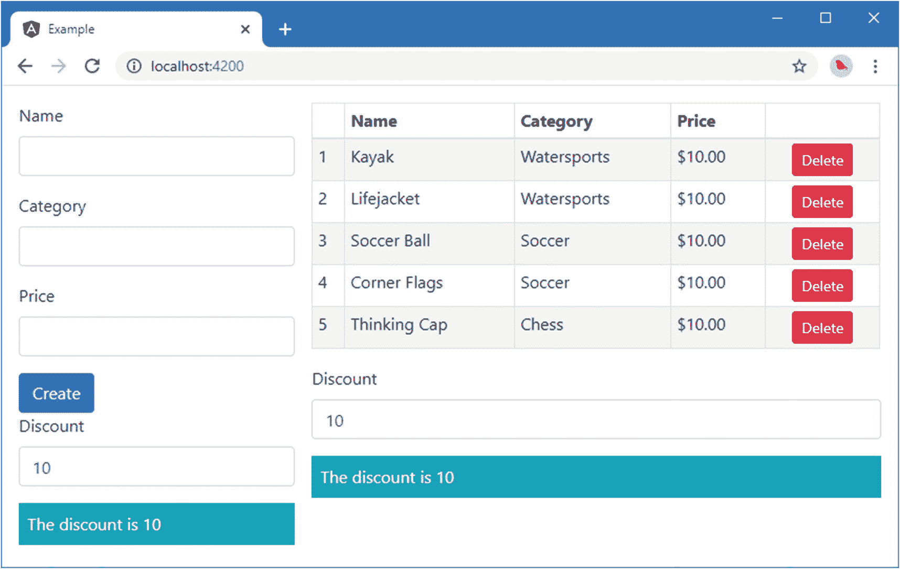
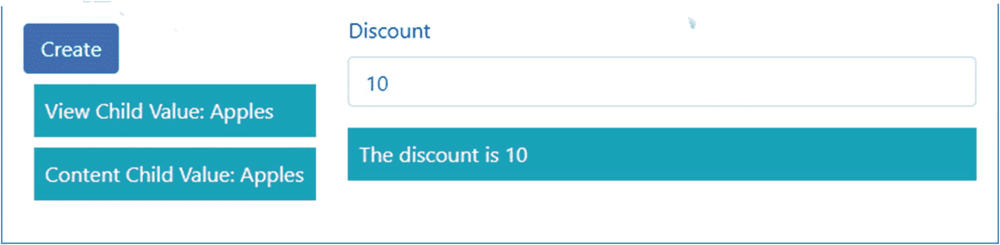
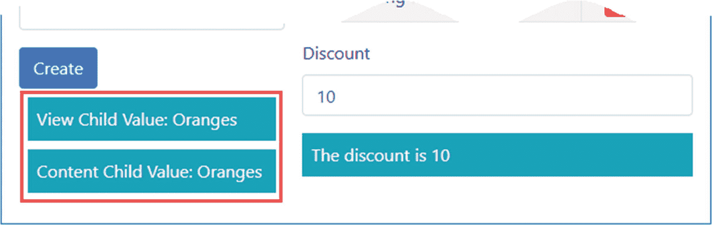
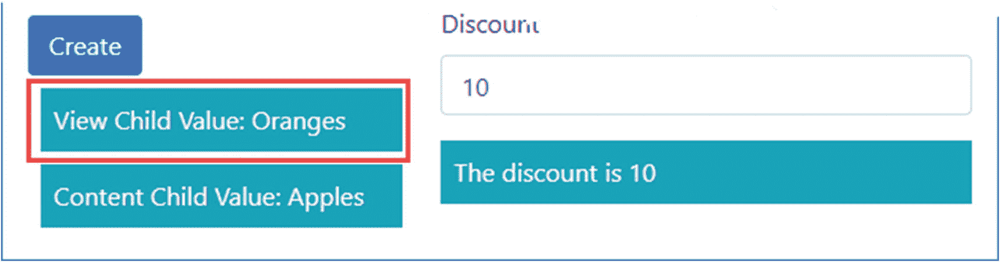
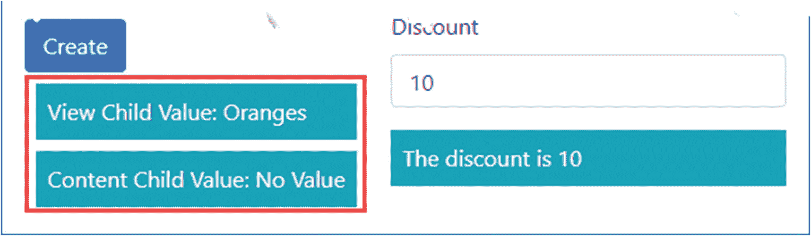

# 二十、使用服务供应器

在前一章中，我介绍了服务，并解释了如何使用依赖注入来分发它们。当使用依赖注入时，用于解析依赖的对象由*服务提供者*创建，通常被称为*提供者*。在这一章中，我将解释提供者是如何工作的，描述不同类型的提供者，并演示如何在应用的不同部分创建提供者来改变服务的行为方式。表 [20-1](#Tab1) 将提供者放在上下文中。

表 20-1。

将服务供应器放在上下文中

<colgroup><col class="tcol1 align-left"> <col class="tcol2 align-left"></colgroup> 
| 

问题

 | 

回答

 |
| --- | --- |
| 它们是什么？ | 提供者是在 Angular 第一次需要解决依赖关系时创建服务对象的类。 |
| 它们为什么有用？ | 提供者允许创建服务对象来满足应用的需求。最简单的提供者只是创建一个指定类的实例，但是也有其他提供者可以用来定制服务对象的创建和配置方式。 |
| 它们是如何使用的？ | 提供者是在 Angular 模块装饰器的`providers`属性中定义的。它们也可以由组件和指令来定义，以便向它们的子节点提供服务，如“使用本地提供者”一节中所述。 |
| 有什么陷阱或限制吗？ | 很容易产生意想不到的行为，尤其是在与本地供应器合作时。如果遇到问题，请检查您创建的本地提供程序的范围，并确保您的依赖项和提供程序使用相同的令牌。 |
| 有其他选择吗？ | 许多应用将只需要第 [19](19.html) 章中描述的基本依赖注入特性。只有当您无法使用基本功能构建应用，并且对依赖注入有很好的理解时，才应该使用本章中的功能。 |

Why You Should Consider Skipping this Chapter

依赖注入在开发人员中激起了强烈的反应，并使观点两极分化。如果你是依赖注入的新手，还没有形成自己的观点，那么你可能想跳过这一章，只使用我在第 [19](19.html) 章中描述的特性。这是因为像我在本章中描述的那些特性正是许多开发人员害怕使用依赖注入并强烈反对使用它的原因。

基本的 Angular 依赖注入特性很容易理解，并且在使应用更容易编写和维护方面有直接和明显的好处。本章中描述的特性提供了对依赖注入工作方式的细粒度控制，但是它们也可能急剧增加 Angular 应用的复杂性，并最终破坏基本特性提供的许多好处。

如果你决定要知道所有的细节，那就继续读下去。但是如果你是依赖注入领域的新手，你可能更愿意跳过这一章，直到你发现第 [19](19.html) 章的基本特性没有提供你需要的功能。

表 [20-2](#Tab2) 总结了本章内容。

表 20-2。

章节总结

<colgroup><col class="tcol1 align-left"> <col class="tcol2 align-left"> <col class="tcol3 align-left"></colgroup> 
| 

问题

 | 

解决办法

 | 

列表

 |
| --- | --- | --- |
| 改变服务的创建方式 | 使用服务供应器 | 1–3 |
| 使用类指定服务 | 使用类提供程序 | 4–6, 10–13 |
| 为服务定义任意令牌 | 使用`InjectionToken`类 | 7–9 |
| 使用对象指定服务 | 使用值提供者 | 14–15 |
| 使用函数指定服务 | 使用工厂提供者 | 16–18 |
| 使用一个服务指定另一个服务 | 使用现有的服务供应器 | Nineteen |
| 更改服务的范围 | 使用本地服务供应器 | 20–28 |
| 控制依赖关系的解析 | 使用`@Host`、`@Optional`或`@SkipSelf`装饰器 | 29–30 |

## 准备示例项目

就像这本书这一部分的其他章节一样，我将继续处理在第 [11](11.html) 章创建的项目，以及最近在第 [19](19.html) 章修改的项目。为了准备本章，我在`src/app`文件夹中添加了一个名为`log.service.ts`的文件，并用它来定义清单 [20-1](#PC1) 中所示的服务。

Tip

你可以从 [`https://github.com/Apress/pro-angular-9`](https://github.com/Apress/pro-angular-9) 下载本章以及本书其他章节的示例项目。如果在运行示例时遇到问题，请参见第 [1](01.html) 章获取帮助。

```ts
import { Injectable } from "@angular/core";

export enum LogLevel {
    DEBUG, INFO, ERROR
}

@Injectable()
export class LogService {
    minimumLevel: LogLevel = LogLevel.INFO;

    logInfoMessage(message: string) {
        this.logMessage(LogLevel.INFO, message);
    }

    logDebugMessage(message: string) {
        this.logMessage(LogLevel.DEBUG, message);
    }

    logErrorMessage(message: string) {
        this.logMessage(LogLevel.ERROR, message);
    }

    logMessage(level: LogLevel, message: string) {
        if (level >= this.minimumLevel) {
            console.log(`Message (${LogLevel[level]}): ${message}`);
        }
    }
}

Listing 20-1.The Contents of the log.service.ts File in the src/app Folder

```

该服务将不同严重性级别的日志消息写入浏览器的 JavaScript 控制台。我将在本章的后面注册并使用这个服务。

创建服务并保存更改后，在`example`文件夹中运行以下命令，启动 Angular 开发工具:

```ts
ng serve

```

打开一个新的浏览器窗口，导航到`http://localhost:4200`查看应用，如图 [20-1](#Fig1) 所示。



图 20-1。

运行示例应用

## 使用服务供应器

正如我在前面的章节中解释的，类使用它们的构造函数参数来声明对服务的依赖。当 Angular 需要创建该类的新实例时，它会检查构造函数，并使用内置和自定义服务的组合来解析每个参数。清单 [20-2](#PC3) 更新了`DiscountService`类，使其依赖于前一节中创建的`LogService`类。

```ts
import { Injectable } from "@angular/core";
import { LogService } from "./log.service";

@Injectable()
export class DiscountService {
    private discountValue: number = 10;

    constructor(private logger: LogService) { }

    public get discount(): number {
        return this.discountValue;
    }

    public set discount(newValue: number) {
        this.discountValue = newValue || 0;
    }

    public applyDiscount(price: number) {
        this.logger.logInfoMessage(`Discount ${this.discount}`
            + ` applied to price: ${price}`);
        return Math.max(price - this.discountValue, 5);
    }
}

Listing 20-2.Creating a Dependency in the discount.service.ts File in the src/app Folder

```

清单 [20-2](#PC3) 中的变化阻止了应用的运行。Angular 处理 HTML 文档并开始创建组件的层次结构，每个组件都有需要指令和数据绑定的模板，它遇到依赖于`DiscountService`类的类。但是它不能创建`DiscountService`的实例，因为它的构造函数需要一个`LogService`对象，而且它不知道如何处理这个类。

当您保存清单 [20-2](#PC3) 中的更改时，您将在浏览器的 JavaScript 控制台中看到类似这样的错误:

```ts
NullInjectorError: No provider for LogService!

```

Angular 将创建依赖注入所需对象的责任委托给*提供者*，每个提供者管理一种类型的依赖。当它需要创建一个`DiscountService`类的实例时，它会寻找一个合适的提供者来解析`LogService`依赖关系。由于没有这样的提供者，Angular 无法创建启动应用所需的对象并报告错误。

创建提供者最简单的方法是将服务类添加到分配给 Angular 模块的`providers`属性的数组中，如清单 [20-3](#PC5) 所示。(我借此机会删除了本模块中不再需要的一些陈述。)

```ts
import { NgModule } from "@angular/core";
import { BrowserModule } from "@angular/platform-browser";
import { ProductComponent } from "./component";
import { FormsModule, ReactiveFormsModule } from "@angular/forms";
import { PaAttrDirective } from "./attr.directive";
import { PaModel } from "./twoway.directive";
import { PaStructureDirective } from "./structure.directive";
import { PaIteratorDirective } from "./iterator.directive";
import { PaCellColor } from "./cellColor.directive";
import { PaCellColorSwitcher } from "./cellColorSwitcher.directive";
import { ProductTableComponent } from "./productTable.component";
import { ProductFormComponent } from "./productForm.component";
import { PaToggleView } from "./toggleView.component";
import { PaAddTaxPipe } from "./addTax.pipe";
import { PaCategoryFilterPipe } from "./categoryFilter.pipe";
import { LOCALE_ID } from "@angular/core";
import localeFr from '@angular/common/locales/fr';
import { registerLocaleData } from '@angular/common';
import { PaDiscountDisplayComponent } from "./discountDisplay.component";
import { PaDiscountEditorComponent } from "./discountEditor.component";
import { DiscountService } from "./discount.service";
import { PaDiscountPipe } from "./discount.pipe";
import { PaDiscountAmountDirective } from "./discountAmount.directive";
import { SimpleDataSource } from "./datasource.model";
import { Model } from "./repository.model";
import { LogService } from "./log.service";

registerLocaleData(localeFr);

@NgModule({
  imports: [BrowserModule, FormsModule, ReactiveFormsModule],
  declarations: [ProductComponent, PaAttrDirective, PaModel,
    PaStructureDirective, PaIteratorDirective,
    PaCellColor, PaCellColorSwitcher, ProductTableComponent,
    ProductFormComponent, PaToggleView, PaAddTaxPipe,
    PaCategoryFilterPipe, PaDiscountDisplayComponent, PaDiscountEditorComponent,
    PaDiscountPipe, PaDiscountAmountDirective],
    providers: [DiscountService, SimpleDataSource, Model, LogService],
  bootstrap: [ProductComponent]
})
export class AppModule { }

Listing 20-3.Creating a Provider in the app.module.ts File in the src/app Folder

```

当您保存更改时，您将已经定义了 Angular 处理`LogService`依赖项所需的提供者，并且您将在浏览器的 JavaScript 控制台中看到如下所示的消息:

```ts
Message (INFO): Discount 10 applied to price: 16

```

您可能想知道为什么清单 [20-3](#PC5) 中的配置步骤是必需的。毕竟，Angular 可以假设它应该在第一次需要时创建一个新的`LogService`对象。

事实上，Angular 提供了一系列不同的提供者，每个提供者都以不同的方式创建对象，让您控制服务创建过程。表 [20-3](#Tab3) 描述了一组可用的提供者，这些提供者将在下面的章节中描述。

表 20-3。

Angular 提供者

<colgroup><col class="tcol1 align-left"> <col class="tcol2 align-left"></colgroup> 
| 

名字

 | 

描述

 |
| --- | --- |
| 类别提供者 | 此提供程序是使用类配置的。对服务的依赖由 Angular 创建的类的实例来解决。 |
| 价值提供者 | 此提供程序是使用对象配置的，该对象用于解析对服务的依赖关系。 |
| 工厂供应商 | 此提供程序是使用函数配置的。使用通过调用函数创建的对象来解析对服务的依赖。 |
| 现有服务供应器 | 此提供程序是使用另一个服务的名称配置的，并允许为服务创建别名。 |

### 使用类提供程序

这个提供者是最常用的，也是我通过在清单 [20-3](#PC5) 中向模块的`providers`属性添加类名而应用的。这个清单展示了速记语法，还有一个文字语法可以达到同样的结果，如清单 [20-4](#PC7) 所示。

```ts
...
@NgModule({
  imports: [BrowserModule, FormsModule, ReactiveFormsModule],
  declarations: [ProductComponent, PaAttrDirective, PaModel,
    PaStructureDirective, PaIteratorDirective,
    PaCellColor, PaCellColorSwitcher, ProductTableComponent,
    ProductFormComponent, PaToggleView, PaAddTaxPipe,
    PaCategoryFilterPipe, PaDiscountDisplayComponent, PaDiscountEditorComponent,
    PaDiscountPipe, PaDiscountAmountDirective],
    providers: [DiscountService, SimpleDataSource, Model,
      { provide: LogService, useClass: LogService }],
  bootstrap: [ProductComponent]
})
...

Listing 20-4.Using the Class Provider Literal Syntax in the app.module.ts File in the src/app Folder

```

提供者被定义为类，但是可以使用 JavaScript 对象文字格式来指定和配置它们，如下所示:

```ts
...
{ provide: LogService, useClass: LogService }
...

```

类提供者支持三个属性，这些属性在表 [20-4](#Tab4) 中描述，并在下面的章节中解释。

表 20-4。

类提供程序的属性

<colgroup><col class="tcol1 align-left"> <col class="tcol2 align-left"></colgroup> 
| 

名字

 | 

描述

 |
| --- | --- |
| `provide` | 此属性用于指定标记，该标记用于标识将被解析的提供程序和依赖项。请参见“理解令牌”一节。 |
| `useClass` | 此属性用于指定将由提供程序实例化以解析依赖关系的类。请参见“了解 useClass 属性”一节。 |
| `multi` | 该属性可用于提供一组服务对象来解析依赖关系。请参阅“解析多个对象的依赖关系”一节。 |

#### 了解令牌

所有提供者都依赖于一个令牌，Angular 使用这个令牌来标识提供者可以解析的依赖关系。最简单的方法是使用一个类作为令牌，这就是我在清单 [20-4](#PC7) 中所做的。但是，您可以使用任何对象作为令牌，这允许将依赖项和对象的类型分开。这有助于增加依赖注入配置的灵活性，因为它允许提供程序提供不同类型的对象，这对于本章后面介绍的一些更高级的提供程序很有用。举个简单的例子，清单 [20-5](#PC9) 使用类提供者来注册在本章开始时创建的日志服务，使用一个字符串作为令牌，而不是一个类。

```ts
...
@NgModule({
  imports: [BrowserModule, FormsModule, ReactiveFormsModule],
  declarations: [ProductComponent, PaAttrDirective, PaModel,
    PaStructureDirective, PaIteratorDirective,
    PaCellColor, PaCellColorSwitcher, ProductTableComponent,
    ProductFormComponent, PaToggleView, PaAddTaxPipe,
    PaCategoryFilterPipe, PaDiscountDisplayComponent, PaDiscountEditorComponent,
    PaDiscountPipe, PaDiscountAmountDirective],
    providers: [DiscountService, SimpleDataSource, Model,
      { provide: "logger", useClass: LogService }],
  bootstrap: [ProductComponent]
})
...

Listing 20-5.Registering a Service with a Token in the app.module.ts File in the src/app Folder

```

在清单中，新提供者的`provide`属性被设置为`logger`。Angular 将自动匹配其令牌是一个类的提供者，但是它需要一些其他令牌类型的额外帮助。清单 [20-6](#PC10) 显示了更新后的`DiscountService`类对日志服务的依赖，使用`logger`令牌访问。

```ts
import { Injectable, Inject } from "@angular/core";
import { LogService } from "./log.service";

@Injectable()
export class DiscountService {
    private discountValue: number = 10;

    constructor(@Inject("logger") private logger: LogService) { }

    public get discount(): number {
        return this.discountValue;
    }

    public set discount(newValue: number) {
        this.discountValue = newValue || 0;
    }

    public applyDiscount(price: number) {
        this.logger.logInfoMessage(`Discount ${this.discount}`
            + ` applied to price: ${price}`);
        return Math.max(price - this.discountValue, 5);
    }
}

Listing 20-6.Using a String Provider Token in the discount.service.ts File in the src/app Folder

```

`@Inject` decorator 应用于构造函数参数，用于指定应该用来解析依赖关系的令牌。当 Angular 需要创建一个`DiscountService`类的实例时，它将检查构造函数并使用`@Inject`装饰器参数来选择将用于解析依赖关系的提供者，解析对`LogService`类的依赖关系。

##### 使用不透明令牌

当使用简单类型作为提供者标记时，应用的两个不同部分可能会尝试使用同一个标记来标识不同的服务，这意味着可能会使用错误的对象类型来解析依赖关系并导致错误。

为了帮助解决这个问题，Angular 提供了`InjectionToken`类，该类提供了一个围绕`string`值的对象包装器，可以用来创建唯一的令牌值。在清单 [20-7](#PC11) 中，我使用了`InjectionToken`类来创建一个令牌，该令牌将用于标识对`LogService`类的依赖。

```ts
import { Injectable, InjectionToken } from "@angular/core";

export const LOG_SERVICE = new InjectionToken("logger");

export enum LogLevel {
    DEBUG, INFO, ERROR
}

@Injectable()
export class LogService {
    minimumLevel: LogLevel = LogLevel.INFO;

    // ...methods omitted for brevity...
}

Listing 20-7.Using the InjectionToken Class in the log.service.ts File in the src/app Folder

```

`InjectionToken`类的构造函数接受一个描述服务的`string`值，但是将成为令牌的是`InjectionToken`对象。依赖项必须在用于在模块中创建提供程序的同一个`InjectionToken`上声明；这就是使用`const`关键字创建令牌的原因，它可以防止对象被修改。清单 [20-8](#PC12) 显示了使用新令牌的提供者配置。

```ts
import { NgModule } from "@angular/core";
import { BrowserModule } from "@angular/platform-browser";
import { ProductComponent } from "./component";
import { FormsModule, ReactiveFormsModule } from "@angular/forms";
import { PaAttrDirective } from "./attr.directive";
import { PaModel } from "./twoway.directive";
import { PaStructureDirective } from "./structure.directive";
import { PaIteratorDirective } from "./iterator.directive";
import { PaCellColor } from "./cellColor.directive";
import { PaCellColorSwitcher } from "./cellColorSwitcher.directive";
import { ProductTableComponent } from "./productTable.component";
import { ProductFormComponent } from "./productForm.component";
import { PaToggleView } from "./toggleView.component";
import { PaAddTaxPipe } from "./addTax.pipe";
import { PaCategoryFilterPipe } from "./categoryFilter.pipe";
import { LOCALE_ID } from "@angular/core";
import localeFr from '@angular/common/locales/fr';
import { registerLocaleData } from '@angular/common';
import { PaDiscountDisplayComponent } from "./discountDisplay.component";
import { PaDiscountEditorComponent } from "./discountEditor.component";
import { DiscountService } from "./discount.service";
import { PaDiscountPipe } from "./discount.pipe";
import { PaDiscountAmountDirective } from "./discountAmount.directive";
import { SimpleDataSource } from "./datasource.model";
import { Model } from "./repository.model";
import { LogService, LOG_SERVICE } from "./log.service";

registerLocaleData(localeFr);

@NgModule({
  imports: [BrowserModule, FormsModule, ReactiveFormsModule],
  declarations: [ProductComponent, PaAttrDirective, PaModel,
    PaStructureDirective, PaIteratorDirective,
    PaCellColor, PaCellColorSwitcher, ProductTableComponent,
    ProductFormComponent, PaToggleView, PaAddTaxPipe,
    PaCategoryFilterPipe, PaDiscountDisplayComponent, PaDiscountEditorComponent,
    PaDiscountPipe, PaDiscountAmountDirective],
    providers: [DiscountService, SimpleDataSource, Model,
      { provide: LOG_SERVICE, useClass: LogService }],
  bootstrap: [ProductComponent]
})
export class AppModule { }

Listing 20-8.Creating a Provider Using an InjectionToken in the app.module.ts File in the src/app Folder

```

最后，清单 [20-9](#PC13) 展示了更新后的`DiscountService`类，使用`InjectionToken`而不是`string`来声明一个依赖项。

```ts
import { Injectable, Inject } from "@angular/core";
import { LogService, LOG_SERVICE } from "./log.service";

@Injectable()
export class DiscountService {
    private discountValue: number = 10;

    constructor( @Inject(LOG_SERVICE) private logger: LogService) { }

    public get discount(): number {
        return this.discountValue;
    }

    public set discount(newValue: number) {
        this.discountValue = newValue || 0;
    }

    public applyDiscount(price: number) {
        this.logger.logInfoMessage(`Discount ${this.discount}`
            + ` applied to price: ${price}`);
        return Math.max(price - this.discountValue, 5);
    }
}

Listing 20-9.Declaring a Dependency in the discount.service.ts File in the src/app Folder

```

应用提供的功能没有区别，但是使用`InjectionToken`意味着服务之间不会混淆。

#### 了解使用类别属性

类提供者的`useClass`属性指定了将被实例化以解析依赖关系的类。提供者可以配置任何类，这意味着您可以通过更改提供者配置来更改服务的实现。应谨慎使用此功能，因为服务对象的接收方需要特定的类型，并且在应用在浏览器中运行之前，不匹配不会导致错误。(TypeScript 类型强制对依赖项注入没有任何影响，因为它发生在运行时类型批注被 TypeScript 编译器处理之后。)

改变类最常见的方法是使用不同的子类。在清单 [20-10](#PC14) 中，我扩展了`LogService`类来创建一个服务，该服务在浏览器的 JavaScript 控制台中编写不同格式的消息。

```ts
import { Injectable, InjectionToken } from "@angular/core";

export const LOG_SERVICE = new InjectionToken("logger");

export enum LogLevel {
    DEBUG, INFO, ERROR
}

@Injectable()
export class LogService {
    minimumLevel: LogLevel = LogLevel.INFO;

    logInfoMessage(message: string) {
        this.logMessage(LogLevel.INFO, message);
    }

    logDebugMessage(message: string) {
        this.logMessage(LogLevel.DEBUG, message);
    }

    logErrorMessage(message: string) {
        this.logMessage(LogLevel.ERROR, message);
    }

    logMessage(level: LogLevel, message: string) {
        if (level >= this.minimumLevel) {
            console.log(`Message (${LogLevel[level]}): ${message}`);
        }
    }
}

@Injectable()
export class SpecialLogService extends LogService {

    constructor() {
        super()
        this.minimumLevel = LogLevel.DEBUG;
    }

    logMessage(level: LogLevel, message: string) {
        if (level >= this.minimumLevel) {
            console.log(`Special Message (${LogLevel[level]}): ${message}`);
        }
    }
}

Listing 20-10.Creating a Subclassed Service in the log.service.ts File in the src/app Folder

```

`SpecialLogService`类扩展了`LogService`并提供了自己的`logMessage`方法的实现。清单 [20-11](#PC15) 更新了提供者配置，因此`useClass`属性指定了新服务。

```ts
import { NgModule } from "@angular/core";
import { BrowserModule } from "@angular/platform-browser";
import { ProductComponent } from "./component";
import { FormsModule, ReactiveFormsModule } from "@angular/forms";
import { PaAttrDirective } from "./attr.directive";
import { PaModel } from "./twoway.directive";
import { PaStructureDirective } from "./structure.directive";
import { PaIteratorDirective } from "./iterator.directive";
import { PaCellColor } from "./cellColor.directive";
import { PaCellColorSwitcher } from "./cellColorSwitcher.directive";
import { ProductTableComponent } from "./productTable.component";
import { ProductFormComponent } from "./productForm.component";
import { PaToggleView } from "./toggleView.component";
import { PaAddTaxPipe } from "./addTax.pipe";
import { PaCategoryFilterPipe } from "./categoryFilter.pipe";
import { LOCALE_ID } from "@angular/core";
import localeFr from '@angular/common/locales/fr';
import { registerLocaleData } from '@angular/common';
import { PaDiscountDisplayComponent } from "./discountDisplay.component";
import { PaDiscountEditorComponent } from "./discountEditor.component";
import { DiscountService } from "./discount.service";
import { PaDiscountPipe } from "./discount.pipe";
import { PaDiscountAmountDirective } from "./discountAmount.directive";
import { SimpleDataSource } from "./datasource.model";
import { Model } from "./repository.model";
import { LogService, LOG_SERVICE, SpecialLogService } from "./log.service";

registerLocaleData(localeFr);

@NgModule({
  imports: [BrowserModule, FormsModule, ReactiveFormsModule],
  declarations: [ProductComponent, PaAttrDirective, PaModel,
    PaStructureDirective, PaIteratorDirective,
    PaCellColor, PaCellColorSwitcher, ProductTableComponent,
    ProductFormComponent, PaToggleView, PaAddTaxPipe,
    PaCategoryFilterPipe, PaDiscountDisplayComponent, PaDiscountEditorComponent,
    PaDiscountPipe, PaDiscountAmountDirective],
    providers: [DiscountService, SimpleDataSource, Model,
      { provide: LOG_SERVICE, useClass: SpecialLogService }],
  bootstrap: [ProductComponent]
})
export class AppModule { }

Listing 20-11.Configuring the Provider in the app.module.ts File in the src/app Folder

```

令牌和类的组合意味着对`LOG_SERVICE`不透明令牌的依赖将使用`SpecialLogService`对象来解析。保存更改时，您将在浏览器的 JavaScript 控制台中看到类似这样的消息，表明派生服务已被使用:

```ts
Special Message (INFO): Discount 10 applied to price: 275

```

当设置`useClass`属性来指定依赖类期望的类型时，必须小心。指定子类是最安全的选择，因为基类的功能保证可用。

#### 解析具有多个对象的依赖关系

可以将类提供程序配置为提供一组对象来解决依赖关系，如果您希望提供一组配置方式不同的相关服务，这将非常有用。为了提供一个数组，使用同一个令牌配置多个类提供者，并将`multi`属性设置为`true`，如清单 [20-12](#PC17) 所示。

```ts
...
@NgModule({
  imports: [BrowserModule, FormsModule, ReactiveFormsModule],
  declarations: [ProductComponent, PaAttrDirective, PaModel,
    PaStructureDirective, PaIteratorDirective,
    PaCellColor, PaCellColorSwitcher, ProductTableComponent,
    ProductFormComponent, PaToggleView, PaAddTaxPipe,
    PaCategoryFilterPipe, PaDiscountDisplayComponent, PaDiscountEditorComponent,
    PaDiscountPipe, PaDiscountAmountDirective],
    providers: [DiscountService, SimpleDataSource, Model,
      { provide: LOG_SERVICE, useClass: LogService, multi: true },
      { provide: LOG_SERVICE, useClass: SpecialLogService, multi: true }],
  bootstrap: [ProductComponent]
})
...

Listing 20-12.Configuring Multiple Service Objects in the app.module.ts File in the src/app Folder

```

Angular 依赖注入系统将通过创建`LogService`和`SpecialLogService`对象，将它们放在一个数组中，并将它们传递给依赖类的构造函数，来解析对`LOG_SERVICE`标记的依赖。接收服务的类必须期待一个数组，如清单 [20-13](#PC18) 所示。

```ts
import { Injectable, Inject } from "@angular/core";
import { LogService, LOG_SERVICE, LogLevel } from "./log.service";

@Injectable()
export class DiscountService {
    private discountValue: number = 10;
    private logger: LogService;

    constructor( @Inject(LOG_SERVICE) loggers: LogService[]) {
        this.logger = loggers.find(l => l.minimumLevel == LogLevel.DEBUG);
    }

    public get discount(): number {
        return this.discountValue;
    }

    public set discount(newValue: number) {
        this.discountValue = newValue || 0;
    }

    public applyDiscount(price: number) {
        this.logger.logInfoMessage(`Discount ${this.discount}`
            + ` applied to price: ${price}`);
        return Math.max(price - this.discountValue, 5);
    }
}

Listing 20-13.Receiving Multiple Services in the discount.service.ts File in the src/app Folder

```

构造函数以数组的形式接收服务，它使用数组的`find`方法定位第一个`minimumLevel`属性为`LogLevel.Debug`的记录器，并将其分配给`logger`属性。`applyDiscount`方法调用服务的`logDebugMessage`方法，这导致类似这样的消息显示在浏览器的 JavaScript 控制台中:

```ts
Special Message (INFO): Discount 10 applied to price: 275

```

### 使用值提供者

当您想自己负责创建服务对象，而不是将它留给类提供者时，可以使用值提供者。当服务是简单类型时，例如`string`或`number`值，这也是有用的，这是提供对公共配置设置的访问的有用方式。值提供者可使用文字对象应用，并支持表 [20-5](#Tab5) 中描述的属性。

表 20-5。

值提供者属性

<colgroup><col class="tcol1 align-left"> <col class="tcol2 align-left"></colgroup> 
| 

名字

 | 

描述

 |
| --- | --- |
| `provide` | 该属性定义服务令牌，如本章前面的“理解令牌”一节所述。 |
| `useValue` | 此属性指定将用于解析依赖关系的对象。 |
| `multi` | 此属性用于允许组合多个提供程序来提供一个对象数组，这些对象将用于解析对令牌的依赖关系。有关示例，请参见本章前面的“解决多个对象的依赖关系”一节。 |

值提供程序的工作方式与类提供程序相同，只是它是用对象而不是类型配置的。清单 [20-14](#PC20) 展示了如何使用值提供者来创建一个配置了特定属性值的`LogService`类的实例。

```ts
import { NgModule } from "@angular/core";
import { BrowserModule } from "@angular/platform-browser";
import { ProductComponent } from "./component";
import { FormsModule, ReactiveFormsModule } from "@angular/forms";
import { PaAttrDirective } from "./attr.directive";
import { PaModel } from "./twoway.directive";
import { PaStructureDirective } from "./structure.directive";
import { PaIteratorDirective } from "./iterator.directive";
import { PaCellColor } from "./cellColor.directive";
import { PaCellColorSwitcher } from "./cellColorSwitcher.directive";
import { ProductTableComponent } from "./productTable.component";
import { ProductFormComponent } from "./productForm.component";
import { PaToggleView } from "./toggleView.component";
import { PaAddTaxPipe } from "./addTax.pipe";
import { PaCategoryFilterPipe } from "./categoryFilter.pipe";
import { LOCALE_ID } from "@angular/core";
import localeFr from '@angular/common/locales/fr';
import { registerLocaleData } from '@angular/common';
import { PaDiscountDisplayComponent } from "./discountDisplay.component";
import { PaDiscountEditorComponent } from "./discountEditor.component";
import { DiscountService } from "./discount.service";
import { PaDiscountPipe } from "./discount.pipe";
import { PaDiscountAmountDirective } from "./discountAmount.directive";
import { SimpleDataSource } from "./datasource.model";
import { Model } from "./repository.model";
import { LogService, LOG_SERVICE, SpecialLogService, LogLevel } from "./log.service";

let logger = new LogService();
logger.minimumLevel = LogLevel.DEBUG;

registerLocaleData(localeFr);

@NgModule({
  imports: [BrowserModule, FormsModule, ReactiveFormsModule],
  declarations: [ProductComponent, PaAttrDirective, PaModel,
    PaStructureDirective, PaIteratorDirective,
    PaCellColor, PaCellColorSwitcher, ProductTableComponent,
    ProductFormComponent, PaToggleView, PaAddTaxPipe,
    PaCategoryFilterPipe, PaDiscountDisplayComponent, PaDiscountEditorComponent,
    PaDiscountPipe, PaDiscountAmountDirective],
    providers: [DiscountService, SimpleDataSource, Model,
      { provide: LogService, useValue: logger }],
  bootstrap: [ProductComponent]
})
export class AppModule { }

Listing 20-14.Using the Value Provider in the app.module.ts File in the src/app Folder

```

这个值提供者被配置为解析在模块类之外创建和配置的特定对象对`LogService`标记的依赖性。

值提供者——实际上是所有的提供者——可以使用任何对象作为标记，如前一节所述，但我还是回到了使用类型作为标记，因为这是最常用的技术，而且它与 TypeScript 构造函数参数类型化配合得非常好。清单 [20-15](#PC21) 显示了对`DiscountService`的相应更改，它使用类型化的构造函数参数声明了一个依赖项。

```ts
import { Injectable, Inject } from "@angular/core";
import { LogService, LOG_SERVICE, LogLevel } from "./log.service";

@Injectable()
export class DiscountService {
    private discountValue: number = 10;

    constructor(private logger: LogService) { }

    public get discount(): number {
        return this.discountValue;
    }

    public set discount(newValue: number) {
        this.discountValue = newValue || 0;
    }

    public applyDiscount(price: number) {
        this.logger.logInfoMessage(`Discount ${this.discount}`
            + ` applied to price: ${price}`);
        return Math.max(price - this.discountValue, 5);
    }
}

Listing 20-15.Declaring a Dependency Using a Type in the discount.service.ts File in the src/app Folder

```

### 使用工厂提供程序

工厂提供者使用函数来创建解析依赖关系所需的对象。该提供程序支持表 [20-6](#Tab6) 中描述的属性。

表 20-6。

工厂提供者属性

<colgroup><col class="tcol1 align-left"> <col class="tcol2 align-left"></colgroup> 
| 

名字

 | 

描述

 |
| --- | --- |
| `provide` | 该属性定义服务令牌，如本章前面的“理解令牌”一节所述。 |
| `deps` | 该属性指定了一个提供者标记数组，该数组将被解析并传递给由`useFactory`属性指定的函数。 |
| `useFactory` | 此属性指定将创建服务对象的函数。解析由`deps`属性指定的令牌所产生的对象将作为参数传递给函数。函数返回的结果将被用作服务对象。 |
| `multi` | 此属性用于允许组合多个提供程序来提供一个对象数组，这些对象将用于解析对令牌的依赖关系。有关示例，请参见本章前面的“解决多个对象的依赖关系”一节。 |

这是在如何创建服务对象方面提供最大灵活性的提供者，因为您可以定义适合您的应用需求的函数。清单 [20-16](#PC22) 显示了一个创建`LogService`对象的工厂函数。

```ts
...
@NgModule({
  imports: [BrowserModule, FormsModule, ReactiveFormsModule],
  declarations: [ProductComponent, PaAttrDirective, PaModel,
    PaStructureDirective, PaIteratorDirective,
    PaCellColor, PaCellColorSwitcher, ProductTableComponent,
    ProductFormComponent, PaToggleView, PaAddTaxPipe,
    PaCategoryFilterPipe, PaDiscountDisplayComponent, PaDiscountEditorComponent,
    PaDiscountPipe, PaDiscountAmountDirective],
    providers: [DiscountService, SimpleDataSource, Model,
      {
          provide: LogService, useFactory: () => {
              let logger = new LogService();
              logger.minimumLevel = LogLevel.DEBUG;
              return logger;
          }
      }],
  bootstrap: [ProductComponent]
})
...

Listing 20-16.Using the Factory Provider in the app.module.ts File in the src/app Folder

```

这个例子中的函数很简单:它不接收任何参数，只创建一个新的`LogService`对象。当使用`deps`属性时，这个提供者真正的灵活性就来了，它允许在其他服务上创建依赖关系。在清单 [20-17](#PC23) 中，我定义了一个指定调试级别的令牌。

```ts
import { Injectable, InjectionToken } from "@angular/core";

export const LOG_SERVICE = new InjectionToken("logger");
export const LOG_LEVEL = new InjectionToken("log_level");

export enum LogLevel {
    DEBUG, INFO, ERROR
}

@Injectable()
export class LogService {
    minimumLevel: LogLevel = LogLevel.INFO;

    // ...methods omitted for brevity...
}

@Injectable()
export class SpecialLogService extends LogService {

    // ...methods omitted for brevity...
}

Listing 20-17.Defining a Logging-Level Service in the log.service.ts File in the src/app Folder

```

在清单 [20-18](#PC24) 中，我定义了一个使用`LOG_LEVEL`令牌创建服务的值提供者，并在创建`LogService`对象的工厂函数中使用该服务。

```ts
import { NgModule } from "@angular/core";
import { BrowserModule } from "@angular/platform-browser";
import { ProductComponent } from "./component";
import { FormsModule, ReactiveFormsModule } from "@angular/forms";
import { PaAttrDirective } from "./attr.directive";
import { PaModel } from "./twoway.directive";
import { PaStructureDirective } from "./structure.directive";
import { PaIteratorDirective } from "./iterator.directive";
import { PaCellColor } from "./cellColor.directive";
import { PaCellColorSwitcher } from "./cellColorSwitcher.directive";
import { ProductTableComponent } from "./productTable.component";
import { ProductFormComponent } from "./productForm.component";
import { PaToggleView } from "./toggleView.component";
import { PaAddTaxPipe } from "./addTax.pipe";
import { PaCategoryFilterPipe } from "./categoryFilter.pipe";
import { LOCALE_ID } from "@angular/core";
import localeFr from '@angular/common/locales/fr';
import { registerLocaleData } from '@angular/common';
import { PaDiscountDisplayComponent } from "./discountDisplay.component";
import { PaDiscountEditorComponent } from "./discountEditor.component";
import { DiscountService } from "./discount.service";
import { PaDiscountPipe } from "./discount.pipe";
import { PaDiscountAmountDirective } from "./discountAmount.directive";
import { SimpleDataSource } from "./datasource.model";
import { Model } from "./repository.model";
import { LogService, LOG_SERVICE, SpecialLogService,
  LogLevel, LOG_LEVEL} from "./log.service";

let logger = new LogService();
logger.minimumLevel = LogLevel.DEBUG;

registerLocaleData(localeFr);

@NgModule({
  imports: [BrowserModule, FormsModule, ReactiveFormsModule],
  declarations: [ProductComponent, PaAttrDirective, PaModel,
    PaStructureDirective, PaIteratorDirective,
    PaCellColor, PaCellColorSwitcher, ProductTableComponent,
    ProductFormComponent, PaToggleView, PaAddTaxPipe,
    PaCategoryFilterPipe, PaDiscountDisplayComponent, PaDiscountEditorComponent,
    PaDiscountPipe, PaDiscountAmountDirective],
    providers: [DiscountService, SimpleDataSource, Model,
      { provide: LOG_LEVEL, useValue: LogLevel.DEBUG },
      { provide: LogService,
        deps: [LOG_LEVEL],
        useFactory: (level) => {
          let logger = new LogService();
          logger.minimumLevel = level;
          return logger;
       }}],
  bootstrap: [ProductComponent]
})
export class AppModule { }

Listing 20-18.Using Factory Dependencies in the app.module.ts File in the src/app Folder

```

值提供者使用`LOG_LEVEL`标记将简单值定义为服务。工厂提供者在其`deps`数组中指定该令牌，依赖注入系统解析该令牌并将其作为参数提供给工厂函数，工厂函数使用它来设置新`LogService`对象的`minimumLevel`属性。

### 使用现有的服务供应器

该提供程序用于为服务创建别名，以便可以使用多个令牌将它们作为目标，使用表 [20-7](#Tab7) 中描述的属性。

表 20-7。

现有的提供程序属性

<colgroup><col class="tcol1 align-left"> <col class="tcol2 align-left"></colgroup> 
| 

名字

 | 

描述

 |
| --- | --- |
| `provide` | 该属性定义服务令牌，如本章前面的“理解令牌”一节所述。 |
| `useExisting` | 此属性用于指定另一个提供程序的令牌，该提供程序的服务对象将用于解析对此服务的依赖关系。 |
| `multi` | 此属性用于允许组合多个提供程序来提供一个对象数组，这些对象将用于解析对令牌的依赖关系。有关示例，请参见本章前面的“解决多个对象的依赖关系”一节。 |

当您想要重构一组提供程序，但不想消除所有过时的标记以避免重构应用的其余部分时，此提供程序会很有用。清单 [20-19](#PC25) 展示了这个提供者的用法。

```ts
...
@NgModule({
  imports: [BrowserModule, FormsModule, ReactiveFormsModule],
  declarations: [ProductComponent, PaAttrDirective, PaModel,
    PaStructureDirective, PaIteratorDirective,
    PaCellColor, PaCellColorSwitcher, ProductTableComponent,
    ProductFormComponent, PaToggleView, PaAddTaxPipe,
    PaCategoryFilterPipe, PaDiscountDisplayComponent, PaDiscountEditorComponent,
    PaDiscountPipe, PaDiscountAmountDirective],
    providers: [DiscountService, SimpleDataSource, Model,
      { provide: LOG_LEVEL, useValue: LogLevel.DEBUG },
      { provide: "debugLevel", useExisting: LOG_LEVEL },
      { provide: LogService,
        deps: ["debugLevel"],
        useFactory: (level) => {
          let logger = new LogService();
          logger.minimumLevel = level;
          return logger;
       }}],
  bootstrap: [ProductComponent]
})
...

Listing 20-19.Creating a Service Alias in the app.module.ts File in the src/app Folder

```

新服务的令牌是字符串`debugLevel`，它用`LOG_LEVEL`令牌作为提供者的别名。使用任何一个标记都将导致依赖项被解析为相同的值。

## 使用本地供应器

当 Angular 创建一个类的新实例时，它使用一个*注入器*来解析任何依赖关系。它是一个注入器，负责检查类的构造函数，以确定已经声明了哪些依赖项，并使用可用的提供程序来解析它们。

到目前为止，所有的依赖注入示例都依赖于在应用的 Angular 模块中配置的提供者。但是 Angular 依赖注入系统更复杂:有一个对应于应用的组件和指令树的注入器层次结构。每个组件和指令都可以有自己的注入器，每个注入器都可以配置自己的一组提供者，称为*本地提供者*。

当存在要解决的从属关系时，Angular 将注射器用于最近的组件或指令。注入器首先尝试使用自己的一组本地提供者来解决依赖关系。如果没有设置本地提供程序，或者没有可用于解析此特定依赖关系的提供程序，则注入器会咨询父组件的注入器。重复这个过程——父组件的注入器试图使用它自己的一组本地提供者来解决依赖关系。如果有合适的提供者可用，则使用它来提供解决依赖性所需的服务对象。如果没有合适的提供者，那么请求将被传递到层次结构中的下一级，传递给原始注入者的祖父级。层次结构的顶部是根 Angular 模块，其提供者是报告错误之前的最后手段。

在 Angular 模块中定义提供者意味着应用中某个令牌的所有依赖项都将使用同一个对象来解析。正如我在下面几节中解释的那样，在注入器层次结构的更底层注册提供者可以改变这种行为，并改变创建和使用服务的方式。

### 了解单个服务对象的局限性

使用单个服务对象可能是一个强大的工具，允许应用不同部分中的构建块共享数据和响应用户交互。但有些服务并不适合如此广泛地共享。举个简单的例子，清单 [20-20](#PC26) 向第 [18 章](18.html)中创建的管道之一添加了对`LogService`的依赖。

```ts
import { Pipe, Injectable } from "@angular/core";
import { DiscountService } from "./discount.service";
import { LogService } from "./log.service";

@Pipe({
    name: "discount",
    pure: false
})
export class PaDiscountPipe {

    constructor(private discount: DiscountService,
                private logger: LogService) { }

    transform(price: number): number {
        if (price > 100) {
            this.logger.logInfoMessage(`Large price discounted: ${price}`);
        }
        return this.discount.applyDiscount(price);
    }
}

Listing 20-20.Adding a Service Dependency in the discount.pipe.ts File in the src/app Folder

```

管道的转换方法使用作为构造函数参数接收的`LogService`对象，当它转换的`price`值大于 100 时，生成日志消息。

问题是这些日志消息被由`DiscountService`对象生成的消息淹没了，每次应用折扣时它都会创建一条消息。显而易见的是，当模块提供者的工厂函数创建`LogService`对象时，要改变它的最低级别，如清单 [20-21](#PC27) 所示。

```ts
...
@NgModule({
  imports: [BrowserModule, FormsModule, ReactiveFormsModule],
  declarations: [ProductComponent, PaAttrDirective, PaModel,
    PaStructureDirective, PaIteratorDirective,
    PaCellColor, PaCellColorSwitcher, ProductTableComponent,
    ProductFormComponent, PaToggleView, PaAddTaxPipe,
    PaCategoryFilterPipe, PaDiscountDisplayComponent, PaDiscountEditorComponent,
    PaDiscountPipe, PaDiscountAmountDirective],
    providers: [DiscountService, SimpleDataSource, Model,
      { provide: LOG_LEVEL, useValue: LogLevel.ERROR },
      { provide: "debugLevel", useExisting: LOG_LEVEL },
      { provide: LogService,
        deps: ["debugLevel"],
        useFactory: (level) => {
          let logger = new LogService();
          logger.minimumLevel = level;
          return logger;
       }}],
  bootstrap: [ProductComponent]
})
...

Listing 20-21.Changing the Logging Level in the app.module.ts File in the src/app Folder

```

当然，这并没有达到预期的效果，因为在整个应用中使用了相同的`LogService`对象，过滤`DiscountService`消息意味着管道消息也被过滤。

我可以增强`LogService`类，这样每个日志消息源都有不同的过滤器，但是这很快就变得复杂了。相反，我将通过创建一个本地提供者来解决这个问题，以便在应用中有多个`LogService`对象，每个对象都可以单独配置。

### 在组件中创建本地提供程序

组件可以定义本地提供者，这允许应用的一部分创建和使用单独的服务器。组件支持两个装饰器属性来创建本地提供者，如表 [20-8](#Tab8) 所述。

表 20-8。

本地提供程序的组件装饰器属性

<colgroup><col class="tcol1 align-left"> <col class="tcol2 align-left"></colgroup> 
| 

名字

 | 

描述

 |
| --- | --- |
| `providers` | 此属性用于创建用于解析视图和内容子级的依赖关系的提供程序。 |
| `viewProviders` | 此属性用于创建一个提供程序，该提供程序用于解析视图子级的依赖关系。 |

解决我的`LogService`问题的最简单方法是使用`providers`属性建立一个本地提供者，如清单 [20-22](#PC28) 所示。

```ts
import { Component, Input, ViewChildren, QueryList } from "@angular/core";
import { Model } from "./repository.model";
import { Product } from "./product.model";
import { DiscountService } from "./discount.service";
import { LogService } from "./log.service";

@Component({
    selector: "paProductTable",
    templateUrl: "productTable.component.html",
    providers:[LogService]

})
export class ProductTableComponent {

    constructor(private dataModel: Model) { }

    getProduct(key: number): Product {
        return this.dataModel.getProduct(key);
    }

    getProducts(): Product[] {
        return this.dataModel.getProducts();
    }

    deleteProduct(key: number) {
        this.dataModel.deleteProduct(key);
    }

    taxRate: number = 0;
    dateObject: Date = new Date(2020, 1, 20);
    dateString: string = "2020-02-20T00:00:00.000Z";
    dateNumber: number = 1582156800000;

    selectMap = {
        "Watersports": "stay dry",
        "Soccer": "score goals",
        "other": "have fun"
    }

    numberMap = {
        "=1": "one product",
        "=2": "two products",
        "other": "# products"
    }
}

Listing 20-22.Creating a Local Provider in the productTable.component.ts File in the src/app Folder

```

当 Angular 需要创建一个新的管道对象时，它会检测对`LogService`的依赖，并开始沿着应用层次向上工作，检查它找到的每个组件，以确定它们是否有可用于解决依赖的提供者。`ProductTableComponent`确实有一个`LogService`提供者，用于创建解析管道依赖性的服务。这意味着现在应用中有两个`LogService`对象，每个都可以单独配置，如图 [20-2](#Fig2) 所示。


图 20-2。

创建本地提供程序

由组件提供者创建的`LogService`对象使用其`minimumLevel`属性的默认值，并将显示`LogLevel.INFO`消息。模块创建的`LogService`对象将用于解析应用中的所有其他依赖项，包括由`DiscountService`类声明的依赖项，该对象被配置为只显示`LogLevel.ERROR`消息。当您保存更改时，您将看到来自管道(从组件接收服务)的日志消息，而不是来自`DiscountService`(从模块接收服务)的日志消息。

### 了解供应商备选方案

如表 [20-8](#Tab8) 所述，有两个属性可用于创建本地提供者。为了演示这些属性的不同，我在`src/app`文件夹中添加了一个名为`valueDisplay.directive.ts`的文件，并用它来定义清单 [20-23](#PC29) 中所示的指令。

```ts
import { Directive, InjectionToken, Inject, HostBinding} from "@angular/core";

export const VALUE_SERVICE = new InjectionToken("value_service");

@Directive({
    selector: "[paDisplayValue]"
})
export class PaDisplayValueDirective {

    constructor( @Inject(VALUE_SERVICE) serviceValue: string) {
        this.elementContent = serviceValue;
    }

    @HostBinding("textContent")
    elementContent: string;
}

Listing 20-23.The Contents of the valueDisplay.directive.ts File in the src/app Folder

```

`VALUE_SERVICE` opaque 令牌将用于定义基于值的服务，该清单中的指令声明了对该服务的依赖，以便可以在主机元素的内容中显示该服务。清单 [20-24](#PC30) 显示了正在定义的服务和在 Angular 模块中注册的指令。为了简洁起见，我还简化了模块中的`LogService`提供者。

```ts
import { NgModule } from "@angular/core";
import { BrowserModule } from "@angular/platform-browser";
import { ProductComponent } from "./component";
import { FormsModule, ReactiveFormsModule } from "@angular/forms";
import { PaAttrDirective } from "./attr.directive";
import { PaModel } from "./twoway.directive";
import { PaStructureDirective } from "./structure.directive";
import { PaIteratorDirective } from "./iterator.directive";
import { PaCellColor } from "./cellColor.directive";
import { PaCellColorSwitcher } from "./cellColorSwitcher.directive";
import { ProductTableComponent } from "./productTable.component";
import { ProductFormComponent } from "./productForm.component";
import { PaToggleView } from "./toggleView.component";
import { PaAddTaxPipe } from "./addTax.pipe";
import { PaCategoryFilterPipe } from "./categoryFilter.pipe";
import { LOCALE_ID } from "@angular/core";
import localeFr from '@angular/common/locales/fr';
import { registerLocaleData } from '@angular/common';
import { PaDiscountDisplayComponent } from "./discountDisplay.component";
import { PaDiscountEditorComponent } from "./discountEditor.component";
import { DiscountService } from "./discount.service";
import { PaDiscountPipe } from "./discount.pipe";
import { PaDiscountAmountDirective } from "./discountAmount.directive";
import { SimpleDataSource } from "./datasource.model";
import { Model } from "./repository.model";
import { LogService, LOG_SERVICE, SpecialLogService,
  LogLevel, LOG_LEVEL} from "./log.service";
import { VALUE_SERVICE, PaDisplayValueDirective} from "./valueDisplay.directive";

let logger = new LogService();
logger.minimumLevel = LogLevel.DEBUG;

registerLocaleData(localeFr);

@NgModule({
  imports: [BrowserModule, FormsModule, ReactiveFormsModule],
  declarations: [ProductComponent, PaAttrDirective, PaModel,
    PaStructureDirective, PaIteratorDirective,
    PaCellColor, PaCellColorSwitcher, ProductTableComponent,
    ProductFormComponent, PaToggleView, PaAddTaxPipe,
    PaCategoryFilterPipe, PaDiscountDisplayComponent, PaDiscountEditorComponent,
    PaDiscountPipe, PaDiscountAmountDirective, PaDisplayValueDirective],
    providers: [DiscountService, SimpleDataSource, Model, LogService,
      { provide: VALUE_SERVICE, useValue: "Apples" }],
  bootstrap: [ProductComponent]
})
export class AppModule { }

Listing 20-24.Registering the Directive and Service in the app.module.ts File in the src/app Folder

```

提供者为`VALUE_SERVICE`服务设置一个值`Apples`。下一步是应用新的指令，这样一个实例是组件的视图子级，另一个是内容子级。清单 [20-25](#PC31) 设置内容子实例。

```ts
<div class="row m-2">
  <div class="col-4 p-2">
    <paProductForm>
      <span paDisplayValue></span>
    </paProductForm>
  </div>
  <div class="col-8 p-2">
    <paProductTable></paProductTable>
  </div>
</div>

Listing 20-25.Applying a Content Child Directive in the template.html File in the src/app Folder

```

清单 [20-26](#PC32) 投射主机元素的内容，并添加新指令的视图子实例。

```ts
<form novalidate #form="ngForm" (ngSubmit)="submitForm(form)">
    <div class="form-group">
        <label>Name</label>
        <input class="form-control"
            name="name" [(ngModel)]="newProduct.name" />
    </div>
    <div class="form-group">
        <label>Category</label>
        <input class="form-control"
            name="category" [(ngModel)]="newProduct.category" />
    </div>
    <div class="form-group">
        <label>Price</label>
        <input class="form-control"
            name="name" [(ngModel)]="newProduct.price" />
    </div>
    <button class="btn btn-primary" type="submit">
            Create
    </button>
</form>

<div class="bg-info text-white m-2 p-2">
    View Child Value: <span paDisplayValue></span>
</div>
<div class="bg-info text-white m-2 p-2">
    Content Child Value: <ng-content></ng-content>
</div>

Listing 20-26.Adding Directives in the productForm.component.html File in the src/app Folder

```

当您保存更改时，您将看到新的元素，如图 [20-3](#Fig3) 所示，两者显示相同的值，因为`VALUE_SERVICE`的唯一提供者是在模块中定义的。



图 20-3。

查看和内容子指令

#### 为所有孩子创建本地提供程序

`@Component` decorator 的`providers`属性用于定义提供者，这些提供者将用于解析所有子元素的服务依赖关系，而不管它们是在模板中定义的(视图子元素)还是从主机元素中投影的(内容子元素)。清单 [20-27](#PC33) 在两个新指令实例的父组件中定义了一个`VALUE_SERVICE`提供者。

```ts
import { Component, Output, EventEmitter, ViewEncapsulation } from "@angular/core";
import { Product } from "./product.model";
import { Model } from "./repository.model";
import { VALUE_SERVICE } from "./valueDisplay.directive";

@Component({
    selector: "paProductForm",
    templateUrl: "productForm.component.html",
    providers: [{ provide: VALUE_SERVICE, useValue: "Oranges" }]
})
export class ProductFormComponent {
    newProduct: Product = new Product();

    constructor(private model: Model) { }

    submitForm(form: any) {
        this.model.saveProduct(this.newProduct);
        this.newProduct = new Product();
        form.reset();
    }
}

Listing 20-27.Defining a Provider in the productForm.component.ts File in the src/app Folder

```

新的供应器改变了服务价值。当 Angular 开始创建新指令的实例时，它通过沿着应用层次向上搜索来开始搜索提供者，并找到清单 [20-27](#PC33) 中定义的`VALUE_SERVICE`提供者。服务值被指令的两个实例使用，如图 [20-4](#Fig4) 所示。



图 20-4。

为组件中的所有子组件定义提供程序

#### 为视图子级创建提供程序

`viewProviders`属性定义了用于解析视图子级而非内容子级的依赖关系的提供程序。清单 [20-28](#PC34) 使用`viewProviders`属性为`VALUE_SERVICE`定义一个提供者。

```ts
import { Component, Output, EventEmitter, ViewEncapsulation } from "@angular/core";
import { Product } from "./product.model";
import { Model } from "./repository.model";
import { VALUE_SERVICE } from "./valueDisplay.directive";

@Component({
    selector: "paProductForm",
    templateUrl: "productForm.component.html",
    viewProviders: [{ provide: VALUE_SERVICE, useValue: "Oranges" }]
})
export class ProductFormComponent {
    newProduct: Product = new Product();

    constructor(private model: Model) { }

    submitForm(form: any) {
        this.model.saveProduct(this.newProduct);
        this.newProduct = new Product();
        form.reset();
    }
}

Listing 20-28.Defining a View Child Provider in the productForm.component.ts File in the src/app Folder

```

Angular 在解析视图子级而不是内容子级的依赖关系时使用提供程序。这意味着子内容的依赖关系在应用的层次结构中向上引用，就好像组件没有定义提供者一样。在本例中，这意味着视图子节点将接收组件提供者创建的服务，内容子节点将接收模块提供者创建的服务，如图 [20-5](#Fig5) 所示。



图 20-5。

为视图子级定义提供程序

Caution

不支持使用`providers`和`viewProviders`属性为同一服务定义提供者。如果这样做，视图和内容的孩子都将收到由`viewProviders`提供者创建的服务。

### 控制依赖关系解析

Angular 提供了三个装饰器，可以用来提供关于如何解决依赖关系的指令。这些装饰器在表 [20-9](#Tab9) 中描述，并在以下章节中演示。

表 20-9。

依赖关系解析装饰器

<colgroup><col class="tcol1 align-left"> <col class="tcol2 align-left"></colgroup> 
| 

名字

 | 

描述

 |
| --- | --- |
| `@Host` | 这个装饰器将对提供者的搜索限制在最近的组件上。 |
| `@Optional` | 如果不能解决依赖关系，这个装饰器会阻止 Angular 报告错误。 |
| `@SkipSelf` | 这个装饰器排除了依赖关系被解析的组件/指令所定义的提供者。 |

#### 限制供应器搜索

`@Host` decorator 限制对合适的提供者的搜索，以便一旦到达最近的组件就停止搜索。装饰器通常与`@Optional`结合使用，这样可以防止 Angular 在无法解决服务依赖时抛出异常。清单 [20-29](#PC35) 展示了在示例中向指令添加两个装饰器。

```ts
import { Directive, InjectionToken, Inject,
         HostBinding, Host, Optional} from "@angular/core";

export const VALUE_SERVICE = new InjectionToken("value_service");

@Directive({
    selector: "[paDisplayValue]"
})
export class PaDisplayValueDirective {

    constructor( @Inject(VALUE_SERVICE) @Host() @Optional() serviceValue: string) {
        this.elementContent = serviceValue || "No Value";
    }

    @HostBinding("textContent")
    elementContent: string;
}

Listing 20-29.Adding Dependency Decorators in the valueDisplay.directive.ts File in the src/app Folder

```

当使用`@Optional` decorator 时，您必须确保如果服务不能被解析，类能够运行，在这种情况下，服务的构造函数参数是`undefined`。最近的组件为它的视图子组件而不是内容子组件定义了一个服务，这意味着该指令的一个实例将接收一个服务对象，而另一个不会，如图 [20-6](#Fig6) 所示。



图 20-6。

控制如何解决依赖关系

#### 跳过自定义提供程序

默认情况下，组件定义的提供程序用于解析其依赖关系。可以将`@SkipSelf` decorator 应用于构造函数参数，告诉 Angular 忽略本地提供者，并在应用层次结构的下一级开始搜索，这意味着本地提供者将仅用于解析子元素的依赖关系。在清单 [20-30](#PC36) 中，我添加了对用`@SkipSelf`修饰的`VALUE_SERVICE`提供者的依赖。

```ts
import { Component, Output, EventEmitter, ViewEncapsulation,
    Inject, SkipSelf } from "@angular/core";
import { Product } from "./product.model";
import { Model } from "./repository.model";
import { VALUE_SERVICE } from "./valueDisplay.directive";

@Component({
    selector: "paProductForm",
    templateUrl: "productForm.component.html",
    viewProviders: [{ provide: VALUE_SERVICE, useValue: "Oranges" }]
})
export class ProductFormComponent {
    newProduct: Product = new Product();

    constructor(private model: Model,
            @Inject(VALUE_SERVICE) @SkipSelf() private serviceValue: string) {
        console.log("Service Value: " + serviceValue);
    }

    submitForm(form: any) {
        this.model.saveProduct(this.newProduct);
        this.newProduct = new Product();
        form.reset();
    }
}

Listing 20-30.Skipping Local Providers in the productForm.component.ts File in the src/app Folder

```

当您保存更改且浏览器重新加载页面时，您将在浏览器的 JavaScript 控制台中看到以下消息，显示本地定义的服务值(`Oranges`)已被跳过，并允许 Angular 模块解析相关性:

```ts
Service Value:pples

```

## 摘要

在这一章中，我解释了提供者在依赖注入中扮演的角色，并解释了如何使用它们来改变服务解决依赖的方式。我描述了可用于创建服务对象的不同类型的提供者，并演示了指令和组件如何定义它们自己的提供者来解析它们自己及其子对象的依赖关系。在下一章中，我将描述模块，它是 Angular 应用的最终构建模块。