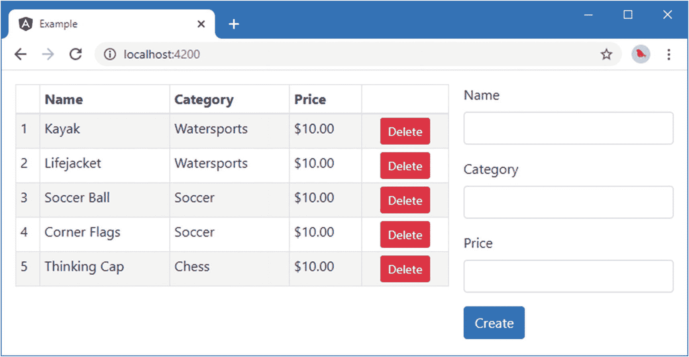

# 二十一、使用和创建模块

在这一章中，我将描述最后一个有 Angular 的构件:模块。在本章的第一部分，我描述了根模块，每个 Angular 应用都用它来描述 Angular 应用的配置。在这一章的第二部分，我描述了特性模块，它们被用来给应用增加结构，这样相关的特性就可以被组合成一个单元。表 [21-1](#Tab1) 将模块放在上下文中。

表 21-1。

将模块放在上下文中

<colgroup><col class="tcol1 align-left"> <col class="tcol2 align-left"></colgroup> 
| 

问题

 | 

回答

 |
| --- | --- |
| 它们是什么？ | 模块向 Angular 提供配置信息。 |
| 它们为什么有用？ | 根模块描述了 Angular 的应用，设置了组件和服务等基本功能。特性模块对于向复杂项目添加结构很有用，这使得它们更容易管理和维护。 |
| 它们是如何使用的？ | 模块是已经应用了`@NgModule`装饰器的类。装饰器使用的属性对于根模块和特性模块有不同的含义。 |
| 有什么陷阱或限制吗？ | 提供者没有模块范围，这意味着由一个特性模块定义的提供者将是可用的，就像它们是由根模块定义的一样。 |
| 有其他选择吗？ | 每个应用都必须有一个根模块，但是功能模块的使用完全是可选的。但是，如果不使用功能模块，应用中的文件可能会变得难以管理。 |

表 [21-2](#Tab2) 总结了本章内容。

表 21-2。

章节总结

<colgroup><col class="tcol1 align-left"> <col class="tcol2 align-left"> <col class="tcol3 align-left"></colgroup> 
| 

问题

 | 

解决办法

 | 

列表

 |
| --- | --- | --- |
| 描述应用及其包含的构造块 | 使用根模块 | 1–7 |
| 将相关功能分组在一起 | 创建特征模块 | 8–28 |

## 准备示例项目

与本书这一部分的其他章节一样，我将使用在第 [11](11.html) 章中创建的示例项目，并且此后在每一章中都进行了扩展和扩展。

Tip

你可以从 [`https://github.com/Apress/pro-angular-9`](https://github.com/Apress/pro-angular-9) 下载本章以及本书其他章节的示例项目。如果在运行示例时遇到问题，请参见第 [1](01.html) 章获取帮助。

为了准备本章，我已经从组件模板中移除了一些功能。清单 [21-1](#PC1) 显示了产品表的模板，其中我注释掉了折扣编辑器和显示组件的元素。

```ts
<table class="table table-sm table-bordered table-striped">
    <thead>
        <tr><th></th><th>Name</th><th>Category</th><th>Price</th><th></th></tr>
    </thead>
    <tbody>
        <tr *paFor="let item of getProducts(); let i = index">
            <td>{{i + 1}}</td>
            <td>{{item.name}}</td>
            <td>{{item.category}}</td>
            <td [pa-price]="item.price" #discount="discount">
                {{ discount.discountAmount | currency:"USD":"symbol"}}
            </td>
            <td class="text-center">
                <button class="btn btn-danger btn-sm"
                        (click)="deleteProduct(item.id)">
                    Delete
                </button>
            </td>
        </tr>
    </tbody>
</table>

<!-- <paDiscountEditor></paDiscountEditor> -->
<!-- <paDiscountDisplay></paDiscountDisplay> -->

Listing 21-1.The Contents of the productTable.component.html File in the src/app Folder

```

清单 [21-2](#PC2) 显示了来自产品表单组件的模板，其中我已经注释掉了我在第 [20](20.html) 章中用来演示视图子代和内容子代的提供者之间的区别的元素。

```ts
<form novalidate #form="ngForm" (ngSubmit)="submitForm(form)">
    <div class="form-group">
        <label>Name</label>
        <input class="form-control"
            name="name" [(ngModel)]="newProduct.name" />
    </div>
    <div class="form-group">
        <label>Category</label>
        <input class="form-control"
            name="category" [(ngModel)]="newProduct.category" />
    </div>
    <div class="form-group">
        <label>Price</label>
        <input class="form-control"
            name="name" [(ngModel)]="newProduct.price" />
    </div>
    <button class="btn btn-primary" type="submit">
            Create
    </button>
</form>

<!-- <div class="bg-info text-white m-2 p-2">
    View Child Value: <span paDisplayValue></span>
</div>
<div class="bg-info text-white m-2 p-2">
    Content Child Value: <ng-content></ng-content>
</div> -->

Listing 21-2.The Contents of the productForm.component.html File in the src/app Folder

```

在`example`文件夹中运行以下命令，启动 Angular 开发工具:

```ts
ng serve

```

打开一个新的浏览器窗口并导航到`http://localhost:4200`以查看如图 [21-1](#Fig1) 所示的内容。


图 21-1。

运行示例应用

## 了解根模块

每个角都至少有一个模块，称为*根模块*。根模块通常定义在`src/app`文件夹中名为`app.module.ts`的文件中，它包含一个应用了`@NgModule`装饰器的类。清单 [21-3](#PC4) 显示了示例应用的根模块。

```ts
import { NgModule } from "@angular/core";
import { BrowserModule } from "@angular/platform-browser";
import { ProductComponent } from "./component";
import { FormsModule, ReactiveFormsModule } from "@angular/forms";
import { PaAttrDirective } from "./attr.directive";
import { PaModel } from "./twoway.directive";
import { PaStructureDirective } from "./structure.directive";
import { PaIteratorDirective } from "./iterator.directive";
import { PaCellColor } from "./cellColor.directive";
import { PaCellColorSwitcher } from "./cellColorSwitcher.directive";
import { ProductTableComponent } from "./productTable.component";
import { ProductFormComponent } from "./productForm.component";
import { PaToggleView } from "./toggleView.component";
import { PaAddTaxPipe } from "./addTax.pipe";
import { PaCategoryFilterPipe } from "./categoryFilter.pipe";
import { LOCALE_ID } from "@angular/core";
import localeFr from '@angular/common/locales/fr';
import { registerLocaleData } from '@angular/common';
import { PaDiscountDisplayComponent } from "./discountDisplay.component";
import { PaDiscountEditorComponent } from "./discountEditor.component";
import { DiscountService } from "./discount.service";
import { PaDiscountPipe } from "./discount.pipe";
import { PaDiscountAmountDirective } from "./discountAmount.directive";
import { SimpleDataSource } from "./datasource.model";
import { Model } from "./repository.model";
import { LogService, LOG_SERVICE, SpecialLogService,
  LogLevel, LOG_LEVEL} from "./log.service";
import { VALUE_SERVICE, PaDisplayValueDirective} from "./valueDisplay.directive";

let logger = new LogService();
logger.minimumLevel = LogLevel.DEBUG;

registerLocaleData(localeFr);

@NgModule({
  imports: [BrowserModule, FormsModule, ReactiveFormsModule],
  declarations: [ProductComponent, PaAttrDirective, PaModel,
    PaStructureDirective, PaIteratorDirective,
    PaCellColor, PaCellColorSwitcher, ProductTableComponent,
    ProductFormComponent, PaToggleView, PaAddTaxPipe,
    PaCategoryFilterPipe, PaDiscountDisplayComponent, PaDiscountEditorComponent,
    PaDiscountPipe, PaDiscountAmountDirective, PaDisplayValueDirective],
    providers: [DiscountService, SimpleDataSource, Model, LogService,
      { provide: VALUE_SERVICE, useValue: "Apples" }],
  bootstrap: [ProductComponent]
})
export class AppModule { }

Listing 21-3.The Root Module in the app.module.ts File in the src/app Folder

```

一个项目中可以有多个模块，但是根模块是在引导文件中使用的模块，引导文件习惯上称为`main.ts`，在`src`文件夹中定义。清单 [21-4](#PC5) 显示了示例项目的`main.ts`文件。

```ts
import { enableProdMode } from '@angular/core';
import { platformBrowserDynamic } from '@angular/platform-browser-dynamic';

import { AppModule } from './app/app.module';
import { environment } from './environments/environment';

if (environment.production) {
  enableProdMode();
}

platformBrowserDynamic().bootstrapModule(AppModule)
  .catch(err => console.error(err));

Listing 21-4.The Angular Bootstrap in the main.ts File in the src Folder

```

Angular 应用可以在不同的环境中运行，比如 web 浏览器和本地应用容器。引导文件的工作是选择平台并识别根模块。`platformBrowserDynamic`方法创建浏览器运行时，`bootstrapModule`方法用于指定模块，该模块是清单 [21-3](#PC4) 中的`AppModule`类。

定义根模块时，使用表 [21-3](#Tab3) 中描述的`@NgModule`装饰器属性。(还有一些附加的装饰器属性，将在本章后面介绍。)

表 21-3。

@NgModule 装饰器根模块属性

<colgroup><col class="tcol1 align-left"> <col class="tcol2 align-left"></colgroup> 
| 

名字

 | 

描述

 |
| --- | --- |
| `imports` | 此属性指定支持应用中的指令、组件和管道所需的 Angular 模块。 |
| `declarations` | 此属性用于指定应用中使用的指令、组件和管道。 |
| `providers` | 此属性定义模块的注入器将使用的服务提供者。正如第 [20](20.html) 章中所描述的，这些提供者将在整个应用中可用，并且在没有服务的本地提供者可用时使用。 |
| `bootstrap` | 此属性指定应用的根组件。 |

### 了解导入属性

属性用来列出应用需要的其他模块。在示例应用中，这些都是 Angular 框架提供的模块。

```ts
...
imports: [BrowserModule, FormsModule, ReactiveFormsModule],
...

```

`BrowserModule`提供了在 web 浏览器中运行 Angular 应用所需的功能。其他两个模块为处理 HTML 表单和基于模型的表单提供支持，如第 [14 章](14.html)所述。还有其他 Angular 模块，将在后面的章节中介绍。

属性还用于声明对定制模块的依赖，定制模块用于管理复杂的 Angular 应用和创建可重用功能的单元。我在“创建特性模块”一节中解释了如何定义定制模块。

### 了解声明属性

`declarations`属性用于向 Angular 提供应用所需的指令、组件和管道的列表，统称为*可声明类*。示例项目根模块中的`declarations`属性包含一个很长的类列表，每个类都可以在应用的其他地方使用，只是因为它在这里列出了。

```ts
...
declarations: [ProductComponent, PaAttrDirective, PaModel,
  PaStructureDirective, PaIteratorDirective,
  PaCellColor, PaCellColorSwitcher, ProductTableComponent,
  ProductFormComponent, PaToggleView, PaAddTaxPipe,
  PaCategoryFilterPipe, PaDiscountDisplayComponent, PaDiscountEditorComponent,
  PaDiscountPipe, PaDiscountAmountDirective, PaDisplayValueDirective],
...

```

请注意，内置的可声明类，如第 [13 章](13.html)中描述的指令和第 [18 章](18.html)中描述的管道，不包含在根模块的`declarations`属性中。这是因为它们是`BrowserModule`模块的一部分，当您将一个模块添加到`imports`属性时，它的可声明类在应用中自动可用。

### 了解提供者属性

`providers`属性用于定义服务提供者，当没有合适的本地提供者可用时，该服务提供者将用于解析依赖性。第 [19 章](19.html)和第 [20 章](20.html)详细描述了服务供应器的使用。

### 了解 bootstrap 属性

`bootstrap`属性指定应用的根组件。当 Angular 处理主 HTML 文档(通常称为`index.html`)时，它检查根组件，并使用`@Component`装饰器中的`selector`属性的值来应用它们。

Tip

在`bootstrap`属性中列出的组件也必须包含在`declarations`列表中。

下面是示例项目根模块中的`bootstrap`属性:

```ts
...
bootstrap: [ProductComponent]
...

```

`ProductComponent`类提供了根组件，其`selector`属性指定了`app`元素，如清单 [21-5](#PC9) 所示。

```ts
import { Component } from "@angular/core";

@Component({
  selector: "app",
  templateUrl: "template.html"
})
export class ProductComponent {

}

Listing 21-5.The Root Component in the component.ts File in the src/app Folder

```

当我开始第 11 章[中的示例项目时，根组件有很多功能。但是自从引入了额外的组件后，这个组件的作用已经减少了，它现在本质上是一个占位符，告诉 Angular 将`app/template.html`文件的内容投影到 HTML 文档中的`app`元素，这允许加载在应用中执行实际工作的组件。](11.html)

这种方法没有错，但是它确实意味着应用中的根组件没有太多事情要做。如果这种冗余感觉不整洁，那么你可以在根模块中指定多个根组件，它们都将用于 HTML 文档中的目标元素。为了演示，我已经从根模块的`bootstrap`属性中移除了现有的根组件，并用负责产品表单和产品表的组件类来替换它，如清单 [21-6](#PC10) 所示。

```ts
...
@NgModule({
  imports: [BrowserModule, FormsModule, ReactiveFormsModule],
  declarations: [ProductComponent, PaAttrDirective, PaModel,
    PaStructureDirective, PaIteratorDirective,
    PaCellColor, PaCellColorSwitcher, ProductTableComponent,
    ProductFormComponent, PaToggleView, PaAddTaxPipe,
    PaCategoryFilterPipe, PaDiscountDisplayComponent, PaDiscountEditorComponent,
    PaDiscountPipe, PaDiscountAmountDirective, PaDisplayValueDirective],
    providers: [DiscountService, SimpleDataSource, Model, LogService,
      { provide: VALUE_SERVICE, useValue: "Apples" }],
    bootstrap: [ProductFormComponent, ProductTableComponent]
})
...

Listing 21-6.Specifying Multiple Root Components in the app.module.ts File in the src/app Folder

```

清单 [21-7](#PC11) 反映了主 HTML 文档中根组件的变化。

```ts
<!doctype html>
<html lang="en">
<head>
  <meta charset="utf-8">
  <title>Example</title>
  <base href="/">
  <meta name="viewport" content="width=device-width, initial-scale=1">
  <link rel="icon" type="image/x-icon" href="favicon.ico">
</head>
<body class="m-2 row">
    <div class="col-8 p-2">
        <paProductTable></paProductTable>
    </div>
    <div class="col-4 p-2">
        <paProductForm></paProductForm>
    </div>
</body>
</html>

Listing 21-7.Changing the Root Component Elements in the index.html File in the src Folder

```

与前面的例子相比，我颠倒了这些组件出现的顺序，只是为了在应用的布局中创建一个可察觉的变化。当所有的更改都被保存并且浏览器重新加载页面后，你会看到新的根组件被显示出来，如图 [21-2](#Fig2) 所示。



图 21-2。

使用多个根组件

模块的服务提供者用于解析所有根组件的依赖关系。在示例应用的情况下，这意味着整个应用共享一个单一的`Model`服务对象，它允许用 HTML 表单创建的产品自动显示在表格中，即使这些组件已经被提升为根组件。

## 创建功能模块

根模块已经变得越来越复杂，因为我在前面的章节中添加了一些特性，加载 JavaScript 模块的一长串`import`语句和跨越几行的`@NgModule`装饰器的`declarations`属性中的一组类，如清单 [21-8](#PC12) 所示。

```ts
import { NgModule } from "@angular/core";
import { BrowserModule } from "@angular/platform-browser";
import { ProductComponent } from "./component";
import { FormsModule, ReactiveFormsModule } from "@angular/forms";
import { PaAttrDirective } from "./attr.directive";
import { PaModel } from "./twoway.directive";
import { PaStructureDirective } from "./structure.directive";
import { PaIteratorDirective } from "./iterator.directive";
import { PaCellColor } from "./cellColor.directive";
import { PaCellColorSwitcher } from "./cellColorSwitcher.directive";
import { ProductTableComponent } from "./productTable.component";
import { ProductFormComponent } from "./productForm.component";
import { PaToggleView } from "./toggleView.component";
import { PaAddTaxPipe } from "./addTax.pipe";
import { PaCategoryFilterPipe } from "./categoryFilter.pipe";
import { LOCALE_ID } from "@angular/core";
import localeFr from '@angular/common/locales/fr';
import { registerLocaleData } from '@angular/common';
import { PaDiscountDisplayComponent } from "./discountDisplay.component";
import { PaDiscountEditorComponent } from "./discountEditor.component";
import { DiscountService } from "./discount.service";
import { PaDiscountPipe } from "./discount.pipe";
import { PaDiscountAmountDirective } from "./discountAmount.directive";
import { SimpleDataSource } from "./datasource.model";
import { Model } from "./repository.model";
import { LogService, LOG_SERVICE, SpecialLogService,
  LogLevel, LOG_LEVEL} from "./log.service";
import { VALUE_SERVICE, PaDisplayValueDirective} from "./valueDisplay.directive";

let logger = new LogService();
logger.minimumLevel = LogLevel.DEBUG;

registerLocaleData(localeFr);

@NgModule({
  imports: [BrowserModule, FormsModule, ReactiveFormsModule],
  declarations: [ProductComponent, PaAttrDirective, PaModel,
    PaStructureDirective, PaIteratorDirective,
    PaCellColor, PaCellColorSwitcher, ProductTableComponent,
    ProductFormComponent, PaToggleView, PaAddTaxPipe,
    PaCategoryFilterPipe, PaDiscountDisplayComponent, PaDiscountEditorComponent,
    PaDiscountPipe, PaDiscountAmountDirective, PaDisplayValueDirective],
    providers: [DiscountService, SimpleDataSource, Model, LogService,
      { provide: VALUE_SERVICE, useValue: "Apples" }],
    bootstrap: [ProductFormComponent, ProductTableComponent]
})
export class AppModule { }

Listing 21-8.The Contents of the app.module.ts File in the src/app Folder

```

*特征模块*用于对相关功能进行分组，以便将其作为单个实体使用，就像 Angular 模块`BrowserModule`一样。例如，当我需要使用这些特性来处理表单时，我不必为每个单独的指令、组件或管道添加`import`语句和`declarations`条目。相反，我只是将`BrowserModule`添加到装饰者的`imports`属性中，它包含的所有功能在整个应用中都是可用的。

当您创建一个功能模块时，您可以选择专注于一个应用功能，或者选择将一组提供应用基础结构的相关构建块进行分组。我将在接下来的小节中介绍这两种方法，因为它们的工作方式略有不同，并且有不同的考虑因素。特征模块使用相同的`@NgModule`装饰器，但是有一组重叠的配置属性，其中一些是新的，一些与根模块共同使用，但是有不同的效果。我将在下面的章节中解释如何使用这些属性，但是表 [21-4](#Tab4) 提供了一个快速参考的摘要。

表 21-4。

功能模块的@NgModule 装饰器属性

<colgroup><col class="tcol1 align-left"> <col class="tcol2 align-left"></colgroup> 
| 

名字

 | 

描述

 |
| --- | --- |
| `imports` | 此属性用于导入模块中的类所需的模块。 |
| `providers` | 此属性用于定义模块的提供者。当加载功能模块时，提供者集合与根模块中的提供者组合在一起，这意味着功能模块的服务在整个应用中都是可用的(而不仅仅是在模块内)。 |
| `declarations` | 此属性用于指定模块中的指令、组件和管道。此属性必须包含在模块内使用的类以及由模块向应用的其余部分公开的类。 |
| `exports` | 此属性用于定义模块的公共导出。它包含来自`declarations`属性的一些或全部指令、组件和管道，以及来自`imports`属性的一些或全部模块。 |

### 创建模型模块

术语*模型模块*可能是一个绕口令，但是当使用特性模块重构应用时，它通常是一个很好的起点，因为应用中的几乎所有其他构建块都依赖于模型。

第一步是创建包含该模块的文件夹。模块文件夹在`src/app`文件夹中定义，并被赋予一个有意义的名称。对于这个模块，我创建了一个`src/app/model`文件夹。

用于 Angular 文件的命名约定使得移动和删除多个文件变得容易。在`example`文件夹中运行以下命令来移动文件(它们将在 Windows PowerShell、Linux 和 macOS 中工作):

```ts
mv src/app/*.model.ts src/app/model/
mv src/app/limit.formvalidator.ts src/app/model/

```

结果是表 [21-5](#Tab5) 中列出的文件被移动到`model`文件夹中。

表 21-5。

模块所需的文件移动

<colgroup><col class="tcol1 align-left"> <col class="tcol2 align-left"></colgroup> 
| 

文件

 | 

新位置

 |
| --- | --- |
| `src/app/datasource.model.ts` | `src/app/model/datasource.model.ts` |
| `src/app/form.model.ts` | `src/app/model/form.model.ts` |
| `src/app/limit.formvalidator.ts` | `src/app/model/limit.formvalidator.ts` |
| `src/app/product.model.ts` | `src/app/model/product.model.ts` |
| `src/app/repository.model.ts` | `src/app/model/repository.model.ts` |

如果在移动文件后尝试构建项目，TypeScript 编译器将列出一系列编译器错误，因为一些关键的可声明类不可用。我将很快处理这些问题。

#### 创建模块定义

下一步是定义一个模块，将已经移动到新文件夹的文件中的功能集合在一起。我在`src/app/model`文件夹中添加了一个名为`model.module.ts`的文件，并定义了清单 [21-9](#PC14) 中所示的模块。

```ts
import { NgModule } from "@angular/core";
import { SimpleDataSource } from "./datasource.model";
import { Model } from "./repository.model";

@NgModule({
    providers: [Model, SimpleDataSource]
})
export class ModelModule { }

Listing 21-9.The Contents of the model.module.ts File in the src/app/model Folder

```

功能模块的目的是有选择地向应用的其余部分公开文件夹的内容。这个模块的`@NgModule`装饰器只使用`providers`属性来定义`Model`和`SimpleDataSource`服务的类提供者。当您在特性模块中使用提供者时，它们被注册到根模块的注入器中，这意味着它们在整个应用中都是可用的，这正是示例应用中的数据模型所需要的。

Tip

一个常见的错误是认为模块中定义的服务只能被该模块中的类访问。Angular 中没有模块范围。由功能模块定义的提供者就像由根模块定义的一样被使用。由特性模块中的指令和组件定义的本地提供者可用于它们的视图和内容子级，即使它们是在其他模块中定义的。

#### 更新应用中的其他类

将类移动到`model`文件夹会破坏应用其他部分的`import`语句。下一步是更新那些`import`语句以指向新模块。受影响的文件有四个:`attr.directive.ts`、`categoryFilter.pipe.ts`、`productForm.component.ts`和`productTable.component.ts`。清单 [21-10](#PC15) 显示了`attr.directive.ts`文件所需的更改。

```ts
import { Directive, ElementRef, Attribute, Input,
    SimpleChange, Output, EventEmitter, HostListener, HostBinding }
from "@angular/core";
import { Product } from "./model/product.model";

@Directive({
    selector: "[pa-attr]"
})
export class PaAttrDirective {

    // ...statements omitted for brevity...
}

Listing 21-10.Updating the Import Reference in the attr.directive.ts File in the src/app Folder

```

唯一需要的改变是更新在`import`语句中使用的路径，以反映代码文件的新位置。清单 [21-11](#PC16) 显示了应用于`categoryFilter.pipe.ts`文件的相同变化。

```ts
import { Pipe } from "@angular/core";
import { Product } from "./model/product.model";

@Pipe({
    name: "filter",
    pure: false
})
export class PaCategoryFilterPipe {

    transform(products: Product[], category: string): Product[] {
        return category == undefined ?
            products : products.filter(p => p.category == category);
    }
}

Listing 21-11.Updating the Import Reference in the categoryFilter.pipe.ts File in the src/app Folder

```

清单 [21-12](#PC17) 更新了`productForm.component.ts`文件中的`import`语句。

```ts
import { Component, Output, EventEmitter, ViewEncapsulation,
    Inject, SkipSelf } from "@angular/core";
import { Product } from "./model/product.model";
import { Model } from "./model/repository.model";
import { VALUE_SERVICE } from "./valueDisplay.directive";

@Component({
    selector: "paProductForm",
    templateUrl: "productForm.component.html",
    viewProviders: [{ provide: VALUE_SERVICE, useValue: "Oranges" }]
})
export class ProductFormComponent {

    // ...statements omitted for brevity...
}

Listing 21-12.Updating Import Paths in the productForm.component.ts File in the src/app Folder

```

清单 [21-13](#PC18) 更新最终文件`productTable.component.ts`中的路径。

```ts
import { Component, Input, ViewChildren, QueryList } from "@angular/core";
import { Model } from "./model/repository.model";
import { Product } from "./model/product.model";
import { DiscountService } from "./discount.service";
import { LogService } from "./log.service";

@Component({
    selector: "paProductTable",
    templateUrl: "productTable.component.html",
    providers:[LogService]

})
export class ProductTableComponent {

    // ...statements omitted for brevity...
}

Listing 21-13.Updating Import Paths in the productTable.component.ts File in the src/app Folder

```

Using a Javascript Module with an Angular Module

创建一个 Angular 模块允许将相关的应用特性组合在一起，但是当应用的其他地方需要时，仍然需要从自己的文件中导入每一个特性，正如您在本节的清单中看到的那样。

您还可以定义一个 JavaScript 模块来导出 Angular 模块的面向公众的特性，这样就可以使用与用于`@angular/core`模块相同的`import`语句来访问它们。要使用 JavaScript 模块，在定义 Angular 模块的 TypeScript 文件旁边的`module`文件夹中添加一个名为`index.ts`的文件，对于本节中的示例来说，这个文件是`src/app/model`文件夹。对于您想在应用之外使用的每个应用特性，添加一个`export`...`from`这样陈述:

```ts
...
export { ModelModule } from "./model.module";
export { Product } from "./product.model";
export { ProductFormGroup } from "./form.model";
export { SimpleDataSource } from "./datasource.model";
export { LimitValidator } from "./limit.formvalidator";
export { Model } from "./repository.model";
...

```

这些语句导出各个 TypeScript 文件的内容。然后，您可以导入所需的功能，而不必指定单独的文件，如下所示:

```ts
...
import { Component, Output, EventEmitter, ViewEncapsulation,
    Inject, SkipSelf } from "@angular/core";
import { Product, Model } from "./model";
import { VALUE_SERVICE } from "./valueDisplay.directive";
...

```

使用文件名`index.ts`意味着您只需在`import`语句中指定文件夹的名称，从而产生一个更整洁且与 Angular 核心包更一致的结果。

也就是说，我没有在自己的项目中使用这种技术。使用一个`index.ts`文件意味着你必须记住将每个特性添加到 Angular 和 JavaScript 模块中，这是一个额外的步骤，我经常忘记做。相反，我使用本章介绍的方法，直接从包含应用特性的文件中导入。

#### 更新根模块

最后一步是更新根模块，以便功能模块中定义的服务在整个应用中可用。清单 [21-14](#PC21) 显示了所需的更改。

```ts
import { NgModule } from "@angular/core";
import { BrowserModule } from "@angular/platform-browser";
import { ProductComponent } from "./component";
import { FormsModule, ReactiveFormsModule } from "@angular/forms";
import { PaAttrDirective } from "./attr.directive";
import { PaModel } from "./twoway.directive";
import { PaStructureDirective } from "./structure.directive";
import { PaIteratorDirective } from "./iterator.directive";
import { PaCellColor } from "./cellColor.directive";
import { PaCellColorSwitcher } from "./cellColorSwitcher.directive";
import { ProductTableComponent } from "./productTable.component";
import { ProductFormComponent } from "./productForm.component";
import { PaToggleView } from "./toggleView.component";
import { PaAddTaxPipe } from "./addTax.pipe";
import { PaCategoryFilterPipe } from "./categoryFilter.pipe";
import { LOCALE_ID } from "@angular/core";
import localeFr from '@angular/common/locales/fr';
import { registerLocaleData } from '@angular/common';
import { PaDiscountDisplayComponent } from "./discountDisplay.component";
import { PaDiscountEditorComponent } from "./discountEditor.component";
import { DiscountService } from "./discount.service";
import { PaDiscountPipe } from "./discount.pipe";
import { PaDiscountAmountDirective } from "./discountAmount.directive";
//import { SimpleDataSource } from "./datasource.model";
//import { Model } from "./repository.model";
import { LogService, LOG_SERVICE, SpecialLogService,
  LogLevel, LOG_LEVEL} from "./log.service";
import { VALUE_SERVICE, PaDisplayValueDirective} from "./valueDisplay.directive";
import { ModelModule } from "./model/model.module";

let logger = new LogService();
logger.minimumLevel = LogLevel.DEBUG;

registerLocaleData(localeFr);

@NgModule({
  imports: [BrowserModule, FormsModule, ReactiveFormsModule, ModelModule],
  declarations: [ProductComponent, PaAttrDirective, PaModel,
    PaStructureDirective, PaIteratorDirective,
    PaCellColor, PaCellColorSwitcher, ProductTableComponent,
    ProductFormComponent, PaToggleView, PaAddTaxPipe,
    PaCategoryFilterPipe, PaDiscountDisplayComponent, PaDiscountEditorComponent,
    PaDiscountPipe, PaDiscountAmountDirective, PaDisplayValueDirective],
    providers: [DiscountService, LogService,
      { provide: VALUE_SERVICE, useValue: "Apples" }],
    bootstrap: [ProductFormComponent, ProductTableComponent]
})
export class AppModule { }

Listing 21-14.Updating the Root Module in the app.module.ts File in the src/app Folder

```

我导入了特性模块，并将其添加到根模块的导入列表中。因为特性模块为`Model`和`SimpleDataSource`定义了提供者，所以我从根模块的提供者列表中删除了条目，并删除了相关的导入语句。

一旦保存了更改，就可以运行`ng serve`来启动 Angular 开发工具。应用将被编译，并且修改后的根模块将提供对模型服务的访问。浏览器中显示的内容没有可见的更改，并且更改仅限于项目的结构。(您可能需要重新启动 Angular 开发工具，并重新加载浏览器以查看更改。)

### 创建实用功能模块

模型模块是一个很好的起点，因为它展示了特性模块的基本结构以及它与根模块的关系。然而，对应用的影响是轻微的，并且没有实现大量的简化。

复杂性的下一步是实用功能模块，它将应用中所有常见的功能组合在一起，比如管道和指令。在一个实际的项目中，您可能会更有选择性地将这些类型的构建块组合在一起，以便有几个模块，每个模块包含相似的功能。对于示例应用，我将把所有管道、指令和服务移到一个模块中。

#### 创建模块文件夹并移动文件

与前面的模块一样，第一步是创建文件夹。对于这个模块，我创建了一个名为`src/app/common`的文件夹。在`example`文件夹中运行以下命令，移动管道和指令的 TypeScript 文件:

```ts
mv src/app/*.pipe.ts src/app/common/
mv src/app/*.directive.ts src/app/common/

```

这些命令应该可以在 Windows PowerShell、Linux 和 macOS 中运行。应用中的一些指令和管道依赖于通过依赖注入提供给它们的`DiscountService`和`LogServices`类。在`example`文件夹中运行以下命令，将服务的 TypeScript 文件移动到`module`文件夹中:

```ts
mv src/app/*.service.ts src/app/common/

```

结果是表 [21-6](#Tab6) 中列出的文件被移动到`common`模块文件夹中。

表 21-6。

模块所需的文件移动

<colgroup><col class="tcol1 align-left"> <col class="tcol2 align-left"></colgroup> 
| 

文件

 | 

新位置

 |
| --- | --- |
| `app/addTax.pipe.ts` | `app/common/addTax.pipe.ts` |
| `app/attr.directive.ts` | `app/common/attr.directive.ts` |
| `app/categoryFilter.pipe.ts` | `app/common/categoryFilter.pipe.ts` |
| `app/cellColor.directive.ts` | `app/common/cellColor.directive.ts` |
| `app/cellColorSwitcher.directive.ts` | `app/common/cellColorSwitcher.directive.ts` |
| `app/discount.pipe.ts` | `app/common/discount.pipe.ts` |
| `app/discountAmount.directive.ts` | `app/common/discountAmount.directive.ts` |
| `app/iterator.directive.ts` | `app/common/iterator.directive.ts` |
| `app/structure.directive.ts` | `app/common/structure.directive.ts` |
| `app/twoway.directive.ts` | `app/common/twoway.directive.ts` |
| `app/valueDisplay.directive.ts` | `app/common/valueDisplay.directive.ts` |
| `app/discount.service.ts` | `app/common/discount.service.ts` |
| `app/log.service.ts` | `app/common/log.service.ts` |

#### 更新新模块中的类

一些被移动到新文件夹中的类有`import`语句，这些语句必须被更新以反映模型模块的新路径。清单 [21-15](#PC24) 显示了对`attr.directive.ts`文件所需的更改。

```ts
import { Directive, ElementRef, Attribute, Input,
         SimpleChange, Output, EventEmitter, HostListener, HostBinding }
            from "@angular/core";
import { Product } from "../model/product.model";

@Directive({
    selector: "[pa-attr]"
})
export class PaAttrDirective {

    // ...statements omitted for brevity...
}

Listing 21-15.Updating the Imports in the attr.directive.ts File in the src/app/common Folder

```

清单 [21-16](#PC25) 显示了对`categoryFilter.pipe.ts`文件的相应更改。

```ts
import { Pipe } from "@angular/core";
import { Product } from "../model/product.model";

@Pipe({
    name: "filter",
    pure: false
})
export class PaCategoryFilterPipe {

    transform(products: Product[], category: string): Product[] {
        return category == undefined ?
            products : products.filter(p => p.category == category);
    }
}

Listing 21-16.Updating the Imports in the categoryFilter.pipe.ts File in the src/app/common Folder

```

#### 创建模块定义

下一步是定义一个模块，将已经移动到新文件夹的文件中的功能集合在一起。我在`src/app/common`文件夹中添加了一个名为`common.module.ts`的文件，并定义了清单 [21-17](#PC26) 中所示的模块。

```ts
import { NgModule } from "@angular/core";
import { PaAddTaxPipe } from "./addTax.pipe";
import { PaAttrDirective } from "./attr.directive";
import { PaCategoryFilterPipe } from "./categoryFilter.pipe";
import { PaCellColor } from "./cellColor.directive";
import { PaCellColorSwitcher } from "./cellColorSwitcher.directive";
import { PaDiscountPipe } from "./discount.pipe";
import { PaDiscountAmountDirective } from "./discountAmount.directive";
import { PaIteratorDirective } from "./iterator.directive";
import { PaStructureDirective } from "./structure.directive";
import { PaModel } from "./twoway.directive";
import { VALUE_SERVICE, PaDisplayValueDirective} from "./valueDisplay.directive";
import { DiscountService } from "./discount.service";
import { LogService } from "./log.service";
import { ModelModule } from "../model/model.module";

@NgModule({
    imports: [ModelModule],
    providers: [LogService, DiscountService,
        { provide: VALUE_SERVICE, useValue: "Apples" }],
    declarations: [PaAddTaxPipe, PaAttrDirective, PaCategoryFilterPipe,
        PaCellColor, PaCellColorSwitcher, PaDiscountPipe,
        PaDiscountAmountDirective, PaIteratorDirective, PaStructureDirective,
        PaModel, PaDisplayValueDirective],
    exports: [PaAddTaxPipe, PaAttrDirective, PaCategoryFilterPipe,
        PaCellColor, PaCellColorSwitcher, PaDiscountPipe,
        PaDiscountAmountDirective, PaIteratorDirective, PaStructureDirective,
        PaModel, PaDisplayValueDirective]
})
export class CommonModule { }

Listing 21-17.The Contents of the common.module.ts File in the src/app/common Folder

```

这是一个比数据模型所需模块更复杂的模块。在接下来的小节中，我将描述装饰器的每个属性所使用的值。

##### 了解进口

模块中的一些`directives`和`pipes`依赖于本章前面创建的`model`模块中定义的服务。为了确保该模块中的特性可用，我添加了公共模块的`imports`属性。

##### 了解提供者

`providers`属性确保特性模块中的指令和管道所服务的服务能够访问它们所需要的服务。这意味着添加类提供者来创建`LogService`和`DiscountService`服务，这些服务将在模块加载时被添加到根模块的提供者中。这些服务不仅可用于`common`模块中的指令和管道；它们也将在整个应用中可用。

##### 理解声明

属性用于向 Angular 提供模块中的指令和管道(以及组件，如果有的话)的列表。在功能模块中，该属性有两个用途:它使可声明类能够在模块中包含的任何模板中使用，并且它允许模块使那些可声明类在模块外部可用。我在本章的后面创建了一个包含模板内容的模块，但是对于这个模块来说，`declarations`属性的值是为了准备`exports`属性而必须使用的，这将在下一节描述。

##### 了解出口

对于包含用于应用其他地方的指令和管道的模块，`exports`属性在`@NgModule`装饰器中是最重要的，因为它定义了当模块被导入到应用的其他地方时，它所提供的一组指令、组件和管道。`exports`属性可以包含单独的类和模块类型，尽管两者都必须已经在`declarations`或`imports`属性中列出。当模块被导入时，列出的类型表现得好像它们已经被添加到导入模块的`declarations`属性中。

#### 更新应用中的其他类

既然已经定义了模块，我可以更新应用中的其他文件，这些文件包含现在属于`common`模块的类型的`import`语句。清单 [21-18](#PC27) 显示了对`discountDisplay.component.ts`文件所需的更改。

```ts
import { Component, Input } from "@angular/core";
import { DiscountService } from "./common/discount.service";

@Component({
  selector: "paDiscountDisplay",
  template: `<div class="bg-info text-white p-2">
                The discount is {{discounter.discount}}
               </div>`
})
export class PaDiscountDisplayComponent {

  constructor(public discounter: DiscountService) { }
}

Listing 21-18.Updating the Import in the discountDisplay.component.ts File in the src/app Folder

```

清单 [21-19](#PC28) 显示了对`discountEditor.component.ts`文件的修改。

```ts
import { Component, Input } from "@angular/core";
import { DiscountService } from "./common/discount.service";

@Component({
    selector: "paDiscountEditor",
    template: `<div class="form-group">
                   <label>Discount</label>
                   <input [(ngModel)]="discounter.discount"
                        class="form-control" type="number" />
               </div>`
})
export class PaDiscountEditorComponent {

    constructor(public discounter: DiscountService) { }
}

Listing 21-19.Updating the Import Reference in the discountEditor.component.ts File in the src/app Folder

```

清单 [21-20](#PC29) 显示了对`productForm.component.ts`文件的修改。

```ts
import { Component, Output, EventEmitter, ViewEncapsulation,
    Inject, SkipSelf } from "@angular/core";
import { Product } from "./model/product.model";
import { Model } from "./model/repository.model";
import { VALUE_SERVICE } from "./common/valueDisplay.directive";

@Component({
    selector: "paProductForm",
    templateUrl: "productForm.component.html",
    viewProviders: [{ provide: VALUE_SERVICE, useValue: "Oranges" }]
})
export class ProductFormComponent {

    // ...statements omitted for brevity...
}

Listing 21-20.Updating the Import Reference in the productForm.component.ts File in the src/app Folder

```

最后的更改是对`productTable.component.ts`文件的，如清单 [21-21](#PC30) 所示。

```ts
import { Component, Input, ViewChildren, QueryList } from "@angular/core";
import { Model } from "./model/repository.model";
import { Product } from "./model/product.model";
import { DiscountService } from "./common/discount.service";
import { LogService } from "./common/log.service";

@Component({
    selector: "paProductTable",
    templateUrl: "productTable.component.html",
    providers:[LogService]

})
export class ProductTableComponent {

    // ...statements omitted for brevity...
}

Listing 21-21.Updating the Import Reference in the productTable.component.ts File in the src/app Folder

```

#### 更新根模块

最后一步是更新根模块，以便它加载`common`模块来提供对它包含的指令和管道的访问，如清单 [21-22](#PC31) 所示。

```ts
import { NgModule } from "@angular/core";
import { BrowserModule } from "@angular/platform-browser";
import { ProductComponent } from "./component";
import { FormsModule, ReactiveFormsModule } from "@angular/forms";
import { ProductTableComponent } from "./productTable.component";
import { ProductFormComponent } from "./productForm.component";
import { PaDiscountDisplayComponent } from "./discountDisplay.component";
import { PaDiscountEditorComponent } from "./discountEditor.component";
import { ModelModule } from "./model/model.module";
import { CommonModule } from "./common/common.module";

@NgModule({
    imports: [BrowserModule, FormsModule, ReactiveFormsModule,
        ModelModule, CommonModule],
    declarations: [ProductComponent, ProductTableComponent,
        ProductFormComponent, PaDiscountDisplayComponent, PaDiscountEditorComponent],
    bootstrap: [ProductFormComponent, ProductTableComponent]
})
export class AppModule { }

Listing 21-22.Importing a Feature Module in the app.module.ts File in the src/app Folder

```

随着`common`模块的创建，根模块得到了极大的简化，并被添加到了`imports`列表中。指令和管道的所有单独的类都已经从`declarations`列表中删除，并且它们相关的`import`语句也已经从文件中删除。当`common`模块被导入时，在其`exports`属性中列出的所有类型都将被添加到根模块的`declarations`属性中。

一旦保存了本节中的更改，就可以运行`ng serve`命令来启动 Angular 开发工具。同样，呈现给用户的内容没有明显的变化，不同之处都在应用的结构上。

### 使用组件创建特征模块

我要创建的最后一个模块将包含应用的组件。创建模块的过程与前面示例中的过程相同，这将在后面的部分中描述。

#### 创建模块文件夹并移动文件

该模块将被称为`components`，我创建了文件夹`src/app/components`来包含这些文件。在`example`文件夹中运行以下命令，将指令 TypeScript、HTML 和 CSS 文件移动到新文件夹中，并删除相应的 JavaScript 文件:

```ts
mv src/app/*.component.ts src/app/components/
mv src/app/*.component.html src/app/components/
mv src/app/*.component.css src/app/components/

```

这些命令的结果是组件代码文件、模板和样式表被移动到新文件夹中，如表 [21-7](#Tab7) 所列。

表 21-7。

组件模块所需的文件移动

<colgroup><col class="tcol1 align-left"> <col class="tcol2 align-left"></colgroup> 
| 

文件

 | 

新位置

 |
| --- | --- |
| `src/app/app.component.ts` | `src/app/components/app.component.ts` |
| `src/app/app.component.html` | `src/app/components/app.component.html` |
| `src/app/app.component.css` | `src/app/components/app.component.css` |
| `src/app/discountDisplay.component.ts` | `src/app/components/discountDisplay.component.ts` |
| `src/app/discountEditor.component.ts` | `src/app/components/discountEditor.component.ts` |
| `src/app/productForm.component.ts` | `src/app/components/productForm.component.ts` |
| `src/app/productForm.component.html` | `src/app/components/productForm.component.html` |
| `src/app/productForm.component.css` | `src/app/components/productForm.component.css` |
| `src/app/productTable.component.ts` | `src/app/components/productTable.component.ts` |
| `src/app/productTable.component.html` | `src/app/components/productTable.component.html` |
| `src/app/productTable.component.css` | `src/app/components/productTable.component.css` |
| `src/app/toggleView.component.ts` | `src/app/components/toggleView.component.ts` |
| `src/app/toggleView.component.html` | `src/app/components/toggleView.component.ts` |

#### 创建模块定义

为了创建这个模块，我在`src/app/components`文件夹中添加了一个名为`components.module.ts`的文件，并添加了清单 [21-23](#PC33) 中所示的语句。

```ts
import { NgModule } from "@angular/core";
import { BrowserModule } from "@angular/platform-browser";
import { CommonModule } from "../common/common.module";
import { FormsModule, ReactiveFormsModule } from "@angular/forms"
import { PaDiscountDisplayComponent } from "./discountDisplay.component";
import { PaDiscountEditorComponent } from "./discountEditor.component";
import { ProductFormComponent } from "./productForm.component";
import { ProductTableComponent } from "./productTable.component";

@NgModule({
    imports: [BrowserModule, FormsModule, ReactiveFormsModule, CommonModule],
    declarations: [PaDiscountDisplayComponent, PaDiscountEditorComponent,
        ProductFormComponent, ProductTableComponent],
    exports: [ProductFormComponent, ProductTableComponent]
})
export class ComponentsModule { }

Listing 21-23.The Contents of the components.module.ts File in the src/app/components Folder

```

这个模块导入了`BrowserModule`和`CommonModule`来确保指令可以访问它们需要的服务和可声明的类。它导出了`ProductFormComponent`和`ProductTableComponent`组件，这是根组件的`bootstrap`属性中使用的两个组件。其他组件是模块私有的。

#### 更新其他类

将 TypeScript 文件移动到`components`文件夹需要对`import`语句中的路径进行一些更改。清单 [21-24](#PC34) 显示了`discountDisplay.component.ts`文件所需的变更。

```ts
import { Component, Input } from "@angular/core";
import { DiscountService } from "../common/discount.service";

@Component({
  selector: "paDiscountDisplay",
  template: `<div class="bg-info text-white p-2">
                The discount is {{discounter.discount}}
               </div>`
})
export class PaDiscountDisplayComponent {

  constructor(public discounter: DiscountService) { }
}

Listing 21-24.Updating a Path in the discountDisplay.component.ts File in the src/app/component Folder

```

清单 [21-25](#PC35) 显示了对`discountEditor.component.ts`文件所需的更改。

```ts
import { Component, Input } from "@angular/core";
import { DiscountService } from "../common/discount.service";

@Component({
    selector: "paDiscountEditor",
    template: `<div class="form-group">
                   <label>Discount</label>
                   <input [(ngModel)]="discounter.discount"
                        class="form-control" type="number" />
               </div>`
})
export class PaDiscountEditorComponent {

    constructor(public discounter: DiscountService) { }
}

Listing 21-25.Updating a Path in the discountEditor.component.ts File in the src/app/component Folder

```

清单 [21-26](#PC36) 显示了`productForm.component.ts`文件所需的更改。

```ts
import { Component, Output, EventEmitter, ViewEncapsulation,
    Inject, SkipSelf } from "@angular/core";
import { Product } from "../model/product.model";
import { Model } from "../model/repository.model";
import { VALUE_SERVICE } from "../common/valueDisplay.directive";

@Component({
    selector: "paProductForm",
    templateUrl: "productForm.component.html",
    viewProviders: [{ provide: VALUE_SERVICE, useValue: "Oranges" }]
})
export class ProductFormComponent {
    newProduct: Product = new Product();

    constructor(private model: Model,
            @Inject(VALUE_SERVICE) @SkipSelf() private serviceValue: string) {
        console.log("Service Value: " + serviceValue);
    }

    submitForm(form: any) {
        this.model.saveProduct(this.newProduct);
        this.newProduct = new Product();
        form.reset();
    }
}

Listing 21-26.Updating a Path in the productForm.component.ts File in the src/app/component Folder

```

清单 [21-27](#PC37) 显示了对`productTable.component.ts`文件所需的更改。

```ts
import { Component, Input, ViewChildren, QueryList } from "@angular/core";
import { Model } from "../model/repository.model";
import { Product } from "../model/product.model";
import { DiscountService } from "../common/discount.service";
import { LogService } from "../common/log.service";

@Component({
    selector: "paProductTable",
    templateUrl: "productTable.component.html",
    providers:[LogService]

})
export class ProductTableComponent {

    constructor(private dataModel: Model) { }

    getProduct(key: number): Product {
        return this.dataModel.getProduct(key);
    }

    getProducts(): Product[] {
        return this.dataModel.getProducts();
    }

    deleteProduct(key: number) {
        this.dataModel.deleteProduct(key);
    }

    taxRate: number = 0;
    dateObject: Date = new Date(2020, 1, 20);
    dateString: string = "2020-02-20T00:00:00.000Z";
    dateNumber: number = 1582156800000;

    selectMap = {
        "Watersports": "stay dry",
        "Soccer": "score goals",
        "other": "have fun"
    }

    numberMap = {
        "=1": "one product",
        "=2": "two products",
        "other": "# products"
    }
}

Listing 21-27.Updating a Path in the productTable.component.ts File in the src/app/component Folder

```

#### 更新根模块

最后一步是更新根模块，删除对单个文件的过时引用，并导入新模块，如清单 [21-28](#PC38) 所示。

```ts
import { NgModule } from "@angular/core";
import { BrowserModule } from "@angular/platform-browser";
import { ProductComponent } from "./component";
import { FormsModule, ReactiveFormsModule } from "@angular/forms";
import { ProductTableComponent } from "./components/productTable.component";
import { ProductFormComponent } from "./components/productForm.component";
// import { PaDiscountDisplayComponent } from "./discountDisplay.component";
// import { PaDiscountEditorComponent } from "./discountEditor.component";
import { ModelModule } from "./model/model.module";
import { CommonModule } from "./common/common.module";
import { ComponentsModule } from "./components/components.module";

@NgModule({
    imports: [BrowserModule, FormsModule, ReactiveFormsModule,
        ModelModule, CommonModule, ComponentsModule],
    declarations: [ProductComponent],
    bootstrap: [ProductFormComponent, ProductTableComponent]
})
export class AppModule { }

Listing 21-28.Importing a Feature Module in the app.module.ts File in the src/app Folder

```

重新启动 Angular 开发工具来构建和显示应用。向应用添加模块从根本上简化了根模块，并允许在自包含的块中定义相关功能，这些块可以在与应用的其余部分相对隔离的情况下进行扩展或修改。

## 摘要

在这一章中，我描述了最后一个有 Angular 的构件:模块。我解释了根模块的作用，并演示了如何创建特性模块来为应用添加结构。在本书的下一部分，我将描述 Angular 提供的特性，这些特性将构建模块塑造成复杂的、响应性强的应用。