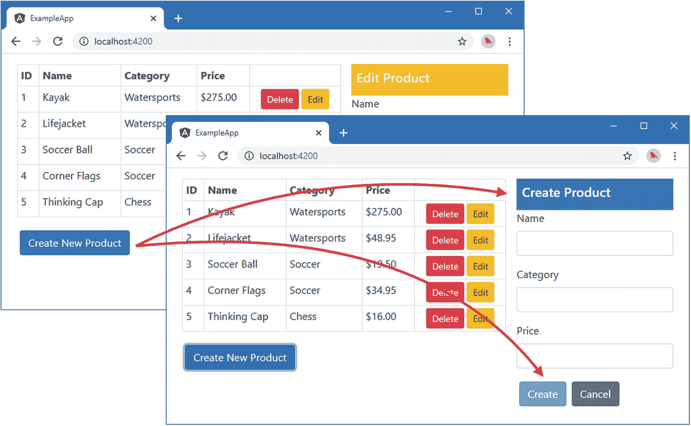
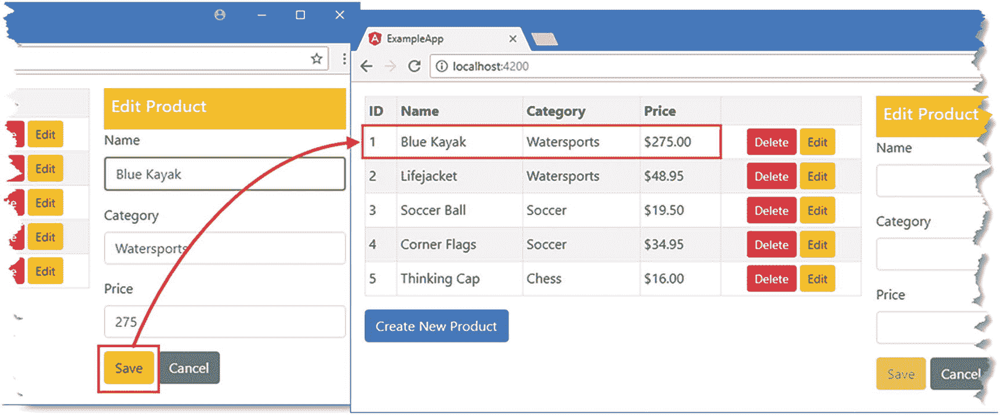
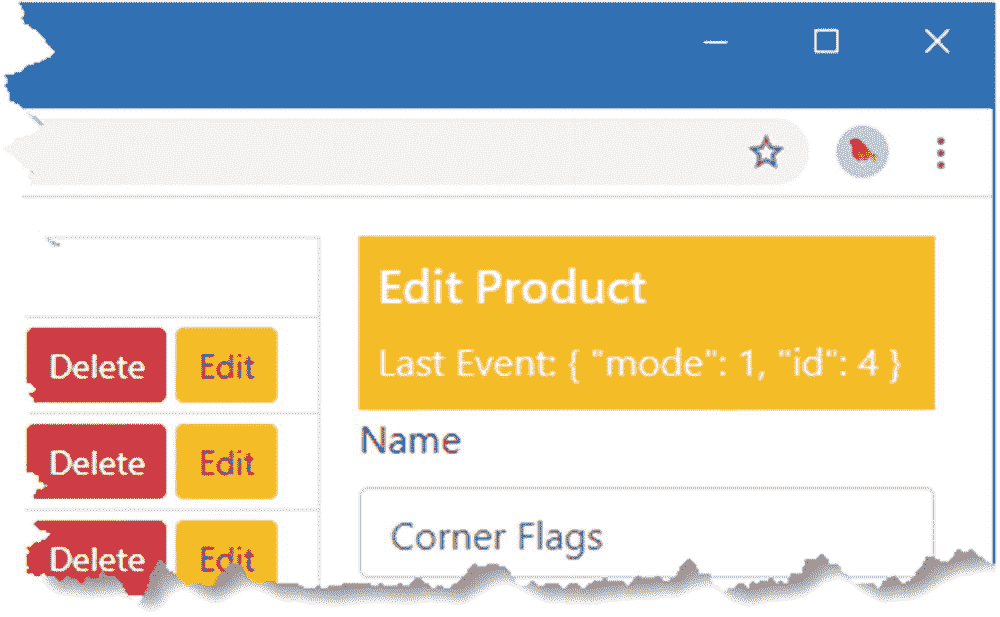
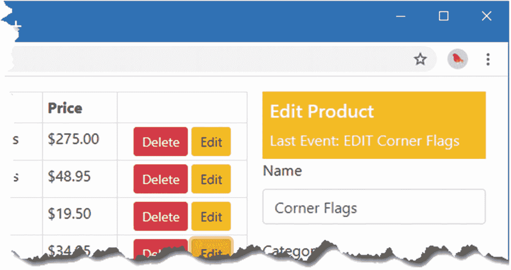
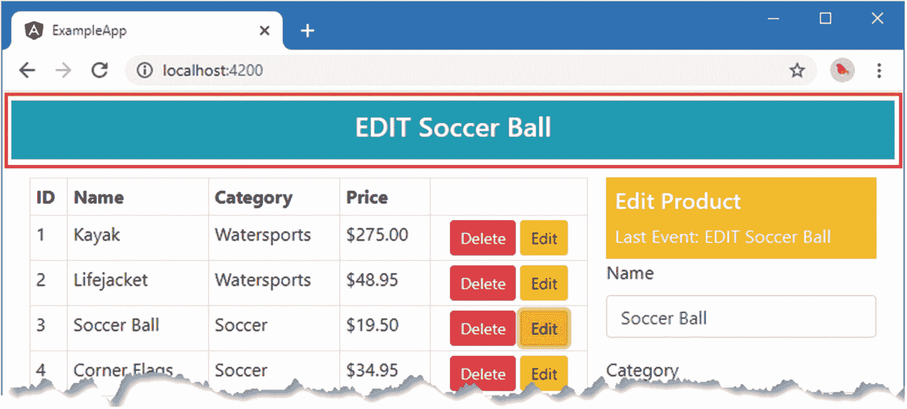
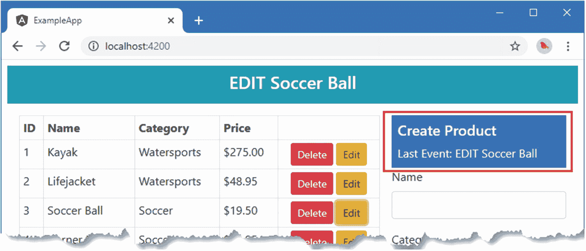
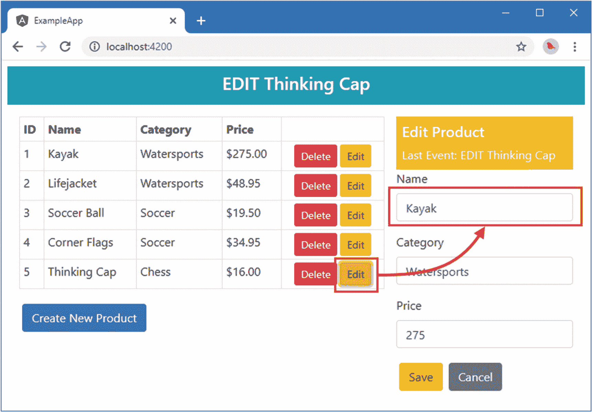

# 二十三、使用反应式扩展

Angular 有很多特性，但最引人注目的是更改在应用中传播的方式，这样填写表单字段或单击按钮就会立即更新应用状态。但是 Angular 能够检测到的变化是有限的，有些特性需要直接使用 Angular 用来在整个应用中分发更新的库。这个库被称为反应式扩展，也称为 RxJS。

在这一章中，我将解释为什么高级项目需要使用 Reactive Extensions，介绍 Reactive Extensions 的核心特性(称为`Observer`和`Observable`),并展示如何使用它们来增强应用，以便用户可以编辑模型中的现有对象，以及创建新的对象。表 [23-1](#Tab1) 将反应式扩展放入上下文中。

表 23-1。

将反应式扩展库放在上下文中

<colgroup><col class="tcol1 align-left"> <col class="tcol2 align-left"></colgroup> 
| 

问题

 | 

回答

 |
| --- | --- |
| 这是什么？ | Reactive Extensions 库提供了一种异步事件分发机制，在 Angular 内部广泛用于变化检测和事件传播。 |
| 为什么有用？ | RxJS 允许标准 Angular 变化检测过程没有处理的应用部分接收重要事件的通知并做出适当的响应。因为 RxJS 是使用 Angular 所必需的，所以它的功能很容易使用。 |
| 如何使用？ | 一个`Observer`被创建，它收集事件并通过一个`Observable`将它们分发给订阅者。实现这一点的最简单的方法是创建一个`Subject`，它同时提供`Observer`和`Observable`功能。可以使用一组操作符来管理到订阅者的事件流。 |
| 有什么陷阱或限制吗？ | 一旦您掌握了基础知识，RxJS 包就很容易使用，尽管有太多的功能需要进行一些实验才能找到有效实现特定结果的组合。 |
| 还有其他选择吗？ | RxJS 需要访问一些 Angular 特性，比如更新子查询和查看子查询，以及发出异步 HTTP 请求。 |

Note

本章的重点是在 Angular 项目中最有用的 RxJS 特性。RxJS 包有很多特性，如果你想了解更多信息，你可以在 [`https://github.com/reactivex/rxjs`](https://github.com/reactivex/rxjs) 查阅项目主页。

表 [23-2](#Tab2) 总结了本章内容。

表 23-2。

章节总结

<colgroup><col class="tcol1 align-left"> <col class="tcol2 align-left"> <col class="tcol3 align-left"></colgroup> 
| 

问题

 | 

解决办法

 | 

列表

 |
| --- | --- | --- |
| 在应用中分发事件 | 使用反应式扩展 | 1–5 |
| 等待模板中的异步结果 | 使用`async`管道 | 6–9 |
| 使用事件实现组件间的协作 | 使用一个`Observable` | 10–12 |
| 管理事件流 | 使用运算符，如`filter`或`map` | 13–18 |

## 准备示例项目

本章使用在第 22 章中创建的 exampleApp 项目。本章不需要修改。在`exampleApp`文件夹中运行以下命令，启动 Angular 开发工具:

```ts
ng serve

```

打开一个新的浏览器选项卡并导航至`http://localhost:4200`以查看图 [23-1](#Fig1) 中所示的内容。


图 23-1。

运行示例应用

Tip

你可以从 [`https://github.com/Apress/pro-angular-9`](https://github.com/Apress/pro-angular-9) 下载本章以及本书其他章节的示例项目。如果在运行示例时遇到问题，请参见第 [1](01.html) 章获取帮助。

## 理解问题

Angular 擅长检测用于数据绑定的表达式的变化。它无缝而高效地做到了这一点，其结果是一个框架，使创建动态应用变得容易。通过单击 Create New Product 按钮，您可以在示例应用中看到工作中的变更检测。提供共享状态信息的服务由表组件更新，然后反映在控制表单组件管理的元素外观的数据绑定中，如图 [23-2](#Fig2) 所示。当您单击“创建新产品”按钮时，表单中的标题和按钮的颜色会立即改变。



图 23-2。

更新数据绑定表达式

随着应用中对象数量的增加，变化检测可能会失控，并对应用的性能造成巨大的消耗，尤其是在功能较弱的设备上，如手机和平板电脑。Angular 没有跟踪应用中的所有对象，而是专注于数据绑定，特别是当属性值改变时。

这就产生了一个问题，因为 Angular 自动管理 HTML 元素的绑定，但是它不支持对组件内部的服务变化做出响应。

通过单击表格中的一个编辑按钮，您可以看到组件中缺少更改的直接后果。尽管数据绑定会立即更新，但是当单击按钮时，组件不会收到通知，也不知道它需要更新填充表单元素以进行编辑的属性。

缺少更新意味着表单组件需要依靠最初在第 [15 章](15.html)中描述的`ngDoCheck`方法来确定重要的变化何时发生，如清单 [23-1](#PC2) 所示。

```ts
import { Component } from "@angular/core";
import { NgForm } from "@angular/forms";
import { Product } from "../model/product.model";
import { Model } from "../model/repository.model"
import { MODES, SharedState } from "./sharedState.model";

@Component({
    selector: "paForm",
    templateUrl: "form.component.html",
    styleUrls: ["form.component.css"]
})
export class FormComponent {
    product: Product = new Product();
    lastId: number;

    constructor(private model: Model,
        private state: SharedState) { }

    get editing(): boolean {
        return this.state.mode == MODES.EDIT;
    }

    submitForm(form: NgForm) {
        if (form.valid) {
            this.model.saveProduct(this.product);
            this.product = new Product();
            form.reset();
        }
    }

    resetForm() {
        this.product = new Product();
    }

    ngDoCheck() {
        if (this.lastId != this.state.id) {
            this.product = new Product();
            if (this.state.mode == MODES.EDIT) {
                Object.assign(this.product, this.model.getProduct(this.state.id));
            }
            this.lastId = this.state.id;
        }
    }
}

Listing 23-1.Monitoring Service Changes in the form.component.ts File in the src/app/core Folder

```

要查看这一更改的效果，请单击表中的一个编辑按钮，表单中将填充要编辑的详细信息。当您编辑完表单中的值后，单击保存按钮，数据模型将被更新，反映您在表中的更改，如图 [23-3](#Fig3) 所示。



图 23-3。

更新产品

这段代码的问题是，每当 Angular 检测到应用中的任何变化，就会调用`ngDoCheck`方法。无论发生什么或在哪里发生，Angular 都必须调用`ngDoCheck`方法来给组件一个自我更新的机会。您可以最小化在`ngDoCheck`方法中完成的工作量，但是随着应用中指令和组件数量的增加，变更事件的数量和对`ngDoCheck`方法的调用数量也会增加，这会降低应用的性能。

正确处理变更检测也比您想象的要困难。例如，尝试使用示例应用编辑一个产品，单击 Save 按钮来存储模型中的更改，然后再次单击 Edit 按钮来编辑同一个产品:什么都不会发生。这是实现`ngDoCheck`方法时的一个常见错误，即使组件本身触发了一个变化，也会调用这个方法，混淆了`ngDoCheck`方法中试图避免做不必要工作的检查。总的来说，这种方法不可靠，成本高，而且扩展性不好。

## 用反应式扩展解决问题

反应式扩展库在 angle 应用中非常有用，因为它为发送和接收通知提供了一个简单明确的系统。这听起来不像是一个巨大的成就，但它支撑了大多数内置的 Angular 功能，并且它可以被应用直接使用，以避免使用`ngDoCheck`实现变化检测所带来的问题。为了准备直接使用反应式扩展，清单 [23-2](#PC3) 定义了一个不透明的令牌，该令牌将用于提供一个使用反应式扩展分发更新的服务，并更改`SharedState`类，以便它定义一个构造函数。这些变化会暂时中断应用，因为 Angular 在试图实例化一个实例以用作服务时，将无法为`SharedState`构造函数提供值。一旦反应式扩展所需的更改完成，应用将再次开始工作。

```ts
import { InjectionToken } from "@angular/core";

export enum MODES {
    CREATE, EDIT
}

export const SHARED_STATE = new InjectionToken("shared_state");

export class SharedState {
    constructor(public mode: MODES, public id?: number) { }
}

Listing 23-2.Defining a Provider Token in the sharedState.model.ts File in the src/app/core Folder

```

### 理解可观测量

关键的反应式扩展构件是一个`Observable`，它代表了一个可观察到的事件序列。一个对象，比如一个组件，可以订阅一个`Observable`并在每次事件发生时接收一个通知，允许它只在事件被观察到时才做出响应，而不是每次应用中的任何地方发生变化时都做出响应。

an `Observable`提供的基本方法是`subscribe`，它接受三个函数作为参数，如表 [23-3](#Tab3) 所示。

表 23-3。

可观察订户论点

<colgroup><col class="tcol1 align-left"> <col class="tcol2 align-left"></colgroup> 
| 

名字

 | 

描述

 |
| --- | --- |
| `onNext` | 当一个新事件发生时，这个函数被调用。 |
| `onError` | 当错误发生时，这个函数被调用。 |
| `onCompleted` | 当事件序列结束时，调用该函数。 |

订阅一个`Observable`只需要`onNext`函数，尽管实现其他函数来提供错误处理并在您期望事件序列结束时做出响应是一个很好的实践。对于这个例子来说，事件不会结束，但是对于`Observable`的其他用途，比如处理 HTTP 响应，知道事件序列何时结束会更有用。清单 [23-3](#PC4) 修改了表单组件，使其声明了对`Observable`服务的依赖。

```ts
import { Component, Inject } from "@angular/core";
import { NgForm } from "@angular/forms";
import { Product } from "../model/product.model";
import { Model } from "../model/repository.model"
import { MODES, SharedState, SHARED_STATE } from "./sharedState.model";
import { Observable } from "rxjs";

@Component({
  selector: "paForm",
  templateUrl: "form.component.html",
  styleUrls: ["form.component.css"]
})
export class FormComponent {
  product: Product = new Product();
  // lastId: number;

  constructor(private model: Model,
    @Inject(SHARED_STATE) public stateEvents: Observable<SharedState>) {

    stateEvents.subscribe((update) => {
      this.product = new Product();
      if (update.id != undefined) {
        Object.assign(this.product, this.model.getProduct(update.id));
      }
      this.editing = update.mode == MODES.EDIT;
    });
  }

  editing: boolean = false;

  submitForm(form: NgForm) {
    if (form.valid) {
      this.model.saveProduct(this.product);
      this.product = new Product();
      form.reset();
    }
  }

  resetForm() {
    this.product = new Product();
  }

  //ngDoCheck() {
  //  if (this.lastId != this.state.id) {
  //    this.product = new Product();
  //    if (this.state.mode == MODES.EDIT) {
  //      Object.assign(this.product, this.model.getProduct(this.state.id));
  //    }
  //    this.lastId = this.state.id;
  //  }
  //}
}

Listing 23-3.Using an Observable in the form.component.ts File in the src/app/core Folder

```

Reactive Extensions NPM 包为它提供的每种类型都包含了单独的 JavaScript 模块，因此您可以从`rxjs`模块导入`Observable`类型。

为了接收通知，组件声明了对`SHARED_STATE`服务的依赖，该服务作为`Observable<SharedState>`对象被接收。这个对象是一个`Observerable`，它的通知将是`SharedState`对象，这将代表用户启动的编辑或创建操作。该组件调用`Observable.subscribe`方法，该方法提供一个接收每个`SharedState`对象并使用它来更新其状态的函数。

What About Promises?

您可能习惯于使用`Promise`对象来表示异步活动。`Observable` s 执行相同的基本任务，但更灵活，功能更多。Angular 确实提供了对使用`Promise`对象的支持，这在您转换到 Angular 和使用依赖于`Promise`对象的库时会很有用。

反应式扩展提供了一个`Observable.fromPromise`方法，该方法将使用一个`Promise`作为事件源来创建一个`Observable`。如果你有一个`Observable`并且因为某种原因需要一个`Promise`，还有一个`Observable.toPromise`方法。

此外，还有一些 Angular 功能可以让您选择使用，例如第 [27](27.html) 章中描述的防护功能，这两种功能都支持。

但是 Reactive Extensions 库是使用 Angular 的一个重要部分，你会在本书这一部分的章节中经常遇到它。我建议您在遇到`Observable`时使用它，并尽量减少与`Promise`对象的相互转换。

### 理解观察者

反应式扩展`Observer`提供了创建更新的机制，使用表 [23-4](#Tab4) 中描述的方法。

表 23-4。

观察者方法

<colgroup><col class="tcol1 align-left"> <col class="tcol2 align-left"></colgroup> 
| 

名字

 | 

描述

 |
| --- | --- |
| `next(value)` | 此方法使用指定的值创建一个新事件。 |
| `error(errorObject)` | 此方法报告一个错误，用参数描述，该参数可以是任何对象。 |
| `complete()` | 此方法结束序列，指示不再发送事件。 |

清单 [23-4](#PC5) 更新了表格组件，这样当用户点击 Create New Product 按钮或其中一个编辑按钮时，它会使用一个`Observer`来发送事件。

```ts
import { Component, Inject } from "@angular/core";
import { Product } from "../model/product.model";
import { Model } from "../model/repository.model";
import { MODES, SharedState, SHARED_STATE } from "./sharedState.model";
import { Observer } from "rxjs";

@Component({
    selector: "paTable",
    templateUrl: "table.component.html"
})
export class TableComponent {

    constructor(private model: Model,
        @Inject(SHARED_STATE) public observer: Observer<SharedState>) { }

    getProduct(key: number): Product {
        return this.model.getProduct(key);
    }

    getProducts(): Product[] {
        return this.model.getProducts();
    }

    deleteProduct(key: number) {
        this.model.deleteProduct(key);
    }

    editProduct(key: number) {
        this.observer.next(new SharedState(MODES.EDIT, key));
    }

    createProduct() {
        this.observer.next(new SharedState(MODES.CREATE));
    }
}

Listing 23-4.Using an Observer in the table.component.ts File in the src/app/core Folder

```

该组件声明了对`SHARED_STATE`服务的依赖，该服务作为一个`Observer<SharedState>`对象被接收，这意味着一个`Observer`将发送使用`SharedState`对象描述的事件。`editProduct`和`createProduct`方法已经更新，因此它们调用观察器上的`next`方法来表示状态的变化。

### 理解主题

这两个组件都使用`SHARED_STATE`标记声明了对服务的依赖，但是每个组件都希望获得不同的类型:表格组件希望接收一个`Observer<SharedState>`对象，而表单组件希望接收一个`Observable<SharedState>`对象。

反应式扩展库提供了`Subject`类，它实现了`Observer`和`Observable`功能。这使得创建允许用单个对象产生和消费事件的服务变得容易。在清单 [23-5](#PC6) 中，我已经修改了在`@NgModule`装饰者的`providers`属性中声明的服务，以使用一个`Subject`对象。

```ts
import { NgModule } from "@angular/core";
import { BrowserModule } from "@angular/platform-browser";
import { FormsModule } from "@angular/forms";
import { ModelModule } from "../model/model.module";
import { TableComponent } from "./table.component";
import { FormComponent } from "./form.component";
import { SharedState, SHARED_STATE } from "./sharedState.model";
import { Subject } from "rxjs";

@NgModule({
    imports: [BrowserModule, FormsModule, ModelModule],
    declarations: [TableComponent, FormComponent],
    exports: [ModelModule, TableComponent, FormComponent],
    providers: [{ provide: SHARED_STATE, useValue: new Subject<SharedState>() }]
})
export class CoreModule { }

Listing 23-5.Changing the Service in the core.module.ts File in the src/app/core Folder

```

基于值的提供者告诉 Angular 使用一个`Subject<SharedState>`对象来解析对`SHARED_STATE`令牌的依赖，这将为组件提供它们协作所需的功能。

结果是，更改共享服务使其成为一个`Subject`允许表格组件发出不同的事件，这些事件由表单组件接收并用于更新其状态，而不需要依赖笨拙且昂贵的`ngDoCheck`方法。由于订阅了`Observable`的组件知道它接收到的所有事件必定源自于`Observer`，因此也不需要试图找出哪些变化是由本地组件生成的，哪些变化来自于其他地方。这意味着像不能编辑同一个产品两次这样的琐碎问题会消失，如图 [23-4](#Fig4) 所示。


图 23-4。

使用反应式扩展的效果

The Different Types of Subject

清单 [23-5](#PC6) 使用了`Subject`类，这是创建既是`Observer`又是`Observable`的对象的最简单方法。它的主要限制是，当使用`subscribe`方法创建一个新订户时，直到下次调用`next`方法时，它才会收到一个事件。如果您正在动态地创建组件或指令的实例，并且希望它们一创建就有一些上下文数据，那么这可能是没有用的。

Reactive Extensions 库包含了一些专门的`Subject`类的实现，可以用来解决这个问题。`BehaviorSubject`类跟踪它处理的最后一个事件，并在新订阅者调用`subscribe`方法时将其发送给新订阅者。`ReplaySubject`类做了一些类似的事情，除了它跟踪它的所有事件，并把它们发送给新的订阅者，允许他们在订阅之前赶上发送的任何事件。

## 使用异步管道

Angular 包含了`async`管道，它可以用来在视图中直接使用`Observable`对象，选择从事件序列中接收到的最后一个对象。这是一个不纯的管道，如第 [18 章](18.html)所述，因为它的变化是由使用它的视图之外驱动的，这意味着它的`transform`方法将被经常调用，即使没有从`Observable`接收到新的事件。清单 [23-6](#PC7) 显示了将`async`管道添加到由表单组件管理的视图中。

```ts
<div class="bg-primary text-white p-2" [class.bg-warning]="editing">
  <h5>{{editing  ? "Edit" : "Create"}} Product</h5>
  Last Event: {{ stateEvents | async | json }}
</div>

<form novalidate #form="ngForm" (ngSubmit)="submitForm(form)" (reset)="resetForm()">

     ...elements omitted for brevity...

</form>

Listing 23-6.Using the Async Pipe in the form.component.html File in the src/app/core Folder

```

字符串插值绑定表达式从组件(即`Observable<SharedState>`对象)获取`stateEvents`属性，并将其传递给`async`管道，后者跟踪最近接收到的事件。然后，`async`过滤器将事件传递给`json`管道，后者创建事件对象的 JSON 表示。结果是你可以跟踪表单组件接收到的事件，如图 [23-5](#Fig5) 所示。



图 23-5。

显示可观察的事件

这不是最有用的数据显示，但它确实提供了一些有用的调试见解。在这种情况下，最近的事件的`mode`值为 1，这对应于编辑模式，而`id`值为 4，这是角标志产品的 ID。

### 将异步管道与自定义管道一起使用

`async`管道可以与定制管道一起使用，以更加用户友好的方式呈现事件数据。为了演示，我在`src/app/core`文件夹中添加了一个名为`state.pipe.ts`的文件，并用它来定义清单 [23-7](#PC8) 中所示的管道。

```ts
import { Pipe } from "@angular/core";
import { SharedState, MODES } from "./sharedState.model";
import { Model } from "../model/repository.model";

@Pipe({
    name: "formatState",
    pure: true
})
export class StatePipe {

    constructor(private model: Model) { }

    transform(value: any): string {
        if (value instanceof SharedState) {
            let state = value as SharedState;
            return MODES[state.mode] + (state.id != undefined
                ? ` ${this.model.getProduct(state.id).name}` : "");
        } else {
            return "<No Data>"
        }
    }
}

Listing 23-7.The Contents of the state.pipe.ts File in the src/app/core Folder

```

在清单 [23-8](#PC9) 中，我已经将管道添加到核心模块的声明集中。

Tip

TypeScript 枚举有一个有用的功能，通过它可以获得值的名称。因此，例如，表达式`MODES[1]`将返回`EDIT`，因为这是索引 1 处的`MODES`枚举值的名称。清单 [23-7](#PC8) 中的管道使用这个特性向用户呈现状态更新。

```ts
import { NgModule } from "@angular/core";
import { BrowserModule } from "@angular/platform-browser";
import { FormsModule } from "@angular/forms";
import { ModelModule } from "../model/model.module";
import { TableComponent } from "./table.component";
import { FormComponent } from "./form.component";
import { SharedState, SHARED_STATE } from "./sharedState.model";
import { Subject } from "rxjs";
import { StatePipe } from "./state.pipe";

@NgModule({
    imports: [BrowserModule, FormsModule, ModelModule],
    declarations: [TableComponent, FormComponent, StatePipe],
    exports: [ModelModule, TableComponent, FormComponent],
    providers: [{ provide: SHARED_STATE, useValue: new Subject<SharedState>() }]
})
export class CoreModule { }

Listing 23-8.Registering the Pipe in the core.module.ts File in the src/app/core Folder

```

清单 [23-9](#PC10) 显示了用于替换表单组件管理的模板中内置`json`管道的新管道。

```ts
<div class="bg-primary text-white p-2" [class.bg-warning]="editing">
  <h5>{{editing  ? "Edit" : "Create"}} Product</h5>
  Last Event: {{ stateEvents | async | formatState }}
</div>

<form novalidate #form="ngForm" (ngSubmit)="submitForm(form)" (reset)="resetForm()">

    ...elements omitted for brevity...

</form>

Listing 23-9.Applying a Custom Pipe in the form.component.html File in the src/app/core Folder

```

这个例子演示了从`Observable`对象接收的事件可以像任何其他对象一样被处理和转换，如图 [23-6](#Fig6) 所示，它说明了一个定制管道是如何建立在由`async`管道提供的核心功能之上的。



图 23-6。

格式化通过可观察序列接收的值

## 向上扩展应用功能模块

相同的反应式扩展构件可以在应用中的任何地方使用，并使构件之间的协作变得容易，即使反应式扩展的使用并没有暴露给应用的所有协作部分。作为示范，清单 [23-10](#PC11) 展示了向`MessageService`类添加一个`Subject`来分发应该显示给用户的消息。

```ts
import { Injectable } from "@angular/core";
import { Message } from "./message.model";
import { Observable } from "rxjs";
import { Subject } from "rxjs";

@Injectable()
export class MessageService {
    private subject = new Subject<Message>();

    reportMessage(msg: Message) {
        this.subject.next(msg);
    }

    get messages(): Observable<Message> {
        return this.subject;
    }
}

Listing 23-10.Using a Subject in the message.service.ts File in the src/app/messages Folder

```

以前的消息服务实现只支持应该向用户显示的消息的单个接收者。我本来可以添加管理多个接收者的代码，但是考虑到应用已经使用了反应式扩展，将这项工作委托给`Subject`类要简单得多，它可以很好地扩展，如果应用中有多个订阅者，不需要任何额外的代码或测试。

清单 [23-11](#PC12) 显示了消息组件的相应变化，它将向用户显示最近的消息。

```ts
import { Component } from "@angular/core";
import { MessageService } from "./message.service";
import { Message } from "./message.model";
import { Observable } from "rxjs";

@Component({
    selector: "paMessages",
    templateUrl: "message.component.html",
})
export class MessageComponent {
    lastMessage: Message;

    constructor(messageService: MessageService) {
        messageService.messages.subscribe(m => this.lastMessage = m);
    }
}

Listing 23-11.Observing Messages in the message.component.ts File in the src/app/messages Folder

```

最后一步是生成一些要显示的消息。在清单 [23-12](#PC13) 中，我修改了核心特性模块的配置，这样`SHARED_STATE`提供者使用一个工厂函数来创建用于分发状态变化事件的`Subject`，并添加一个订阅，将事件提供给消息服务。

```ts
import { NgModule } from "@angular/core";
import { BrowserModule } from "@angular/platform-browser";
import { FormsModule } from "@angular/forms";
import { ModelModule } from "../model/model.module";
import { TableComponent } from "./table.component";
import { FormComponent } from "./form.component";
import { SharedState, SHARED_STATE } from "./sharedState.model";
import { Subject } from "rxjs";
import { StatePipe } from "./state.pipe";
import { MessageModule } from "../messages/message.module";
import { MessageService } from "../messages/message.service";
import { Message } from "../messages/message.model";
import { Model } from "../model/repository.model";
import { MODES } from "./sharedState.model";

@NgModule({
    imports: [BrowserModule, FormsModule, ModelModule, MessageModule],
    declarations: [TableComponent, FormComponent, StatePipe],
    exports: [ModelModule, TableComponent, FormComponent],
    providers: [{
        provide: SHARED_STATE,
        deps: [MessageService, Model],
        useFactory: (messageService, model) => {
            let subject = new Subject<SharedState>();
            subject.subscribe(m => messageService.reportMessage(
                    new Message(MODES[m.mode] + (m.id != undefined
                        ? ` ${model.getProduct(m.id).name}` : "")))
                );
            return subject;
        }
    }]
})
export class CoreModule { }

Listing 23-12.Feeding the Message Service in the core.module.ts File in the src/app/core Folder

```

代码有点乱，但结果是表格组件发送的每个状态变化事件都被消息组件显示出来，如图 [23-7](#Fig7) 。Reactive Extensions 使连接应用的各个部分变得很容易，清单中的代码如此密集的原因是它还使用了`Model`服务从数据模型中查找名称，以使事件更容易阅读。



图 23-7。

在消息服务中使用反应式扩展

## 超越基础

前面章节中的例子涵盖了`Observable`、`Observer`和`Subject`的基本用法。然而，在使用可用于高级或复杂应用的反应式扩展时，还有更多的功能可用。全套操作在 [`https://github.com/reactivex/rxjs`](https://github.com/reactivex/rxjs) 中描述，但在这一章中，我演示了一小部分在 Angular 应用中最可能需要的特性，如表 [23-5](#Tab5) 中所述。表格中描述的方法用于控制从`Observable`对象接收事件的方式。

表 23-5。

用于选择事件的有用的反应式扩展方法

<colgroup><col class="tcol1 align-left"> <col class="tcol2 align-left"></colgroup> 
| 

名字

 | 

描述

 |
| --- | --- |
| `filter` | 该方法调用一个函数来评估从`Observable`接收的每个事件，并丢弃该函数返回的事件`false`。 |
| `map` | 该方法调用一个函数来转换从`Observable`接收的每个事件，并传递该函数返回的对象。 |
| `distinctUntilChanged` | 此方法禁止显示事件，直到事件对象发生变化。 |
| `skipWhile` | 此方法筛选事件，直到满足指定的条件，然后将事件转发给订阅者。 |
| `takeWhile` | 此方法将事件传递给订阅服务器，直到满足指定的条件，之后筛选事件。 |

### 过滤事件

并只选择那些需要的。清单 [23-13](#PC14) 展示了如何使用`filter`方法过滤出与特定产品相关的事件。

```ts
import { Component, Inject } from "@angular/core";
import { NgForm } from "@angular/forms";
import { Product } from "../model/product.model";
import { Model } from "../model/repository.model";
import { MODES, SharedState, SHARED_STATE } from "./sharedState.model";
import { Observable } from "rxjs";
import { filter } from "rxjs/operators";

@Component({
    selector: "paForm",
    templateUrl: "form.component.html",
    styleUrls: ["form.component.css"]
})
export class FormComponent {
    product: Product = new Product();

    constructor(private model: Model,
        @Inject(SHARED_STATE) public stateEvents: Observable<SharedState>) {

            stateEvents.pipe(filter(state => state.id != 3))
            .subscribe((update) => {
                this.product = new Product();
                if (update.id != undefined) {
                    Object.assign(this.product, this.model.getProduct(update.id));
                }
                this.editing = update.mode == MODES.EDIT;
            });
    }

    editing: boolean = false;

    submitForm(form: NgForm) {
        if (form.valid) {
            this.model.saveProduct(this.product);
            this.product = new Product();
            form.reset();
        }
    }

    resetForm() {
        this.product = new Product();
    }
}

Listing 23-13.Filtering Events in the form.component.ts File in the src/app/core Folder

```

要使用表 [23-5](#Tab5) 中描述的方法，需要一个`rxjs/operators`包的`import`语句，如下所示:

```ts
...
import { filter } from "rxjs/operators";
...

```

使用`pipe`方法将`filter`方法应用于`Observable`，如下所示:

```ts
...
stateEvents.pipe(filter(state => state.id != 3)).subscribe((update) => {
...

```

`filter`方法的参数是一个选择所需事件的语句，这些事件被传递给使用`subscribe`方法提供的函数。

您可以通过单击足球产品的 Edit 按钮来查看效果，该产品具有过滤器函数正在检查的 ID。`async`管道显示一个`EDIT`事件已经通过共享服务发送，但是`filter`方法阻止它被组件的`subscribe`函数接收。结果是表单没有反映状态的变化，也没有填充所选择的产品信息，如图 [23-8](#Fig8) 所示。



图 23-8。

过滤事件

### 转变事件

`map`方法用于转换从`Observable`接收的对象。您可以使用此方法以任何方式转换事件对象，方法的结果将替换事件对象。清单 [23-14](#PC17) 使用`map`方法来改变事件对象属性的值。

```ts
import { Component, Inject } from "@angular/core";
import { NgForm } from "@angular/forms";
import { Product } from "../model/product.model";
import { Model } from "../model/repository.model";
import { MODES, SharedState, SHARED_STATE } from "./sharedState.model";
import { Observable } from "rxjs";
import { filter, map } from "rxjs/operators";

@Component({
    selector: "paForm",
    templateUrl: "form.component.html",
    styleUrls: ["form.component.css"]
})
export class FormComponent {
    product: Product = new Product();

    constructor(private model: Model,
        @Inject(SHARED_STATE) public stateEvents: Observable<SharedState>) {

            stateEvents
            .pipe(map(state => new SharedState(state.mode, state.id == 5
                ? 1 : state.id)))
            .pipe(filter(state => state.id != 3))
            .subscribe((update) => {
                this.product = new Product();
                if (update.id != undefined) {
                    Object.assign(this.product, this.model.getProduct(update.id));
                }
                this.editing = update.mode == MODES.EDIT;
            });
    }

    editing: boolean = false;

    submitForm(form: NgForm) {
        if (form.valid) {
            this.model.saveProduct(this.product);
            this.product = new Product();
            form.reset();
        }
    }

    resetForm() {
        this.product = new Product();
    }
}

Listing 23-14.Transforming Events in the form.component.ts File in the src/app/core Folder

```

在这个例子中，传递给`map`方法的函数寻找`id`值为 5 的`SharedState`对象，当找到时，将值改为 1。结果是点击思维帽产品的编辑按钮选择 Kayak 产品进行编辑，如图 [23-9](#Fig9) 所示。



图 23-9。

转变事件

Caution

当使用`map`方法时，不要修改作为函数参数接收的对象。该对象依次传递给所有订阅者，您所做的任何更改都会影响后续的订阅者。这意味着一些订阅者将接收未修改的对象，一些订阅者将接收由`map`方法返回的对象。相反，创建一个新对象，如清单 [23-14](#PC17) 所示。

注意，用于准备和创建对一个`Observable`对象的订阅的方法可以链接在一起。在这个例子中，`map`方法的结果通过管道传递给`filter`方法，后者的结果再传递给`subscribe`方法的函数。以这种方式将方法链接在一起允许为处理和接收事件的方式创建复杂的规则。

#### 使用不同的事件对象

`map`方法可以用来产生任何对象，并且不限于改变它接收的对象的属性值。在清单 [23-15](#PC18) 中，我使用了`map`方法来产生一个数字，它的值编码了操作和它所应用的对象。

```ts
...
constructor(private model: Model,
    @Inject(SHARED_STATE) public stateEvents: Observable<SharedState>) {
    stateEvents
        .pipe(map(state => state.mode == MODES.EDIT ? state.id : -1))
        .pipe(filter(id => id != 3))
        .subscribe((id) => {
            this.editing = id != -1;
            this.product = new Product();
            if (id != -1) {
                Object.assign(this.product, this.model.getProduct(id))
            }
        });
}
...

Listing 23-15.Projecting a Different Type in the form.component.ts File in the src/app/core Folder

```

让一个简单的数据类型表示一个操作并指定它的目标没有什么好处。事实上，它通常会导致问题，因为这意味着组件假设模型中永远不会有一个对象的`id`属性为-1。但是作为一个简单的例子，它演示了`map`方法如何投射不同的类型，以及这些类型如何沿着反应式扩展方法链传递，这意味着由`map`方法产生的`number`值被接收为要由`filter`方法处理的值，并依次由`subscribe`方法处理，这两个方法的函数都被更新以处理新的数据值。

### 只接收不同的事件

`distinctUntilChanged`方法过滤事件序列，以便只将不同的值传递给订阅者。要查看可以用它来解决的问题，单击 Kayak 产品的 Edit 按钮并更改`Category`字段的值。不点击保存按钮，再次点击 Kayak 的编辑按钮，您将看到您的编辑被丢弃。在清单 [23-16](#PC19) 中，我已经将`distinctUntilChanged`方法添加到方法链中，这样它就可以应用于由`map`方法产生的`number`值。只有不同的值将被转发给`filter`和`subscribe`方法。

```ts
import { Component, Inject } from "@angular/core";
import { NgForm } from "@angular/forms";
import { Product } from "../model/product.model";
import { Model } from "../model/repository.model";
import { MODES, SharedState, SHARED_STATE } from "./sharedState.model";
import { Observable } from "rxjs";
import { filter, map, distinctUntilChanged } from "rxjs/operators";

@Component({
    selector: "paForm",
    templateUrl: "form.component.html",
    styleUrls: ["form.component.css"]
})
export class FormComponent {
    product: Product = new Product();

    constructor(private model: Model,
        @Inject(SHARED_STATE) public stateEvents: Observable<SharedState>) {
            stateEvents
            .pipe(map(state => state.mode == MODES.EDIT ? state.id : -1))
            .pipe(distinctUntilChanged())
            .pipe(filter(id => id != 3))
            .subscribe((id) => {
                this.editing = id != -1;
                this.product = new Product();
                if (id != -1) {
                    Object.assign(this.product, this.model.getProduct(id))
                }
            });
    }

    editing: boolean = false;

    submitForm(form: NgForm) {
        if (form.valid) {
            this.model.saveProduct(this.product);
            this.product = new Product();
            form.reset();
        }
    }

    resetForm() {
        this.product = new Product();
    }
}

Listing 23-16.Preventing Duplicate Events in the form.component.ts File in the src/app/core Folder

```

如果您重复 Kayak 编辑过程，您将看到当您为正在编辑的产品单击编辑按钮时，更改不再被丢弃，因为这将产生与前一事件相同的值。编辑不同的产品将导致`map`方法发出不同的`number`值，该值将由`distinctUntilChanged`方法传递。

#### 使用自定义等式检查器

`distinctUntilChanged`方法可以在像`number`这样的简单数据类型之间进行简单的比较，但是它不知道如何比较对象，并且会假设任意两个对象是不同的。为了解决这个问题，你可以指定一个比较函数来检查事件是否不同，如清单 [23-17](#PC20) 所示。

```ts
import { Component, Inject } from "@angular/core";
import { NgForm } from "@angular/forms";
import { Product } from "../model/product.model";
import { Model } from "../model/repository.model";
import { MODES, SharedState, SHARED_STATE } from "./sharedState.model";
import { Observable } from "rxjs";
import { filter, map, distinctUntilChanged } from "rxjs/operators";

@Component({
    selector: "paForm",
    templateUrl: "form.component.html",
    styleUrls: ["form.component.css"]
})
export class FormComponent {
    product: Product = new Product();

    constructor(private model: Model,
        @Inject(SHARED_STATE) public stateEvents: Observable<SharedState>) {
            stateEvents
            .pipe(distinctUntilChanged((firstState, secondState) =>
                firstState.mode == secondState.mode
                    && firstState.id == secondState.id))
            .subscribe(update => {
                this.product = new Product();
                if (update.id != undefined) {
                    Object.assign(this.product, this.model.getProduct(update.id));
                }
                this.editing = update.mode == MODES.EDIT;
            });
    }

    editing: boolean = false;

    submitForm(form: NgForm) {
        if (form.valid) {
            this.model.saveProduct(this.product);
            this.product = new Product();
            form.reset();
        }
    }

    resetForm() {
        this.product = new Product();
    }
}

Listing 23-17.Using a Equality Checker in the form.component.ts File in the src/app/core Folder

```

这个清单删除了`map`和`filter`方法，并为`distinctUntilChanged`方法提供了一个函数，该函数通过比较`SharedState`对象的`mode`和`id`属性来比较它们。不同的对象被传递给提供给`subscribe`方法的函数。

### 接受和跳过事件

`skipWhile`和`takeWhile`方法用于指定导致事件被过滤或传递给订阅者的条件。必须小心使用这些方法，因为很容易指定将永久筛选来自订阅服务器的事件的条件。在清单 [23-18](#PC21) 中，我使用了`skipWhile`方法来过滤事件，直到用户点击创建新产品按钮，之后事件将被传递。

```ts
import { Component, Inject } from "@angular/core";
import { NgForm } from "@angular/forms";
import { Product } from "../model/product.model";
import { Model } from "../model/repository.model";
import { MODES, SharedState, SHARED_STATE } from "./sharedState.model";
import { Observable } from "rxjs";
import { filter, map, distinctUntilChanged, skipWhile } from "rxjs/operators";

@Component({
    selector: "paForm",
    templateUrl: "form.component.html",
    styleUrls: ["form.component.css"]
})
export class FormComponent {
    product: Product = new Product();

    constructor(private model: Model,
        @Inject(SHARED_STATE) public stateEvents: Observable<SharedState>) {
            stateEvents
            .pipe(skipWhile(state => state.mode == MODES.EDIT))
            .pipe(distinctUntilChanged((firstState, secondState) =>
                firstState.mode == secondState.mode
                    && firstState.id == secondState.id))
            .subscribe(update => {
                this.product = new Product();
                if (update.id != undefined) {
                    Object.assign(this.product, this.model.getProduct(update.id));
                }
                this.editing = update.mode == MODES.EDIT;
            });
    }

    editing: boolean = false;

    submitForm(form: NgForm) {
        if (form.valid) {
            this.model.saveProduct(this.product);
            this.product = new Product();
            form.reset();
        }
    }

    resetForm() {
        this.product = new Product();
    }
}

Listing 23-18.Skipping Events in the form.component.ts File in the src/app/core Folder

```

单击表中的编辑按钮仍然会生成事件，这些事件将由订阅到`Subject`的`async`管道显示，没有任何过滤或跳过。但是表单组件不接收那些事件，如图 [23-10](#Fig10) 所示，因为它的订阅被`skipWhile`方法过滤，直到接收到一个`mode`属性不是`MODES.EDIT`的事件。单击 Create New Product 按钮会生成一个结束跳过的事件，之后组件将接收所有事件。


图 23-10。

跳过事件

## 摘要

在这一章中，我介绍了 Reactive Extensions 包，并解释了如何用它来处理应用中不受 Angular 变化检测过程管理的部分的变化。我演示了如何使用`Observable`、`Observer`和`Subject`对象在应用中分发事件，向您展示了内置的`async`管道是如何工作的，并介绍了一些最有用的操作符，这些操作符是 Reactive Extensions 库为控制事件流向订户而提供的。在下一章，我将解释如何在 Angular 应用中进行异步 HTTP 请求，以及如何使用 RESTful web 服务。