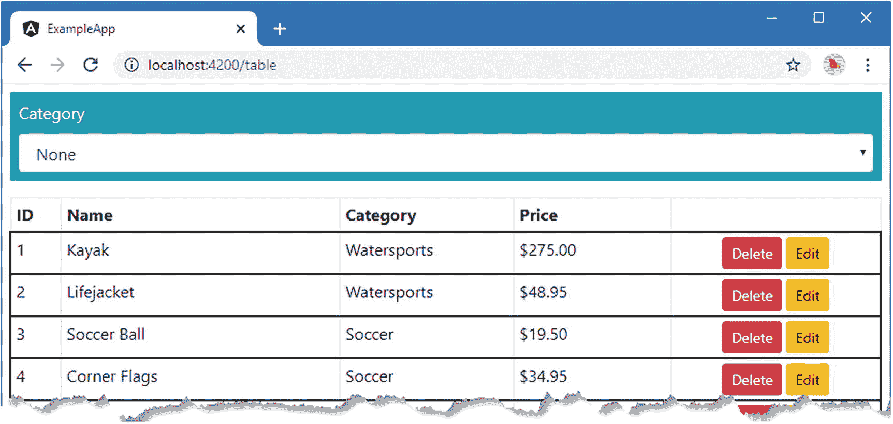
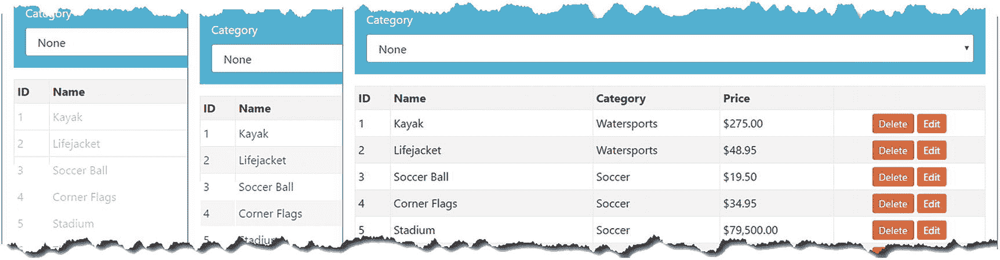
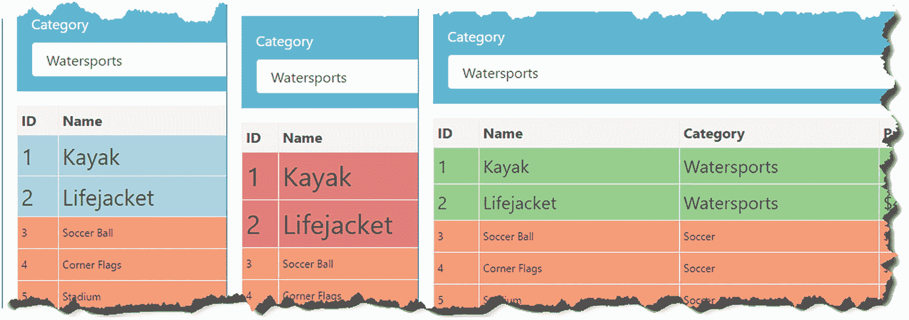
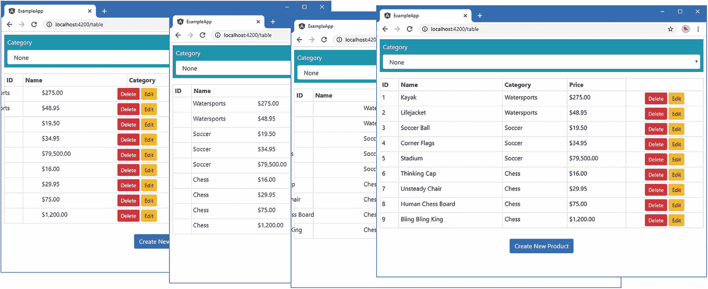
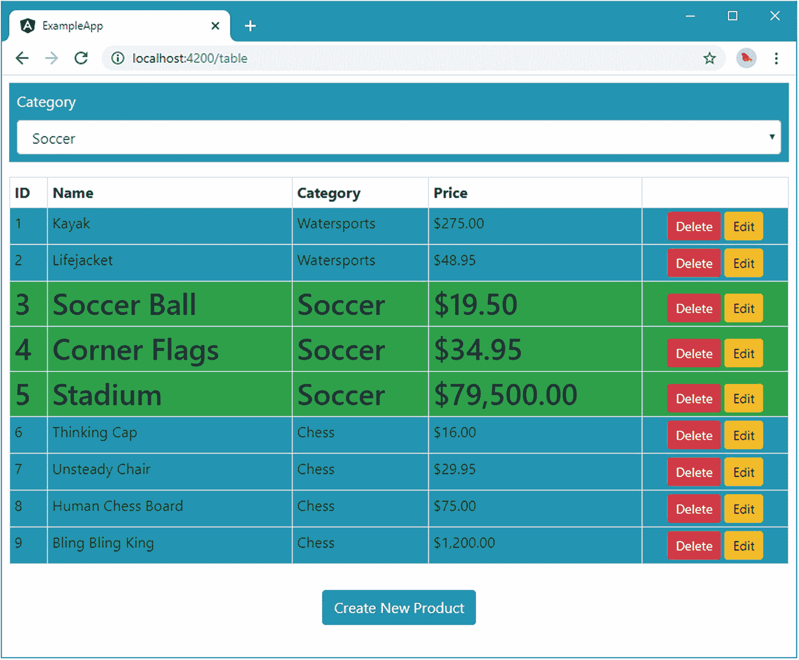

# 二十八、使用动画

在这一章中，我描述了 Angular 动画系统，它使用数据绑定来动画化 HTML 元素，以反映应用状态的变化。从广义上讲，动画在 Angular 应用中有两个作用:强调内容的变化和平滑它们。

当内容以对用户不明显的方式变化时，强调变化是很重要的。在示例应用中，在编辑产品时使用“上一个”和“下一个”按钮会更改数据字段，但不会创建任何其他可视更改，这会导致用户可能不会注意到的转换。动画可以用来吸引人们对这种变化的注意，帮助用户注意到动作的结果。

平滑变化可以使应用更易于使用。当用户单击 Edit 按钮开始编辑产品时，示例应用显示的内容会以一种令人不快的方式切换。使用动画来减缓过渡可以帮助提供内容变化的上下文感，并使其不那么突兀。在这一章中，我将解释动画系统是如何工作的，以及如何用它来吸引用户的注意力或减少突然的过渡。表 [28-1](#Tab1) 将 Angular 动画放在上下文中。

表 28-1。

将 Angular 动画放在上下文中

<colgroup><col class="tcol1 align-left"> <col class="tcol2 align-left"></colgroup> 
| 

问题

 | 

回答

 |
| --- | --- |
| 它们是什么？ | 动画系统可以改变 HTML 元素的外观来反映应用状态的变化。 |
| 它们为什么有用？ | 如果使用得当，动画可以让应用更容易使用。 |
| 它们是如何使用的？ | 动画使用特定于平台的模块中定义的函数来定义，使用`@Component`装饰器中的`animations`属性来注册，并使用数据绑定来应用。 |
| 有什么陷阱或限制吗？ | 主要的限制是只有少数浏览器完全支持 Angular 动画，因此，不能依赖它在 Angular 支持其其他功能的所有浏览器上正常工作。 |
| 还有其他选择吗？ | 唯一的选择是不要让应用动起来。 |

表 [28-2](#Tab2) 总结了本章内容。

表 28-2。

章节总结

<colgroup><col class="tcol1 align-left"> <col class="tcol2 align-left"> <col class="tcol3 align-left"></colgroup> 
| 

问题

 | 

解决办法

 | 

列表

 |
| --- | --- | --- |
| 将用户的注意力吸引到元素状态的转换上 | 应用动画 | 1–9 |
| 动画显示从一个元素状态到另一个元素状态的变化 | 使用元素过渡 | 9–14 |
| 并行执行动画 | 使用动画组 | Fifteen |
| 在多个动画中使用相同的样式 | 使用通用样式 | Sixteen |
| 动画元素的位置或大小 | 使用元素转换 | Seventeen |
| 使用动画应用 CSS 框架样式 | 使用 DOM 和 CSS APIs | 18, 19 |

## 准备示例项目

在这一章中，我继续使用 exampleApp 项目，它最初是在第 [22](22.html) 章中创建的，从那以后一直是每一章的焦点。以下各节中的更改为本章中描述的功能准备了示例应用。

Tip

你可以从 [`https://github.com/Apress/pro-angular-9`](https://github.com/Apress/pro-angular-9) 下载本章以及本书其他章节的示例项目。如果在运行示例时遇到问题，请参见第 [1](01.html) 章获取帮助。

### 禁用 HTTP 延迟

本章的第一个准备步骤是禁用添加到异步 HTTP 请求的延迟，如清单 [28-1](#PC1) 所示。

```ts
import { Injectable, Inject, InjectionToken } from "@angular/core";
import { HttpClient, HttpHeaders } from "@angular/common/http";
import { Observable, throwError } from "rxjs";
import { Product } from "./product.model";
import { catchError, delay } from "rxjs/operators";

export const REST_URL = new InjectionToken("rest_url");

@Injectable()
export class RestDataSource {
    constructor(private http: HttpClient,
        @Inject(REST_URL) private url: string) { }

    getData(): Observable<Product[]> {
        return this.sendRequest<Product[]>("GET", this.url);
    }

    saveProduct(product: Product): Observable<Product> {
        return this.sendRequest<Product>("POST", this.url, product);
    }

    updateProduct(product: Product): Observable<Product> {
        return this.sendRequest<Product>("PUT",
            `${this.url}/${product.id}`, product);
    }

    deleteProduct(id: number): Observable<Product> {
        return this.sendRequest<Product>("DELETE", `${this.url}/${id}`);
    }

    private sendRequest<T>(verb: string, url: string, body?: Product)
        : Observable<T> {

        let myHeaders = new HttpHeaders();
        myHeaders = myHeaders.set("Access-Key", "<secret>");
        myHeaders = myHeaders.set("Application-Names", ["exampleApp", "proAngular"]);

        return this.http.request<T>(verb, url, {
            body: body,
            headers: myHeaders
        })
        //.pipe(delay(5000))
        .pipe(catchError((error: Response) =>
            throwError(`Network Error: ${error.statusText} (${error.status})`)));
    }
}

Listing 28-1.Disabling the Delay in the rest.datasource.ts File in the src/app/model Folder

```

### 简化表格模板和路由配置

本章中的许多示例适用于产品表中的元素。本章的最后准备工作是简化表格组件的模板，这样我就可以专注于清单中的少量内容。

清单 [28-2](#PC2) 显示了简化的模板，它删除了产生 HTTP 和路由错误的按钮，以及计算类别或产品的按钮和出口元素。该清单还删除了允许按类别过滤表格的按钮。

```ts
<table class="table table-sm table-bordered table-striped">
    <tr>
        <th>ID</th><th>Name</th><th>Category</th><th>Price</th><th></th>
    </tr>
    <tr *ngFor="let item of getProducts()">
        <td>{{item.id}}</td>
        <td>{{item.name}}</td>
        <td>{{item.category}}</td>
        <td>{{item.price | currency:"USD" }}</td>
        <td class="text-center">
            <button class="btn btn-danger btn-sm mr-1"
                    (click)="deleteProduct(item.id)">
                Delete
            </button>
            <button class="btn btn-warning btn-sm"
                [routerLink]="['/form', 'edit', item.id]">
                Edit
            </button>
        </td>
    </tr>
</table>
<div class="p-2 text-center">
    <button class="btn btn-primary m-1" routerLink="/form/create">
        Create New Product
    </button>
</div>

Listing 28-2.Simplifying the Template in the table.component.html File in the src/app/core Folder

```

清单 [28-3](#PC3) 更新了应用的 URL 路由配置，这样路由就不会以已经从表格组件的模板中删除的 outlet 元素为目标。

```ts
import { Routes, RouterModule } from "@angular/router";
import { TableComponent } from "./core/table.component";
import { FormComponent } from "./core/form.component";
import { NotFoundComponent } from "./core/notFound.component";
import { ProductCountComponent } from "./core/productCount.component";
import { CategoryCountComponent } from "./core/categoryCount.component";
import { ModelResolver } from "./model/model.resolver";
import { TermsGuard } from "./terms.guard";
import { UnsavedGuard } from "./core/unsaved.guard";
import { LoadGuard } from "./load.guard";

const routes: Routes = [
    {
        path: "form/:mode/:id", component: FormComponent,
        canDeactivate: [UnsavedGuard]
    },
    { path: "form/:mode", component: FormComponent, canActivate: [TermsGuard] },
    { path: "table", component: TableComponent },
    { path: "table/:category", component: TableComponent },
    { path: "", redirectTo: "/table", pathMatch: "full" },
    { path: "**", component: NotFoundComponent }
]

export const routing = RouterModule.forRoot(routes);

Listing 28-3.Updating the Routing Configuration in the app.routing.ts File in the src/app Folder

```

打开一个新的命令提示符，导航到`exampleApp`文件夹，运行以下命令启动提供 RESTful web 服务器的服务器:

```ts
npm run json

```

打开一个单独的命令提示符，导航到`exampleApp`文件夹，运行以下命令启动 Angular 开发工具:

```ts
ng serve

```

打开一个新的浏览器窗口并导航到`http://localhost:4200`以查看如图 [28-1](#Fig1) 所示的内容。


图 28-1。

运行示例应用

## Angular 动画入门

与大多数 Angular 特性一样，最好从一个例子开始，这个例子将让我介绍动画是如何工作的，以及它如何适应 Angular 功能的其余部分。在接下来的部分中，我创建了一个基本的动画，它将影响产品表中的行。一旦您看到了基本特性是如何工作的，我将深入研究每个不同配置选项的细节，并深入解释它们是如何工作的。

但是首先，我将向应用添加一个`select`元素，允许用户选择一个类别。当选择一个类别时，该类别中产品的表格行将显示为两种样式中的一种，如表 [28-3](#Tab3) 所述。

表 28-3。

动画示例的样式

<colgroup><col class="tcol1 align-left"> <col class="tcol2 align-left"></colgroup> 
| 

描述

 | 

风格

 |
| --- | --- |
| 该产品属于所选类别。 | 表格行将有绿色背景和较大的文本。 |
| 该产品不在所选类别中。 | 表格行将具有红色背景和较小的文本。 |

### 启用动画模块

动画特性包含在它们自己的模块中，这些模块必须导入到应用的根模块中，如清单 [28-4](#PC6) 所示。

```ts
import { NgModule } from "@angular/core";
import { BrowserModule } from "@angular/platform-browser";
import { ModelModule } from "./model/model.module";
import { CoreModule } from "./core/core.module";
import { TableComponent } from "./core/table.component";
import { FormComponent } from "./core/form.component";
import { MessageModule } from "./messages/message.module";
import { MessageComponent } from "./messages/message.component";
import { routing } from "./app.routing";
import { AppComponent } from "./app.component";
import { TermsGuard } from "./terms.guard"
import { LoadGuard } from "./load.guard";
import { BrowserAnimationsModule } from "@angular/platform-browser/animations";

@NgModule({
    imports: [BrowserModule, CoreModule, MessageModule, routing,
              BrowserAnimationsModule],
    declarations: [AppComponent],
    providers: [TermsGuard, LoadGuard],
    bootstrap: [AppComponent]
})
export class AppModule { }

Listing 28-4.Importing the Animation Module in the app.module.ts File in the src/app Folder

```

### 创建动画

为了开始制作动画，我在`src/app/core`文件夹中创建了一个名为`table.animations.ts`的文件，并添加了清单 [28-5](#PC7) 中所示的代码。

```ts
import { trigger, style, state, transition, animate } from "@angular/animations";

export const HighlightTrigger = trigger("rowHighlight", [
    state("selected", style({
        backgroundColor: "lightgreen",
        fontSize: "20px"
    })),
    state("notselected", style({
        backgroundColor: "lightsalmon",
        fontSize: "12px"
    })),
    transition("selected => notselected", animate("200ms")),
    transition("notselected => selected", animate("400ms"))
]);

Listing 28-5.The Contents of the table.animations.ts File in the src/app/core Folder

```

用于定义动画的语法可以是密集的，并且依赖于在`@angular/animations`模块中定义的一组函数。在接下来的几节中，我从顶部开始，一步步深入到细节，解释清单中使用的每个动画构建块。

Tip

如果以下部分中描述的所有构建模块不能立即理解，也不要担心。这是一个功能区域，只有当您看到所有部分是如何组合在一起时，它才开始变得更有意义。

#### 定义样式组

动画系统的核心是样式组，它是一组将应用于 HTML 元素的 CSS 样式属性和值。使用`style`函数定义样式组，该函数接受 JavaScript 对象文字，提供属性名和值之间的映射，如下所示:

```ts
...
style({
    backgroundColor: "lightgreen",
    fontSize: "20px"
})
...

```

这个样式组告诉 Angular 将背景颜色设置为`lightgreen`并将字体大小设置为 20 像素。

CSS Property Name Conventions

使用`style`函数时，有两种方法可以指定 CSS 属性。您可以使用 JavaScript 属性命名约定，这样设置元素背景颜色的属性就被指定为`backgroundColor`(所有单词，无连字符，后续单词大写)。这是我在清单 [28-5](#PC7) 中使用的约定:

```ts
...
style({
    backgroundColor: "lightgreen",
    fontSize: "20px"
})),
...

```

或者，您可以使用 CSS 约定，其中相同的属性表示为`background-color`(全部小写，单词之间有连字符)。如果使用 CSS 格式，则必须用引号将属性名括起来，以防止 JavaScript 试图将连字符解释为算术运算符，如下所示:

```ts
...
state("green", style({
    "background-color": "lightgreen",
    "font-size": "20px"
})),
...

```

只要保持一致，使用哪种命名约定并不重要。在撰写本文时，如果您混合和匹配属性名称约定，Angular 将无法正确应用样式。为了获得一致的结果，选择一个命名约定，并将其用于您在整个应用中设置的所有样式属性。

#### 定义元素状态

Angular 需要知道何时需要对一个元素应用一组样式。这是通过定义元素状态来完成的，元素状态提供了一个名称，通过该名称可以引用样式集。元素状态是使用`state`函数创建的，该函数接受名称和应该与之关联的样式集。这是清单 [28-5](#PC7) 中定义的两种元素状态之一:

```ts
...
state("selected", style({
    backgroundColor: "lightgreen",
    fontSize: "20px"
})),
...

```

列表中有两种状态，称为`selected`和`notselected`，它们将对应于表格行描述的产品是否在用户选择的类别中。

#### 定义状态转换

当一个 HTML 元素处于使用`state`函数创建的状态之一时，Angular 将应用该状态的样式组中的 CSS 属性。`transition`函数用于告诉 Angular 应该如何应用新的 CSS 属性。清单 [28-5](#PC7) 中有两个转换。

```ts
...
transition("selected => notselected", animate("200ms")),
transition("notselected => selected", animate("400ms"))
...

```

传递给`transition`函数的第一个参数告诉 Angular 该指令适用于哪个状态。参数是一个指定两种状态的字符串和一个表示它们之间关系的箭头。有两种箭头可供选择，如表 [28-4](#Tab4) 所示。

表 28-4。

动画过渡箭头类型

<colgroup><col class="tcol1 align-left"> <col class="tcol2 align-left"> <col class="tcol3 align-left"></colgroup> 
| 

箭

 | 

例子

 | 

描述

 |
| --- | --- | --- |
| `=>` | `selected => notselected` | 这个箭头指定了两个状态之间的单向转换，例如当元素从`selected`状态移动到`notselected`状态时。 |
| `<=>` | `selected <=> notselected` | 该数组指定了两种状态之间的双向转换，例如当元素从`selected`状态转移到`notselected`状态，以及从`notselected`状态转移到`selected`状态时。 |

清单 [28-5](#PC7) 中定义的转换使用单向箭头告诉 Angular 当一个元素从`selected`状态转移到`notselected`状态以及从`notselected`状态转移到`selected`状态时，它应该如何响应。

`transition`函数的第二个参数告诉 Angular 当状态发生变化时应该采取什么动作。`animate`函数告诉 Angular 在由两个元素状态定义的 CSS 样式集中定义的属性之间逐渐过渡。传递给清单 [28-5](#PC7) 中的`animate`函数的参数指定了这个逐渐过渡应该花费的时间，要么 200 毫秒，要么 400 毫秒。

Guidance for Applying Animations

开发人员在应用动画时经常会忘乎所以，导致应用让用户感到沮丧。动画应该少用，应该简单，应该快速。使用动画来帮助用户理解你的应用，而不是作为展示你艺术技巧的工具。用户，尤其是公司业务线应用，必须重复执行相同的任务，过多和过长的动画只会碍事。

我深受这种倾向的困扰，如果不加检查，我的应用的行为就像拉斯维加斯的老虎机。我遵循两条规则来控制问题。首先，我连续 20 次执行应用中的主要任务或工作流。在示例应用中，这可能意味着创建 20 个产品，然后编辑 20 个产品。我会删除或缩短我发现自己必须等待完成的任何动画，然后才能继续下一步。

第二条规则是，我不会在开发过程中禁用动画。当我在开发一个特性的时候，注释掉一个动画是很有诱惑力的，因为我在写代码的时候会执行一系列的快速测试。但是任何妨碍我的动画也会妨碍用户，所以我把动画留在原地并调整它们——通常减少它们的持续时间——直到它们变得不那么突兀和烦人。

当然，你不必遵循我的规则，但重要的是要确保动画对用户有帮助，而不是快速工作的障碍或令人分心的烦恼。

#### 定义触发器

最后一项工作是动画触发器，它将元素状态和转换打包，并分配一个可用于在组件中应用动画的名称。触发器是使用`trigger`函数创建的，如下所示:

```ts
...
export const HighlightTrigger = trigger("rowHighlight", [...])
...

```

第一个参数是触发器的名称，在本例中是`rowHighlight`，第二个参数是应用触发器时可用的状态和转换的数组。

### 应用动画

一旦定义了动画，就可以通过使用`@Component`装饰器的`animations`属性将它应用到一个或多个组件。清单 [28-6](#PC14) 将清单 [28-5](#PC7) 中定义的动画应用到表格组件，并添加一些支持动画所需的附加特性。

```ts
import { Component, Inject } from "@angular/core";
import { Product } from "../model/product.model";
import { Model } from "../model/repository.model";
import { ActivatedRoute } from "@angular/router";
import { HighlightTrigger } from "./table.animations";

@Component({
    selector: "paTable",
    templateUrl: "table.component.html",
    animations: [HighlightTrigger]
})
export class TableComponent {
    category: string = null;

    constructor(private model: Model, activeRoute: ActivatedRoute) {
        activeRoute.params.subscribe(params => {
            this.category = params["category"] || null;
        })
    }

    getProduct(key: number): Product {
        return this.model.getProduct(key);
    }

    getProducts(): Product[] {
        return this.model.getProducts()
            .filter(p => this.category == null || p.category == this.category);
    }

    get categories(): string[] {
        return this.model.getProducts()
            .map(p => p.category)
            .filter((category, index, array) => array.indexOf(category) == index);
    }

    deleteProduct(key: number) {
        this.model.deleteProduct(key);
    }

    highlightCategory: string = "";

    getRowState(category: string): string {
        return this.highlightCategory == "" ? "" :
            this.highlightCategory == category ? "selected" : "notselected";
    }
}

Listing 28-6.Applying an Animation in the table.component.ts File in the src/app/core Folder

```

属性被设置为一个触发器数组。您可以内联定义动画，但它们会很快变得复杂，使整个组件难以阅读，这就是为什么我使用一个单独的文件并从中导出一个常量值，然后将它赋给`animations`属性。

其他变化是在用户选择的类别和将分配给元素的动画状态之间提供映射。将使用一个`select`元素来设置`highlightCategory`属性的值，并在`getRowState`方法中使用该值来告诉 Angular 清单 [28-7](#PC15) 中定义的动画状态应该根据产品类别进行分配。如果产品在所选择的类别中，那么该方法返回`selected`；否则，它返回`notselected`。如果用户没有选择类别，则返回空字符串。

最后一步是将动画应用到组件的模板，告诉 Angular 哪些元素将被动画化，如清单 [28-7](#PC15) 所示。这个清单还添加了一个`select`元素，它使用`ngModel`绑定来设置组件的`highlightCategory`属性的值。

```ts
<div class="form-group bg-info text-white p-2">
    <label>Category</label>
    <select [(ngModel)]="highlightCategory" class="form-control">
        <option value="">None</option>
        <option *ngFor="let category of categories">
            {{category}}
        </option>
    </select>
</div>
<table class="table table-sm table-bordered table-striped">
    <tr>
        <th>ID</th><th>Name</th><th>Category</th><th>Price</th><th></th>
    </tr>
    <tr *ngFor="let item of getProducts()"
            [@rowHighlight]="getRowState(item.category)">
        <td>{{item.id}}</td>
        <td>{{item.name}}</td>
        <td>{{item.category}}</td>
        <td>{{item.price | currency:"USD" }}</td>
        <td class="text-center">
            <button class="btn btn-danger btn-sm mr-1"
                    (click)="deleteProduct(item.id)">
                Delete
            </button>
            <button class="btn btn-warning btn-sm"
                [routerLink]="['/form', 'edit', item.id]">
                Edit
            </button>
        </td>
    </tr>
</table>
<div class="p-2 text-center">
    <button class="btn btn-primary m-1" routerLink="/form/create">
        Create New Product
    </button>
</div>

Listing 28-7.Applying an Animation in the table.component.html File in the src/app/core Folder

```

使用特殊的数据绑定将动画应用于模板，这些数据绑定将动画触发器与 HTML 元素相关联。绑定的目标告诉 Angular 要应用哪个动画触发器，绑定的表达式告诉 Angular 如何计算出元素应该被分配到哪个状态，如下所示:

```ts
...
<tr *ngFor="let item of getProducts()" [@rowHighlight]="getRowState(item.category)">
...

```

绑定的目标是动画触发器的名称，以字符`@`为前缀，表示动画绑定。这个绑定告诉 Angular 它应该将`rowHighlight`触发器应用到`tr`元素。表达式告诉 Angular 它应该调用组件的`getRowState`方法，使用`item.category`值作为参数，计算出元素应该被分配到哪个状态。图 [28-2](#Fig2) 展示了动画数据绑定的剖析，以供快速参考。


图 28-2。

动画数据绑定的剖析

### 测试动画效果

上一节中的更改在产品表上方添加了一个`select`元素。要查看动画的效果，重新启动 Angular development tools，请求`http://localhost:4200`，然后从窗口顶部的列表中选择 Soccer。Angular 将使用触发器来计算每个元素应该应用于哪个动画状态。足球类产品的表格行将被分配到`selected`状态，而其他行将被分配到`notselected`状态，产生如图 [28-3](#Fig3) 所示的效果。


图 28-3。

选择产品类别

新的样式突然被应用。要查看更平滑的过渡，请从列表中选择 Chess 类别，当 Chess 行被分配到`selected`状态而其他行被分配到`notselected`状态时，您将看到一个渐变动画。发生这种情况是因为动画触发器包含这些状态之间的转换，告诉 Angular 动画 CSS 样式的变化，如图 [28-4](#Fig4) 所示。早期的更改没有过渡，因此 Angular 默认立即应用新样式。


图 28-4。

动画状态之间的逐渐过渡

Tip

用一系列截图来捕捉动画的效果是不可能的，我最多能做的就是呈现一些中间状态。这是一个需要第一手实验来理解的特性。我鼓励你从 GitHub 下载本章的项目，并创建自己的动画。

要理解 Angular 动画系统，您需要理解用于定义和应用动画的不同构建块之间的关系，可以这样描述:

1.  评估数据绑定表达式告诉 Angular 主体元素被分配到哪个动画状态。

2.  数据绑定目标告诉 Angular 哪个动画目标定义了元素状态的 CSS 样式。

3.  状态告诉 Angular 哪些 CSS 样式应该应用于元素。

4.  转换告诉 Angular，当评估数据绑定表达式导致元素状态发生变化时，它应该如何应用 CSS 样式。

当你通读本章的其余部分时，记住这四点，你会发现动画系统更容易理解。

## 了解内置动画状态

动画状态用于定义动画的最终结果，将应用于元素的样式组合在一起，元素的名称可由动画触发器选择。Angular 提供了两种内置状态，使得管理元素的外观更加容易，如表 [28-5](#Tab5) 所述。

表 28-5。

内置动画状态

<colgroup><col class="tcol1 align-left"> <col class="tcol2 align-left"></colgroup> 
| 

状态

 | 

描述

 |
| --- | --- |
| `*` | 这是一种回退状态，如果元素不处于动画触发器定义的任何其他状态，将应用该状态。 |
| `void` | 当元素不是模板的一部分时，它们处于 void 状态。例如，当`ngIf`指令的表达式计算为`false`时，主机元素处于`void`状态。该状态用于动画显示元素的添加和移除，如下一节所述。 |

星号(`*`字符)用于表示特殊状态，Angular 应用于不在动画触发器定义的任何其他状态中的元素。清单 [28-8](#PC17) 为示例应用中的动画添加了回退状态。

```ts
import { trigger, style, state, transition, animate } from "@angular/animations";

export const HighlightTrigger = trigger("rowHighlight", [
    state("selected", style({
        backgroundColor: "lightgreen",
        fontSize: "20px"
    })),
    state("notselected", style({
        backgroundColor: "lightsalmon",
        fontSize: "12px"
    })),
    state("*", style({
        border: "solid black 2px"
    })),
    transition("selected => notselected", animate("200ms")),
    transition("notselected => selected", animate("400ms"))
]);

Listing 28-8.Using the Fallback State in the table.animations.ts File in the src/app/core Folder

```

在示例应用中，一旦用户用`select`元素选择了一个值，元素就只被分配到`selected`或`notselected`状态。后退状态定义了一个样式组，该样式组将应用于元素，直到它们进入其他状态之一，如图 [28-5](#Fig5) 所示。



图 28-5。

使用回退状态

## 了解元素转换

转场是动画系统的真正力量；它们告诉 Angular 它应该如何管理从一种状态到另一种状态的变化。在接下来的部分中，我将描述创建和使用转换的不同方式。

### 为内置状态创建转换

表 [28-5](#Tab5) 中描述的内置状态可用于转换。后退状态可以通过表示任何状态来简化动画配置，如清单 [28-9](#PC18) 所示。

```ts
import { trigger, style, state, transition, animate } from "@angular/animations";

export const HighlightTrigger = trigger("rowHighlight", [
    state("selected", style({
        backgroundColor: "lightgreen",
        fontSize: "20px"
    })),
    state("notselected", style({
        backgroundColor: "lightsalmon",
        fontSize: "12px"
    })),
    state("*", style({
        border: "solid black 2px"
    })),
    transition("* => notselected", animate("200ms")),
    transition("* => selected", animate("400ms"))
]);

Listing 28-9.Using the Fallback State in the table.animations.ts File in the src/app/core Folder

```

清单中的转换告诉 Angular 如何处理从任何状态到`notselected`和`selected`状态的变化。

#### 添加和移除动画元素

`void`状态用于定义当一个元素被添加到模板或从模板中删除时的转换，如清单 [28-10](#PC19) 所示。

```ts
import { trigger, style, state, transition, animate } from "@angular/animations";

export const HighlightTrigger = trigger("rowHighlight", [
    state("selected", style({
        backgroundColor: "lightgreen",
        fontSize: "20px"
    })),
    state("notselected", style({
        backgroundColor: "lightsalmon",
        fontSize: "12px"
    })),
    state("void", style({
        opacity: 0
    })),
    transition("* => notselected", animate("200ms")),
    transition("* => selected", animate("400ms")),
    transition("void => *", animate("500ms"))
]);

Listing 28-10Using the Void State in the table.animations.ts File in the src/app/core Folder

```

这个清单包含了对`void`状态的定义，它将`opacity`属性设置为零，这使得元素透明，因此不可见。还有一个转换告诉 Angular 将从`void`状态到任何其他状态的变化制作成动画。效果是当浏览器逐渐增加不透明度值直到达到填充不透明度时，表格中的行淡入视图，如图 [28-6](#Fig6) 所示。



图 28-6。

动画元素添加

### 控制过渡动画

到目前为止，本章中的所有例子都使用了最简单形式的`animate`函数，它指定了两个状态之间的转换需要多长时间，如下所示:

```ts
...
transition("void => *", animate("500ms"))
...

```

通过提供初始延迟并指定如何计算样式属性的中间值，传递给`animate`方法的`string`参数可用于对过渡的动画方式进行更细粒度的控制。

EXPRESSING ANIMATION DURATIONS

动画的持续时间使用 CSS 时间值来表示，CSS 时间值是包含一个或多个数字的字符串值，后跟代表秒的`s`或代表毫秒的`ms`。例如，该值指定 500 毫秒的持续时间:

```ts
...
transition("void => *", animate("500ms"))
...

```

持续时间可以灵活地表示，相同的值可以表示为几分之一秒，如下所示:

```ts
...
transition("void => *", animate("0.5s"))
...

```

我的建议是在整个项目中坚持使用一套单位以避免混淆，尽管使用哪一套并不重要。

#### 指定计时功能

timing 函数负责在转换过程中计算 CSS 属性的中间值。表 [28-6](#Tab6) 中描述了网络动画规范中定义的计时功能。

表 28-6。

动画计时功能

<colgroup><col class="tcol1 align-left"> <col class="tcol2 align-left"></colgroup> 
| 

名字

 | 

描述

 |
| --- | --- |
| `linear` | 该函数等量改变数值。这是默认设置。 |
| `ease-in` | 此功能从随时间推移而增加的微小变化开始，从而产生一个缓慢启动并加速的动画。 |
| `ease-out` | 该函数从随时间推移而减少的较大变化开始，导致动画快速开始，然后变慢。 |
| `ease-in-out` | 这个函数从大的变化开始，变小直到中间点，之后又变大。结果是动画开始很快，中间变慢，最后又加速。 |
| `cubic-bezier` | 该函数用于使用贝塞尔曲线创建中间值。详见 [`http://w3c.github.io/web-animations/#time-transformations`](http://w3c.github.io/web-animations/#time-transformations) 。 |

清单 [28-11](#PC23) 将一个计时函数应用于示例应用中的一个转换。计时函数在`animate`函数的参数中的持续时间之后指定。

```ts
import { trigger, style, state, transition, animate } from "@angular/animations";

export const HighlightTrigger = trigger("rowHighlight", [
    state("selected", style({
        backgroundColor: "lightgreen",
        fontSize: "20px"
    })),
    state("notselected", style({
        backgroundColor: "lightsalmon",
        fontSize: "12px"
    })),
    state("void", style({
        opacity: 0
    })),
    transition("* => notselected", animate("200ms")),
    transition("* => selected", animate("400ms ease-in")),
    transition("void => *", animate("500ms"))
]);

Listing 28-11.Applying a Timing Function in the table.animations.ts File in the src/app/core Folder

```

#### 指定初始延迟

可以向`animate`方法提供一个初始延迟，当有多个过渡同时执行时，该方法可用于错开动画。延迟被指定为传递给`animate`函数的参数中的第二个值，如清单 [28-12](#PC24) 所示。

```ts
import { trigger, style, state, transition, animate } from "@angular/animations";

export const HighlightTrigger = trigger("rowHighlight", [
    state("selected", style({
        backgroundColor: "lightgreen",
        fontSize: "20px"
    })),
    state("notselected", style({
        backgroundColor: "lightsalmon",
        fontSize: "12px"
    })),
    state("void", style({
        opacity: 0
    })),
    transition("* => notselected", animate("200ms")),
    transition("* => selected", animate("400ms 200ms ease-in")),
    transition("void => *", animate("500ms"))
]);

Listing 28-12.Adding an Initial Delay in the table.animations.ts File in the src/app/core Folder

```

本例中的 200 毫秒延迟对应于元素转换到`notselected`状态时使用的动画的持续时间。其效果是，在`selected`元素被改变之前，改变选中的类别将显示返回到`notselected`状态的元素。

#### 在过渡期间使用附加样式

`animate`函数可以接受一个样式组作为它的第二个参数，如清单 [28-13](#PC25) 所示。在动画持续期间，这些样式会逐渐应用到主体元素。

```ts
import { trigger, style, state, transition, animate } from "@angular/animations";

export const HighlightTrigger = trigger("rowHighlight", [
    state("selected", style({
        backgroundColor: "lightgreen",
        fontSize: "20px"
    })),
    state("notselected", style({
        backgroundColor: "lightsalmon",
        fontSize: "12px"
    })),
    state("void", style({
        opacity: 0
    })),
    transition("* => notselected", animate("200ms")),
    transition("* => selected",
        animate("400ms 200ms ease-in",
            style({
                backgroundColor: "lightblue",
                fontSize: "25px"
            }))
    ),
    transition("void => *", animate("500ms"))
]);

Listing 28-13.Defining Transition Styles in the table.animations.ts File in the src/app/core Folder

```

这一改变的效果是，当一个元素转换到`selected`状态时，它的外观将被动画化，因此背景颜色将是`lightblue`，字体大小将是 25 像素。在动画结束时，由`selected`状态定义的样式将被一次应用，创建一个快照效果。

动画结束时外观的突然变化可能会令人不舒服。另一种方法是将`transition`函数的第二个参数改为动画数组。这定义了将按顺序应用于元素的多个动画，只要它没有定义样式组，最终的动画将用于过渡到由状态定义的样式。清单 [28-14](#PC26) 使用这个特性向过渡添加两个动画，最后一个将应用由`selected`状态定义的样式。

```ts
import { trigger, style, state, transition, animate } from "@angular/animations";

export const HighlightTrigger = trigger("rowHighlight", [
    state("selected", style({
        backgroundColor: "lightgreen",
        fontSize: "20px"
    })),
    state("notselected", style({
        backgroundColor: "lightsalmon",
        fontSize: "12px"
    })),
    state("void", style({
        opacity: 0
    })),
    transition("* => notselected", animate("200ms")),
    transition("* => selected",
        [animate("400ms 200ms ease-in",
            style({
                backgroundColor: "lightblue",
                fontSize: "25px"
            })),
            animate("250ms", style({
                backgroundColor: "lightcoral",
                fontSize: "30px"
            })),
            animate("200ms")]
    ),
    transition("void => *", animate("500ms"))
]);

Listing 28-14.Using Multiple Animations in the table.animations.ts File in the src/app/core Folder

```

这个过渡中有三个动画，最后一个将应用由`selected`状态定义的样式。表 [28-7](#Tab7) 描述了动画的顺序。

表 28-7。

转换到选定状态时的动画序列

<colgroup><col class="tcol1 align-left"> <col class="tcol2 align-left"></colgroup> 
| 

持续时间

 | 

样式属性和值

 |
| --- | --- |
| 400 毫秒 | `backgroundColor: lightblue; fontSize: 25px` |
| 250 毫秒 | `backgroundColor: lightcoral; fontSize: 30px` |
| 200 毫秒 | `backgroundColor: lightgreen; fontSize: 20px` |

使用`select`元素选择一个类别来查看动画序列。图 [28-7](#Fig7) 显示了每个动画中的一帧。



图 28-7。

在过渡中使用多个动画

#### 执行并行动画

Angular 能够同时执行动画，这意味着您可以在不同的时间段更改不同的 CSS 属性。并行动画被传递给`group`函数，如清单 [28-15](#PC27) 所示。

```ts
import { trigger, style, state, transition, animate, group }
    from "@angular/animations";

export const HighlightTrigger = trigger("rowHighlight", [
    state("selected", style({
        backgroundColor: "lightgreen",
        fontSize: "20px"
    })),
    state("notselected", style({
        backgroundColor: "lightsalmon",
        fontSize: "12px"
    })),
    state("void", style({
        opacity: 0
    })),
    transition("* => notselected", animate("200ms")),
    transition("* => selected",
        [animate("400ms 200ms ease-in",
            style({
                backgroundColor: "lightblue",
                fontSize: "25px"
            })),
            group([
                animate("250ms", style({
                    backgroundColor: "lightcoral",
                })),
                animate("450ms", style({
                    fontSize: "30px"
                })),
            ]),
            animate("200ms")]
    ),
    transition("void => *", animate("500ms"))
]);

Listing 28-15.Performing Parallel Animations in the table.animations.ts File in the src/app/core Folder

```

该清单用一对并行动画替换了序列中的一个动画。属性`backgroundColor`和`fontSize`的动画将同时开始，但持续时间不同。当组中的两个动画都完成时，Angular 将移动到最终动画，该动画将针对状态中定义的样式。

## 了解动画样式组

Angular 动画的结果是将元素置于新状态，并使用关联样式组中的属性和值来设置样式。在这一节中，我将解释一些使用样式组的不同方式。

Tip

并不是所有的 CSS 属性都可以被动画化，在那些可以被动画化的属性中，有些被浏览器处理得更好。根据经验，最好的结果是使用其值可以很容易地插值的属性来实现，这允许浏览器提供元素状态之间的平滑过渡。这意味着使用值为颜色或数值的属性，如背景、文本和字体颜色、不透明度、元素大小和边框，通常会获得良好的结果。参见`https://` [`www.w3.org/TR/css3-transitions/#animatable-properties`](http://www.w3.org/TR/css3-transitions/#animatable-properties) 了解可用于动画系统的完整属性列表。

### 在可重用组中定义通用样式

当您创建更复杂的动画并在整个应用中应用它们时，您会不可避免地发现需要在多个地方应用一些常见的 CSS 属性值。`style`函数可以接受一个对象数组，所有这些对象被组合在一起以创建组中的整体样式集。这意味着您可以通过定义包含公共样式的对象并在多个样式组中使用它们来减少重复，如清单 [28-16](#PC28) 所示。(为了保持示例简单，我还删除了上一节中定义的样式序列。)

```ts
import { trigger, style, state, transition, animate, group } from "@angular/animations";

const commonStyles = {
    border: "black solid 4px",
    color: "white"
};

export const HighlightTrigger = trigger("rowHighlight", [
    state("selected", style([commonStyles, {
        backgroundColor: "lightgreen",
        fontSize: "20px"
    }])),
    state("notselected", style([commonStyles, {
        backgroundColor: "lightsalmon",
        fontSize: "12px",
        color: "black"
    }])),
    state("void", style({
        opacity: 0
    })),
    transition("* => notselected", animate("200ms")),
    transition("* => selected", animate("400ms 200ms ease-in")),
    transition("void => *", animate("500ms"))
]);

Listing 28-16.Defining Common Styles in the table.animations.ts File in the src/app/core Folder

```

`commonStyles`对象定义了`border`和`color`属性的值，并在一个数组中与常规样式对象一起传递给`style`函数。Angular 按顺序处理样式对象，这意味着您可以通过在后面的对象中重新定义样式值来覆盖样式值。例如，`notselected`州的第二个样式对象用一个自定义值覆盖了`color`属性的公共值。结果是两种动画状态的样式都包含了`border`属性的公共值，而`selected`状态的样式也使用了`color`属性的公共值，如图 [28-8](#Fig8) 所示。


图 28-8。

定义公共属性

### 使用元素转换

到目前为止，本章中的所有例子都有影响元素外观的动画属性，如背景色、字体大小或不透明度。动画还可以用于应用 CSS 元素变换效果，这些效果用于移动、调整大小、旋转或倾斜元素。这些效果是通过在样式组中定义一个`transform`属性来应用的，如清单 [28-17](#PC29) 所示。

```ts
import { trigger, style, state, transition, animate, group }
    from "@angular/animations";

const commonStyles = {
    border: "black solid 4px",
    color: "white"
};

export const HighlightTrigger = trigger("rowHighlight", [
    state("selected", style([commonStyles, {
        backgroundColor: "lightgreen",
        fontSize: "20px"
    }])),
    state("notselected", style([commonStyles, {
        backgroundColor: "lightsalmon",
        fontSize: "12px",
        color: "black"
    }])),
    state("void", style({
        transform: "translateX(-50%)"
    })),
    transition("* => notselected", animate("200ms")),
    transition("* => selected", animate("400ms 200ms ease-in")),
    transition("void => *",  animate("500ms"))
]);

Listing 28-17.Using an Element Transformation in the table.animations.ts File in the src/app/core Folder

```

属性的值是 T1，它告诉 Angular 沿着 x 轴移动元素长度的 50%。`transform`属性已经被应用到`void`状态，这意味着当元素被添加到模板中时，它将被用在元素上。该动画包含从`void`状态到任何其他状态的转换，并告诉 Angular 在 500 毫秒内将这些变化制作成动画。结果是新元素最初会向左移动，然后在半秒钟内滑回到默认位置，如图 [28-9](#Fig9) 所示。



图 28-9。

变换元素

表 [28-8](#Tab8) 描述了可以应用于元素的一组转换。

表 28-8。

CSS 转换函数

<colgroup><col class="tcol1 align-left"> <col class="tcol2 align-left"></colgroup> 
| 

功能

 | 

描述

 |
| --- | --- |
| `translateX(offset)` | 这个函数沿着 x 轴移动元素。移动量可以指定为百分比或长度(以像素或其他 CSS 长度单位之一表示)。正值将元素向右平移，负值向左平移。 |
| `translateY(offset)` | 这个函数沿着 y 轴移动元素。 |
| `translate(xOffset, yOffset)` | 该函数沿两个轴移动元素。 |
| `scaleX(amount)` | 这个函数沿着 x 轴缩放元素。缩放尺寸表示为元素常规尺寸的一部分，因此`0.5`将元素缩小到原始宽度的 50 %, 2.0 将使宽度加倍。 |
| `scaleY(amount)` | 此函数沿 y 轴缩放元素。 |
| `scale(xAmount, yAmount)` | 该函数沿两个轴缩放元素。 |
| `rotate(angle)` | 这个函数顺时针旋转元素。旋转量用 Angular 表示，如`90deg`或`3.14rad`。 |
| `skewX(angle)` | 该函数将元素沿 x 轴倾斜一个指定的 Angular，表达方式与`rotate`函数相同。 |
| `skewY(angle)` | 该函数将元素沿 y 轴倾斜一个指定的 Angular，表达方式与`rotate`函数相同。 |
| `skew(xAngle, yAngle)` | 该函数沿两个轴倾斜元素。 |

Tip

通过用空格分隔，可以在一个`transform`属性中应用多个转换，就像这样:`transform: "scale(1.1, 1.1) rotate(10deg)"`。

### 应用 CSS 框架样式

如果您正在使用类似 Bootstrap 的 CSS 框架，您可能希望将类应用于元素，而不是必须定义属性组。没有直接使用 CSS 类的内置支持，但是文档对象模型(DOM)和 CSS 对象模型(CSSOM)提供 API 访问来检查已加载的 CSS 样式表，并查看它们是否适用于 HTML 元素。为了获得由类定义的样式集，我在`src/app/core`文件夹中创建了一个名为`animationUtils.ts`的文件，并添加了清单 [28-18](#PC30) 中所示的代码。

Caution

这种技术可能需要在使用大量复杂样式表的应用中进行大量处理，并且您可能需要调整代码以适应不同的浏览器和不同的 CSS 框架。

```ts
export function getStylesFromClasses(names: string | string[],
        elementType: string = "div") : { [key: string]: string | number } {

    let elem = document.createElement(elementType);
    (typeof names == "string" ? [names] : names).forEach(c => elem.classList.add(c));

    let result = {};

    for (let i = 0; i < document.styleSheets.length; i++) {
        let sheet = document.styleSheets[i] as CSSStyleSheet;
        let rules = sheet.rules || sheet.cssRules;
        for (let j = 0; j < rules.length; j++) {
            if (rules[j].type == CSSRule.STYLE_RULE) {
                let styleRule = rules[j] as CSSStyleRule;
                if (elem.matches(styleRule.selectorText)) {
                    for (let k = 0; k < styleRule.style.length; k++) {
                        result[styleRule.style[k]] =
                            styleRule.style[styleRule.style[k]];
                    }
                }
            }
        }
    }
    return result;
}

Listing 28-18.The Contents of the animationUtils.ts File in the src/app/core Folder

```

`getStylesFromClass`方法接受单个类名或类名数组以及它们应该应用的元素类型，默认为一个`div`元素。创建一个元素并将其分配给类，然后检查 CSS 样式表中定义的哪个 CSS 规则适用于它。每个匹配样式的样式属性被添加到一个对象中，该对象可用于创建 Angular 动画样式组，如清单 [28-19](#PC31) 所示。

```ts
import { trigger, style, state, transition, animate, group }
    from "@angular/animations";
import { getStylesFromClasses } from "./animationUtils";

export const HighlightTrigger = trigger("rowHighlight", [
    state("selected", style(getStylesFromClasses(["bg-success", "h2"]))),
    state("notselected", style(getStylesFromClasses("bg-info"))),
    state("void", style({
        transform: "translateX(-50%)"
    })),
    transition("* => notselected", animate("200ms")),
    transition("* => selected", animate("400ms 200ms ease-in")),
    transition("void => *", animate("500ms"))
]);

Listing 28-19.Using Bootstrap Classes in the table.animations.ts File in the src/app/core Folder

```

`selected`状态使用 Bootstrap `bg-success`和`h2`类中定义的样式，`notselected`状态使用 Bootstrap `bg-info`类定义的样式，产生如图 [28-10](#Fig10) 所示的结果。



图 28-10。

在 Angular 动画中使用 CSS 框架样式

## 摘要

我在本章中描述了 Angular 动画系统，并解释了它如何使用数据绑定来动画化应用状态的变化。在下一章，我将描述 Angular 提供的支持单元测试的特性。