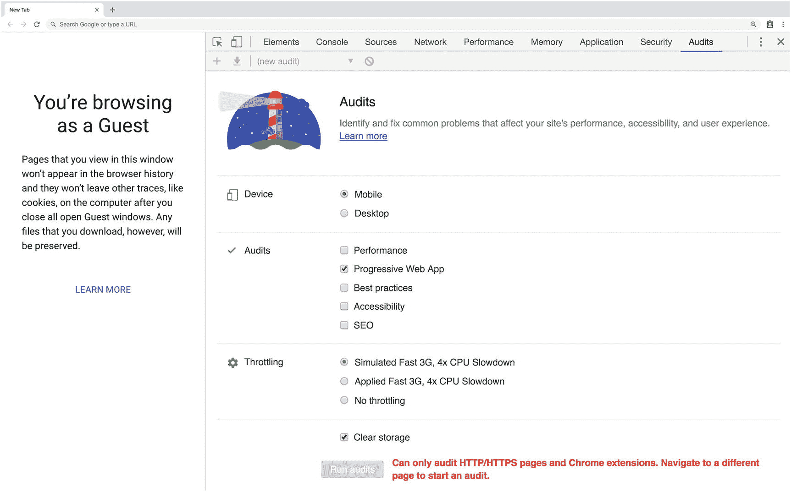
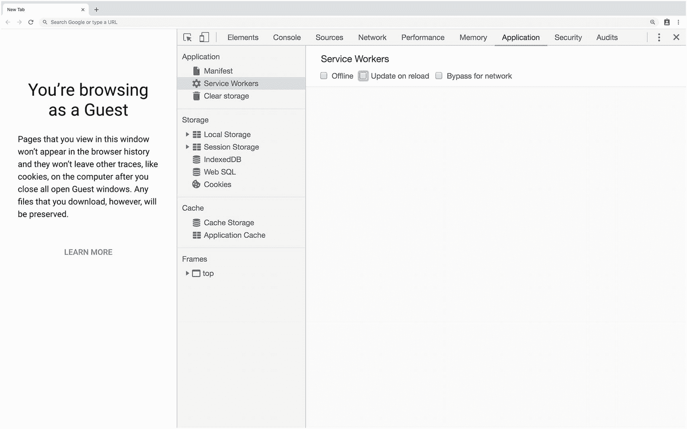
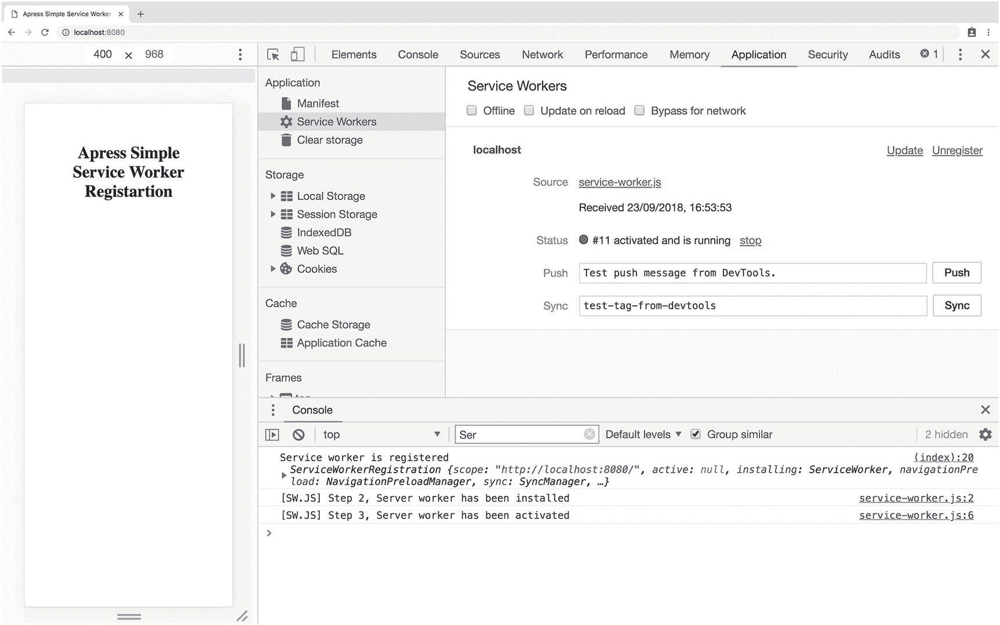
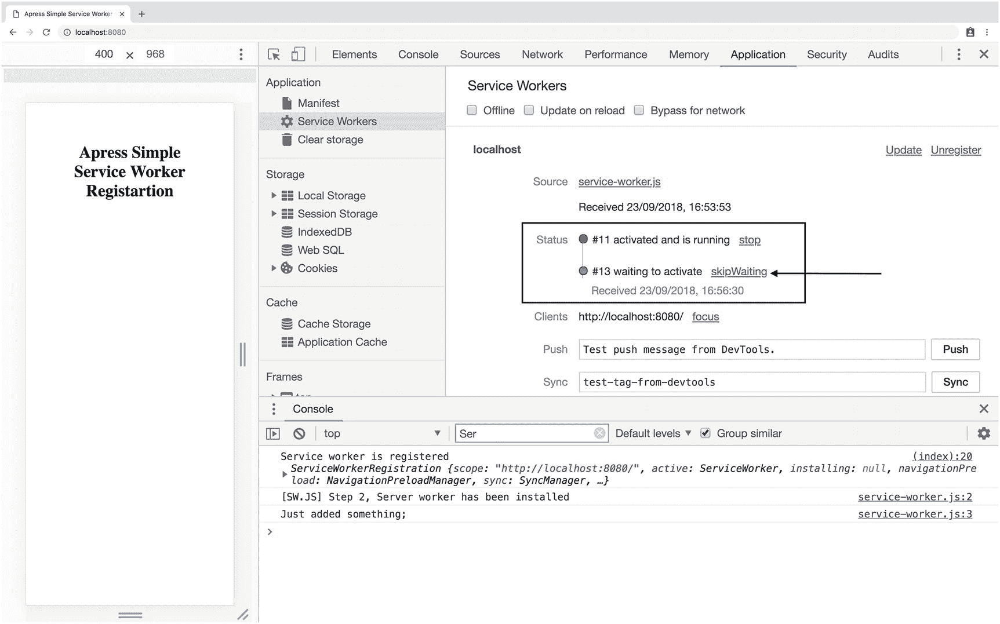

# 四、Angular 的服务工作器

到目前为止，我们构建的应用没有 PWA 特征。从本章开始，我们将逐步添加 PWA 功能并深入研究。Angular 提供了一个名为`service-worker`的模块来处理缓存策略和即时通知。Angular Service Worker 高度可配置，可以满足 Angular app 需求。但是，在我们开始实施本模块之前，我们应该对服务工作器有一个基本的了解。

本章从服务工作器基础和缓存 API 开始，因为当我们使用 Angular Service Worker 编码时，了解幕后发生的事情是至关重要的。然后，Angular CLI 将通过使用`@angular/pwa`原理图帮助我们搭建支架并将我们的项目转化为 PWA。

虽然重点是 CLI v6，但为了让我们更好地了解手动实现时需要做的工作，每个修改都将被分解，例如，在 Angular 版本 5 或更低版本中。

## 服务工作器:艾滋病人的大脑

你的大脑是决策的中心，完全控制着你的身体。服务器工人类似于我们的大脑。它们的核心是用 JavaScript 编写的工作脚本，在现代浏览器中只需几行代码就能实现，并在后台运行。一旦激活，开发人员就能够拦截网络请求，处理推送通知，管理缓存，并执行许多不同的任务。

你可能会问，不支持怎么办？ <sup>[1](#Fn1)</sup>

如果它没有在用户的浏览器中实现，它只是后退，网站将正常运行。PWA 的定义是，任何人——无论选择何种浏览器和操作系统——都应该能够浏览网站并获得最佳用户体验。这个描述指的是被称为“完美渐进增强”的短语

### 了解服务工作器

为了理解服务工作器，想象你自己坐在你大脑的中心。你被提供了不同的工具来控制你的身体。你什么都看得到，你可以做任何决定。这取决于你，要么让你的身体做它正常做的事情，要么把决定导向一个不同的方向。你甚至可能完全停止大脑的运作。这是您可以在服务工作器中对网络请求执行的操作；它的作用类似于网站和服务器之间的代理。完全接管网络请求的能力使服务工作器非常强大，并允许您做出反应和响应！

值得一提的是，尽管 Service Worker 是用 JavaScript 编写的，但它的行为略有不同，如下所示:


图 4-1

服务工作器可以在不同的线程中运行并拦截请求

*   在不同的线程中运行，与支持应用的主 JavaScript 不同。图 [4-1](#Fig1) 展示了服务工作器是如何坐在不同的线程上截取网络请求的。

*   在它自己的全球环境中运行。

*   设计为完全异步；因此，它不能访问诸如同步 XHR 和本地存储之类的东西。

*   在 worker 上下文中运行——因此，它不能访问 DOM。

*   除了用于开发的 Localhost 之外，仅在生产中运行 HTTPS。

*   在 1:1 范围内运行，这意味着每个范围只能有一个服务工作器。

*   可以随时终止。

服务工作器是事件驱动的。因此，一旦了解了事件的基本情况，就比你想象的更容易开始。简单地挑选你想参加的活动，你就可以开始了。让我们来看看服务工作器中的主要事件。

### 服务工作器生命周期

服务工作器在其生命周期中有不同的阶段。慢慢来，看看图 [4-2](#Fig2) ，它展示了服务工作器生命周期是如何分四步进行的。想象一下，你的网站将由一名服务工作器提供服务:

步骤 1，当用户导航到网站时，通过调用`register()`函数，浏览器检测到服务工作器 JavaScript 文件；因此，它下载、解析并开始执行阶段。Register 函数返回一个承诺 <sup>[2](#Fn2)</sup> ，在错误的情况下，注册被拒绝，服务工作器注册过程停止。

然而，第 2 步，如果注册顺利并得到解决，服务工作器状态变为 **installed** 。因此，一个**安装**事件在预缓存所有静态资产的最佳位置触发。请记住，**安装**事件仅在注册后第一次发生。

步骤 3，一旦安装成功完成，服务工作器就会被**激活**，并在自己的范围内拥有完全控制权。类似于**安装**事件，激活仅在注册后第一次发生，并且一旦**安装**完成。


图 4-2

服务器工作生命周期

### 注意

作用域用于指定您希望服务器工作程序控制的内容子集，可以通过`register()`函数第二个参数中的可选参数`scope`来定义，也可以默认定义服务器工作程序 JavaScript 文件所在的位置。例如，如果服务器 worker 文件位于应用的根目录中，它就可以控制所有页面。然而`, /sw-test/`指定只能访问这个原点下的所有页面。图 [4-3](#Fig3) 展示了示波器如何工作。

步骤 4，安装和激活事件无误完成后，服务工作器将开始工作。但是，如果它在安装、激活期间失败，或者被新的替换，它仍然是多余的，不会影响应用。


图 4-3

服务工作器范围演示

如前所述，没有服务工作器的网站不会处理任何请求；然而，一旦安装并激活了它，它就可以控制自己范围内的每一个请求。因此，要在第一次安装和激活后启动 Service Worker 中的逻辑，需要刷新网站，或者我们应该导航到另一个页面。

最后但同样重要的是，可能会发生这样的情况，我们想要改变一个注册并激活的服务工作器。如果在注册的文件中有字节大小的变化，浏览器会考虑它，所有的步骤，如上所述，会再次发生。但是，由于我们已经激活了一个服务工作器，因此流程略有不同。这一次，服务工作器不会立即被激活；因此，Service Worker 中的逻辑不会执行。它保持**等待**,直到所有运行旧服务工作器的标签和客户端被终止。换句话说，所有打开网站的标签都必须关闭，然后重新打开。因为我们是开发人员，并且知道忍者技巧，我们可以简单地跳过 DevTools 的等待，或者如果我们愿意，我们也可以在服务工作器逻辑中以编程方式完成。我们将在本章中对此进行详细的回顾。

### 服务工作器功能事件

除了**安装**和**激活**事件之外，**获取**、**推送**和**同步**事件在服务工作器中也是可用的，称为**功能事件**。简而言之:

*   **Fetch** :每次浏览器请求静态资产或动态内容时发生；例如，对图像、视频、CSS、JS、HTML 的请求，甚至 ajax 请求。

*   **推送**:web app 收到推送通知时发生。

*   **Sync** :让您推迟操作，直到用户拥有稳定的连接。这有助于确保用户想要发送的任何内容都被实际发送。该 API 还允许服务器向应用推送定期更新，以便应用可以在下次上线时进行更新。

### Chrome DevTools(铬 DevTools)

没有合适的调试工具，任何开发人员都不会感到舒服。在所有浏览器中，在写这本书的时候，Chrome DevTools 是调试服务工作器的最佳选择。让我们来看一下 Chrome DevTools，看看它提供了哪些选项来帮助我们简化调试并更好地增强 PWAs。

控制台、应用和审计是 Chrome DevTools 中调试服务工作器的主要面板。审计小组利用 **Lighthouse** 、<sup>T3】3T5，这是一个开源的自动化工具，用于提高网站质量，可用于运行可访问性、性能、SEO、最佳实践和 PWA 审计测试。我们使用**审计**面板来鉴定网页，特别是**渐进式网络应用**，这是我们的目标(见图 [4-4](#Fig4) )。</sup>



图 4-4

Chrome 中的审计面板，我们在这里对网页进行审计测试

查看了**应用**面板后，我们看到以下内容:

*   **清单**:我们可以调试 *Web App 清单* *的地方。* <sup>[4](#Fn4)</sup>

*   **服务工作器**:在这里我们调试服务工作器，有很多选项，比如更新服务工作器、移除、跳过等待，以及不同的选项与网络一起工作(图 [4-5](#Fig5) )。
    *   **离线**:在浏览器中模拟无法上网。

    *   **重新加载时更新**:每次页面重新加载时下载服务工作器，因此所有生命周期事件，包括安装和激活，都在重新加载时发生。这对调试非常有用。

    *   **绕过网络**:将强制浏览器忽略任何活动的服务工作器，并从网络获取资源。这对于您希望处理 CSS 或 JavaScript，而不必担心服务工作器意外缓存和返回旧文件的情况非常有用。

*   **清除存储**:在这里我们可以删除所有缓存。

*   本地存储、会话存储、**索引数据库**、Web SQL 和 cookies 都是您可能熟悉的不同类型的存储。索引数据库将是本书的重点，因为它是异步的，服务工作器可以访问它。

*   **缓存存储**:这是浏览器中新的缓存 API，基于键值，能够存储请求和响应。我们打开这个缓存来存储我们的大部分资产和动态内容。这种缓存非常强大，在应用和服务工作器中都可用。

如果你有兴趣了解更多关于 Chrome DevTools 的信息，你可以在谷歌开发者网站的 [`https://developers.google.com/web/tools/chrome-devtools/`](https://developers.google.com/web/tools/chrome-devtools/) 中查看详细文档。我强烈建议您花点时间深入探索关于 DevTools 的信息，我相信这会让您更有效率。



图 4-5

Chrome DevTools 应用面板下的服务工作器选项

我知道您迫不及待地想要开始编码和查看示例代码，所以让我们开始吧。

### 服务工作器示例代码

是时候写几行代码来看看我们如何注册一个服务工作器并探索它自己的生命周期了。首先，我将创建一个简单的 html 文件，在`</body>`之前，我将打开一个`<script>`标签，并将注册`service-worker.js`文件，该文件位于`index.html.`旁边的根目录中

```ts
<!DOCTYPE html>
<html lang="en">
<head>
    <meta charset="UTF-8">
    <meta name="viewport" content="width=device-width, initial-scale=1.0">
    <meta http-equiv="X-UA-Compatible" content="ie=edge">
    <title>Apress Simple Service Worker Registartion</title>
</head>
<body>
    <div style="text-align: center; padding: 3rem">
        <h1>Apress Simple Service Worker Registartion</h1>
    </div>
    <script>
        if ('serviceWorker' in navigator) {
            navigator.serviceWorker
                .register('/service-worker.js')
                .then(registration => {  // registeration object
                    console.log('Service worker is registered', registration);
                })
                .catch(e => {
                    console.error('Something went wrong while registaring service worker.')
                });
        }
    </script>
</body>
</html>

```

渐进式改进意味着允许所有用户加载我们的网页，无论他们使用的是旧版本还是最新版本的浏览器。因此，我们应该经常检查不同浏览器中可能没有的功能。上面的代码由一个特性检查语句`if ('serviceWorker' in navigator) {}.`开始。一旦确保了可用性，就通过传递服务工作器路径来调用 register 方法`register('/service-worker.js')`。这个方法有第二个参数，这个参数是可选的，用于向方法传递额外的选项:例如，定义范围。因为 register 方法中没有第二个参数，所以 scope 应该是缺省值；在这种情况下，它是服务工作器文件所在的根目录。`then`和`catch`分别在承诺注册被解析或拒绝时返回注册或错误对象。

`server-worker.js`中的逻辑是**激活**和**安装**事件的监听器，其中我们在控制台的回调函数中记录两条消息。`Self`在这里指的是`ServiceWorkerGlobalScope`。

```ts
//service-worker.js

self.addEventListener("install", (event) => {
  console.log("[SW.JS] Step 2, Service worker has been installed");
});

self.addEventListener("activate", (event) => {
  console.log("[SW.JS] Step 2, Service worker has been activated");
});

```

当您在控制台面板中打开 devTools 时，您将能够看到日志(参见图 [4-6](#Fig6) )。

### 注意

可以下拉 [`www.github.com/mhadaily/awesome-apress-pwa/chapter04/01-simple-service-worker`](http://www.github.com/mhadaily/awesome-apress-pwa/chapter04/01-simple-service-worker) 。运行`npm install`然后运行`npm start`。它在端口 8080 上运行一个 web 服务器。可以导航到`localhost:8080`。如果您将书中的代码复制并粘贴到项目中，您需要一个 web 服务器来运行您的代码。

重新加载网页；从现在开始直到`service-wokrer.js`中的新变化，你将只能看到登录在控制台中的注册对象，并且安装和激活不再被触发(见图 [4-7](#Fig7) )。


图 4-7

一旦服务工作器被激活，第二次重新加载不再触发安装和激活事件



图 4-6

首次注册时的服务工作器生命周期。如您所见，安装和激活事件时有发生。

Reload the web page; from now on until the new change in

只需在服务工作器文件中添加几行，然后在应用面板中观察服务工作器的同时重新加载应用。

```ts
// modified service-worker.js
// this is equivalent to following addEventistener
// self.oninstall = (event) => { };
self.addEventListener("install", event => {
  console.log("[SW.JS] Step 2, Service worker has been installed");
  console.log("Just added something;");
});

// this is equivalent to following addEventistener
// self.onactivate = (event) => { };
self.addEventListener("activate", event => {
  console.log("[SW.JS] Step 3, Service worker has been activated");
});

```

重新加载后，您将看到一个新的服务工作器正在等待，直到所有客户端都被终止。一旦浏览器检测到服务工作器的新变化，就安装这个文件；然而，直到所有的客户端都被声明，它才被激活——换句话说，所有的标签页都需要被关闭并重新打开，以编程方式在 Service Worker 中执行`skipWaiting`,或者你可以手动点击 Chrome DevTools 中的`SkipWaiting`,如图 [4-8](#Fig8) 所示。



图 4-8

在 DevTools 中，您可以单击 SkipWaiting 来激活新的服务工作器

到目前为止，我们已经发现了 Service Worker 及其生命周期是如何工作的。现在是时候展示缓存 API 功能了，并在下一节中看到它的实际应用。

## 缓存 API

连通性独立性是 PWAs 的一个顶级特征，它使 PWAs 与众不同。缓存 API 是浏览器中一个新的缓存存储，我们可以将请求存储为键，将响应存储为值。在本节中，我们将快速浏览一下缓存 API，以了解离线特性是如何工作的。

我改变了应用的结构，加入了`app.js`文件和`style.css`文件，前者操纵 DOM 显示标题，后者包含一个`title`使标题居中。

```ts
.
├── app.js
├── index.html
├── service-worker.js
└── style.css

// app.js

const title = document.querySelector(".title");
title.innerHTML = "<h1>Apress Simple Service Worker Registartion</h1>";

// style.css

.title {
  text-align: center;
  padding: 3rem;
}

// index.html

<!DOCTYPE html>
<html lang="en">

<head>
    <meta charset="UTF-8">
    <meta name="viewport" content="width=device-width, initial-scale=1.0">
    <meta http-equiv="X-UA-Compatible" content="ie=edge">
    <title>Apress Simple Service Worker Registartion</title>
    <link href="/style.css" rel="stylesheet">
</head>

<body>
    <div class="title"></div>

    <script src="/app.js"></script>
    <script>
        if ('serviceWorker' in navigator) {
            navigator.serviceWorker.register('/service-worker.js') 

        }
    </script>
</body>

</html>

```

### 预缓存静态资产

每个 web 应用都包含许多静态资产，包括样式、JavaScript 和图像。正如本章前面提到的，一旦安装事件触发，就可以利用该事件并编写所需的逻辑。在服务工作器控制所有内容之前，它会在每次安装时触发一次；因此，这里是打开缓存并将数据添加到缓存存储的最佳位置之一，在这里加载应用基础是必不可少的。

```ts
server-worker.js

// always add version to your cache
const CACHE_VERSION = "v1";
const PRECACHE_ASSETS = ["/", "/style.css", "/index.html", "/app.js"];

self.oninstall = event => {
  console.log("Install event, start precaching...");
  event.waitUntil(
    caches.open(CACHE_VERSION).then(cache => {
      return cache.addAll(PRECACHE_ASSETS);
    })
  );
};

```

让我们分解代码。首先，我们定义了一个缓存存储名称，它被指定为版本名称。其次，这个应用要求，为了在没有互联网连接的情况下运行，它的一些静态资产必须列在一个数组中。

一旦 Service Worker 中的 install 事件触发，不管 callback 中的逻辑结果是什么，它都会被关闭。因此，我们需要一种机制来告诉服务工作器在行动解决之前保持不动。因此，`waitUntil()`是一个方法，它告诉浏览器保持在同一个事件中，直到将要传递给该方法的一个或多个承诺被解析。

最后，`caches.open()`接受一个名字并打开缓存将数据存入其中`.`其他的`Caches`方法有:

*   **delete(cacheName)** :删除整个缓存名，返回 Boolean。

*   **has(cacheName)** :查找缓存名，返回 Boolean。

*   **keys()** :检索所有缓存名称并返回字符串数组。

*   **匹配(请求)**:匹配一个请求，如果有的话。

*   **open(cacheName)** :打开一个缓存，添加请求/响应。

所有缓存 API 都是基于承诺的。

一旦一个缓存打开，我们可以一个接一个地或者作为一个数组添加我们所有的资产。

其他可用的缓存方法如下:

*   **add(request)** :添加请求，可以字符串形式添加名称。

*   **addAll(requests)** :添加请求数组或字符串数组。

*   **delete(request)** :删除请求或名称字符串，返回布尔值。

*   **keys()** :检索所有缓存名称并返回字符串数组。

*   **匹配(请求)**:匹配一个请求，如果有的话。

*   **matchAll(requests)** :匹配请求数组，如果有的话。

*   **put(request，response)** :用新的响应修改现有的请求。

您可能会问，我应该将缓存转储到哪里？很好的问题——就在服务工作器控制其范围内的所有页面之前，这意味着激活一个事件。假设我们已经将缓存版本升级到 **v2** ，我们想要删除所有过时的缓存，这有助于清理过时的缓存并释放空间(参见图 [4-9](#Fig9) )。


图 4-9

在安装事件中有两个版本的缓存可用，因为新的服务工作器尚未激活

我们需要过滤掉除当前缓存之外的所有其他缓存，并删除所有缓存。

```ts
// service-worker.js

self.onactivate = event => {
  console.log("activate event, clean up all of our caches...");
  event.waitUntil(
    caches.keys().then(cacheNames => {
      return Promise.all(
        cacheNames
        .filter(cacheName => cacheName !== CACHE_VERSION)          .map(cacheName => caches.delete(cacheName));
    })
  );
};

```

我们调用`waitUntil()`方法来告诉浏览器停留在激活事件中，直到传递给该方法的所有承诺都被解析。正如你在上面的代码中看到的，所有的密钥被检索，然后在不等于当前版本的地方被过滤，然后删除所有以前的缓存(见图 [4-10](#Fig10) )。


图 4-10

一旦新的服务工作器被激活，所有先前更新的缓存将被删除

在回顾了服务工作器和缓存 API 之后，我迫不及待地期待开始 Angular 服务工作器模块。

### Angular 维修工人模块

从概念上讲，Angular Service Worker 类似于安装在最终用户 web 浏览器中的转发缓存或 CDN edge，它满足 Angular 应用对本地缓存中的资源或数据的请求，而无需等待网络。像任何缓存一样，它有内容过期和更新的规则。

在向项目添加任何东西之前，让我们使用审计面板中的 Lighthouse 来分析我们的应用。

导航到 awesome-apress-pwa.firebaseapp.com<sup>[5](#Fn5)</sup>或您已经部署了应用的 Firebase URL。

### 注意

可以下拉 [`www.github.com/mhadaily/awesome-apress-pwa/chapter04/03-analyze-using-lighthouse`](http://www.github.com/mhadaily/awesome-apress-pwa/chapter04/03-analyze-using-lighthouse) 。运行`npm install`然后运行`npm run serve:prod`。它在网络服务器上运行一个生产应用。可以导航到`localhost:4200`。您可能还需要将这段代码部署到 Firebase，以便在添加服务工作器之前评估您的应用。

接下来，在 Chrome 中打开开发者工具 <sup>[6](#Fn6)</sup> ，点击审计面板。我们的主要目标群体是移动用户。因此，最好在*手机*上选择仿真，并取消选中除*Progress Web App*<sup>[7](#Fn7)</sup>之外的所有复选框，并选择*模拟快速 3G，4 倍 CPU 减速*中的节流 <sup>[8](#Fn8)</sup> 选项，以确保我们的测试环境与普通真实移动用户设备相似。确保*清除存储*也被选中，因为重点访问者是第一次加载网页的人。

按下*运行审计*，等待 Lighthouse 生成报告。结果显示一个 54/100 <sup>[9](#Fn9)</sup> 的分数；那是因为我们有一些审核通过了。如图 [4-11](#Fig11) 所示，六个故障主要与服务工作器、渐进式增强和 Web App 清单有关。

### 注意

如果你在本地主机上运行审计，请记住，因为你不是用 HTTPS 运行你的应用，你可能会看到一个较低的分数。


图 4-11

向项目添加任何新优化之前的初始结果

### 对服务工作器的支持

Angular schematics<sup>[10](#Fn10)</sup>已引入 Angular CLI 6，并对我们如何快速搭建 Angular 应用产生了显著影响。因此，添加 PWA 功能(包括服务工作器)是一个简单的过程，非常容易。由于`@angular/cli`已经在全球范围内安装，只需在您的终端中运行以下命令。

```ts
ng add @angular/pwa

```

该命令 <sup>[11](#Fn11)</sup> 将通过扩展样板代码和添加新文件到 Angular app 结构中来自动修改一些现有文件。让我们仔细看看修改。

```ts
CREATE ngsw-config.json (441 bytes)
CREATE src/manifest.json (1085 bytes)
CREATE src/assets/icons/icon-128x128.png (1253 bytes)
CREATE src/assets/icons/icon-144x144.png (1394 bytes)
CREATE src/assets/icons/icon-152x152.png (1427 bytes)
CREATE src/assets/icons/icon-192x192.png (1790 bytes)
CREATE src/assets/icons/icon-384x384.png (3557 bytes)
CREATE src/assets/icons/icon-512x512.png (5008 bytes)
CREATE src/assets/icons/icon-72x72.png (792 bytes)
CREATE src/assets/icons/icon-96x96.png (958 bytes)
UPDATE angular.json (4049 bytes)
UPDATE package.json (1646 bytes)
UPDATE src/app/app.module.ts (1238 bytes)
UPDATE src/index.html (652 bytes)

```

如你所见，不同大小的图标`, ngsw-config.json, manifest.json,`和`ngsw-worker.js` <sup>[12](#Fn12)</sup> 被添加到项目中`while angular.json, app.module.ts, index.html,`和`package.json`被修改。

让我们来分解一下变化，看看它在哪些方面发生了变化:

1.  **package . JSON**:Angular Service Worker`"@angular/service-worker"`已经被添加到依赖列表中，在撰写本书时，已经安装了 6.1.0 版本。当你读到这本书时，它可能会升级或增加一个新版本。

2.  **ngsw-config.json** :添加到项目的*根*，包含一个 Service Worker 配置。在这一章中，我们将看一看它并浏览基础知识，而在下一章中，我们将深入研究它并添加更多的高级配置以及提示和技巧。

    ```ts
    {
      "index": "/index.html",
      "assetGroups": [
        {
          "name": "app",
          "installMode": "prefetch",
          "resources": {
            "files": [
              "/favicon.ico",
              "/index.html",
              "/*.css",
              "/*.js"
            ]
          }
        }, {
          "name": "assets",
          "installMode": "lazy",
          "updateMode": "prefetch",
          "resources": {
            "files": [
              "/assets/**"
            ]
          }
        }
      ]
    }

    ```

1.  **manifest.json** :添加到项目中的 */src/* 文件夹。它包含一个使应用可安装的配置。在第 [6](06.html) 章中，`manifest.json`将被深入回顾。

    ```ts
    {
      "name": "lovely-offline",
      "short_name": "lovely-offline",
      "theme_color": "#1976d2",
      "background_color": "#fafafa",
      "display": "standalone",
      "scope": "/",
      "start_url": "/",
      "icons": [
        {
          "src": "assets/icons/icon-72x72.png",
          "sizes": "72x72",
          "type": "image/png"
        },
        {
          "src": "assets/icons/icon-96x96.png",
          "sizes": "96x96",
          "type": "image/png"
        },
        {
          "src": "assets/icons/icon-128x128.png",
          "sizes": "128x128",
          "type": "image/png"
        },
        {
          "src": "assets/icons/icon-144x144.png",
          "sizes": "144x144",
          "type": "image/png"
        },
        {
          "src": "assets/icons/icon-152x152.png",
          "sizes": "152x152",
          "type": "image/png"
        },
        {
          "src": "assets/icons/icon-192x192.png",
          "sizes": "192x192",
          "type": "image/png"
        },
        {
          "src": "assets/icons/icon-384x384.png",
          "sizes": "384x384",
          "type": "image/png"

        },
        {
          "src": "assets/icons/icon-512x512.png",
          "sizes": "512x512",
          "type": "image/png"
        }
      ]
    }

    ```

1.  **不同图标**:在 *src/assets/icons/* 中增加，并在`manifest.json`中重复使用。我们将在第 [6](06.html) 章回到这些图标。

2.  **Angular.json** :如你所知，这个文件包含了所有 Angular CLI 配置。由于`manifest.json`需要在公共/构建文件夹中公开，因此必须在适用的架构配置中将它添加到`assets`数组中。例如，请参见下面的代码片段:

    ```ts
    "architect": {
            "build": {
              "builder": "@angular-devkit/build-angular:browser",
              "options": {
                ...
                "assets": [
                  "src/favicon.ico",
                  "src/assets",
                  "src/manifest.json"
                ],
                "styles": [
                  ...
                  "src/styles.scss"
                ],
                "scripts": []
              },
              ...

    ```

    There will be one more change here. `serviceWorker` has been added to the production configuration to inform Angular CLI that this feature is enabled. Let take a look at the configuration’s snippet:

    ```ts
    "configurations": {
                "production": {
                  "fileReplacements": [
                    {
                      "replace": "src/environments/environment.ts",
                      "with": "src/environments/environment.prod.ts"
                    }
                  ],
                  "optimization": true,
                  "outputHashing": "all",
                  "sourceMap": false,
                  "extractCss": true,
                  "namedChunks": false,
                  "aot": true,
                  "extractLicenses": true,
                  "vendorChunk": false,
                  "buildOptimizer": true,
                  "serviceWorker": true
                }
              }

    ```

1.  【Index.html】:将`manifest.json`添加到项目后，需要通过 index.html 头部的`rel=manifest`进行暴露，让浏览器知道这个文件是项目的清单配置文件。主题颜色 meta 告诉浏览器用什么颜色来着色 UI 元素，比如地址栏。

    ```ts
    <link rel="manifest" href="manifest.json">

    <meta name="theme-color" content="#1976d2">

    ```

1.  **app.module.ts** :是我们的主应用模块，已经修改为导入`ServiceWorkerModule`，以便为项目添加服务工作器功能和特性。该模块注册了`ngsw-worker.js`服务工作器 JavaScript 文件，该文件由 Angular 团队编写和维护，将在 prod 构建后添加到项目的根目录中。它还有第二个参数，以确保只有当应用准备好生产时才启用注册，并且不会中断开发环境。

    ```ts
    ServiceWorkerModule.register("ngsw-worker.js", {
          enabled: environment.production
    })

    ```

    Angular 中的服务工作器还可以在另外两个选项中注册:

*   在`index.html`中添加注册脚本，请参考上一节我们注册一个简单的服务工作器。记得注册`ngsw-worker.js`。我不推荐这个选项；相反，如有必要，请使用下一个选项。

*   在`bootstrapModule()`被解析后，在`main.ts`中使用相同的注册码，

    ```ts
    // main.ts
    platformBrowserDynamic().bootstrapModule(AppModule)
      .then(() => {
        if ('serviceWorker' in navigator && environment.production) {
          window.addEventListener('load', () => {
            navigator.serviceWorker.register('/ngsw-worker.js') ;
          });
        }
      })
      .catch(err => console.log(err));

    ```

### 注意

`ServiceWorkerModule.register()`除了`enable`还有`scope`选项。

虽然`@angular/pwa`原理图有助于快速建立一个 Angular PWA 项目，但有些情况下我们需要手动完成上述所有步骤。例如:

1.  如果您在生产中运行 Angular 5，仍然有机会将 Angular Service Worker 模块添加到您的应用中。简单地回到每一步，尝试一个接一个地添加或修改所有的更改。运行`npm install`以确保`@angular/service-worker`已成功安装，您可以开始运行了！

2.  您可能只需要单独的 *ServiceWorker* 模块，而不需要其余的特性:例如， *manifest.json.*

看起来每一个部分都已经就位，可以开始生产了。在下一部分中，我们将检查 *dist* 文件夹并探索新的内容。

### ngsw-config.json 解剖学

Angular Server Worker 是为大型应用而设计和编程的；因此，它是高度可配置的。

规则写在`ngsw-config json`文件中。顶级 Angular 服务工作器配置对象接口指示有五个主要属性可以使用。

```ts
interface Config {
    appData?: {};
    index: string;
    assetGroups?: AssetGroup[];
    dataGroups?: DataGroup[];
    navigationUrls?: string[];
}

```

默认情况下，`index.html`已被添加为主入口点。看了一下 *assetGroups* 接口，它是一个为 JavaScript、图像、图标、CSS 和 HTML 文件等静态资产设置规则的数组。

```ts
type Glob = string;

interface AssetGroup {
    name: string;
    installMode?: 'prefetch' | 'lazy';
    updateMode?: 'prefetch' | 'lazy';
    resources: {
        files?: Glob[];
        versionedFiles?: Glob[];
        urls?: Glob[];
    };
}

```

### 注意

VersionedFiles 是贬值的，从 v6 开始，“versionedFiles”和“Files”选项具有相同的行为。请改用“文件”。

我们已经看到 Angular CLI 向`ngsw-config.json`添加了默认规则:

```ts
"assetGroups": [
    {
      "name": "app",
      "installMode": "prefetch",
      "resources": {
        "files": ["/favicon.ico", "/index.html", "/*.css", "/*.js"]
      }
    },
    {
      "name": "assets",
      "installMode": "lazy",
      "updateMode": "prefetch",
      "resources": {
        "files": ["/assets/**"]
      }
    }
  ]

```

如图所示，这个数组中有两个对象。让我们探索第一个对象。

1.  **name** :定义组名，并将成为缓存 API 存储名的一部分。

2.  **installMode** :决定缓存或提取组资源时缓存策略的行为。它有两个选项:
    1.  **prefetch** :表示所有的资源都被下载，并且应该在 install 事件时立即被缓存；这类似于我们在本章前面看到的预缓存资产。这种模式用于缓存应用引导(如 app-shell)所需的资产，以使应用完全具备离线能力。

    2.  **lazy** :意思是每个资源在运行时被请求时被单独缓存。

3.  **resources**:要缓存的资源的明确列表。有两种方法来设置它们:文件或网址。如上所述，VersionedFiles 是贬值的，其行为与文件相同。
    1.  **files** :包含与根中的文件匹配的 globs 列表(在本例中)。*代表已经用适当的文件扩展名定义的文件名。例如， **。js* 表示所有的 JavaScript 文件， **/** 表示它们位于根目录。总之， **/*。js** 表示位于项目根目录下的所有 JavaScript 文件。

    2.  **urls** :包含一个应该被缓存的外部 URL 列表(相对的，绝对的路径，或者在不同的原点上):例如，Google 字体。URL 不能被散列，因此通过配置的改变，它们将被更新。在默认配置中，没有 URL，但是在下一章中我们将需要它来添加我们的外部资源。

```ts
{
      "name": "app",
      "installMode": "prefetch",
      "resources": {
        "files": ["/favicon.ico", "/index.html", "/*.css", "/*.js"]
      }
    },

```

### 注意

文件的内容将被散列到`ngsw.json`文件的**散列表** <sup>[13](#Fn13)</sup> 节点中。它有助于有一个准确的版本。请记住，文件路径被映射到应用的 URL 空间，从基本 href 开始。

显然，它试图预先缓存运行 Angular 应用所需的基本文件，即使在没有网络的情况下。

前进到第二个对象，它具有类似的配置，除了它以所有文件为目标，而不考虑它们在`/assets`文件夹下的文件扩展名，这些文件将在运行时一被获取就被缓存。如果这些资产中的每一个有新的变化，它将被立即获取和更新。

```ts
  {
      "name": "assets",
      "installMode": "lazy",
      "updateMode": "prefetch",
      "resources": {
        "files": ["/assets/**"]
      }
    }

```

1.  **安装模式**:请参考对象一描述。

2.  **updateMode** :确定当应用具有新版本并被下载时，每个缓存的资产应该如何表现；类似于*安装模式*，它有两个选项:
    1.  **预取**:意味着每一个新的应用版本都应该刷新每一项资产(如果需要的话)。Angular 创建 hashTable 来比较哈希值，如果有新的变化，就会下载资产。以这种方式，缓存中的 URL 将总是被刷新(具有 If-Modified-Since<sup>[14](#Fn14)</sup>请求)。

    2.  **懒惰**:然而，当请求资源时，执行类似于上面的流程。这个模式只有在`installMode`也很懒的情况下才有效。

3.  **资源**:请参考对象一描述。
    1.  **档案** : **代表一切。在这种情况下，`/assets/**`表示资产文件下的所有文件，包括图像、图标等。

### 注意

`installMode`和`updateMode`的默认值为`ngsw.js`中的`prefetch`

我相信这样一句话:理解，不要模仿。“评估每个对象应该有助于我们根据应用中的需求编写自己的规则。基本面是一样的；然而，你可能需要更高级的设置，比如为外部资源和导航 URL 编写规则，这将在下一章讨论。

### 与 Angular 的服务工作器一起构建项目

`ServiceWorker`模块仅在我们运行生产版本时启用。运行以下命令，开始在*生产环境*中构建一个应用:

```ts
npm run build:prod // or ng build --prod

```

`ngsw-worker.js`是我们的服务工作器文件，而`ngsw.json`是我们的配置，将由服务工作器获取并相应地实施。

```ts
.
├── 0.c570a2562d2874d34dc4.js
├── 1.71eb2445db7dfda9e415.js
├── 2.df6bb6a6fde654fe8392.js
├── 3rdpartylicenses.txt
├── assets
├── favicon.ico
├── index.html
├── main.873527a6348e9dfb2cc1.js
├── manifest.json
├── ngsw-worker.js
├── ngsw.json
├── polyfills.8883ab5d81bf34ae13b1.js
├── runtime.e14ed3e6d31ff77728e9.js
├── safety-worker.js
├── styles.7a3dc1d11e8502df3926.css
└── worker-basic.min.js

```

`ngsw-worker`被注册为服务工作器逻辑文件，`ngsw.json`正在基于`ngsw-config.json`创建。所有的配置和资源都是在`ngsw.json`清单中生成的，它是由`ngsw-worker`中的编写逻辑自动获取的，并根据该文件中定义的 URL、文件和策略添加、更新或删除缓存。它包含一个根据 build-hash 和 Angular Service Worker 的哈希表。如果有任何变化，检查该散列以更新在 *dist* 文件夹中的资源。

如果你打开 ngsw manifest 文件，静态资产和 JavaScript 文件在构建之后已经被神奇地添加了。最终，Angular CLI 将匹配我们所有的文件，并将它们添加到 ngsw，因为我们需要每个文件的完整路径。`ngsw.json`还通知 Angular 将这些资源提取到缓存中，并相应地更新它们。值得一提的是，尽管这个文件是为 Angular Service Worker 设计的，但对于我们这些开发人员来说，这是一个非常可读的文件。

让我们按照启动本地服务器的命令运行:

```ts
npm run prod

```

导航到`localhost:4200`并打开你的 Chrome 开发工具。打开应用面板并检查服务工作器。图 [4-12](#Fig12) 清楚地显示了`ngsw-worker.js`已经成功安装，以及缓存存储器中不同的缓存是如何创建的。

在下一章中，`ngsw` manifest 和`ngsw-worker`将被深入回顾。


图 4-12

`ngsw-worker.js`已安装，资源已添加到缓存存储中

我们需要像往常一样运行以下命令来部署一个新的构建到 Firebase，并查看我们在设置中的所有工作是如何进行的:

```ts
npm run deploy

```

一旦部署完成，在 Chrome DevTools 中打开审计面板，按*运行审计*(见图 [4-13](#Fig13) ) *。*记住，我们应该保持本章前面所做的所有设置。

是的，这是真的:图 [4-13](#Fig13) 所示的 100/100 分已经通过在 Angular 中添加几个步骤实现了，这主要是通过 CLI 完成的。这很好，但是我们还有很多事情要做。


图 4-13

通过 ng CLI 为 PWA 原理图设置 Angular 后，得分为 100

### 注意

第 [13](13.html) 章和第 [14](14.html) 章致力于构建一个带有 Workbox 的 PWA，这是一个创建我们的服务工作器和缓存策略的工具。我们的目标是对所有 Angular 应用进行 100% PWA 覆盖，无论其版本如何。因此，如果您的 Angular 版本没有 Angular Service Worker 模块，或者 Angular Service Worker 不符合您的基本要求，请不要担心。你很快就会被覆盖。

## 摘要

Angular 团队的目标是使 PWA 特性尽可能简单。如您所见，在 Angular 项目中设置这些特性是一个简单的过程。在本章中，我们已经了解了如何使用 Angular CLI 将我们的 Angular 应用转换为 PWA，不仅使用 *pwa 原理图*，还使用定义的步骤手动再现，同时解释了默认配置。

虽然这个应用得到了 100 分，但这并不意味着我们已经完成了在任何情况下运行我们的应用所需的所有内容。因此，请耐心等待，我们将深入探讨更多配置、设置和高级技术，以满足所有生产就绪型应用的要求。

话虽如此，我鼓励你继续下一章。

<aside class="FootnoteSection" epub:type="footnotes">Footnotes [1](#Fn1_source)

所有主流浏览器，支持服务工作器。勾选 [`https://caniuse.com/#feat=serviceworkers`](https://caniuse.com/%2523feat%253Dserviceworkers)

  [2](#Fn2_source)

[T2`https://developer.mozilla.org/en/docs/Web/JavaScript/Reference/Global_Objects/Promise`](https://developer.mozilla.org/en/docs/Web/JavaScript/Reference/Global_Objects/Promise)

  [3](#Fn3_source)

[T2`https://developers.google.com/web/tools/lighthouse/`](https://developers.google.com/web/tools/lighthouse/)

  [4](#Fn4_source)

第 [6](06.html) 章专门讨论 Web 应用清单。

  [5](#Fn5_source)

或者，您可以运行`ng serve --prod to run production ready app served a locally runned server, then nagivate to localhost:4200.`

  [6](#Fn6_source)

在 Windows 中按 Ctrl + Shift + I，在 Mac 中按 Cmd + Shift + I。

  [7](#Fn7_source)

我们确实运行了本书中的所有其他选项，并进行优化以达到 100/100 的分数。

  [8](#Fn8_source)

在灯塔阅读更多网络节流: [`https://github.com/GoogleChrome/lighthouse/blob/master/docs/throttling.md`](https://github.com/GoogleChrome/lighthouse/blob/master/docs/throttling.md) 。

  [9](#Fn9_source)

Lighthouse 验证了 PWA 的许多方面，PWA 具体基于 [`https://developers.google.com/web/progressive-web-apps/checklist`](https://developers.google.com/web/progressive-web-apps/checklist) 。

  [10](#Fn10_source)

点击 [`https://blog.angular.io/schematics-an-introduction-dc1dfbc2a2b2`](https://blog.angular.io/schematics-an-introduction-dc1dfbc2a2b2) 了解更多原理图。

  [11](#Fn11_source)

Angular cli 和 PWA 原理图的 6.1.3 版有问题。所以请升级或降级到更低的版本，可能是 6.1.0 或 6.2+。

  [12](#Fn12_source)

您需要构建生产环境才能在/dist 文件夹下找到该文件。

  [13](#Fn13_source)

[T2`https://en.wikipedia.org/wiki/Hash_table`](https://en.wikipedia.org/wiki/Hash_table)

  [14](#Fn14_source)

[T2`https://developer.mozilla.org/en-US/docs/Web/HTTP/Headers/If-Modified-Since`](https://developer.mozilla.org/en-US/docs/Web/HTTP/Headers/If-Modified-Since)

 </aside>