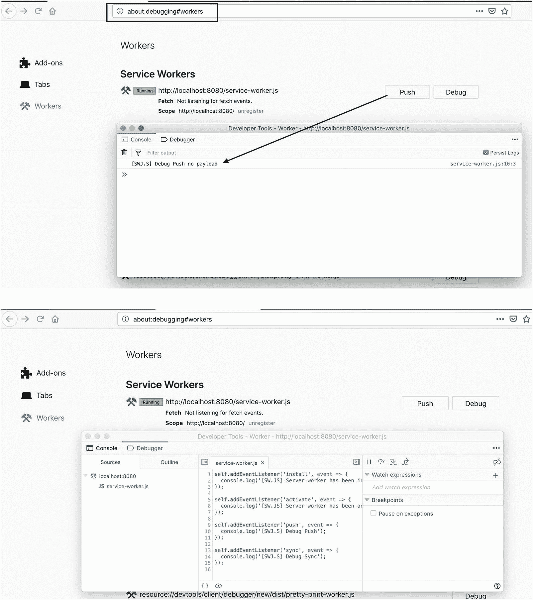
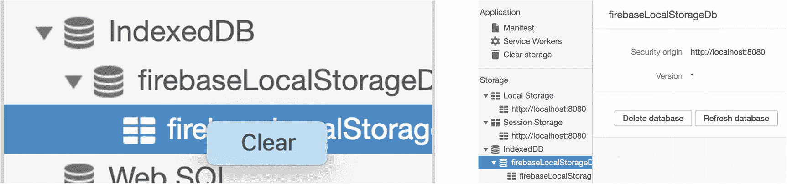
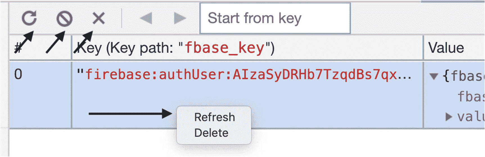
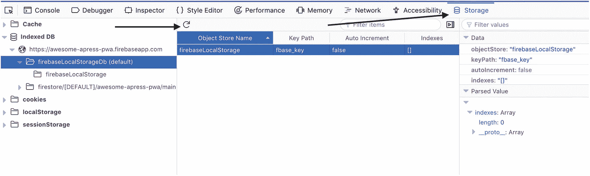
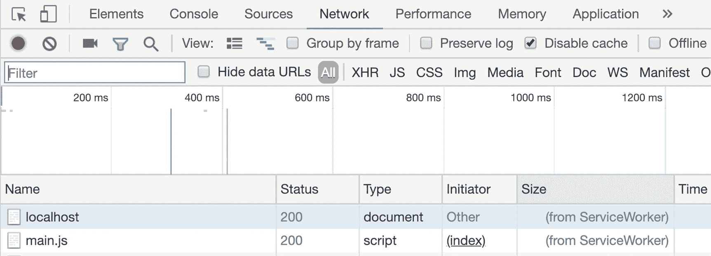
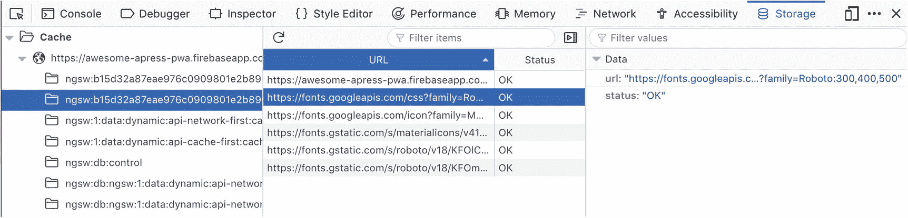
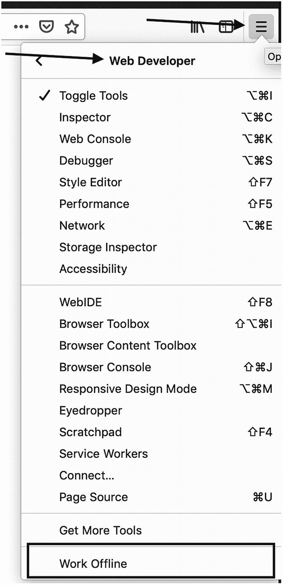
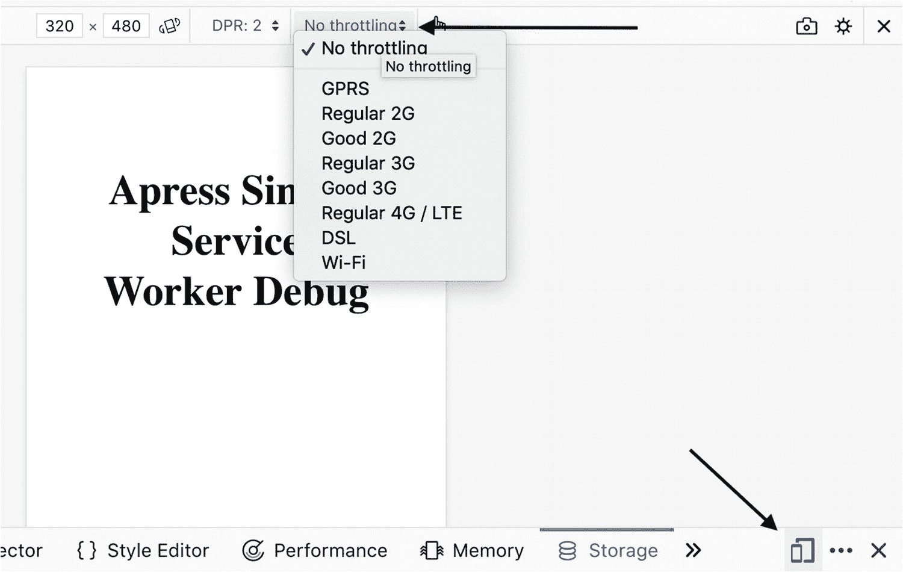

# 十、调试和测量工具

作为开发人员，我们每天都在使用调试工具，我们无法想象没有它们的编码。为了开发 PWA，我们可能需要更多的工具来帮助我们检查代码、查找 bug、运行、模拟离线模式以及测试服务工作器。为了逐步增强我们的应用，衡量不同的方面，如绩效和 PWA 标准，以及通过跟踪的参与度，似乎也很重要。

在这一章中，我将探索许多工具，这些工具将帮助我们更轻松愉快地检查、调试和开发以及测量 PWA。尽管您可能会觉得这些工具很熟悉，但我仍然希望将它们都放在一个章节中，以便您可以随时查阅。

## 排除故障

首先，让我们从研究调试的可能性开始。

### NGW 调试

Angular 服务工作器有一个特定的 URL，以便检查`ngsw`的状态。要访问它，您应该导航到`/ngsw/state`到您的网站基本 URL。

例如，如果您在本地机器上运行生产应用，您应该能够导航到`https://localhost:3000/ngsw/state`并查看信息，如下所示:

```ts
NGSW Debug Info:

Driver state: NORMAL ((nominal))
Latest manifest hash: b15d32a87eae976c0909801e2b8962df20a7deec
Last update check: 13s304u

=== Version b15d32a87eae976c0909801e2b8962df20a7deec ===

Clients: 9d63b22a-f76b-f642-aab4-e6c8e627f66a, 20e02d5b-746e-8e48-b04e-232d3a43e760, 40ccc813-b89f-5643-8e67-a6e93b688ee9

=== Idle Task Queue ===
Last update tick: 13s647u
Last update run: 8s646u
Task queue:

Debug log:
[13s638u] Error(Response not Ok (fetchAndCacheOnce): request for https://fonts.googleapis.com/icon?family=Material+Icons returned response 0 , fetchAndCacheOnce/<@https://awesome-apress-pwa.firebaseapp.com/ngsw-worker.js:589:31
fulfilled@https://awesome-apress-pwa.firebaseapp.com/ngsw-worker.js:312:52
) while running idle task revalidate(ngsw:b15d32a87eae976c0909801e2b8962df20a7deec:assets, assets): https://fonts.googleapis.com/icon?family=Material+Icons

```

这种状态可以帮助您找到有用的信息，使调试更容易。

### Web 应用清单

web 清单允许您控制应用在启动和向用户显示时的行为。除了服务工作器，它还为用户提供了添加到主屏幕选项。在第 [6](06.html) 章中，我们深入研究了 web 应用清单。

#### Chrome DevTools(铬 DevTools)

Chrome DevTools 打开后，进入 ***应用*** 面板，点击 ***清单*** 进行检查(见图 [10-1](#Fig1) )。


图 10-1

Chrome 中的清单检查器

*   若要查看清单源，请单击应用清单标签下方的链接。

*   按下**添加到主屏幕**按钮，模拟添加到主屏幕事件。在 Chrome 桌面上，它触发浏览器将应用添加到货架上。在手机上，它会提示用户安装应用(将图标添加到主屏幕)。

*   Identity 和 Presentation 部分只是以更加用户友好的方式显示来自清单源的字段。

*   图标部分显示您指定的每个图标。

#### 在线验证器

很容易找到许多也可以验证 web 应用清单的网站和在线工具，例如， [`manifest-validator.appspot.com`](http://manifest-validator.appspot.com) *。*

#### 在线发电机

有时候，生成 web 应用清单可能很耗时或者很单调。于是，在线生成器就派上了用场，比如`tomitm.github.io/appmanifest`。

### 服务工作器

服务工作器为开发人员提供了拦截网络请求和创建真正离线优先的 web 应用的惊人能力。在第 [4](04.html) 和 [5](05.html) 章节中，我们通过 Angular 服务工作器介绍了服务工作器。

#### Chrome DevTools(铬 DevTools)

打开 DevTools 并进入应用面板(见图 [10-2](#Fig2) )。点击服务工作器。


图 10-2

Chrome DevTools 中的服务工作器调试器

*   **离线**将相应标签页中的网站离线。

*   重新加载时的**更新**强制服务工作器在每次页面加载时进行更新。

*   **绕过网络**绕过服务工作器，并强制浏览器到网络获取请求的资源。

*   **更新**对指定的服务工作器执行一次性更新。

*   **Push** 模拟带有特定消息的推送通知。

*   **Sync** 模拟带有特定标签的后台同步事件。

*   **注销**注销指定的服务工作器。

*   **源**告诉你当前运行的服务工作器是什么时候安装的。如果您点击，它会将您重定向到**源**面板下的维修工人源。

*   **状态**告诉您服务工作器的状态。由于服务工作器被设计为可以在任何时候被浏览器停止和启动，我们可以使用 stop 按钮显式地停止服务工作器，这将模拟它来揭示由于对持久全局状态的错误假设而导致的错误。

*   **客户端**告诉您服务工作器的作用域的来源。

#### Firefox DevTools

`about:debugging`页面提供了与服务工作器交互的界面。`about:debugging`有几种不同的打开方式；然而，我会鼓励你打开调试器，只需在 Firefox 地址栏中输入命令。

你会看到一些选项，比如 push、debug 和 unregister，这类似于一个没有有效负载的 Chrome expect push emulate push 事件(见图 [10-3](#Fig3) )。



图 10-3

Firefox DevTools 中的服务工作器调试器

#### 服务工作器模拟

Pinterest 的工程师开发了一套工具来与服务工作器合作。 *Service Worker Mock* 是一个库，它创建了一个具有以下属性的环境，可以很容易地将 Node.js 环境转换成一个仿 Service Worker 环境，并且在您需要编写集成测试时会很有帮助。

```ts
const env = {
  // Environment polyfills
  skipWaiting: Function,
  caches: CacheStorage,
  clients: Clients,
  registration: ServiceWorkerRegistration,
  addEventListener: Function,
  Request: constructor Function,
  Response: constructor Function,
  URL: constructor Function,

  // Test helpers
  listeners: Object,
  trigger: Function,
  snapshot: Function,
};

```

服务工作器模拟的最佳使用方法是将其结果应用到全局范围，然后调用 **require('。/service-worker.js')** 与您的服务工作器文件的路径。该文件将使用全局模拟来添加事件侦听器。让我们编写一个简单的测试:

```ts
// service-worker.js
const TESTCACHE = 'TESTCACHE';
const TESTCACHE_URLS = [
  'index.html',
  './' // Alias for index.html
];

self.addEventListener('install', event => {
  console.log('[SW.JS] Server worker has been installed');
  event.waitUntil(
    caches
      .open(TESTCACHE)
      .then(cache => cache.addAll(TESTCACHE_URLS))
      .then(self.skipWaiting())
  );
});

// The activate handler takes care of cleaning up old caches.
self.addEventListener('activate', event => {
  console.log('[SW.JS] Server worker has been activated');
  const currentCaches = [TESTCACHE];
  event.waitUntil(
    caches

      .keys()
      .then(cacheNames => cacheNames.filter(cacheName => !currentCaches.includes(cacheName)))
      .then(cachesToDelete => {
        return Promise.all(cachesToDelete.map(cacheToDelete => caches.delete(cacheToDelete)));
      })
      .then(() => self.clients.claim())
  );
});

self.addEventListener('push', event => {
  console.log(
    '[SWJ.S] Debug Push',
    event.data ? event.data.text() : 'no payload'
  );
});

self.addEventListener('sync', event => {
  console.log('[SWJ.S] Debug Sync', event.tag);
});

```

我将使用`Jest`框架和`service-worker-mock`库来编写我的测试。

```ts
// service-worker.test.js
const makeServiceWorkerEnv = require('service-worker-mock');
const makeFetchMock = require('service-worker-mock/fetch');

describe('Service worker', () => {
  beforeEach(() => {
    Object.assign(
      global,
      makeServiceWorkerEnv(),
      makeFetchMock()
      // If you're using sinon ur similar you'd probably use below instead of makeFetchMock
      // fetch: sinon.stub().returns(Promise.resolve())
    );
    jest.resetModules();
  });

  it('should add listeners', () => {
    require('./service-worker.js');
    expect(self.listeners['install']).toBeDefined();

    expect(self.listeners['activate']).toBeDefined();
    expect(self.listeners['push']).toBeDefined();
    expect(self.listeners['sync']).toBeDefined();
    expect(self.listeners['fetch']).toBeUndefined();
  });

  it('should delete old caches on activate', async () => {
    require('./service-worker.js');
    // Create old cache
    await self.caches.open('OLD_CACHE');
    expect(self.snapshot().caches.OLD_CACHE).toBeDefined();
    // Activate and verify old cache is removed
    await self.trigger('activate');
    expect(self.snapshot().caches.OLD_CACHE).toBeUndefined();
  });
});

```

运行`Jest`或`npm test.`

```ts
PASS  ./service-worker.test.js
  Service worker

    ✓ should add listeners (7ms)
    ✓ should delete old caches on activate (15ms)

  console.log service-worker.js:19
    [SW.JS] Server worker has been activated

Test Suites: 1 passed, 1 total
Tests:       2 passed, 2 total

Snapshots:   0 total
Time:        0.77s, estimated 1s
Ran all test suites.

```

### 注意

克隆 [`https://github.com/mhadaily/awesome-apress-pwa.git`](https://github.com/mhadaily/awesome-apress-pwa.git) 并进入`the`第 10 章目录查看样品。`npm test`将运行测试。

### 仓库

您可能已经熟悉了许多类型的 web 存储。web 存储的标准，如本地存储、会话存储、IndexedDB(广泛使用)、Web SQL 和 Cookies，在所有主流浏览器中都可以找到。我对 IndexedDB 特别感兴趣，一般可以用在服务工作器身上。

#### Chrome DevTools(铬 DevTools)

在 DevTools 中，导航至应用选项卡(参见图 [10-4](#Fig4) )。选择 IndexedDB。


图 10-4

Chrome DevTools 中的 IndexedDB

通过右键单击对象存储，您可以找到一个清除动作，通过单击数据库名称，您可以找到删除和刷新数据库按钮，您可以在其中分别删除或刷新数据库(见图 [10-5](#Fig5) )。



图 10-5

Chrome DevTools/中的清除、刷新、删除索引数据库

您可以通过对象存储列表 UI 顶部的小操作按钮来清除和刷新对象存储。您还可以删除选定的数据。您可以通过右键单击每条数据找到刷新和删除操作(参见图 [10-6](#Fig6) )。



图 10-6

清除、刷新、删除对象存储上的索引数据库

#### Firefox DevTools

当您打开 Firefox DevTools 时，默认情况下您可能看不到存储面板。您应该从图 [10-7](#Fig7) 所示的设置中启用它。


图 10-7

从 Firefox 中的 DevTools 设置启用存储

启用后，点击存储面板，您会发现如图 [10-8](#Fig8) 所示的 IndexedDB。



图 10-8

Firefox DevTools 中的存储面板

### 躲藏

“缓存存储”窗格提供了使用缓存 API 缓存的资源的只读列表。

#### Chrome DevTools(铬 DevTools)

请注意，第一次打开缓存并向其中添加资源时，DevTools 可能不会检测到更改。重新加载页面，您应该会看到缓存。如果您打开了两个或更多缓存，您会看到它们列在缓存存储缓存存储下拉列表的下方(参见图 [10-9](#Fig9) )。


图 10-9

Chrome DevTools 中的缓存存储

当使用缓存 API 加载由服务工作器缓存存储缓存的资源时，DevTools 的网络面板显示其来自服务工作器(参见图 [10-10](#Fig10) )。



图 10-10

来自服务工作器的 Chrome DevTools 缓存存储中的网络请求

#### Firefox DevTools

如图 [10-11](#Fig11) 所示，缓存名称位于存储缓存下。



图 10-11

Firefox DevTools 中的缓存存储

当使用缓存 API 加载由服务工作器缓存存储缓存的资源时，Firefox 在网络面板中显示它被缓存(参见图 [10-12](#Fig12) )。


图 10-12

来自服务工作器的 Firefox DevTools 缓存存储中的网络请求

### 模拟脱机行为

为了验证我们的应用离线时一切按计划运行，我们需要确保我们能够模拟没有连接。

Chrome 和 Firefox 提供了一个方便的特性，我们可以利用它来模仿离线模式。

#### 铬

除了应用面板下的服务工作器中的离线复选框，我们还可以使用网络面板下的离线复选框(参见图 [10-13](#Fig13) )。


图 10-13

Chrome DevTools 网络面板下的离线模式

#### 火狐浏览器

为了在 Firefox 中启用离线模式，点击菜单图标然后点击**开发者➤离线工作**(见图 [10-14](#Fig14) )。



图 10-14

离线模式 Firefox

有时离线模拟器不能正常工作，你可能需要关闭你的网络并重新连接。例如，在我写这本书的时候，当你在 Service Worker 中使用后台同步时，你可能真的需要关闭你的互联网连接。

### 模拟不同的网络条件

在世界上的许多地方，3G 和 2G 速度是常态。此外，我们不断在各种连接状态之间移动。为了验证我们的应用对这些消费者是否有效，我们需要在不同的网络连接和设备中测试我们的应用。

在 Chrome 和 Firefox 中，我们都有一个节流选项，你可以在图 [10-15](#Fig15) 和 [10-16](#Fig16) 中找到。



图 10-16

Firefox 中的节流选项


图 10-15

Chrome 中网络选项卡下的节流选项；您可以根据需要添加自定义配置文件

### 注意

最终，Service Worker 是一个普通的 JavaScript 文件，在这里您可以使用所有的 JavaScript 调试特性，比如`Debugger`或 break point 来检查 Service Worker 内部的代码。

### 模拟移动设备

您可以在通过 USB 连接到浏览器的真实设备上运行您的 PWA，或者您可以运行仿真器并执行您的测试和检查您正在寻找的内容。

#### 远程调试和测量

要将你的 Android 设备连接到 Chrome，你可以按照这个链接上的说明:`https://goo.gl/syNfSR;`进行操作，要连接到 Firefox，你可以在这个链接上找到说明:`https://goo.gl/P7gFNE`。

#### 仿真器

要设置和运行 iOS 模拟器，请点击此链接:`https://goo.gl/ymihLs`。而对于 Android，按照这个链接上的说明:`https://goo.gl/EGPpxx`。

#### 在线工具

*BrowserStack* 是一款跨浏览器的测试工具。有了它，您可以在多个操作系统和移动设备上跨浏览器测试您的网站，而无需单独的虚拟机、设备或模拟器。BrowserStack 还提供物理设备上的远程测试，所以如果你发现自己需要在许多设备上测试你的网站性能，它可以是一个有用的时间节省器。

## 尺寸

为了逐步交付高质量的应用，从速度、性能或用户体验等不同方面来衡量我们的应用总是很重要的。在这一节中，我将探索帮助我们更好地了解我们的应用的可能性，这允许我们不断地改进我们的应用。

### 审计

如前几章所述，由 Lighthouse 支持的 Chrome DevTools 中的审计面板是我们可以用来对应用进行审计的最佳工具之一。它有不同的选项，包括性能和 PWA(见图 [10-17](#Fig17) )。


图 10-17

Chrome DevTools 审计标签中的灯塔，在这里可以选择和执行不同的审计

很可能我们会自动化我们的审计测试，或者将它添加到 CD/CI <sup>[1](#Fn1)</sup> 管道中。Lighthouse <sup>[2](#Fn2)</sup> 也可以作为节点命令行工具，也可以通过编程作为节点模块使用。

要在命令行中运行 Lighthouse，请执行以下操作:

1.  确保安装了 Chrome for Desktop and Node。

2.  安装灯塔。

    ```ts
    npm install -g lighthouse

    ```

    to run an audit

    ```ts
    lighthouse <url>

    ```

    for example

    ```ts
    lighthouse https://awesome-apress-pwa.firebaseapp.com --view

    ```

    You can see more options by running

    ```ts
    lighthouse --help

    ```

让我们看看如何以编程方式添加 Lighthouse。

#### 带有铬发射器的灯塔

我们将编写一个运行`chrome-launcher`并执行灯塔审计的例子。当您为您的应用运行一个测试时，这个测试是很有帮助的，尤其是当您想要运行多个自动化测试时。

```ts
// lighthouse-chrome-launcher.js

const lighthouse = require('lighthouse');
const chromeLauncher = require('chrome-launcher');

function launchChromeAndRunLighthouse(url, opts, config = null) {
  return chromeLauncher
    .launch({ chromeFlags: opts.chromeFlags })
    .then(chrome => {
      opts.port = chrome.port;
      return lighthouse(url, opts, config).then(results => {
        // use results.lhr for the JS-consumeable output
        // https://github.com/GoogleChrome/lighthouse/blob/master/types/lhr.d.ts
        // use results.report for the HTML/JSON/CSV output as a string
        // use results.artifacts for the trace/screenshots/other specific case you need (rarer)
        return chrome.kill().then(() => results.lhr);
      });
    });
}

const opts = {
  chromeFlags: ['--show-paint-rects'],
  onlyCategories: ['performance', 'pwa'] // you can leave it empty for all audits
};

// Usage:

launchChromeAndRunLighthouse(

  'https://awesome-apress-pwa.firebaseapp.com',
  opts
).then(results => {
  // Use results!
  console.log({
    pwa: results.categories.pwa.score,
    performance: results.categories.performance.score
  });
});

```

当您运行这个文件时，您将得到结果，并且您可以根据分数添加您的逻辑。

```ts
node lighthouse-chrome-launcher.js

```

你会明白的

```ts
{ pwa: 1, performance: 0\. 95 }

```

例如，如果某个页面在 PWA 中的得分低于 0.5，您可以退出构建并要求改进该页面。

#### 灯塔与木偶师 <sup>[3](#Fn3)</sup>

Puppeteer 是一个节点库，它提供了一个高级 API 来控制 Chrome 或 DevTools 协议上的 Chrome。默认情况下，Puppeteer 是无头运行的，但是可以配置为运行完整的(非无头)Chrome 或 Chrome。Lighthouse 和 Puppeteer 是在我们的 CD/CI 中运行审计的一个很好的组合，在那里我们不能使用 Chrome 启动器。

```ts
// lighthouse-puppeteer.js
const puppeteer = require('puppeteer');
const lighthouse = require('lighthouse');
const { URL } = require('url');
const run = async url => {
  // Use Puppeteer to launch headful Chrome and don't use its default 800x600 viewport.
  const browser = await puppeteer.launch({
    headless: true,
    defaultViewport: null
  });
  browser.on('targetchanged', async target => {
    const page = await target.page();
    function addStyleContent(content) {
      const style = document.createElement('style');
      style.type = 'text/css'; 

      style.appendChild(document.createTextNode(content));
      document.head.appendChild(style);
    }
    const css = '* {color: red}';
    if (page && page.url() === url) {
      const client = await page.target().createCDPSession();
      await client.send('Runtime.evaluate', {
        expression: `(${addStyleContent.toString()})('${css}')`
      });
    }
  });
  const { lhr } = await lighthouse(
    url,
    {
      port: new URL(browser.wsEndpoint()).port,
      output: 'json', 

      logLevel: 'error',
      chromeFlags: ['--show-paint-rects'],
      onlyCategories: ['performance', 'pwa']
    },
    {
      extends: 'lighthouse:default'
    }
  );
  await browser.close();
  return {
    pwa: lhr.categories.pwa.score,
    performance: lhr.categories.performance.score
  };
};

run('https://awesome-apress-pwa.firebaseapp.com').then(res => console.log(res));

```

然后，您可以运行该文件:

```ts
node lighthouse-puppeteer.js

```

你会明白的

```ts
{ pwa: 1, performance: 0.96 }

```

### 分析学

PWAs 允许应用提供以前不可能的功能:例如，向页面添加离线行为或允许用户从主屏幕启动网站。

通常，我们对三个事件感兴趣:

*   添加到主屏幕:这将允许我们了解用户对浏览器提示的反应，并且根据用户的选择，我们可以知道服务对用户有多大价值。

*   从主屏幕运行:在主屏幕上添加图标只是第一步。了解将我们的服务添加到主屏幕如何影响用户参与度将是有益的。

*   离线浏览量频率:这使我们能够跟踪有多少用户在离线时访问服务。

#### 跟踪主屏幕提示

我们将使用`beforeinstallprompt`事件来跟踪有多少用户被要求将网站添加到他们的主屏幕上，他们会做出什么决定，基于此，我们将向我们的跟踪系统发送信息:例如，谷歌分析。

打开`AddToHomeScreenService`

```ts
public showPrompt() {
    if (this.deferredPrompt) {
      // will show prompt
      this.deferredPrompt.prompt();

      // Wait for the user to respond to the prompt
      this.deferredPrompt.userChoice.then(choiceResult => {
        // outcome is either "accepted" or "dismissed"
        if (choiceResult.outcome === 'accepted') {
          // User accepted the A2HS prompt
          // send data to analytics
          // do whatever you want
          this.sendToAnalytics(choiceResult.userChoice);
        } else {
          // User dismissed the A2HS prompt
          // send data to analytics
          // do whatever you want
          this.sendToAnalytics(choiceResult.userChoice);
        }

        // we don't need this event anymore

        this.deferredPrompt = null;
        this.deferredPromptFired$.next(false);
      });
    }
  }

  public sendToAnalytics (userChoice) {
     // for example, send data to Google Analytics, you can create another service
    // or you may use a library to send this event to Google Analytics
   // ga('send', 'event', 'A2H', userChoice);
    console.log(userChoice);
    this.deferredPromptFired$.next(false);
  }

```

#### 从主屏幕跟踪会话

跟踪从主屏幕启动的会话的最可靠的方法之一是在我们的应用清单上为`start_url`添加一个定制的查询参数。例如，如果你正在使用谷歌分析，你可以添加自定义活动参数。<sup>[4](#Fn4)T4】</sup>

通常，有五个参数可以添加到您的 URL 中:

*   标识广告客户、网站、出版物等。，这是发送流量到你的财产:例如，谷歌，newsletter4，广告牌。

*   `utm_medium`:广告或营销媒体:例如，cpc、横幅、电子邮件简讯。

*   `utm_campaign`:个人活动名称、口号、促销代码等。，对于一个产品来说。

*   `utm_term`:识别付费搜索关键词。如果您正在手动标记付费关键词活动，您也应该使用`utm_term`来指定关键词。

*   `utm_content`:用于区分同一广告中的相似内容或链接。例如，如果您在同一封电子邮件中有两个行动号召链接，您可以使用`utm_content`并为每个链接设置不同的值，这样您就可以知道哪个版本更有效。

举个例子:

```ts
// manifest.json
{ ...
  "background_color": "#fafafa",
  "display": "standalone",
  "scope": "/",
  "//": "Append tracking parameters to start_url",
  "start_url": "/?utm_source=homescreen",
  "icons": [
    {
      "src": "assets/icons/icon-72x72.png",
      "sizes": "72x72",
      "type": "image/png"
    },
...
}

```

要查看活动报告:

1.  登录谷歌分析。

2.  导航到您的视图。

3.  打开报告。

4.  选择收购➤活动。

您可以根据需要使用其他跟踪系统，使用相同的机制来创建您想要的东西。

#### 跟踪离线浏览量

在写这本书的时候，Angular Service Worker 中还没有实现的解决方案。

`Workbox`正在为离线浏览量跟踪提供支持。在第 [13](13.html) 和 [14](14.html) 章中，我们将实现这个模块，看看它是如何工作的。

### 在线工具

webpagetest.org[**是衡量绩效的常用工具。你会在这里找到深入的文档:**](http://webpagetest.org) **[`sites.google.com/a/webpagetest.org/docs`](http://sites.google.com/a/webpagetest.org/docs) 。**

web.dev/measure 是谷歌的一个新工具，帮助像你一样的开发者学习并应用网络的现代功能到你自己的网站和应用中。

### 真实设备

最后但同样重要的是，不要忘记真实设备测试，并根据您的分析系统在普通设备或访问量最大的设备上测量您的应用性能和行为。为了在真实世界中看到应用，有必要对真实设备进行概述。

## 摘要

在本章中，我们讨论了调试和测量 PWA 的最简便的工具。然而，事情不会总是这么顺利。在下一章中，我将揭示一些可能性，表明如果你的应用和服务工作器出错，你仍然能够生存。

<aside class="FootnoteSection" epub:type="footnotes">Footnotes [1](#Fn1_source)

持续交付，持续集成。

  [2](#Fn2_source)

[T2`https://developers.google.com/web/tools/lighthouse`](https://developers.google.com/web/tools/lighthouse)

  [3](#Fn3_source)

无头 Chrome 节点 API [`https://pptr.dev`](https://pptr.dev) `.`

  [4](#Fn4_source)

[T2`https://support.google.com/analytics/answer/1033863%3Fhl%3Den`](https://support.google.com/analytics/answer/1033863%253Fhl%253Den)

 </aside>