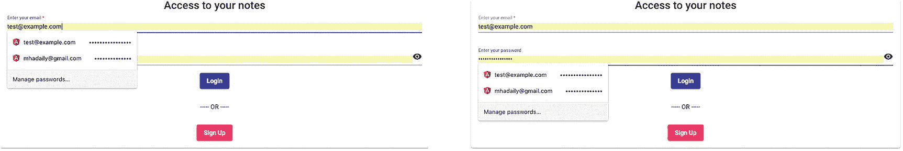
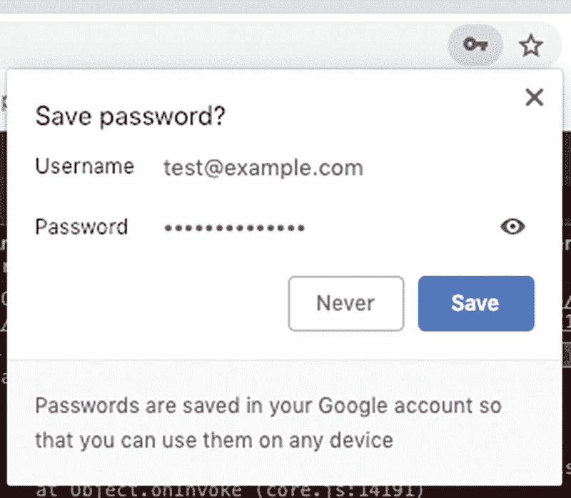
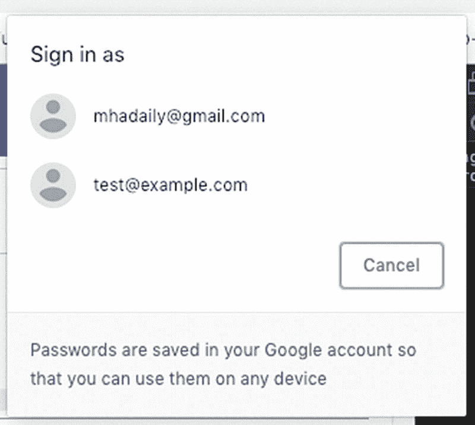
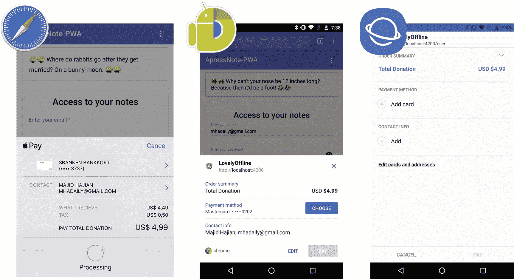
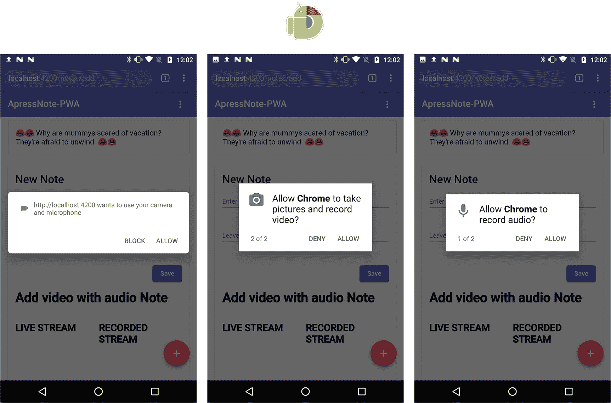
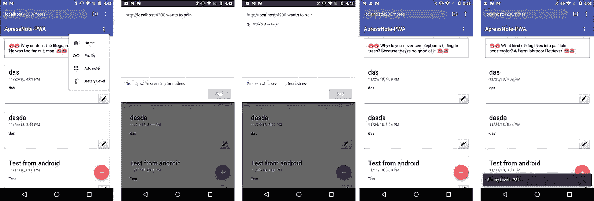
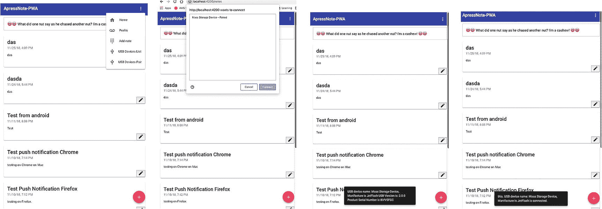

# 十二、现代 Web APIs

如果我告诉您，您可以构建一个 web 应用，连接到支持蓝牙低能耗的设备，并从您的 web 应用控制它，会怎么样？如果用户的登录凭证安全地保存在浏览器中，并且当用户访问网站时，他们会自动登录，会怎么样？如果登录 web 应用需要通过 USB 连接的设备来验证用户身份，该怎么办？如果我可以通过浏览器中的 JavaScript API 访问本地平台上的共享选项会怎么样？我知道你现在可能在想什么；但是，即使这些在 10 年前听起来像是梦想，今天它们中的大多数都是可以实现的，或者至少接近成为现实。

在过去的十年里，网络的大部分已经发生了显著的变化。新的 web APIs 允许开发人员通过蓝牙和 USB 将 web 应用连接到硬件。在线支付从未像今天这样简单。单点登录和无密码解决方案以最小的努力带来了更好的用户体验。通过跨所有设备和操作系统的相同 API 开发跨平台非常困难，而今天，这是开发和构建 web 应用的一种非常愉快的方式，尤其是渐进式 Web 应用(pwa ),因为许多新的 API 已经标准化，在我们的浏览器中提供了高级 JavaScript API，以访问平台的底层 API。

在这一章中，我选择了一些新技术和 API 来探索和集成 PWA note 应用，如凭据管理、支付请求、地理定位、媒体流、Web 蓝牙和 Web USB。我将确保这些 API 的基础知识将被涵盖。但是，您可能需要根据您的需要和要求为您的应用开发额外的。

此外，我建议密切关注 Web 共享、Web VR/AR、后台获取、可访问性改进、Web 组装以及更多正在开发或考虑中的新标准，这些标准将增强 Web 的能力，尤其是通过构建 PWA。

## 凭证管理

凭证管理 API 是一个基于承诺的标准浏览器 API，它通过提供网站和浏览器之间的接口来促进跨设备的无缝登录。该 API 允许用户通过帐户选择器使用一个标签登录，并帮助在浏览器中存储凭据，从而可以在设备之间同步。这有助于已经登录到一个浏览器的用户，如果他们使用同一个浏览器，他或她可以继续登录到所有其他设备。

该 API 不仅支持本机浏览器密码管理，还可以提供来自联合身份提供者的凭据信息。它的意思是:任何被网站信任来正确验证用户身份并为此提供 API 的实体都可以成为这个 API 中的提供者，以存储凭据并在必要时检索凭据。例如，Google Account、GitHub、Twitter、脸书或 OpenID Connect 都是联合身份提供者框架的例子。

请记住，这个 API 只有在来源安全的情况下才能工作；换句话说，类似于 PWA，你的网站必须在 HTTPS 上运行。

让我们开始在 Angular 项目中实现，看看它是如何工作的。

首先，我们将创建一个名为`CredentialManagementService` `,`的服务，并导入到我的`CoreModule`中。

```ts
declare const PasswordCredential: any;
declare const FederatedCredential: any;
declare const navigator: any;
declare const window: any;

@Injectable({
  providedIn: 'root'
})
export class CredentialManagementService {
  isCredentialManagementSupported: boolean;

  constructor(private snackBar: SnackBarService) {
    if (window.PasswordCredential || window.FederatedCredential) {
      this.isCredentialManagementSupported = true;
    } else {
      this.isCredentialManagementSupported = false;
      console.log('Credential Management API is not supported in this browser');
    }
  }

  async store({ username, password }) {
    if (this.isCredentialManagementSupported) {
      // You can either pass the passwordCredentialData as below
      // or simply pass down your HTMLFormElement. A reference to an HTMLFormElement with appropriate input fields.
      // The form should, at the very least, contain an id and password

.
      // It could also require a CSRF token.
      /*
        <form id="form" method="post">
          <input type="text" name="id" autocomplete="username" />
          <input type="password" name="password" autocomplete="current-password" />
          <input type="hidden" name="csrf_token" value="*****" />
        </form>
        <script>
            const form = document.querySelector('#form');
            const credential = new PasswordCredential(form);
      // if you have a federated provider
       const cred = new FederatedCredential({
         id: id,
         name: name,
         provider: 'https://account.google.com',
         iconURL: iconUrl
             });
        <script>
      */
      // Create credential object synchronously.
      const credential = new PasswordCredential({
        id: username,
        password: password
        // name: name,
        // iconURL: iconUrl
      });
      const isStored = await navigator.credentials.store(credential);
      if (isStored) {
        this.snackBar.open('You password and username saved in your browser');
      }
    }
  }

  async get() {
    if (this.isCredentialManagementSupported) {
      return navigator.credentials.get({
        password: true,
        mediation: 'silent'
        // federated: {
        //   providers: ['https://accounts.google.com'] 

        // },
      });
    }
  }

  preventSilentAccess() {
    if (this.isCredentialManagementSupported) {
      navigator.credentials.preventSilentAccess();
    }
  }

}

```

该服务有三个方法，基本上是主要凭证 API 方法的包装器，用于检查 API 在浏览器中是否可用。让我们来分解服务:

1.  服务初始化时的**功能检测**，以确保该 API 可用。

    ```ts
    if (window.PasswordCredential || window.FederatedCredential) {}

    ```

1.  `store`方法:
    1.  接受用户名和密码，因此我们可以创建一个密码凭据，并将其存储在凭据中。`PasswordCredential`构造函数接受`HTMLFormElement`和一个基本字段的对象。如果您想通过`HTMLFormElement`，请确保您的表单至少包含一个 ID 和密码以及 CSRF 令牌。在方法中，调用 ID 为的构造函数，它是用户名和密码。`name`和`iconURL,`分别是正在登录的用户的名字和用户的头像图像，可选。请记住，如果该功能可用，我们将运行此代码；否则，我们让用户正常使用应用。

        因为我们正在构建 PWA，所以为那些选择的浏览器不支持正在使用的功能的用户提供替代方案总是很重要的。

    2.  如果你打算使用第三方登录，你必须调用带有`id`和`provider`端点的`FederatedCredential`构造函数。

    3.  凭证 API 在 navigator 上可用，存储函数是基于承诺的，通过调用它，我们可以在浏览器中保存用户凭证。

    4.  最后，我们向用户显示一条消息，通知他们我们将他们的密码存储在浏览器中。

2.  `get`方法:

    在特征检测被检查后，我们通过传入配置如`password`来调用`navigation.credentials`上的`get`，`mediation. Mediation`定义了我们想要如何告诉浏览器向用户显示账户选择器，它有三个值:`optional, required,`和`silent`。当中介为`optional`时，在调用了`navigator.credentials.preventSilentAccess()`之后，用户会被明确地显示一个帐户选择器来登录。这通常是为了确保在用户选择退出或注销后不会自动登录。

    一旦`navigator.credentials.get()`解决了，它返回一个`undefined`或者一个`credential object`。要确定它是一个`PasswordCredential`还是一个`FederatedCredential`，只需查看对象的`type`属性，它将是`password`或`federated`。如果`type`是联合的，那么`provider`属性是一个表示身份提供者的字符串。

3.  `preventSilentAccess`方法:

    我们称之为`preventSilentAccess() on navigator.credentials.`,这将确保自动登录不会发生，直到用户下次启用自动登录。要恢复自动登录，用户可以通过从帐户选择器中选择他们希望登录的帐户来选择有意登录。然后，用户总是重新登录，直到他们明确注销。

为了继续使用`UserContainerComponent`，我们将首先注入这个服务，然后定义我的`autoSignIn`方法，并在`signup`和`login`方法上调用`ngOnInit.`方法，我们将从`credential service`调用存储方法来保存和更新用户凭证。

最后，当用户注销时，我们需要调用`preventSilentAccess()`。看起来是这样的:

```ts
  constructor(
    private credentialManagement: CredentialManagementService,
    private fb: FormBuilder,
    private auth: AuthService,
    private snackBar: SnackBarService
  ) {}

  ngOnInit() {
    this.createLoginForm();
    if (!this.auth.authenticated) {
      this.autoSignIn();
    }
  }

  private async autoSignIn() {
    const credential = await this.credentialManagement.get();

    if (credential && credential.type === 'password') {
      const { password, id, type } = credential;
      const isLogin = await this._loginFirebase({ password, email: id });
      if (isLogin) {
      // make sure to show a proper message to the user
        this.snackBar.open(`Signed in by ${id} automatically!`);
      }
    }
  }

  public signUp() {
    this.checkFormValidity(async () => {
      const signup = await this.auth.signUpFirebase(this.loginForm.value);
      const isLogin = await this.auth.authenticateUser(signup);
      if (isLogin) {
        const { email, password } = this.loginForm.value;
        this.credentialManagement.store({ username: email, password });
      }
    });
  }

  public login() {
    this.checkFormValidity(async () => {
      const { email, password } = this.loginForm.value;
      const isLogin = this._loginFirebase({ email, password });
      if (isLogin) {
        this.credentialManagement.store({ username: email, password });
      }
    });
  }

  public logOut() {
    this.auth

      .logOutFirebase()
      .then(() => {
        this.auth.authErrorMessages$.next(null);
        this.auth.isLoading$.next(false);
        this.auth.user$.next(null);
        // prevent auto signin until next time user login explicity
        // or allow us for auto sign in

        this.credentialManagement.preventSilentAccess();
      })
      .catch(e => {
        console.error(e);
        this.auth.isLoading$.next(false);
        this.auth.authErrorMessages$.next(
          'Something is wrong when signing out!'
        );
      });
  }

```

### 注意

克隆 [`https://github.com/mhadaily/awesome-apress-pwa.git`](https://github.com/mhadaily/awesome-apress-pwa.git) ，进入 [12 章](12.html)，01-凭证-管理-api 文件夹，找到所有样本代码。

使用登录表单上的`autocomplete`属性来帮助浏览器正确识别字段也是一个很好的实践(图 [12-1](#Fig1) )。



图 12-1

自动完成属性允许浏览器为网站显示适当的用户名和密码

```ts
   <input
          matInput
          placeholder="Enter your email"
          autocomplete="username"
          formControlName="email"
          required
        />
<input
          matInput
          autocomplete="current-password"
          placeholder="Enter your password"
          [type]="hide ? 'password' : 'text'"
          formControlName="password"
        />

```

我们在新的浏览器中运行该应用，然后我们将转到登录页面，通过输入我的凭据登录到网站。您将看到一条提示消息，要求用户在浏览器中保存凭证(参见图 [12-2](#Fig2) )。



图 12-2

web 应用希望在浏览器中保存凭据时的凭据提示

为了测试我的`auto sign-in`，我们将打开一个新的干净的浏览器并进入登录页面，然后我们将注意到我们被重定向到笔记列表，并出现一条`snackbar`消息，显示我们已自动登录(见图 [12-3](#Fig3) )。


图 12-3

网站 snackbar 消息和自动登录后来自浏览器本身的消息

最后，中介`optional`或`required`将显示一个帐户选择器提示，允许用户选择他们所选择的帐户，特别是如果他们保存了多个帐户(参见图 [12-4](#Fig4) )。



图 12-4

中介是可选还是必需的帐户选择器

### 浏览器支持

到写这本书的时候，桌面和安卓的 Chrome，安卓浏览器，桌面和移动的 Opera，三星互联网浏览器都支持这个 API 目前正在考虑将其用于 Firefox。MS Edge 正在向 Chromium 平台迁移，这个 API 应该很快就会被覆盖。

## 付款申请

很有可能我们所有阅读这本书的人都在网上支付过——至少一次。所以我们都知道填写结帐表格是多么的耗时和无聊，尤其是如果它有不止一个步骤的话。

支付请求标准 API 是由 W3C 开发的，旨在确保消费者和商家的在线支付系统保持一致和顺畅。这不是一种新的支付方式；相反，这是一种旨在简化结账过程的方式。

有了这个 API，当消费者想要选择诸如送货地址、信用卡、联系方式等支付细节时，他们总能看到一个原生平台 UI。想象一下，一旦您在浏览器中保存了所有信息，您就可以在每个支持该 API 的结账页面中重用它们。这将是多么愉快的体验:忽略结帐表单中许多字段的填写、信用卡信息等等。相反，我们将看到保存的信息与熟悉的本地用户界面一致。只需几次点击或标签选择，它就完成了！

这种 API 的另一个优势是接受从各种处理程序到 web 的不同支付方式，并且相对容易集成:例如，Apple Pay、Samsung Pay、Google Pay。

长话短说，我准备在 PWA 笔记 app 里增加一个捐款按钮。

首先，我们将在 Angular 中创建一个名为`WebPaymentService`的服务，并在`CoreModule`中导入它。

```ts
export class WebPaymentService {
  public isWebPaymentSupported: boolean;
  private requestPayment = null;
  private canMakePaymentPromise: Promise<boolean> = null;

  private supportedPaymentMethods = [
    {
      // support credit card payment
      supportedMethods: 'basic-card',
      data: {
        supportedNetworks: ['visa', 'mastercard', 'amex'],
        supportedTypes: ['credit', 'debit']
      }
    }

  // Apple pay, Google Pay, Samasung pay, Stripe and others can be added here too.
 ];

// just an example of a simple product details

  private paymentDetails: any = {
    total: {
      label: 'Total Donation',
      amount: { currency: 'USD', value: 4.99 }
    },
    displayItems: [
      {
        label: 'What I recieve',
        amount: { currency: 'USD', value: 4.49 }
      },
      {
        label: 'Tax',
        amount: { currency: 'USD', value: 0.5 }
      }
    ]
  };

  private requestPaymentOptions = {
    requestPayerName: true,
    requestPayerPhone: false,
    requestPayerEmail: true,
    requestShipping: false
    shippingType: 'shipping'
  };

  constructor() {
    if (window.PaymentRequest) {
      // Use Payment Request API which is supported
      this.isWebPaymentSupported = true;
    } else {
      this.isWebPaymentSupported = false;
    }
  }

  constructPaymentRequest() {
    if (this.isWebPaymentSupported) {
      this.requestPayment = new PaymentRequest(
        this.supportedPaymentMethods,
        this.paymentDetails,
        this.requestPaymentOptions
      );

// ensure that user have a supported payment method if not you can do other things

      if (this.requestPayment.canMakePaymentPromise) {
        this.canMakePaymentPromise = this.requestPayment.canMakePayment();
      } else {
        this.canMakePaymentPromise = Promise.resolve(true);
      }
    } else {
      // do something else for instance redirect user to normal checkout
    }
    return this;
  }

  async show(): Promise<any> {
/*  you can make sure client has a supported method already if not do somethig else. For instance, fallback to normal checkout, or let them to add one active card */
    const canMakePayment = await this.canMakePaymentPromise;

    if (canMakePayment) {
      try {
        const response = await this.requestPayment.show();
        // here where you can process response payment with your backend
        // there must be a backend implementation too.
        const status = await this.processResponseWithBackend(response);

        // after backend responsed successfully, you can do any other logic here
        // complete transaction and close the payment UI
        response.complete(status.success);
        return status.response;
      } catch (e) {
        //  API Error or user closed the UI
        console.log('API Error or user closed the UI');
        return false;
      }
    } else {
      // Fallback to traditional checkout for example
      // this.router.navigateByUrl('/donate/traditional');
    }
  }

  async abort(): Promise<boolean> {
    return this.requestPayment.abort();
  }

  // mock backend response
  async processResponseWithBackend(response): Promise<any> {
    // check with backend and respond accordingly
    return new Promise(resolve => {
      setTimeout(() => {
        resolve({ success: 'success', response });
      }, 1500);
    });
  }
}

```

我们来分解一下。

1.  一如既往，渐进增强的特征检测。

    ```ts
    if (window.PaymentRequest) {
          this.isWebPaymentSupported = true;
        } else {
          this.isWebPaymentSupported = false;
        }

    ```

2.  对于每次支付，您需要构造一个接受三个参数的`PaymentRequest`。

    ```ts
    new PaymentRequest(
            this.supportedPaymentMethods,
            this.paymentDetails,
            this.requestPaymentOptions
          );

    ```

3.  定义`supportedPaymentMethods` `,`，它是所有支持的支付方式的数组。在代码示例中，我刚刚定义了一个基本卡；然而，在本章的示例代码中，您会发现更多的方法，如 Apple Pay、Google Pay 和 Samsung Pay。你并不局限于它们；您可以实现任何受欢迎的方法，如 PayPal、Stripe 等支持该 API 的方法。

    ```ts
    private supportedPaymentMethods = [
        {
          // support credit card payment
          supportedMethods: 'basic-card',
          data: {
           // you can add more such as discover, JCB and etc.
            supportedNetworks: ['visa', 'mastercard', 'amex'],
            supportedTypes: ['credit', 'debit']
          }
        },
    ]

    ```

    这个数组中的每个对象都有特定于方法本身的`supportedMethods`和`data`属性。为了更好地理解，我也将提供一个 Apple Pay 对象作为示例:

    ```ts
    {
          supportedMethods: 'https://apple.com/apple-pay',
          data: {
            version: 3,
            merchantIdentifier: 'merchant.com.example',
            merchantCapabilities: ['supports3DS', 'supportsCredit', 'supportsDebit'],
            supportedNetworks: ['amex', 'discover', 'masterCard', 'visa'],
            countryCode: 'US'
          }
        },

    ```

4.  In Define `paymentDetails` , for instance, in my example, I have a fixed donation number; however, you may have a cart page with different products and other details that need to be added to payment details accordingly.

    ```ts
    private paymentDetails: any = {
        total: {
          label: 'Total Donation',
          amount: { currency: 'USD', value: 4.99 }
        },
        displayItems: [
          {
            label: 'What I recieve',
            amount: { currency: 'USD', value: 4.49 }
          },
          {
            label: 'Tax',
            amount: { currency: 'USD', value: 0.5 }
          }
        ]
      };

    ```

    主要有两个属性:`total`表示总金额；和显示购物车商品的数组`displayItems,`。

5.  Define `requestPaymentOptions` is optional; however, you may find it very useful for different purposes – for instance, if a shipping address is required or email must be provided.

    ```ts
      private requestPaymentOptions = {
        requestPayerName: true,
        requestPayerPhone: false,
        requestPayerEmail: true,
        requestShipping: false,
        shippingType: 'shipping'
      };

    ```

    在本例中，我们只要求付款人提供电子邮件和姓名。

6.  最后但同样重要的是，我们在`requestPayment`上展示了 call show 方法，以便显示付款本地提示页面。

    ```ts
    async show(): Promise<any> {
        const canMakePayment = await this.canMakePaymentPromise;
        if (canMakePayment) {
          try {
            const response = await this.requestPayment.show();
            const status = await this.processResponseWithBackend(response);
            response.complete(status.success);
            return status.response;
          } catch (e) {
            return false;
          }
        }
      }

    ```

在`requestPayment`上有另一个基于承诺的方法叫做`canMakePayment()`，它本质上是一个助手，在`show()`被调用之前，确定用户是否有一个支持的支付方法来进行支付。它可能不在所有用户代理中；因此，我们需要进行特征检测。

然后，一旦用户完成，我们就调用`show()` `,`，Promise 将通过用户的选择细节得到解析，包括联系信息、信用卡、运费等等。现在是用后端验证和处理付款的时候了。

打开`header.component.html()`并添加以下按钮(见图 [12-5](#Fig5) ):


图 12-5

触发付款的捐赠按钮本机 UI

```ts
  <button mat-menu-item (click)="donateMe()" *ngIf="isWebPaymentSupported">
    <mat-icon>attach_money</mat-icon>
    <span>Donate</span>
  </button>

```

最后，将`WebPaymentService`注入`header.component.ts`。应该定义`donateMe()`方法，一旦解决了这个问题，它将调用`requestPayment`并向用户显示适当的消息。

```ts
public isWebPaymentSupported: boolean;

  constructor(
    private webPayment: WebPaymentService,
  ) {
    this.isWebPaymentSupported = this.webPayment.isWebPaymentSupported;
  }

async donateMe() {
    const paymentResponse = await this.webPayment
      .constructPaymentRequest()
      .show();

    if (paymentResponse) {
      this.snackBar.open(
        `Successfully paid, Thank you for Donation ${paymentResponse.payerName}`
      );
    } else {
      // this.snackBar.open('Ops, sorry something went wrong with payment');
    }
  }

```

我们将构建应用，并在浏览器和手机中运行和测试(见图 [12-6](#Fig6) 和 [12-7](#Fig7) )。



图 12-7

Safari、Chrome 和三星互联网浏览器中的 Apple pay 显示原生支付 UI


图 12-6

支付原生用户界面，Chrome，Mac

### 注意

克隆 [`https://github.com/mhadaily/awesome-apress-pwa.git`](https://github.com/mhadaily/awesome-apress-pwa.git) ，进入 [13 章](13.html)，02-请求-支付-api 文件夹，找到所有样本代码。

### 浏览器支持

在撰写本书时，几乎所有主流浏览器都支持这个 API，不管是在产品中还是在桌面和移动设备的夜间版本中，尽管它们也可能部分支持。

## 视频和音频捕捉

Media Streams 是一个与 WebRTC 相关的 API，它提供对流式音频和视频数据的支持。这个 API 已经存在一段时间了。新的基于承诺的`getUserMedia()`是一个请求用户允许麦克风和摄像头的方法；因此，您将可以访问实时流。

在本节中，我们将向“添加笔记”页面添加一个新功能，用户可以在其中将带有音频的交互式视频保存到他们的笔记中。

请注意，在本例中，我们不会将此视频发送到服务器，但是实现将准备好与后端通信，以便在需要时保存视频和音频。

在`notes-add.component.html`中，我们将添加以下 html 片段:

```ts
<div class="media-container" *ngIf="isMediaRecorderSupported">
      <h1>Add video with audio Note</h1>
      <div class="videos">
        <div class="video">
          <h2>LIVE STREAM</h2>
          <video #videoOutput autoplay muted></video>
        </div>
        <div class="video">
          <h2>RECORDED STREAM</h2>
          <video #recorded autoplay loop></video>
        </div>
      </div>
      <div class="buttons">
        <button mat-raised-button color="primary" (click)="record()" *ngIf="disabled.record" > Start Recording</button>
        <button mat-raised-button color="primary" (click)="stop()" *ngIf="disabled.stop"> Stop Recording </button>
        <button mat-raised-button color="secondary" (click)="play()" *ngIf="disabled.play"> Play Recording</button>
        <button mat-raised-button color="primary" (click)="download()" *ngIf="disabled.download">  Download Recording </button>
        <a #downloadLink href="">Download Link</a>
      </div>
    </div>

```

这段代码非常简单明了。我们将逻辑添加到`notes-add.component.ts:`

```ts
export class NotesAddComponent {
  @ViewChild('videoOutput') videoOutput: ElementRef;
  @ViewChild('recorded') recordedVideo: ElementRef;
  @ViewChild('downloadLink') downloadLink: ElementRef;

  public disabled = { record: true, stop: false, play: false, download: false };
  public userID;
  public errorMessages$ = new Subject();
  public loading$ = new Subject();
  public isMediaRecorderSupported: boolean;
  private recordedBlobs;
  private liveStream: any;
  private mediaRecorder: any;

  constructor(
    private router: Router,
    private data: DataService,
    private snackBar: SnackBarService
  ) {
    if (window.MediaRecorder) {
      this.isMediaRecorderSupported = true;
      this.getStream();
    } else {
      this.isMediaRecorderSupported = false;
    }
  }

  async getStream() {
    try {
      const stream = await navigator.mediaDevices.getUserMedia({
        audio: true,
        video: true
      });
      this.handleLiveStream(stream);
    } catch (e) {
      this.isMediaRecorderSupported = false;
      this.onSendError('No permission or something is wrong');
      return 'No permission or something is wrong';
    }
  }

  handleLiveStream(stream) {
    this.liveStream = stream;
    this.videoOutput.nativeElement.srcObject = stream;
  }

  getMediaRecorderOptions() {
    let options = {
      mimeType: 'video/webm;codecs=vp9',
      audioBitsPerSecond: 1000000, // 1 Mbps
      bitsPerSecond: 1000000, // 2 Mbps
      videoBitsPerSecond: 1000000 // 2 Mbps
    };
    if (!MediaRecorder.isTypeSupported(options.mimeType)) {
      console.log(`${options.mimeType} is not Supported`);
      options = { ...options, mimeType: 'video/webm;codecs=vp8' };
      if (!MediaRecorder.isTypeSupported(options.mimeType)) {
        console.log(`${options.mimeType} is not Supported`);
        options = { ...options, mimeType: 'video/webm' };
        if (!MediaRecorder.isTypeSupported(options.mimeType)) {
          console.log(`${options.mimeType} is not Supported`);
          options = { ...options, mimeType: " };
        }
      }
    }
    return options;
  }

  record() {
    this.recordedBlobs = [];
    this.disabled = { play: false, download: false, record: false, stop: true };
    this.mediaRecorder = new MediaRecorder(
      this.liveStream,
      this.getMediaRecorderOptions
    );
    this.mediaRecorder.ondataavailable = e => {
      {
        if (e.data) {
          this.recordedBlobs.push(e.data);
        }
      }
    };
    this.mediaRecorder.start();
    console.log('MediaRecorder started', this.mediaRecorder);
  }

  stop() {
    this.disabled = { play: true, download: true, record: true, stop: false };
    this.mediaRecorder.onstop = e => {
      this.recordedVideo.nativeElement.controls = true;
    };
    this.mediaRecorder.stop();
  }

  play() {
    this.disabled = { play: true, download: true, record: true, stop: false };
    const buffer = new Blob(this.recordedBlobs, { type: 'video/webm' });
    this.recordedVideo.nativeElement.src = window.URL.createObjectURL(buffer);
  }

  download() {
    const blob = new Blob(this.recordedBlobs, { type: 'video/webm' });
    const url = window.URL.createObjectURL(blob);
    this.downloadLink.nativeElement.url = url;
    this.downloadLink.nativeElement.download = `recording_${new Date().getTime()}.webm`;
    this.downloadLink.nativeElement.click();
    setTimeout(() => {
      window.URL.revokeObjectURL(url);
    }, 100);
  }

  onSaveNote(values) {
    this.data.addNote(values).then(
      doc => {
        this.snackBar.open(`LOCAL: ${doc.id} has been succeffully saved`);
      },
      e => {
        this.errorMessages$.next('something is wrong when adding to DB');
      }
    );
    this.router.navigate(['/notes']);
  }

  onSendError(message) {
    this.errorMessages$.next(message);
  }
}

```

这段代码很简单。一如既往，这是对`MediaRecorder,`的功能检测，如果浏览器支持，我们将继续向用户展示这一功能，并将初始化`getUserMedia()`；因此，我们请求音频和视频许可，如图 [12-8](#Fig8) 所示。


图 12-8

浏览器请求摄像头和麦克风的权限

一旦许可被授予，Promise 得到解决，流将是可访问的(见图 [12-9](#Fig9) )。当用户点击标签“开始记录”按钮时，`MediaRecorder`构造器被调用，带有实时流数据和已经定义的选项。

我们将每个 blob 存储在一个数组中，直到调用`stop()`方法。一旦录制停止，媒体就可以播放了。通过点击“play”按钮，我们将简单地创建一个流数组的流缓冲区，通过创建一个`Blob URL`，我们将把它分配给一个< `video>`标签的`src`。



图 12-9

请求获得在 Android mobile 上访问视频和音频的权限

哒哒，现在视频直接在浏览器里播放了。我们还可以制作该视频的下载版本(见图 [12-10](#Fig10) )。


图 12-10

实时流和录制回放

通过选项卡或单击“下载”按钮，我们将从一个数组`recordedBlob`创建一个 Blob，然后将创建一个`URL`并将我在模板中用`display: none`定义的< `a>`标签分配给它，然后调用`click()`来强制浏览器为用户打开下载模式，以便询问他们该文件必须保存在系统的什么位置。

### 注意

克隆 [`https://github.com/mhadaily/awesome-apress-pwa.git`](https://github.com/mhadaily/awesome-apress-pwa.git) 并转到章节 [12](12.html) ，03-camera-and-microphone-api 文件夹找到所有示例代码。

### 浏览器支持

在写这本书的时候，Opera，Chrome，和 Firefox 在桌面上；Android 上的 Chrome 和三星互联网支持大多数标准规格。微软 Edge 也在考虑这个 API。它也适用于 Safari 12 / iOS 12。我相信 API 的未来是光明的。

## 地理定位

地理位置 API 提供用户的位置坐标，并将其公开给 web 应用。出于隐私原因，浏览器会请求许可。这种基于承诺的 API 已经存在很长时间了。你甚至可能已经开始使用它了。

我们将通过创建一个名为`GeolocationService`的服务来探索这个 API，您可以在`modules/core/geolocation.service.ts.`下找到它

```ts
export interface Position {

  coords: {
    accuracy: number;
    altitude: number;
    altitudeAccuracy: number;
    heading: any;
    latitude: number;
    longitude: number;
    speed: number;
  };
  timestamp: number;

}

@Injectable()
export class GeolocationService {
  public isGeoLocationSupported: boolean;

  private geoOptions = {
    enableHighAccuracy: true, maximumAge: 30000, timeout: 27000
  };

  constructor() {
    if (navigator.geolocation) {
      this.isGeoLocationSupported = true;
    } else {
      // geolocation is not supported, fall back to other options
      this.isGeoLocationSupported = false;
    }
  }

  getCurrentPosition(): Observable<Position> {
    return Observable.create(obs => {
      if (navigator.geolocation) {
        navigator.geolocation.getCurrentPosition(
          position => {
            obs.next(position);
            obs.complete();
          },
          error => {
            obs.error(error);
          }
        );
      }
    });
  }

  watchPosition(): Observable<Position> {
    return Observable.create(obs => {
      if (navigator.geolocation) {
        navigator.geolocation.watchPosition(
          position => {
            obs.next(position);
          },
          error => {
            obs.error(error);
          },
          this.geoOptions
        );
      }
    });
  }

}

```

我们来分解一下。

1.  像往常一样，确保地理位置的特征检测是可用的。

2.  定义`getCurrentPosition()` `,`我要把`geolocation.getCurrentPosition()`回调转换成可观察的。

3.  定义`watchPosition()` `,`我们对`geolocation.watchPosition()`做同样的事情，把它的回调变成可观察的。

4.  我们已经定义了地理定位方法提供的位置接口。

我想做的是为每个笔记添加用户坐标，以在保存时保持位置。因此，我们可以稍后使用第三方地图供应器(如 Google Map)显示用户笔记的坐标或确切地址。由于我们正在保存所有的坐标数据，因此我们将能够根据应用的需要，在后端甚至在前端使用第三方地图提供程序将这种坐标转换为有意义的地址。

目前，为了保持简洁，我们只向用户显示当前的纬度和经度。

首先，我们将地理定位服务注入到`NotesAddComponent`中，然后我们将调用`getCurrentPosition()`并将它赋给我的本地`location$`变量，在这里我们将位置`object`转换成简单的`string`。

```ts
public isGeoLocationSupported = this.geoLocation.isGeoLocationSupported;
public location$: Observable<string> = this.geoLocation
    .getCurrentPosition()
    .pipe(map(p =>
        `Latitude:${p.coords.latitude}
        Longitude:${p.coords.longitude}`
        ));

  constructor(
    private router: Router,
    private data: DataService,
    private snackBar: SnackBarService,
    private geoLocation: GeolocationService
  ) {}

```

最后，添加下面的 html 片段，其中我们使用了带有`async`管道的`location`$ observable；然而，我们首先使用`*ngIf`检查地理定位是否可用(参见图 [12-11](#Fig11) 中的权限对话框)。


图 12-11

浏览器要求位置许可

```ts
    <h4 *ngIf="isGeoLocationSupported">You location is {{ location$ | async }}</h4>

```

一旦用户允许，浏览器将提供每个方法调用的协调数据(见图 [12-12](#Fig12) )。


图 12-12

Android 上的地理位置许可对话框；一旦它被解决，协调显示

### 注意

克隆 [`https://github.com/mhadaily/awesome-apress-pwa.git`](https://github.com/mhadaily/awesome-apress-pwa.git) ，进入第 [12 章](12.html)，04-地理定位-api 文件夹，找到所有样本代码。

### 浏览器支持

所有主流浏览器都支持这种 API，根据统计，这种 API 覆盖了全球 93%的市场。com 网站。 <sup>[1](#Fn1)</sup>

### 蓝牙 Web

这种基于承诺的 API 是一种新技术，通过 web 为物联网开辟了一个新时代。它允许 web 应用连接到蓝牙低能耗(BLE)设备。

想象一下，开发一个 PWA，我们能够访问蓝牙并控制智能家电、健康配件等设备，只需在不同平台的所有浏览器上保持 web API 的一致性。

请记住，该 API 仍在开发中，将来可能会略有变化。我推荐 GitHub 上的以下实现状态文档。 <sup>[2](#Fn2)</sup>

在我们继续之前，我建议学习蓝牙低能耗(BLE)和通用属性配置文件(GATT) <sup>[3](#Fn3)</sup> 工作原理的基础知识。

在本节中，我们使用 Android 上的 BLE 外设模拟器 <sup>[4](#Fn4)</sup> 应用模拟 BLE 设备，并将我的 PWA note 应用与该设备配对，以便接收电池电量。我们所做的是:

1.  已安装 BLE 外围设备模拟器应用

2.  选择要广告的电池服务

3.  保持屏幕打开，将电池电量调到 73

我们开始吧。

首先，我们将创建我的`WebBluetoothService`并将其导入到`CoreModule`中。

```ts
@Injectable()
export class WebBluetoothService {
  public isWebBluetoothSupported: boolean;
  private GATT_SERVICE_NAME = 'battery_service';
  private GATT_SERVICE_CHARACTERISTIC = 'battery_level';

  constructor() {
    if (navigator.bluetooth) {
      this.isWebBluetoothSupported = true;
    }
  }

  async getBatteryLevel(): Promise<any> {
    try {
       // step 1, scan for devices and pair
      const device = await navigator.bluetooth.requestDevice({
        // acceptAllDevices: true
        filters: [{ services: [this.GATT_SERVICE_NAME] }]
      });
      // step 2: connect to device
      const connectedDevice = await this.connectDevice(device);
      // step 3 : Getting Battery Service
      const service = await this.getPrimaryService(connectedDevice, this.GATT_SERVICE_NAME);
      // step 4: Read Battery level characterestic
      const characteristic = await this.getCharacteristic(service, this.GATT_SERVICE_CHARACTERISTIC);
      // step 5: ready battery level
      const value = await characteristic.readValue();
      // step 6: return value
      return `Battery Level is ${value.getUint8(0)}%`;
    } catch (e) {
      console.error(e);
      return `something is wrong: ${e}`;
    }
  }

  private connectDevice(device): Promise<any> {
    return device.gatt.connect();
  }

  private getPrimaryService(connectedDevice, serviceName): Promise<any> {
    return connectedDevice.getPrimaryService(serviceName);
  }

  private getCharacteristic(service, characterestic): Promise<any> {
    return service.getCharacteristic(characterestic);
  }
}

```

这项服务很简单。我们遵循以下步骤:

1.  检测`bluetooth`是否可用。

2.  使用适当的配置调用`requestDevice()`,我们要求浏览器过滤并显示我们感兴趣的内容。可能存在要求检查所有设备的选项；然而，就电池健康而言，不建议这样做。

    为了使服务简单，我们静态定义了 GATT 服务名称和特征。

3.  出现提示模式时，尝试连接到设备。

4.  调用`getPrimaryService()`获取电池服务。

5.  通过调用`getCharacteristic(),`，我们将要求`battery_level.`

6.  一旦特征被解析，我们将读取该值。

虽然这是一个非常简单的设备，文档也很清晰，但看起来有点复杂和混乱。你使用这些类型的设备和技术越多，你就能越好地理解这一切。

您只能要求浏览器通过单击或点击按钮来发现设备；因此，我们将在`header.component.html`中的菜单下添加一个按钮，并用`ngIf`确保该按钮在受支持时出现。

```ts
  <button mat-menu-item (click)="getBatteryLevel()" *ngIf="isWebBluetoothSupported">
    <mat-icon>battery_unknown</mat-icon>
    <span>Battery Level</span>
  </button>

```

最后，我将在`header.component.ts,`中定义我的`getBatteryLevel`方法，该方法仅在所有承诺都解决后显示电池电量信息(见图 [12-13](#Fig13) )。

```ts
async getBatteryLevel() {
    const level = await this.bluetooth.getBatteryLevel();
    this.snackBar.open(level);
  }

```

### 注意

克隆 [`https://github.com/mhadaily/awesome-apress-pwa.git`](https://github.com/mhadaily/awesome-apress-pwa.git) ，进入 [12 章](12.html)，05-web-bluetooth-api 文件夹，找到所有样本代码。

上面的例子展现了从 BLE 设备读取的可能性；但是，将 <sup>[5](#Fn5)</sup> 写入蓝牙特性，订阅 <sup>[6](#Fn6)</sup> 接收 GATT 通知也是另外一种情况。



图 12-13

Web Bluetooth API:配对一个设备，读取一个特征，并在所有承诺完成后显示一条消息

The example above unfolds read possibilities from a BLE device; however, writing

我们已经回顾了网络蓝牙的基础知识，希望它能让你开始使用这项令人敬畏的网络技术。

我的社区朋友 Wassim Chegham 为 Web Bluetooth 提供了一个很棒的 Angular 库，带有 Observable API，您可以通过运行以下命令进行安装:

```ts
npm i -S @manekinekko/angular-web-bluetooth @types/web-bluetooth

```

在 GitHub [`https://github.com/manekinekko/angular-web-bluetooth`](https://github.com/manekinekko/angular-web-bluetooth) 上找到文档。

### 浏览器支持

在我写这本书的时候，支持这种 API 的浏览器是 Chrome 桌面，适用于 Windows 和 Mac，以及 Android、Samsung internet 和 Opera。我希望在未来，尤其是当你正在阅读这一节的时候，会有更多的浏览器支持 Web 蓝牙 API。

### USB web

这种基于承诺的 API 提供了一种安全的方式，通过使用 JavaScript 高级 API 的浏览器将 USB 设备暴露给 web。这仍然是一个相对较新的 API，可能会随着时间的推移而改变，实现是有限的，并且会报告一些错误。

默认情况下，Web USB API 需要 HTTPS，与 Web 蓝牙类似，它必须通过用户手势(如触摸或鼠标点击)来调用。类似于键盘和鼠标的设备不能被这个 API 访问。

我相信 Web USB 打开了一扇新的窗口，它为学术目的、学生、制造商和开发者带来了很多机会。想象一下，这不是一个可以直接访问 USB 板的在线开发工具，也不是需要编写原生驱动程序的制造商；相反，他们将能够开发一个跨平台的 JavaScript SDK。想象一个硬件支持中心，他们可以通过自己的网站直接访问我的设备并进行诊断或调试。我们可以统计越来越多的案例研究；然而，我应该提到，这项技术仍在发展中，即使不是现在，也将是未来网络的一个令人兴奋的特性。的确，网络是惊人的；不是吗？

说得够多了，让我们开始探索 API 吧。为了简单起见，并让您了解 Web USB 是如何工作的，我们将连接我的“创见笔驱动器”，一旦连接上，我将显示一条消息，其中显示包括“序列号”在内的硬件信息

首先，我编写一个名为`WebUSBService`的服务，并导入到`CoreModule`。

```ts
@Injectable()
export class WebUSBService {
  public isWebUSBSupported: boolean;

  constructor(private snackBar: SnackBarService) {
    if (navigator.usb) {
      this.isWebUSBSupported = true;
    }
  }

  async requestDevice() {
    try {
      const usbDeviceProperties = { name: 'Transcend Information, Inc.', vendorId: 0x8564 };
      const device = await navigator.usb.requestDevice({ filters: [usbDeviceProperties] });
      // await device.open();
      console.log(device);
      return `
      USB device name: ${device.productName}, Manifacture is ${device.manufacturerName}
      USB Version is: ${device.usbVersionMajor}.${device.usbVersionMinor}.${device.usbVersionSubminor}
      Product Serial Number is ${device.serialNumber}
      `;
    } catch (error) {
      return 'Error: ' + error.message;
    }
  }

  async getDevices() {
    const devices = await navigator.usb.getDevices();
    devices.map(device => {
      console.log(device.productName); // "Mass Storage Device"
      console.log(device.manufacturerName); // "JetFlash"
      this.snackBar.open(
        `this. USB device name: ${device.productName}, Manifacture is ${device.manufacturerName} is connected.`
      );
    });
  }
}

```

让我们来分解一下:

1.  功能检测以确保“usb”可用。

2.  定义`requestDevice`方法，它调用`navigator.usb.requestDevice()`。我需要通过`vendorID`明确过滤我的 USB 设备。我没有神奇地想出供应商的十六进制数；我所做的就是在这个列表中搜索并找到我的设备名‘创见’[http://www . Linux-USB . org/USB . ids](http://www.linux-usb.org/usb.ids)。

3.  定义`getDevices`方法，它调用`navigator.usb.getDevices()`；解析后，它将返回连接到源的设备列表。

我们在`header.component.html` `,`中添加了两个按钮，点击后分别调用`getDevices()`和`requestDevice()`方法。

```ts
  <button mat-menu-item (click)="getUSBDevices()" *ngIf="isWebUSBSupported">
    <mat-icon>usb</mat-icon>
    <span>USB Devices List</span>
  </button>
  <button mat-menu-item (click)="pairUSBDevice()" *ngIf="isWebUSBSupported">
    <mat-icon>usb</mat-icon>
    <span>USB Devices Pair</span>
  </button>

```

将`WebUSBService`注入`header.component.ts`。如果`isWebUSBSupported`为`true`，确保按钮可见。

```ts
constructor(private webUsb: WebUSBService) {
        this.isWebUSBSupported = this.webUsb.isWebUSBSupported;
}

  getUSBDevices() {
    this.webUsb.getDevices();
  }

  async pairUSBDevice() {
    const message = await this.webUsb.requestDevice();
    this.snackBar.open(message);
  }

```

点击“USB 设备配对”，会出现一个列表，显示我的设备，我可以进行配对(参见图 [12-14](#Fig14) )。



图 12-14

调用`requestDevice()`时基于过滤器选项的列表中的设备。配对后，根据逻辑，会出现一条消息，显示设备信息，如序列号、设备名称、制造商、USB 版本等。设备连接后，就可以传入和传出数据了。

配对成功完成后，设备就可以打开，数据可以传入传出。

例如，下面是一个设备与之通信的示例:

```ts
              await device.open();
              await device.selectConfiguration(1) // Select configuration #1
              await device.claimInterface(0) // Request exclusive control over interface #0
              await device.controlTransferOut({
                      "recipient": "interface",
                      "requestType": "class",
                      "request": 9,
                     "value": 0x0300,
                    "index": 0 })
             const result = await device.transferIn(8, 64); // Ready to receive data7
          // and you need to read the result...

```

该信息特定于每个设备。然而，这些方法是浏览器中的 API。

一般来说，Web USB API 提供所有端点类型的 USB 设备:

*   **中断传输:**

通过调用`transferIn(endpointNumber, length)`和`transferOut(endpointNumber, data)`用于典型的非周期性小型设备“启动”通信

*   **控制权转移:**

通过调用`controlTransferIn(setup, length)`和`controlTransferOut(setup, data)`用于命令和状态操作

*   **批量转账:**

用于通过调用 t `ransferIn(endpointNumber, length)`和`transferOut(endpointNumber, data)`发送到打印机的大量数据，如打印作业

*   **同步传输:**

用于连续和周期性数据，如通过调用`isochronousTransferIn(endpointNumber, packetLengths)`和`isochronousTransferOut(endpointNumber, data, packetLengths)`的音频或视频流

最后但并非最不重要的一点是，用户可能会将设备与系统连接或断开。有两个事件可以监听并据此采取行动。

```ts
      navigator.usb.onconnect = event => {
        // event.device will bring the connected device
        // do something here
        console.log('this device connected again: ' + event.device);
      };

      navigator.usb.ondisconnect = event => {
        // event.device will bring the disconnected device
        // do something here
        console.log('this device disconnected: ', event.device);
      };

```

在 Chrome 中调试 USB 更容易，有了内部页面`chrome://device-log`，你可以在一个地方看到所有与 USB 设备相关的事件。

### 注意

克隆 [`https://github.com/mhadaily/awesome-apress-pwa.git`](https://github.com/mhadaily/awesome-apress-pwa.git) ，进入第 [12 章](12.html)，06-web-usb-api 文件夹，找到所有样本代码。

### 浏览器支持

在写这本书的时候，支持这个 API 的浏览器是 Chrome For desktop 和 Android 以及 Opera。虽然 API 正在迅速发展，但我希望我们很快能在浏览器中看到更好的支持。

## 摘要

在这一章中，我们刚刚探索了六个 web APIs。虽然它们不是 PWA 的重要组成部分，但它们有助于构建更接近原生应用的应用。

正如我在这一章的介绍中所写的，这些并不是唯一出现在 web 上的新 API。还有许多其他的正在开发中或考虑很快开发出来。

我对 web 开发的未来感到非常兴奋，因为我可以看到它将如何在我们面前打开无数的机会，来构建和发布一个更好的 web 应用。

<aside class="FootnoteSection" epub:type="footnotes">Footnotes [1](#Fn1_source)

[T2`https://caniuse.com/#search=geolocation`](https://caniuse.com/%2523search%253Dgeolocation)

  [2](#Fn2_source)

[T2`https://github.com/WebBluetoothCG/web-bluetooth/blob/master/implementation-status.md`](https://github.com/WebBluetoothCG/web-bluetooth/blob/master/implementation-status.md)

  [3](#Fn3_source)

[T2`https://www.bluetooth.com/specifications/gatt/generic-attributes-overview`](https://www.bluetooth.com/specifications/gatt/generic-attributes-overview)

  [4](#Fn4_source)

在 Google Play 商店搜索“BLE 外设模拟器”。

  [5](#Fn5_source)

[T2`https://www.bluetooth.com/specifications/gatt/viewer?attributeXmlFile=org.bluetooth.characteristic.heart_rate_control_point.xml`](https://www.bluetooth.com/specifications/gatt/viewer%253FattributeXmlFile%253Dorg.bluetooth.characteristic.heart_rate_control_point.xml)

  [6](#Fn6_source)

[T2`https://www.bluetooth.com/specifications/gatt/viewer?attributeXmlFile=org.bluetooth.characteristic.heart_rate_measurement.xml&u=org.bluetooth.characteristic.heart_rate_measurement.xml`](https://www.bluetooth.com/specifications/gatt/viewer%253FattributeXmlFile%253Dorg.bluetooth.characteristic.heart_rate_measurement.xml&u%253Dorg.bluetooth.characteristic.heart_rate_measurement.xml)

  [7](#Fn7_source)

[https://beyond logic . org/USB nutshell/us B4 . shtml](https://beyondlogic.org/usbnutshell/usb4.shtml)

 </aside>