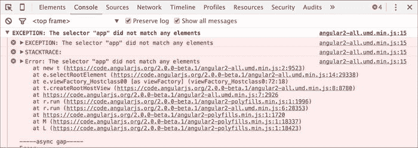
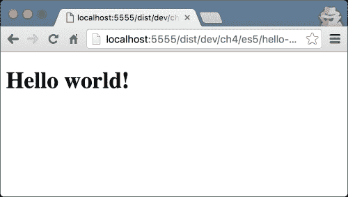
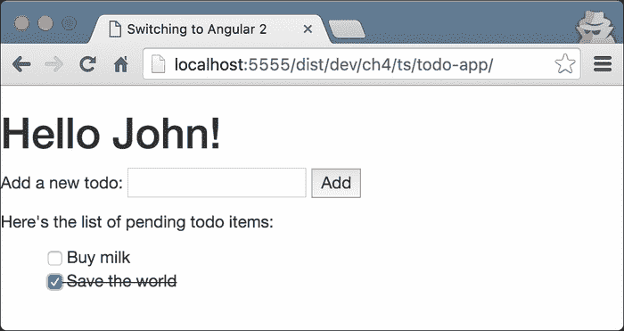
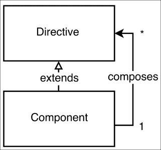

# 四、Angular 2 组件和指令入门

至此，您已经熟悉 Angular 2 为单页应用开发提供的核心构建块以及它们之间的关系。然而，通过介绍 Angular 概念背后的一般思想以及用于定义这些概念的基本语法，我们只触及了表面。在本章中，我们将深入探讨 Angular 2 的组件和指令。

在以下各节中，我们将介绍这些主题：

*   Angular 2 为开发应用提供的构建块关注点的强制分离。
*   与 DOM 交互时指令或组件的适当使用。
*   内置指令和开发自定义指令。
*   深入了解组件及其模板。
*   内容投影。
*   查看子项与内容子项。
*   组件的生命周期。
*   使用模板引用。
*   配置 Angular 的更改检测。

# 你好，世界！角度 2 的应用

现在，让我们在 2 中构建我们的第一个“Hello world！”应用！为了让一切尽可能简单、快速地启动和运行，对于我们的第一个应用，我们将使用 ECMAScript 5 语法和 Angular 2 的 Transpile 包。首先，创建具有以下内容的`index.html`文件：

```ts
<!-- ch4/es5/hello-world/index.html -->

<!DOCTYPE html>
<html lang="en">
<head>
  <meta charset="UTF-8">
  <title></title>
</head>
<body>
  <script src="https://code.angularjs.org/2.0.0-beta.9/angular2-polyfills.min.js"></script>
  <script src="https://code.angularjs.org/2.0.0-beta.9/Rx.umd.min.js"></script>
  <script src="https://code.angularjs.org/2.0.0-beta.9/angular2-all.umd.min.js"></script>
  <script src="./app.js"></script>
</body>
</html>
```

前面的[T5]HTML 文件定义了我们页面的基本结构。在关闭[T0]标记之前，我们引用了四个脚本文件：框架所需的[T1]（包括 ES2015[T2]、[T3]等）、[T4]、Angular 2 的 ES5 包，以及包含我们将要构建的应用的文件。

### 注

`RxJS`是 Angular 的核心使用的，以允许我们在应用中增强反应式编程范式。在下面的内容中，我们将仅对我们如何利用可见光做一个简单的介绍。有关更多信息，您可以访问位于[的`RxJS`GitHub 存储库 https://github.com/Reactive-Extensions/RxJS](https://github.com/Reactive-Extensions/RxJS) 。

在您的`index.html`所在的同一目录中，创建一个名为`app.js`的文件，并在其中输入以下内容：

```ts
// ch4/es5/hello-world/app.js

var App = ng.core.Component({
  selector: 'app',
  template: '<h1>Hello {{target}}!</h1>'
})
.Class({
  constructor: function () {
    this.target = 'world';
  }
});

ng.platform.browser.bootstrap(App);
```

在前面的代码片段中，我们定义了一个名为`App`的组件，其中包含一个`app`选择器。此选择器将匹配应用范围内模板中的所有应用元素。该组件具有以下模板：

```ts
'<h1>Hello {{target}}!</h1>'
```

这个语法应该已经在 AngularJS 1.x 中熟悉了。当在给定组件的上下文中编译时，前面的代码段将在花括号内插入带有表达式结果的模板。在我们的例子中，表达式只是`target`变量。

向`Class`传递一个 object literal，它有一个名为`constructor`的方法。此 DSL 提供了一种在 ECMAScript 5 中定义类的替代方法。在`constructor`函数体中，我们添加了一个名为`target`的属性，其值为`"world"`字符串。在代码片段的最后一行中，我们调用`bootstrap`方法，以`App`作为根组件初始化应用。

注意`bootstrap`位于`ng.platform.browser`下方。这是因为该框架是为不同的平台构建的，例如浏览器、NativeScript 等。通过将不同平台使用的`bootstrap`方法放在一个单独的名称空间下，Angular 2 可以实现不同的逻辑来初始化应用，还可以包括不同的提供者集和特定于平台的指令。

现在，如果你用浏览器打开`index.html`，你会看到一些错误，如下图所示：



发生这件事是因为我们错过了一件非常重要的事情。我们没有在`index.html`中的任何地方使用根组件。为了完成应用，请在 body 元素的 open 标记后添加以下 HTML 元素：

```ts
<app></app>
```

现在，您可以刷新浏览器以查看以下结果：



### 注

**使用 TypeScript**

尽管我们已经有一个 Angular 2 应用在运行，但我们可以做得更好！我们没有使用任何包管理器或模块加载器。我们花了[第三章](3.html#PNV61-a118c4c18dd64e8ab73e171b466b6582 "Chapter 3. TypeScript Crash Course")*TypeScript 速成课*的全部时间，谈论 TypeScript；但是，在前面的应用中，我们没有编写一行。虽然不需要将 TypeScript 与 Angular 2 一起使用，但是利用静态类型提供的所有好处非常方便。

# 建立我们的环境

Angular 的核心团队为 Angular 2 开发了一个全新的 CLI 工具，它允许我们`bootstrap`通过几个命令来运行我们的应用。虽然我们将在最后一章中介绍它，但为了提高我们的学习体验，我们将使用位于[的代码 https://github.com/mgechev/switching-to-angular2](https://github.com/mgechev/switching-to-angular2) 。它包含了本书中的所有示例，并允许我们快速`bootstrap`我们的 Angular 2 应用（您可以在[第 5 章](5.html#1LCVG1-a118c4c18dd64e8ab73e171b466b6582 "Chapter 5. Dependency Injection in Angular 2")、*Angular 2 中的依赖注入*中了解更多关于如何快速开始使用 Angular 2 开发 web 应用的信息）。它具有`package.json`中声明的所有必需依赖项，基本 gulp 任务的定义，例如开发服务器、将 TypeScript 代码转换为 ECMAScript 5、实时重新加载等。我们接下来的例子将以它为基础。

为了设置`switching-to-angular2`项目，您需要在计算机上安装并运行 Git、Node.js v5.x.x 和 npm。如果您安装了不同版本的 Node.js，我建议您看看 nvm（Node.js 版本管理器，可在[上找到）https://www.npmjs.com/package/nvm](https://www.npmjs.com/package/nvm) 或 n（[https://www.npmjs.com/package/n](https://www.npmjs.com/package/n) ）。使用这些工具，您将能够在您的机器上拥有多个版本的 Node.js，并通过命令行通过单个命令在它们之间切换。

## 安装我们的项目存储库

让我们从建立`switching-to-angular2`项目开始。打开终端并输入以下命令：

```ts
# Will clone the repository and save it to directory called
# switching-to-angular2
git clone https://github.com/mgechev/switching-to-angular2.git
cd switching-to-angular2
npm install

```

第一行将`switching-to-angular2`项目克隆到名为`switching-to-angular2`的目录中。

在能够运行 seed 项目之前的最后一步是使用 npm 安装所有必需的依赖项。此步骤可能需要一段时间，具体取决于您的 Internet 连接，因此请耐心等待，不要中断。如果您遇到任何问题，请毫不犹豫地在[处提出问题 https://github.com/mgechev/switching-to-angular2/issues](https://github.com/mgechev/switching-to-angular2/issues) 。

最后一步是启动开发服务器：

```ts
npm start 

```

当传输过程完成时，您的浏览器将自动打开此 URL:[T0]。现在，您将看到一个类似于以下屏幕截图所示的视图：


# 玩 Angular 2 和 TypeScript

现在，让我们来玩玩我们已经有的文件吧！导航至`switching-to-angular2`内的`app/ch4/ts/hello-world`目录。然后，打开`app.ts`并用以下代码片段替换其内容：

```ts
// ch4/ts/hello-world/app.ts

import {Component} from 'angular2/core';
import {bootstrap} from 'angular2/platform/browser';

@Component({
  selector: 'app',
  templateUrl: './app.html'
})
class App {
  target: string;
  constructor() {
    this.target = 'world';
	}
}

bootstrap(App);
```

让我们逐行看一看代码：

```ts
import {Component} from 'angular2/core';
import {bootstrap} from 'angular2/platform/browser';
```

最初，我们从`angular2/core`模块导入`@Component`装饰器，从`angular2/platform/browser`模块导入`bootstrap`功能。后来我们用`@Component`来装饰`App`课。我们将几乎相同的对象文本传递给`@Component`装饰器，我们在应用的 ECMAScript 5 版本中使用了该对象文本，通过这种方式，我们为组件定义了 CSS 选择器。

作为下一步，我们定义组件的视图。但是，请注意，在本例中，我们使用`templateUrl`而不是简单地内联组件的模板。

打开`app.html`并将文件内容替换为`<h1>Hello {{target}}!</h1>`。`app.html`的内容应该与我们之前使用的内联模板相同。由于我们可以通过内联模板（使用[T3]）和设置其 URL（[T4]）来使用模板，因此该组件的 API 与 AngularJS 1.x 指令 API 非常相似。

在代码片段的最后一行，我们通过提供根组件来`bootstrap`应用。

## 深入索引

现在，让我们看一下以了解启动应用时发生的情况：

```ts
<!-- ch4/ts/hello-world/index.html -->
<!DOCTYPE html>
<html lang="en">
<head>
  <meta charset="utf-8">
  <meta http-equiv="X-UA-Compatible" content="IE=edge">
  <title><%= TITLE %></title>
  <meta name="description" content="">
  <meta name="viewport" content="width=device-width, initial-scale=1">
  <!-- inject:css -->
  <!-- endinject -->
</head>
<body>
  <app>Loading...</app>
  <!-- inject:js -->
  <!-- endinject -->
  <%= INIT %>
</body>
</html>
```

请注意，在页面主体内部，我们使用了包含文本节点内容的`app`元素，`"Loading…"`位于页面内部。`"Loading…"`标签将一直可见，直到应用启动并呈现主组件。

### 注

【插入内容】模板中有特定的模板。它们不是特定于角度的，而是为了防止由于它们之间的共享结构而在附于本书的代码样本中出现代码重复。要查看此特定 HTML 文件是如何转换的，请打开`/dist/dev/ch4/ts/hello-world/index.html`。

# 使用角度 2 指令

我们已经构建了简单的“Hello world！”应用。现在，让我们开始构建更接近实际应用的东西。在本节结束时，我们将有一个简单的应用，它列出了我们需要做的许多事情，并在页面的页眉处向我们致意。

让我们从开发`app`组件开始。我们需要对上一个示例进行两个修改，将`target`属性重命名为`name`，并将`todos`列表添加到组件的控制器定义中：

```ts
// ch4/ts/ng-for/detailed-syntax/app.ts

import {Component} from 'angular2/core';
import {bootstrap} from 'angular2/platform/browser';

@Component({
  selector: 'app',
  templateUrl: './app.html',
})
class App {
  todos: string[];
  name: string;
  constructor() {
    this.name = 'John';
    this.todos = ['Buy milk', 'Save the world'];
  }
}
bootstrap(App);
```

剩下的唯一一件事就是更改模板以使用提供的数据。我们已经熟悉 AngularJS 1.x 中的[T0]指令。它允许我们使用 microsyntax 循环项目列表，稍后由 AngularJS 1.x 解释。然而，该指令没有足够的语义，因此很难构建执行静态代码分析并帮助我们改进开发经验的工具。由于`ng-repeat`指令非常有用，Angular 2 采纳了这一想法并进一步改进，以便通过在其上引入进一步的语义来允许更复杂的工具。它允许 IDE 和文本编辑器执行更好的静态代码分析。这种支持将防止我们在编写的代码中出现拼写错误，并使我们拥有更流畅的开发体验。

在`app.html`中增加以下内容：

```ts
<!-- ch4/ts/ng-for/detailed-syntax/app.html -->

<h1>Hello {{name}}!</h1>
<p>
  Here's a list of the things you need to do:
</p>
<ul>
  <template ngFor var-todo [ngForOf]="todos">
    <li>{{todo}}</li>
  </template>
</ul>
```

### 注

`template`元素是一个我们可以保存标记并确保它不会被浏览器呈现的地方。如果我们需要将应用的模板直接嵌入到页面的标记中，并让我们稍后使用的模板引擎来处理它们，那么这非常有用。在当前示例中，这意味着如果 Angular 2 DOM 编译器不处理 DOM 树，我们将在屏幕上看到的所有元素都是没有任何列表项的[T1]、[T2]元素和[T3]元素。

现在，刷新浏览器后，您应该会看到以下结果：


到目前为止，一切都很好！在前面的代码片段中只剩下我们不熟悉的`template`元素的属性，如`ngFor`、`var-todo`和`[ngForOf]`。让我们看看它们。

## ngFor 指令

`ngFor`指令是一个指令，它允许我们在一组项目上循环，并执行`ng-repeat`在 AngularJS 1.x 中所做的事情，但它带来了一些额外的语义。注意，`ngForOf`属性被括号包围。起初，这些括号可能看起来像是无效的 HTML。但是，根据 HTML 规范，允许在属性名称中使用它们。W3C 验证器唯一要抱怨的是`template`元素不拥有这样的属性；但是，浏览器在处理标记时不会有问题。

这些括号背后的语义是，它们所包围的属性的值是一个表达式，需要对其进行计算。

# 改进了指令语法的语义

在[第 1 章](1.html#E9OE1-a118c4c18dd64e8ab73e171b466b6582 "Chapter 1. Getting Started with Angular 2")*Angular 2*入门中，我们提到了 Angular 2 中改进工装的机会。AngularJS 1.x 中的一个大问题是我们使用指令的不同方式。这需要了解属性值，属性值可以是文字、表达式、回调或微语法。Angular 2 通过引入一些内置于框架中的简单约定来消除此问题：

*   `propertyName="value"`
*   `[propertyName]="expression"`
*   `(eventName)="handler()"`

在第一行中，`propertyName`属性接受字符串文字作为值。Angular 不会进一步处理属性的值；它将按照在模板中设置的方式使用它。

第二种语法`[propertyName]="expression"`提示 Angular 2 属性的值应该作为表达式处理。当 Angular 2 找到一个被方括号包围的属性时，它将在与模板关联的组件上下文中解释表达式。简而言之，如果我们想将非字符串值或表达式的结果设置为给定属性的值，我们需要使用这种语法。

最后一个示例显示了如何绑定到事件。`(eventName)="handler()"`背后的语义是，我们希望处理所有被称为`eventName`的事件，这些事件由具有`handler()`表达式的给定组件触发。

我们将在本章后面讨论更多的例子。

### 注

Angular 提供了另一种规范语法，它允许我们在不使用括号的情况下定义元素的绑定。例如，可以使用以下代码表示属性绑定：

```ts
<input [value]="foo">
```

也可以用以下公式表示：

```ts
<input bind-value="foo">
```

类似地，我们可以用以下代码表示事件绑定：

```ts
<button (click)="handle()">Click me</button>
```

它们也可以用以下公式表示：

```ts
<button on-click="handle()">Click me</button>
```

## 在模板内声明变量

前面模板剩下的最后一个是`var-todo`属性。我们使用这种语法告诉 Angular 的是，我们想要声明一个名为`todo`的新变量，并将它绑定到集合中的各个项，这些项是我们从表达式集的求值中得到的，值为`[ngForOf]`。

## 在模板中使用语法糖

尽管模板语法非常棒，为我们使用的 IDE 或文本编辑器提供了更多的代码含义，但它非常冗长。Angular 2 提供了另一种语法，该语法将与前面所示的语法不同。例如，我们可以使用具有相同语义的`#todo`，而不是使用`var-todo`。

有几个 Angular 2 指令需要使用模板元素，例如，[T0]、[T1]和[T2]。由于经常使用此类指令，因此有一种替代语法。我们不必显式地输入整个模板元素，只需在指令前面加上前缀`*`。这将允许我们将`ngForOf`指令语法用法转换为以下内容：

```ts
<!-- ch4/ts/ng-for/syntax-sugar/app.html -->

<ul>
  <li *ngFor="#todo of todos">{{todo}}</li>
</ul>
```

稍后，Angular 2 将把这个模板分解为前面描述的更详细的语法。因为不太详细的语法更容易读写，所以它的使用被认为是最佳实践。

### 注

`*`字符允许您删除`template`元素，并将指令直接放在`template`元素的根上（在上例中，列表项`li`。

# 定义角度 2 指令

现在我们已经构建了一个简单的 Angular 2 组件，让我们通过理解 Angular 2 指令继续我们的旅程。

使用 Angular 2 指令，我们可以在 DOM 上应用不同的行为或结构更改。在本例中，我们将构建一个简单的工具提示指令。

与组件不同，指令分别没有视图和模板。这两个概念之间的另一个核心区别是，给定的 HTML 元素可能只有一个组件，但有多个指令。换句话说，与视图中的实际元素相比，指令增加了元素。

Angular 的核心团队建议使用指令作为属性，前缀为名称空间。记住这一点，我们将按以下方式使用 tooltip 指令：

```ts
<div saTooltip="Hello world!"></div>
```

在前面的代码片段中，我们在[T0]元素上使用了 tooltip 指令。作为名称空间，其选择器使用`sa`字符串。

### 注

为简单起见，在本书的其余部分中，我们可能不会为组件和指令的所有选择器添加前缀。但是，对于生产应用，遵循最佳实践是必不可少的。您可以在[中找到一个角度 2 样式的指南，指出此类实践 https://github.com/mgechev/angular2-style-guide](https://github.com/mgechev/angular2-style-guide) 。

在实现工具提示之前，我们需要从[T0]导入一些内容。打开一个名为`app.ts`的新类型脚本文件，输入以下内容；我们稍后将填充占位符：

```ts
import {Directive, ElementRef, HostListener...} from 'angular2/core';
```

在前一行中，我们导入以下定义：

*   `ElementRef`：这允许我们将元素引用（我们不限于 DOM）注入宿主元素。在前面工具提示的示例用法中，我们得到了`div`元素的一个角度包装，它保存着工具提示属性。
*   `Directive`：此装饰器允许我们添加我们定义的新指令所需的元数据。
*   `HostListener(eventname)`：这是一个接受事件名称作为参数的方法修饰符。在指令初始化期间，Angular 2 将添加修饰的方法作为宿主元素的`eventname`事件的事件处理程序。

让我们看看我们的实现；这就是指令的定义：

```ts
// ch4/ts/tooltip/app.ts

@Directive({
  selector: '[saTooltip]'
})
export class Tooltip {
  @Input()
  saTooltip: string;

  constructor(private el: ElementRef, private overlay: Overlay) {
    this.overlay.attach(el.nativeElement);
  }
  @HostListener('mouseenter')
  onMouseEnter() {
    this.overlay.open(this.el, this.saTooltip);
  }
  @HostListener('mouseleave')
  onMouseLeave() {
    this.overlay.close();
  }
}
```

## 设置指令的输入

在前面的示例中，我们使用`saTooltip`选择器声明了一个指令。注意 Angular 的 HTML 编译器区分大小写，这意味着它将区分[T1]和[T2]选择器。稍后，我们将在[T4]属性上使用[T3]装饰符声明该指令的输入。这段代码背后的语义是：声明一个名为`saTooltip`的属性，并将其绑定到我们从传递给`saTooltip`属性的表达式的求值中得到的结果值。

[T0]装饰器接受一个参数，即我们要绑定到的属性的名称。如果不传递参数，Angular 将在与属性本身同名的属性之间创建绑定。我们将在本章后面详细解释输入和输出的概念。

## 了解指令的构造函数

构造函数声明了两个私有属性：`ElementRef`类型的`el`和`Overlay`类型的`overlay`。`Overlay`类实现了管理工具提示覆盖的逻辑，并将使用 Angular 的 DI 机制进行注入。为了将其声明为可供注入，我们需要以以下方式声明顶级组件：

```ts
@Component({
  selector: 'app',
  templateUrl: './app.html',
  providers: [Overlay],
  // ...
})
class App {}
```

### 注

在下一章中，我们将研究 Angular 2 的依赖注入机制，我们将解释如何声明服务、指令和组件的依赖关系。

就本章而言，`Overlay`类的实现并不重要。但是，如果您对它感兴趣，可以在：[T1]中找到实现。

## 更好地封装指令

为了使 Angular 的编译器可以使用 tooltip 指令，我们需要明确声明我们打算在哪里使用它。例如，看看`ch4/ts/tooltip/app.ts`的`App`类；在这里，您可以注意到以下几点：

```ts
@Component({
  selector: 'app',
  templateUrl: './app.html',
  providers: [Overlay],
  directives: [Tooltip]
})
class App {}
```

向`@Component`装饰器传递一个具有`directives`属性的对象文字。此属性包含整个组件子树中所有可用指令的列表，这些指令具有给定组件的根。

首先，您应该显式声明组件使用的所有指令，这可能看起来很烦人；然而，这强制了更好的封装。在 AngularJS 1.x 中，所有指令都位于全局命名空间中。这意味着应用中定义的所有指令都可以在所有模板中访问。这会带来一些问题，例如名称冲突。为了解决这个问题，我们引入了命名约定，例如，AngularJS 1.x 定义的所有指令的“[T0]”前缀和 AngularUI 附带的所有指令的“[T1]”。

这样，通过显式声明给定组件在 Angular 2 中使用的所有指令，我们创建了一个特定于各个组件子树的名称空间（也就是说，这些指令将对给定根组件及其所有后续组件可见）。防止名称冲突不是我们得到的唯一好处；它还帮助我们更好地理解我们生成的代码的语义，因为我们总是知道给定组件可以访问的指令。我们可以通过遵循从组件到组件树顶部的路径，并取`@Component`修饰符中设置的`directives`数组的所有值的并集，找到给定组件的所有可访问指令。鉴于组件是从指令扩展而来的，我们还需要显式声明所有使用的组件。

由于 Angular 2 定义了一组内置指令，`bootstrap`方法以类似的方式传递它们，以使它们在整个应用中可用，从而防止代码重复。此预定义指令列表包括`NgClass`、`NgFor`、`NgIf`、`NgStyle`、`NgSwitch`、`NgSwitchWhen`和`NgSwitchDefault`。他们的名字不言自明；我们将在本章后面介绍如何使用其中的一些。

# 使用 Angular 2 的内置指令

现在，让我们构建一个简单的 to-do 应用，以演示进一步定义组件的语法！

我们的待办事项将采用以下格式：

```ts
interface Todo {
  completed: boolean;
  label: string;
}
```

让我们从导入我们需要的所有内容开始：

```ts
import {Component, ViewEncapsulation} from 'angular2/core';
import {bootstrap} from 'angular2/platform/browser';
```

现在，让我们声明组件及其关联的元数据：

```ts
@Component({
  selector: 'todo-app',
  templateUrl: './app.html',
  styles: [
    `ul li {
      list-style: none;
    }
    .completed {
      text-decoration: line-through;
    }`
  ],
  encapsulation: ViewEncapsulation.Emulated
})
```

这里，我们指定`Todo`组件的选择器为`todo-app`元素。稍后，我们添加模板 URL，它指向`app.html`文件。之后，我们使用`styles`属性；这是我们第一次遇到它。从它的名字我们可以猜到，它是用来设置组件的样式的。

# 引入组件的视图封装

正如我们所知，Angular 2 的灵感来自 Web 组件，其核心功能是 shadow DOM。shadowdom 允许我们封装 Web 组件的样式，而不允许它们泄漏到组件的范围之外。Angular 2 提供了此功能。如果我们希望 Angular 的渲染器使用阴影 DOM，我们可以使用[T0]。但是，并非所有浏览器都支持阴影 DOM；如果我们想在不使用影子 DOM 的情况下实现相同级别的封装，我们可以使用`ViewEncapsulation.Emulated`。如果我们不想有任何封装，我们可以使用`ViewEncapsulation.None`。默认情况下，渲染器使用类型为`Emulated`的封装。

# 实现组件的控制器

现在，让我们继续执行应用：

```ts
// ch4/ts/todo-app/app.ts
class TodoCtrl {
  todos: Todo[] = [{
    label: 'Buy milk',
    completed: false
  }, {
    label: 'Save the world',
    completed: false
  }];
  name: string = 'John';
  addTodo(label) { … }
  removeTodo(idx) { … }
  toggleCompletion(idx) { … }
}
```

以下是与`Todo`应用模板关联的控制器实现的一部分。

在类声明中，我们将`todos`属性初始化为一个包含两个`todo`项的数组：

```ts
{
  label: 'Buy milk',
  completed: false
}, {
  label: 'Save the world',
  completed: false
}
```

现在，让我们更新模板并渲染这些项目！这是如何做到的：

```ts
<ul>
  <li *ngFor="#todo of todos; var index = index" [class.completed]="todo.completed">
    <input type="checkbox" [checked]="todo.completed"
      (change)="toggleCompletion(index)">
    {{todo.label}}
  </li>
</ul>
```

在前面的模板中，我们循环了控制器`todos`属性中的所有`todo`项。对于每个`todo`项目，我们创建了一个复选框，可以`toggle`该项目的完成状态；我们还使用插值指令呈现了`todo`项的标签。在这里，我们可以注意到前面解释的语法：

*   我们使用`(change)="statement"`绑定复选框的更改事件。
*   我们使用`[checked]="expr"`绑定`todo`项的属性。

为了在已完成的`todo`项之间有一行，我们绑定到元素的`class.completed`属性。因为我们想将`completed`类应用于所有已完成的待办事项，所以我们使用`[class.completed]="todo.completed"`。这样，我们声明希望根据`todo.completed`表达式的值应用`completed`类。下面是我们的应用现在的外观：



### 注

与类绑定语法类似，Angular 允许我们绑定到元素的样式和属性。例如，我们可以使用以下代码行绑定到`td`元素的`colspan`属性：

```ts
<td [attr.colspan]="colspanCount"></td>
```

同样，我们可以使用这行代码绑定到任何`style`属性：

```ts
<div [style.backgroundImage]="expression"></td>
```

# 处理用户操作

到目前为止，一切都很好！现在，让我们实现`toggleCompletion`方法。此方法将待办事项的索引作为单个参数接受：

```ts
  toggleCompletion(idx) {
    let todo = this.todos[idx];
    todo.completed = !todo.completed;
  }
```

在`toggleCompletion`中，我们只需切换与当前待办事项相关联的`completed`布尔值，该值由作为参数传递给方法的索引指定。

现在，让我们添加一个文本输入来添加新的待办事项：

```ts
<p>
  Add a new todo:
  <input #newtodo type="text">
  <button (click)="addTodo(newtodo.value); newtodo.value = ''">
    Add
  </button>
</p>
```

此处的输入定义了一个名为`newtodo`的新标识符。我们可以使用模板内的`newtodo`标识符引用输入。一旦用户点击按钮，控制器中定义的`addTodo`方法将被调用，其中`newtodo`输入值作为参数。在传递给`(click)`属性的语句中，我们还通过将`newtodo`输入设置为空字符串来重置其值。

### 注

请注意，直接操作 DOM 元素不被视为最佳实践，因为它会阻止我们的组件在浏览器环境之外正常运行。我们将在[第 8 章](8.html#27GQ62-a118c4c18dd64e8ab73e171b466b6582 "Chapter 8. Development Experience and Server-Side Rendering")、*开发经验和服务器端渲染*中解释如何将此应用迁移到 Web Workers。

现在，让我们定义`addTodo`方法：

```ts
  addTodo(label) {
    this.todos.push({
      label,
      completed: false
    });
  }
```

在它里面，我们使用对象文本语法创建一个新的待办事项。

我们的应用只剩下实现删除现有待办事项。由于它与用于切换待办事项完成情况的功能非常相似，因此我将把它的实现留给读者作为一个简单的练习。

## 使用指令的输入和输出

通过重构`todo`应用，我们将演示如何利用指令的输入和输出：


我们可以将输入视为给定指令接受的属性（甚至参数）。可以将输出视为它触发的事件。当我们使用第三方库提供的指令时，我们最关心的是它的输入和输出，因为它们定义了它的 API。

输入是指参数化指令行为和/或视图的值。另一方面，输出是指指令在发生特殊情况时触发的事件。

## 找出指令的输入和输出

现在，让我们将单片待办事项应用划分为相互通信的独立组件。在以下屏幕截图中，您可以看到组合在一起实现应用功能的各个组件：


外矩形代表整个`Todo`应用。第一个嵌套矩形包含负责输入新待办事项标签的组件，下面的矩形列出了存储在根组件中的各个项目。

说到这里，我们可以将这三个组成部分定义如下：

*   `TodoApp`：负责维护待办事项列表（新增项目、切换完成状态）。
*   `InputBox`：负责录入新待办事项标签。它具有以下输入和输出：
    *   文本框的占位符和提交按钮的标签。
    *   `Output`：点击提交按钮后，应发出输入内容。
*   `TodoList`：负责提供个人待办事项。它具有以下输入和输出：
    *   `Input`：待办事项清单。
    *   `Output`：一旦任何待办事项的完成状态发生变化，组件应发出该变化。

现在，让我们从实现开始！

## 定义组件的输入和输出

让我们使用自下而上的方法，从`InputBox`组件开始。在此之前，我们需要从 Angular 的`angular2/core`包中进口两种产品：

```ts
import {
  Component,
  Input,
  Output,
  EventEmitter
} from 'angular2/core';
```

在前面的代码中，我们导入了`@Component`、`@Input`和`@Output`装饰器以及`EventEmitter`类。正如它们的名称所述，`@Input`和`@Output`用于声明指令的输入和输出。`EventEmitter`是一个泛型类（即接受类型参数），它与`@Output`装饰器相结合，帮助我们发出输出。

作为下一个步骤，让我们来看看 PosiT0}组件的声明：

```ts
// ch4/ts/inputs-outputs/app.ts

@Component({
  selector: 'text-input',
  template: `
    <input #todoInput [placeholder]="inputPlaceholder">
    <button (click)="emitText(todoInput.value);
                     todoInput.value = '';">
      {{buttonLabel}}
    </button>
  `
})
class InputBox {...}
```

注意，在模板中，我们声明了一个名为`todoInput`的文本输入，并将其占位符属性设置为我们从`inputPlaceholder`表达式的求值中获得的值。表达式的值是组件控制器中定义的`inputPlaceholder`属性的值。这是我们需要定义的第一个输入：

```ts
class InputBox {
  @Input() inputPlaceholder: string;
  ...
}
```

类似地，我们声明`buttonLabel`组件的另一个输入，我们将其用作按钮标签的值：

```ts
class InputBox {
  @Input() inputPlaceholder: string;
  @Input() buttonLabel: string;
  ...
}
```

在前面的模板中，我们将按钮的点击事件绑定到此表达式：`emitText(todoInput.value); todoInput.value = '';`。`emitText`方法应该在组件的控制器中定义；一旦被调用，它应该发出文本输入的值。以下是我们如何实现此行为：

```ts
class InputBox {
  ...
  @Output() inputText = new EventEmitter<string>();
  emitText(text: string) {
    this.inputText.emit(text);
  }
}
```

最初，我们声明一个名为`inputText`的输出。作为其值，我们设置了一个我们创建的`EventEmitter<string>`类型的新实例。

### 注

注意，所有组件的所有输出都需要是`EventEmitter`的实例。

在`emitText`方法中，我们使用文本输入值的参数调用`inputText`实例的 emit 方法。

现在，让我们以同样的方式定义`TodoList`组件：

```ts
@Component(...)
class TodoList {
  @Input() todos: Todo[];
  @Output() toggle = new EventEmitter<Todo>();
  toggleCompletion(index: number) {
    let todo = this.todos[index];
    this.toggle.emit(todo);
  }
}
```

由于传递给`@Component`装饰器的对象文本的值对于本节来说不是必需的，因此我们省略了它。此示例的完整实现可在`ch4/ts/inputs-outputs/app.ts`中找到。让我们来看看 AutoT2p 类的身体。类似地，对于`InputBox`组件，我们定义`todos`输入。我们还通过声明`toggle`属性来定义`toggle`输出，将其值设置为`EventEmitter<Todo>`类型的新实例，并使用`@Output`decorator 对其进行修饰。

## 传递输入并消耗输出

现在，让我们结合前面部分中定义的组件，实现完整的应用！

我们需要查看的最后一个组件是`TodoApp`：

```ts
@Component({
  selector: 'todo-app',
  directives: [TodoList, InputBox],
  template: `
    <h1>Hello {{name}}!</h1>

    <p>
      Add a new todo:
      <input-box inputPlaceholder="New todo..."
        buttonLabel="Add"
        (inputText)="addTodo($event)">
      </input-box>
    </p>

    <p>Here's the list of pending todo items:</p>
    <todo-list [todos]="todos" (toggle)="toggleCompletion($event)"></todo-list>
  `
})
class TodoApp {...}
```

最初，我们定义`TodoApp`类，并用修饰符`@Component`对其进行修饰。注意，在组件使用的指令列表中，我们包括了`InputBox`和`TodoList`。这些组件如何协作的神奇之处在于模板：

```ts
<input-box inputPlaceholder="New todo..."
  buttonLabel="Add"
  (inputText)="addTodo($event)">
</input-box>
```

首先，我们使用`InputBox`组件并将值传递给输入：`inputPlaceholder`和`buttonLabel`。请注意，正如我们前面看到的，如果我们想将表达式作为值传递给这些输入中的任何一个，我们需要用括号将它们括起来（即，`[inputPlaceholder]="expression"`。在这种情况下，将在拥有模板的组件的上下文中计算表达式，并将其作为输入传递给拥有给定属性的组件。

在传递`buttonLabel`输入的值之后，我们通过将`(inputText)`属性的值设置为`addTodo($event)`表达式来使用`inputText`输出。`$event`的值将等于我们在`InputBox`的`emitText`方法中传递给`inputText`对象的`emit`方法的值（如果我们绑定到本机事件，事件对象的值将是本机事件对象本身）。

同样，我们传递`TodoList`组件的输入并处理其切换输出。现在，让我们来定义`TodoApp`组件背后的逻辑：

```ts
class TodoApp {
  todos: Todo[] = [];
  name: string = 'John';
  addTodo(label: string) {
    this.todos.push({
      label,
      completed: false
    });
  }
  toggleCompletion(todo: Todo) {
    todo.completed = !todo.completed;
  }
}
```

在`addTodo`方法中，我们只需将一个新的待办事项推送到`todos`数组中。`toggleCompletion`的实现更简单，我们切换作为参数传递给 to-do 项的 completed 标志的值。现在，我们已经熟悉了组件输入和输出的基本知识！

## 事件冒泡

在 Angular 中，我们具有与 DOM 中相同的冒泡行为。例如，如果我们有以下模板：

```ts
<input-box inputPlaceholder="New todo..."
  buttonLabel="Add"
  (click)="handleClick($event)"
  (inputText)="addTodo($event)">
</input-box>
```

`input-box`的声明如下：

```ts
<input #todoInput [placeholder]="inputPlaceholder">
<button (click)="emitText(todoInput.value);
                 todoInput.value = '';">
  {{buttonLabel}}
</button>
```

一旦用户点击`input-box`组件模板中定义的按钮，`handleClick($event)`表达式将被计算。

此外，`handleClick`的第一个参数的`target`属性将是按钮本身，而`currentTarget`属性将是`input-box`元素。

### 注

请注意，与本机事件不同，`EventEmitter`触发的事件不会冒泡。

## 重命名指令的输入和输出

现在，我们将探索如何重命名指令的输入和输出！假设我们对`TodoList`组件有以下定义：

```ts
class TodoList {
  ...
  @Output() toggle = new EventEmitter<Todo>();
  toggle(index: number) {
    ...
  }
}
```

组件的输出称为`toggle`；处理负责切换单个待办事项完成情况的复选框中的更改的方法也被称为`toggle`。这段代码不会像在`TodoList`控制器中那样编译，我们有两个标识符以相同的方式命名。这里有两个选项：我们可以重命名方法或属性。如果重命名该属性，这也将更改组件输出的名称。因此，以下代码行将不再工作：

```ts
<todo-list [toggle]="foobar($event)"...></todo-list>
```

我们可以改为重命名`toggle`属性，并使用`@Output`装饰器显式设置输出的名称：

```ts
class TodoList {
  ...
  @Output('toggle') toggleEvent = new EventEmitter<Todo>();
  toggle(index: number) {
    ...
  }
}
```

这样，我们就可以使用`toggleEvent`属性触发`toggle`输出。

### 注

请注意，这样的重命名可能会令人困惑，并且不被视为最佳做法。有关完整的最佳实践，请访问[https://github.com/mgechev/angular2-style-guide](https://github.com/mgechev/angular2-style-guide) 。

类似地，我们可以使用以下代码段重命名组件的输入：

```ts
class TodoList {
  @Input('todos') todoList: Todo[];
  @Output('toggle') toggleEvent = new EventEmitter<Todo>();
  toggle(index: number) {
    ...
  }
}
```

现在，不管我们重命名了`TodoList`的输入输出属性，它仍然有相同的公共接口：

```ts
<todo-list [todos]="todos"
  (toggle)="toggleCompletion($event)">
</todo-list>
```

## 定义输入和输出的替代语法

`@Input`和`@Output`修饰符是语法糖，更容易声明指令的输入和输出。用于此目的的原始语法如下所示：

```ts
@Directive({
  outputs: ['outputName: outputAlias'],
  inputs: ['inputName: inputAlias']
})
class Dir {
  outputName = new EventEmitter();
}
```

使用`@Input`和`@Output`，前面的语法等价于：

```ts
@Directive(...)
class Dir {
  @Output('outputAlias') outputName = new EventEmitter();
  @Input('inputAlias') inputName;
}
```

虽然两者具有相同的语义，但根据最佳实践，我们应该使用后一种，因为它更易于阅读和理解。

# 解释 Angular 2 的内容投影

内容投影是开发用户界面时的一个重要概念。它允许我们将内容片段投射到应用用户界面的不同位置。Web 组件通过`content`元素解决了这个问题。在 AngularJS 1.x 中，它是通过臭名昭著的转换实现的。

Angular 2 的灵感来自于现代 web 标准，尤其是 web 组件，这导致采用了其中使用的一些内容投影方法。在本节中，我们将在 Angular 2 的上下文中使用[T0]指令来研究它们。

## 角度 2 的基本内容投影

让我们假设我们正在构建一个名为`fancy-button`的组件。该组件将使用标准的 HTML 按钮元素，并向其添加一些额外的行为。以下是`fancy-button`组件的定义：

```ts
@Component({
  selector: 'fancy-button',
  template: '<button>Click me</button>'
})
class FancyButton { … }
```

在`@Component`装饰器内部，我们设置组件的内联模板及其选择器。现在，我们可以使用具有以下标记的组件：

```ts
<fancy-button></fancy-button>
```

在屏幕上，我们将看到一个标准的 HTML 按钮，它有一个标签，内容为**单击我**。这不是一种非常灵活的定义可重用 UI 组件的方法。最有可能的是，花式按钮的用户需要根据其应用将标签的内容更改为其他内容。

在 AngularJS 1.x 中，我们通过`ng-transclude`实现了这个结果：

```ts
// AngularJS 1.x example
app.directive('fancyButton', function () {
  return {
    restrict: 'E',
    transclude: true,
    template: '<button><ng-transclude></ng-transclude></button>'
  };
});
```

在 Angular 2 中，我们有`ng-content`元素：

```ts
// ch4/ts/ng-content/app.ts
@Component({
  selector: 'fancy-button',
  template: '<button><ng-content></ng-content></button>'
})
class FancyButton { /* Extra behavior */ }
```

现在，我们可以通过执行以下操作将自定义内容传递到 fancy 按钮：

```ts
<fancy-button>Click <i>me</i> now!</fancy-button>
```

因此，开始和结束`fancy-button`标记之间的内容将放置在`ng-content`指令所在的位置。

## 投射多个内容块

内容投影的另一个典型用例是，当我们将内容传递给自定义 Angular2 组件或 AngularJS 1.x 指令时，我们希望将此内容的不同部分投影到模板中的不同位置。

例如，假设我们有一个`panel`组件，它有一个标题和一个正文：

```ts
<panel>
  <panel-title>Sample title</panel-title>
  <panel-content>Content</panel-content>
</panel>
```

我们的组件有以下模板：

```ts
<div class="panel">
  <div class="panel-title">
 <!-- Project the content of panel-title here -->
  </div>
  <div class="panel-content">
 <!-- Project the content of panel-content here -->
  </div>
</div>`
```

在 AngularJS 1.5 中，我们可以使用多时隙转换来实现这一点，它的实现是为了让我们能够更平滑地过渡到 AngularJS 2。让我们来看看我们如何在 SoT T1 角 2 中进行，以便定义这样的一个 To0T0-分量：

```ts
// ch4/ts/ng-content/app.ts
@Component({
  selector: 'panel',
  styles: [ … ],
  template: `
    <div class="panel">
      <div class="panel-title">
        <ng-content select="panel-title"></ng-content>
      </div>
      <div class="panel-content">
        <ng-content select="panel-content"></ng-content>
      </div>
    </div>`
})
class Panel { }
```

我们已经描述了 AutoT0 和 Ty1 T1 属性，所以让我们来看一看组件的模板。我们有一个带有`panel`类的`div`元素，它分别包装了两个嵌套的`div`元素：一个用于`panel`的标题，另一个用于`panel`的内容。为了从`panel-title`元素中获取内容并将其投影到`panel`的标题应该位于渲染面板中的位置，我们需要使用具有`selector`属性的`ng-content`元素，该元素具有`panel-title`值。`selector`属性的值是一个 CSS 选择器，在本例中，它将匹配驻留在目标`panel`元素内的所有`panel-title`元素。在此之后，`ng-content`将获取它们的内容并将其设置为自己的内容。

## 嵌套组件

我们已经构建了一些简单的应用，作为组件和指令的组合。我们看到组件基本上是带有视图的指令，因此我们可以通过嵌套/组合其他指令和组件来实现它们。下图用结构图说明了这一点：



组合可以通过在组件模板中嵌套指令和组件来实现，利用所用标记的嵌套特性。例如，假设我们有一个带有`sample-component`选择器的组件，其定义如下：

```ts
@Component({
  selector: 'sample-component',
  template: '<view-child></view-child>'
})
class Sample {}
```

`sample-component`选择器的模板有一个子元素，标记名为`view-child`。

另一方面，我们可以在另一个组件的模板中使用`sample-component`选择器，因为它可以用作元素，我们可以在其中嵌套其他组件或指令：

```ts
<sample-component>
  <content-child1></content-child1>
  <content-child2></content-child2>
</sample-component>
```

通过这种方式，`sample-component`组件有两种不同类型的后继体：

*   在其模板中定义的后续项。
*   在其开始标记和结束标记之间作为嵌套元素传递的后续元素。

在 Angular 2 的上下文中，组件模板中定义的直接子元素称为**视图子元素**，嵌套在其开始标记和结束标记之间的元素称为内容子元素。

## 使用 ViewChildren 和 ContentChildren

我们来看看组件的实现，它使用以下结构：

```ts
    <tabs (changed)="tabChanged($event)">
      <tab-title>Tab 1</tab-title>
      <tab-content>Content 1</tab-content>
      <tab-title>Tab 2</tab-title>
      <tab-content>Content 2</tab-content>
    </tabs>
```

上述结构由三部分组成：

*   `Tab`组件。
*   `TabTitle`组件。
*   `TabContent`组件。

让我们看看`TabTitle`组件的实现：

```ts
@Component({
  selector: 'tab-title',
  styles: […],
  template: `
    <div class="tab-title" (click)="handleClick()">
      <ng-content></ng-content>
    </div>
  `
})
class TabTitle {
  tabSelected: EventEmitter<TabTitle> =
    new EventEmitter<TabTitle>();
  handleClick() {
    this.tabSelected.emit(this);
  }
}
```

这个实现中没有什么新东西。我们定义了一个`TabTitle`组件，它有一个名为`tabSelected`的单一属性。属于`EventEmitter`类型，一旦用户点击标签标题就会触发。

现在，让我们来看看 PosiT0.组件：

```ts
@Component({
  selector: 'tab-content',
  styles: […],
  template: `
    <div class="tab-content" [hidden]="!isActive">
      <ng-content></ng-content>
    </div>
  `
})
class TabContent {
  isActive: boolean = false;
}
```

这有一个更简单的实现，我们所做的就是将 DOM 传递到`ng-content`中的`tab-content`元素，并在`isActive`属性的值变为`false`后将其隐藏。

实现的有趣部分是`Tabs`组件本身：

```ts
// ch4/ts/basic-tab-content-children/app.ts
@Component({
  selector: 'tabs',
  styles: […],
  template: `
    <div class="tab">
      <div class="tab-nav">
        <ng-content select="tab-title"></ng-content>
      </div>
      <ng-content select="tab-content"></ng-content>
    </div>
  `
})
class Tabs {
  @Output('changed')
  tabChanged: EventEmitter<number> = new EventEmitter<number>();

  @ContentChildren(TabTitle)
  tabTitles: QueryList<TabTitle>;

  @ContentChildren(TabContent)
  tabContents: QueryList<TabContent>;

  active: number;
  select(index: number) {…}
  ngAfterViewInit() {…}
}
```

在这个实现中，我们有一个尚未使用的装饰器`@ContentChildren`装饰器。`@ContentChildren`属性装饰器获取给定组件的内容子级。这意味着我们可以从`Tabs`组件的实例中获取对所有`TabTitle`和`TabContent`实例的引用，并按照它们在标记中声明的顺序获取它们。还有一个名为`@ViewChildren`的替代装饰器，它获取给定元素的所有视图子元素。让我们看看它们之间的区别，然后再解释进一步的实施。

## ViewChild 与 ContentChild

尽管这两个概念听起来相似，但它们的语义却截然不同。为了更好地理解它们，我们来看看下面的例子：

```ts
// ch4/ts/view-child-content-child/app.ts
@Component({
  selector: 'user-badge',
  template: '…'
})
class UserBadge {}

@Component({
  selector: 'user-rating',
  template: '…'
})
class UserRating {}
```

在这里，我们定义了两个组件：`UserBadge`和`UserRating`。让我们定义一个父组件，它包含两个组件：

```ts
@Component({
  selector: 'user-panel',
  template: '<user-badge></user-badge>',
  directives: [UserBadge]
})
class UserPanel {…}
```

注意`UserPanel`视图的模板只包含`UserBadge`组件的选择器。现在，让我们在应用中使用`UserPanel`组件：

```ts
@Component({
  selector: 'app',
  template: `<user-panel>
    <user-rating></user-rating>
  </user-panel>`,
  directives: [CORE_DIRECTIVES, UserPanel, UserRating]
})
class App {
  constructor() {}
}
```

我们的主`App`组件的模板使用`UserPanel`组件，并将`UserRating`组件嵌套在其中。现在，假设我们想要获得一个对`App`组件中`user-panel`元素内部使用的`UserRating`组件实例的引用，以及对`UserPanel`模板内部使用的`UserBadge`组件的引用。为了做到这一点，我们可以向`UserPanel`控制器添加另外两个属性，并使用适当的参数向其添加`@ContentChild`和`@ViewChild`装饰器：

```ts
class UserPanel {
  @ViewChild(UserBadge)
  badge: UserBadge;

  @ContentChild(UserRating)
  rating: UserRating;
  constructor() {
    //
  }
}
```

`badge`属性声明的语义是：“获取`UserBadge`类型的第一个子组件的实例，该子组件在`UserPanel`模板中使用”。因此，`rating`属性声明的语义是这样的：“获取类型`UserRating`的第一个子组件的实例，它嵌套在`UserPanel`宿主元素中”。

现在，如果运行此代码，您将注意到`badge`和`rating`属性的值仍然等于控制器构造函数中的`undefined`值。这是因为在组件生命周期的这个阶段，它们仍然没有初始化。为了获得对这些子组件的引用，我们可以使用的生命周期挂钩是`ngAfterViewInit`和`ngAfterContentInit`。我们可以简单地通过向组件的控制器添加`ngAfterViewInit`和`ngAfterContentInit`方法的定义来使用这些钩子。我们将很快对 Angular 2 提供的生命周期挂钩进行全面概述。

总而言之，我们可以说给定组件的内容子元素是嵌套在组件的宿主元素中的子元素。相反，给定组件的视图子级指令是其模板中使用的元素。

### 注

为了获得对 DOM 元素的独立于平台的引用，我们同样可以使用`@ContentChildren`和`@ViewChildren`。例如，如果我们有以下模板：`<input #todo>`我们可以通过使用：`@ViewChild('todo')`获得对`input`的引用。

由于我们现在已经熟悉了视图子项和内容子项之间的核心区别，我们可以继续我们的选项卡实现。

在 tabs 组件中，我们使用[T1]，而不是使用[T0]装饰器。我们之所以这样做，是因为我们有多个内容子项，我们希望将它们全部获取：

```ts
@ContentChildren(TabTitle)
tabTitles: QueryList<TabTitle>;

@ContentChildren(TabContent)
tabContents: QueryList<TabContent>;
```

我们可以注意到的另一个主要区别是，`tabTitles`和`tabContents`属性的类型是具有各自类型参数的`QueryList`，而不是组件的类型本身。我们可以将`QueryList`数据结构视为一个 JavaScript 数组，我们可以在其上应用相同的高阶函数（`map`、`filter`、`reduce`等等），并在其元素上循环；然而，`QueryList`也是可以观察到的，也就是说，我们可以观察它的变化。

作为我们 To.T0O 定义的最后一步，让我们来看看 ALE T1 的实现和选择方法：

```ts
ngAfterContentInit() {
  this.tabTitles
    .map(t => t.tabSelected)
    .forEach((t, i) => {
      t.subscribe(_ => {
        this.select(i)
      });
    });
  this.active = 0;
  this.select(0);
}
```

在方法实现的第一行中，我们循环所有`tabTitles`并获取可观察对象的引用。这些对象有一个名为`subscribe`的方法，该方法接受回调作为参数。一旦调用了`EventEmitter`实例的`.emit()`方法（即任何选项卡的`tabSelected`属性），就会调用传递给`subscribe`方法的回调。

现在，让我们来看看 Apple T0 方法的实现：

```ts
select(index: number) {
  let contents: TabContent[] = this.tabContents.toArray();
  contents[this.active].isActive = false;
  this.active = index;
  contents[this.active].isActive = true;
  this.tabChanged.emit(index);
}
```

在第一行中，我们得到了一个数组表示形式`tabContents`，它的类型为`QueryList<TabContent>`。之后，我们将当前活动选项卡的`isActive`标志设置为`false`，并选择下一个活动选项卡。在`select`方法实现的最后一行中，我们使用当前所选选项卡的索引调用`this.tabChanged.emit`来触发`Tabs`组件的所选事件。

# 与组件的生命周期挂钩

Angular 2 中的组件有一个定义良好的生命周期，这允许我们连接到它的不同阶段，并进一步控制我们的应用。我们可以通过在组件的控制器中实现特定的方法来实现这一点。为了更加明确，由于 TypeScript 的表达能力，我们可以实现与生命周期阶段相关的不同接口。每个接口都有一个单独的方法，该方法与阶段本身相关联。

尽管使用显式接口实现编写的代码具有更好的语义，但由于 Angular 2 在组件中也支持 ES5，我们可以简单地定义与生命周期挂钩同名的方法（但这次前缀为`ng`），并利用 duck 类型。

下图显示了我们可以连接到的所有阶段：


让我们来看看不同的生命周期钩子：

*   `OnChanges`: This hook will be invoked once a change in the input properties of a given component has been detected. For instance, let's take a look at the following component:

    ```ts
    @Component({
      selector: 'panel',
      inputs: ['title']
    })
    class Panel {…}
    ```

    我们可以这样使用它：

    ```ts
    <panel [title]="expression"></panel>
    ```

    一旦与`[title]`属性关联的表达式的值被更改，就会调用`ngOnChanges`钩子。我们可以使用以下代码段实现它：

    ```ts
    @Component(…)
    class Panel {
      ngOnChanges(changes) {
        Object.keys(changes).forEach(prop => {
          console.log(prop, 'changed. Previous value', changes[prop].previousValue);
        });
      }
    }
    ```

    前面的代码段将显示所有已更改的绑定及其旧值。为了在钩子的实现中更加明确，我们可以使用接口：

    ```ts
    import {Component, OnChanges} from 'angular2/core';
    @Component(…)
    class Panel implements OnChanges {
      ngOnChanges(changes) {…}
    }
    ```

    代表单个生命周期挂钩的所有接口都定义了一个方法，接口本身的名称前缀为`ng`。在接下来的列表中，我们将使用“生命周期挂钩”一词，用于接口和/或方法，除非我们不会特别针对其中一个。

*   `OnInit`：一旦给定组件被初始化，就会调用这个钩子。我们可以使用`OnInit`接口及其`ngOnInit`方法来实现它。
*   `DoCheck`：当调用给定组件的变更检测器时，将调用此选项。它允许我们为给定组件实现自己的更改检测算法。请注意，`DoCheck`和`OnChanges`不应在同一指令上同时执行。
*   `OnDestroy`：如果我们使用`OnDestroy`接口的单个`ngOnDestroy`方法实现`OnDestroy`接口，我们可以钩住组件的销毁生命周期阶段。一旦组件从组件树中分离，就会调用此方法。

现在，让我们来看一看与组件的内容和视图相关的生命周期挂钩：

*   `AfterContentInit`：如果我们实现了`ngAfterContentInit`生命周期钩子，组件内容完全初始化后会通知我们。这是使用`ContentChild`或`ContentChildren`装饰的属性将被初始化的阶段。
*   `AfterContentChecked`：通过实现这个钩子，我们将在 Angular 2 的更改检测机制每次检查给定组件的内容时得到通知。
*   `AfterViewInit`：如果我们实现了`ngAfterViewInit`生命周期钩子，当组件的视图已经完全初始化时，我们会收到通知。这是使用`ViewChild`或`ViewChildren`装饰的属性将被初始化的阶段。
*   `AfterViewChecked`：与`AfterContentChecked`类似。检查组件的视图后，`AfterViewChecked`钩子将被调用。

# 执行命令

为了使 Ty1 T1 跟踪每个钩子相关的回调的执行顺序，让我们看一下 Type T0.例子：

```ts
@Component({
  selector: 'panel',
  inputs: ['title', 'caption'],
  template: '<ng-content></ng-content>'
})
class Panel {
  ngOnChanges(changes) {…}
  ngOnInit() {…}
  ngDoCheck() {…}
  ngOnDestroy() {…}
  ngAfterContentInit() {…}
  ngAfterContentChecked() {…}
  ngAfterViewInit() {…}
  ngAfterViewChecked() {…}
}
```

`Panel`组件实现了所有钩子，但没有显式实现与它们相关联的接口。

我们可以在以下模板中使用该组件：

```ts
<button (click)="toggle()">Toggle</button>
<div *ngIf="counter % 2 == 0">
  <panel caption="Sample caption" title="Sample">Hello world!</panel>
</div>
```

在前面的示例中，我们有一个面板和一个按钮。每次点击按钮后，面板将被移除或通过`ngIf`指令附加到视图中。

在应用初始化过程中，如果将`"counter % 2 == 0"`表达式的结果求值为`true`，则会调用`ngOnChanges`方法。这是因为标题和标题属性的值将首次设置。

紧接着，将调用`ngOnInit`方法，因为组件已经初始化。组件初始化完成后，将触发更改检测，这将导致调用`ngDoCheck`方法，该方法允许我们钩住自定义逻辑以检测状态的更改。

### 注

请注意，您不应该为同一个组件同时实现`ngDoCheck`和`ngOnChanges`方法，因为它们是互斥的。这里的示例仅用于学习目的。

在`ngDoCheck`方法之后，组件的内容之后将对其执行检查（`ngAfterContentInit`和`ngAfterContentChecked`将按此顺序调用）。紧接着，组件的视图也会发生同样的情况（`ngAfterViewInit`后跟`ngAfterViewChecked`。

一旦将[T0]指令的表达式求值为[T1]，整个组件将从视图中分离，这将导致调用[T2]钩子。

单击下一步按钮，如果`ngIf`表达式的值等于`true`，将执行与初始化阶段相同的生命周期挂钩调用顺序。

# 使用 TemplateRef 定义通用视图

我们已经熟悉了输入、内容和视图子项的概念，我们也知道何时可以在组件的生命周期中获得对它们的引用。现在，我们将把它们结合起来，引入一个新概念：`TemplateRef`。

让我们后退一步，看看本章早些时候开发的最后一个待办事项。在以下屏幕截图中，您可以看到其 UI 的外观：


如果我们看一下它在`ch4/ts/inputs-outputs/app.ts`中的实现，我们将看到用于呈现单个待办事项的模板是在整个待办事项应用的模板中定义的。

如果我们想使用不同的布局来呈现待办事项，该怎么办？我们可以通过创建另一个名为`Todo`的组件来实现这一点，该组件封装了呈现它们的职责。然后，我们可以为我们想要支持的不同布局定义单独的`Todo`组件。这样，我们需要为*n*不同的布局提供*n*不同的组件，即使我们只使用它们的模板。

Angular 2 提供了更优雅的解决方案。在本章前面的中，我们已经讨论了模板元素。我们说过它允许我们定义一个不会被浏览器处理的 HTML 块。Angular 2 允许我们引用这些模板元素，并通过将它们作为内容子元素传递来使用它们！

下面是我们如何将自定义布局传递给重构的`todo-app`组件：

```ts
// ch4/ts/template-ref/app.ts
<todo-app>
  <template var-todo>
    <input type="checkbox" [checked]="todo.completed"
      (change)="todo.completed = !todo.completed;">
    <span [class.completed]="todo.completed">
      {{todo.label}}
    </span><br>
  </template>
</todo-app>
```

在模板中，我们声明了一个名为`todo`的变量。在模板的后面，我们可以使用它来指定可视化内容的方式。

现在，让我们看看如何在`TodoApp`组件的控制器中获得对该模板的引用：

```ts
// ch4/ts/template-ref/app.ts
class TodoApp {
  @ContentChild(TemplateRef)
  private itemsTemplate: TemplateRef;
  // …
}
```

我们在这里所做的就是定义一个名为`itemsTemplate`的属性，并用`@ContentChild`装饰器对其进行装饰。在组件的生命周期内（更准确地说，在`ngAfterContentInit`中，`itemsTemplate`的值将被设置为模板的参考，我们将其作为`todo-app`元素的内容传递。

尽管我们需要`TodoList`组件中的模板，但还有一个问题，因为这是我们渲染单个待办事项的地方。我们可以定义`TodoList`组件的另一个输入，并直接从`TodoApp`传递模板：

```ts
// ch4/ts/template-ref/app.ts
class TodoList {
  @Input() todos: Todo[];
  @Input() itemsTemplate: TemplateRef;
  @Output() toggle = new EventEmitter<Todo>();
}
```

我们需要将其作为`TodoApp`的模板的输入传递：

```ts
...
<todo-list [todos]="todos"
  [itemsTemplate]="itemsTemplate">
</todo-list>
```

剩下的就是在`TodoList`应用的模板中使用此模板引用：

```ts
<!-- … -->
<template *ngFor="var todo of todos; template: itemsTemplate"></template>
```

我们在本章前面的章节中解释了[T0]指令的扩展语法。这个代码片段显示了我们可以设置的该指令的另一个属性：`ngForTemplate`属性。默认情况下，`ngForOf`指令的模板是它所使用的元素。通过指定对`ngForTemplate`属性的模板引用，我们可以使用传递的`TemplateRef`。

# 了解并加强变化检测

我们已经简要描述了框架的变更检测机制。我们说过，与 AngularJS 1.x 相比，AngularJS 1.x 在作用域的上下文中运行，而 AngularJS 2 在单个组件的上下文中运行。我们提到的另一个概念是区域，它基本上拦截我们可以使用浏览器 API 进行的所有异步调用，并为框架的更改检测机制提供执行上下文。Zones 修复了 AngularJS 1.x 中的恼人问题，在 AngularJS 1.x 中，当我们在 Angular 之外使用 API 时，我们需要显式调用[T0]循环。

在[第 1 章](1.html#E9OE1-a118c4c18dd64e8ab73e171b466b6582 "Chapter 1. Getting Started with Angular 2")、*开始学习 Angular 2*和[第 2 章](2.html#I3QM1-a118c4c18dd64e8ab73e171b466b6582 "Chapter 2. The Building Blocks of an Angular 2 Application")、*Angular 2 应用的构建块*中，我们讨论了变更检测器的两个主要实现：`DynamicChangeDetector`和`JitChangeDetector`。第一种方法非常适用于具有严格的**CSP**（**内容安全策略**）的环境，因为禁用了对 JavaScript 的动态评估。第二个从 JavaScript 虚拟机的内联缓存机制中获得了巨大的好处，因此带来了巨大的性能！

在本节中，我们将探讨`@Component`装饰器的配置对象的另一个属性，它通过改变框架的策略来进一步控制框架的变化检测机制。通过显式地设置策略，我们能够防止更改检测机制在组件的子树上运行，这在某些情况下可以带来巨大的性能优势。

## 变更检测器的执行顺序

现在，让我们简要描述在给定组件树中调用变更检测器的顺序。

为此，我们将使用我们拥有的待办事项应用的最后一个实现，但这一次，我们将提取逻辑以将各个待办事项呈现到一个名为`TodoItem`的单独组件中。在下图中，我们可以看到应用的结构：


顶层是`TodoApp`组件，它有两个子组件：`InputBox`和`TodoList`。`TodoList`组件呈现`TodoItem`组件中的各个待办事项。实施细节对于我们的目的并不重要，因此我们将忽略它们。

现在，我们需要认识到父组件及其子组件的状态之间存在隐式依赖关系。例如，`TodoList`组件的状态完全取决于位于其父级的待办事项：`TodoApp`组件。`TodoItem`和`TodoList`之间存在类似的依赖关系，因为`TodoList`组件将各个待办事项传递给`TodoItem`组件的单独实例。


由于我们上次的观察，连接到各个组件的变更检测器的执行顺序与上图所示的顺序相同。一旦变更检测机制运行，它将首先对`TodoApp`组件执行检查。紧接着，将检查`InputBox`组件的变化，然后检查`TodoList`组件。最后，Angular 将调用`TodoItem`组件的变化检测器。

您可以在`ch4/ts/change_detection_strategy_order/app.ts`示例中跟踪执行顺序，其中每个组件在其`ngDoCheck`方法被调用后都会记录一条消息。

### 注

注意，只有组件有一个变更检测器的实例连接到它们；指令使用其父组件的更改检测器。

## 变更检测策略

Angular 2 提供的变化检测策略有：`CheckOnce`、`Checked`、`CheckAlways`、`Detached`、`Default`和`OnPush`。我们将详细描述如何利用`OnPush`，因为它在处理不可变数据时非常强大。在深入探讨`OnPush`之前，让我们简要介绍一下其他策略。

现在，让我们导入 TypeScript`enum`，它可以用来配置用于各个组件的策略：

```ts
// ch4/ts/change_detection_strategy_broken/app.ts
import {ChangeDetectionStrategy} from 'angular2/core';
```

现在，我们可以将`TodoList`组件配置为使用`Checked`策略：

```ts
@Component({
  selector: 'todo-list',
  changeDetection: ChangeDetectionStrategy.Checked,
  template: `...`,
  styles: […]
})
class TodoList { … }
```

这样，将跳过更改检测，直到其模式（策略）更改为`CheckOnce`。但是，阻止更改检测运行意味着什么呢？您可以转到`http://localhost:5555/dist/dev/ch4/ts/change_detection_strategy_broken/`并查看`TodoList`组件的不一致行为。当您在输入中添加新的待办事项并单击按钮时，它不会立即出现在列表中。

现在，让我们试试`CheckOnce`！在`ch4/ts/change_detection_strategy_broken/app.ts`内部，将`TodoList`组件的变更检测策略更改为`ChangeDetectionStrategy.CheckOnce`。刷新浏览器后，尝试添加新的待办事项。不应立即反映更改，因为`CheckOnce`将指示更改检测器仅执行一次检查（在本例中，在初始化期间），之后将不会发生任何事情。

默认情况下，它是在`CheckAlways`模式下使用的，顾名思义，它不会阻止变更检测器运行。

如果我们将给定组件的策略声明为`Detached`，则变更检测器子树将不会被视为主树的一部分，并将被跳过。

## 通过不可变数据和 OnPush 提高性能

我们要描述的最后一个变化检测策略是`OnPush`。当给定组件产生的结果仅取决于其输入时，它非常有用。在这种情况下，我们可以将不可变的数据传递给输入，以确保它不会被任何其他组件变异。这样，通过让一个组件只依赖于其不可变的输入，我们可以确保它只在接收到不同的输入（即不同的引用）时生成不同的用户界面。

在本节中，我们将在`TodoList`组件上应用`OnPush`策略。因为它只依赖于它的输入（`todos`输入），所以我们希望确保只有在它接收到`todos`集合的新引用时，才会执行它的更改检测。

不变数据的本质是它不能改变。这意味着一旦我们在`todos`集合中添加了一个新的待办事项，我们就无法更改它；相反，`add`（或者在我们的例子中，`push`）方法将返回一个新集合，即包含新项目的初始集合的副本。

在每次更改时复制整个集合似乎会产生巨大的开销。在大型应用中，这可能会对性能产生很大影响。但是，我们不需要复制整个集合。有些库使用更智能的算法实现不可变的数据结构：持久数据结构。持久数据结构超出当前内容的范围。关于它们的更多信息可以在大多数高级数据结构的计算机科学教科书中找到。好的是，我们不必为了使用它们而深入了解它们的实现！有一个名为`Immutable.js`的库，它实现了一些常用的不可变数据结构。在我们的例子中，我们将使用不可变列表。通常，不可变列表的行为与普通列表类似，但在每个假定对其进行变异的操作上，它都会返回一个新列表。

这意味着如果我们有一个名为`foo`的列表，它是不可变的，并且我们在列表中附加了一个新项，我们将得到一个新的引用：

```ts
let foo = List.of(1, 2, 3);
let changed = foo.push(4);
foo === changed // false
console.log(foo.toJS()); // [ 1, 2, 3 ]
console.log(changed.toJS()); // [ 1, 2, 3, 4 ]
```

为了利用的不变性优势，我们需要使用 npm 安装`Immutable.js`。

我们已经在`ch4/ts/change_detection_strategy/app.ts`中完成了这项工作。`Immutable.js`已经是`package.json`的一部分，位于项目的根目录下。

现在，是时候重构我们的待办事项应用并使其使用不可变数据了！

## 使用角度不可变的数据结构

让我们看看目前如何将待办事项保存在`TodoApp`组件中：

```ts
class TodoApp {
  todos: Todo[] = [...];
  ...
}
```

我们使用一组`Todo`项。JavaScript 数组是可变的，这意味着如果我们将其传递给使用`OnPush`策略的组件，那么在获得相同的输入引用时跳过更改检测是不安全的。例如，我们可能有两个组件使用相同的待办事项列表。这两个组件都可以修改列表，因为它是可变的。如果未执行任何组件的更改检测，这将导致任何组件的状态不一致。这就是为什么我们需要确保保存项目的列表是不可变的。为了确保`TodoApp`组件将其数据保存在不可变的数据结构中，我们需要在`TodoApp`组件中执行以下操作：

```ts
// ch4/ts/change_detection_strategy/app.ts
class TodoApp {
  todos: ImmutableList<Todo> = ImmutableList.of({
    label: 'Buy milk',
    completed: false
  }, {
    label: 'Save the world',
    completed: false
  });
  ...
}
```

通过这种方式，我们将`todos`属性构造为一个不可变列表。由于不可变列表的突变操作会返回一个新的列表，我们需要在`addTodo`和`toggleTodoCompletion`中做一点修改：

```ts
...
addTodo(label: string) {
  this.todos = this.todos.push({
    label,
    completed: false
  });
}
toggleCompletion(index: number) {
  this.todos = this.todos.update(index, todo => {
    let newTodo = {
      label: todo.label,
      completed: !todo.completed
    };
    return newTodo;
  });
}
…
```

`addTodo`函数看起来与之前完全相同，只是我们将`push`方法的结果设置为`todos`属性的值。

在`toggleTodoCompletion`中，我们使用不可变列表的`update`方法。作为第一个参数，我们传递要修改的待办事项的索引，第二个参数是执行实际修改的回调。注意，由于我们在本例中使用的是不可变数据，因此我们复制了修改后的 to-do 项。这是必需的，因为它告诉`update`方法具有给定索引的项已经更改（因为它是不可变的，只有当它有一个新的引用时才被视为已更改），这意味着整个列表已经更改。

这是最复杂的部分！现在让我们看一下组件的定义：

```ts
@Component({
  selector: 'todo-list',
  changeDetection: ChangeDetectionStrategy.OnPush,
  template: `...`,
  styles: [...]
})
class TodoList {
  @Input() todos: ImmutableList<Todo>;
  @Output() toggle = new EventEmitter<number>();
  toggleCompletion(index: number) {
    this.toggle.emit(index);
  }
}
```

在`@Component`装饰器中，我们将`changeDetection`属性设置为`OnPush`策略的值。这意味着组件只有在其任何输入获得新引用时才会运行其更改检测器。组件的模板保持完全相同，因为`ngForOf`在内部使用 ES2015 迭代器循环所提供集合中的项。`Immutable.js`支持，不需要修改模板。

由于我们需要更改项的索引（我们在`TodoApp`中`todos`集合的`update`方法中使用的索引），因此我们将组件的输出类型更改为`EventEmitter<number>`。在`toggleCompletion`中，我们发出已更改待办事项的索引。

这就是我们如何优化我们的简单待办应用的方法，在父组件没有使用新引用推送输入的情况下，防止更改检测机制在整个右子树中运行。

# 总结

在本章中，我们介绍了 Angular 2 应用的核心构建块：指令和组件。我们构建了两个示例组件，它们向我们展示了用于定义这些基本概念的语法。我们还描述了每个指令的生命周期以及给定指令和组件的核心特性集。作为下一步，我们了解了如何通过对不可变数据使用`OnPush`更改检测策略来提高应用的性能。

下一章将完全介绍 Angular 2 服务和框架的依赖注入机制。我们将研究如何定义和实例化定制注入器，以及如何利用指令和组件中的依赖注入机制。