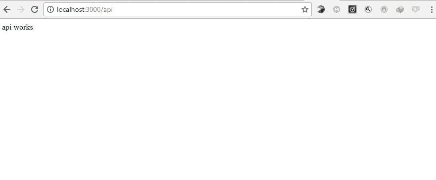
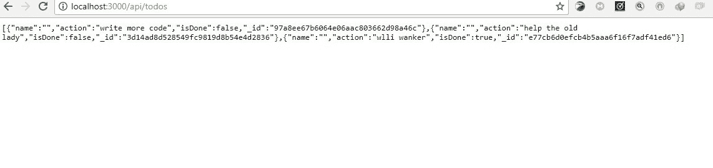

# 使用真实数据进行托管

现代 web 应用程序通常是数据驱动的。通常，我们需要从各种资源中 CRUD（创建、读取、更新和删除）数据，或者使用 API。Angular 使我们能够轻松处理来自外部源的数据，以便在组件中使用。

Angular 提供了一个简单的 HTTP API，该 API 授予我们的应用程序 HTTP 功能。它构建在现代浏览器公开的本机 XMLHttpRequest 接口上，使用它，我们可以执行以下任何 HTTP 操作：

*   获取：从资源请求数据
*   Post：向资源提交数据
*   Put：修改资源中的数据
*   删除：删除指定的资源

在本章中，我们将学习如何使用 Angular 来使用 API 并使我们的应用程序成为数据驱动的。

# 可观测

**可观察的**类似于承诺，有助于处理应用程序中的异步事件。可观察和承诺之间的主要区别是：

*   可观察对象可以随时间处理多个值，而承诺只调用一次并返回一个值
*   可观测的是可取消的，而承诺则不是

为了利用可观察对象，Angular 利用 JavaScript（**RxJs**可观察对象库的**反应式扩展。Angular 在处理 HTTP 请求和响应时广泛使用了可观察性；我们将在本章中了解更多关于它们的信息。**

# HTTP 模块

要开始在组件中使用 HTTP，您需要在应用程序模块中安装提供 HTTP 的`HttpModule`。首先，导入模块：

```ts
import { HttpModule } from '@angular/http';
```

接下来，您将模块包括在应用程序中注册的导入数组中，`BrowserModule`之后：

```ts
// app.module.ts
@NgModule({
imports: [
BrowserModule,
HttpModule,
],
})
```

# 构建一个简单的 todo 演示应用程序

让我们构建一个简单的`todo`应用程序，更好地理解如何在 Angular 应用程序中处理数据。

Angular CLI 将用于快速构建应用程序。该应用程序的 API 将使用 Express.js 构建，我们的 Angular 应用程序将连接到此 API 以 CRUD todo 数据。

# 项目设置

要使用 CLI 创建新项目，请执行以下操作：

```ts
ng new [project name]
```

The `ng new` command creates a new angular application

# 构建 API

从命令行，通过 npm 将 express、body parser 和 cors 作为依赖项安装：

```ts
npm install express body-parser cors
```

If you use npm 5, you don't need to specify the `-S` or `--save` flag to save as a dependency in your `package.json` file.

接下来，我们将在 Angular 项目的根文件夹中创建一个`server.js`文件，该文件将保存我们所有的 API 逻辑：

```ts
// server.js
const express = require('express');
const path = require('path');
const http = require('http');
const bodyParser = require('body-parser');
const cors = require('cors');
const app = express();
// Get API routes
const route = require('./routes/index');
// Parser for POST data
app.use(bodyParser.json());
app.use(bodyParser.urlencoded({ extended: false }));
// Use CORS
app.use(cors());
// Declare API routes
app.use('/api', route);
/**
* Get port from environment. Default is 3000
*/
const port = process.env.PORT || '3000';
/**
* Create HTTP server.
*/
const server = http.createServer(app);
/**
* Listen on port
*/
app.listen(port, function () {
console.log(`API running on port ${port}`)
} );
```

This file uses new versions of ES6 so you should watch in cases where your code editors don't recognize it immediately.

`/api`路由指向`./routes/index.js`文件，但我们还没有。在下一步中，我们将创建它。仍然在`root`目录中，创建一个名为`routes`的文件夹，并在其中创建一个名为`index.js`的文件：

```ts
// routes/index.js
const express = require('express');
// create a new router object
const router = express.Router();
/* GET api listing. */
router.get('/', (req, res) => {
res.send('api works');
});
module.exports = router;
```

要启动服务器，请输入以下命令：

```ts
node server.js
```

以下是服务器开始运行时的输出：


在这里，我们可以看到服务器正在运行，它侦听端口 3000。

打开浏览器并访问`localhost:3000/api/`：



如果您可以在前面的图像中看到响应，那么 API 可以工作。现在我们可以引入更复杂的逻辑，这样我们就可以处理实际数据了。

# 安装 diskdb

**Diskdb**是一个轻量级的基于磁盘的 JSON 数据库，节点使用类似 MongoDB 的 API。我们可以使用以下命令安装 diskdb：

```ts
npm install diskdb
```

在目录的根目录下创建一个`todos.json`文件。此文件将用作我们的数据库集合，其中包含待办事项。您可以在这里[了解更多关于 diskdb 的信息 https://www.npmjs.com/package/diskdb](https://www.npmjs.com/package/diskdb) 。

# 更新 API 端点

让我们用新的逻辑来更新`routes/index.js`文件，以便使用我们的 TODO：

```ts
// routes/index.js
const express = require('express');
const router = express.Router();
// require diskdb
const db = require('diskdb');
db.connect(__dirname, ['todos']);
// store Todo
router.post('/todo', function(req, res, next) {
var todo = req.body;
if (!todo.action || !(todo.isDone + '')) {
res.status(400);
res.json({
error: 'bad data'
});
} else {
db.todos.save(todo);
res.json(todo);
}
});
// get Todos
router.get('/todos', function(req, res, next) {
const todos = db.todos.find();
res.json(todos);
});
// update Todo
router.put('/todo/:id', function(req, res, next) {
const todo = req.body;
db.todos.update({_id: req.params.id}, todo);
res.json({ msg: `${req.params.id} updated`});
});
// delete Todo
router.delete('/todo/:id', function(req, res, next) {
db.todos.remove({
_id: req.params.id
});
res.json({ msg: `${req.params.id} deleted` });
});
module.exports = router;
```

在前面的代码中，我们可以使用`get`、`post`、`put`和`delete`端点更新 API。

下一步，我们将使用一些数据为数据库添加种子。更新`todos.json`文件：

```ts
[{
"action":"write more code",
"isDone":false,"
_id":"97a8ee67b6064e06aac803662d98a46c"
},{
"action":"help the old lady",
"isDone":false,"
_id":"3d14ad8d528549fc9819d8b54e4d2836"
},{
"action":"study",
"isDone":true,"
_id":"e77cb6d0efcb4b5aaa6f16f7adf41ed6"
}]
```

现在我们可以重新启动服务器并访问`localhost:3000/api/todos`查看 API 的运行情况：



List of Todos from the database.

# 创建角度组件

接下来，我们将创建一个`todo`组件。使用 Angular CLI，我们可以通过以下命令轻松做到这一点：

```ts
ng generate component todos
```

这将生成以下文件：`todos.component.ts`、`todos.component.html`和`todos.component.ts`。todos 组件也会自动导入到`app.module.ts`：

```ts
// app.module.ts
import { BrowserModule } from '@angular/platform-browser';
import { NgModule } from '@angular/core';
import { AppComponent } from './app.component';
import { TodosComponent } from './todos/todos.component';
@NgModule({
declarations: [
AppComponent,
TodosComponent
],
imports: [
BrowserModule
],
providers: [],
bootstrap: [AppComponent]
})
export class AppModule { }
```

我们应该确保在`src/index.html`头标签中添加`<base href="/">`。这是告诉路由如何组合导航 URL。`index.html`文件是在我们使用 Angular CLI 生成 Angular 项目时自动创建的：

```ts
<!-- index.html -->
<!doctype html>
<html lang="en">
<head>
<meta charset="utf-8">
<title>Data</title>
<base href="/">
<meta name="viewport" content="width=device-width, initial-scale=1">
<link rel="icon" type="img/x-icon" href="favicon.ico">
</head>
<body>
<app-root></app-root>
</body>
</html>
```

# 创建应用程序路由

接下来，我们将创建一个`/todos`路由，并让我们的应用程序在默认情况下重定向到该路由。

首先，从`@angular/router`导入`RouterModule`并将其添加到`AppModule`导入数组中：

```ts
import { RouterModule } from '@angular/router';
...
imports: [
...
RouterModule.forRoot(ROUTES)
],
```

在`ngModule`声明上方创建一个`ROUTES`数组，并向其中添加以下路由定义：

```ts
const ROUTES = [
{
path: '',
redirectTo: 'todos',
pathMatch: 'full'
},
{
path: 'todos',
component: TodosComponent
}
]
```

在`app.component.html`文件中，我们添加一个路由出口，在这里我们要渲染路由：

```ts
<div style="text-align:center">
<h1>
Welcome to {{ title }}!
</h1>
<router-outlet></router-outlet>
```

# 创建 todos 服务

接下来，我们将创建一个服务来处理调用，并将我们的组件连接到 expressapi。要使用 Angular CLI 生成服务，请执行以下操作：

```ts
ng generate service todos
```

该服务已创建，但未注册以在我们的应用程序中注册，我们需要将其添加到主应用程序模块的“提供者”部分。

Angular-CLI does not automatically register services.

将 TodosService 添加到提供程序阵列：

```ts
import {TodosService} from './todos.service';
...
providers: [TodosService],
...
})
export class AppModule { }
```

现在，在我们的服务中，我们将对 express 服务器进行 HTTP 调用以执行 CRUD 操作。首先，我们将进口`HTTP`、`Headers`和`rxjs/add/operator/map`：

```ts
import { Injectable } from '@angular/core';
import { Http, Headers} from '@angular/http';
import 'rxjs/add/operator/map';
@Injectable()
export class TodosService {
// constructor and methods to execute the crud operations will go in here
}
```

定义构造函数并注入 HTTP 服务：

```ts
import { Injectable } from '@angular/core';
import { Http, Headers } from '@angular/http';
import 'rxjs/add/operator/map';
@Injectable()
export class TodosService {
constructor(private http: Http) {}
}
Next, we will define a method that will fetch all todos from the API. Updating todos.service.ts:
// todo.service.ts
...
export class TodosService {
isDone: false;
constructor(private http: Http) {}
// Get all todos
getTodos() {
return this.http
.get('http://localhost:3000/api/todos')
.map(res => res.json());
}
}
```

在前面的代码中，我们使用`HttpModule`向 API 发出一个简单的`get`请求，以检索 TODO 列表。然后以 JSON 格式返回请求的响应。

接下来，我们将编写一个方法来存储 todo 项，名为`addTodos()`。此方法将用于发出存储 TODO 的 post 请求。

```ts
// todo.service.ts
...
addTodos(todo) {
let headers = new Headers();
headers.append('Content-Type', 'application/json');
return this.http
.post('http://localhost:3000/api/todo', JSON.stringify(todo), { headers })
.map(res => res.json());
}
}
```

在前面的代码中，我们设置了新的头并设置了`Content-Type`来告诉服务器它将接收什么类型的内容（`'application/json'`。

我们使用`http.post()`方法进行 post 请求。参数`JSON.stringify(todo)`表示我们希望将新 todo 作为 JSON 编码的字符串发送。最后，我们可以从 API 返回 JSON 格式的响应。

接下来，我们将定义一个名为`deleteTodo()`的删除方法。此方法将用于发出删除请求。这使我们能够从 TODO 列表中删除 TODO。再次更新`todos.service.ts`：

```ts
import { Injectable } from '@angular/core';
import { Http, Headers } from '@angular/http';
import 'rxjs/add/operator/map';
@Injectable()
export class TodosService {
constructor(private http: Http) {}
getTodos() {
return this.http
.get('http://localhost:3000/api/todos')
.map(res => res.json());
}
addTodos(todo) {
let headers = new Headers();
headers.append('Content-Type', 'application/json');
return this.http
.post('http://localhost:3000/api/todo', JSON.stringify(todo), { headers })
.map(res => res.json());
}
deleteTodo(id) {
return this.http
.delete(`http://localhost:3000/api/todo/${id}`)
.map(res => res.json());
}
}
```

在前面的代码中，我们定义了`deleteTodo()`方法，该方法将要删除的帖子的`id`作为其唯一参数。此方法向 API 发出删除请求，以从数据库中删除指定的 todo。来自 API 的响应也作为 JSON 返回。

最后，我们将定义一个名为`updateStatus()`的方法。此方法将用于发出`put`请求以更改 todos 项目的状态。

```ts
import { Injectable } from '@angular/core';
import { Http, Headers } from '@angular/http';
import 'rxjs/add/operator/map';
@Injectable()
export class TodosService {
isDone: false;
constructor(private http: Http) {}
getTodos() {
return this.http
.get('http://localhost:3000/api/todos')
.map(res => res.json());
}
addTodos(todo) {
let headers = new Headers();
headers.append('Content-Type', 'application/json');
return this.http
.post('http://localhost:3000/api/todo', JSON.stringify(todo), { headers })
.map(res => res.json());
}
deleteTodo(id) {
return this.http
.delete(`http://localhost:3000/api/todo/${id}`)
.map(res => res.json());
}
updateStatus(todo) {
let headers = new Headers();
headers.append('Content-Type', 'application/json');
return this.http
.put('http://localhost:3000/api/todo/' + todo._id, JSON.stringify(todo), {
headers: headers
})
.map(res => res.json());
}
}
```

在前面的代码中，我们创建了一个与`addTodos()`方法类似的`updateStatus()`方法。这里的区别在于`updateStatus()`方法发出`put`请求。我们还将`todo._id`连接到被调用的 API 端点。这使我们能够修改 todos 列表中单个项目的状态。

请记住，我们在服务中使用 HTTP API，因此我们应该在`app.module.ts`中导入`HttpModule`并将其包含在导入数组中：

```ts
import {HttpModule} from '@angular/http';
...
imports: [
HttpModule,
BrowserModule,
RouterModule.forRoot(ROUTES)
],
...
```

# 将服务与我们的 todos 组件连接

首先，我们必须在 todos 组件中导入 todos 服务：

```ts
import {TodosService} from '../todos.service';
```

然后在组件的构造函数中添加`TodosService`类：

```ts
constructor(private todoService: TodosService) { }
```

现在，我们将使用 todo 服务处理`get`、`create`、`delete`和`update`todo。

这就是我们的 todos 组件的外观：

```ts
import { Component, OnInit } from '@angular/core';
import { TodosService } from '../todos.service';
@Component({
selector: 'app-todos',
templateUrl: './todos.component.html',
styleUrls: ['./todos.component.css']
})
export class TodosComponent implements OnInit {
//define data types
todos: any = [];
todo: any;
action: any;
name: any;
isDone: boolean;
constructor(private todoService: TodosService) {}
ngOnInit() {
this.todoService.getTodos().subscribe(todos => {
this.todos = todos;
});
}
addTodos(event) {
event.preventDefault();
let newTodo = {
name: this.name,
action: this.action,
isDone: false
};
this.todoService.addTodos(newTodo).subscribe(todo => {
this.todos.push(todo);
this.name = '';
this.action = '';
});
}
deleteTodo(id) {
let todos = this.todos;
this.todoService.deleteTodo(id).subscribe(data => {
const index = this.todos.findIndex(todo => todo._id == id);
todos.splice(index, 1)
});
}
updateStatus(todo) {
var _todo = {
_id: todo._id,
action: todo.action,
isDone: !todo.isDone
};
this.todoService.updateStatus(_todo).subscribe(data => {
const index = this.todos.findIndex(todo => todo._id == _todo._id)
this.todos[index] = _todo;
});
}
choice(todo) {
console.log(todo);
return todo.isDone;
}
}
```

我们刚刚启用了服务和组件之间的通信。`component.ts`文件现在可以使用其中的服务和方法。

现在我们已经连接了服务和组件，我们必须在浏览器中显示 todos 操作，这将在`todos.component.html`中完成。

# 实现视图

为了展示待办事项，我们将利用：

*   Angular 的`*ngFor`指令，该指令迭代 todo 数组，并为该数组中的每个 todo 呈现此模板的实例
*   Angular 的插值绑定语法，`{{}}`

更新`todos.component.html`：

```ts
<div class="container">
<form (submit) = "addTodos($event)">
<input type="text"
class="form-control" placeholder="action"
[(ngModel)] ="action" name="action">
<button type="submit"><h4>Submit</h4></button>
</form>
<div *ngFor="let todo of todos">
<div class="container">
<p (click)="updateStatus(todo)" [ngStyle]="{ 'text-decoration': todo.isDone ? 'line-through' : ''}" >Action: {{todo.action}}</p>
{{todo.isDone}}
<button (click) ="deleteTodo(todo._id)" >Delete</button>
</div>
</div>
</div>
```

为了使我们的应用程序看起来更好，我们将使用引导。**Bootstrap**是一个强大的前端框架，用于创建表单、模态、手风琴、旋转木马和选项卡等 web 和用户界面组件：

```ts
<!-- Index.html --&gt;
<!doctype html>
<html lang="en">
<head>
<link rel="stylesheet" href="https://maxcdn.bootstrapcdn.com/bootstrap/4.0.0-beta/css/bootstrap.min.css" integrity="sha384-/Y6pD6FV/Vv2HJnA6t+vslU6fwYXjCFtcEpHbNJ0lyAFsXTsjBbfaDjzALeQsN6M" crossorigin="anonymous">
<meta charset="utf-8">
<title>Data</title>
<base href="/">
<meta name="viewport" content="width=device-width, initial-scale=1">
<link rel="icon" type="img/x-icon" href="favicon.ico">
</head>
<body>
<app-root></app-root>
</body>
</html>
```

更新`todos.component.html`：

```ts
<form (submit) = "addTodos($event)">
<input type="text" class="form-control" placeholder="action" [(ngModel)] ="action" name="action">
<button class="btn btn-primary" type="submit"><h4>Submit</h4></button>
</form>
<div class="card pos" style="width: 20rem;" *ngFor="let todo of todos">
<div class="card-body">
<h4 class="card-title" (click)="updateStatus(todo)" [ngStyle]="{ 'text-decoration': todo.isDone ? 'line-through' : ''}">{{todo.action}}</h4>
<p class="card-text">{{todo.isDone}}</p>
<button (click) ="deleteTodo(todo._id)" class="btn btn-danger">Delete</button>
</div>
</div>
We'll also update app.component.css file to add some optional extra styling.
// app.component.css
.isDone{
text-decoration: line-through;
}
.pos{
margin-left: 40%;
margin-top: 10px;
}
```

打开命令行/终端并导航到项目文件夹。运行节点`server.js`启动服务器。打开`project`文件夹中的另一个终端窗口，运行`ng serve`为 Angular app 服务。

打开浏览器，访问`localhost:4200`。下面的屏幕截图显示了结果：


我们通过服务向节点服务器发出 HTTP 请求，然后通过组件将结果呈现给 DOM，从而成功地创建了 todo 应用程序。您可以添加 todo、删除 todo、获取所有 todo，当您单击 todo 时，布尔值将更改，并且删除线将显示在该特定 todo 上。重新加载浏览器时，可以看到对待办事项列表所做的更改保持不变。

让我们简要回顾一下我们所做的一切：

*   首先，我们使用 Angular CLI 创建了 Angular 应用程序
*   然后，我们创建了一个服务器文件，在其中我们需要依赖项，创建了一个 express 应用程序，设置了 API 路由，声明了一个供服务器侦听的端口，为 post 数据添加了解析器，等等
*   然后我们定义了数据源，它是一个 TODO 的`.json`文件，与**diskdb**通信
*   创建了一个角度组件
*   使用与 REST API 通信的`get`、`post`、`put`和`delete`方法创建了一个服务

让我们看另一个例子。我们将创建一个简单的应用程序来显示用户列表以及他们的电子邮件和电话号码。用户还将有一个 true 或 false 状态，指示他们是否可用。

# 使用 Angular 创建用户目录

我们将要构建的应用程序将有一个 RESTAPI，它将在本例中创建。在这个简单的例子中，我们将创建一个非常简单的`users`应用程序。该应用程序基本上是一个表格，其中包含用户列表及其电子邮件地址和电话号码。表中的每个用户将有一个值为布尔值的*活动*状态。我们将能够将特定用户的*活动*状态从 false 更改为 true，反之亦然。该应用程序将使我们能够添加新用户，也可以从表中删除用户。与上一个示例一样，本示例将使用 diskDB 作为数据库。我们将有一个 Angular 服务，其中包含负责与其余端点通信的方法。这些方法将负责向 REST API 发出`get`、`post`、`put`和`delete`请求。服务中的第一个方法将负责向 API 发出`get`请求。这将使我们能够从后端检索所有用户。接下来，我们将有另一个方法向 API 发出`post`请求。这将使我们能够向现有用户阵列中添加新用户。

我们将拥有的下一种方法将负责向 API 发出`delete`请求，以便能够删除用户。最后，我们将有一个向 API 发出`put`请求的方法。这将是使我们能够编辑/修改用户状态的方法。为了向 RESTAPI 发出这些请求，我们必须使用 HttpModule。本节的目的是巩固您对 HTTP 的了解。作为一名 JavaScript 开发人员，事实上，作为一名角度分明的开发人员，您几乎总是要与 API 和 web 服务器进行交互。今天开发人员使用的很多数据都是以 API 的形式存在的，为了与这些 API 进行交互，我们需要不断地使用 HTTP 请求。事实上，HTTP 是 Web 数据通信的基础。

# 创建一个新的 Angular 应用程序

如前所示，要启动新的 Angular 应用程序，请运行以下命令：

```ts
ng new user
```

这将创建 Angular 2 用户应用程序。

安装以下依赖项：

*   表示
*   体分析器
*   科尔斯

```ts
npm install express body-parser cors --save
```

# 创建节点服务器

在项目目录的根目录下创建一个名为`server.js`的文件。这将是我们的节点服务器。

用以下代码块填充`server.js`：

```ts
// Require dependencies
const express = require('express');
const path = require('path');
const http = require('http');
const cors = require('cors');
const bodyParser = require('body-parser');
// Get our API routes
const route = require('./route');
const app = express();
app.use(bodyParser.json());
app.use(bodyParser.urlencoded({ extended: false }));
// Use CORS
app.use(cors());
// Set our api routes
app.use('/api', route);
/**
* Get port from environment.
*/
const port = process.env.PORT || '3000';
/**
* Create HTTP server.
*/
const server = http.createServer(app);
//Listen on provided port
app.listen(port);
console.log('server is listening');
```

这里发生的事情很简单：

*   我们需要并利用了依赖关系
*   我们定义并设置了 API 路由
*   我们为服务器设置了一个监听端口

`./route`需要 API 路由，但此路径尚不存在。让我们快速创建它。

在项目目录的根目录下，创建一个名为`route.js`的文件。这是 API 路由将被制作的地方。我们需要一种数据库形式，从中我们可以获取、发布、删除和修改数据。

与前面的示例一样，我们将使用 diskdb。路线的模式与第一个示例中的模式基本相同。

# 安装 diskDB

在项目文件夹中运行以下命令以安装 diskdb：

```ts
npm install diskdb
```

在项目目录的根目录下创建一个`users.json`文件，作为我们的数据库集合，在那里我们有我们用户的详细信息。

用以下内容填充`users.json`：

```ts
[{"name": "Marcel", "email": "test1@gmail.com", "phone_number":"08012345", "isOnline":false}]
```

现在，更新`route.js`。

```ts
route.js
const express = require('express');
const router = express.Router();
const db = require('diskdb');
db.connect(__dirname, ['users']);
//save
router.post('/users', function(req, res, next) {
var user = req.body;
if (!user.name && !(user.email + '') && !(user.phone_number + '') && !(user.isActive + '')) {
res.status(400);
res.json({
error: 'error'
});
} else {
console.log('ds');
db.users.save(todo);
res.json(todo);
}
});
//get
router.get('/users', function(req, res, next) {
var foundUsers = db.users.find();
console.log(foundUsers);
res.json(foundUsers);
foundUsers = db.users.find();
console.log(foundUsers);
});
//updateUsers
router.put('/user/:id', function(req, res, next) {
var updUser = req.body;
console.log(updUser, req.params.id)
db.users.update({_id: req.params.id}, updUser);
res.json({ msg: req.params.id + ' updated' });
});
//delete
router.delete('/user/:id', function(req, res, next) {
console.log(req.params);
db.users.remove({
_id: req.params.id
});
res.json({ msg: req.params.id + ' deleted' });
});
module.exports = router;
```

我们使用 diskDB 作为数据库，使用 API 路由创建了一个 restapi。

使用以下命令启动服务器：

```ts
node server.js
```

服务器正在运行，正在侦听分配的端口。现在，打开浏览器，进入`http://localhost:3000/api/users`。

在这里，我们可以看到我们输入到`users.json`文件中的数据。这表明我们的路由正在工作，我们正在从数据库获取数据。

# 创建一个新组件

运行以下命令以创建新组件：

```ts
ng g component user
```

这将创建`user.component.ts`、`user.component.html`、`user.component.css`和`user.component.spec.ts`文件。`User.component.spec.ts`用于测试，因此本章不再使用。新创建的组件将自动导入到`app.module.ts`。我们必须告诉根组件有关用户组件的信息。我们将通过将选择器从`user.component.ts`导入根模板组件（`app.component.html`）来实现这一点：

```ts
<div style="text-align:center">
<app-user></app-user>
</div>
```

# 创建服务

下一步是创建一个与我们前面创建的 API 交互的服务：

```ts
ng generate service user
```

这将创建一个名为`user.service.ts`的用户服务。接下来，将`UserService`类导入`app.module.ts`并将其包含到提供者数组中：

```ts
Import rxjs/add/operator/map in the imports section.
import { Injectable } from '@angular/core';
import { Http, Headers } from '@angular/http';
import 'rxjs/add/operator/map';
Within the UserService class, define a constructor and pass in the angular 2 HTTP service.
import { Injectable } from '@angular/core';
import { Http, Headers } from '@angular/http';
import 'rxjs/add/operator/map';
@Injectable()
export class UserService {
constructor(private http: Http) {}
}
```

在服务类中，编写一个方法，该方法发出`get`请求，从 API 获取所有用户及其详细信息：

```ts
getUser() {
return this.http
.get('http://localhost:3000/api/users')
.map(res => res.json());
}
```

编写发出`post`请求并创建新 todo 的方法：

```ts
addUser(newUser) {
var headers = new Headers();
headers.append('Content-Type', 'application/json');
return this.http
.post('http://localhost:3000/api/user', JSON.stringify(newUser), {
headers: headers
})
.map(res => res.json());
}
```

编写另一个发出`delete`请求的方法。这将使我们能够从用户集合中删除用户：

```ts
deleteUser(id) {
return this.http
.delete('http://localhost:3000/api/user/' + id)
.map(res => res.json());
}
```

最后，编写一个发出`put`请求的方法。此方法将使我们能够修改用户的状态：

```ts
updateUser(user) {
var headers = new Headers();
headers.append('Content-Type', 'application/json');
return this.http
.put('http://localhost:3000/api/user/' + user._id, JSON.stringify(user), {
headers: headers
})
.map(res => res.json());
}
```

更新`app.module.ts`导入`HttpModule`和`FormsModule`并将其包含到导入数组中：

```ts
import { HttpModule } from '@angular/http';
import { FormsModule } from '@angular/forms';
.....
imports: [
.....
HttpModule,
FormsModule
]
```

接下来要做的事情是教用户组件使用服务：

```ts
Import UserService in user.component.ts.
import {UserService} from '../user.service';
Next, include the service class in the user component constructor.
constructor(private userService: UserService) { }.
Just below the exported UserComponent class, add the following properties and define their data types:
users: any = [];
user: any;
name: any;
email: any;
phone_number: any;
isOnline: boolean;
```

现在，我们可以在用户组件中使用来自用户服务的方法。

# 更新 user.component.ts

在`ngOnInit`方法中，使用用户服务从 API 中`get`所有用户：

```ts
ngOnInit() {
this.userService.getUser().subscribe(users => {
console.log(users);
this.users = users;
});
}
```

在`ngOnInit`方法下面，写一个方法，利用用户服务中的`post`方法添加新用户：

```ts
addUser(event) {
event.preventDefault();
var newUser = {
name: this.name,
email: this.email,
phone_number: this.phone_number,
isOnline: false
};
this.userService.addUser(newUser).subscribe(user => {
this.users.push(user);
this.name = '';
this.email = '';
this.phone_number = '';
});
}
```

让我们利用用户服务中的`delete`方法来删除用户：

```ts
deleteUser(id) {
var users = this.users;
this.userService.deleteUser(id).subscribe(data => {
console.log(id);
const index = this.users.findIndex(user => user._id == id);
users.splice(index, 1)
});
}
```

最后，我们将利用用户服务向 API 发出`put`请求：

```ts
updateUser(user) {
var _user = {
_id: user._id,
name: user.name,
email: user.email,
phone_number: user.phone_number,
isActive: !user.isActive
};
this.userService.updateUser(_user).subscribe(data => {
const index = this.users.findIndex(user => user._id == _user._id)
this.users[index] = _user;
});
}
```

我们拥有与 API、服务和组件的所有通信。为了说明我们在浏览器中所做的一切，我们必须更新`user.component.html`。

我们将使用引导程序进行样式设置。因此，我们必须在`index.html`中导入引导 CDN：

```ts
<!doctype html>
<html lang="en">
<head>
//bootstrap CDN
<link rel="stylesheet" href="https://maxcdn.bootstrapcdn.com/bootstrap/4.0.0-beta/css/bootstrap.min.css" integrity="sha384-/Y6pD6FV/Vv2HJnA6t+vslU6fwYXjCFtcEpHbNJ0lyAFsXTsjBbfaDjzALeQsN6M" crossorigin="anonymous">
<meta charset="utf-8">
<title>User</title>
<base href="/">
<meta name="viewport" content="width=device-width, initial-scale=1">
<link rel="icon" type="img/x-icon" href="favicon.ico">
</head>
<body>
<app-root></app-root>
</body>
</html>
```

# 正在更新 user.component.html

以下是用户组件的组件模板：

```ts
<form class="form-inline" (submit) = "addUser($event)">
<div class="form-row">
<div class="col">
<input type="text" class="form-control" [(ngModel)] ="name" name="name">
</div>
<div class="col">
<input type="text" class="form-control" [(ngModel)] ="email" name="email">
</div>
<div class="col">
<input type="text" class="form-control" [(ngModel)] ="phone_number" name="phone_number">
</div>
</div> <br>
<button class="btn btn-primary" type="submit" (click) = "addUser($event)"><h4>Add User</h4></button>
</form>
<table class="table table-striped" >
<thead>
<tr>
<th>Name</th>
<th>Email</th>
<th>Phone_Number</th>
<th>Active</th>
</tr>
</thead>
<tbody *ngFor="let user of users">
<tr>
<td>{{user.name}}</td>
<td>{{user.email}}</td>
<td>{{user.phone_number}}</td>
<td>{{user.isActive}}</td>
<td><input type="submit" class="btn btn-warning" value="Update Status" (click)="updateUser(user)" [ngStyle]="{ 'text-decoration-color:': user.isActive ? 'blue' : ''}"></td>
<td><button (click) ="deleteUser(user._id)" class="btn btn-danger">Delete</button></td>
</tr>
</tbody>
</table>
```

前面的代码中有很多内容，让我们深入到代码块：

*   我们有一个表单，它接受三个输入，还有一个提交按钮，当点击时触发`addUser()`方法
*   有一个删除按钮，点击时触发`delete`方法
*   还有一个更新状态输入元素，单击时触发`updateUser()`方法
*   我们创建了一个表，其中将使用 Angular 的`*ngFor`指令和 Angular 的插值绑定语法`{{}}`显示用户的详细信息

一些额外的样式将添加到项目中。转到`user.component.css`并添加以下内容：

```ts
form{
margin-top: 20px;
margin-left: 20%;
size: 50px;
}
table{
margin-top:20px;
height: 50%;
width: 50%;
margin-left: 20%;
}
button{
margin-left: 20px;
}
```

# 运行应用程序

打开两个命令行界面/终端。在这两个目录中，导航到项目目录。运行节点`server.js`一次启动服务器。在另一个应用程序中运行`ng serve`以提供 Angular 2 应用程序。

打开浏览器，进入`localhost:4200`。

在这个简单的用户应用程序中，我们可以执行所有 CRUD 操作。我们可以创建新用户、获取用户、删除用户和更新用户状态。

默认情况下，新添加的用户的活动状态为 false。可以通过单击“更改状态”按钮进行更改。

# 总结

在开发任何应用程序时，处理来自数据库或 API 的实际数据都非常重要。HTTP 与 observables 和 Rxjs 一起使用，可以使用 API 中所需的数据集，还可以执行所有 CRUD 操作。

在下一章中，我们将研究编写单元测试和调试。