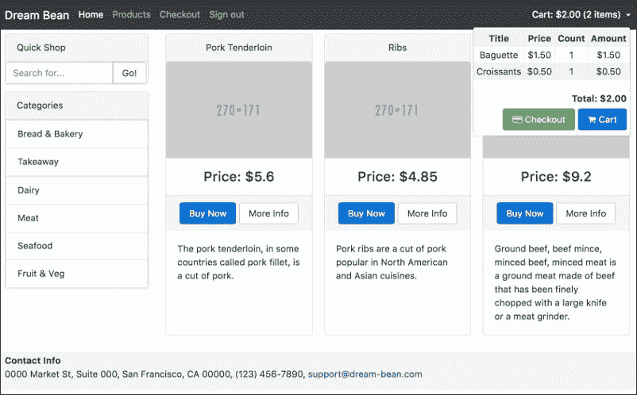

# 六、依赖注入

本章是关于依赖注入的，它教您如何将应用程序的需求解耦，以及如何创建一致的数据源作为服务。您将了解注入器和提供程序类。我们还将讨论创建对象所需的可注入装饰器。

在本章末尾，您将对以下内容有一个坚实的理解：

*   什么是依赖注入？
*   关注点分离
*   创建服务
*   注入器和提供程序类
*   可注入和注入修饰子
*   为我们的应用程序创建数据服务

# 什么是依赖注入？

在这里，我将用一些具体的例子来讨论**依赖注入**的概念，希望这些例子能够说明它试图解决的问题以及它给开发人员带来的好处。Angular 主要基于依赖项注入，您可能熟悉也可能不熟悉。如果您已经知道依赖项注入的概念，您可以安全地跳过本章，阅读下一章。

依赖注入可能是我所知道的最著名的设计模式之一，您可能已经使用过它。我认为这是最难解释的问题之一，部分原因是在大多数依赖注入的介绍中使用了无意义的例子。我试着想出更适合这个Angular世界的例子。

# 一个真实的例子

想象一下，你自己创业，经常乘飞机旅行，所以你需要安排航班。您总是使用航空公司的电话号码自己预订航班。

因此，您典型的旅行计划程序可能如下所示：

*   确定目的地、预期到达日期和时间
*   打电话给航空公司并传达必要的信息以获得航班预订
*   拿好票就上路

现在，如果您突然改变首选机构及其联系机制，您将面临以下重新学习场景：

*   新机构及其新的联系机制（比如新机构提供基于互联网的服务，预订方式是通过互联网而不是通过电话）
*   完成必要预订的典型对话顺序（数据而非语音）

你需要调整自己以适应新的情况。这可能导致在调整过程中花费大量时间。

假设你的业务在增长，你在公司里有一个秘书，所以无论何时你需要出差，你都会给他或她发一封电子邮件，说明目的地、期望的到达日期和时间。机票是为您预订的，机票会送到您手中。

现在，如果首选机构发生变化，秘书将意识到变化，并可能调整其工作流程，以便能够与该机构进行沟通。但是，您不需要重新学习。你仍然像以前一样遵守同样的协议，因为部长以一种方式做出了所有必要的调整，这意味着你不需要做任何不同的事情。

在这两种情况下，您都是客户，并且依赖于代理机构提供的服务。但是，第二种情况有一些不同：

*   你不需要知道机构的联系人，秘书会帮你做的
*   你不需要知道机构通过语音、电子邮件、网站等进行活动的确切对话顺序，因为你知道与秘书的特定标准化对话系列
*   您所依赖的服务以一种在服务提供商发生变化时无需重新调整的方式提供给您

这就是*现实生活*中的依赖注入。

# 依赖注入

我们在项目中使用的Angular组件和自定义组件都是一组协作组件的一部分。他们相互依赖以完成其预期目的，他们需要知道：

*   要与哪些组件通信？
*   在哪里找到他们？
*   如何与他们沟通？

当访问方式发生更改时，此类更改可能需要修改许多组件的源。以下是我们可以用来防止组件发生剧烈变化的合理解决方案：

*   我们可以将位置和实例化逻辑嵌入到我们通常的组件逻辑中
*   我们可以创建*外部*段代码，承担定位和实例化的责任，必要时提供引用

我们可以从我们的*现实生活*示例中将最后一个解决方案视为*秘书*。当定位任何外部依赖关系的方法发生变化时，我们不需要更改组件的代码。这个解决方案是依赖注入的实现，其中一段*外部*代码是 Angular 框架的一部分。

依赖注入的使用需要声明组件，并使框架能够解决实例化、初始化、排序和根据需要提供引用的复杂性。

将依赖项传递到将使用它的依赖对象是依赖项注入。组件至少可以通过三种常见方式接受依赖项：

*   **构造函数注入**：在这种情况下，依赖关系是通过类构造函数提供的。
*   **Setter 注入**：在这种情况下，注入器使用组件公开的 Setter 方法注入依赖性。
*   **接口注入**：在这种情况下，依赖项提供了一种方法，将依赖项注入到传递给它的任何组件中。

## 构造函数注入

此方法要求组件在构造函数中为依赖项提供参数。我们在`ProductGridService`组件的代码中注入了`Router`实例：

```ts
constructor(private router: ActivatedRoute) {

    this.router 
        .queryParams 
        .subscribe(params => { 
            let category: string = params['category']; 
            let search: string = params['search']; 
            // Return filtered data 
            let products: Product[] =  
              getProducts(category, search); 
            // Transform products to appropriate data 
            // to display 
            this.products = this.transform(products); 
        }); 
} 

```

构造函数注入是最可取的方法，可用于确保组件始终处于有效状态，但其缺乏灵活性，无法在以后更改其依赖项。

## 其他注射方法

Setter 和 interface 方法不在 Angular 框架中实现。

## 组件与服务

Angular 2 在以下方面区分 web 应用程序的代码：

*   表示可视部件的组件
*   可重用数据服务

数据服务是一个简单的类，提供返回或更新某些数据的方法。

# 反射式注射器

`ReflectiveInjector`是一个注入容器，我们使用它来替换`new`操作符，以自动解决构造函数依赖关系。当应用程序中的代码询问构造函数中的依赖项时，`ReflectiveInjector`会解决它们。

```ts
import {Injectable, ReflectiveInjector} from '@angular/core'; 

@Injectable() 
export ProductGridService { 
  constructor(private router: ActivatedRoute) {...} 
} 

const injector = ReflectiveInjector.resolveAndCreate  
      ([ActivatedRoute, ProductGridService]); 
const service = injector.get(ProductGridService); 

```

使用`resolveAndCreate`方法，`ReflectiveInjector`创建`Injector`的实例。我们正在将服务提供者数组传递到注入器中进行配置，否则它将不知道如何创建它们。

有了`Injector`，创建`ProductGridService`非常容易，因为它完全负责提供`ActivatedRoute`并将其注入`ProductGridService`。

让我们来谈谈为什么我们在类中导入并应用`Injectable`装饰器？

## 可注射装饰剂

我们在应用程序中创建多种类型以满足特定需求。其中一些可能与其他人有依赖关系。我们必须用`Injectable`装饰器标记任何可用的喷油器类型。Injector 使用类构造函数元数据获取参数类型，并确定实例化和注入的依赖类型。任何依赖类型都必须标记有`Injectable`装饰符，否则在尝试实例化时，injector 将报告错误。

### 注

向每个服务类添加`@Injectable()`以防止依赖项注入错误。

我们必须将`Injectable`装饰器显式地导入并应用于我们的所有服务类，以使它们可用于注入器进行实例化。如果没有这个装饰器，天使就不知道这些类型的存在。

## 注射装饰剂

如前所述，注入器使用类构造函数元数据来确定依赖类型：

```ts
constructor(private router: ActivatedRoute) {...} 

```

Injector 使用 TypeScript 生成的元数据将`ActivatedRoute`类型的实例注入构造函数。对于注入类型脚本原语，如`string`、`boolean`或数组，我们应该定义并使用不透明标记：

```ts
import { OpaqueToken } from '@angular/core'; 

export let APP_TITLE = new OpaqueToken('appTitle'); 

```

现在，定义了`APP_TITLE`令牌后，我们可以在依赖提供程序的注册中使用它：

```ts
providers: [{ provide: APP_TITLE, useValue: 'Dream Bean' }] 

```

当我们将应用程序标题注入应用程序的任何构造函数时，我们使用`@Inject`装饰器：

```ts
import {Inject} from '@angular/core'; 

constructor(@Inject('APP_TITLE') private appTitle) {...} 

```

我们将很快讨论代币。

## 可选装饰器

当类具有可选依赖项时，我们可以使用`@Optional`装饰器标记构造函数参数：

```ts
import {Optional} from '@angular/core'; 

constructor(@Optional('config') private config) { 
  if (config) { 
    // Use the config 
    ... 
  } 
} 

```

我在上面的代码中添加了条件语句，因为我预期`config`属性将等于`null`。

## 配置喷油器

在前面的例子中，我使用了`ReflectiveInjector`的`resolveAndCreate`方法来创建`Injector`，但在现实生活中，这并不是必须的：

```ts
const injector = ReflectiveInjector.resolveAndCreate  
      ([ActivatedRoute, ProductGridService]); 

```

Angular 框架在应用程序Bootstrap期间为我们创建了一个应用程序范围的注入器：

```ts
platformBrowserDynamic().bootstrapModule(AppModule); 

```

我们必须通过注册我们的应用程序来创建服务。我们可以通过两种方式做到这一点：

*   在`NgModule`中注册提供商
*   在`AppComponent`中注册提供商

哪一个最好？注入到`AppModule`中的服务在整个应用程序中广泛可用，可以注入到延迟加载模块及其组件中。注入到`AppComponent`中的服务仅可用于此组件及其子组件，而不可用于延迟加载模块。

### 注

在根目录`AppModule`中注册应用程序范围的提供程序，而不是在`AppComponent`中注册。

我们可以在适当的情况下使用替代供应商配置注射器：

*   如果对象的行为或外观与原始对象相似
*   提供一个替代类
*   提供工厂功能

例如`AppModule`类：

```ts
@NgModule({ 
  imports: [BrowserModule, FormsModule,  
            routing, CategoryModule, ProductModule], 
  declarations: [AppComponent, NavbarComponent, FooterComponent,  
                WelcomeComponent], 

 providers: [ProductService],

  bootstrap: [AppComponent] 
}) 
export class AppModule { } 

```

在注入器中注册提供程序时，我们使用了一个简短的表达式。Angular 将其转换为以下详细格式：

```ts
[{provide: Router, useClass: Router] 

```

第一位的`provide`属性是*令牌*，该令牌作为：

*   查找依赖项值
*   注册提供商

第二个属性`useClass`是一个定义对象，类似于许多其他*使用*事物，如`useValue`、`useExisting`等。并告诉框架如何创建依赖项。借助*使用*定义，我们可以快速切换实现、定义常量和工厂函数。让我们看看所有这些。

## 类提供者

大多数情况下，我们会利用`useClass`定义要求不同的类提供服务。我们可以创建自己的`BetterRouter`类作为原始类的扩展，并注册它，以便：

```ts
[{ provide: Router, 
useClass: BetterRouter

 }] 

```

注入器知道如何构建`BetterRouter`并将对其进行分类。

## 别名类提供程序

在需要使用同一个单例的多个提供者的场景中，我们可以使用`useExisting`定义：

```ts
class BetterRouter extends Router {} 

var injectorClass = ReflectiveInjector.resolveAndCreate([ 
  BetterRouter, {provide: Router, 
useClass:

 BetterRouter} 
]); 
var injectorAlias = ReflectiveInjector.resolveAndCreate([ 
  BetterRouter, {provide: Router, 
useExisting:

 BetterRouter} 
]); 

```

请看以下示例，`useExisting`帮助组织模拟请求：

```ts
var injector = Injector.resolveAndCreate([ 
    HTTP_PROVIDERS, 
    MockBackend, 
    { provide: XHRBackend, useExisting: MockBackend } 
]); 
var http = injector.get(Http); 
var backend = injector.get(MockBackend);  

```

下面的代码演示了如何使用`MockBackend`而不是实际的，发出 AJAX 请求：

```ts
var people = [{name: 'Jeff'}, {name: 'Tobias'}]; 

// Listen for any new requests 

backend.

connections.observer({ 
  next: connection => { 
    var response = new Response({body: people}); 
    setTimeout(() => { 
      // Send a response to the request 
      connection.mockRespond(response); 
    }); 
  } 
}); 

http.

get('people.json').observer({ 
  next: res => { 
    // Response came from mock backend 
    console.log('first person', res.json()[0].name); 
  } 
}); 

```

`useExisting`的另一个有用之处是提供自定义管道、自定义指令或自定义验证器的多个值：

```ts
@Directive({ 
    selector: '[custom-validator]', 
    providers: [{ provide: NG_VALIDATORS,  

 useExisting: CustomValidatorDirective, multi: true }]

}) 
class CustomValidatorDirective implements Validator { 
    validate(c: Control): { [key: string]: any } { 
        return { "custom": true }; 
    } 
} 

```

借助于`multi`选项，可以将`CustomValidatorDirective`添加到默认集合中，使其在应用程序中全局可用。

## 价值提供者

有时，我们需要在应用程序中使用配置对象、字符串或函数，但它们并不总是类的实例。在此，接口定义了配置的结构：

```ts
export interface 
Config

 { 
  url: string; 
  title: string; 
} 

export const 
CUSTOM_CONFIG:

 Config = { 
  url: 'www.dreambean.com', 
  title: 'Dream Bean Co.' 
}; 

```

我们可以使用`useValue`定义注册现成的对象。没有`Config`类，所以我们不能将其用于令牌。相反，我们可以使用字符串文字来注册和解析依赖项：

```ts
providers: [{ provide: 
'app.config', useValue: CUSTOM_CONFIG 

}]
```

现在我们可以借助`@Inject`装饰器将其注入任何构造函数：

```ts
constructor(@Inject(
'app.config'

) config: 
Config

) { 
  this.title = config.title + ':' + config.url; 
} 

```

不幸的是，使用字符串标记可能会导致命名冲突。Angular 提供了一个优雅的解决方案，为非类依赖提供了`Opaque Token`：

```ts
import { OpaqueToken } from '@angular/core'; 

export let 
CONFIG

 = new 
OpaqueToken

('app.config'); 

```

我们正在向价值提供者注册注入器中的`CUSTOM_CONFIG`：

```ts
providers: [{ provide: 
CONFIG, useValue:

CUSTOM_CONFIG

 }] 

```

将其注入任何构造函数：

```ts
constructor(@Inject(
CONFIG

) config: 
Config

) { 
  this.title = config.title + ':' + config.url; 
} 

```

### 多值

借助`multi`选项，可以在以后向同一绑定添加其他值：

```ts
bootstrap(AppComponent, [ 
   provide('languages', {useValue: 'en', multi:true }), 
   provide('languages', {useValue: 'fr', multi:true }) 
); 

```

在代码中的某个地方，我们可以得到`languages`的多个值：

```ts
constructor(@Inject('languages') languages) { 
  console.log(languages); 
  // Logs: "['en','fr']" 
} 

```

### 工厂供应商

当我们需要根据Bootstrap发生后任何时刻更改的信息动态创建依赖值时，我们可以应用`useFactory`定义。

假设我们使用`SecurityService`来授权用户。`CategoryService`必须了解用户的情况。授权可以在用户会话期间更改，因为用户可以随时多次登录和注销。将`SecurityService`直接注入`CategoryService`创建了将其注入应用程序的所有服务的先例。

解决方案非常简洁，使用原始布尔值`authorization`属性而不是`SecurityService`来控制`CategoryService`：

```ts
categories: Category[] = [...]; 

constructor(private 
authorized:

 boolean) { } 

getCategories() { 

 return this.authorized ? this.categories : [];

} 

```

授权属性将动态更新，因此我们无法使用值提供程序，但我们必须用工厂函数接管`CategoryService`新实例的创建：

```ts
let categoryServiceFactory = (securityService: SecurityService) => { 
   return new CategoryService(securityService.authorized); 
} 

```

在 factory provider 中，我们将`SecurityService`与 factory 函数一起注入：

```ts
export let categoryServiceProvider = {  
    provide: CategoryService, 
    useFactory: categoryServiceFactory, 
    deps: [
SecurityService

] 
}; 

```

# 喷油器的层次结构

Angular 1 在整个应用程序中只有一个注入器，它可以很好地管理所有依赖项的创建和解析。每个已注册的依赖项都成为一个单例，因此在整个应用程序中只有一个实例可用。该解决方案有一个副作用，即需要将同一依赖项的多个实例注入到应用程序的不同部分。由于 Angular 2 应用程序是一个组件树，因此框架有一个**层次依赖注入**系统。注入程序树与应用程序的组件树并行存在。每个组件都有自己的注入器，或与树中同一级别的其他组件共享。当树底部的组件请求依赖项时，Angular 会尝试使用在该组件的注入器中注册的提供程序来查找它。如果此级别上不存在提供程序，则注入器将请求传递给其父注入器，依此类推，直到找到可以处理请求的注入器。Angular 在用完祖先时抛出异常。此解决方案帮助我们在不同级别和组件上创建相同依赖关系的不同实例。特定的服务实例仍然是单实例，但仅在主机组件实例及其子实例的范围内。

让我们开始：

*   打开终端，创建文件夹`ecommerce`并移入
*   将项目内容从文件夹`chapter_6/1.ecommerce-seed`复制到新项目中
*   运行以下脚本安装`npm`模块：

```ts
npm install

```

*   使用下一个命令启动 TypeScript watcher 和 lite 服务器：

```ts
npm start

```

此脚本打开 web 浏览器并导航到项目的欢迎页面。

# 类别服务

我在[第 5 章](05.html#page "Chapter 5. Routing")、*路由*中提到了在实现 SPA 时将数据与表示逻辑解耦的必要性。我在类别和产品视图中部分实现了这一点。`CategoryListComponent`和`WelcomeComponent`使用类别从`getCategories`函数返回。现在它没有受到影响，但是当我们开始从服务器获取和更新数据时，我们将需要更多的功能。最好将实现细节隐藏在单个可重用数据服务类中，以便在多个组件中使用它。

让我们将 category data acquisition 业务重构为一个提供类别的服务，并与所有需要类别的组件共享该服务。

将`category.ts`重命名为`category.service.ts`以遵循名称约定，在该约定中，我们用小写字母拼写服务名称，后跟`.service`。如果服务名称是多字的，我们将用小写的`dash-case`拼写基本文件名。将导入语句添加到文件顶部：

```ts
import {
Injectable

} from '@angular/core'; 

```

现在创建`CategoryService`类并将`categories`变量、`getCategories`和`getCategory`函数移到内部：

```ts
@Injectable()

export class 
CategoryService

 { 

categories:

 Category[] = [ 
        { id: '1', title: 'Bread & Bakery', imageL: 'http://placehold.it/1110x480', imageS: 'http://placehold.it/270x171', desc: 'The best cupcakes, cookies, cakes, pies, cheesecakes, fresh bread, biscotti, muffins, bagels, fresh coffee and more.' }, 
        { id: '2', title: 'Takeaway', imageL: 'http://placehold.it/1110x480', imageS: 'http://placehold.it/270x171', desc: 'It's consistently excellent, dishes are superb and healthily cooked with high quality ingredients.' }, 
        { id: '3', title: 'Dairy', imageL: 'http://placehold.it/1110x480', imageS: 'http://placehold.it/270x171', desc: 'A dairy product is food produced from the milk of mammals, primarily cows, water buffaloes, goats, sheep, yaks, horses.' }, 
        { id: '4', title: 'Meat', imageL: 'http://placehold.it/1110x480', imageS: 'http://placehold.it/270x171', desc: 'Only superior quality beef, lamb, and pork.' }, 
        { id: '5', title: 'Seafood', imageL: 'http://placehold.it/1110x480', imageS: 'http://placehold.it/270x171', desc: 'Great place to buy fresh seafood.' }, 
        { id: '6', title: 'Fruit & Veg', imageL: 'http://placehold.it/1110x480', imageS: 'http://placehold.it/270x171', desc: 'A variety of fresh fruits and vegetables.' } 
    ]; 

 getCategories()

 { 
        return this.categories; 
    } 

getCategory

(id: string): Category { 
        for (let i = 0; i < this.categories.length; i++) { 
            if (this.categories[i].id === id) { 
                return this.categories[i]; 
            } 
        } 
        throw new CategoryNotFoundException( 
           `Category ${id} not found`); 
    } 
} 

```

别忘了在对`categories`属性的所有引用中添加`this`。

## 类别服务的喷油器供应商

我们必须向 injector 注册一个服务提供商，告诉 Angular 如何创建服务。最好的地方是在`NgModule`的`providers`属性中。每个应用程序只需要一个 categories 实例，因此当我们将`CategoryModule`导入到`AppModule`中时，Angular 将注册并从整个应用程序中可用的`CategoryService`类创建 singleton。打开`category.module.ts`文件，导入`CategoryService`并更改`@NgModule`装饰符，代码如下：

```ts
import {CategoryService} from './category.service'; 

@NgModule({ 
    imports: [CommonModule, FormsModule, RouterModule], 
    declarations: [CategoryListComponent, CategoryCardComponent, CategorySlideComponent], 
    exports: [CategoryListComponent, CategoryCardComponent, CategorySlideComponent], 

 providers: [CategoryService]

}) 
export class CategoryModule {} 

```

移动到 web 浏览器并打开浏览器控制台。我们得到了一大堆问题，主要是关于错误的文件名`category.ts`被重命名为`category.service.ts`。我们可以很容易地解决这个问题。另一个问题是功能`getCategory`和`getCategories`的使用。要解决该问题，我们需要导入`CategoryService`：

```ts
import {Category, 
CategoryService

} from './category.service'; 

```

并将其注入所有必要位置的施工人员，以便：

```ts
export class CategoryListComponent { 

    categories: Category[]; 

    constructor(private router: Router,  

 private categoryService: CategoryService) {

 this.categories = this.categoryService.getCategories();

    } 

    filterProducts(category: Category) { 
        this.router.navigate(['/products'],  
             { queryParams: { category: category.id} }); 
    } 
} 

```

现在移动构造函数中所有变量的初始化，类似于上例中的`categories`。

## 产品服务

将`product.ts`重命名为`product.service.ts`。创建类`ProductService`并将`products`变量、`getProducts`和`getProduct`函数移到其中：

```ts
export class ProductService { 

    private 
products:

 Product[] = [ 
 // ... 
    ]; 

getProducts

(category?: string, search?: string) { 
        if (category) { 
            return this.products.filter((product: Product, index: number, array: Product[]) => { 
                return product.categoryId === category; 
            }); 
        } else if (search) { 
            let lowSearch = search.toLowerCase(); 
            return this.products.filter((product: Product, index: number, array: Product[]) => { 
                return product.title.toLowerCase().indexOf(lowSearch) != -1; 
            }); 
        } else { 
            return this.products; 
        } 
    } 

 getProduct

(id: string): Product { 
        for (let i = 0; i < this.products.length; i++) { 
            if (this.products[i].id === id) { 
                return this.products[i]; 
            } 
        } 
        throw new ProductNotFoundException(`Product ${id} not found`); 
    } 
} 

```

修复所有类中的`import`以引用旧方法。

## 产品服务的注射器供应商

我们按照`ProductService`相同的程序注册服务提供商。因为每个应用程序只需要一个服务实例，所以我们可以在`ProductModule`中注册它。打开`product.module.ts`文件，导入`ProductService`并用以下代码更改`@NgModule`装饰符：

```ts
import {ProductService} from './product.service'; 

@NgModule({ 
    imports: [CommonModule, FormsModule, ReactiveFormsModule, RouterModule, CategoryModule], 
    declarations: [ProductListComponent, ProductCardComponent, ProductSearchComponent, ProductGridComponent], 
    exports: [ProductListComponent, ProductCardComponent, ProductSearchComponent, ProductGridComponent], 

 providers: [ProductService]

}) 
export class ProductModule {} 

```

现在重新启动应用程序以再次查看所有产品和类别：


### 提示

您可以在`chapter_6/2.ecommerce-di`中找到此的源代码。

# 购物车

购物车是一种软件，它充当在线商店的目录，允许用户选择最终购买的商品。它被称为购物篮。购物车（或购物篮）允许用户在浏览在线产品目录时收集物品。用户应点击**立即购买**按钮，将所选商品添加到购物车中。购物车中的项目总数和数量显示在导航栏组件中。用户可以移动到收银台或查看购物车来管理购买的物品数量。

购物车必须存储用户放入购物车的物品。项目应为：

*   可获取以显示购物车内容
*   可更新，可更改购物车中物品的数量
*   可移动

考虑到这一点，让我们首先创建基本的购物车功能：添加、更新和删除项目，定义一个基本的项目类，并了解代码用法。

让我们在里面创建`cart`文件夹和`cart.service.ts`文件。我们将把实现的模型定义保留为该文件中的`Cart`和`CartItem`以及`CartService`。

## 购物车模型和购物车项目

开始时，`Cart`类需要一个内部数组来存储购物车中的所有`items`：

```ts
export class Cart { 
    count: number = 0; 
    amount: number = 0; 
    items: CartItem[] = []; 
} 

```

接下来，它必须`count`编号并保留所有项目的`amount`。`CartItem`是定义购物车可以使用的数据结构的接口：

```ts
import {Product} from '../product/product.service'; 

export interface CartItem { 
    product: Product; 
    count:  number; 
    amount: number; 
} 

```

## CartService

`CartService`保留`cart`实例，使其在整个应用程序中可用：

```ts
cart:

 Cart = new Cart(); 

```

`addProduct`方法应将项目添加到购物车：

```ts
addProduct

(product: Product) { 
    // Find CartItem in items 
    let item: CartItem = this.findItem(product.id); 
    // Check was it found? 
    if (item) { 
        // Item was found. 
        // Increase the count of the same products 
        item.count++; 
        // Increase amount of the same products 
        item.amount += product.price; 
    } else { 
        // Item was not found. 
        // Create the cart item 
        item = { 
            product: product, 
            count: 1, 
            amount: product.price 
        }; 
        // Add item to items 
        this.cart.items.push(item); 
    } 
    // Increase count in the cart 
    this.cart.count++; 
    // Increase amount in the cart 
    this.cart.amount += product.price; 
} 

```

该方法接受一个类型为`Product`的参数，并尝试查找包含相同参数的项。该方法需要增加产品的数量并增加找到的购物车项目的数量。否则，它将创建新的`CartItem`实例并将产品分配给它。毕竟，它正在增加购物车中的物品总数和数量。

接下来，可以使用类的`removeProduct`方法快速从购物车中取出产品：

```ts
removeProduct

(product: Product) { 
    // Find CartItem in items 
    let item: CartItem = this.findItem(product.id); 
    // Check is item found? 
    if (item) { 
        // Decrease the count 
        item.count--; 
        // Check was that the last product? 
        if (!item.count) { 
            // It was last product 
            // Delete item from items 
            this.remove(item); 
        } 
        // Decrease count in the cart 
        this.cart.count--; 
        // Decrease amount in the cart 
        this.cart.amount -= product.price; 
    } 
} 

```

该方法接受 product 类型的一个参数，并尝试查找包含相同参数的项。该方法需要减少与此商品购物车关联的商品数量。它删除不包含任何产品的购物车项目。最后，它减少了购物车中的物品总数和数量。

方法`removeItem`移除特定物品并减少购物车中的物品总数和金额：

```ts
removeItem(item: CartItem) { 
    // Delete item from items 
    this.remove(item); 
    // Decrease count in the cart 
    this.cart.count -= item.count; 
    // Decrease amount in the cart 
    this.cart.amount -= item.amount; 
} 

```

以下私有方法`findItem`通过`Product`id 帮助查找`CartItem`：

```ts
private 
findItem

(id: string): CartItem { 
    for (let i = 0; i < this.cart.items.length; i++) { 
        if (this.cart.items[i].product.id === id) { 
            return this.cart.items[i]; 
        } 
    } 
    return null; 
} 

```

最后一个私有方法`remove`减少购物车中的物品数量：

```ts
private 
remove

(item: CartItem) { 
    // Find the index of cart item 
    let indx: number = this.cart.items.indexOf(item); 
    // Check was item found 
    if (indx !== -1) { 
        // Remove element from array 
        this.cart.items.splice(indx, 1); 
    } 
} 

```

## 购物车菜单组件

我发现购物车设计必须呈现的关键方面是，乍一看，用户应该能够知道购物车中有多少物品。您需要让您的用户了解购物车中有多少物品，以便用户知道他们在购物车中添加了什么，而无需使用下拉列表。

### 注

确保购物者可以很容易地看到购物车中的商品，并确保它们出现在折叠上方，而不是另一页上。

这是一个非常重要的用户体验设计模式。如果您将购物车内容保留在侧边栏或页面右上角的某个位置，您将删除结账过程中的额外步骤，从而使购物者更容易在整个网站中移动，并全程跟踪商品和订单总额。


考虑到这一点，让我们创建`cart-menu.component.ts`和`cart-menu.component.html`。将以下代码复制粘贴到`cart-menu.component.ts`文件中：

```ts
import {Component, Input} from '@angular/core'; 

import {Cart, CartService} from './cart.service'; 

@Component({ 
    selector: 'db-cart-menu', 
    templateUrl: 'app/cart/cart-menu.component.html' 
}) 
export class CartMenuComponent { 

    private cart: Cart; 

    constructor(private cartService: CartService) { 
        this.cart = this.cartService.cart; 
    } 
} 

```

本地`cart`变量的用途是在查看时表示内容，并在用户将产品添加到购物车或从购物车中移除后使用更改进行更新。

我们在下拉菜单的标签中显示项目总数和金额：

```ts
<ul class="nav navbar-nav float-xs-right"> 
    <li class="nav-item dropdown"> 
        <a class="nav-link dropdown-toggle" data-toggle="dropdown"  
           href="#" role="button" aria-haspopup="true"  
           aria-expanded="false"> 
            Cart: {{cart.
amount | currency:'USD':true:'1.2-2'

}}  
                  ({{cart.count}} items) 
        </a> 
        <div class="dropdown-menu dropdown-menu-right"  
             aria-labelledby="cart"> 
        <!-- ... --> 

```

请注意具有以下参数的货币管道：

*   第一个参数是 ISO 4217 货币代码，例如美元的`USD`和欧元的`EUR`。
*   *第二位是一个布尔值，指示在输出中是使用货币符号（示例`$`还是使用货币代码（示例【T1）】
*   在最后一个位置，我们以下一种格式添加数字信息：`minIntegerDigits.minFractionDigits-maxFractionDigits`

我建议在这里和所有其他需要显示货币金额的地方使用此管道。

我们在 Bootstrap 4 表中显示购物车的内容：

```ts
<div class="table-responsive"> 
    <table class="table table-sm table-striped table-bordered  
           table-cart"> 
        <tbody> 
            <tr> 
                <td class="font-weight-bold">Title</td> 
                <td class="font-weight-bold">Price</td> 
                <td class="font-weight-bold">Count</td> 
                <td class="font-weight-bold">Amount</td> 
            </tr> 
            <tr *ngFor="let item of cart.items"> 
                <td>{{item.product.title}}</td> 
                <td>{{item.product.price |  
                       currency:'USD':true:'1.2-2'}}</td> 
                <td>{{item.count}}</td> 
                <td>{{item.amount |  
                        currency:'USD':true:'1.2-2'}}</td> 
            </tr> 
        </tbody> 
    </table> 
</div> 

```

在菜单底部，我们显示总金额和两个按钮以导航到`Cart`和`Checkout`：

```ts
<div class="row"> 
    <div class="col-md-12"> 
        <div class="total-cart float-xs-right"> 
            <b>Total:  
              {{cart.amount | currency:'USD':true:'1.2-2'}} 
            </b> 
        </div> 
    </div> 
</div> 
<div class="row"> 
    <div class="col-md-12"> 
        <a [routerLink]="['/cart']"  
           class="btn btn-primary float-xs-right btn-cart"> 
            <i class="fa fa-shopping-cart" aria-hidden="true"></i>  

 Cart

        </a> 
        <a [routerLink]="['/checkout']"  
           class="btn btn-success float-xs-right btn-cart"> 
            <i class="fa fa-credit-card" aria-hidden="true"></i>  

 Checkout

       </a> 
    </div> 
</div> 

```

## 推车模块

让我们将`CartManuComponent`和`Cart Service`添加到`CartModule`中，以便在整个应用程序中轻松访问它们：

```ts
import {NgModule} from '@angular/core'; 
import {CommonModule} from '@angular/common'; 
import {RouterModule} from '@angular/router'; 

import {CartMenuComponent} from './cart-menu.component'; 
import {CartService} from './cart.service'; 

@NgModule({ 
    imports: [CommonModule, RouterModule], 
    declarations: [CartMenuComponent], 
    exports: [CartMenuComponent], 
    providers: [CartService] 
}) 
export class CartModule {} 

```

我们需要在`AppModule`中添加`CartModule`：

```ts
//... 
import { 
CartModule

 } from './cart/cart.module'; 
//... 
@NgModule({ 
  imports: [ 
    BrowserModule, FormsModule, ReactiveFormsModule, 
    routing, 
CartModule

, CategoryModule, ProductModule], 
  declarations: [AppComponent, NavbarComponent, FooterComponent, 
    WelcomeComponent], 
  bootstrap: [AppComponent] 
}) 
export class AppModule { } 

```

## 更新导航栏

打开`navbar.component.html`并找到购物车占位符：

```ts
<ul class="nav navbar-nav float-xs-right"> 
  <li class="nav-item dropdown"> 
    <a class="nav-link dropdown-toggle" data-toggle="dropdown"  
       href="#" role="button" aria-haspopup="true"  
       aria-expanded="false">Cart</a> 
    <div class="dropdown-menu"> 
      <span>The Cart Placeholder</span> 
    </div> 
  </li> 
</ul> 

```

将其更改为更优雅：

```ts
<db-cart-menu></db-cart-menu> 

```

## 通过服务更新购物车

我们必须做的最后一件事是将`CartService`注入`ProductGrid`组件并开始监听`addToCart`事件。在同名的方法中，我们调用`CartService`的`addProduct`将选中的商品添加到购物车中：

```ts
addToCart

(product:Product) { 
    this.cartService.
addProduct

(product); 
} 

```

现在，在不同的产品上点击**立即购买**，在导航栏中看到变化。单击下拉列表以显示购物车内容：



### 提示

您可以在`chapter_6/3.ecommerce-cart`找到源代码。

# 总结

现在您将熟悉 Angular 非常依赖的依赖注入。正如我们所看到的，我们将Angular代码拆分为可视组件和服务。它们彼此依赖，依赖项注入提供了引用透明性。依赖注入允许我们告诉 Angular 我们的可视化组件依赖于什么服务，框架将为我们解决这些问题。

我们为产品和类别创建了类，以将功能隐藏到可重用服务中。另外，我们创建了购物车组件和服务，并将最后一个连接到产品，因此用户可以将产品添加到购物车中。

在[第 7 章](07.html#page "Chapter 7. Working with Forms")*处理表单*中，我们将讨论如何使用与表单创建相关的 Angular 2 指令，以及如何将基于代码的表单组件链接到 HTML 表单。此外，我们将继续建设我们在前几章中开始开发的项目。