# 七、使用表单

本章将向读者展示如何使用与表单创建相关的 Angular 2 指令，以及如何在 HTML 表单中使用基于代码的表单组件。本章将使用 Bootstrap4 增强表单的外观，并指出 web 应用程序的无效输入。

在本章末尾，您将对以下内容有一个坚实的理解：

*   Bootstrap 4 表格
*   Angular 2 形式指令
*   单向和双向数据绑定
*   如何向表单添加验证
*   连接应用程序的各个部分

让我们从以下步骤开始：

1.  打开终端，创建一个名为`ecommercem`的文件夹并打开它。
2.  将项目内容从文件夹`chapter_7/1.ecommerce-seed,`复制到新项目中。
3.  运行以下脚本安装 NPM 模块：

    ```ts
     npm install

    ```

4.  使用以下命令启动 TypeScript watcher 和 lite 服务器：

    ```ts
     npm start

    ```

此脚本打开 web 浏览器并导航到项目的欢迎页面。

# HTML 表单

HTML 表单是 web 文档的一部分，包含：

*   文本
*   图像
*   加价
*   特殊元素，如控件，如复选框、单选按钮等
*   控件上描述其用途的标签

用户通过输入文本或选择下拉菜单来修改控件，以完成表单并将其提交到后端进行处理。每个控件都有一个`name`属性，表单使用该属性来收集特定的数据。这些名字很重要，因为：

*   在客户端，它告诉浏览器为每个数据段指定哪些名称
*   在服务器端，它允许服务器按名称处理每条数据

表单定义了通过`action`和`method`属性将数据发送到服务器的位置和方式。表单通常有一个提交按钮，允许用户向服务器发送数据。

# 自举表格

Bootstrap 4 提供了默认样式的表单控件和布局选项，用于创建自定义表单，以便跨浏览器和设备进行一致的呈现。

### 注

为了正确渲染，所有输入都必须具有`type`属性。

## 表单控件

Bootstrap支持特定类来自定义以下表单控件：

*   `form-group`类使用任何一组表单控件。您可以将其与任何块级元素一起使用，例如`fieldset`或`div`。
*   `form-control`类使用文本输入、选择菜单和文本区域。
*   `form-control-file`是唯一适用于文件输入的。
*   有`form-check`和`formcheck-inline`类可以与复选框和单选按钮一起使用。

## 表单布局

默认情况下，所有表单都垂直堆叠，因为Bootstrap 4 将`display: block`和`width: 100%`应用于所有表单控件。我们可以使用其他类来改变这种布局。

## 标准表格

使用`form-group`类快速创建表单：

```ts
<form> 
  <div class="form-group"> 
    <label for="user_name">User Name</label> 
    <input type="text" class="form-control" id="user_name"> 
  </div> 
  <div class="form-group"> 
    <label for="password">Password</label> 
    <input type="password" class="form-control" id="password"> 
  </div> 
</form> 

```

此类在标签和控件周围添加`margin-bottom`以获得最佳间距：

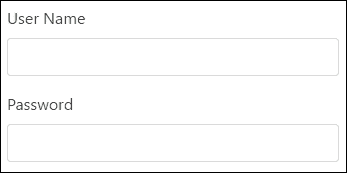

## 内联表单

如果需要将表单元素布置在一个水平行中，并与左侧对齐，请使用`form-inline`类。

### 注

表单仅在大于 768px 的视口中对齐内联控件。

表单控件的行为不同，因为它们接收的是`width:auto`而不是`width: 100%`。使用`display: inline-block`为所有这些部件提供垂直对齐。您可能需要手动处理单个控件的宽度和对齐方式：

```ts
<form  class="form-inline"> 
  <div class="form-group"> 
    <label for="user_name">User Name</label> 
    <input type="text" class="form-control" id="user_name"> 
  </div> 
  <div class="form-group"> 
    <label for="password">Password</label> 
    <input type="password" class="form-control" id="password"> 
  </div> 
</form> 

```

### 注

每个表单控件都应该有 pair`label`元素。

我只在表单元素中添加了`form-inline`类，以便水平布局元素：

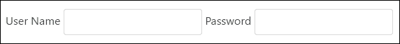

## 隐藏标签

可以隐藏标准表单和内联表单占位符的标签：

```ts
<form  class="form-inline"> 
  <div class="form-group"> 
    <label class="sr-only" for="user_name">User Name</label> 
    <input type="text" class="form-control" id="user_name"  

 placeholder="User Name">

  </div> 
  <div class="form-group"> 
    <label class="sr-only" for="password">Password</label> 
    <input type="password" class="form-control" id="password"  

 placeholder="Password">

  </div> 
</form> 

```

我们只是将`sr-only`类添加到每个标签中：


为什么我们不能从表单中删除标签以使其不可见？这个问题的答案在于为能力有限的人使用辅助技术，如屏幕阅读器。如果我们没有为每个输入包含标签，屏幕阅读器将错误地呈现表单。Bootstrap 的作者有意设计了`sr-only`类，以便仅为屏幕阅读器从呈现页面的布局中隐藏信息。

## 表单控制大小

除了默认的表单控件外，还有两个额外大小的表单控件，我们可以使用它们来增加或减少表单的大小：

*   使用`form-control-lg`增加输入控件的大小
*   使用`form-control-sm`减小输入控件的大小

## 帮助文本

有时我们需要显示相关表单控件的帮助文本。Bootstrap 4 支持标准和内联表单的帮助文本。

您可以使用`form-text`类创建块级帮助。它包括`display: block`并添加了一些顶部边距，以便与前面的输入隔开：

```ts
<form> 
  <div class="form-group"> 
    <label for="user_name">User Name</label> 
    <input type="text" class="form-control" id="user_name"> 
  </div> 
  <div class="form-group"> 
    <label for="password">Password</label> 
    <input type="password" class="form-control" id="password"> 

 <p id="passwordHelpBlock" class="form-text text-muted"> 

 The password must be more than 8 characters long. 

 </p>

  </div> 
</form> 

```


将`text-muted`类与任何典型的内联元素（如`span`或`small`）一起使用，为内联表单创建帮助文本：

```ts
<form  class="form-inline"> 
  <div class="form-group"> 
    <label for="user_name">User Name</label> 
    <input type="text" class="form-control" id="user_name"> 
  </div> 
  <div class="form-group"> 
    <label for="password">Password</label> 
    <input type="password" class="form-control" id="password"> 

 <small id="passwordHelpInline" class="text-muted"> 

 Must be 8-20 characters long. 

 </small>

  </div> 
</form> 

```


## 表格网格布局

我们可以使用 bootstrap4 网格为表单创建更结构化的布局。以下是一些准则：

*   用`container`类将表单包装在元素中
*   将`row`类添加到`form-group`
*   使用`col-*-*`类指定标签和控件的宽度
*   向所有标签添加`col-form-label`类，使其与相应控件垂直对齐
*   将`col-form-legend`添加到图例元素，以帮助它们看起来类似于常规标签

让我们用网格更新标记：

```ts
<div class="container"> 
  <form> 
    <div class="form-group row"> 
      <label for="user_name" class="col-sm-2 col-form-label"> 
        User Name 
      </label> 
      <div class="col-sm-10"> 
        <input type="text" class="form-control" id="user_name"> 
      </div> 
    </div> 
    <div class="form-group row"> 
      <label for="password" class="col-sm-2 col-form-label"> 
        Password 
      </label> 
      <div class="col-sm-10"> 
        <input type="password" class="form-control" id="password"> 
      </div> 
    </div> 
    <div class="form-group row"> 
      <label class="col-sm-2">Connection</label> 
      <div class="col-sm-10"> 
        <div class="form-check"> 
          <label class="form-check-label"> 
            <input class="form-check-input" type="checkbox">  
              Secure (SSL) 
          </label> 
        </div> 
      </div> 
    </div> 
    <div class="form-group row"> 
      <div class="offset-sm-2 col-sm-10"> 
        <button type="submit" class="btn btn-primary">Sign in 
        </button> 
      </div> 
    </div> 
  </form> 
</div> 

```


## 堆叠的复选框和收音机

Bootstrap4 在`form-check*`类的帮助下改进了复选框和单选按钮的布局和行为。这两种类型只有一个类来帮助垂直堆叠和分隔同级元素。标签和输入必须具有适当的`form-check-label`和`form-check-input`类，才能实现这种神奇的效果。

```ts
<div class="container"> 
  <form> 
    <div class="form-group row"> 
    <label for="user_name" class="col-sm-2 col-form-label"> 
      User Name 
    </label> 
    <div class="col-sm-10"> 
      <input type="text" class="form-control" id="user_name"> 
      </div> 
    </div> 
    <div class="form-group row"> 
      <label for="password"  
             class="col-sm-2 col-form-label">Password</label> 
      <div class="col-sm-10"> 
        <input type="password" class="form-control" id="password"> 
      </div> 
    </div> 
    <fieldset class="form-group row"> 
      <legend class="col-form-legend col-sm-2">Language</legend> 
      <div class="col-sm-10"> 
        <div class="form-check"> 

<label class="form-check-label"> 
            <input class="form-check-input" type="radio"  
                   name="language" id="lngEnglish" value="english"  
                   checked> 
            English 
          </label>

        </div> 
        <div class="form-check"> 

<label class="form-check-label"> 
            <input class="form-check-input" type="radio"  
                   name="language" id="lngFrench" value="french"> 
            French 
          </label>

        </div> 
        <div class="form-check disabled"> 

<label class="form-check-label"> 
            <input class="form-check-input" type="radio"  
                   name="language" id="lngSpain" value="spain"   
                   disabled> 
            Spain 
          </label>

        </div> 
      </div> 
    </fieldset> 
  </form> 
</div> 

```


## 内联复选框和收音机

在需要在水平行上显示复选框或单选按钮的场景中，您可以：

*   将`form-check-inline`类添加到 label 元素
*   将`form-check-input`添加到输入中

```ts
<form  class="form-inline"> 
  <div class="form-group"> 
    <label for="user_name">User Name</label> 
    <input type="text" class="form-control" id="user_name"> 
  </div> 
  <div class="form-group"> 
    <label for="password">Password</label> 
    <input type="password" class="form-control" id="password"> 
    <small id="passwordHelpInline" class="text-muted"> 
      Must be 8-20 characters long. 
    </small> 
  </div> 
  <div class="form-group"> 

 <label class="form-check-inline"> 

 <input class="form-check-input" type="radio" name="language" 

 id="lngEnglish" value="english" checked> 

 English 

 </label> 

 <label class="form-check-inline"> 

 <input class="form-check-input" type="radio" name="language" 

 id="lngFrench" value="french"> 

 French 

 </label> 

 <label class="form-check-inline"> 

 <input class="form-check-input" type="radio" name="language" 

 id="lngSpain" value="spain" disabled> 

 Spain 

 </label>

  </div> 
</form> 

```


## 静态控制

在需要显示纯文本而不是输入字段的情况下，可以使用标有`form-control-static`类的段落元素：

```ts
<div class="container"> 
  <form> 
    <div class="form-group row"> 
      <label for="user_name" class="col-sm-2 col-form-label"> 
        User Name 
      </label> 
      <div class="col-sm-10"> 

 <p class="form-control-static">Admin</p>

      </div> 
    </div> 
    <div class="form-group row"> 
      <label for="password" class="col-sm-2 col-form-label"> 
        Password 
      </label> 
      <div class="col-sm-10"> 
        <input type="password" class="form-control" id="password"> 
      </div> 
    </div> 
  </form> 
</div> 

```

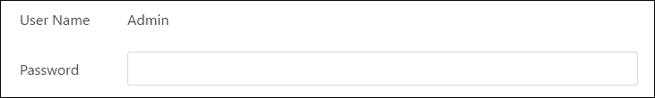

## 禁用状态

我们可以禁用具有相同名称属性的一个或多个控件的输入：

```ts
<form> 
  <div class="form-group"> 
    <label for="user_name">User Name</label> 

<input type="text" class="form-control" id="user_name"  
           value="Admin" disabled>

  </div> 
  <div class="form-group"> 
    <label for="password">Password</label> 
    <input type="password" class="form-control" id="password"> 
    <p id="passwordHelpBlock" class="form-text text-muted"> 
      The password must be more than 8 characters long. 
    </p> 
  </div> 
</form> 

```

禁用的输入字段显示得更亮，并带有`not-allowed`光标：

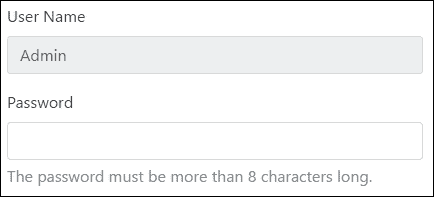

### 注

使用自定义 JavaScript 代码禁用锚点和字段集，因为 IE 11 及以下浏览器不完全支持此属性。

## 只读输入

要防止修改任何输入字段，可以使用只读属性：

```ts
<form> 
  <div class="form-group"> 
    <label for="user_name">User Name</label> 

<input type="text" class="form-control" id="user_name"  
           value="Admin" readonly>

  </div> 
  <div class="form-group"> 
    <label for="password">Password</label> 
    <input type="password" class="form-control" id="password"> 
    <p id="passwordHelpBlock" class="form-text text-muted"> 
      The password must be more than 8 characters long. 
    </p> 
  </div> 
</form> 

```

使用标准光标，这些字段显示得更亮：


## 验证风格

Bootstrap支持表单控件的三种验证状态和适当样式：

*   `has-success`类定义成功状态
*   `has-danger`类定义了危险状态
*   `has-warning`类定义了警告状态

我们应该将这些类应用于父元素，这样所有的`control-label`、`form-control`或`text-muted`元素都将继承验证样式。我们可以在文本输入中使用反馈图标，如`form-control-success`、`form-control-warning`和`form-control-danger`。为了更加注意验证，我们可以借助`form-control-feedback`风格使用上下文验证文本。它根据父`has-*`类调整颜色：

```ts
<form> 
    <div class="form-group 
has-success

"> 
        <label class="control-label" for="username">Success 
        </label> 
        <input type="text" class="form-control  

form-control-success

" id="username"> 
        <div class="
form-control-feedback

">That username's is  
           ok.</div> 
    </div> 

    <div class="form-group 
has-warning

"> 
        <label class="control-label" for="password">Warning 
        </label> 
        <input type="password" class="form-control  

form-control-warning

" id="password"> 
        <div class="
form-control-feedback

">The password is  
           weak</div> 
    </div> 

    <div class="form-group 
has-danger

"> 
        <label class="control-label" for="card">Card</label> 
        <input type="card" class="form-control  

 form-control-danger

"  
            id="card"> 
        <div class="
form-control-feedback

">We accept only VISA and  
             Master cards</div> 
    </div> 
</form> 

```

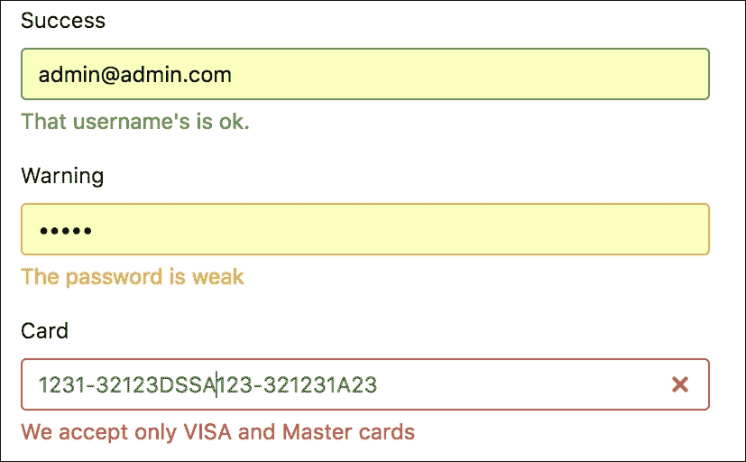

# 无形搜索

查看`product-search.component.html`文件中的标记：

```ts
<div class="card"> 
    <div class="card-header">Quick Shop</div> 
    <div class="input-group"> 

 <input #search type="text" class="form-control" 

 placeholder="Search for..."> 

 <span class="input-group-btn"> 

 <button class="btn btn-secondary" type="button" 

 (click)="searchProduct(search.value)">Go!</button> 

 </span>

    </div> 
</div> 

```

我没有在这里使用`form`标签。为什么？答案相当棘手。表单标签主要用于以下场景：

*   您希望执行一个非 AJAX 请求或向服务器发送文件
*   您需要以编程方式捕获`submit`或`reset`事件
*   您想向表单中添加验证逻辑

对于其他人，我们可以放弃它。搜索字段背后的逻辑是使用适当的信息更新 URL，而无需向服务器发出任何请求。这就是为什么搜索是无形的。

搜索表单有一个问题；即使搜索字段为空，**Go**按钮始终处于启用状态。这会导致不适当的搜索结果。我们需要添加验证来解决此问题，这里有两个选项：

*   开始收听搜索字段中的关键事件，以管理**Go**按钮的`enabled`属性
*   添加验证，让 Angular 管理**Go**按钮的`enabled`属性

让我们两个都做，看看有什么不同。

## 来自事件对象的用户输入

用户与网页交互，修改控件，这会触发 DOM 事件。我们使用事件绑定来侦听通过一些简单语法更新组件和模型的事件：

```ts
<div class="card"> 
    <div class="card-header">Quick Shop</div> 
    <div class="input-group"> 
        <input #search type="text" class="form-control"     
               placeholder="Search for..."  

 (keyup)="searchChanged($event)">

        <span class="input-group-btn"> 
            <button class="btn btn-secondary" type="button"  

 [disabled]="disabled"

                (click)="searchProduct(search.value)">Go!</button> 
        </span> 
    </div> 
</div> 

```

`$event`的形状取决于引发事件的元素。当用户在输入元素上键入内容时，它会触发键盘事件，并通过`ProductSearchComponent`的`searchChanged`方法进行监听：

```ts
import {Component} from '@angular/core'; 
import {Router} from '@angular/router'; 

@Component({ 
    selector: 'db-product-search', 
    templateUrl: 'app/product/product-search.component.html' 
}) 
export class ProductSearchComponent { 

 disabled: boolean = true;

    constructor(private router: Router) {} 

    searchProduct(value: string) { 
        this.router.navigate(['/products'], { queryParams: {  
        search: value} }); 
    } 

 searchChanged(event: KeyboardEvent) { 

 // Get an input element 

 let element:HTMLInputElement = 

 <HTMLInputElement>event.target; 

 // Update the disabled property depends on value 

 if (element.value) { 

 this.disabled = false; 

 } else { 

 this.disabled = true; 

 } 

 }

} 

```

首先，我们从事件`target`中找到输入元素，并更改绑定到`submit`按钮的同名属性的组件的`disabled`属性。默认情况下，“禁用”值等于 true，“提交”按钮灰显：

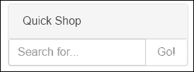

当用户输入要搜索的文本时，触发的事件使按钮能够更新 URL：

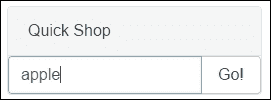

## 来自模板参考变量的用户输入

[input like MENT]我们可以直接使用该模板中的[input like MENT]值来输入 like T0：

```ts
<div class="card"> 
    <div class="card-header">Quick Shop</div> 
    <div class="input-group"> 
        <input #search type="text" class="form-control"  
              placeholder="Search for..."  

 (keyup)="searchChanged(search.value)">

        <span class="input-group-btn"> 
            <button class="btn btn-secondary" type="button"  
                [disabled]="disabled" 
                (click)="searchProduct(search.value)">Go!</button> 
        </span> 
    </div> 
</div> 

```

`searchChanged`方法的代码变小了一点：

```ts
searchChanged(value: string) { 
    // Update the disabled property depends on value  
    if (value) { 
        this.disabled = false; 
    } else { 
        this.disabled = true; 
    } 
} 

```

### 注

选择使用模板引用变量将值而不是 DOM 事件传递到组件侦听方法中。

您可以在`chapter_7/2.ecommerce-key-event-listenning`找到源代码。

# 产品视图

产品网格中显示的产品卡片组件有一个**更多信息**按钮。当用户单击按钮时，它将导航到产品视图，您可以在其中执行以下操作：

*   显示产品信息
*   检查产品的可用性
*   点击**添加到购物车**或**从购物车删除**更新产品数量
*   点击**继续购物**返回产品列表


产品视图的线框

让我们创建`product-view.component.html`。这个视图的内容相当大，所以我将在每列中解释它。

## 产品形象

在第一列中，我们显示产品的图像。产品界面参考了大型图像，因此在屏幕上显示很简单：

```ts
<div class="container"> 
    <div class="row"> 
      <div class="col-md-5"> 

 

     </div> 
     <!-- ... --> 

```

以下是本专栏的内容：


## 产品信息

第二列保存有关产品的信息。我决定使用Bootstrap 4 卡组件在屏幕上显示信息：

```ts
<div class="col-md-4"> 
    <div class="card"> 
        <div class="card-block"> 
            <h4 class="card-title">{{product.title}}</h4> 
            <p class="card-text">{{product.desc}}</p> 
        </div> 
        <ul class="list-group list-group-flush"> 
            <li class="list-group-item">ID: {{product.id}}</li> 
            <li class="list-group-item">Category:  
                {{product.categoryId | categoryTitle}}</li> 
        </ul> 
        <div class="card-footer"> 
            <p class="card-text">Availability: In Stock</p> 
        </div> 
    </div> 
    <div class="card" *ngIf="!product.isSpecial"> 
        <div class="card-block"> 
            <h4 class="card-title">Price:  
              {{product.price | currency:'USD':true:'1.2-2'}}</h4> 
        </div> 
    </div> 
    <div class="card card-inverse card-danger"  
         *ngIf="product.isSpecial"> 
        <div class="card-block"> 
            <h4 class="card-title">Price:  
              {{product.price | currency:'USD':true:'1.2-2'}}</h4> 
        </div> 
    </div> 
</div> 

```

我们这里有三张牌。第一个包含产品的一般信息，如`title`和`description`。以下列表保存产品`id`和`category`。我们使用`categoryTitle`管道打印类别标题。最后，我们用假数据打印出可用性信息。我们将在下一章中更新此块，因此暂时保持原样。


第二张卡和第三张卡相互作用，并根据产品的`isSpecial`属性值显示信息。当此属性为`true`时，我们会以改变颜色显示价格：

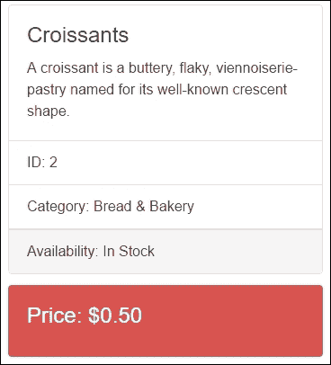

## 分类管

正如[第 4 章](04.html#page "Chapter 4. Creating the Template")中提到的*创建模板*，Angular 框架为我们提供了管道：一种写入显示值转换的方法，我们可以在模板中声明。管道是一个简单的函数，它接受输入值并返回转换后的值。在本例中，我们将类别 ID 保留在购物车项目中，但需要显示类别的标题。因此，我们创建了具有以下内容的文件`category.pipe.ts`：

```ts
import {Pipe, PipeTransform} from '@angular/core'; 
import {Category, CategoryService} from './category.service'; 

/* 
 * Return category title of the value 
 * Usage: 
 *   value | categoryTitle 
 * Example: 
 *   {{ categoryId |  categoryTitle }} 
 *   presume categoryId='1' 
 *   result formats to 'Bread & Bakery' 
*/ 
@Pipe({ name: 'categoryTitle' }) 
export class CategoryTitlePipe implements PipeTransform { 

    constructor(private categoryService: CategoryService) { } 

    transform(value: string): string { 
        let category: Category = this.categoryService.getCategory(value); 
        return category ? category.title : ''; 
    } 
} 

```

另外，我们更新了`CategoryModule`以申报并出口`CategoryTitlePipe`：

```ts
import {NgModule} from '@angular/core'; 
import {CommonModule} from '@angular/common'; 
import {RouterModule} from '@angular/router'; 

import {CategoryListComponent} from './category-list.component'; 

import {CategoryTitlePipe} from './category.pipe';

import {CategoryCardComponent} from './category-card.component'; 
import {CategorySlideComponent} from './category-slide.component'; 

import {CategoryService} from './category.service'; 

@NgModule({ 
    imports: [CommonModule, RouterModule], 
    declarations: [CategoryListComponent, CategoryTitlePipe,  
                   CategoryCardComponent, CategorySlideComponent], 
    exports: [CategoryListComponent, CategoryTitlePipe,  
              CategoryCardComponent, CategorySlideComponent], 
    providers: [CategoryService] 
}) 
export class CategoryModule {} 

```

现在，`CategoryTitlePipe`可在整个应用程序中使用。

## 产品视图中的购物车信息

在最后一列中，我使用了购物车组件中的 bootstrap4 表单来保存和管理购物车中的信息，如下所述。

### 数量和金额

产品的数量和数量对用户购物至关重要。为了在视图中显示它们，我将同名的组件属性绑定到模板：

```ts
<div class="form-group row">
    <label for="first_name" class="col-xs-3 form-control-label">Quantity</label>
    <div class="col-xs-9">
        <h4 class="form-control-static">{{quantity}}</h4>
    </div>
</div>

<div class="form-group row">
    <label for="last_name" class="col-xs-3 form-control-label">Amount</label>
    <div class="col-xs-9">
        <h4 class="form-control-static">{{amount | currency:'USD':true:'1.2-2'}}</h4>
    </div>
</div> 

```

### 行动

用户使用**添加到购物车**和**从购物车中移除**按钮来增加和减少购物车上的产品数量。这些按钮调用`CartService`的相应方法在购物车中进行必要的更改：

```ts
    <div class="form-group row"> 
        <div class="col-xs-12"> 

 <a class="btn btn-primary btn-block" 

 (click)="addToCart()">Add to Cart</a> 

 <a class="btn btn-warning btn-block" 

 (click)="removeFromCart()">Remove from Cart</a>

        </div> 
    </div> 
    <div class="form-group row"> 
        <div class="col-xs-12"> 

 <a class="btn btn-secondary btn-block" 

 [routerLink]="['/products']">Continue Shopping</a>

        </div> 
    </div> 
</form> 

```

最后，我们有一个**继续购物**按钮，帮助用户导航回产品视图。

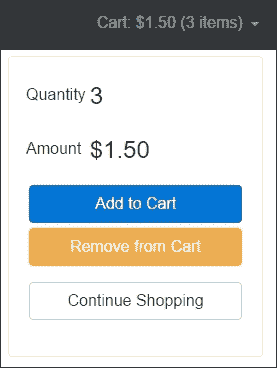

每次用户从购物车添加或删除产品时，产品视图中都会发生更改，从而更新导航栏中购物车菜单中的信息。

## 产品视图组件

现在让我们用以下代码创建`product-view.component.ts`：

```ts
import { Component } from '@angular/core'; 
import { ActivatedRoute } from '@angular/router'; 

import { Product, ProductService } from './product.service'; 
import { Cart, CartItem, CartService } from  
    '../cart/cart.service'; 

@Component({ 
    selector: 'db-product-view', 
    templateUrl: 'app/product/product-view.component.html' 
}) 
export class ProductViewComponent { 
    product: Product; 
    cartItem: CartItem; 

    get quantity(): number { 
        return this.cartItem ? this.cartItem.count : 0; 
    } 

    get amount(): number { 
        return this.cartItem ? this.cartItem.amount : 0; 
    } 

    constructor(private route: ActivatedRoute,  
                private productService: ProductService,  
                private cartService: CartService) { 
        this.route 
            .params 
            .subscribe(params => { 
                // Get the product id 
                let id: string = params['id']; 
                // Return the product from ProductService 
                this.product = this.productService.getProduct(id); 
                // Return the cart item 
                this.cartItem = this.cartService.findItem(id); 
            }); 
    } 

    addToCart() { 
     this.cartItem = this.cartService.addProduct(this.product); 
    } 

    removeFromCart() { 
     this.cartItem = this.cartService.removeProduct(this.product); 
    } 
} 

```

`ProductViewComponent`中有两个属性`product`和`cartItem,`可用于获取模板的信息。我们使用`product`属性在产品视图的第二列中显示信息。`cartItem`属性保留购物车中与产品链接的项目的引用：

```ts
export interface CartItem { 
    product: Product; 
    count: number; 
    amount: number; 
} 

```

我们只需要在产品视图的第三列显示`count`和`amount`，但如果没有额外的工作，这是不可能的：

第一个问题是，在将产品添加到购物车之前，我们无法显示来自`CartItem`的信息。为了解决这个问题，我们介绍了用于`count`和`amount`性质的吸气剂方法：

```ts
get quantity(): number { 
    return this.cartItem ? this.cartItem.count : 0; 
} 

get amount(): number { 
    return this.cartItem ? this.cartItem.amount : 0; 
} 

```

当用户第一次将产品添加到购物车或从购物车中删除最后一个产品时，会发生另一个问题。作为解决方案，我们需要在调用`addToCart`和`removeFromCart`方法时从购物车中重新分配`cartItem`：

```ts
addToCart() { 
    this.cartItem = this.cartService.addProduct(this.product); 
} 

removeFromCart() { 
    this.cartItem = this.cartService.removeProduct(this.product); 
} 

```

我们使用`ActivatedRoute`服务在构造函数中检索路由的参数。由于我们的参数是以`Observable`形式提供的，因此我们按名称订阅`id`参数，并告知`productService`和`cartService`获取适当的信息。我们将保留一个参考`Subscription`，以便稍后整理。

## 将 ProductView 添加到 ProductModule

打开`product.module.ts`文件引用`ProductView`文件：

```ts
import {NgModule} from '@angular/core'; 
import {CommonModule} from '@angular/common'; 
import {RouterModule} from '@angular/router'; 

import {ProductListComponent} from './product-list.component'; 

import {ProductViewComponent} from './product-view.component';

import {ProductCardComponent} from './product-card.component'; 
import {ProductSearchComponent} from './product-search.component'; 
import {ProductGridComponent} from './product-grid.component'; 

import {ProductService} from './product.service'; 

import {CategoryModule} from './category/category.module'; 

@NgModule({ 
    imports: [CommonModule, RouterModule, CategoryModule], 
    declarations: [ProductListComponent, 
ProductViewComponent

,  
         ProductCardComponent, ProductSearchComponent,  
         ProductGridComponent], 
    exports: [ProductListComponent, 
ProductViewComponent

,  
         ProductCardComponent, ProductSearchComponent,  
         ProductGridComponent], 
    providers: [ProductService] 
}) 
export class ProductModule {} 

```

`ProductView`现在可在整个应用程序中使用。

## 带参数的产品视图路线定义

我们必须在`app.routes.ts`中更新路由配置，所以当用户选择产品时，Angular 会导航到`ProductViewComponent`：

```ts
/* 
 * Angular Imports 
 */ 
import {Routes, RouterModule} from '@angular/router'; 

/* 
 * Components 
 */ 
import {WelcomeComponent} from './welcome/welcome.component'; 
import {ProductListComponent} from  
       './product/product-list.component'; 

import {ProductViewComponent} from 

 './product/product-view.component';

/* 
 * Routes 
 */ 
const routes: Routes = [ 
  { path: '', redirectTo: 'welcome', pathMatch: 'full' }, 
  { path: 'welcome', component: WelcomeComponent }, 
  { path: 'products', component: ProductListComponent }, 

 { path: 'products/:id', component: ProductViewComponent },

]; 

/* 
 * Routes Provider 
 */ 
export const routing = RouterModule.forRoot(routes); 

```

第三条路由中的`id`是路由参数的令牌。在像`/product/123`这样的 URL 中，`123`是`id`参数的值。相应的`ProductViewComponent`使用该值查找并呈现`id`等于`123`的产品。

## 产品视图导航

当用户在产品视图中点击卡片上的**更多信息**按钮时，路由使用作为阵列提供给`routerLink`的信息来构建产品视图的导航 URL：

```ts
<div class="card-deck-wrapper"> 
    <div class="card-deck"> 
        <div class="card" *ngFor="let product of products"> 
            <div class="card-header text-xs-center"> 
                {{product.title}} 
            </div> 
             
            <div class="card-block text-xs-center"  
                 [ngClass]="setClasses(product)"> 
                <h4 class="card-text">Price:  
                    ${{product.price}}</h4> 
            </div> 
            <div class="card-footer text-xs-center"> 
                <button class="btn btn-primary"  
                  (click)="buy(product)">Buy Now</button> 

 <a class="btn btn-secondary" 

 [routerLink]="['/products', product.id]"> 

 More Info 

 </a>

            </div> 
            <div class="card-block"> 
                <p class="card-text">{{product.desc}}</p> 
            </div> 
        </div> 
    </div> 
</div> 

```

以下是产品视图的所有三列的外观：


### 提示

您可以在`chapter_7/3.ecommerce-product-view`找到源代码。

# 两种形式

我们以前在项目中没有使用 Angular 2 表单，所以现在是时候展示那些主要灵活的工具了。根据用户请求的 web 应用程序信息的性质，我们可以将其分为静态和动态两种形式：

*   我们使用模板驱动的方法来构建静态表单
*   我们使用模型驱动的方法来构建动态表单

## 表单设置

在使用新的 Angular 2 forms 模块之前，我们需要安装它。打开终端窗口，导航到 web 项目，并使用以下命令运行 npm 包管理器：

```ts
$ npm install @angular/forms --save

```

现在，当安装 forms 模块时，我们将在应用程序Bootstrap期间启用它。打开`app.module.ts`文件并用以下代码更新：

```ts
/* 
 * Angular Imports 
 */ 
import { NgModule } from '@angular/core'; 
import { BrowserModule } from '@angular/platform-browser'; 

import { FormsModule, ReactiveFormsModule } from '@angular/forms';

import { RouterModule } from '@angular/router'; 

/** 
 * Modules 
 */ 
import { CartModule } from './cart/cart.module'; 
import { CategoryModule } from './category/category.module'; 
import { ProductModule } from './product/product.module'; 

/* 
 * Components 
 */ 
import { AppComponent } from './app.component'; 
import { NavbarComponent } from './navbar/navbar.component'; 
import { FooterComponent } from './footer/footer.component'; 
import { WelcomeComponent } from './welcome/welcome.component'; 

/* 
 * Routing 
 */ 
import { routing } from './app.routes'; 

@NgModule({ 
  imports: [ 
    BrowserModule, 
FormsModule, ReactiveFormsModule,

    routing, CartModule, CategoryModule, ProductModule], 
  declarations: [AppComponent, NavbarComponent, FooterComponent, 
    WelcomeComponent], 
  bootstrap: [AppComponent] 
}) 
export class AppModule { } 

```

我们在`AppModule`中注册了两个不同的模块，因为：

*   `FormsModule`用于模板驱动表单
*   `ReactiveFormsModule`表示被动或动态形式

我们很快就会发现它们。

## 模板驱动表单

这种方法是构建表单最简单的方法，几乎不需要应用程序代码。我们在模板中声明性地创建表单，并借助内置的 Angular 2 指令为我们在幕后发挥所有的魔力。让我们讨论一下表单中可以使用的特定于 Angular 2 的指令。

## NgForm 指令

`NgForm`指令创建一个顶级`FormGroup`实例，提供有关表单当前状态的信息，例如：

*   JSON 格式的表单值
*   形式有效状态

从 Angular 2 的源代码中看`form_group_directive.ts`中类`FormGroupDirective`的指令定义：

```ts
@Directive({ 
  selector: '[formGroup]', 
  providers: [formDirectiveProvider], 
  host: {'(submit)': 'onSubmit()', '(reset)': 'onReset()'}, 

 exportAs: 'ngForm'

}) 
export class FormGroupDirective extends ControlContainer implements Form, OnChanges { // 

```

指令元数据的属性`exportAs`通过名称`ngForm`向模板公开`FormGroupDirective`的一个实例，因此在任何模板中，我们都可以使用引用该实例的模板变量：

```ts
<form #myForm="ngForm"> 
    ... 
</form> 

```

模板变量`myForm`可以访问表单值，所以我们可以使用 handle 函数来管理提交值，如下所示：

```ts
<form #myForm="ngForm" (ngSubmit)="handle(myForm.value)"> 
    ... 
</form> 

```

`ngSubmit`是用户触发表单提交的事件信号。

## NgModel 指令

`NgModel`指令帮助在`NgForm`实例上注册表单控件。我们必须为每个表单控件指定`name`属性。通过`ngModel`和`name`属性的组合，表单控件将自动出现在表单的`value`中：

```ts
<form #myForm="ngForm" (ngSubmit)="handle(myForm.value)"> 
    <label>User Name:</label> 
    <input type="text" name="name" 
ngModel

> 
    <label>Password:</label> 
    <input type="password" name="password" 
ngModel

> 

    <button type="submit">Submit</button> 
</form> 

```

让我们在`handle`函数中打印出表单的`value`：

```ts
handle(value) { 
    console.log(value); 
} 

```

结果以 JSON 格式打印：

```ts
{ 
  name: 'User', 
  password: 'myPassword' 
} 

```

我们可以使用`ngModel`作为带有表达式的属性指令，将现有模型绑定到表单控件。我们有两种方法可以做到这一点。

**单向绑定**通过属性绑定将现有值应用于表单控件：

```ts
<form #myForm="ngForm" (ngSubmit)="handle(myForm.value)"> 
    <label>User Name:</label> 
    <input type="text" name="name" [ngModel]="name"> 
    <label>Password:</label> 
    <input type="password" name="password" [ngModel]="password"> 
    <label>Phone:</label> 
    <input type="text" name="phone" [ngModel]="phone"> 
    <label>Email:</label> 
    <input type="email" name="email" [ngModel]="email"> 

    <button type="submit">Submit</button> 
</form> 

```

在`MyForm`类中，我们有相同名称的属性：

```ts
@Component({...}) 
export class MyForm { 

 name: string = 'Admin'; 

 password: string; 

 phone: string; 

 email: string = 'admin@test.com';

    handle(value) { 
        console.log(value); 
    } 
} 

```

**双向绑定**反映了表单控件对属性现有值的更改，反之亦然：

```ts
<form #myForm="ngForm" (ngSubmit)="handle(myForm.value)"> 
    <label>User Name:</label> 
    <input type="text" name="name" [(ngModel)]="name"> 
    <p>Hi {{name}}</p> 
    <button type="submit">Submit</button> 
</form> 

```

## NGM 模型跟踪变化状态及有效性

每次我们手动或编程操作表单控件时，`NgModel`都会跟踪它们上发生的状态更改。基于该信息，`NgModel`使用特定类更新控件。我们可以使用这些类来组织视觉反馈，以反映组件的状态：

*   类`ng-untouched`标记尚未访问的控件
*   类`ng-touched`标记访问的控件
*   类`ng-pristine`用未更改的值标记控件
*   类`ng-dirty`用更改的值标记控件
*   类`ng-invalid`标记无效控件
*   类`ng-valid`标记有效控件

因此，我们应该能够使用`ng-valid`或`ng-invalid`类向用户反馈无效的表单控件。让我们打开`ecommerce.css`文件并添加以下样式：

```ts
.ng-valid[required], .ng-valid.required  { 
  border-left: 2px solid green; 
} 

.ng-invalid:not(form)  { 
  border-left: 2px solid red; 
} 

```

现在，所有标记为必填字段的控件将显示绿色左边框，而所有无效字段将显示红色左边框。

## NgModelGroup 指令

我们可以将表单控件分组到控件组中。控制组本身就是一个表单。可以跟踪组中控件的有效状态。与控件使用`ngModel`指令一样，组使用`NgModelGroup`指令：

```ts
<form #myForm="ngForm" (ngSubmit)="handle(myForm.value)"> 
    <fieldset 
ngModelGroup="user"

> 
        <label>User Name:</label> 
        <input type="text" name="name" ngModel> 
        <label>Password:</label> 
        <input type="password" name="password" ngModel> 
    </fieldset> 
    <fieldset 
ngModelGroup="contact"

> 
        <label>Phone:</label> 
        <input type="text" name="phone" ngModel> 
        <label>Email:</label> 
        <input type="email" name="email" ngModel> 
    </fieldset> 
    <button type="submit">Submit</button> 
</form> 

```

我们可以使用`fieldset`或`div`元素对控件进行分组。在`ngModelGroup,`的帮助下，我们将控件语义分组为`user`和`contact`信息：

```ts
{ 
  user: { 
    name: 'User', 
    password: 'myPassword' 
  }, 
  contact: { 
    phone: '000-111-22-33', 
    email: 'test@test.com' 
  } 
} 

```

## 模型驱动表单

这种方法有助于构建没有 DOM 需求的表单，并使它们易于测试。这并不意味着我们不需要模板。我们需要它们与模型驱动方式相结合。我们在模板中创建表单，并创建表示 DOM 结构的表单模型。我们可以在这里使用两种不同的 API：

*   基于`FormGroup`和`FormControl`类的底层 API
*   基于`FormBuilder`类的高级 API

任何形式都是`FormGroup`。任何`FormGroup`表示一组`FormControls`。假设我们有以下模板：

```ts
<form> 
    <label>User Name:</label> 
    <input type="text" name="name"> 
    <label>Password:</label> 
    <input type="password" name="password"> 
    <label>Phone:</label> 
    <input type="text" name="phone"> 
    <label>Email:</label> 
    <input type="email" name="email"> 

    <button type="submit">Submit</button> 
</form> 

```

现在为我们的表单创建一个模型：

```ts
import { Component } from '@angular/core'; 
import { FormGroup, FormControl } from '@angular/forms'; 

@Component({...}) 
export class MyForm { 

  myForm:FormGroup = new FormGroup({ 
    name: new FormControl('Admin'), 
    password: new FormControl(), 
    contact: new FormGroup({ 
      phone: new FormControl(), 
      email: new FormControl() 
    }) 
  }); 
} 

```

`myForm`表示模板中的表单。我们为表单的每个字段创建`FormControl`，为每个组创建`FormGroup`。在第一个属性中，我们为名称指定默认值。`FormGroup`可以包含另一个组，并帮助创建层次结构以复制 DOM 结构。

## FormGroup 指令

现在我们需要借助 Angular 2`FormGroup`指令将模型绑定到表单元素。我们需要将表达式求值分配到`FormGroup`实例中：

```ts
<form [formGroup]="myForm"> 
  ... 
</form> 

```

## FormControlName 指令

下一个非常重要的步骤是将模型属性与表单元素相关联。我们使用`FormControlName`而不是 name 属性来注册控件：

```ts
import {Component} from '@angular/core'; 
import {FormControl, FormGroup, Validators} from '@angular/forms'; 

@Component({ 
  selector: 'logon-form', 
  template: ` 
    <form [formGroup]="form" (ngSubmit)="onSubmit()"> 
      <div *ngIf="userName.invalid">Name is too short. </div> 
      <input formControlName="userName" placeholder="User name"> 
      <input formControlName="password" placeholder="Password"> 
      <input formControlName="phone" placeholder="Phone"> 
      <input formControlName="email" placeholder="Email"> 
      <button type="submit">Submit</button> 
   </form>` 
}) 
export class LogonFormGroup { 
  form = new FormGroup({ 
    userName: new FormControl('', Validators.minLength(2)), 
    password: new FormControl('', Validators.minLength(5)), 
    phone: new FormControl(''), 
    email: new FormControl('') 
  }); 

  get userName(): any { return this.form.get('userName'); } 
  get password(): any { return this.form.get('password'); } 

  constructor() { 
    this.form.setValue({userName: 'admin', password: '12345', phone: '123-123', email: 'mail@example.com'}); 
  } 

  onSubmit(): void { 
    console.log(this.form.value);   
    // Will print {userName: 'admin', password: '12345',  
    // phone: '123-123', email: 'main@example.com'} 
  } 
} 

```

此指令使来自`FormGroup`的`FormControl`和`password`的`userName`与同名的 DOM 元素保持同步。任何更改都以编程方式发生，`FormGroup`属性将立即写入 DOM 元素，反之亦然。我们使用`get`和`set`方法来访问和更新表单属性。

## FormGroupName 指令

如果我们有一组控件，我们可以使用`FormGroupName`指令将一组控件与父项`FormGroupDirective`（正式为`FormGroup`选择器）关联。您应该通过 name 属性指定要链接到哪个嵌套的`FormGroup`元素，因此单独组织子组元素的验证可能非常方便：

```ts
import {Component} from '@angular/core'; 
import {FormControl, FormGroup, Validators} from '@angular/forms'; 

@Component({ 
  selector: 'logon-form', 
  template: ` 
    <form [formGroup]="form" (ngSubmit)="onSubmit()"> 
      <p *ngIf="userName.invalid">Name is invalid.</p> 
      <input formControlName="userName" placeholder="User name"> 
      <input formControlName="password" placeholder="Password"> 
      <fieldset 
formGroupName

="contact"> 
        <input formControlName="phone"> 
        <input formControlName="email"> 
      </fieldset> 
      <button type="submit">Submit</button> 
    </form>` 
}) 
export class LogonFormComponent { 
  form = new FormGroup({ 
    userName: new FormControl('', Validators.minLength(2)), 
    password: new FormControl('', Validators.minLength(5)), 

    contact: new FormGroup({ 
      phone: new FormControl(''), 
      email: new FormControl('') 
    }) 
  }); 
  get userName(): any { return this.form.get(userName'); } 
  get password(): any { return this.form.get('password'); } 
  get phone(): any { return this.form.get('contact.phone'); } 
  get email(): any { return this.form.get('contact.email'); } 

  constructor() { 
    this.form.setValue({userName: 'admin', password: '12345',  
       phone: '123-123', email: 'mail@example.com'}); 
  } 

  onSubmit() { 
    console.log(this.form.value);    
    // Will print: {userName: 'admin', password: '12345',  
    // phone: '123-123', email: 'main@example.com'} 
    console.log(this.form.status);   
    // Will print: VALID 
  } 
} 

```

我们使用`FormGroup`的 get 方法来访问属性。如前面代码所示，可以通过点语法使用各个控件。

## FormBuilder 类

`FormBuilder`从用户指定的配置创建`AbstractControl`表单对象。因此，我们不是创建`FormGroup`、`FormControl`和`FormArray`元素，而是构建配置来构建模型。我们只需将其注入构造函数并调用`group`方法创建表单组：

```ts
import {Component} from '@angular/core'; 
import {FormBuilder, FormGroup} from '@angular/forms'; 

@Component({...}) 
export class MyForm { 
  myForm:FormGroup; 

  constructor(private 
formBuilder: FormBuilder

) {} 

  ngOnInit() { 
    this.myForm = 
this.formBuilder.group

({ 
      name: [], 
      password: , 
      contect: this.formBuilder.group({ 
        phone: [], 
        email: [] 
      }) 
    }); 
  } 
} 
import {Component, Inject} from '@angular/core'; 
import {FormBuilder, FormGroup, Validators} from '@angular/forms'; 

@Component({ 
  selector: 'logon-form', 
  template: ` 
    <form [formGroup]="form"> 
      <div formGroupName="name"> 
        <input formControlName="first" placeholder="First"> 
        <input formControlName="last" placeholder="Last"> 
      </div> 
      <input formControlName="email" placeholder="Email"> 
      <button>Submit</button> 
    </form> 
    <form [formGroup]="form" (ngSubmit)="onSubmit()"> 
      <p *ngIf="userName.invalid">Name is invalid.</p> 
      <input formControlName="userName" placeholder="User name"> 
      <input formControlName="password" placeholder="Password"> 
      <fieldset 
formGroupName

="contact"> 
        <input formControlName="phone"> 
        <input formControlName="email"> 
      </fieldset> 
      <button type="submit">Submit</button> 
    </form> 
    <p>Value: {{ form.value | json }}</p> 
    <p>Validation status: {{ form.status }}</p> 
  ` 
}) 
export class LogonFormComponent { 
  form: FormGroup; 
  constructor(@Inject(FormBuilder) fb: FormBuilder) { 
    this.form = fb.group({ 
      userName: ['', Validators.minLength(2)], 
      password: ['', Validators.minLength(5)], 

      contact: fb.group({ 
        phone: [''], 
        email: [''] 
      }) 
    }); 
  } 

  get userName(): any { return this.form.get(userName'); } 
  get password(): any { return this.form.get('password'); } 
  get phone(): any { return this.form.get('contact.phone'); } 
  get email(): any { return this.form.get('contact.email'); } 

  constructor() { 
    this.form.setValue({userName: 'admin', password: '12345',  
       phone: '123-123', email: 'mail@example.com'}); 
  } 

  onSubmit() { 
    console.log(this.form.value);    
    // Will print: {userName: 'admin', password: '12345',  
    // phone: '123-123', email: 'main@example.com'} 
    console.log(this.form.status);   
    // Will print: VALID 
  } 
} 

```

因此，我们的代码就不那么冗长了。

## FormControl 指令

在本章的开头，我们讨论了无格式搜索表单。这个表单只有一个元素，我们根本不需要`FormGroup`。Angular 有一个`FormControl`指令，它不必在`FormGroup`内。它仅将其添加到单个表单控件：

```ts
<div class="card"> 
    <div class="card-header">Quick Shop</div> 
    <div class="input-group"> 
        <input #search type="text" class="form-control"  
              placeholder="Search for..."  

 [formControl]="seachControl">

        <span class="input-group-btn"> 
            <button class="btn btn-secondary" type="button"  
                [disabled]="disabled" 
                (click)="searchProduct(search.value)">Go!</button> 
        </span> 
    </div> 
</div> 

```

脚本的更新版本如下所示：

```ts
import {Component} from '@angular/core'; 
import {Router} from '@angular/router'; 

import {FormControl} from '@angular/forms';

@Component({ 
    selector: 'db-product-search', 
    templateUrl: 'app/product/product-search.component.html' 
}) 
export class ProductSearchComponent { 

    disabled: boolean = true; 

 seachControl: FormControl;

    constructor(private router: Router) {} 

 ngOnInit() { 

 this.seachControl = new FormControl(); 

 this.seachControl.valueChanges.subscribe((value: string) => { 

 this.searchChanged(value); 

 }); 

 }

    searchProduct(value: string) { 
        this.router.navigate(['/products'], { queryParams:  
                                         { search: value} }); 
    } 

    searchChanged(value: string) { 
        // Update the disabled property depends on value  
        if (value) { 
            this.disabled = false; 
        } else { 
            this.disabled = true; 
        } 
    } 
} 

```

## 内置验证器

我无法想象没有验证器的表单。Angular 2 附带了几个内置验证器，我们可以声明性地使用它们作为指令，也可以强制使用`FormControl`、`FormGroup`或`FormBuilder`类。以下是它们的列表：

*   具有`required`验证器的表单控件必须具有非空值
*   带有`minLength`的表单控件必须具有最小长度的值
*   带有`maxLength`的表单控件必须具有最大长度的值
*   带有`pattern`的表单控件必须具有与给定正则表达式匹配的值

下面是一个如何以声明方式使用它们的示例：

```ts
<form novalidate> 
  <input type="text" name="name" ngModel 
required

> 
  <input type="password" name="password" ngModel 
minlength="6"

> 
  <input type="text" name="city" ngModel 
maxlength="10"

> 
  <input type="text" name="phone" ngModel  

 pattern="^(\+\d{1,2}\s)?\(?\d{3}\)?[\s.-]\d{3}[\s.-]\d{4}$">

</form> 

```

记住`novalidate`不是 Angular 2 的一部分。它是 HTML5 布尔形式属性。表单在提交时不会验证输入字段。

我们可以在`FormGroup`和`FormControl`中强制使用相同的验证器：

```ts
@Component({...}) 
export class MyForm { 
  myForm: FormGroup; 

  ngOnInit() { 
    this.myForm = new FormGroup({ 
      name: new FormControl('', Validators.required)), 
      password: new FormControl('', Validators.minLength(6)), 
      city: new FormControl('', Validators.maxLength(10)), 
      phone: new FormControl('', Validators.pattern( 
        '[^(\+\d{1,2}\s)?\(?\d{3}\)?[\s.-]\d{3}[\s.-]\d{4}$')) 
    }); 
  } 
} 

```

如前所述，我们可以使用`FormBuilder`和不太详细的代码：

```ts
@Component({...}) 
export class MyForm { 
  myForm: FormGroup; 

  constructor(private fb: FormBuilder) {} 

  ngOnInit() { 
    this. myForm = this.fb.group({ 
      name: ['', Validators.required], 
      password: ['', Validators.minLength(6)], 
      city: ['', Validators.maxLength(10)], 
      phone: ['', Validators.pattern( 
         '[^(\+\d{1,2}\s)?\(?\d{3}\)?[\s.-]\d{3}[\s.-]\d{4}$')] 
    }); 
  } 
} 

```

在这两种情况下，我们必须使用`formGroup`指令将`myForm`模型与 DOM 中的表单元素相关联：

```ts
<form novalidate [
formGroup

]="
myForm

"> 
... 
</form> 

```

## 创建自定义验证器

Angular 2 有一个接口`Validator`，可由充当验证器的类实现：

```ts
export interface Validator {  
    validate(c: AbstractControl): { 
        return [key: string]: any 
    }; 
} 

```

让我们创建一个函数来验证邮政编码的正确性。在`shared`文件夹中创建文件`zip.validator.ts`，代码如下：

```ts
import {FormControl} from '@angular/forms'; 

export function validateZip(c: FormControl) { 
  let ZIP_REGEXP:RegExp = new RegExp('[A-Za-z]{5}'); 

  return ZIP_REGEXP.test(c.value) ? null : { 
    validateZip: { 
      valid: false 
    } 
  }; 
} 

```

函数`validateZip`需要将`FormControl`作为参数，如果值与正则表达式不匹配，则必须返回错误对象；如果值有效，则必须返回 null。现在，我们可以导入`validateZip`函数并在我们的类中使用它：

```ts
import {Component} from '@angular/core'; 
import {
validateZip

} from '../shared/zip.validator'; 
import {FormBuilder, FormGroup, Validators} from '@angular/forms'; 

@Component({...}) 
export class MyForm { 
  form: FormGroup; 

  constructor(private 
fb: FormBuilder

) {} 

  ngOnInit() { 
    this.form = this.fb.group({ 
      name: ['', Validators.required], 
      password: ['', Validators.minLength(6)], 
      city: ['', Validators.maxLength(10)], 
      zip: ['', 
validateZip

] 
    }); 
  } 
} 

```

## 创建自定义验证程序指令

我们可以强制使用 Angular 2 内置的验证器，也可以声明式使用，并借助一些内部代码在表单控件上执行验证器。所有内置和自定义验证器必须在多提供者依赖令牌`NG_VALIDATORS`中注册。正如您在[第 6 章](06.html#page "Chapter 6. Dependency Injection")*依赖注入*中所记得的，提供者的多属性允许向同一令牌注入多个值。Angular 注入`NG_VALIDATORS`，实例化表单，并对表单控件执行验证。让我们创建可以在模板驱动表单中使用的自定义验证指令。打开`zip.valdator.ts`复制粘贴以下代码：

```ts
import {FormControl} from '@angular/forms'; 
import {Directive,forwardRef} from '@angular/core'; 
import {NG_VALIDATORS} from '@angular/forms'; 

export function validateZip(c: FormControl) { 
  let ZIP_REGEXP:RegExp = new RegExp('[A-Za-z]{5}'); 

  return ZIP_REGEXP.test(c.value) ? null : { 
    validateZip: { 
      valid: false 
    } 
  }; 
} 

@Directive({ 
  selector: '[validateZip][ngModel],[validateZip][formControl]', 
  providers: [ 
    {provide: NG_VALIDATORS, useExisting: forwardRef(() =>  
       ZipValidator), multi: true} 
  ] 
}) 
export class ZipValidator { 

  validator: Function = validateZip; 

  validate(c: FormControl) { 
    return this.validator(c); 
  } 
} 

```

现在我们可以使用`ZipValidator`作为指令：

```ts
<form novalidate> 
  <input type="text" name="name" ngModel 
required

> 
  <input type="password" name="password" ngModel 
minlength="6"

> 
  <input type="text" name="city" ngModel 
maxlength="10"

> 
  <input type="text" name="zip" ngModel 
validateZip

> 
</form> 

```

# 购物车视图

购物车视图列出了用户购物车中的所有物品。它显示每个项目的产品详细信息，用户可以从该页面：

*   点击**清除购物车**从其购物车中移除所有商品
*   更新任何列出项目的数量
*   点击**继续**购物返回产品列表
*   点击**结帐**继续结帐

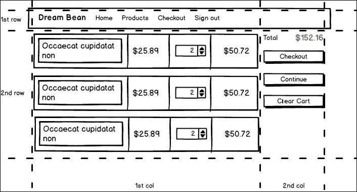

cart 视图的线框

cart 视图的重要部分由网格中的动态内容组成。请看线框的第一列。我们可以使用类似的数据行来显示、修改和验证。为此，我们可以使用Angular静态表单在视图上显示购物车的内容。

让我们创建`cart-view.component.html`。在第一列中，我们需要打印有关添加到购物车中的产品的信息：

```ts
<div *ngIf="cart.count"> 
    <form #form="ngForm"> 
        <div class="table-responsive"> 
            <table class="table table-sm table-striped  
                          table-bordered table-cart"> 
                <tbody> 
                    <tr> 
                        <td class="font-weight-bold">Title</td> 
                        <td class="font-weight-bold">Price</td> 
                        <td class="font-weight-bold">Count</td> 
                        <td class="font-weight-bold">Amount</td> 
                    </tr> 
                    <tr *ngFor="let item of cart.items"> 
                        <td>{{item.product.title}}</td> 
                        <td>{{item.product.price |  
                            currency:'USD':true:'1.2-2'}}</td> 
                        <td> 
                            <input type="number"  
              name="{{item.product.id}}" min="1"  
              [ngModel]="item.count" 
              (ngModelChange)="item.count = update($event, item)"> 
                        </td> 
                        <td>{{item.amount |  
                              currency:'USD':true:'1.2-2'}}</td> 
                    </tr> 
                </tbody> 
            </table> 
        </div> 
    </form> 
</div> 
<div class="emty-cart" *ngIf="!cart.count">The cart is empty!</div> 

```

我们在这里使用模板驱动的方法，并为公开的`ngForm`分配一个表单变量。我将双向绑定格式拆分为两条语句：

*   `[ngModel]="item.count"`：作为属性绑定使用。
*   `(ngModelChange)="item.count = update($event, item)"`：作为事件绑定使用。

每次用户更新`count`值时，此代码调用`update`方法从购物车中添加或删除产品：

```ts
import {Component, Input} from '@angular/core'; 
import {Cart, CartItem, CartService} from './cart.service'; 

@Component({ 
    selector: 'db-cart-view', 
    templateUrl: 'app/cart/cart-view.component.html' 
}) 
export class CartViewComponent { 

    private cart: Cart; 

    constructor(private cartService: CartService) { 
        this.cart = this.cartService.cart; 
    } 

    clearCart() { 
        this.cartService.clearCart(); 
    } 

 update(value, item: CartItem) { 

 let res = value - item.count; 

 if (res > 0) { 

 for (let i = 0; i < res; i++) { 

 this.cartService.addProduct(item.product); 

 } 

 } else if (res < 0) { 

 for (let i = 0; i < -res; i++) { 

 this.cartService.removeProduct(item.product); 

 } 

 } 

 return value; 

 }

} 

```

因为我们有一个按钮**Clear Cart**，所以我们需要在`CartService`中实现同名的方法：

```ts
clearCart() { 
    this.cart.items = []; 
    this.cart.amount = 0; 
    this.cart.count = 0; 
} 

```

## 车视图路线定义

我更新了`app.routes.ts`中的路由配置，以反映导航到`CartViewComponent`所需的更改：

```ts
const routes: Routes = [ 
  { path: '', redirectTo: 'welcome', pathMatch: 'full' }, 
  { path: 'welcome', component: WelcomeComponent }, 
  { path: 'products', component: ProductListComponent }, 
  { path: 'products/:id', component: ProductViewComponent }, 

 { path: 'cart', component: CartViewComponent }

]; 

```

## 导航至购物车视图

当用户点击购物车菜单标记中的**购物车**按钮时，路由使用链接中的信息导航到购物车视图：

```ts
<div class="row"> 
    <div class="col-md-12"> 

 <a [routerLink]="['/cart']" 

           class="btn btn-primary pull-xs-right btn-cart"> 
            <i class="fa fa-shopping-cart" aria-hidden="true"></i>  
            Cart 
        </a> 
        <a [routerLink]="['/checkout']"  
           class="btn btn-success pull-xs-right btn-cart"> 
            <i class="fa fa-credit-card" aria-hidden="true"></i>  
              Checkout 
        </a> 
    </div> 
</div> 

```

我们需要更新`CartModule`将`CartViewComponent`添加到`NgModule`的`declarations`属性中：

```ts
import {NgModule} from '@angular/core'; 
import {CommonModule} from '@angular/common'; 
import {FormsModule, ReactiveFormsModule} from '@angular/forms'; 
import {RouterModule} from '@angular/router'; 

import {CartMenuComponent} from './cart-menu.component'; 

import {CartViewComponent} from './cart-view.component';

import {CartService} from './cart.service'; 

@NgModule({ 
    imports: [CommonModule, FormsModule, ReactiveFormsModule, RouterModule], 
    declarations: [CartMenuComponent, 
CartViewComponent

], 
    exports: [CartMenuComponent, 
CartViewComponent

], 
    providers: [CartService] 
}) 
export class CartModule {} 

```

以下是购物车视图的屏幕截图：

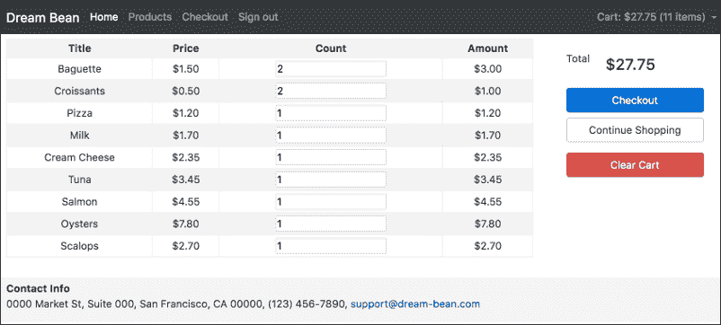

### 提示

您可以在`chapter_7/4.ecommerce-cart-view`找到源代码。

# 结账视图

“签出”视图显示客户详细信息表单、购买条件和订单信息。客户填写表格，接受付款，点击**提交**按钮开始付款流程。

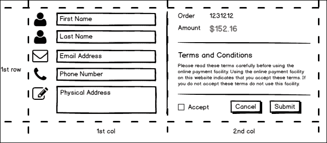

签出视图的线框

创建`checkout`文件夹和`checkout-view.component.ts`文件：

```ts
import {Component, Input} from '@angular/core'; 
import {FormGroup, FormBuilder, Validators} from '@angular/forms'; 

import {Cart, CartItem, CartService} from '../cart/cart.service'; 

@Component({ 
    selector: 'db-checkout-view', 
    templateUrl: 'app/checkout/checkout-view.component.html' 
}) 
export class CheckoutViewComponent { 

    private cart: Cart; 
    form: FormGroup; 

    constructor(private cartService: CartService,  
                private fb: FormBuilder) { 
        this.cart = this.cartService.cart; 
    } 

    ngOnInit() { 
        this.form = this.fb.group({ 
            firstName: ['', Validators.required], 
            lastName: ['', Validators.required], 
            email: ['', Validators.required], 
            phone: ['', Validators.required], 
            address: [] 
        });  
    } 

    submit() { 
        alert('Submitted'); 
        this.cartService.clearCart(); 
    } 
} 

```

我在这里使用了模型驱动的方法来创建表单的定义。当用户点击**提交**按钮时，显示消息并清除购物车。创建`checkout-view.component.html`并复制以下内容：

```ts
<form [formGroup]="form"> 
    <div class="form-group row"> 
        <label for="firstName"  
               class="col-xs-2 col-form-label">First Name:</label> 
        <div class="col-xs-10"> 
            <input class="form-control" type="text" value=""  
                   id="firstName" formControlName="firstName"> 
            <p [hidden]="form.controls.firstName.valid ||  
                         form.controls.firstName.pristine"  
                         class="form-text alert-danger"> 
               The First Name is required 
            </p> 
        </div> 
    </div> 
    <div class="form-group row"> 
        <label for="lastName" class="col-xs-2 col-form-label"> 
            Last Name:</label> 
        <div class="col-xs-10"> 
            <input class="form-control" type="text" value=""  
                 id="lastName" formControlName="lastName"> 
                 <p [hidden]="form.controls.lastName.valid ||  
                                form.controls.lastName.pristine"  
                                class="form-text alert-danger"> 
                     The Last Name is required 
                  </p> 
        </div> 
    </div> 
    <div class="form-group row"> 
        <label for="email"  
            class="col-xs-2 col-form-label">Email:</label> 
        <div class="col-xs-10"> 
            <input class="form-control" type="email" value=""  
                  id="email"> 
            <p [hidden]="form.controls.email.valid ||  
                         form.controls.email.pristine"  
                         class="form-text alert-danger"> 
                The Email is required 
            </p> 
        </div> 
    </div> 
    <div class="form-group row"> 
        <label for="phone"  
              class="col-xs-2 col-form-label">Phone:</label> 
        <div class="col-xs-10"> 
            <input class="form-control" type="phone" value=""  
                   id="phone"> 
            <p [hidden]="form.controls.phone.valid ||  
                         form.controls.phone.pristine"  
                         class="form-text alert-danger"> 
                The Phone is required 
            </p> 
        </div> 
    </div> 
    <div class="form-group row"> 
        <label for="address"  
             class="col-xs-2 col-form-label">Address:</label> 
        <div class="col-xs-10"> 
            <input class="form-control" type="text" value=""   
                id="address"> 
        </div> 
    </div> 
</form> 

```

我们有几个必填字段，因此当它们为空时，通过`NgModel,`将其栏变为红色。指出问题是可以的，但还不足以说明到底哪里出了问题。如果控件无效或未被触摸，我们可以使用验证错误消息来显示。请看我从前面代码复制的标记：

```ts
<input class="form-control" type="text" value=""  
       id="firstName" formControlName="firstName"> 
<p [hidden]="form.controls.firstName.valid ||  
             form.controls.firstName.pristine"  
             class="form-text alert-danger"> 
    The First Name is required 
</p> 

```

我们直接从表单模型中读取有关`FormControl`状态的信息。我们检查`firstName`字段是否有效或是否原始，并显示或隐藏错误消息。

最后，我们将**提交**按钮的 disabled 属性绑定到表单的有效性上，因此只有表单的所有字段都有效时，用户才有机会将数据发送到服务器：

```ts
<div class="col-xs-9"> 
    <button class="btn btn-primary" (click)="submit()"  

[disabled]="!form.valid"

>Submit</button> 
    <button class="btn btn-secondary"  
           [routerLink]="['/products']">Continue Shopping</button> 
</div> 

```

## 签出视图路由定义

更新`app.routes.ts`中的路由配置，添加`CheckoutViewComponent`：

```ts
const routes: Routes = [ 
  { path: '', redirectTo: 'welcome', pathMatch: 'full' }, 
  { path: 'welcome', component: WelcomeComponent }, 
  { path: 'products', component: ProductListComponent }, 
  { path: 'products/:id', component: ProductViewComponent }, 
  { path: 'cart', component: CartViewComponent }, 

 { path: 'checkout', component: CheckoutViewComponent }

]; 

```

## 导航至签出视图

当用户点击购物车菜单标记中的**签出**按钮时，路由导航到视图：

```ts
<div class="row"> 
    <div class="col-md-12"> 
        <a [routerLink]="['/cart']"  
           class="btn btn-primary pull-xs-right btn-cart"> 
            <i class="fa fa-shopping-cart" aria-hidden="true"></i>  
            Cart 
        </a> 

 <a [routerLink]="['/checkout']" 

           class="btn btn-success pull-xs-right btn-cart"> 
            <i class="fa fa-credit-card" aria-hidden="true"></i>  
              Checkout 
        </a> 
    </div> 
</div> 

```

`CheckoutViewComponent`不属于任何模块，需要添加到`AppModule`中：

```ts
/* 
 * Components 
 */ 
import {AppComponent}  from './app.component'; 
import {NavbarComponent} from './navbar/navbar.component'; 
import {FooterComponent} from './footer/footer.component'; 
import {WelcomeComponent} from './welcome/welcome.component'; 

import {CheckoutViewComponent} from 

 './checkout/checkout-view.component';

/* 
 * Routing 
 */ 
import {routing}  from './app.routes'; 

@NgModule({ 
  imports: [BrowserModule, FormsModule, ReactiveFormsModule,  
            routing, CartModule, CategoryModule, ProductModule], 
  declarations: [AppComponent, NavbarComponent, FooterComponent,  
                WelcomeComponent, 
CheckoutViewComponent

], 
  bootstrap: [AppComponent] 
}) 
export class AppModule { } 

```

以下是带有验证错误消息的签出视图的屏幕截图：


### 提示

您可以在`chapter_7/5.ecommerce-checkout-view`找到源代码。

# 总结

在本章中，我们了解了如何使用 Bootstrap4 创建表单。我们知道Bootstrap支持从简单到复杂的不同布局。

我们研究了 Angular 2 forms 模块，现在可以创建模型驱动和模板驱动的表单。

我们加入了应用程序的所有部分，现在它看起来非常漂亮。

在[第 8 章](08.html#page "Chapter 8. Advanced Components")*高级组件*中，我们将讨论组件的生命周期以及在组件的不同阶段可以使用的方法。本章还讨论了如何创建多组件应用程序。像往常一样，我们将继续构建我们在前几章中开始开发的项目。