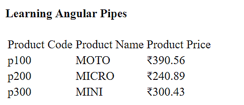

# 七、模板、指令和管道


模板定义组件在网页上的显示和布局方式。Angular 提供了几个内置指令，让开发人员可以控制组件的显示，从显示还是隐藏组件，到在页面上多次呈现组件。内置指令还提供了将类和样式绑定到组件的机制。

在[第 6 章](06.html)*构建Angular组件*中，我们研究了组件的结构以及如何将应用分解为组件树。

在本章中，您将学习如何在组件的父级模板中控制组件的显示。具体来说，在高层次上，以下是我们将一起讨论的内容：

*   模板
*   指令
*   管


# 模板


在上一章中，我们已经了解了什么是组件模板以及如何创建它们。然而，到目前为止，我们只看到了静态 HTML。在本节中，我想放大一点，并与您一起研究一些模板语法，它们允许我们创建动态 HTML，这当然是 Angular 的主要目标之一。

Angular 中的模板语法为我们提供了一种机制，使我们的 HTML 动态化，特别是数据绑定、属性绑定和事件绑定。在本章中，我们将介绍这三种类型的绑定。Angular 让我们能够通过一组符号来创建生成动态 HTML 的模板，或者操纵 DOM（只需稍作介绍）。

以下是我们可以使用的六种基本符号：

*   `{{ }}`用于字符串插值和单向数据绑定
*   `[( )]`用于双向数据绑定
*   `#`用于变量声明
*   `( )`用于事件绑定
*   `[ ]`用于属性绑定
*   [T0]预先准备了结构指令，如我们将看到的[T1]


# 指令


三种类型的指令是：组件指令、属性指令和结构指令。然而，我们实际上只讨论三种指令中的两种-**属性指令**和**结构指令**。之所以这样做是因为我们已经花了整整一章的时间讨论了第一种指令类型，那就是组件。这是正确的！组件实际上是隐藏的指令！具体地说，并以另一种方式说明（说明组件如何与属性和结构指令区分），组件是具有模板的指令。当然，这必须意味着属性和结构指令没有模板。

那么，指令到底是什么呢？让我们给术语*指令*一个明确的定义，以消除该术语可能造成的任何混淆，然后再讨论下两种类型的指令。我们将使用的定义是：*Angular指令是提供特定 DOM 操作的构造。*DOM（或 HTML DOM）是文档对象模型的首字母缩略词，它不是一个Angular的东西，而是一个浏览器的东西。所有现代浏览器在加载网页时都会创建 DOM，这是一个可由 JavaScript 访问的对象树。如果没有 DOM，Angular（以及任何其他操纵 DOM 的 web 框架）将不存在。

正如我们在[第 6 章](06.html)*构建Angular组件*中看到的，组件符合我们对指令的定义，因为它们确实是提供特定 DOM 操作的构造。不仅它们的模板被注入到我们的页面（替换它们的自定义 HTML 标记），它们本身还包含数据、属性和事件绑定，这些绑定进一步操作 DOM。

现在，我们已经以各种方式对组件进行了全面的解释，在接下来的章节中，我们将在实现线框的过程中看到它们的实际作用。

其余两种类型的指令没有在我们的页面或视图中注入任何 HTML 模板，因为它们没有任何模板。但是，它们确实按照我们之前对指令的定义来操纵 DOM。现在让我们看看这些类型的指令都做了什么。


# 属性指令


属性指令通过更改特定 DOM 元素的外观或行为来操纵 DOM。这些类型的指令用括号括起来，是 HTML 元素的属性。括号是符号（我们在本章开头列出的五种符号之一），它们向 Angular 发出信号，表示它可能需要更改指令作为其属性的元素的外观或行为。

最后一句很有意思，让我们看看最有可能使用的属性指令的代码示例。我所指的指令名为`hidden`，将导致 Angular 显示或隐藏其元素：

```ts
<div [hidden]="usertype != 'admin'">
  This element, and its contents, will be hidden for all users that are not Admins. 
</div>
```

在前面的代码中，我们对所有非管理员的用户类型隐藏了`div`元素和任何嵌入的 HTML。这里，`usertype`和`admin`当然是应用上下文的东西，并且仅用作示例来说明 Angular 可以做什么。

更一般地，`hidden`属性指令与要计算的表达式相关联。表达式的计算结果必须为布尔值（即，[T1]或[T2]）。如果表达式的计算结果为`true`，Angular 将在视图中隐藏该元素。相反，如果表达式的计算结果为`false`，Angular 将不处理它，它将显示在视图中

正如我在前几章中所做的那样，我将确保向您提供在线官方文档。正如您现在所知道的，我不喜欢很多其他 IT 书籍所采用的方法，即重复文档。虽然这在某种程度上是不可避免的，但有些书的大部分页面都充满了它。因此，我将继续远离这个陷阱，并将继续以更好的方式尽我所能增加所有价值。

尽管如此，属性指令的官方在线文档可在[找到 https://angular.io/guide/attribute-directives](https://angular.io/guide/attribute-directives) 。


# 结构指令


结构指令通过添加或删除特定的 DOM 元素来操纵 DOM。正如我们有语法可以用来向 Angular 发出信号，我们有一个需要注意的属性指令，使用括号符号，我们有结构指令的等价物。

我们用来向 Angular 发送信号的语法是星号（*），我们需要注意它的结构指令。Structural 指令的前缀是星号，它向 Angular 发出可能需要在 DOM 中添加或删除元素的信号。正如我在本章开头所列举的，星号是我们可以在模板语法中使用的另一种符号。


# NgFor


正如我们看一看您最可能使用的属性指令的代码示例一样，现在让我们看一看您最可能使用的结构指令的代码示例-`NgFor`：

```ts
<ul>
 <li *ngFor='let car of [{"make":"Porsche", "model":"Carrera"}, {"make":"Ferrari", "model":"488 Spider"}]'>
   {{ car.make }}: {{ car.model }}
 </li>
</ul>
```

前面的`ngFor`代码示例打印出以下内容：

```ts
Porsche: Carrera
Ferrari: 488 Spider
```

在前面的代码中，我想指出一些事情；首先是`*ngFor`结构指令。让我们以子弹点的形式来看这些：

*   `ngFor`获取一个 iterable，并在其中循环，向 DOM 中添加元素
*   指令语法的一般形式为`*ngFor="let <value> of <collection>"`
*   `NgFor`（注意大写 N）指定义指令的类别
*   `ngFor`（注意小写 n）既指属性名，也指作为`NgFor`类实例的属性名
*   其余结构指令遵循与`NgFor`相同的套管惯例（参见前两个要点）
*   我们可以嵌套`ngFor`（与嵌套`for each`……在循环中的方式大致相同）

接下来，我提供给`ngFor`指令的集合并不表示我们通常如何将数据传递给该指令。为了简洁起见，我用这种方式编码。我们通常这样做的方式是在我们的组件类中定义数据（即我们的集合）并将其分配给变量，然后在附加到指令的语句中使用该变量。


# 访问迭代的索引值


我们通常会对访问迭代的索引值感兴趣，可能会抓取每一个*n*th 对象，或者以*x*的数量对事物进行分组，或者可能会希望实现某种自定义分页。无论需要读取迭代的当前索引值是什么，我们都可以使用`index`关键字将索引设置为表达式中的变量。

下面是一些示例代码，演示了这一点：

```ts
<ul> 
  <li *ngFor="let car of cars; let i = index">
    Car #{{ i + 1 }}: {{ car.model }}
  </li>
</ul>
```

在前面的代码示例中，我们假设 cars 集合是在其他地方填充的，比如在 component 类中。

另外，Angular 负责在每次迭代中更新索引值，我们所要做的就是引用它。

请注意，我们使用`{{ i + 1 }}`输出车号。这是因为，与大多数数组或 iterables（在大多数语言中，但在 JavaScript 和 TypeScript 中是肯定的）一样，索引是基于零的。另外，请注意，双大括号内的表达式`i + 1`不仅仅是一个变量。在 Angular 中，将计算插入双花括号中的任何内容。如果愿意，我们甚至可以在那里插入函数调用。

结构指令的官方在线文档可在[上获得 https://angular.io/guide/structural-directives](https://angular.io/guide/structural-directives) 。


# 内置指令


我们有一些内置指令可供使用。让我们来看看下面的章节：

*   `NgFor`（作为结构指令的第一个示例，我们已经介绍了这一点）
*   `NgIf`
*   `NgSwitch`、`NgCase`和`NgDefault`
*   `NgStyle`
*   `NgClass`
*   `NgNonBindable`


# NgIf


当我们想从 DOM 中显示或删除元素时，我们使用[T0]指令。我们向指令传递一个表达式，它的计算结果必须是布尔值。如果计算结果为`true`，则该元素将显示在视图上。相反，如果表达式的计算结果为`false`，则该元素将从 DOM 中删除。

请注意，我们也可以绑定到`hidden`属性（属性绑定将描述如下）以实现相同的视觉效果，但属性绑定方法与使用`NgIf`指令之间存在差异。不同之处在于，在`hidden`上使用属性绑定只会隐藏元素，而使用`NgIf`指令会从 DOM 中实际删除元素。

下面是代码中的[T0]的样子（在我们的汽车示例的上下文中，假设我们有一个[T1]属性）：

```ts
<ul *ngFor="let car of cars">
  <li *ngIf="car.horsepower > 350">
    The {{ car.make }} {{ car.model }} is over 350 HP. 
  </li>
</ul>
```

在大多数传统编程语言中，当有交替的东西需要按顺序检查时，如在一系列传统的[T0]、[T1]和[T2]语句中，有时使用[T3]语句（如果语言支持）更有意义。Java、JavaScript 和 TypeScript 都是支持这种条件构造的语言（当然还有许多其他语言）的例子。Angular 也为我们提供了这种能力，因此我们的代码更具表现力和效率。

让我们来看看下一节是如何在Angular上完成的。


# NgSwitch、↓NgCase 和 NgDefault


在一些编程语言中，如 Java、JavaScript 和 TypeScript，`switch`语句不是孤立地工作的。它与其他语句和关键字，即[T1]和[T2]协同工作。Angular 的`NgSwitch`指令的工作方式完全相同，即`NgSwitch`与`NgCase`和`NgDefault`协同工作。

让我们通过创建一个包含我们的汽车数据、样式和模板的组件来充实一个稍大的示例，该组件使用了`NgSwitch`，以及`NgCase`和`NgDefault`：

```ts
@Component({
  selector: 'car-hp',
  template: `
    <h3>Cars styled by their HP range</h3>
    <ul *ngFor="let car of cars" [ngSwitch]="car.horsepower"> 
      <li *ngSwitchCase="car.horsepower >= 375" class="super-car">
        {{ car.make }} {{ car.model }} 
      </li>
      <li *ngSwitchCase="car.horsepower >= 200 && car.horsepower 
          < 375" class="sports-car">
        {{ car.make }} {{ car.model }}
      </li>
      <li *ngSwitchDefault class="grandma-car">
        {{ car.make }} {{ car.model }}
      </li>
    </ul>
  `,
  styles: [`
    .super-car {
      color:#fff;
      background-color:#ff0000;
    },
    .sports-car {
      color:#000;
      background-color:#ffa500; 
    },
    .grandma-car {
      color:#000;
      background-color:#ffff00; 
    } 
  `],
  encapsulation: ViewEncapsulation.Native 
})
class CarHorsepowerComponent {
  cars: any[] = [
    {
      "make": "Ferrari",
      "model": "Testerosa",
      "horsepower": 390
    },
    {
      "make": "Buick",
      "model": "Regal",
      "horsepower": 182 
    }, 
    {
      "make": "Porsche",
      "model": "Boxter",
      "horsepower": 320
    }, 
    {
      "make": "Lamborghini",
      "model": "Diablo",
      "horsepower": 485
    }
  ];
}
```

在前面的代码中，我们构建了一个完整的组件，名为
`CarHorsepowerComponent`。在父组件模板中，Angular 将用我们在`CarHorsepowerComponent`中创建的模板替换自定义 HTML 元素`<car-hp>`的实例（这是因为我们将`car-hp`指定给`CarHorsepowerComponent`类的组件注释的`selector`属性）。

我们还将传递给`NgFor`指令的集合的数据包含在我们的组件类中，而不是像我们在前面的示例中所做的那样，将其内联到分配给`NgFor`指令的表达式中。

这是一个简单的示例，其模板在我们的汽车系列中迭代，并根据当前汽车的马力将三种样式中的一种应用于汽车的制造和型号，这是通过`NgSwitch`、`NgCase`和`NgDefault`指令实现的。具体来说，结果如下：

*   如果汽车的马力等于或大于 375 马力，我们会认为它是一辆超级跑车，它将使汽车的造型和模型呈现出红色背景的白色字体。
*   如果汽车的马力等于或大于 200 马力，但小于 375 马力，我们会认为它只是一辆跑车，并将汽车的制作和模型以橙色背景渲染成黑色字体。
*   如果汽车的马力低于 200 马力，这是我们的默认值 To1 T1（或 To.T2A.THOLD ALL T3），我们会认为这是一辆适合祖母驾驶的汽车，而且，这款车的品牌和型号将以黄色背景的黑色字体呈现，因为大多数祖母认为蜜蜂的配色方案很有吸引力

当然，祖母的评论只是为了娱乐，我并不是故意冒犯那些驾驶一辆从 0 加速到 60 英里（眨眼）需要整整 8 秒[T0]或更长时间[T1]的汽车的人。说实话，我的一辆车（2016 款本田思域）只有 158 马力，相信我，我在上坡的路上被一位开着无限 Q50 的祖母超越了。这就是为什么在那次可怕的经历（灿烂的笑容）之后的几天内，我买了一些功能更强的东西。

在前面的示例中，我想指出的最后一件事是[T0]指令的使用方式。你会注意到我是用另一种格式写的，即[T1]，而不是[T2]。这是因为当涉及到结构指令时，Angular 强加给我们一条规则，即我们不能有多个结构指令使用星号作为指令名称的前缀。为了解决这个问题，我们使用了属性绑定符号`[ ]`（一对方括号）


# NgStyle


`NgStyle`指令用于设置元素的样式属性。让我们重做前面的`CarHorsepowerComponent`示例，该示例用于演示`NgSwitch`、`NgCase`和`NgDefault`，以展示如何使用`NgStyle`：
更好地实现相同的预期结果（即有条件地设计元素）

```ts
@Component({
  selector: 'car-hp',
  template: `
    <h3>Cars styled by their HP range</h3>
    <ul *ngFor="let car of cars"> 
      <li [ngStyle]="{ getCarTextStyle(car.horsepower) }" >
        {{ car.make }} {{ car.model }}
      </li> 
    </ul>
  `,
  encapsulation: ViewEncapsulation.Native 
})
class CarHorsepowerComponent {
  getCarTextStyle(horsepower) {
    switch (horsepower) {
      case (horsepower >= 375):
        return 'color:#fff; background-color:#ff0000;';
      case (horsepower >= 200 && horsepower < 375):
        return 'color:#000; background-color:#ffa500;';
      default:
        return 'color:#000; background-color:#ffff00;';
    }
  }
  cars: any[] = [
    {
      "make": "Ferrari",
      "model": "Testerosa",
      "horsepower": 390
    },
    {
      "make": "Buick",
      "model": "Regal",
      "horsepower": 182 
    }, 
    {
      "make": "Porsche",
      "model": "Boxter",
      "horsepower": 320
    }, 
    {
      "make": "Lamborghini",
      "model": "Diablo",
      "horsepower": 485
    }
  ];
}
```

在我们对原来的`CarHorsepowerComponent`类的重新设计中，我们通过将逻辑移动到类中的函数中，从而简化了组件模板。我们删除了组件注释的 styles 属性，而是创建了一个函数（即，[T1]），将样式文本返回给调用函数，以便设置正确的样式。

虽然这是一种更干净的方法，但我们可以做得更好。因为我们可以将文本样式设置为实际的文本样式，因为我们可以将文本样式设置为实际的文本样式。

在下一节的`NgClass`中，我们将再次对代码进行返工，以了解如何做到这一点


# 部分


`NgClass`指令与`NgStyle`指令类似，但用于设置样式类（来自具有组件注释的 styles 属性的 CSS 规则集），而不是通过原始 CSS 规则集设置样式。

以下代码示例是最后三个代码示例中的最佳选择，以实现我们的目标：

```ts
@Component({
  selector: 'car-hp',
  template: `
    <h3>Cars styled by their HP range</h3>
    <ul *ngFor="let car of cars"> 
      <li [ngClass]=" getCarTextStyle(car.horsepower) " >
        {{ car.make }} {{ car.model }}
      </li> 
    </ul>
  `,
  styles: [`
    .super-car {
      color:#fff;
      background-color:#ff0000;
    },
    .sports-car {
      color:#000;
      background-color:#ffa500; 
    },
    .grandmas-car {
      color:#000;
      background-color:#ffff00; 
    } 
 `], 
 encapsulation: ViewEncapsulation.Native 
})
class CarHorsepowerComponent {
  getCarTextStyle() {
    switch (horsepower) {
      case (horsepower >= 375):
        return 'super-car';
      case (horsepower >= 200 && horsepower < 375):
        return 'sports-car';
      default:
        return 'grandmas-car';
    }
  }
  cars: any[] = [
    {
      "make": "Ferrari",
      "model": "Testerosa",
      "horsepower": 390
    },
    {
      "make": "Buick",
      "model": "Regal",
      "horsepower": 182 
    }, 
    {
      "make": "Porsche",
      "model": "Boxter",
      "horsepower": 320
    }, 
    {
       "make": "Lamborghini",
       "model": "Diablo",
       "horsepower": 485
    }
  ];
}  
```

在这里，我们为组件注释保留了`styles`属性，保持了模板的轻巧和干净，并且我们的函数只返回要分配给`NgClass`指令的 CSS 类的名称。


# 不可装订


我们列表中最后一个要涵盖的指令是`NgNonBindable`指令。当我们希望忽略模板语法中的特殊符号时，使用`NgNonBindable`。我们为什么要这样做？好吧，假设你和我决定创建一个在线的 Angular 教程，网站本身就是使用 Angular 进行编码的。如果我们想将文本`{{ my_value }}`呈现给视图，Angular 将尝试在其当前范围内找到`my_value`变量以绑定该值，然后将文本插入其位置。因为这不是我们想要 Angular 做的，我们需要一种方法来指示 Angular，*嘿，顺便说一句，现在不要尝试计算和字符串插值任何内容，只需像处理任何其他普通文本一样渲染符号*

下面是一个`span`元素的外观：

```ts
<p>
To have Angular perform one-way binding, and render the value of my_value onto the view, we use the    double curly braces symbol like this: <span ngNonBindable>{{ my_value }}</span>
</p>
```

注意`NgNonBindable`指令在开口`<span>`标签中的位置。当 Angular 看到`ngNonBindable`时，它将忽略双花括号，不会单向绑定任何东西。相反，它将使原始文本呈现到视图中。


# 使用 NgModel 指令进行数据绑定


我们在示例中看到了一个单向数据绑定示例，演示了如何使用[T0]指令。也就是说，单向数据绑定是使用双大括号符号`{{ }}`完成的。我们用双大括号括起来的变量（例如示例中的[T2]和[T3]）是单向绑定的（即从组件类到模板），转换为字符串，并呈现到视图中。它不允许将任何更改绑定回组件类。

为了实现双向数据绑定，从而允许将视图中的更改绑定回组件类，我们必须使用`NgModel`指令。

当我们实现线框时，我们将看到这一点，但现在让我向您展示一下这是什么样子。为了使用`NgModel`，我们必须首先从`forms`包中导入一个名为`FormsModule`的Angular模块，如下所示：

```ts
import { FormsModule } from '@angular/forms';
```

然后，要使用此指令，我们将有如下内容：

```ts
<div [(ngModel)]="my_content"></div>
```

将此代码放置到位不仅会导致视图模板在组件类中显示`my_content`的值，而且视图模板中对此`div`的任何更改都将绑定回组件类。


# 事件绑定


在示例应用线框的实现过程中，我们将看到很多事件绑定。为了绑定我们感兴趣在元素上侦听的事件，我们将事件名称括在括号内（括号是我们可以在模板语法中使用的特殊符号之一）。为此，我们指定一条语句，在触发事件时运行。

下面是一个 JavaScript 警报的示例，当有人在`<span>`元素中单击时将触发该警报：

```ts
<span (click)="alert('This is an example of event binding in Angular');"></span>
```

在前面的代码中，我们附加了一个`click`事件，并用消息调用一个警报框


# 属性绑定


我们已经在前面的示例中看到了属性绑定，但为了完整性，我将在这里简要地给出另一个示例：

```ts
<p class="card-text" [hidden]="true">This text will not show.</p>
```

在前面的示例中，我们将要设置的属性括在方括号内（这是我们可以在模板语法中使用的特殊符号之一）。当然，这在本例中没有太大用处，因为我已经将布尔值硬编码为`true`，而不是使用要计算的表达式，但本例的重点是关注`[hidden]`部分。


# 自定义指令


Angular是可扩展的。我们不仅可以轻松创建自己的自定义组件（这样我们就不局限于使用来自第三方的现成组件），还可以创建自己的属性指令，这样我们就不局限于 Angular 提供的现成组件。

在[第 14 章](14.html)、*高级Angular主题*之前，我将保留一些在 Angular 中可以执行的自定义操作，例如自定义属性指令、自定义管道（我们将在下一节中看到哪些管道）和自定义表单验证。我们将在[第 10 章](10.html)、*处理表单*中了解表单验证。有一个很好的理由让我选择将本书所涵盖的所有高级内容合并为一章，让你有时间先消化基本内容。随着这一章的结束，你将很容易地吸收更多的信息。


# 管


管道用于格式化模板视图中的数据。管道将数据作为输入，并将其转换为我们所需的格式，以便向最终用户显示。我们可以在项目中的任何Angular模板或视图中使用`pipe`属性（`|`

在开始创建示例之前，让我先简要介绍一下。比如说，从后端服务中，我们得到的产品价格为 100 美元，根据用户的国家或偏好，如果用户来自美国，我们可能希望显示为 100 美元，如果用户来自印度，则显示为 100 卢比。因此，我们能够改变显示价格的方式，而无需任何重大复杂性。这要感谢货币管道操作符

Angular 提供了许多内置管道，可以直接在模板中使用。此外，我们还可以创建自己的自定义管道来扩展应用的功能。

以下是 Angular 提供的所有内置管道的列表：

*   小写管道
*   表壳管
*   枣管
*   货币管道
*   JSON 管道
*   百分比管道
*   十进制管
*   切片管

我们将通过一些有趣、实用的例子来了解每个可用的内置管道。我们可以使用到目前为止在 Angular 项目中创建的任何现有模板文件。

我们需要使用管道处理和转换一些数据。我将在我们的`app.component.ts`文件中快速创建一个数据集：

```ts
products: any[] = [
 {
 "code": "p100",
 "name": "Moto",
 "price": 390.56
 },
 {
 "code": "p200",
 "name": "Micro",
 "price": 240.89
 },
 {
 "code": "p300",
 "name": "Mini",
 "price": 300.43
 }
 ];
```

我们已经为我们的应用组件中的产品创建了一个示例数据集。很好，现在我们可以在`app.component.html`文件中应用管道了。我们将在模板中保持它的简单性。我们将创建一个表并绑定表中的值。如果您今天感觉有点冒险，请继续使用 Flex layout 为我们的应用创建一个布局，我们在[第 5 章](05.html)、*Flex layout–Angular 的响应式布局引擎*中学习了这一点

```ts
<h4>Learning Angular Pipes</h4>
<table>
 <tr>
 <td>Product Code</td>
 <td>Product Name</td>
 <td>Product Price</td>
 </tr>
 <tr *ngFor="let product of products">
 <td>{{product.code}}</td>
 <td>{{product.name}}</td>
 <td>{{product.price}}</td>
 </tr> 
</table>
```

在前面的示例代码中，我们创建了一个表，并使用数据绑定将数据绑定到模板中。现在是在我们的模板中使用管道操作符的时候了。要应用任何管道，我们必须针对数据添加管道操作符，如下语法所示：

```ts
{{ data | <pipe name> }}
```

通过应用大写管道，我们可以轻松地将产品名称转换为大写，如下所示：

```ts
<td>{{product.name | uppercase }}</td>
```

同样，我们也可以应用小写管道，这将使所有字符都小写：

```ts
<td>{{product.name | lowercase }}</td>
```

你可能会说，这很简单？的确如此！让我们继续前进。以类似的方式，我们将使用数字管道操作符来显示或隐藏小数点

为了显示产品价格，我们需要添加货币；没问题，我们将使用货币管道：

```ts
<td>{{product.price | currency }}</td>
```

在前面的示例中，我们通过添加货币管道来转换产品价格。剩下的管道操作工我留给你们做家庭作业

By default, `$ currency` is added when we use the currency pipe.

我们可以通过参数化货币管道来定制它。我们将学习如何将参数传递给管道操作符。我们必须通过传递以下参数来扩展管道操作符的语法：

```ts
{{ data | pipe : <parameter1 : parameter2> }}
```

前面的语法与我们学习定义管道操作符的方式类似，只是现在它有两个参数。我们可以根据自己的要求定义具有任意数量参数的管道操作符。我们在前面的示例中使用了 currency 操作符，因此让我们传递参数以扩展 currency pipe 操作符：

```ts
<td>{{ product.price | currency: 'INR' }}</td>
```

我们正在将[T0]参数传递给我们的货币管道操作符。现在，货币管道操作符的输出将不再是`$`；相反，它将如以下屏幕截图所示：



在本节中，我们学习了如何使用内置管道操作符。现在，我们将学习如何创建自己的自定义管道。


# 定制管道


Angular 在自定义管道以及自定义指令的这一领域是可扩展的。然而，我将我们关于定制管道的讨论推迟到[第 14 章](14.html)、*高级Angular主题*之后。我在这里把这一部分作为一个占位符，提醒大家以后的报道以及完整性。


# 总结


在本章中，我们详细介绍了组件模板，以及我们可以使用什么样的模板语法来创建它们。我们的模板语法包括符号、指令和管道。

我们已经看到指令只是无模板的组件，它们有两种主要的风格-**属性指令**和**结构指令**。无论它们的风格或类别如何，我们都通过将它们添加为 HTML 元素的属性来关联（或附加）指令。

我们已经介绍了可以在模板语法中使用的以下特殊符号。我们还介绍了可以在模板语法中使用的内置指令。接下来，我们介绍了事件绑定和属性绑定，最后介绍了管道，它为我们提供了格式化数据的方法，以便能够以我们希望的方式将数据呈现给我们的视图。

我们知道 Angular 是可扩展的，它为我们提供了创建自定义指令和自定义管道的机制，但我们将任何自定义的讨论推迟到[第 14 章](14.html)、*高级 Angular 主题*

在下一章中，[第 8 章](08.html)*使用 NG Bootstrap*，我们将把我们的组件帽子戴在头上，这样我们就可以探索`ng-bootstrap`为我们构建Angular应用带来了什么。