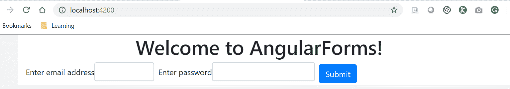
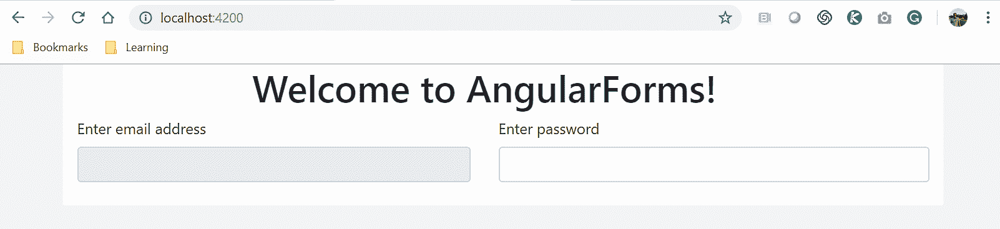
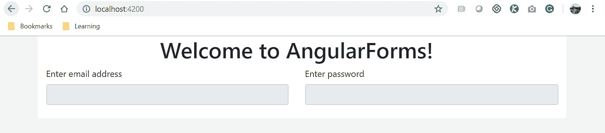
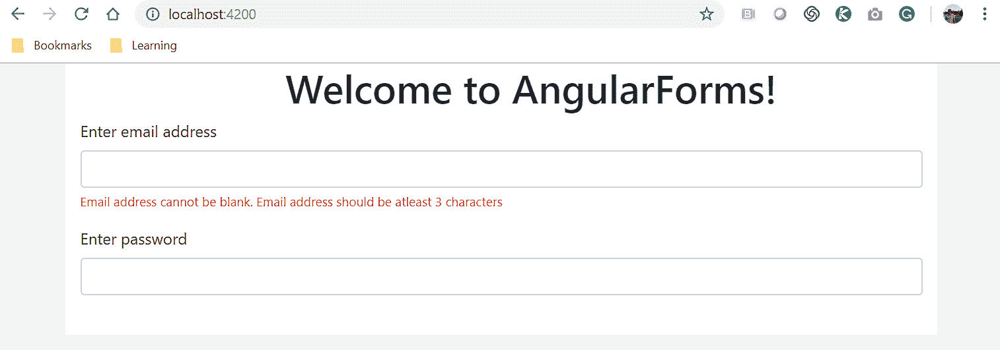
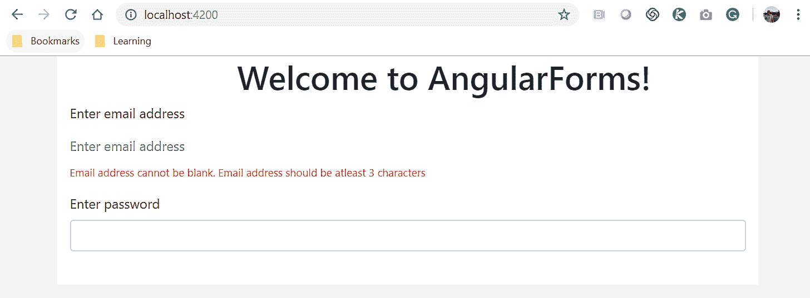
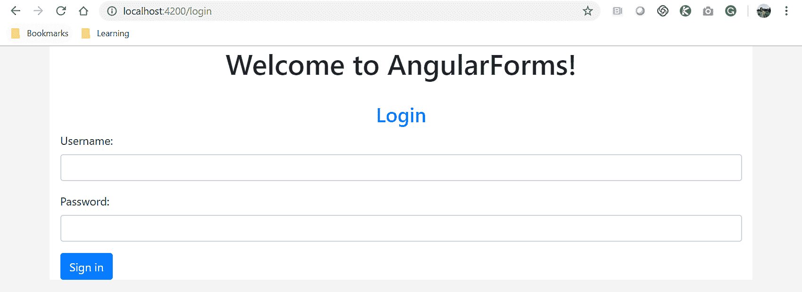
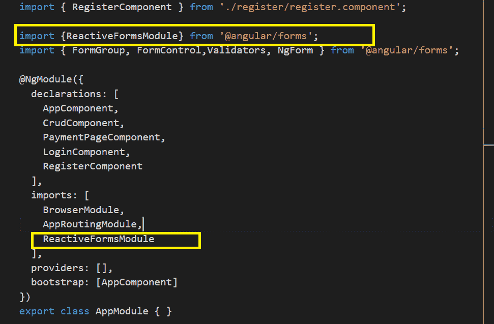
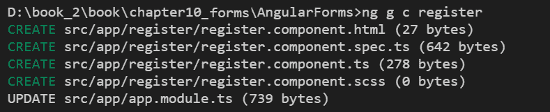
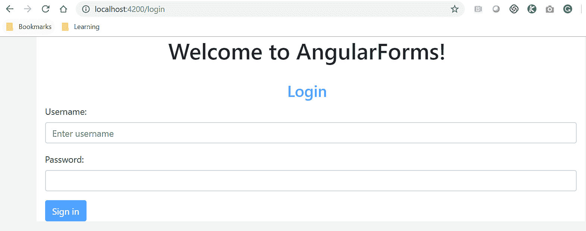

# 使用表单


让我们从一个简单的猜谜游戏开始这一章。你能想到没有任何形式的 web 应用程序吗，比如，注册、登录、创建、联系我们、编辑表单等等；这个清单是无穷无尽的。（即使谷歌主页上有搜索表单，答案也是错误的。）

从技术上讲，这是可能的。我 100%确信有些网站可能根本不使用表单，但我也同样相信它们是静态的，不会动态地与用户交互或互动，这就引出了本章的主要内容和重点：在我们的应用程序中实现和使用表单。

好的，现在让我们看一下本章将介绍的内容：

*   引导表格简介
*   引导表单类
*   Bootstrap 表单类扩展
*   角形
*   模板驱动表单
*   反应形式
*   表单验证
*   提交和处理表单数据


# 引导形式


我们将学习如何使用令人敬畏的 Bootstrap 库，它为我们提供了一组丰富的类和实用程序来设计和开发应用程序中的表单，使开发人员和设计师的生活变得轻松！


# 什么是表格？


表单是集合，输入字段的集合集合在一起，使我们能够通过键盘、鼠标或触摸输入从用户收集数据。

我们将学习将输入元素缝合在一起，并构建一些示例表单，例如登录、注册或当用户忘记密码时的表单。

在我们开始创建表单之前，下面是我们可以在应用程序中使用的可用 HTML 输入元素的快速列表：

*   输入（包括文本、收音机、复选框或文件）
*   文本区域
*   选择
*   按钮
*   类型
*   字段集。

If you want a quick refresher tutorial on HTML tags and elements, you can visit [W3schools.com](https://www.w3schools.com/). 

有了关于表单和可用 HTML 元素的知识，这就是实际操作时间。


# 引导表单类


在本节中，我们将了解 Bootstrap 框架中的可用类，我们可以在构建表单时使用这些类。每个表单都可以由各种输入元素组成，例如文本表单控件、文件输入控件、输入复选框和单选按钮。`.form-group`类是向表单添加结构的简单方法。使用`.form-group`类，我们可以轻松地对输入元素、标签和帮助文本进行分组，以确保表单中元素的正确分组。在`.form-group`元素中，我们将添加输入元素并将它们分配给`.form-control`类。

使用`.form-group`类的一组元素的示例如下：

```ts
 <div class="form-group">
 <label for="userName">Enter username</label>
 <input type="text" class="form-control" id="userName" placeholder="Enter username">
 </div>
```

在前面的代码中，我们正在创建一个表单组，它由文本类型的标签和输入元素组成。

在同一行中，我们可以轻松添加文本输入元素，例如`email`、`password`和`textarea`。下面是添加`email`类型输入元素的代码：

```ts
<div class="form-group">
<label for="userEmailAddress">Enter email address</label>
<input type="email" class="form-control" id="emailAddress" placeholder="name@example.com">
</div>
```

类似地，我们也可以轻松地添加类型为`password`的输入元素。再次注意，我们使用了`form-group`作为包装器，并将`form-control`添加到元素中：

```ts
<div class="form-group">
<label for="userPassword">Enter password</label>
<input type="password" class="form-control" id="userPassword">
</div>
```

美好的我们学会了在输入元素上使用`form-group`和`form-control`类。现在，让我们向[T2]元素添加相同的类。下面是将类添加到`textarea`元素的示例代码：

```ts
<div class="form-group">
<label for="userComments">Example comments</label>
<textarea class="form-control" id="userComments" rows="3"></textarea>
</div>
```

您将注意到前面的所有元素都具有相同的结构和分组。对于`select`和`multiple``select`输入元素，它也完全相同

在下面的示例代码中，我们正在创建一个`select`下拉元素并使用`form-control`类：

```ts
<div class="form-group">
<label for="userRegion">Example select</label>
<select class="form-control" id="userRegion">
<option>USA</option>
<option>UK</option>
<option>APAC</option>
<option>Europe</option>
</select>
</div>
```

我们添加了一个`select`下拉元素，允许用户从列表中只选择一个选项。只需添加一个附加属性`multiple`，我们就可以方便地让用户选择多个选项：

```ts

<div class="form-group">
<label for="userInterests">Example multiple select</label>
<select multiple class="form-control" id="userInterests">
<option>Biking</option>
<option>Skiing</option>
<option>Movies</option>
<option>Music</option>
<option>Sports</option>
</select>
</div>
```

这是简单而直接的。让我们继续前进。

现在，让我们继续讨论其他重要的输入元素：复选框和单选按钮。然而，`checkbox`和`radio`元素的类是不同的。

我们将学习为`checkbox`和`radio`元素实现三个新类：

*   为了包装元素，我们将使用`form-check`类
*   对于输入类型`checkbox`和`radio`元素，我们将使用`form-check-input`
*   对于`checkbox`和`radio`元素，我们需要显示标签，我们将使用`form-check-label`类：

```ts
<div class="form-check">
 <input class="form-check-input" type="checkbox" value="" id="Worldwide">
 <label class="form-check-label" for="Worldwide">
 Worldwide
 </label>
</div>
```

在前面的代码中，我们对包装器`div`和`label`元素使用了`.form-check`类、`.form-check-input`和`.form-check-label`。

同上，在类似的行中，我们将使用前面的类添加到输入`radio`元素中：

```ts

<div class="form-check">
 <input class="form-check-input" type="radio" name="gender" id="maleGender" 
    value="option1" checked>
 <label class="form-check-label" for="maleGender">
 Male
 </label>
</div>
<div class="form-check">
 <input class="form-check-input" type="radio" name="gender" id="femaleGender" 
    value="option2">
 <label class="form-check-label" for="femaleGender">
 Female
 </label>
</div>
```

在前面的代码中，我们为用户创建了两个单选按钮来选择他们的性别，用户只能从两个选项中选择一个。

在大多数现代 web 应用程序中，我们需要用户能够将文件或资产上载到我们的应用程序。Bootstrap 为我们提供了名为“form control file”的类，我们可以将该类与 file upload 元素关联。

我们将使用`form-control-file`类来定义输入类型`file`元素。此示例代码如下所示：

```ts
<div class="form-group">
 <label for="userProfilePic">Upload Profile Pic</label>
 <input type="file" class="form-control-file" id="userProfilePic">
 </div>
```

伟大的我们已经学会了将所有元素组合在一起，从而创造出美丽而强大的形体。


# 引导表单类–扩展


我们已经学会了使用输入元素创建表单，并将引导中的一些可用表单类添加到组元素中，以及改进我们的应用程序。

在本节中，我们将介绍 Bootstrap 框架提供的其他附加类和属性，这些类和属性可用于改善**用户体验**（**UX**），以及扩展元素的行为：

*   尺寸
*   只读
*   内联表单
*   使用引导网格类的表单
*   残废
*   帮助文本
*   [T0]内的纯文本

我们将仔细研究上述每一个选项，学习如何实施它们，并看到它们的实际行动。


# 尺寸


我们可以在表单中设置输入元素的大小。我们可以使用小、中、大分辨率的不同类来控制元素的高度。

在上一节中，我们已经学习了使用`.form-control`类，默认情况下，使用`.form-control-md`类的中等尺寸高度。还有其他类可用于将高度设置为大或小。我们可以分别使用`.form-control-lg`和`.form-control-sm`。

下面是示例代码，我们使用`.form-control-lg`类将电子邮件地址元素的高度设置为大，使用`.form-control-sm`类将密码字段设置为大：

```ts
<form>
 <div class="form-group mb-2 mr-sm-2">
   <label for="userEmailAddress">Enter email address</label>
   <input type="email" class="form-control form-control-lg" 
     id="userEmailAddress">
 </div>

 <div class="form-group mb-2 mr-sm-2">
   <label for="userPassword">Enter password</label>
   <input type="password" class="form-control form-control-sm" 
     id="userPassword">
 </div>

<button type="submit" class="btn btn-primary">Submit</button>
</form>
```

我们已经分别将`form-control-lg`和`form-control-sm`类添加到表单控件的电子邮件地址和密码表单元素中。

运行应用程序时，前面代码的输出如下：


在前面的屏幕截图中，请注意输入元素的高度差异。电子邮件地址文本字段高度增加，密码字段较小。


# 只读


我们可能会遇到一个需要禁用字段并使其只读的用例。我们可以利用属性`readonly`。通过向任何表单控件元素添加 Boolean`readonly`属性，我们可以禁用该元素。

显示用户名字段上`readonly`属性用法的示例代码如下：

```ts
<div class="form-group">
 <label for="userName">Enter username</label>
 <input type="text" class="form-control" id="userName" placeholder="E.g 
    packtpub" readonly>
 </div>
```

前面代码的输出显示如下。请注意，电子邮件地址字段已禁用，因此用户将无法添加/编辑元素：


# 内联表单


设计也是我们展示形式的一个同样重要的方面。我们可能会遇到这样一个用例：我们需要将表单水平放置，而不是常规的垂直放置。

Bootstrap 有`.form-inline`类来支持内嵌或水平表单。当使用`.form-inline`类时，表单元素会自动水平浮动。

下面是一些示例代码，其中我们创建了带有电子邮件地址和密码的登录表单。我们使用`form-inline`类将其内联：

```ts
<form class="form-inline">
 <div class="form-group">
 <label for="userEmailAddress">Enter email address</label>
 <input type="email" class="form-control" id="emailAddress" 
    placeholder="name@example.com">
 </div>

 <div class="form-group">
 <label for="userPassword">Enter password</label>
 <input type="password" class="form-control" id="userPassword">
 </div>
</form>
```

在前面的代码中，需要注意的重要一点是`.form-inline`类的用法。

上述代码的输出显示如下：



By default, all forms designed using Bootstrap are vertical.


# 使用引导网格类的表单


还记得我们在[第 3 章](03.html)、*引导-网格布局和组件*中学习的引导网格类吗？是，行、列和设计屏幕布局。

在本节中，我们将学习在表单中使用相同的行和列网格类，这是一个好消息，因为使用这些类，我们可以设计自定义布局并更新表单的外观。

此示例代码如下所示：

```ts
<form>
 <div class="row">
 <div class="col">
 <label for="userEmailAddress">Enter email address</label>
 <input type="email" class="form-control" id="emailAddress" readonly>
 </div>
 <div class="col">
 <label for="userPassword">Enter password</label>
 <input type="password" class="form-control" id="userPassword">
 </div>
 </div>
</form>
```

在前面的代码中，我们使用的不是`.form-group`类，而是`row`和`col`类，它们主要用于设计布局。

我们用两列组成一行，在每列中添加输入元素。

上述代码的输出如下所示：


这是你的作业。使用带有表单的网格类尝试以下有趣的用例：

*   通过向同一行添加更多列 div 元素，在同一行中添加更多输入元素
*   在表单中添加多行
*   为某些列（第 4 列或第 3 列）指定固定宽度


# 残废


在开发具有关键和复杂法规遵从性要求的 web 应用程序时，我们必须根据用户选择禁用某些输入元素是很常见的。

一个好的用例是某些字段不适用于用户选择的特定国家，因此我们需要禁用其他相关字段。

使用接受布尔值的`disabled`属性，我们可以禁用表单或特定元素。

让我们看看`disabled`属性的作用：

```ts
<form>
 <div class="row">
 <div class="col">
 <label for="userEmailAddress">Enter email address</label>
 <input type="email" class="form-control" id="emailAddress" disabled>
 </div>
 <div class="col">
 <label for="userPassword">Enter password</label>
 <input type="password" class="form-control" id="userPassword">
 </div>
 </div>
</form>
```

在前面的代码中，我们使用的是`disabled`属性。我们可以在以下屏幕截图中看到，电子邮件地址字段已完全禁用：



我们可以通过向元素添加`disabled`属性来禁用任何元素。这很好，但是如果我们想一次性禁用整个表单呢？我们也可以这样做。

请看下面的代码：

```ts
<form>
 <fieldset disabled>
 <div class="row">
 <div class="col">
 <label for="userEmailAddress">Enter email address</label>
 <input type="email" class="form-control" id="emailAddress">
 </div>
 <div class="col">
 <label for="userPassword">Enter password</label>
 <input type="password" class="form-control" id="userPassword">
 </div>
 </div>
 </fieldset>
</form>
```

我们正在表单中添加`fieldset`标记，将表单的所有元素包装在一起，并将`disabled`属性应用于`fieldset`元素，这将一次性禁用整个表单。

上述代码的输出显示如下：




# 表单内的帮助文本


任何好的 web 应用程序都会有漂亮但功能强大的表单，这些表单可以与用户对话并创造良好的用户体验。

帮助文本是我们必须通知用户表单中任何错误、警告或必填字段的选项之一，以便用户可以采取必要的操作。

请看下面的代码：

```ts
<form>
 <div class="form-group">
 <label for="userEmailAddress">Enter email address</label>
 <input type="email" class="form-control" id="userEmailAddress">
 <small id="userEmailAddressHelp" class="form-text text-danger">
 Email address cannot be blank.
 Email address should be atleast 3 characters
 </small>
 </div>
 <div class="form-group">
 <label for="userPassword">Enter password</label>
 <input type="password" class="form-control" id="userPassword">
 </div>
</form>
```

在前面的代码中，我们正在`<small>`标记中添加文本，并分配`.form-text`类和`.text-danger`

上述代码的输出如下所示：




# 将输入元素显示为纯文本


我们可能会遇到这样一个需求：我们需要将输入元素显示为文本，而不是输入元素。

我们可以简单地通过定制样式表来实现这一点，或者只需在元素中使用`.form-control-plaintext`类和`.form-group`类。

请看下面的代码：

```ts
<form>
 <div class="form-group">
 <label for="userEmailAddress">Enter email address</label>
 <input type="email" class="form-control-plaintext" id="userEmailAddress" 
   placeholder="Enter email address">
 <small id="userEmailAddressHelp" class="form-text text-danger">
 Email address cannot be blank.
 Email address should be atleast 3 characters
 </small>
 </div>
 <div class="form-group">
 <label for="userPassword">Enter password</label>
 <input type="password" class="form-control" id="userPassword">
 </div>
</form>
```

在前面的代码中，我们已经将`.form-control-plaintext`类添加到输入元素中。

上述代码的输出如下所示：



在本节中，我们学习了各种类和属性，这些类和属性可以用来增强表单，使表单更具交互性和功能，最重要的是，它们可以增加更好的用户设计和体验。


# 角形


本节介绍了角度应用中窗体的实际操作。表单是任何应用程序的核心，是收集、查看、捕获和处理用户提供的数据的主要构建块。在本节中，我们将继续使用引导库来增强表单的设计。

Angular 提供了两种不同的方法来在我们的应用程序中构建表单。

Angular 为建筑模板提供的两种方法如下：

*   模板驱动表单：模板文件中定义的 HTML 和数据绑定
*   反应式或模型驱动的表单，在`Component`类文件中使用模型和验证

Although the form model is a commonality between template-driven forms and reactive forms, they are created differently.

在模板方面，被动表单和模板驱动表单的主要区别在于数据绑定。在模板驱动的表单中，我们使用双向数据绑定将数据模型直接绑定到表单元素。另一方面，对于反应式表单，我们将数据模型绑定到表单本身（与其单独的表单元素相反）。

我们将详细探讨每种方法，了解这些方法的优缺点，最后，我们将使用这两种方法构建一些表单。我们开始吧。


# 模板驱动表单


顾名思义，模板驱动的表单涉及在组件模板内部执行的所有繁重的表单工作。这种方法很好，建议在处理简单、直接的表单时使用，不需要太多复杂的验证或规则。

所有逻辑都在模板文件中，这本质上意味着我们将使用 HTML 元素和属性。对于模板驱动的表单，我们使用 HTML 创建表单和输入元素，并创建验证规则作为 HTML 属性。双向数据绑定是关键部分，因此我们可以将表单元素绑定到`Component`类中的属性

Angular 通过自动生成表单模型自动跟踪表单和输入元素状态，供我们使用。我们可以直接将表单作为对象，轻松处理数据。

在使用模板驱动的方法时，我们首先导入`FormsModule`，这样我们就可以访问以下指令：

*   `ngForm`
*   `ngModel`
*   `ngModelGroup`

We need to import the `FormsModule` into our `app.module.ts` file.

让我们来看看在我们的应用程序中使用模板驱动表单方法的利弊。


# 模板驱动的表单–pros


如果我们的应用程序中的表单简单明了，元数据和验证更少，那么模板驱动的表单将非常有用。在本节中，我们将重点介绍在应用程序中使用模板驱动表单的优点：

*   模板驱动的表单非常容易使用
*   适用于简单明了的用例
*   易于使用的双向数据绑定，因此代码和复杂性最小
*   Angular 自动跟踪表单和输入元素状态（如果表单状态不完整，可以禁用 Submit 按钮）
*   如果表单具有复杂的表单验证或需要自定义表单验证，则不建议使用此选项


# 模板驱动的表单–cons


在上一节中，我们已经了解了在应用程序中使用模板驱动表单的优点，并且对使用模板驱动表单方法的优点进行了有力的论证。在本节中，我们将了解在应用程序中使用模板驱动表单的一些缺点：

*   不推荐或不适用于表格要求复杂且包含自定义表格验证的情况
*   单元测试不能完全覆盖所有用例


# 模板驱动表单–重要模块


通过了解使用模板驱动方法的优缺点，我们将深入学习如何在应用程序中实现模板驱动表单，而不会浪费任何时间。我们将从学习所需的模块开始，逐步在应用程序中创建表单。如前几节所述，模板驱动表单主要在模板文件中定义。在我们开始创建模板驱动表单的示例之前，我们应该了解一些与表单相关的最重要概念，即[T0]和[T1]：

*   `ngForm`：**这是帮助在 form 指令内创建控制组的指令**
***   `ngModel`：**当`ngModel`用于`ngForm`内的元素时，所有元素和数据都在`ngForm`内注册****

****If the Angular form is using `ngForm` and `ngModel`, it means that the form is template-driven.


# 构建我们的登录表单


到目前为止，我们对什么是模板驱动表单有了很好的高层理解。在本节中，我们将通过构建一个表单来运用我们的知识。让我们使用上一节中学习的课程来构建一个表单。

我们将处理的用例是应用程序的用户登录表单。首先，我们需要生成登录组件。运行以下`ng`命令生成登录组件：

```ts
ng g c login
```

上述命令的输出显示如下：

We will need to add our route path in the `app-routing.module.ts` file in order to access the routes for `login` and `register`.

我们正在使用模板驱动的方法构建表单，因此我们需要在模板文件中完成大部分工作。在开始修改模板文件之前，我们需要将所需的模块导入到`app.module.ts`文件中。

打开`app.module.ts`文件，添加以下代码行：

```ts
import {FormsModule} from '@angular/forms';
```

一旦我们将`FormsModule`导入到我们的`app.module.ts`文件中，别忘了将其添加到`ngModule`中的导入列表中。

更新后的`app.module.ts`文件显示如下：


现在，让我们打开登录组件模板文件，在`login.component.html`文件中创建登录表单。以下是我们将添加到模板文件的代码：

```ts
<form #loginForm="ngForm" (ngSubmit)="login(loginForm.value)">
 <h3 class="text-center text-primary">Login</h3>
 <div class="form-group">
 <label for="username">Username:</label><br>
 <input type="text" [ngModel]="username" name="username" 
    class="form-control">
 </div>
 <div class="form-group">
 <label for="password">Password:</label><br>
 <input type="password" [ngModel]="password" name="password" 
   class="form-control">
 </div>

<button type="submit" class="btn btn-primary">Sign in</button>

 </form>
```

让我们深入分析前面的代码。我们正在使用 HTML 输入元素创建一个表单，并在表单中添加用户名、密码和提交按钮。需要注意的是，对于表单本身，我们告诉模板表单是`ngForm`，并且`ngForm`将表单的所有输入元素组合到`#loginForm`模板变量中。对于输入元素，我们添加了`ngModel`属性，并为元素指定`name`属性

使用`ngForm`，我们现在可以轻松检索表单中元素的值。由于我们已经定义了本地`#loginForm`模板变量，现在可以轻松地使用其属性。`loginForm`具有以下特性：

*   `loginForm.value`：**返回包含表单中所有输入元素值的对象**
***   `loginForm.valid`：根据模板中应用的 HTML 属性验证器返回表单是否有效*   `loginForm.touched`：根据用户是否触摸/编辑表单返回`true`或`false`**

 **在前面的代码中，我们将`loginForm.value`传递给组件。我们可以将这些值中的任何一个传递给组件进行处理或验证。请注意，我们还调用了一个`login`方法，我们需要在`Component`类文件中实现该方法。

现在，让我们在`Component`类中创建一个方法来捕获来自`loginForm`的数据。我们正在收集表单的值并将其显示在控制台中：

```ts
import { Component, OnInit } from '@angular/core';
@Component({
 selector: 'app-login',
 templateUrl: './login.component.html',
 styleUrls: ['./login.component.scss']
})
export class LoginComponent {

constructor() { }

login(loginForm) {
 console.log(loginForm);
 console.log(loginForm.controls.username);
}
}
```

使用`ng serve`命令运行应用程序，我们会看到如下屏幕截图所示的输出：



Remember that in typical server-side scripting, we used to write `action` and `method` attributes for forms. We do not need to define these anymore, since they are declared and used in the `Component` class.

这是好东西，也是好进步。我们将继续使用前面的登录表单，并很快添加验证。让我们继续挖掘更多信息。


# 模型驱动的表单，或反应式表单


被动表单也称为模型驱动表单。在模型驱动的表单中，模型在`Component`类文件中创建，负责表单验证、数据处理等

Angular 在内部构建了 Angular 表单控件的树结构，这使得在数据模型和 UI 元素之间推送和管理数据变得更加容易。

我们需要在`Component`类中通过创建构建块的实例（即`FormControl`和`FormGroup`来构建表单模型。此外，我们还在类中编写验证规则和验证错误消息。我们甚至在类中管理属性（即数据模型），而不是在 HTML 中使用数据绑定

模板驱动的表单将表单的责任放在模板上，而反应式表单将验证的责任转移到`Component`类。

In this chapter, we will use the both terms: model-driven forms and reactive forms, as both refer to the same thing.


# 模型驱动表单–pros


反应式表单在应用程序中创建、验证和应用自定义表单验证时非常有用。我们可以很容易地相信模型驱动的方法可以完成通常与任何复杂表单相关的所有繁重工作。在本节中，我们将列出并了解在应用程序中使用模型驱动表单的优点：

*   对于更复杂的验证场景和自定义、复杂的表单验证具有更大的灵活性
*   数据模型是不可变的
*   由于数据模型是不可变的，因此不进行数据绑定
*   使用表单数组动态添加输入元素（例如任务表单上的子任务）更容易
*   使用`HostListener`和`HostBindings`很容易将各种事件绑定到输入元素
*   表单控件和验证的所有代码都在组件内部，这使得模板更简单，更易于维护
*   单元测试更容易


# 模型驱动的表单–cons


生活中所有美好的事物都有某种形式的缺点。反应形式在本质上没有什么不同。虽然使用反应式表单的优点和优点肯定大于缺点，但学习和理解在应用程序中使用反应式表单的缺点仍然很重要。在本节中，我们将列出在应用程序中使用模型驱动表单的缺点：

*   直接初学者可能会发现初始学习曲线过高
*   开发人员需要了解使用模型驱动表单所需的各种模块，如`ngvalidators`等


# 模型驱动表单–重要模块


我们使用 Angular-[T0]和[T1]提供的两个强大类创建模型：

*   `FormControl`：跟踪单个表单输入元素的值和状态
*   `FormGroup`：跟踪一组表单控件的值和状态
*   `FormBuilder`：帮助我们开发具有初始值和验证的表单

正如我们将`FormsModule`导入到模板驱动表单中一样，我们需要将`ReactiveFormsModule`导入到`app.module.ts`文件中。

更新后的`app.module.ts`文件应如以下屏幕截图所示：



有了关于模型驱动的表单方法的所有知识，现在是进行实际操作的时候了


# 反应式表单–注册表单示例


在上一节中，在介绍模板驱动表单的同时，我们已经为应用程序创建了登录表单。是时候用反应形式做一个动手练习了。使用不同方法实现登录和注册表单背后的基本思想是向您展示每种方法实现的差异。没有正确或错误的方法，决策是由应用程序中表单的复杂性和需求驱动的。

在本节中，我们将学习使用模型驱动的方法实现新的用户注册表单。

首先，我们需要生成`register`组件。运行以下`ng`命令生成`register`组件：

```ts
ng g c register
```

上述命令的输出如下所示：



因为我们讨论的是模型驱动的表单，所以所有的艰苦工作都必须在`Component`课上完成。我们仍然需要一个用于被动表单的模板，但我们不会在模板中添加任何验证或数据绑定。

我们希望注册表单包含四个表单元素，即全名、电子邮件地址、密码以及条款和条件字段。

让我们更新`register.component.ts`文件中的`Component`类，并创建`formGroup`的实例：

```ts
import { Component, OnInit } from '@angular/core';
import { FormGroup, FormControl } from '@angular/forms';

@Component({
  selector: 'app-register',
  templateUrl: './register.component.html',
  styleUrls: ['./register.component.scss']
})
export class RegisterComponent implements OnInit {

registerForm = new FormGroup({
  fullName: new FormControl(),
  emailAddress: new FormControl(''),
  password: new FormControl(''),
  termsConditions: new FormControl('')
 });
 constructor() { }

 ngOnInit() {
 }

 register()
 {
     console.log(this.registerForm.value);
 }

}
```

您将在前面的代码中注意到许多新内容。让我们慢慢来，一步一步。我们正在从`angular/core`导入所需的模块`FormGroup`和`FormControl`。在`Component`类中，我们正在创建`FormGroup`类`registerForm`的一个实例。您会注意到，我们现在正在创建多个`FormControl`实例，每个实例对应一个要添加到表单中的表单元素

这就是我们需要做的吗？现在，是的。请记住，如前所述，被动表单还需要有一个基本模板，但所有的逻辑和验证都将在组件内部，而不是模板文件中。

现在，让我们更新模板文件。在`register.component.html`文件中，添加以下代码：

```ts
<div>
   <form [formGroup]="registerForm" (ngSubmit)="register()">
 <h3 class="text-center text-primary">New User Registration</h3>
   <div class="form-group">
 <label for="fullName">Your Name</label><br>
   <input type="text" formControlName="fullName" class="form-control">
 </div>
 <div class="form-group">
 <label for="emailAddress">Enter Email Address:</label><br>
   <input type="text" formControlName="emailAddress" class="form-control">
 </div>
 <div class="form-group">
 <label for="password">Password:</label><br>
 <input type="password" formControlName="password" class="form-control">
 </div>
 <div class="form-group">
 <div class="form-check">
 <input class="form-check-input" type="checkbox" 
    formControlName="termsConditions" id="defaultCheck1">
 <label class="form-check-label" for="defaultCheck1">
 I agree to Terms and Conditions
 </label>
 </div>
 </div>
 <button type="submit" class="btn btn-primary">Sign in</button>

 </form>
</div>
```

在前面的代码中，我们正在创建一个动态的被动表单。在前面的代码中，我们需要理解许多重要的概念。我们对模型驱动的表单使用`FormGroup`属性。在模板驱动表单中，我们使用了`ngForm`。请注意，对于每个表单元素，我们都提到了`FormControlName`属性，并且该属性的值必须与`FormControl`实例声明期间`Component`类中提到的值完全相同。停顿一下，再读最后几句话。

对于元素，我们不必再提及`ngModel`，因为数据绑定在`Component`类本身内部是紧密耦合的。我们还附加了一个`ngSubmit`事件，它将调用组件内部实现的方法寄存器，以便在控制台上打印表单值。

令人惊叹的就这样。现在使用`ng serve`命令为您的应用程序提供服务，我们将看到如下屏幕截图所示的输出：


祝贺您使用 Angular 提供的方法启动并运行表单。我们已经学会了使用模板驱动和模型驱动的方法构建表单。在接下来的部分中，我们将学习通过添加验证和自定义规则来扩展它们


# 角度形式验证


到目前为止，我们已经了解了表单对所有应用程序的重要性和关键性。由于我们将处理从用户处收到的数据，因此确保从用户处收到的数据正确有效非常重要。

例如，当我们希望用户输入电子邮件地址时，我们不应该在电子邮件地址中使用空格或一些特殊字符。再举一个例子，如果我们要求用户输入电话号码，其数字不应超过 10 位（当然不包括国家代码）。

我们可能希望在表单中有许多这样的自定义有效检查点

在本节中，我们将继续使用登录表单和注册表单来学习如何在模板驱动表单和模型驱动表单中添加验证。


# 模板驱动的表单验证


打开我们使用模板驱动方法开发的登录表单。请记住，在模板驱动的表单中，验证是使用 HTML 属性在模板本身中完成的。

我们可以使用任意 HTML 属性，如 required、[T0]、[T1]、[T2]、[T3]、[T4]、[T5]等，在表单中进行验证。我们还可以利用 HTML 模式属性在表单元素中放入正则表达式检查。

我们可以利用各种类在表单中轻松实现验证：

*   `ng-touched`：已访问输入控件
*   `ng-untouched`：尚未访问输入控件
*   `ng-dirty`：输入控制数据已更改
*   `ng-pristine`：输入控制数据未更改/更新
*   `ng-valid`：输入控制数据为有效集，使表单有效
*   `ng-invalid`：输入的控制数据无效，因此表单无效

在模板驱动的表单中，Angular 将自动跟踪每个输入元素的状态以及表单的状态。因此，我们还可以在 CSS/SCS 中使用前面的类来设计错误通知的样式，如下所示：

```ts
input.ng-invalid {
 border:2px solid red;
}
```

好的，现在我们已经了解了模板驱动表单中的验证，现在是时候更新我们的登录表单组件并使其变得生动起来了。我们正在通过向表单元素添加验证来更新`login.component.html`文件。

```ts
<div>
 <form #loginForm="ngForm" (ngSubmit)="login(loginForm.value)">
 <h3 class="text-center text-primary">Login</h3>
  <div class="form-group">
 <label for="username">Username:</label><br>
  <input type="text" ngModel #username="ngModel" name="username" 
      placeholder="Enter username" required class="form-control">
  <span class="text-danger" *ngIf="username.touched && !username.valid"> 
     enter username </span>
 </div>
 <div class="form-group">
 <label for="password">Password:</label><br>
 <input type="password" [ngModel]="password" name="password" 
     required minlength="3" class="form-control">
 </div>
 <button type="submit" class="btn btn-primary" [disabled]="!loginForm.valid">
    Sign in</button>

 </form> 
</div>
```

让我们仔细看看前面的代码。我们已经扩展了先前创建的登录表单。注意，对于 username 表单控件，我们有 HTML 属性`required`，它将在表单控件上设置。如果用户没有为字段输入任何值，并跳出字段焦点，使用`ngIf`条件，我们将检查该字段是否被用户触摸，如果该值无效，我们将显示错误消息。对于`password`字段，我们正在设置其他 HTML 属性，例如`required`和`minlength`验证检查。如果表单控件数据无效，我们不应该启用表单，对吗？这就是我们通过向提交按钮添加`disabled`属性所做的。

现在让我们使用`ng serve`命令运行应用程序，我们应该看到输出，如下面的屏幕截图所示：



作为家庭作业，请以模板驱动的形式尝试以下用例：

*   向 username 表单元素添加最小和最大长度
*   添加一个新的表单元素，并添加验证，确认其应为电子邮件格式


# 反应式表单，或模型驱动表单，验证


到目前为止，我们所实现的验证只在使用基本 HTML 属性的模板文件中。在本节中，我们将学习使用模型驱动的表单在组件中实现验证。

在前面的章节中，我们已经学习了使用`Component`类中的`formControl`和`formGroup`类创建表单。我们现在将继续使用相同的注册表来扩展和实现验证。

我们通过在`register.component.ts`文件中添加验证来在组件中添加验证代码。看看我们将在文件中添加的代码：

```ts
import { Component, OnInit } from '@angular/core';
import { FormGroup, Validators, FormControl } from '@angular/forms';

 @Component({
  selector: 'app-register',
  templateUrl: './register.component.html',
  styleUrls: ['./register.component.scss']
})
export class RegisterComponent implements OnInit {
 registerForm = new FormGroup({ 
   fullName: new FormControl('',[Validators.required, 
   Validators.maxLength(15)]), emailAddress: 
   new FormControl('',[Validators.pattern('[a-zA-Z]*')]),
   password: new FormControl('',[Validators.required]),
   termsConditions: new FormControl('',[Validators.required])
 });

 constructor() { }

 ngOnInit() {
 }

 register()
 {
   console.log(this.registerForm.value);
 }
}
```

在前面的代码中，您会注意到我们已经将所需的模块`FormGroup`、`FormControl`和`Validators`导入到我们的`Component`类中。我们已经进口并使用了`FormGroup`和`FormControl`。`Validators`模块是我们现在导入的唯一附加模块。我们正在将验证器作为选项传递给`FormControl`。对于`fullname`我们将添加验证程序为`required`和`maxLength`。请注意，我们可以为每个`FormControl`传递多个验证器。类似地，对于电子邮件地址表单控件，我们正在传递一个验证器模式，该模式上有一个正则表达式检查。我们已经对组件进行了所有必要的更改和验证。

现在是时候更新我们的模板`register.component.html`文件了：

```ts
<div>
   <form [formGroup]="registerForm" (ngSubmit)="register()">
<h3 class="text-center text-primary">New User Registration</h3>
   <div class="form-group">
<label for="fullName">Your Name</label><br>
<input type="text" formControlName="fullName" class="form-control">
</div>
<div class="form-group">
<label for="emailAddress">Enter Email Address:</label><br>
   <input type="text" formControlName="emailAddress" class="form-control">
</div>
<div class="form-group">
<label for="password">Password:</label><br>
<input type="password" formControlName="password" class="form-control">
</div>
<div class="form-group">
<div class="form-check">
<input class="form-check-input" type="checkbox" formControlName="termsConditions" id="defaultCheck1">
<label class="form-check-label" for="defaultCheck1">
I agree to Terms and Conditions
</label>
</div>
</div>
<button type="submit" class="btn btn-primary" [disabled]="!registerForm.valid">Sign in</button>

</form>
</div>
```

HTML 模板与我们先前为模型驱动表单创建的模板相同。我们在表单中添加了更多功能。请注意，我们已经向 Submit 按钮添加了`disabled`属性，如果任何表单元素为空或无效，该属性将禁用表单

看，我告诉过你，我们的模板文件只是一个占位符，几乎所有的动作都发生在我们的`Component`类中

现在，让我们使用`ng serve`命令为应用程序提供服务，我们应该看到输出，如以下屏幕截图所示：


如果你看到前面的截图，跳到你的桌子上。正如我们现在所了解到的，我们使用模板驱动和模型驱动的方法实现了表单。

如果您注意到在整个章节中介绍的示例，您还会注意到我们已经创建了处理表单数据的方法。

在下一节中，我们将专门讨论相同的问题，并学习一些处理表单数据的最佳实践。


# 提交表单数据


到目前为止，我们已经学会了在应用程序中设计和开发表单。在本节中，我们将把东西带到下游系统，即捕获数据并对其进行处理。

Angular 以两种方法生成表单模型，无论是模板驱动表单还是反应式表单。表单模型保存表单元素的数据和表单元素的状态

在前面实现表单的部分中，我们创建了一个调用`ngSubmit`的方法

对于模板驱动的登录表单，我们在`login.component.ts`文件中添加了以下代码：

```ts
login(loginForm)
{
  console.log(loginForm);
  console.log(loginForm.username);
}
```

我们正在将整个表单对象传递给 login 方法。现在，`loginForm`对象将拥有表单控件的所有细节以及状态

在使用模型驱动方法生成的注册表单中，我们使用了在`Component`类`register.component.ts`文件中创建的`formGroup`实例。

以下是我们为捕获和处理数据而添加的代码：

```ts
register()
 {
   console.log(this.registerForm.value);
 }
```

如果您注意到，对于反应式表单，我们不必传递任何表单数据，因为我们已经创建了`FormGroup`的`registerForm`实例，所以它可以在我们的类中使用`this`操作符

一旦我们根据应用程序需求捕获了提供给用户的数据，我们现在就可以在组件内部实现自定义逻辑。

捕获数据后，我们进行的一些常见活动如下：

*   保护数据以确保我们不允许垃圾数据进入系统。
*   处理/增强数据，例如将密码转换为加密值。
*   检查是否有自动机器人程序处理我们的应用程序。
*   使用 Angular 服务对后端服务进行 HTTP 调用。我们有一整章专门讨论这个特定主题：[第 12 章](12.html)*集成后端数据服务。*

这一章关于角度形式的内容到此结束。我们已经讨论了很多方面，我相信在这一点上，您将很高兴创建自己的表单，编写自定义验证，并处理捕获的数据。


# 总结


形式是任何好的应用程序的核心和灵魂。我们从学习 Bootstrap 库提供的很棒的类和实用程序开始。我们详细研究了`form-group`和`form-control`类。我们学习并实现了各种帮助器和附加属性，可以使用这些属性使表单的外观和行为更好。

通过学习 Angular 提供的两种方法，即模板驱动形式和模型驱动形式，我们深入研究了 Angular 形式。

我们详细了解了每种方法及其优缺点，最重要的是使用每种方法创建了登录和注册表单。我们还探讨了模板驱动表单和反应式表单使用的各种类型的验证。

最后，但并非最不重要的是，我们了解了如何处理从表单接收的表单数据。现在是时候让翅膀和创造你的可怕的形式。

当多个开发人员在同一个应用程序上开发复杂的应用程序时，事情可能会失控。幸运的是，Angular 支持依赖注入和服务，这使我们能够创建可重用的服务并定义接口类。我们可以定义新的数据类型，并确保所有团队成员都在推送代码，而不会破坏彼此的功能。我们将如何实现这一目标？这将在下一章中介绍。继续读！******