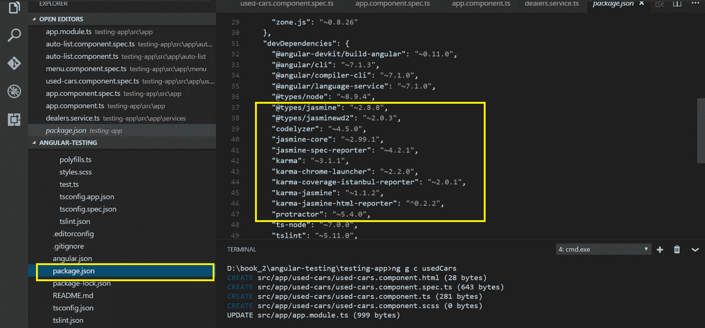
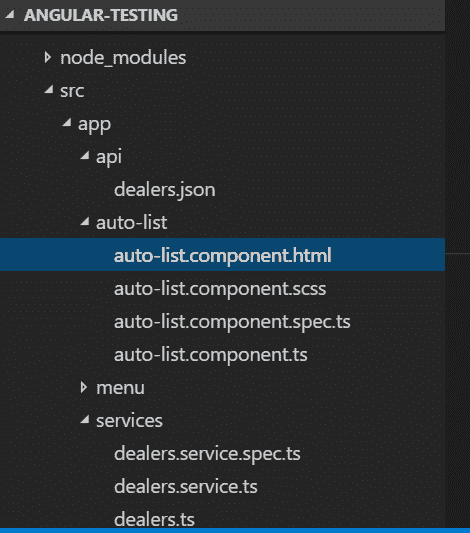
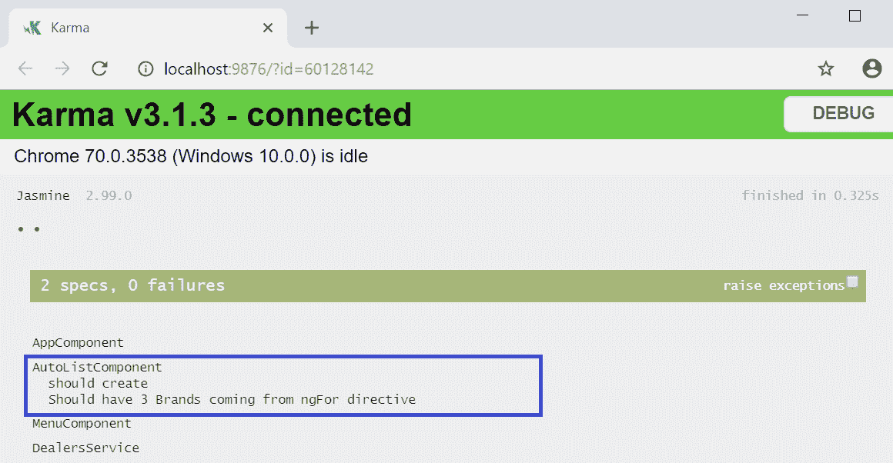
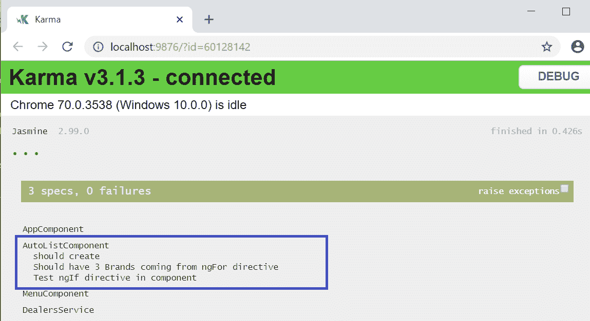
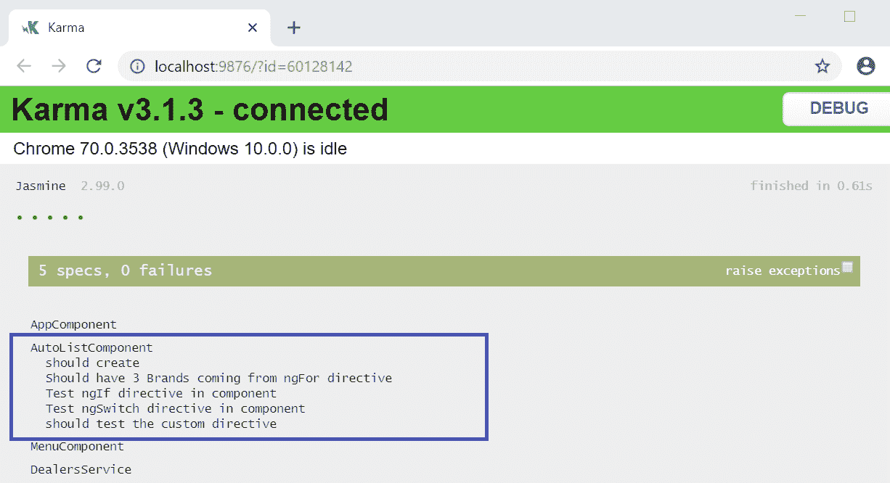
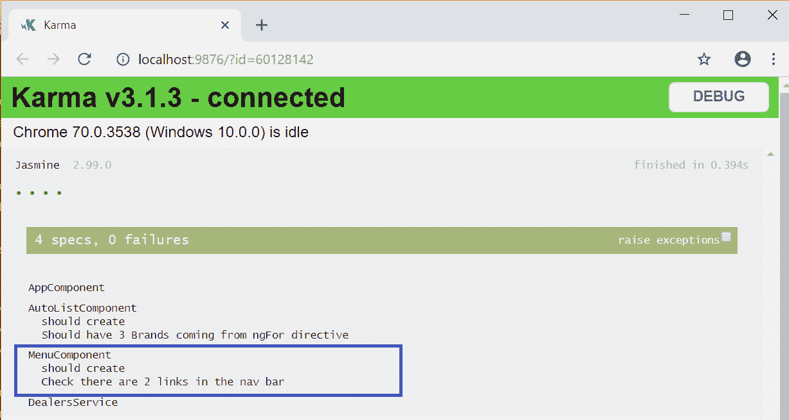
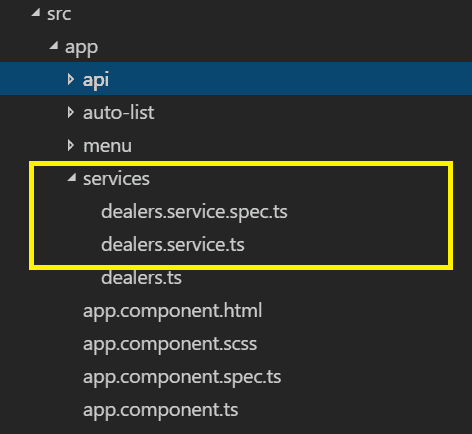
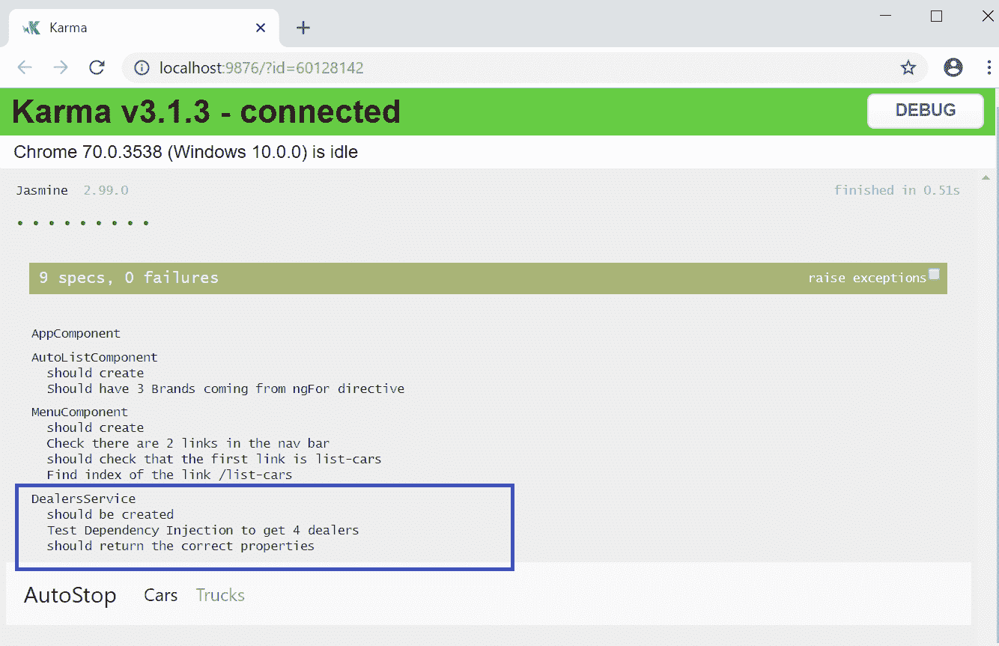
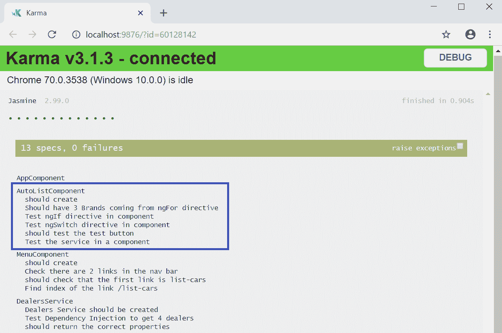
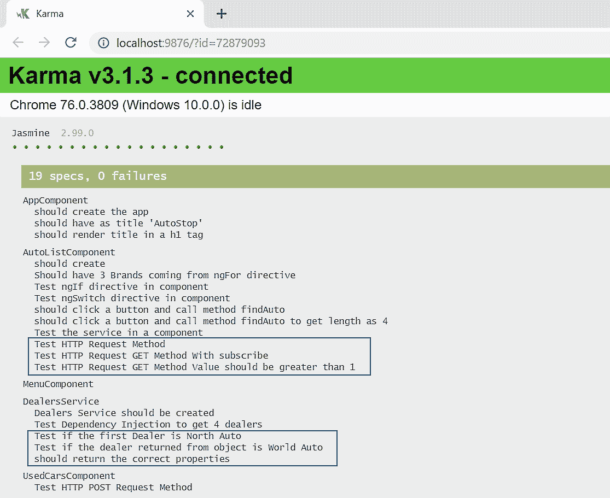

# 单元测试


您可能已经为传统的服务器端代码编写了单元测试，如 Java、Python 或 C#。当然，单元测试在客户端也同样重要，在本章中，您将学习角度测试，包括 Jasmine 和 Karma 框架，这两个用于单元测试客户端代码的优秀工具。

我们将一起探讨如何对 Angular 应用程序的各个部分进行单元测试，例如组件、路由和依赖注入（DI。

本章将涵盖以下主题：

*   茉莉花与因果报应简介
*   测试指令
*   测试组件
*   测试路由
*   测试依赖注入
*   测试 HTTP


# 测试框架简介


在本节中，我们将学习两个重要的测试框架，即 Jasmine 和 Karma。

测试和开发本身一样重要。这是一个极具争议的话题，一些专家相信**测试驱动开发**（**TDD**），这意味着在编写开发代码之前编写测试脚本就很重要了。

Angular 框架的优点在于，它本机支持测试框架，并提供了许多测试实用程序，使开发人员的工作轻松愉快。我们一点也不抱怨。

Angular 为我们提供了一个核心测试模块，它有许多我们可以使用的很棒的类，并且本机支持两个重要的测试框架，即 Jasmine 和 Karma：

*   我们使用 Jasmine 框架编写测试脚本。
*   我们使用 Karma 框架来执行测试脚本。


# 关于 Jasmine 框架


Jasmine 是一个领先的开源测试框架，用于为现代 web 框架编写和测试自动化测试脚本

当然，对于 Angular 来说，Jasmine 已经成为事实上的 go-to 框架。以下内容摘自官方网站：

"Jasmine is a behavior-driven development framework for testing JavaScript code. It does not depend on any other JavaScript frameworks. It does not require a DOM. And it has a clean, obvious syntax so that you can easily write tests."

编写 Jasmine 测试脚本背后的想法是行为和功能驱动的。测试脚本有两个重要元素-`describe`和规范（`it`：

*   `describe`功能用于将相关规格分组在一起。
*   通过调用`it`函数来定义规格。

下面是一个用 Jasmine 编写的测试脚本示例：

```ts
describe("Test suite", function() {
  it("contains spec with an expectation", function() {
    expect(true).toBe(true);
  });
});
```

在编写测试规范的过程中，我们必须使用大量的条件检查来匹配数据、元素、结果、断言条件等等。Jasmine 框架提供了许多匹配器，我们可以在编写测试规范时随时使用这些匹配器。在前面的示例代码中，toBe 就是这样一个 matcher 示例。

下面列出了《茉莉花》中最常用和最常用的配对工具：

*   `toBe`
*   `toBeTruthy`
*   `toBeFalsy`
*   `toBeGreaterThanOrEqual`
*   `toBeLessThanOrEqual`
*   `toHaveBeenCalled`
*   `toHaveClass`
*   `toMatch`

在接下来的几节中，我们将学习如何使用这些匹配器。好的，我们已经编写了测试规范，那么现在呢？我们如何管理它们？什么能帮我们运行它们？答案可以在下一节中找到


# 关于业力框架


Karma 是一个测试运行框架，用于在服务器上执行测试脚本并生成报告。

以下内容摘自官方网站：

"Karma is essentially a tool which spawns a web server that executes source code against test code for each of the browsers connected. The results of each test against each browser are examined and displayed via the command line to the developer such that they can see which browsers and tests passed or failed."

Karma 框架被添加到我们的依赖项列表中，因为它包含在 Angular CLI 安装中。在我们开始编写和执行测试脚本之前，最好先验证我们是否在`package.json`文件中正确安装了 Jasmine 和 Karma。我们还可以验证正在使用的库的版本号。

我敢打赌，你一定发现这里也是指定你想要使用的茉莉花和业力的任何特定版本的地方。

在下面的屏幕截图中，我们可以确认我们已将茉莉花和卡玛添加到我们的`package.json`文件中的`devDependencies`列表中：



伟大的现在，是深入研究角度测试概念并编写一些测试脚本的时候了。


# 测角自动化


我相信你会同意我的观点，测试自动化是产品开发中最重要的方面之一。在前面的章节中，我们探讨了 Jasmine 和 Karma 框架。在接下来的几节中，我们将通过一些实际操作的示例来演示如何自动化各种 Angular framework 构建块。我们将学习如何测试角度组件、指令、路由等等。让我们直接跳进去。


# 测试角组件


在使用 Angular CLI 的过程中，我们生成了多个组件和服务。请暂停并查看文件和文件夹结构。您会注意到，对于每个组件和服务，都生成了一个`.spec.ts`文件。

尤里卡时刻！Angular CLI 已经为各个组件和服务生成了所需的 shell 测试脚本。让我们生成一个名为`auto-list`的组件：

```ts
ng g component auto-list
```

Angular CLI 自动生成所需文件，并在所需文件中创建条目（`AppModule`、`Angular.json`等）。

以下屏幕截图描述了 CLI 生成的测试规范：



仔细查看生成的文件。您将看到为组件生成的以下文件：

*   `auto-list.component.html`
*   `auto-list.component.spec.ts`
*   `auto-list.component.ts`
*   `auto-list.component.scss`

我们对 Angular CLI 生成的 spec 文件感兴趣。等级库文件是为相应组件生成的测试脚本。spec 文件将导入所需的基本模块以及`Component`类。规范文件还将包含一些已经编写的基本测试规范，这些规范可以作为起点，或者作为我们的动机。

让我们仔细看看在 SPEC 文件中生成的代码：

```ts
import { async, ComponentFixture, TestBed } from '@angular/core/testing';
import { AutoListComponent } from './auto-list.component';
```

在前面的代码中，您会注意到所需的模块是从角度测试核心导入的。这当然不是我们将使用的模块的最终列表，而是基本的启动模块。请注意，出于测试的目的，我们还可以在 spec 文件中创建一个新的 spec，这意味着您可以在 spec 中创建一个用于测试的对象。非常酷？继续看代码行，我们可以看到以下内容：

```ts
describe('AutoListComponent', () => {
    let component: AutoListComponent;
    let fixture: ComponentFixture<AutoListComponent>;
beforeEach(async(() => {
    TestBed.configureTestingModule({
    declarations: [ AutoListComponent]
 })
 .compileComponents();
 }));

beforeEach(() => {
    fixture = TestBed.createComponent(AutoListComponent);
    component = fixture.componentInstance;
    fixture.detectChanges();
});
```

在前面的代码中，您将注意到一些关键点。有一个`describe`语句，用于将相关测试规范分组在一起。我们将在`describe`函数中创建测试规范。规范文件中定义了两种`beforeEach`方法。

第一个`beforeEach`方法是一个异步承诺，它将设置我们的`TestBed`，这意味着在继续之前必须解决其中声明的所有问题；否则，我们的测试将无法工作。第二个`beforeEach`方法将创建我们的`AutoList`组件的实例进行测试。您将注意到对`fixture.detectChanges()`的调用，这将强制 Angular 的更改检测运行，并预先影响测试中的元素。

现在，是时候了解在规范文件中生成的实际测试规范了：

```ts
it('should create', () => {
 expect(component).toBeTruthy();
 });
```

正如我们前面提到的，Jasmine 测试规范写在`it`语句中，在本例中，它只是一个简单的断言，用于使用`toBeTruthy`匹配器检查组件是否存在以及是否正确。

这就是我们的规格文件。快乐在于看到它工作。让我们运行 Angular 为我们生成的默认测试。为了运行 Angular 应用程序内部编写的测试，我们使用命令行界面上的`ng test`命令：

```ts
ng test
```

如果你看到一个新窗口正在打开，不要惊慌。您会注意到 Karma runner 打开了一个新的浏览器窗口来执行测试，并生成了测试执行报告。以下屏幕截图显示了为组件的测试规范生成的报告：


所以，我们的测试通过了。现在，让我们稍微修改一下脚本。我们将在组件中创建一个名为`title`的变量，并分配一个值。在我们的测试规范中，我们将验证值是否匹配。这是一个简单的用例，相信我，它也是您将在应用程序中实现的最常见的用例。让我们打开`app.component.spec.ts`文件，在测试脚本中进行更改：

```ts
it(`should have as title 'testing-app'`, () => {
 const fixture = TestBed.createComponent(AppComponent);
 const app = fixture.debugElement.componentInstance;
 expect(app.title).toEqual('AutoStop');
});
```

在前面的代码中，我们正在编写一个测试规范，并且使用`TestBed`，我们正在创建一个`AppComponent`的 fixture 元素。使用 fixture 元素的`debugElement`接口，我们得到了`componentInstance`属性。接下来，我们编写一个`expect`语句来断言`title`变量的值是否等于`AutoStop`。那很好。让我们试着再写一个测试规范。我们将处理的用例如下：我们有一个`H1`元素，如果`H1`标记中的值等于`Welcome to Autostop`，我们想断言它。以下是相关示例代码：

```ts
it('should render title in a h1 tag', () => {
 const fixture = TestBed.createComponent(AppComponent);
 fixture.detectChanges();
 const compiled = fixture.debugElement.nativeElement;
 expect(compiled.querySelector('h1').textContent).toContain('Welcome to 
  AutoStop');
});
```

在前面的代码中，我们正在断言`h1`元素的`textContent`是否包含文本`Welcome to AutoStop`。请注意，在以前的测试规范中，我们使用了`componentInstance`接口，在本测试规范中，我们使用了`nativeElement`属性。再次使用`ng test`命令运行测试。以下屏幕截图显示了生成的测试报告：


到目前为止，我们已经对 Jasmine 和 Karma 框架进行了概述，还学习了如何运行测试脚本。我们还了解了 Angular 为我们生成的默认规范文件，以及如何修改测试规范。

在接下来的部分中，我们将学习如何编写测试规范和脚本来测试内置指令、服务、路由等。


# 测试指令


Angular 提供了许多内置的强大指令，如[T0]、[T1]等，可用于扩展本机 HTML 元素的行为和功能。我们在[第 7 章](07.html)、*模板、指令和管道中学习了角度模板和指令。*快速回顾从未伤害过任何人。Angular 为我们提供了两种类型的指令，我们可以使用它们来开发和扩展元素的行为：

*   内置指令
*   自定义指令

本节的重点是学习如何为内置 Angular 指令编写测试脚本，如[T0]、[T1]、[T2]和[T3]。在开始编写测试脚本之前，我们需要做一些基础工作来更新组件，以便开始编写测试用例。我们将编写几个变量，这些变量将保存各种类型的数据。我们将使用`ngFor`在模板中显示数据，并使用`ngIf`编写一些条件检查

If you want a quick revision of Angular templates and directives, refer to [Chapter 7](07.html), *Templates, Directives, and Pipes*.

我们将继续使用上一节中创建的相同组件`AutoListComponent`，让我们开始聚会。我们的起点将是`AutoListComponent`类，所以让我们修改`auto-list.component.ts`文件：

```ts
import { Component, OnInit } from '@angular/core';

@Component({
 selector: 'app-auto-list',
 templateUrl: './auto-list.component.html',
 styleUrls: ['./auto-list.component.scss']
})
export class AutoListComponent implements OnInit {

cars = [
 { 'id': '1', 'name': 'BMW' },
 { 'id': '2', 'name': 'Force Motors' },
 { 'id': '3', 'name': 'Audi' }
 ];

 tab = "1";

 constructor() { }

 ngOnInit() {
 }

 findAuto() {
     console.log("Method findAuto has been called");
  }

}
```

在前面的代码中，我们添加了一个名为`cars`的 JSON 对象类型的变量，并为其分配数据。我们将通过在模板中显示来使用这些数据。我们还声明了一个变量[T1]，并分配了一个值[T2]。我们将在模板中使用`tab`变量进行条件检查。最后，我们添加了一个方法`findAuto`，并在控制台中显示输出。

我们已经修改了我们的组件类。我们还需要更新模板文件，以便处理组件内部的数据。下面是我们将添加到模板文件`auto-list.component.html`中的示例代码：

```ts
<h4 class="c2">ngFor directive</h4>
<ul class="cars-list">
 <li *ngFor="let car of cars">
 <a [routerLink]="[car.id]">{{ car.name }}</a>
 </li>
</ul>

<h4 class="c1">ngIf directive</h4>
<div *ngIf="cars.length" id="carLength">
 <p>You have {{cars.length}} vehicles</p>
</div>

<h4 class="c3">ngSwitch directive</h4>
<div [ngSwitch]="tab" class="data-tab">
 <p>This is ngSwitch example</p>
 <div *ngSwitchCase="1">ngSwitch Case 1</div>
 <div *ngSwitchCase="2">ngSwitch Case 2</div>
</div>
<hr>

<button (click)="findAuto()" id="btn">Click to findAutoDealers</button>
```

在前面的代码中，我们正在对模板文件进行更改。首先，我们使用`ngFor`指令循环行并显示车辆。接下来，我们将添加一个`ngIf`条件来检查汽车的长度是否大于 0，然后我们将显示`carLength`元素的计数。我们已经添加了一个`ngSwitch`指令来检查`tab`变量的值是否已设置，并且根据选项卡的值，我们将相应地显示相应的选项卡。在我们的例子中，由于分配给选项卡的值是`1`，我们将显示第一个选项卡。最后，我们添加了一个按钮，并将`findAuto`方法与单击事件关联。

美丽的我们的组件和模板已经准备好了，现在是时候编写一些好的测试脚本来测试前面的逻辑，尤其是 Angular 内置指令了。我们将测试的一些用例包括测试 UI 中显示的汽车数量、测试哪个选项卡处于活动状态、验证元素中的内容，等等。下面是一些用例，我们将学习如何为这些用例编写测试脚本：

**用例#1**：我们有一个汽车列表，我们想确认总数为`3`：

```ts
// ngFor test case to test the count is 4
 it('Should have 3 Brands coming from ngFor directive', async(() => {
 const fixture = TestBed.createComponent(AutoListComponent);
 fixture.detectChanges();
 const el = fixture.debugElement.queryAll(By.css('.cars-list > li'));
 expect(el.length).toBe(3);
 }));
```

在前面的代码中，我们正在创建一个`AutoListComponent`组件的夹具。
我们已经学习了如何使用`debugElement`来瞄准一个元素，并且在本测试规范中，我们使用`queryAll`方法来获得带有`className``.cars-list > li`的元素列表。最后，我们正在编写一个`expect`语句来断言总计数是否等于`3`。

使用`ng test`命令运行测试。我们应该看到以下输出：



**用例**：我们想验证 HTML 元素中的文本是否包含`vehicles`键盘：

```ts
// ngIf test script
 it('Test ngIf directive in component', async(() => {
 const fixture = TestBed.createComponent(AutoListComponent);
 fixture.detectChanges();
 const compiled = fixture.debugElement.nativeElement;
 const el = compiled.querySelector('#carLength');
 fixture.detectChanges();
 const content = el.textContent;
 expect(content).toContain('vehicles', 'vehicles');
 }));
```

在前面的代码中有一些重要的事情需要注意。我们继续使用组件的相同夹具元件`AutoListComponent`。这一次，我们使用`debugElement`接口，使用`querySelector`方法查找标识符为`carLength`的元素。最后，我们正在编写一个`expect`语句来断言文本内容是否包含`vehicles`关键字

让我们使用[T0]命令再次运行测试。我们应该看到以下输出：



**用例**我们想用`ngSwitch`来验证 tab1 是否被选中，如果被选中，则显示相应的 div：

```ts
// ngSwitch test script
 it('Test ngSwitch directive in component', async(() => {
 const fixture = TestBed.createComponent(AutoListComponent);
 fixture.detectChanges();
 const compiled = fixture.debugElement.nativeElement;
 const el = compiled.querySelector('.data-tab > div');
 const content = el.textContent;
 expect(content).toContain('ngSwitch Case 1');
 }));
```

在前面的代码中，我们继续使用`AutoListComponent`组件的 fixture 元素。使用`debugElement`和`querySelector`方法，我们使用`className '.data-tab > div'`来定位元素。我们正在断言`ngSwitch`条件是否为`true`并显示相应的`div`。由于我们已经在我们的组件中将 tab 的值设置为`1`，tab1 显示在屏幕上，测试规范通过：


**用例**测试`AutoListComponent`中定义的方法，并断言该方法是否已被调用：

```ts
// Test button is clicked
 it('should test the custom directive', async(() => {
 const fixture = TestBed.createComponent(AutoListComponent);
 component = fixture.componentInstance;
 fixture.detectChanges();
 spyOn(component, 'findAuto');
 component.findAuto();
 expect(component.findAuto).toHaveBeenCalled();

}));
```

在前面的代码中，我们正在为`AutoListComponent`组件创建一个 fixture。我们正在使用`spyOn`方法监视组件实例。我们正在调用`findAuto()`方法。最后，我们正在编写一个`expect`语句，以断言使用`toHaveBeenCalled`的`findAuto`方法是否已被调用。

使用`ng test`命令运行测试。我们应该看到以下输出：



在本节中，我们学习了如何编写单元测试脚本来测试角度内置指令，例如`ngFor`、`ngIf`、`ngSwitch`，最后，断言是否单击并调用了方法。

在下一节中，我们将学习如何测试角度布线。


# 测角布线


最有可能的是，在整个应用程序中，您将以导航菜单或深度链接的形式拥有多个链接。这些链接在角度上被视为路由，通常在`app-routing.module.ts`文件中定义。

我们在[第 4 章](04.html)、*路由*中学习并掌握了如何使用角度路由。在本节中，我们将学习如何编写测试脚本，以测试角度路由以及应用程序中的链接和导航。

我们的应用程序需要一个漂亮的`menu`组件。使用`ng generate component menu`命令，我们将生成`menu`组件。现在，让我们导航到`menu.component.html`并创建一个名为`navbar`的菜单，其中包含两个链接：

```ts
<nav class="navbar navbar-expand-lg navbar-light bg-light">
 <a class="navbar-brand" href="#">AutoStop </a>
 <button class="navbar-toggler" type="button" data-toggle="collapse" 
    data-target="#navbarSupportedContent" aria-controls="navbarSupportedContent" 
    aria-expanded="false" aria-label="Toggle navigation">
 <span class="navbar-toggler-icon"></span>
 </button>

<div class="collapse navbar-collapse" id="navbarSupportedContent">
 <ul class="navbar-nav mr-auto">
 <li class="nav-item active">
 <a class="nav-link" routerLink="/list-cars">Cars <span class="sr-only">
   (current)</span></a>
 </li>
 <li class="nav-item">
 <a class="nav-link" routerLink="/list-trucks">Trucks</a>
 </li>
 </ul>
 </div>
</nav>
```

前面的代码没有什么特别之处，至少现在还没有。这是使用引导生成`navbar`组件的标准代码。仔细看，您会发现我们在菜单栏中定义了两个链接，`list-cars`和`list-trucks`，类为`nav-link`。

我们现在可以围绕菜单功能编写一些测试规范来测试`navbar`组件，其中包括导航、链接计数等。

**用例**：我们需要测试`navbar`菜单是否有两个链接。

下面是检查是否有两个链接的代码：

```ts
// Check the app has 2 links
 it('should check routerlink', () => {
 const fixture = TestBed.createComponent(MenuComponent);
 fixture.detectChanges();
 const compiled = fixture.debugElement.nativeElement;

let linkDes = fixture.debugElement.queryAll(By.css('.nav-link'));
 expect(linkDes.length).toBe(2);

});
```

在前面的代码中，我们正在为`MenuComponent`组件创建一个夹具。由于我们已经分配了`nav-link`类，所以很容易在组件中定位相应的链接。使用`debugElement`和`queryAll`方法，我们找到了所有`className`为`nav-link`的链接。最后，我们正在编写一个`expect`语句来断言返回的链接数组的长度是否等于`2`。

使用`ng test`命令运行测试。我们应该看到以下输出：



这是测试菜单功能的良好开端。现在我们知道菜单中有两个链接，接下来我们要测试的用例是第一个链接是否为`list-cars`

下面是测试链路数组中第一个链路是否为`list-cars`的代码：

```ts
// Check the app has first link as "List Cars"
 it('should check that the first link is list-cars ', () => {
 const fixture = TestBed.createComponent(MenuComponent);
 fixture.detectChanges();
 const compiled = fixture.debugElement.nativeElement;

 let linkDes = fixture.debugElement.queryAll(By.css('.nav-link'));

 expect(linkDes[0].properties.href).toBe('/list-cars', '1st link should  
    go to Dashboard');
 });
```

在前面的代码中，我们正在为我们的`MenuComponent`组件创建一个 fixture。使用`debugElement`和`queryAll`方法，我们正在查找所有将`className`作为`nav-link`的链接。我们将获得所有类名为`nav-link`的链接。菜单中可以有多个链接，但我们感兴趣的是通过`index [0]`读取第一个元素的`href`属性，并断言值是否匹配`/list-cars`。

再次运行[T0]命令。我们应该看到我们的测试报告更新，如以下屏幕截图所示：


好吧，很公平。我们发现`list-cars`菜单链接是菜单列表中的第一个。如果我们不知道我们正在搜索的链接的索引或位置，该怎么办？让我们也来处理这个用例。

请看以下代码段：

```ts
// Check the app if "List Cars" link exist
 it('should have a link to /list-cars', () => {
 const fixture = TestBed.createComponent(AppComponent);
 fixture.detectChanges();
 const compiled = fixture.debugElement.nativeElement;
 let linkDes = fixture.debugElement.queryAll(By.css('.nav-link'));
 const index = linkDes.findIndex(de => {
 return de.properties['href'] === '/list-cars';
 });
 expect(index).toBeGreaterThan(-1);
 });
```

需要注意的是，我们正在查找路由路径的索引`/list-cars`，我们也在利用分配的类`nav-link`，并使用`queryAll`方法获取所有匹配元素的数组。使用`findIndex`方法，我们正在循环数组元素以查找匹配`href`到`/list-cars`的索引 .

使用`ng test`命令再次运行测试，更新后的测试报告应如下所示：


在本节中，我们学习了各种针对路由器链路的方法。同样的原则也适用于寻找深层链接或子链接。

那是你的家庭作业。


# 测试依赖注入


在前面的部分中，我们学习了如何编写测试脚本来测试角度组件和布线。在本节中，我们将学习如何测试依赖注入以及如何在角度应用程序中测试服务。我们还将学习如何将服务注入到 Angular 组件中，并编写测试脚本来测试它们。


# 什么是依赖注入？


**依赖注入**（**DI**）是 Angular 框架中的一种重要设计模式，它允许在运行时灵活地将服务、接口和对象注入类中。

DI 模式有助于编写高效、灵活、可维护、可测试且易于扩展的代码。

If you need a quick recap, head over to [Chapter 11](11.html), *Dependency Injection and Services*, which covers and explains the DI mechanism in depth.


# 测角服务


在本节中，我们将学习如何通过服务和接口测试角度依赖注入。为了测试角度服务，我们首先需要在我们的应用程序中创建一个服务！

在 Angular CLI 中使用`ng generate`命令；我们将在项目文件夹中生成服务：

```ts
ng generate service services/dealers
```

成功执行后，我们应看到已创建以下文件：

*   `services/dealers.service.spec.ts`
*   `services/dealers.service.ts`



现在我们已经生成了经销商服务和相应的测试规范文件，我们将在服务上添加一些方法和变量，因此我们将在测试规范中使用它们。导航到我们的服务类并更新`dealers.service.ts`文件。更新后的代码应如下所示：

```ts
import { Injectable } from '@angular/core';

@Injectable({
  providedIn: 'root'
})
export class DealersService {
  dealers: any;

  constructor(private http : HttpClient) { }

  getDealers(){
    this.dealers = [
      { id: 1, name: 'North Auto'},
      { id: 2, name: 'South Auto'},
      { id: 3, name: 'East Auto'},
      { id: 4, name: 'West Auto'},
    ];

    return this.dealers;
  }

}
```

在前面的代码中，我们做了一些简单的更改，这样我们就可以围绕经销商服务编写一些测试规范。我们已经定义了一个`any`类型的变量。我们正在定义一个`getDealers`方法，它将返回一个带有`id`和`name`密钥对的 JSON 响应。好的，现在让我们拿出一些用例来编写测试脚本，比如获取经销商数量，找到匹配的经销商，等等。

**用例**：调用`getDealers`方法时，返回经销商列表，计数应等于`4`。

以下是此测试的测试规范：

```ts
it('Test Dependency Injection to get 4 dealers', () => {
const service: DealersService = TestBed.get(DealersService);
let dealers = service.getDealers();
expect(dealers.length).toBe(4);
});
```

**用例**：我们想检查第一个经销商名称是否为`North Auto`。

以下是此测试的测试规范：

```ts
it('Test if the first Dealer is North Auto', () => {
const service: DealersService = TestBed.get(DealersService);
let dealers = service.getDealers();
expect(dealers[0].name).toBe('North Auto');
});
```

太神了到目前为止，一切顺利。因此，我们已经学会了如何为我们新创建的经销商服务编写测试规范。这只是依赖注入的一部分。作为依赖注入的一部分，我们可能需要在运行时向服务中注入额外的必需类

让我们快速创建一个名为`Dealers`的类，并在其中定义两个变量，即`username`和`name`。现在，让我们将此文件另存为`dealers.ts`：

```ts
export class Dealers {

 constructor(
  public username: string = '',
  public name: string = ''
 ) {};

}
```

现在，我们将在经销商服务中包含新创建的类，并创建一个方法来初始化该类，并创建一个对象来返回一些数据：

```ts
getDealerObject()
 {
 this.dealerObj= new Dealers('World','Auto');
 return this.dealerObj;
 }
```

这让我们进入下一个用例进行测试。

**用例#3**：通过已注入服务的类测试依赖注入。

请查看以下代码：

```ts
 it('Test if the dealer returned from object is World Auto', () => {
 const service: DealersService = TestBed.get(DealersService);
 let dealerObj = service.getDealerObject();
 expect(dealerObj.name).toBe('Auto');
 });
```

在前面的代码中，我们已经创建了一个服务实例并调用了`getDealerObject()`方法。我们正在断言返回的值是否匹配`Auto`响应的`name`属性。

我们正在调用服务中定义的方法，该服务在内部依赖于`Dealers`类。

**用例 4**：如果我们只想测试`Dealers`类的属性怎么办？

我们也可以测试一下。以下是此应用程序的示例代码：

```ts

it('should return the correct properties', () => {
var dealer = new Dealers();
dealer.username = 'NorthWest';
dealer.name = 'Auto';

expect(dealer.username).toBe('NorthWest');
expect(dealer.name).toBe('Auto');

});
```

现在，让我们运行`ng test`命令。我们应该看到以下输出：



在同一行中，您可以编写测试脚本来测试服务、依赖项类或接口类。

**用例#5**：测试组件内部的角度服务。

我们将继续测试角度依赖注入。这一次，我们将把服务导入到组件中，并验证它是否按预期工作。

为了实现这个用例，我们需要对`AutoListComponent`进行更改。

请看一下我们将在`auto-list.component.ts`文件中进行的更改：

```ts
import { DealersService } from '../services/dealers.service';
constructor(private _dealersService : DealersService) { }
findAuto() {
 this.dealers = this._dealersService.getDealers();
 return this.dealers;
 }
```

在前面的代码中，我们正在将 dealers 服务导入组件中。我们正在构造函数方法中创建该服务的实例。我们添加了一个`findAuto`方法，它使用`class _dealersService`服务的实例调用`getDealers`方法，为了在我们的组件中测试服务，我们通过添加以下代码来修改`auto-list.component.spec.ts`文件：

```ts
import { DealersService } from '../services/dealers.service';
beforeEach(() => {
 fixture = TestBed.createComponent(AutoListComponent);
 component = fixture.componentInstance;
 fixture.detectChanges();
 service = TestBed.get(DealersService);
 });
```

在前面的代码中，我们已经将我们的服务经销商导入到`AutoListComponent`的测试规范文件中。我们正在使用`beforeEach`方法中的`TestBed`创建服务实例。我们现在可以开始编写测试规范来测试服务了。将以下代码添加到`auto-list.component.spec.ts`：

```ts
it('should click a button and call method findAuto', async(() => {
    const fixture = TestBed.createComponent(AutoListComponent);
    component = fixture.componentInstance;
    fixture.detectChanges();
    spyOn(component, 'findAuto');
    let dealers = component.findAuto();
    expect(dealers.length).toEqual(4);

  }));
```

在前面的代码中，我们使用组件的实例调用`findAuto`方法，该方法将从服务返回数据。它希望计数等于[T1]。

使用`ng test`命令运行测试。我们应该看到以下输出：



在本节中，我们学习了测试角度依赖注入的各种技术，包括服务、依赖类和测试角度组件内的服务。


# 测试 HTTP


在[第 12 章](12.html)*集成后端数据服务*中，我们学习了如何集成后端服务，也学习了`HTTPModule`和`HTTPClient`，我们还学习了如何向服务器发出 HTTP 请求并处理响应

在本节中，我们将学习如何编写测试脚本来测试 HTTP 请求和响应。我们将继续使用我们在本章中创建的相同项目 AutoStop 项目。在继续之前，重要的是准备好 RESTAPI 端点，以便我们可以在应用程序中使用它们。

我们将学习如何使用互联网上免费提供的公共 API`https://jsonplaceholder.typicode.com/`。我们还将创建一个本地服务器，从本地静态 JSON 文件返回模拟 JSON 响应。

We must import `HttpClientModule` and `HttpClientTestingModule` into our `app.module.ts` file.

在我们继续编写用于测试 Angular HTTP 的测试脚本之前，我们需要更新我们的经销商服务，我们在本章中一直使用该服务。我们将实现一些方法，使 HTTP 调用 POST/GET 来处理 RESTAPI 端点的数据。

我们正在处理`dealers.service.ts`文件，如下所示：

```ts
import { HttpClient } from '@angular/common/http';
import { HttpHeaders, HttpParams, HttpErrorResponse } from '@angular/common/http';
readonly REST_ENDPOINT = 'https://jsonplaceholder.typicode.com/users';
readonly DEALER_REST_ENDPOINT = 'https://jsonplaceholder.typicode.com/users/1';
private _carurl = 'http://localhost:3000/cars';
```

在前面的代码中，我们正在导入所需的 HTTP 模块；也就是说，`HttpClient`、`HttpHeaders`、`HttpParams`和`HttpErrorResponse`，并且还定义了两个 REST 端点，它们具有用户和特定用户的 API URL。

We can also have a local server up and running. You can have local APIs using the JSON server. You can learn more about this at [https://github.com/typicode/json-server](https://github.com/typicode/json-server).

现在是添加一些方法的时候了，我们将通过这些方法对 REST 端点进行 HTTP 调用：

```ts
getAllDealers()
{
this.allDealers = this.http.get(this.REST_ENDPOINT,
{
headers: new HttpHeaders().set('Accept', 'aplication/json')
});
return this.allDealers;
}

getDealerById(){
let params = new HttpParams().set('id', '1');
this.dealerDetails = this.http.get(this.REST_ENDPOINT, {params});
return this.dealerDetails;
}
```

在前面的代码中，我们创建了两个方法，它们发出 HTTP GET 请求。第一个方法`getAllDealers`进行调用，并期望用户做出 JSON 响应。第二种方法`getDealerById`将`id`传递为`1`，并期望单用户数据响应。在`getDealerById`方法中，我们使用`HttpParams`设置发送到端点的参数。我们还将修改`autoListComponent`组件，向`Component`类添加一些方法。

我们正在将以下代码添加到我们的`auto-list.component.ts`文件中：

```ts
findAuto() {
 this.dealers = this._dealersService.getDealers();
 return this.dealers;
 }

listAllDealers(){
 this.allDealers = this._dealersService.getAllDealers();
 }

listDealerById(){
 this.showDealerInfo = true;
 this.dealerDetail = this._dealersService.getDealerById();
 return this.dealerDetail;
 }

getCarList() {
 this.carList = this.http.get<Cars[]>(this._carurl);
 }
```

在前面的代码中，我们添加了几个方法，即`findAuto`、`listDealerById`和`getCarList`，它们进行 HTTP 调用，调用经销商服务中的方法。

好的，现在我们已经设置了组件和服务，它们正在进行 HTTP 调用，我们可以编写 HTTP 测试了。

**用例**：我们想测试`GET`调用是否针对特定 URL。

我们将在`auto-list.component.spec.ts`文件中添加以下代码：

```ts
// Test HTTP Request From Component
 it('Test HTTP Request Method', async(() => {
 const fixture = TestBed.createComponent(AutoListComponent);

 component = fixture.componentInstance; 
 httpMock = TestBed.get(HttpTestingController);

 let carList = component.getCarList();

 fixture.detectChanges();
 const req = httpMock.expectOne('http://localhost:3000/cars');

 expect(req.request.method).toBe('GET');
 req.flush({});

 }));
```

在前面的代码中，我们正在创建`AutoListComponent`实例，使用该实例我们将调用其`getCarList`方法。在`getCarList`方法中，我们正在调用`http://localhost:3000/cars`URL 来检索数据。我们正在创建名为`httpMock`的`HttpTestingController`类的实例。使用`httpMock`实例，我们断言至少应该对 URL 进行一次调用。

**用例**：我们希望结果返回的数据大于`1`：

```ts
it('Test HTTP Request GET Method With subscribe', async(() => {
const fixture = TestBed.createComponent(AutoListComponent);
component = fixture.componentInstance;
component.listDealerById().subscribe(result => 
expect(result.length).toBeGreaterThan(0));

}));
```

在前面的代码中，我们使用`AutoListComponent`实例调用`listDealerById`方法。使用`subscribe`，我们正在映射结果并验证结果数据长度是否大于`0`。

**用例#3**：我们想验证 HTTP 调用返回的数据是否与数据匹配。下面是此用例场景的示例代码。

```ts
it('Test if the first Dealer is North Auto', () => {
const service: DealersService = TestBed.get(DealersService);
let dealers = service.getDealers();
expect(dealers[0].name).toBe('North Auto');
});
```

在前面的代码中，我们使用`DealersService`实例调用`getDealers`方法。我们断言第一个索引属性名称的数据为`North Auto`。

使用`ng test`命令运行测试。我们应该看到以下输出，如以下屏幕截图中显示和突出显示的：



如果您看到前面的输出，那就太棒了。

在本节中，我们学习了如何测试进行 HTTP 请求调用的组件、服务和方法。


# 总结


测试是应用程序生命周期的一个重要方面，编写测试脚本对于应用程序开发的成功至关重要。我们首先概述了 Angular 支持的框架，即 Jasmine 和 Karma。我们学习了如何使用[T0]命令运行测试。然后，我们学习了如何使用 Angular 为所有组件和服务自动生成的规范文件

我们学习了如何编写测试脚本来测试角度组件、内置指令、服务和路由。我们为内置指令编写测试脚本，如[T0]、[T1]、[T2]和[T3]。我们还介绍了测试角度布线的用例。然后，我们创建了一个`menu`组件，并编写测试脚本来测试`menu`组件的各种用例。

我们还探讨了测试依赖注入和服务。我们了解了各种用例，并为 Angular 服务和 HTTP 调用编写了测试脚本

在下一章中，我们将探讨高级的角度主题，例如自定义指令和自定义表单验证。

读下去！