# 高级角度主题


在前面的章节中，我们学习了如何使用指令和表单验证器。我们将通过自定义指令和自定义验证器扩展本章中的知识。我们还将研究如何使用 Angular 构建**单页应用程序**（**SPA**）。

此外，我们还将探索将身份验证与两个流行的身份验证提供商集成到 Angular 应用程序中：Google Firebase 身份验证和 Auth0。

本章将涵盖以下主题：

*   自定义指令
*   自定义表单验证程序
*   建筑温泉
*   用户身份验证
*   使用 Firebase 身份验证进行身份验证
*   使用 Auth0 进行身份验证
*   连接客户端


# 自定义指令


在本节中，我们将学习如何创建自定义指令。

**首先，让我们了解什么是角度指令。**

角度指令是扩展 HTML 功能和元素行为的一种方法。

在前面的章节中，我们了解并实现了许多内置指令，如[T0]、[T1]、[T2]和[T3]。

在本节中，我们将学习如何创建自己的自定义指令来扩展 HTML 元素的功能。

**用例：**我们希望为表单元素和`onfocus`创建一个自定义指令。背景颜色应设置为浅蓝色，边框为深蓝色，`onblur`事件应以红色突出显示。那么，让我们开始：

1.  让我们使用`ng`命令生成指令：

```ts
 ng g directive onFocusBlur
```

运行上一个命令时，屏幕上将显示以下内容：

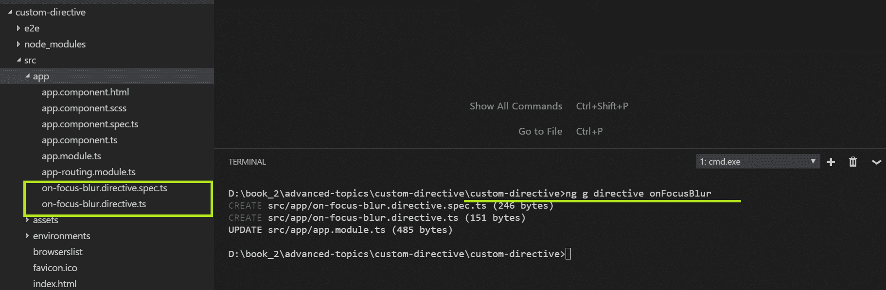

请注意，指令文件已经生成，我们的`app.module.ts`文件也已经更新，这意味着指令可以在应用程序中使用，可以在任何组件中的任何位置使用。

2.  在指令文件`on-focus-blur.directive.ts`中，添加以下代码行：

```ts
      import { Directive } from '@angular/core';
      import { HostListener, HostBinding } from '@angular/core';

      @Directive({
      selector: '[appOnFocusBlur]'
      })
      export class OnFocusBlurDirective {

      constructor() { }

      @HostBinding("style.background-color") backgroundColor;

      @HostListener('focus') onFocus() {
        this.backgroundColor = '#19ffe4';
      }

      @HostListener('blur') onBlur() {
        this.backgroundColor = '#ff1934';
      }

      }
```

在上述准则中，应注意以下重要事项：

*   我们正在导入所需的模块，即`Directive`、`HostListener`和`HostBinding`。
*   使用`@directive`装饰器，我们通过选择器定义指令的名称。
*   `@HostBinding`用于设置元素的属性。
*   `@HostListener`用于监听主机元素上的事件
*   在前面的示例中，我们将绑定样式背景色属性。我们可以绑定宿主元素上的任何样式、类或事件属性。
*   使用`@HostListener`，我们正在收听事件，使用`onFocus`，我们正在更改背景颜色。通过使用`onBlur`，我们重置了颜色。

现在，我们可以在应用程序的任何地方使用此装饰器。

3.  我们将在表单控件输入元素的`app.component.html`文件中使用此选项：

```ts
      <input type="text" appOnFocusBlur class="nav-search" >
```

4.  使用`ng serve`命令运行应用程序，然后单击`Input button`。我们应该看到输出和行为，如以下屏幕截图所示：


伟大的现在我们知道了如何编写自定义指令，我们将继续尝试创建自己的自定义指令。

在下一节中，我们将学习如何编写自定义表单验证。


# 自定义表单验证


在前面的章节中，我们学习了表单和实现表单验证。我们使用内置的表单验证或 HTML5 属性验证。但是，在更复杂的场景中，我们需要实现自定义表单验证。这些验证因应用程序而异。在本节中，我们将学习自定义表单验证。为了快速回顾，Angular 为我们提供了各种选项，通过这些选项，我们可以在 Angular 表单中使用`Validators`模块实现表单验证。

下面的代码中显示了使用验证器的示例：

```ts
loginForm = new FormGroup({
 firstName: new FormControl('',[Validators.required, 
 Validators.maxLength(15)]),
 lastName: new FormControl('',[Validators.required]),
 });
```

在前面的代码中，使用`Validators`模块，我们正在应用`required`、`maxLength`等的验证。

现在，让我们学习如何创建自己的自定义表单验证。首先，我们将生成一个组件，在其中我们将实现一个表单和一些元素，以便我们可以应用新创建的指令：

```ts
ng g c customFormValidation
```

成功运行上述命令后，我们将看到以下输出：


现在我们已经生成了组件，让我们生成一个指令，在其中我们将实现自定义表单验证。

我们将执行一个自定义指令来检查 ISBN 字段。

什么是 ISBN？“T1”。ISBN 是曾经出版的每本书的唯一标识符。

以下是 ISBN 编号所需的条件：

*   ISBN 编号应正好为 16 个字符
*   ISBN 只允许使用整数

现在，使用`ng`命令，我们将生成我们的指令：

```ts
ng g directive validISBN
```

成功执行上述命令后，我们将看到如下屏幕截图所示的输出


在`valid-isbn.directive.ts`文件中，添加以下代码行：

```ts
import { Directive } from '@angular/core';
import { NG_VALIDATORS, ValidationErrors, Validator, FormControl } from '@angular/forms';

@Directive({
    selector: '[validISBN]',
    providers: [
         { provide: NG_VALIDATORS, 
            useExisting: ValidISBNDirective, multi: true }
    ]
}) 

export class ValidISBNDirective implements Validator {
    static validateISBN(control: FormControl): ValidationErrors | null {       
        if (control.value.length < 13) {
            return { isbn: 'ISBN number must be 13 digit long' };
        }
        if (!control.value.startsWith('Packt')) {
            return { isbn: 'Value should start with Packt' };
        }
        return null;
    }

    validate(c: FormControl): ValidationErrors | null {
        return ValidISBNDirective.validateISBN(c);
    }
}
```

让我们详细分析前面的代码片段。首先，使用`ng`CLI 命令，我们生成了一个名为`validISBN`的指令。Angular CLI 将自动生成所需的文件，并预填充基本语法。我们正在导入所需的模块，即`NG_VALIDATORS`、`ValidationErrors`、`Validator`和`FormControl`。我们正在注入所需的模块作为我们提供商的一部分。接下来，我们实现了一个名为`validateISBN`的方法，该方法采用`FormControl`类型的参数。我们将表单控件字段传递给该方法，该方法将验证表单控件的值是否与该方法中实现的条件匹配。最后，我们在方法验证中调用`validateISBN`方法

现在，我们可以在任何地方使用这种自定义表单验证，也就是说，在我们需要验证或验证 ISBN 号的任何地方。让我们使用`ng serve`命令运行应用程序。我们应该看到以下输出：

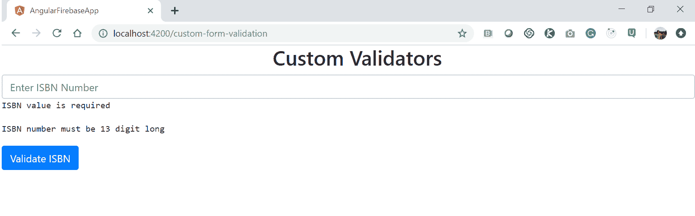

到目前为止，在本章中，我们已经应用了一些现成的方法，思考并学习如何构建自定义指令和自定义表单验证。我们还了解到，轻松地将它们集成到现有或任何新的应用程序中是多么容易。所有这些也可以构成单页应用程序的一部分。等待什么单页应用程序？那是什么？在下一节中，我们将学习所有关于单页应用程序的知识，并构建我们自己的应用程序。


# 构建单页应用程序


在本节中，我们将学习如何构建单页应用程序

**单页应用程序到底是什么？**

单页应用程序是通过动态重写当前页面而不是从服务器加载全新页面来与用户交互的 web 应用程序或网站。

将其视为只有一个 HTML 文件的应用程序，页面内容根据用户的请求动态加载。我们只创建在运行时在浏览器中动态呈现的模板

让我给你举个好例子。

在[第 15 章](15.html)*部署 Angular 应用程序*中，我们使用`ng build`命令生成 Angular 应用程序的编译代码。

看看 Angular 生成的编译源代码：


在前面的屏幕截图中，您将只看到一个名为`index`的 HTML 文件。

继续打开文件，你会看到它是空白的。这是因为 Angular 应用程序是单页应用程序，这意味着内容和数据将根据用户操作动态生成。

It's safe to say that all Angular applications are single-page applications.

以下是构建单页应用程序的一些优点：

*   页面是动态呈现的，因此我们的应用程序源代码是安全的。
*   当编译的源代码在用户浏览器中呈现时，页面的加载速度比传统的请求和响应模型快得多。
*   由于页面加载速度更快，这将带来更好的用户体验。
*   使用`Router`组件，我们只加载某些功能所需的组件和模块，而不是一次性加载所有模块和组件。

在本书的整个过程中，我们创建了许多 Angular 应用程序，每一个都是一个单页应用程序。


# 用户身份验证


在本节中，我们将学习如何在应用程序中实现用户身份验证。

在广泛的上下文中，用户身份验证包括将用户安全地登录到我们的应用程序，用户应该能够在安全页面上查看、编辑和创建数据，最后注销应用程序！

在现实世界的应用程序中，需要进行大量额外的检查和安全实现，以清理用户输入，以及检查用户输入是否为有效用户，或验证会话超时的身份验证令牌，以及其他数据检查，以确保应用程序中没有不良元素。

以下是一些重要的用户身份验证模块：

*   注册新用户
*   现有用户的登录
*   密码重置
*   登录用户的会话管理
*   一次性密码或双重身份验证
*   注销已登录的用户

在接下来的部分中，我们将了解如何使用 Firebase 和 Auth0 框架实现上述功能。


# 使用 Firebase 进行用户身份验证


在本节中，我们将学习如何使用 Firebase 实现用户身份验证。

**什么是火基？**

Firebase 是谷歌提供的托管服务。Firebase 为我们提供了分析、数据库、消息和崩溃报告等功能，因此我们可以快速移动并专注于我们的用户。您可以在[了解有关该服务的更多信息 https://firebase.com](https://firebase.com) 。现在，让我们直接进入并在 Angular 应用程序中实现 Firebase。

第一步是创建一个使用 Firebase 服务的 Google 帐户。您可以使用您的 Google 帐户登录 Firebase。成功创建 Firebase 帐户后，您将看到以下输出：


要创建新项目，请单击“添加项目”链接。

您将看到以下对话框窗口，提示您输入项目名称；在我们的案例中，我们将使我们的项目名称自动停止：

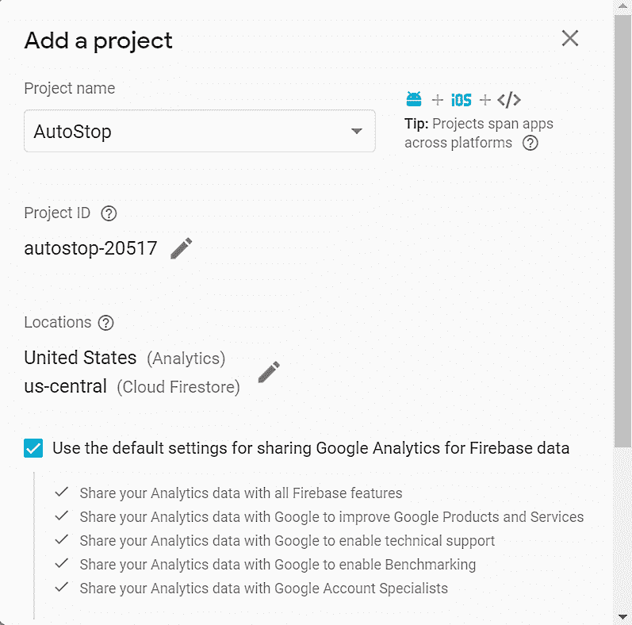

请注意，Google 将为您的项目分配一个唯一的项目 ID。

现在，单击左侧菜单上的“身份验证”链接以设置用户身份验证功能，我们可以在 Angular 应用程序中嵌入并设置这些功能：

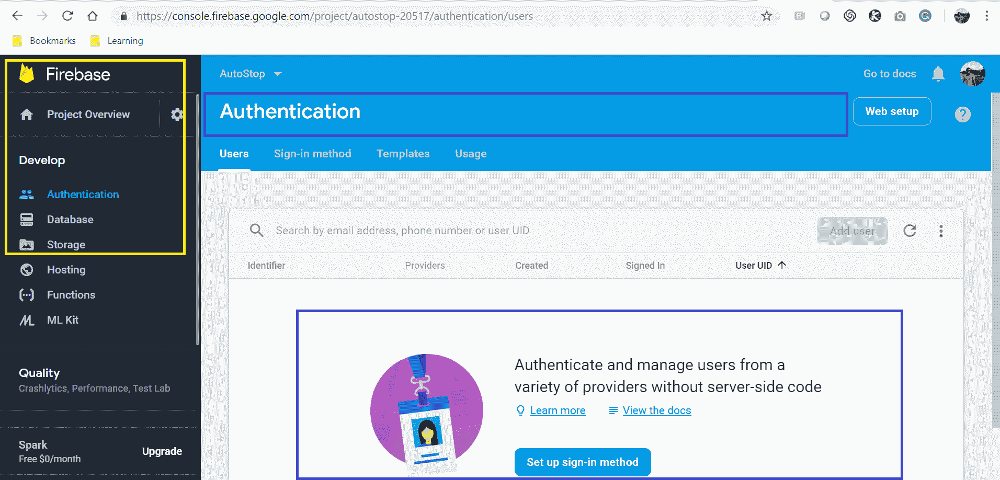

我们可以在这里做很多其他很酷的事情，但我们现在将重点关注身份验证模块。

现在，单击“登录方法”选项卡以设置如何允许用户登录到我们的 Angular 应用程序的选项：

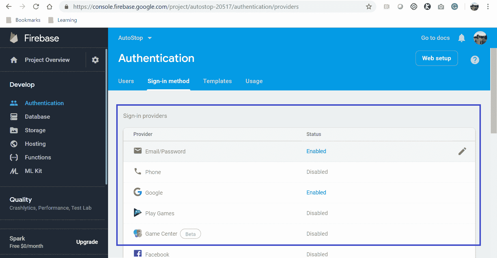

在前面的屏幕截图中，您将注意到以下重要事项：

*   Google Firebase 提供了我们可以启用的各种选项，我们希望我们的应用程序的用户能够通过这些选项登录。
*   我们需要单独启用每个提供者选项。
*   我们在应用程序中启用了电子邮件/密码和谷歌选项。
*   为了启用 Facebook、Twitter 和其他应用程序，我们需要输入相应服务提供的开发者 API 密钥。

现在，在页面上向下滚动一点，您将看到一个名为“授权域”的设置选项。

我们将看到在 Firebase 应用程序上设置了两个默认值，即 localhost 和唯一子域，如以下屏幕截图所示：


我们已经做了必要的修改。现在，我们需要设置 Google Firebase 的应用程序设置。是时候在我们的应用程序中实现用户身份验证了。

**前提条件：**我们希望用户能够启动并运行一个角度应用程序。

打开 Angular CLI 命令提示符；我们需要安装一些模块。我们需要首先安装 Angular Fire2 和 Firebase：

Please note that Angular Fire2 is now Angular Fire.

我们需要运行以下命令才能在应用程序中安装 Angular Fire：

```ts
npm install angularfire2 
```

成功执行上述命令后，我们将看到以下屏幕截图中显示的输出：

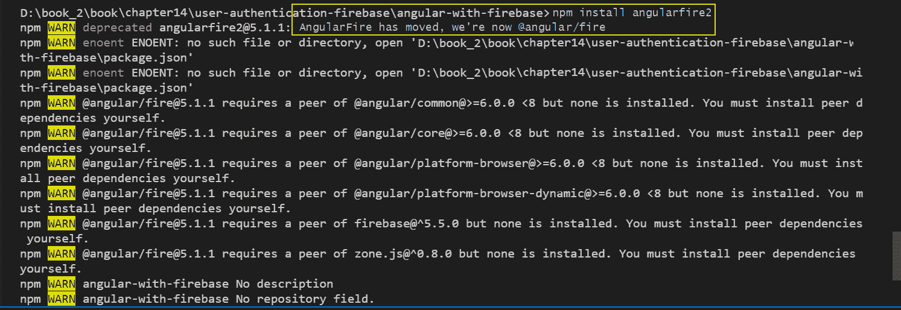

全部设置。现在，我们需要创建一个服务来处理我们的身份验证功能：

```ts
ng g service appAuth
```

使用`ng`命令，我们正在生成一个名为`appAuth`的新服务：

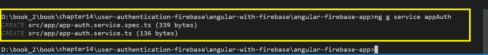

现在，修改`appAuth.service.ts`文件并添加以下代码：

```ts
import { Injectable } from '@angular/core';
import { AngularFireAuth } from '@angular/fire/auth';
import { auth } from 'firebase/app';
import { Router } from '@angular/router';

@Injectable({
providedIn: 'root'
})
export class AppAuthService {

    private authUser:any;
    private authState:any;
    private loggedInUser = false;
    private userToken ='';

constructor(public afAuth: AngularFireAuth, private router :Router) { }

login() {
this.afAuth.auth.signInWithPopup(new auth.GoogleAuthProvider());

this.loggedInUser = true;

this.afAuth.currentUser.getIdToken(true).then(token => this.userToken = token);

this.afAuth.authState.subscribe((auth) => {
this.authState = auth;
});

this.router.navigate(['/profile']);
}

isLoggedInUser(){
if(this.userToken != '')
return true;
else 
return false;
}

logout() {
this.afAuth.auth.signOut();
this.loggedInUser = false;
this.userToken = '';
}

}
```

在前面的代码中，我们正在对`app-auth.service.ts`文件进行更改。应注意以下要点：

*   我们正在将所需的类，即`AngularFireAuth`、`Auth`和`Router`导入到服务中。
*   使用`@Injectable`，我们指定在角树结构的根级别注入服务。
*   我们正在定义几个私有变量，这些变量将在应用程序中使用。
*   在构造函数方法中，我们正在注入`AngularFireAuth`和`Router`类。
*   我们定义了三种方法：`Login`、`Logout`和`isLoggedInUser`。

*   在`login`方法中，我们使用`this.afAuth`实例，调用`signInWithPopup`方法，并传递`auth.GoogleAuthProvider`参数，这是我们从本地安装的 Firebase 应用程序获得的：

```ts
this.afAuth.auth.signInWithPopup(new auth.GoogleAuthProvider());
```

*   当调用此方法时，将打开一个新窗口，在其中我们可以看到 Google 登录选项，使用该选项我们可以登录到应用程序。
*   我们正在将`this.loggedInUser`变量设置为`true`。
*   我们正在将登录用户的令牌设置为`this.userToken`变量
*   我们也在订阅以获得`authState`响应。
*   最后，使用路由器实例和`navigate`方法，我们将用户重定向到配置文件页面。
*   在`isLoggedInUser`方法中，我们正在验证`userToken`是否已设置。如果用户正确登录，则设置`userToken`；否则，该方法将返回`false`。
*   在`logout`方法中，再次使用`afauth`实例调用`signout`方法，将用户注销。
*   最后，我们将`userToken`设置为`empty`。

令人惊叹的我们已经完成了`app-auth.service.ts`文件中所有的繁重工作。现在，是时候在我们的组件中调用这些方法了：`login`、`profile`和`log out`。

在`login.component.html`文件中，我们将添加以下登录表单：

```ts
<div *ngIf="!_appAuthService.loggedInUser">
<form [formGroup]="loginForm" (ngSubmit)="onSubmit()">

<label>
First Name:
<input type="text" formControlName="firstName">
</label>

<label>
Last Name:
<input type="text" formControlName="lastName">
</label>

<button>Login</button>

</form>
</div>
```

在前面的代码中，我们只是使用`FormGroup`和`FormControllers`添加了一个响应式登录表单。

登录表单的输出如以下屏幕截图所示：


在`profile.component.ts`文件中，我们只是调用`login`方法：

```ts
onSubmit(){
 this._appAuthService.login();
 console.warn(this.loginForm.value);
 }
```

现在，在`profile.component.ts`文件中，我们添加了一个检查，查看用户是否登录：

```ts
<div *ngIf="_appAuthService.isLoggedInUser">
<p>
profile works!
</p>

User Token is {{_appAuthService.userToken}}
</div>
```

当用户导航到配置文件页面时，如果他们已登录，他们将看到详细信息；否则，用户将被重定向到登录页面。

现在，进入最后一部分；我们的`app.component.html`文件中将有一个注销链接：

```ts
<nav>
 <a routerLink='/login' *ngIf="!_appAuthService.isLoggedInUser()">Login</a>
 <a routerLink='/register'>Register</a>
 <a routerLink='/logout' *ngIf="_appAuthService.isLoggedInUser()">Logout</a>
</nav>
```

我们正在添加带有`*ngIf`条件的链接，以显示用户登录与否时对应的链接：

```ts
 ngOnInit() {
 this._appAuthService.logout();
 this.router.navigate(['/login']);
 }
```

当用户点击注销链接时，我们调用`appAuthService`的注销方法，成功注销后，我们将用户重定向回登录页面。

现在，让我们使用[T0]命令运行应用程序。我们应该看到以下输出：

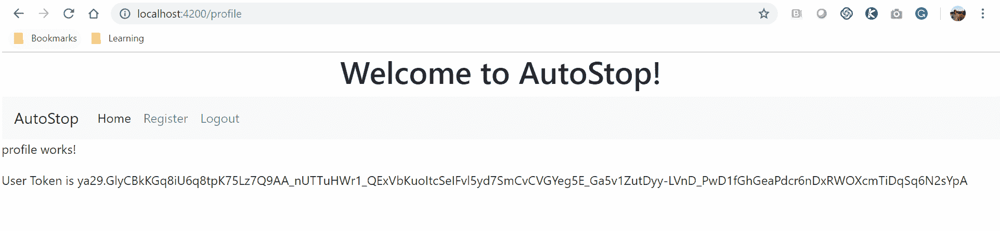


# 使用 Auth0 进行用户身份验证


在本节中，我们将学习如何使用 Auth0 实现用户身份验证。在我们继续在 Angular 应用程序中实现 Auth0 之前，我们需要实现一些先决条件。让我们开始吧：

1.  首先，我们需要在 Auth0.com 上使用 Auth0 创建一个帐户。成功登录帐户后，我们将看到以下仪表板屏幕：


我们必须注册我们的应用程序，以便我们可以创建在我们的应用程序中实现`Auth0`所需的设置。

2.  单击左侧菜单上的应用程序链接：


3.  现在，单击“创建应用程序”按钮创建应用程序：

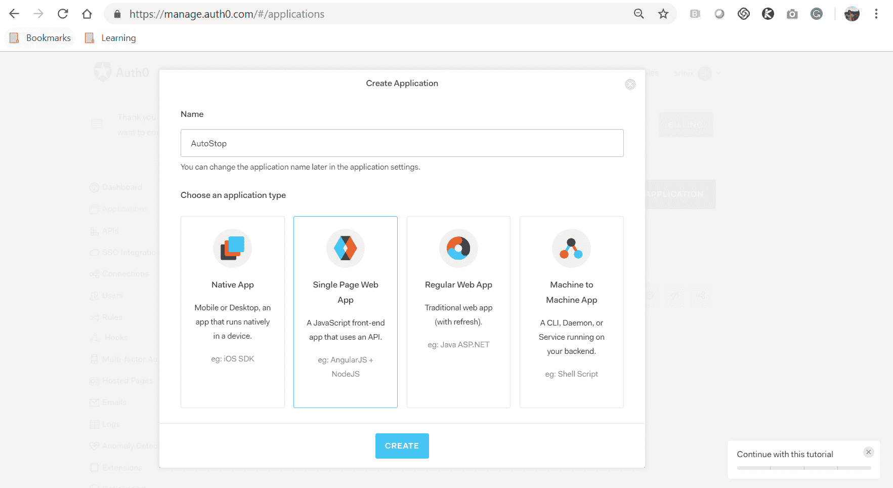

4.  我们需要输入应用程序的名称并选择我们正在构建的应用程序的类型。在我们的例子中，它是一个单页 Web 应用程序，所以请继续选择该选项并单击 CREATE 按钮。
5.  接下来我们需要做的是更新应用程序的重要设置。因此，单击应用程序名称并导航到“设置”选项卡：

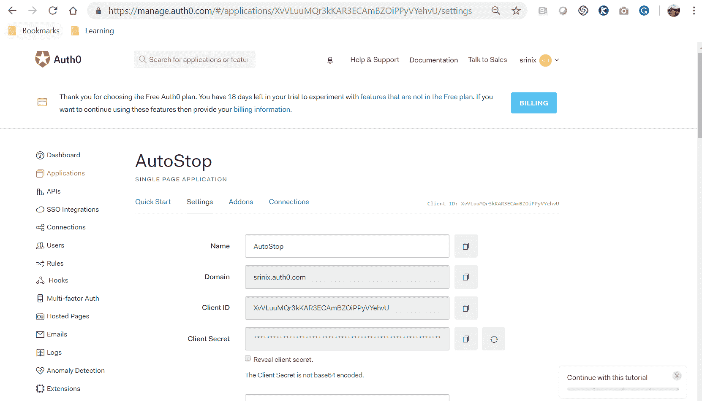

以下是一些需要记住的重要事项：

*   我们需要更新允许的回调 URL、允许的 Web 源和允许的源（COR）。
*   如果我们确实更新了允许的 Web 来源和允许的来源的详细信息，我们将得到一个跨来源请求（CORS）错误。

我们已经在 Auth0 中调整了所需的设置，因此现在可以在应用程序中实现 Auth0。

为了在我们的应用程序中实现 Auth0，我们需要安装几个模块，即`auth0-js`、`auth0-lock`和`angular2-jwt`：

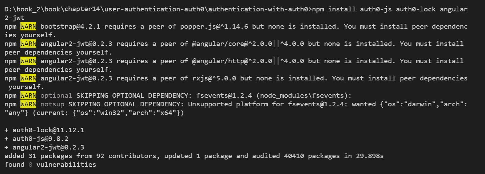

在前面的屏幕截图中，我们使用`npm install`命令安装了所需的`Auth0`模块。现在，是时候为我们的应用程序生成服务和组件了。

首先，我们需要提供我们的服务；我们叫它`authService`。我们需要运行以下命令来生成服务：

```ts
ng g service services/auth
```

成功执行上述命令后，我们将看到以下输出：

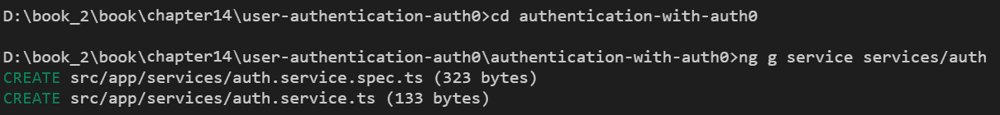

我们可以验证并确认我们的服务已经生成，以及 spec 文件（用于编写测试规范的文件）。现在我们已经创建了服务，是时候生成组件了。我们将使用`ng`CLI 运行以下命令，以生成所需的组件：

```ts
ng g c login
ng g c profile
```

成功执行上述命令后，我们将看到以下输出：

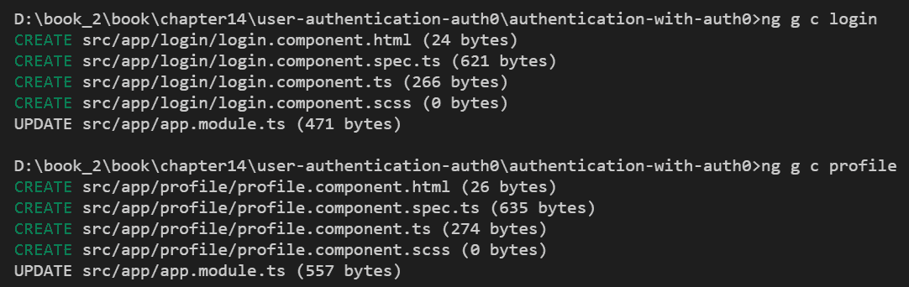

在前面的屏幕截图中，我们可以验证并确认我们所需的组件，即`login`和`profile`已成功生成。现在，我们可以继续实现组件的功能了。

为了使我们的应用程序更美观，让我们同时安装`bootstrap`CSS 框架：

```ts
npm i bootstrap 
```

我们还需要安装`jquery`模块：

```ts
npm i jquery 
```

成功执行上述命令后，我们将看到以下输出：

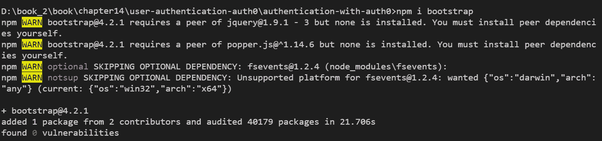

超级酷。现在，是时候在`Nav`组件中添加几个链接了：

```ts
<nav class="navbar navbar-expand-lg navbar-light bg-light">
 <a class="navbar-brand" href="#">Auth0</a>
 <button class="navbar-toggler" type="button" 
    data-toggle="collapse" data-target="#navbarSupportedContent" 
    aria-controls="navbarSupportedContent" aria-expanded="false" 
    aria-label="Toggle navigation">
 <span class="navbar-toggler-icon"></span>
 </button>

<div class="collapse navbar-collapse" id="navbarSupportedContent">
 <ul class="navbar-nav mr-auto">
      <li class="nav-item active">
        <a class="nav-link" href="#">Home 
         <span class="sr-only">(current)</span></a>
      </li>
      <li class="nav-item">
        <a class="nav-link" *ngIf="!authService.isLoggedIn();" 
           (click)="authService.login()">Login</a>
      </li>
      <li class="nav-item">
        <a class="nav-link" *ngIf="authService.isLoggedIn();" >Profile</a>
      </li>
      <li class="nav-item">
        <a class="nav-link" *ngIf="!authService.isLoggedIn();"
           href="#">Register</a>
      </li>
       <li class="nav-item">
        <a class="nav-link" *ngIf="authService.isLoggedIn()" 
           (click)="authService.logout()">Logout</a>
      </li>
    </ul>
 </div>
</nav>
```

在上述代码中，应注意以下要点：

*   我们正在使用引导的`nav`组件。
*   我们正在添加一些链接并附加一个单击事件，例如登录和注销，具体取决于用户的状态。如果用户登录，我们将显示注销链接，否则我们将显示注册链接
*   我们将在 nav.component.ts 文件中实现这些方法。
*   我们使用`*ngIf`检查用户是否登录，并相应切换登录和注销链接

上述代码的输出如以下屏幕截图所示：

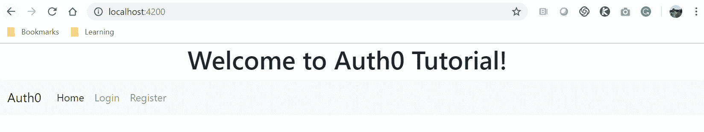

我们现在需要处理我们生成的`auth`服务。在`services/auth.service.ts`文件中，我们需要先导入所需的模块，然后添加我们的方法`login`和`logout`：

```ts
import { tokenNotExpired } from 'angular-jwt';
import { Auth0Lock} from 'auth0-lock';
```

一旦我们导入了`Auth0Lock`和`TokenNotExpired`类，我们将创建实例以便使用它们。

请看基本的`Auth0Lock`对象实例创建代码：

```ts
var lock = new Auth0Lock( 
'YOUR_CLIENT_ID',
'YOUR_AUTH0_DOMAIN' 
);
```

为了创建`Lock`类的新对象，我们需要将客户端 ID 和域名传递给实例。

让我们在`auth.service.ts`文件中实现这一点：

```ts
public _idToken: string;
private _accessToken: string;
private _expiresAt: number;

 lock = new Auth0Lock('XvVLuuMQr3kKAR3ECAmBZOiPPyVYehvU','srinix.auth0.com',{
 allowedConnections: ["Username-Password-Authentication","google-oauth2"],
 rememberLastLogin: false,
 socialButtonStyle: "big",
 languageDictionary: {"title":"Auth0"},
 language: "en",
 responseType: 'token id_token',
 theme: {}
 });
```

在上述代码中，应注意以下要点：

*   我们正在创建三个变量，即`_idToken`、`_accessToken`和`_expiresAt`。
*   我们正在创建一个`Auth0Lock`实例，需要将参数传递给对象。
*   `Auth0Lock`对象需要传递两个必需的参数。第一个参数是`ClientId`，第二个参数是域名。
*   第三个参数包括选项，如`allowedConnections`、主题等，因为它说它们是可选的。
*   可以从 Auth0 应用程序设置中获取客户端 Id 和域，如以下屏幕截图所示：

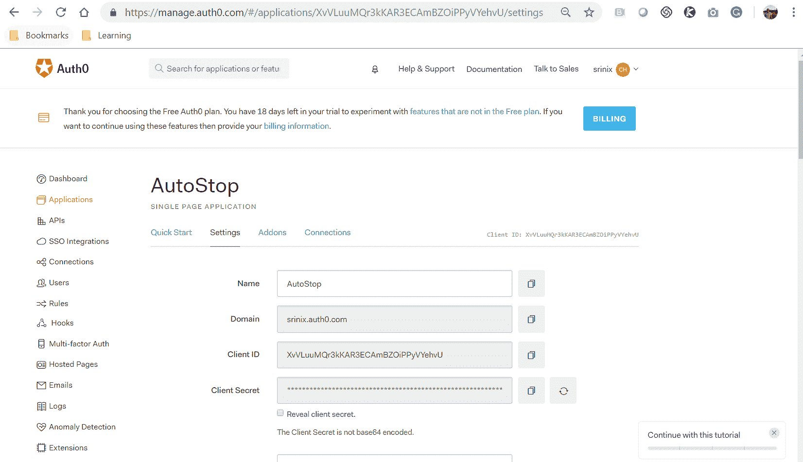

我们现在可以收听附属于`lock`对象的事件：

```ts
constructor(private router: Router) {

this.lock.on('authenticated', (authResult: any) => {
localStorage.setItem("userToken", authResult.accessToken);
this.router.navigate(['/profile']); 
});

this.lock.on('authorization_error', error => {
console.log('something went wrong', error);
});

}
```

在前面的代码中，我们正在执行以下步骤：

1.  在`constructor`方法中，我们正在收听`authenticated`和`authorization_error`状态的`on`事件。
2.  当我们从`lock`实例获得经过身份验证的消息时，我们正在存储一个名为`userToken`的`localStorage`项，并将`accessToken`设置为其值。
3.  我们还将侦听错误消息并将消息记录在控制台中。

现在是实施`login`和`logout`方法的时候了：

```ts
login() {
 this.lock.show(function(err, profile, token){
 console.log(err);
 console.log(profile);
 console.log(token);
 });
 }
```

在`login`方法中，我们调用`lock`对象的`show`方法。这将使您进入 Auth0 对话框，其中包含登录、注册或不记得密码的选项？如果您选择了社交选项，登录对话框将具有社交选项。

对于`logout`方法，我们只需清除用户登录时设置的`userToken`并将用户重定向回登录主页：

```ts
logout(){
localStorage.setItem('userToken','');
this.router.navigate(['/']);
}
```

一旦我们清除`userToken`，应用程序将知道用户未登录。

我们已经实现了`login`和`logout`方法，但是我们还需要一种方法来检查用户是否登录：

```ts
 isLoggedIn() {
 var token = localStorage.getItem('userToken');
 if(token != '')
 {
 return true;
 }
 else {
 return false;
 }
 }
```

在`isLoggedIn`方法中，我们正在检查本地存储中`userToken`变量的值是否已设置。如果设置了该值，则表示用户已登录；否则，用户不会登录。

只需将服务导入我们的`app.component.ts`文件并注入构造函数即可：

```ts
import { Component } from '@angular/core';
import { AuthService } from './services/auth.service';

@Component({
 selector: 'app-root',
 templateUrl: './app.component.html',
 styleUrls: ['./app.component.scss']
})
export class AppComponent {
 title = 'Auth0 Tutorial';
 userToken:string;

 constructor(private authService: AuthService) {}
}
```

就这样。那不是很简单吗

我们应该看到以下输出：

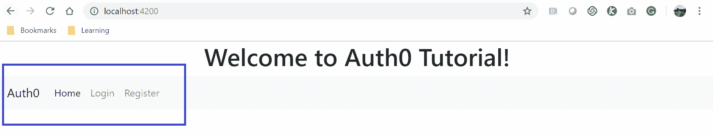

如果单击登录链接，我们将看到弹出的 Auth0 对话框窗口：

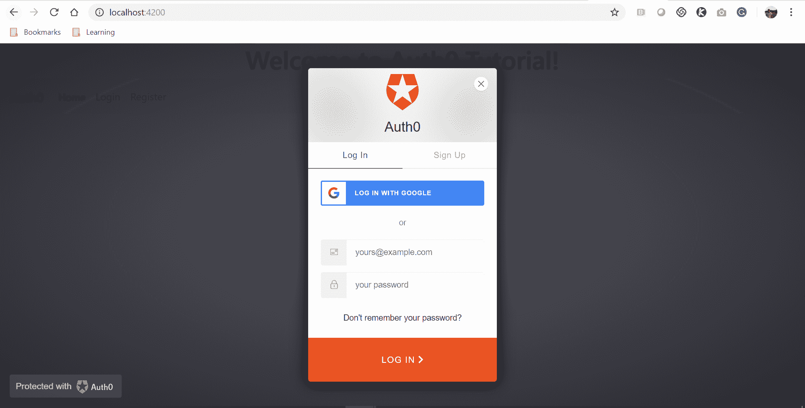

现在，继续并单击“注册”选项卡创建一个帐户，成功注册后，您将看到该用户也已添加到 Auth0 仪表板：


成功登录后，我们应该只看到注销链接，如以下屏幕截图所示：

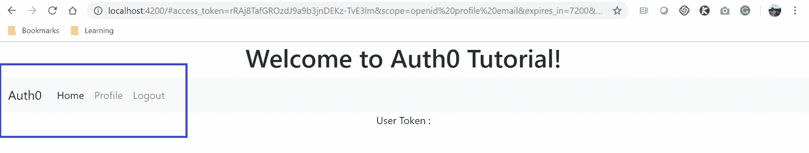

当我们单击注销链接时，用户应返回默认登录页，并应看到登录和注册选项。另外，请注意 URL 中提供的参数，如[T0]，等等。

令人惊叹的我们刚刚在应用程序中使用 Auth0 实现了整个用户身份验证。


# 总结


在本章中，我们学习了一些高级的角度主题，从创建太酷的自定义指令到扩展本机 HTML 元素的行为。我们还创建了自定义表单验证，这在开发具有大量验证和法规遵从性需求的非常复杂的应用程序时非常有用。我们深入到有角度的单页应用程序中，研究它们是如何工作和行为的。我们通过本机代码在 Angular 应用程序中实现了用户身份验证。

我们还学习了如何使用可用的框架（即 Firebase 和 Auth0）构建和实现安全的用户身份验证管理系统。然后，我们学习了如何实现登录、注册和注销功能，以确保能够保护应用程序的数据和功能。现在，我们已经掌握了前面的概念，可以很好地实现完整的有线端到端角度应用程序。

现在，我们已经了解了如何开发角度应用程序，我们的应用程序和实际用户之间的唯一区别就是应用程序的部署。这是我们下一章的重点。在本书的下一章也是最后一章中，我们将学习部署角度应用程序的所有内容